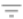

1. # 管道标签

   管道标签标识相似的管道或管道片段。在管道存储库中查看管道和片段时，可以使用管道标签轻松搜索和过滤管道和片段。

   您可以在Control Hub 管道设计器或创作数据收集器中设计管道和片段时，将管道标签分配给管道和片段。使用管道或片段的“常规”选项卡上的“标签”属性配置管道标签。

   **注意：**标签`templates`保留用于创建用户管道模板。请参阅[管道模板](https://streamsets.com/documentation/controlhub/latest/help/controlhub/UserGuide/Pipelines/PipelineTemplates.html#concept_wms_j5t_1jb)。

   管道标签不同于您在Control Hub中分配给Data Collector和Edge Data Collector的标签。管道标签是可选的。您可以使用管道标签来过滤列表中查看的管道和片段。

   需要数据收集器和 数据收集器边缘（SDC Edge）标签。他们确定哪个执行Data Collector或 Edge Data Collector运行每个管道。

   如果您分配管道标签组管道和片段，您可以在指定标签执行使用相同的分组数据采集 S和边缘数据采集器的控制中枢。或者，您可以使用完全不同的分组。有关Data Collector，Edge Data Collector和作业的标签的更多信息 ，请参阅[标签概述](https://streamsets.com/documentation/controlhub/latest/help/controlhub/UserGuide/Labels/Labels.html#concept_lxv_zhf_gw)。

   要在“管道”视图或“管道片段”视图上显示管道标签，请单击“ **更多”**图标（），然后单击“ **显示标签”**。

   要按标签过滤管道或片段，请单击“ **切换过滤器列”**图标（），然后选择要作为过滤依据的标签。

   ## 删除管道标签

   您可以使用Control Hub从管道存储库中删除不再分配给任何管道或片段的管道标签。Control Hub不允许您删除正在使用的标签。

   例如，假设您将一个管道发布到Control Hub ，该管道具有已分配的管道标签“ LabelA”。没有为Control Hub 管道存储库中的其他管道分配管道标签“ LabelA”。您删除分配给“ LabelA”的管道的所有版本。当您单击“ **切换过滤器列”**图标（）以按标签过滤管道时，即使未将“ LabelA”分配给资源库中的任何管道，该标签也会被列为可用过滤器。您可以从Control Hub删除此标签。

   **注意：**要删除标签或分配新标签，请在管道或片段的“常规”选项卡上配置“标签”属性。

   要删除不再使用的管道标签：

   1. 在导航面板中，单击**管道存储库**> **管道**。
   2. 单击“ **更多”**图标（），然后单击“ **管理管道标签”**。
   3. 选择未分配给管道或片段的管道标签，然后单击“ **删除”**图标：。
   4. 在确认窗口中，单击**删除**。