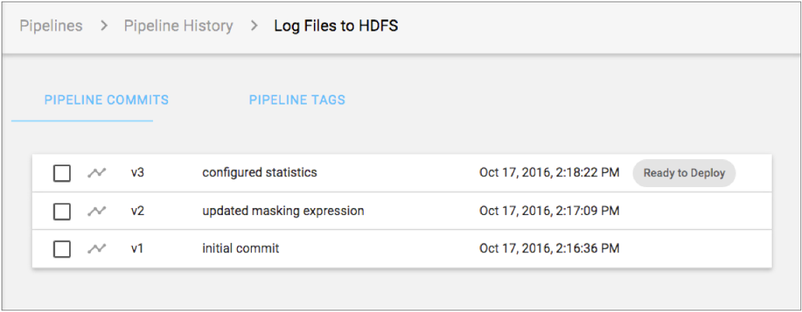
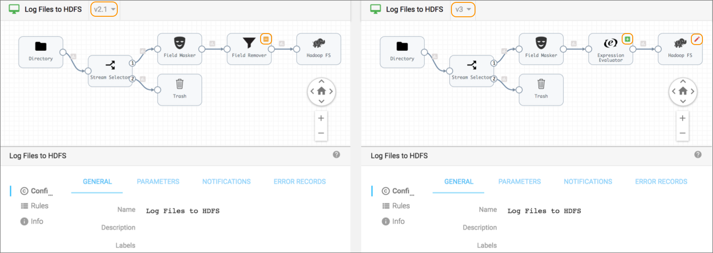

# 版本记录

典型的管道或管道片段开发周期涉及迭代更改。管道存储库维护每个管道和片段的版本历史记录。

当您首次在Pipeline Designer中创建管道或片段时，它以草稿状态开始，以便您可以配置对象。草稿对象版本为<version> -DRAFT，例如v1-DRAFT或v2-DRAFT。完成管道的编辑后，发布管道以指示它是最终的并且可以添加到作业中。发布片段以使其可用于测试或在管道中使用。

已发布的管道和片段按编号进行版本控制，例如v1或v2。您不能编辑已发布的对象。查看发布的版本时，可以单击“编辑”以基于画布中显示的版本创建新版本。

要查看管道的历史记录，请在“管道”视图中选择一个管道，然后单击“ **历史记录”**图标：。要查看片段的历史记录，请在“管道片段”视图中选择片段，然后单击“ **历史记录”**图标。

版本历史记录显示所选对象的以下信息：

- 管道提交

  显示管道或片段的每个版本以及版本号和提交消息。在Control Hub中，您可以查看和比较版本。您可以将任何管道版本添加到作业。或者，如果发现必须回滚到以前的管道版本，则可以编辑现有作业以使用以前的版本。您可以获取管道的先前版本，然后在Pipeline Designer中继续编辑该先前版本。同样，您可以将任何版本的管道片段添加到管道中。并且您可以编辑管道以在需要时使用其他版本。您还可以编辑片段的先前版本以创建新版本。如果编辑然后发布对象的先前版本，则控制中心将更新次要版本号，而不是主要版本号。

  例如，您有一个带有三个版本的管道。您将获得管道的版本2，在Pipeline Designer中编辑管道，然后再次发布管道。Control Hub 将当前管道的版本设置为v2.1。因此，您现在拥有管道的四个版本，管道的版本2.1标记为当前版本：v2.1v3v2v1

- 管道标签

  显示为管道或片段定义的所有标签。将标签分配给管道版本或片段版本以区分版本。您可能想要在版本中添加标签以标记发布点或分离开发和生产环境。例如，当您完成片段的第一个版本的开发时，可以在该版本中添加“准备测试”标签。然后，当片段通过集合时，可以使用“准备使用”标签。这些标签清楚地告知数据工程师，哪些片段已准备好在开发管道中进行测试或在生产管道中使用。

  同样，在准备生产时，可以为管道使用“准备部署”标签。下图显示了具有三个版本的示例管道的历史记录，并且将“准备部署”标签应用于最新版本：

## 比较版本

您可以比较管道或管道片段的两个版本。比较版本时，Control Hub在画布中并排显示版本，突出显示版本之间的差异。您可以比较管道或片段配置属性以及管道或片段中的所有阶段。

1. 要比较管道版本，请在“导航”面板中，单击“ **管道存储库”** >“ **管道”**。

   要比较片段版本，请在“导航”面板中，单击“ **管道存储库”** >“ **管道片段”**。

2. 要比较两个最新版本，请将鼠标悬停在管道或片段上，然后单击“ **与以前的版本比较”**图标：。

   或者要比较任何两个版本，请在列表中选择管道或片段，然后单击“ **历史记录”**图标：。选择要比较的两个版本，然后单击“ **与以前的版本比较”**图标：。

   Control Hub在比较窗口中并排显示两个版本，并使用删除，添加或更新的图标突出显示任何差异，如下所示：

   

   您可以深入了解每个阶段的详细信息，并在版本之间比较每个阶段的配置。

   完成版本比较后，单击管道版本之一的名称以在管道画布中打开该版本。

## 使用管道标签

您可以创建标记并将其分配给管道和片段的版本，以区分版本。您还可以从版本的管道和片段中删除标签。

1. 要为管道版本创建标签，请在“导航”面板中，单击“ **管道存储库”** >“ **管道”**。

   要为片段版本创建标签，请在“导航”面板中，单击“ **管道存储库”** >“ **管道片段”**。

2. 在列表中选择管道或片段，然后单击“ **历史记录”**图标：。

3. 在“ **管道提交”下**，将鼠标悬停在要为其创建标签的版本上，然后单击“ **创建标签”**图标： 。

4. 输入标签的名称和消息。

   在标记消息中，说明将标记添加到此版本的原因。

5. 点击**创建标签**。

   控制中心将在版本旁边显示标签。

6. 要查看为所选管道创建的所有标签，请单击“ **管道标签”**选项卡。

   要从所选管道中**删除标签**，请在“ **管道标签”**选项卡上单击“ **删除标签”**图标（）。

7. 要查看为所选片段创建的所有标签，请单击“ **管道片段标签”**选项卡。

   要从所选片段中删除标签，请在“ **管道片段标签”**选项卡上，单击“ **删除标签”** 图标。