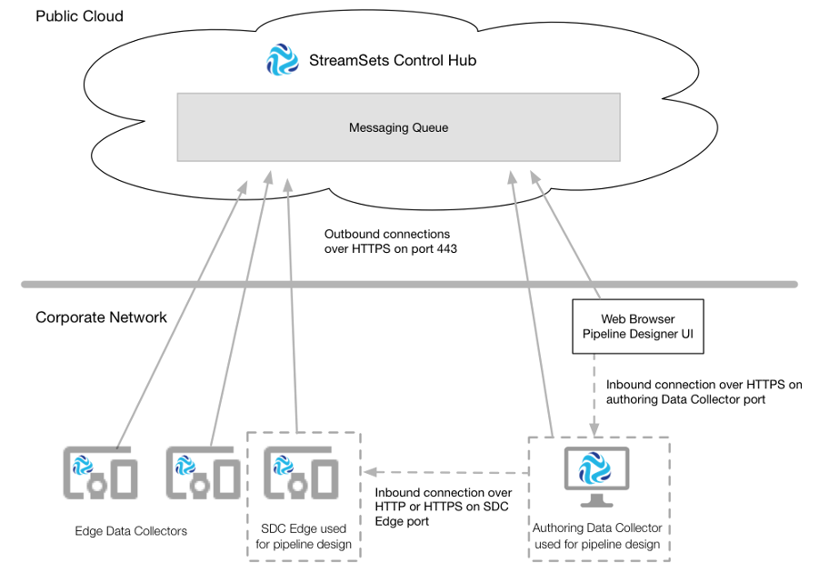

# SDC边缘通讯

StreamSets Control Hub 与Data Collector Edge （SDC Edge）一起执行边缘管道。SDC Edge是一种轻量级代理，可在资源有限的边缘设备上运行管道。

您将每个SDC Edge安装在公司网络中的边缘设备上，然后进行注册以与Control Hub一起使用。

您可以使用创作数据收集器来设计边缘管道。选择可用的创作数据收集器后，可以在Control Hub 管道设计器中设计边缘管道。或者，您可以直接登录到创作数据收集器以使用数据收集器 UI 设计边缘管道。

要在设计边缘管道时对其进行预览和验证，创作数据收集器 必须连接到已注册的SDC Edge。所述SDC边缘接受来自创作入站连接数据收集器 上配置的端口号通过HTTP或HTTPS SDC边缘。

注册边缘数据收集器使用加密的REST API与Control Hub进行通信。 边缘数据收集器 通过HTTPS在端口号443上启动到Control Hub的出站连接。

下图显示了每个SDC Edge如何 与Control Hub和创作Data Collector通信：

## SDC边缘请求

就像Data Collector一样，已注册的SDC Edge将请求和信息发送到Control Hub。

Control Hub不会直接将请求发送到SDC Edge。相反，Control Hub 使用加密的REST API将请求发送到Control Hub管理的消息队列。一个 SDC边缘定期与队列检查，以获取控制集线器 请求。

SDC Edge在以下区域 与Control Hub进行通信：

- 指标

  每分钟，SDC Edge都会将远程运行的边缘管道的指标直接发送到Control Hub。

- 消息队列

  边缘数据收集器将以下信息发送到消息传递队列：在启动时，一个SDC边缘发送以下信息：SDC边缘版本，在HTTP网址SDC边缘和标签，在配置SDC边缘的配置文件，edge.conf。每隔五秒钟，SDC Edge会发送一个心跳信号，以及远程边缘管道的任何状态更改。每分钟，SDC Edge都会发送远程运行的边缘管道的最后保存的偏移量以及所有运行的边缘管道的状态。

  每三秒钟，Control Hub就会检查消息传递队列，以检索管道状态更改和每个SDC Edge发送的最后保存的偏移量。

  每隔五秒，每个SDC Edge都会检查邮件队列以检索Control Hub发送的请求。当您启动，停止或删除作业时，控制中心将对特定SDC Edge的管道请求发送到消息传递队列。消息队列将保留请求，直到接收方SDC Edge检索到请求为止。