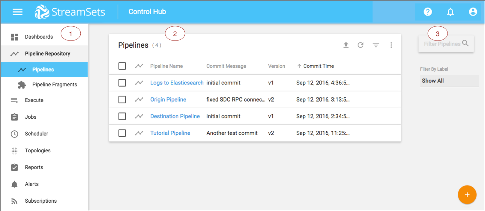
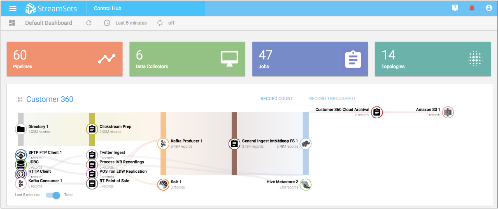
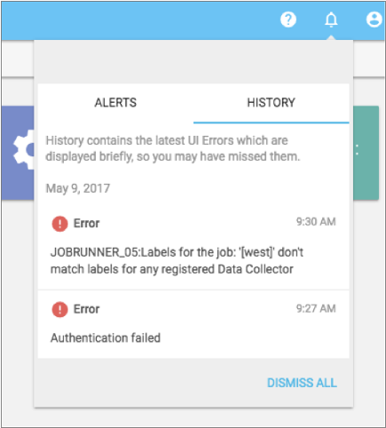
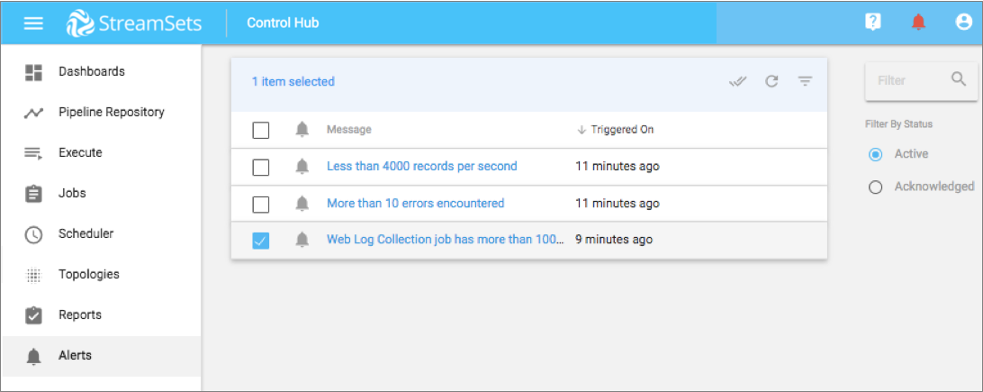

# 控制集线器用户界面

StreamSets Control Hub 提供了一个基于Web的用户界面（UI），用于管理管道存储库和执行组件-包括Data Collector，Transformer，Edge Data Collector，Provisioning Agent和部署。您可以创建作业，拓扑和Control Hub用户，以及管理组织。

该 控制中心 的用户界面包括以下一般领域和图标：

| 区域/图标                                | 名称             | 描述                                                         |
| :--------------------------------------- | :--------------- | :----------------------------------------------------------- |
| 1个                                      | 导航面板         | 列出您可以在Control Hub中管理的区域。                        |
| 2                                        | 视图             | 根据您在“导航”面板中的选择显示以下视图之一：[仪表板](https://streamsets.com/documentation/controlhub/latest/help/controlhub/UserGuide/GettingStarted/DPMUI.html#concept_l5h_kln_5z)视图-提供组织活动的摘要。管道存储库视图-用于访问以下管道存储库视图：[管道](https://streamsets.com/documentation/controlhub/latest/help/controlhub/UserGuide/Pipelines/Pipelines.html#concept_fjn_hrr_px)视图-用于设计管道和管理已发布到Control Hub的管道。[管道片段](https://streamsets.com/documentation/controlhub/latest/help/controlhub/UserGuide/Pipelines/Pipelines.html#concept_otf_z23_4db)视图-用于设计和管理管道片段。执行视图-用于访问以下执行视图：[数据收集器的](https://streamsets.com/documentation/controlhub/latest/help/controlhub/UserGuide/DataCollectors/DataCollectors.html#concept_mwp_fcf_gw)视图-用于管理注册的数据收集器。[变形金刚](https://streamsets.com/documentation/controlhub/latest/help/controlhub/UserGuide/TransformerRegister/Overview.html#concept_d4m_ffd_v3b)视图-用于管理注册的变形金刚。[Edge Data Collector](https://streamsets.com/documentation/controlhub/latest/help/controlhub/UserGuide/DataCollectorEdge/Overview.html#concept_aky_2z3_qbb)视图-用于管理注册的Edge Data Collector。[Provisioning Agents](https://streamsets.com/documentation/controlhub/latest/help/controlhub/UserGuide/DataCollectorsProvisioned/Provisioned.html#concept_jsd_v24_lbb)视图-用于管理自动设置Data Collector容器的Provisioning Agents 。[部署](https://streamsets.com/documentation/controlhub/latest/help/controlhub/UserGuide/DataCollectorsProvisioned/Provisioned.html#concept_jsd_v24_lbb)视图-用于创建和管理定义Data Collector容器的逻辑分组的部署。[作业](https://streamsets.com/documentation/controlhub/latest/help/controlhub/UserGuide/Jobs/Jobs.html#concept_omz_yn1_4w)视图-用于创建和管理作业。[计划程序](https://streamsets.com/documentation/controlhub/latest/help/controlhub/UserGuide/Scheduler/Scheduler.html#concept_w1q_tm3_ldb)视图-用于创建和管理计划的任务。[拓扑](https://streamsets.com/documentation/controlhub/latest/help/controlhub/UserGuide/Topologies/Topologies.html#concept_pvn_d1b_4w)视图-用于创建和管理拓扑。[报告视图](https://streamsets.com/documentation/controlhub/latest/help/controlhub/UserGuide/Reports/DeliveryReports_title.html#concept_lwn_rd5_ndb) -用于创建和管理数据传递报告。[警报](https://streamsets.com/documentation/controlhub/latest/help/controlhub/UserGuide/GettingStarted/DPMUI.html#concept_yhn_24m_5z)视图-用于查看和确认显示在Control Hub UI 中的警报。[订阅](https://streamsets.com/documentation/controlhub/latest/help/controlhub/UserGuide/Subscriptions/Subscriptions.html#concept_crv_tf2_ddb)视图-用于创建订阅，这些订阅监听Control Hub事件，然后在这些事件发生时完成操作。管理视图-用于管理[用户帐户](https://streamsets.com/documentation/controlhub/latest/help/controlhub/UserGuide/GettingStarted/DPMUI.html#concept_x33_jks_3v)，查看[组织详细信息](https://streamsets.com/documentation/controlhub/latest/help/controlhub/UserGuide/OrganizationSecurity/OrgConfig.html#concept_cpq_mvl_1z)以及管理[用户和组](https://streamsets.com/documentation/controlhub/latest/help/controlhub/UserGuide/OrganizationSecurity/UsersGroups.html#concept_slb_cml_wy)。帮助视图-提供对在线帮助的访问。 |
| 3                                        | 筛选栏           | 允许您过滤在选定视图中显示的信息。                           |
|    | 导航面板图标     | 切换“导航”面板的显示。                                       |
|                | 帮助图标         | 提供对联机帮助的访问并显示帮助提示。                         |
|       | 警报图标         | 显示触发的警报和错误消息的历史记录。                         |
|           | 我的帐户图标     | 显示您的帐户详细信息或注销您。                               |
|  | 切换过滤器列图标 | 切换“过滤器”列的显示。                                       |
|              | 添加图标         | 将对象（例如管道，作业或拓扑）添加到所选视图。               |
|              | 导入图标         | 导入已从Data Collector导出的管道。                           |
|             | 刷新图标         | 刷新视图。                                                   |

## 仪表板

“仪表板”视图提供了组织活动的摘要。它列出了您可以访问的管道，数据收集器，作业和拓扑的数量。如果您具有“组织管理员”角色，则仪表板还会列出组织中的用户数。仪表板还显示每个拓扑的摘要记录计数图。

单击仪表板部分之一以显示该对象的视图。或单击拓扑记录计数图以查看该拓扑的详细信息。

下图显示了一个示例仪表板：

## 警报

警报包括已触发的数据SLA和管道警报以及在UI中短暂显示的错误消息。单击警报图标时，您既可以查看触发的警报，也可以查看错误消息的历史记录。您可以从“警报”视图中查看有关已触发警报的详细信息。

单击顶部工具栏中的警报图标（），以查看以下警报：

- 触发数据SLA和管道警报-显示所有尚未确认的触发警报。单击警报以在“警报”视图中管理警报。
- 错误消息的历史记录-显示最近在UI中显示的错误消息。单击错误消息以消除该消息。或者，单击**全部关闭**以关闭所有消息。

**注意：**每个触发的数据SLA警报都会自动显示在“警报”视图中。您还可以选择创建[预订](https://streamsets.com/documentation/controlhub/latest/help/controlhub/UserGuide/Subscriptions/Subscriptions.html#concept_crv_tf2_ddb)以在触发数据SLA警报时执行操作。

下图显示单击警报图标后的错误消息历史记录：

单击“导航”面板中的“警报”视图，以查看和确认触发的警报。您可以按活动或已确认警报筛选视图。

下图在“警报”视图中显示了几个活动警报：

## 我的帐户

使用“我的帐户”窗口查看或更新您的帐户信息。

要管理您的帐户，请在导航面板中单击**管理**> **我的帐户**。或者，单击“ **我的帐户”** 图标，然后单击您的用户名。

您可以在“我的帐户”窗口中管理以下信息：

- 查看您的Control Hub用户ID并查看您所属的组织。

- 修改您的显示名称或电子邮件地址。

- 查看您的用户角色。

  用户角色确定您可以执行的任务。如果需要更改用户角色，请与组织管理员联系。

- 通过单击**更新密码**来**更新密码**。