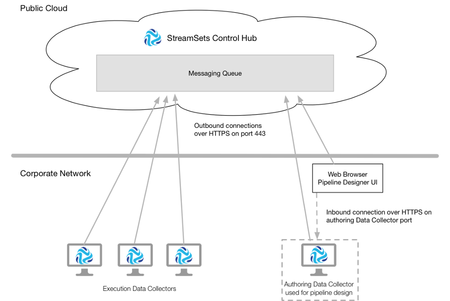

# 数据收集器通讯

StreamSets Control Hub 与Data Collector一起设计管道，并执行独立管道和集群管道。

Control Hub 在StreamSets托管的公共云服务上运行 -您只需要一个帐户即可开始使用。您将Data Collector安装在企业网络中（可以是本地网络也可以在受保护的云计算平台上），然后注册它们以与Control Hub一起使用。

每个注册的数据收集器都具有以下目的之一：

- 创作数据收集器

  使用创作数据收集器来设计管道。 选择可用的创作数据收集器后，可以在Control Hub 管道设计器中设计管道。选定的创作数据收集器确定在Pipeline Designer中显示的阶段，阶段库和功能。

  或者，您可以直接登录到创作数据收集器以使用数据收集器 UI 设计管道。

- 执行数据收集器

  使用执行数据收集器来执行从Control Hub 作业运行的独立管道和群集管道。

单个数据收集器可以同时满足这两个目的。但是，StreamSets建议将每个数据收集器专用为创作或执行数据收集器。

注册数据收集器使用加密的REST API与Control Hub进行通信。 Data Collector通过 端口443上的HTTPS 启动到Control Hub的出站连接。

访问Control Hub Pipeline Designer的Web浏览器使用加密的REST API与Control Hub进行通信。 Web浏览器 通过端口443上的HTTPS 启动到Control Hub的出站连接。

为Pipeline Designer选择的创作数据收集器在为数据收集器配置的端口号上接受来自Web浏览器的入站连接。连接必须是HTTPS。

下图显示了创作和执行Data Collector与Control Hub的通信方式：

## 数据收集器请求

注册数据收集器将请求和信息发送到Control Hub。

Control Hub不会直接将请求发送到Data Collector。相反，Control Hub 使用加密的REST API将请求发送到Control Hub管理的消息队列。 Data Collector定期检查队列以检索控制中心 请求。

数据收集器在以下方面与Control Hub进行通信：

- 管道管理

  当您使用创作数据收集器将管道发布到Control Hub时，Data Collector将请求发送到Control Hub。

- 安全

  当您启用控制集线器一个内数据采集器或当用户登录到注册数据采集器中，数据采集器进行认证请求的控制中枢。

- 指标

  每隔一分钟，执行数据收集器就会将用于远程运行管道的汇总指标发送到Control Hub。

- 消息队列

  数据收集器将以下信息发送到消息传递队列：在启动时，一个数据收集器发送以下信息：数据采集器的版本，网址数据收集，以及在配置标签控制集线器的配置文件，$ SDC_CONF / dpm.properties。当您更新本地管道的权限时，数据收集器将发送更新的管道权限。数据收集器每五秒钟发送一次心跳，并且远程管道的任何状态更改。数据收集器每分钟都会发送一次远程运行管道的最后保存的偏移量以及所有正在运行的管道的状态。

  每三秒钟，Control Hub就会检查消息传递队列，以检索管道状态更改和Data Collector发送的最后保存的偏移量。

  每五秒钟，Data Collector将检查消息传递队列，以检索Control Hub发送的请求和信息 。当您启动，停止或删除作业时，控制中心将对特定执行Data Collector的管道请求发送到消息传递队列。当数据保护已启用，您提交一个分类规则或更新防护策略，控制中心发送更新到消息队列。消息队列保留请求，规则或策略，直到接收方的数据收集器检索到它们为止。

## 集群管道通信

从Control Hub作业运行群集管道时， 安装在网关节点上的Data Collector会启动到Control Hub的出站连接。

当管道以群集批处理或群集流模式运行时， 安装在网关节点上的Data Collector会将作业提交给YARN。这些作业作为Spark流作业或MapReduce作业在群集中的工作节点上运行。Data Collector不需要安装在集群的工作节点上-管道及其所有依赖项都包含在启动的作业中。

在YARN下运行的Data Collector工作进程无法与Control Hub通信。而是，每个Data Collector 工作者将正在运行的管道的指标发送到配置为聚合管道统计信息的系统-Kafka，Amazon Kinesis Streams或MapR Streams。网关数据收集器 从已配置的系统读取并汇总所有管道统计信息，然后将汇总的统计信息发送到 Control Hub。

同样，Data Collector 工作进程将心跳发送回网关Data Collector。网关数据收集器 将每个数据收集器 工作程序的URL发送回Control Hub 消息传递队列。