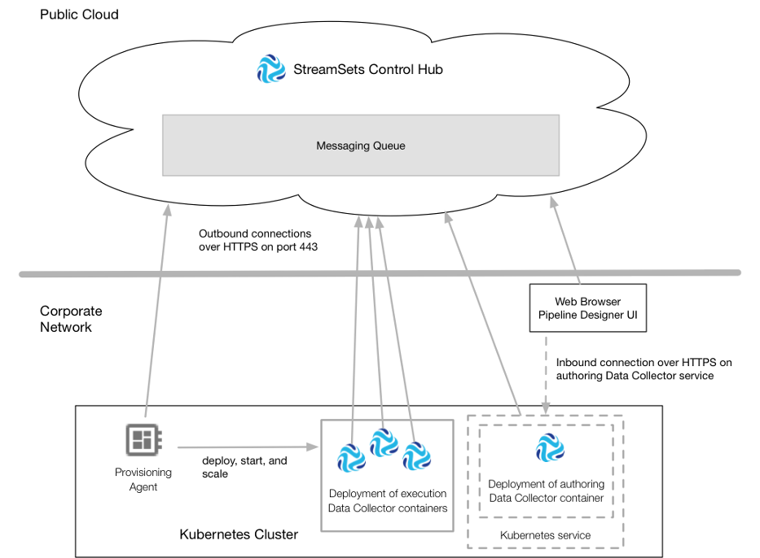

# 配给代理通信

Provisioning Agent是在容器编排框架（例如Kubernetes）中的公司网络中运行的容器化应用程序。该代理会 在其运行的Kubernetes集群中自动配置Data Collector容器。

设置包括部署，启动，扩展和停止Data Collector 容器以与StreamSets Control Hub一起使用。使用资源调配可以减少管理各个Data Collector 安装的开销。

您可以置备创作和执行Data Collector，只要您在唯一的部署中置备它们即可。在供应创作Data Collector时，必须将部署与Kubernetes服务相关联，以将Data Collector 容器公开到集群外部。

创建预配代理并将应用程序部署到容器编排框架之后，预配代理使用加密的REST API与Control Hub进行通信。配给代理 通过端口443上的HTTPS 启动到Control Hub的出站连接。

在Provisioning Agent部署创作或执行Data Collector 容器之后，Data Collector 容器与Control Hub通信的方式与任何[已注册的 Data Collector 与Control Hub](https://streamsets.com/documentation/controlhub/latest/help/controlhub/UserGuide/GettingStarted/CommunicationCloud.html#concept_bqw_tns_h1b)[通信的](https://streamsets.com/documentation/controlhub/latest/help/controlhub/UserGuide/GettingStarted/CommunicationCloud.html#concept_bqw_tns_h1b)方式相同。

下图显示了预配代理如何与Control Hub通信以预配创作和执行Data Collector：

## 供应代理请求

设置代理将请求和信息发送到Control Hub。

Control Hub不会直接将请求发送到Provisioning Agent。相反，Control Hub 使用加密的REST API将请求发送到Control Hub管理的消息队列。配给代理定期检查队列以检索控制中心 请求。

容器编排框架为Provisioning Agent提供了高可用性。

设置代理与Control Hub在以下区域进行通信：

- 安全

  当Provisioning Agent部署Data Collector容器时，该代理会向Control Hub请求新的身份验证令牌。供应代理将返回的身份验证令牌发送到Data Collector容器，并使该容器能够与Control Hub一起使用。在启动Data Collector容器的过程中，Data Collector将自己注册到Control Hub。

  Provisioning Agent使用私钥对身份验证令牌进行签名，然后Data Collector容器对令牌进行解密。因此，在模拟代理尝试发送无效的身份验证令牌的情况下，Data Collector容器不容易受到分布式拒绝服务（DDoS）攻击。

- 讯息传递

  供应代理每五秒钟将部署状态更改发送到消息传递队列。同时，资源调配代理会检查邮件队列以检索Control Hub发送的请求。当您在Control Hub中启动，停止或扩展部署时，Control Hub将针对特定Provisioning Agent的部署请求发送到消息传递队列。消息队列将保留请求，直到接收到的Provisioning Agent检索到请求为止。

  每隔60秒，Control Hub就会检查消息传递队列以检索部署状态更改。