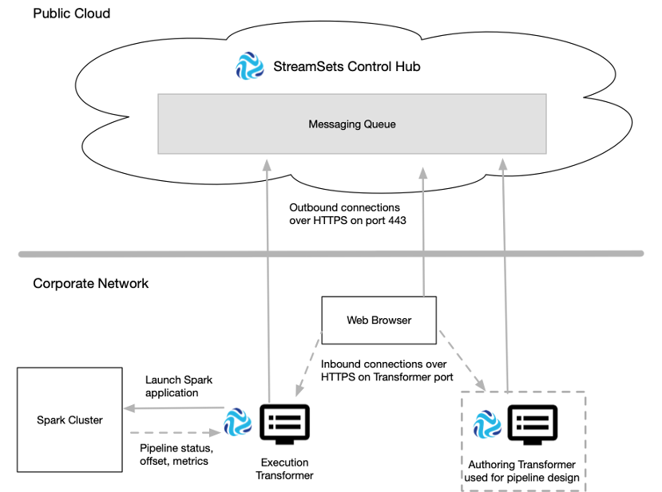

# 变压器通讯

StreamSets Control Hub 与Transformer一起设计管道并在开源集群计算框架Apache Spark上执行Transformer管道。

Control Hub 在StreamSets托管的公共云服务上运行 -您只需要一个帐户即可开始使用。您将Transformer安装在配置为将Spark作业提交到群集的机器上，例如Hadoop边缘或数据节点或云虚拟机。然后，您注册Transformer以与Control Hub一起使用。

您可以使用Control Hub安装和注册Transformer的多个实例。例如，您可能安装了Transformer的多个实例以与不同的Hadoop YARN群集一起使用。或者，您可以将一个Transformer安装用作测试环境，将另一安装用作生产环境。

您可以在Control Hub中使用每个注册的Transformer进行创作和执行。选择可用的创作Transformer后，可以在Control Hub 管道设计器中设计管道。从Control Hub 作业运行管道时，分配给作业和Transformer的标签将确定运行管道的执行Transformer。Transformer将管道作为Spark应用程序提交给集群，然后Spark处理所有管道处理。

注册的Transformer使用加密的REST API与Control Hub进行通信。 变压器通过 端口443上的HTTPS 启动到Control Hub的出站连接。

访问Control Hub Pipeline Designer的Web浏览器使用加密的REST API与Control Hub进行通信。 Web浏览器 通过端口443上的HTTPS 启动到Control Hub的出站连接。

为Pipeline Designer选择的创作Transformer在为Transformer配置的端口号上接受来自Web浏览器的入站连接。

同样，执行变压器接受来自星火入站连接，因为它处理管线，并将指标，上次保存的偏移和管道的状态回到变压器。当您监视实时摘要统计信息和包含Transformer管道的活动作业的错误信息时，执行Transformer还将接受来自Web浏览器的入站连接。

下图显示了Transformer如何与Control Hub通信：

## 变压器要求

注册的变压器将请求和信息发送到Control Hub。

Control Hub不会直接向Transformer发送请求。相反，Control Hub 使用加密的REST API将请求发送到Control Hub管理的消息队列。 变压器定期检查队列以检索控制中心 请求。

变压器在以下区域与Control Hub通信：

- 管道管理

  当您使用创作的Transformer将管道发布到Control Hub时，Transformer会将请求发送到Control Hub。

- 安全

  当您在Transformer中启用Control Hub或用户登录已注册的Transformer时，Transformer向Control Hub发出身份验证请求。

- 指标

  每隔一分钟，执行Transformer会将用于远程运行管道的聚合指标发送到Control Hub。

- 消息队列

  变压器将以下信息发送到消息传递队列：在启动时，一个变压器发送以下信息：变压器版，网址变压器和标签，在配置控制集线器的配置文件， $ TRANSFORMER_CONF / dpm.properties。当您更新本地管道的权限时，Transformer将发送更新的管道权限。变压器每隔五秒钟发送一次心跳，并更改远程管道的任何状态。变压器每分钟发送一次远程运行管道的最后保存的偏移量以及所有正在运行的管道的状态。

  每三秒钟，Control Hub会检查消息传递队列，以检索管道状态更改和Transformer发送的最后保存的偏移量。

  每隔五秒钟，Transformer将检查消息传递队列，以检索Control Hub发送的请求和信息 。当您启动，停止或删除作业时，控制中心将对特定执行Transformer的管道请求发送到消息传递队列。