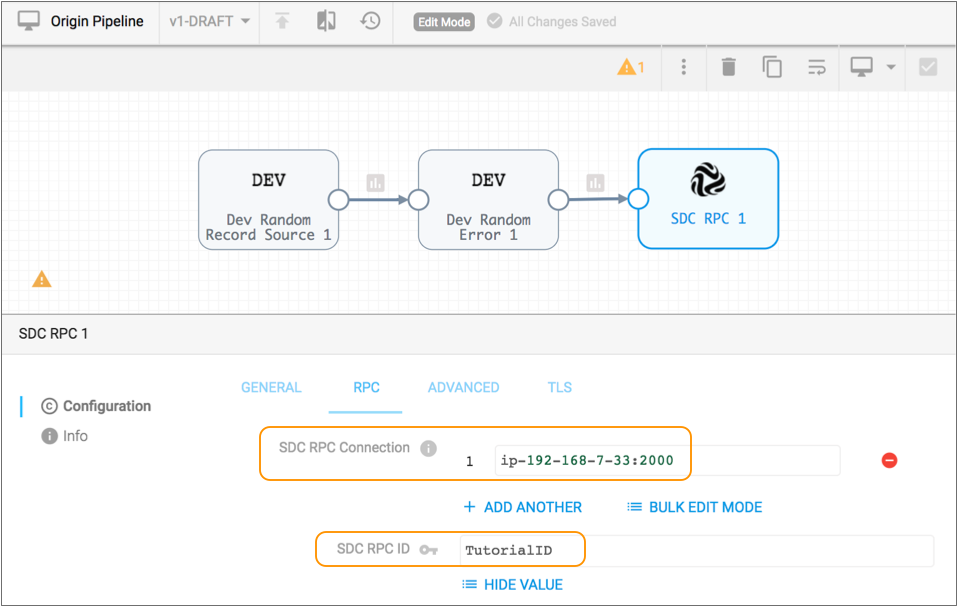
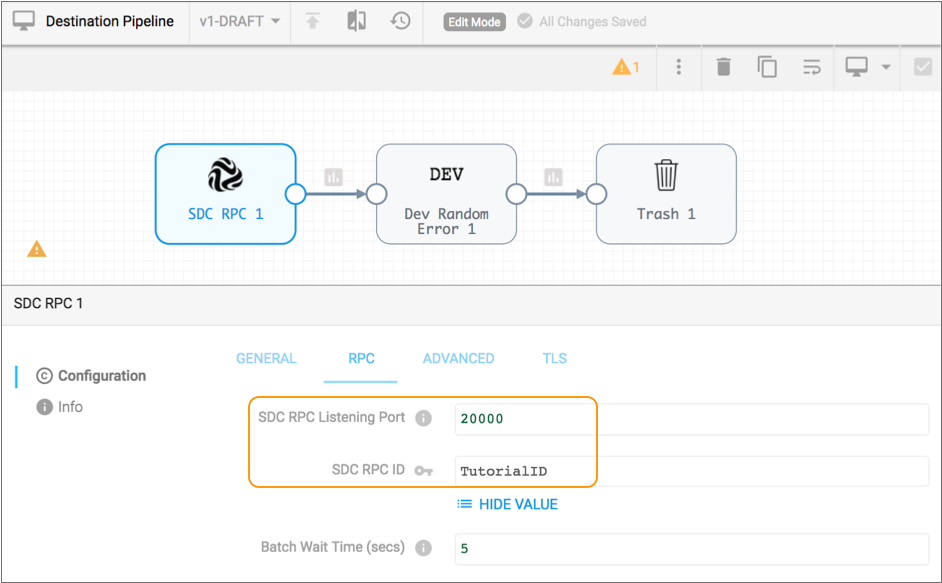
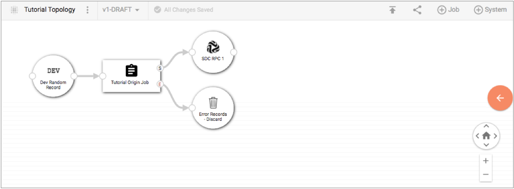
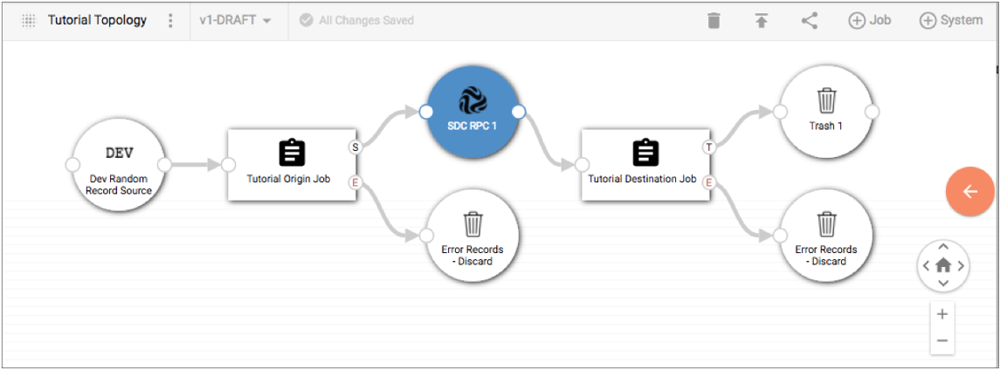
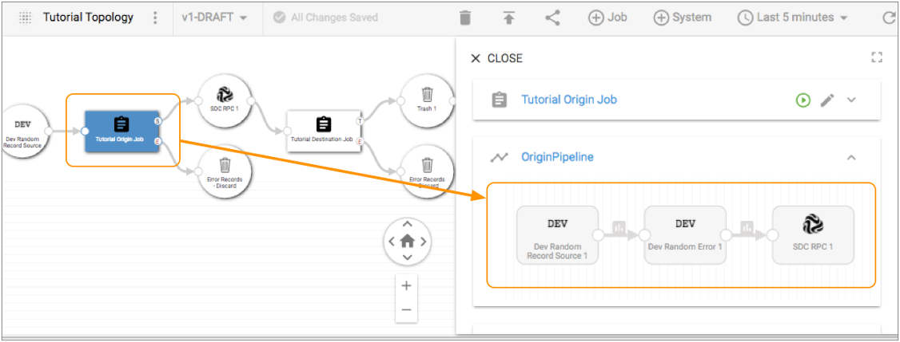
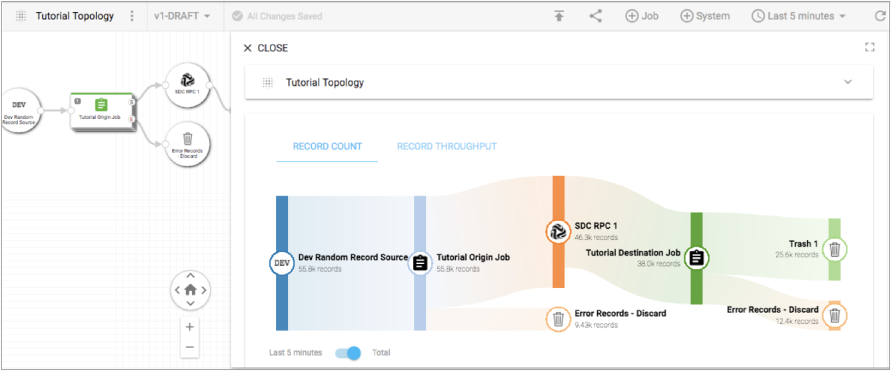

# 教程：拓扑

本教程介绍在StreamSets Control Hub中使用拓扑的方法。拓扑在遍历多个管道时提供交互式的端到端数据视图。在本教程中，我们将创建并发布SDC RPC源管道和SDC RPC目标管道，为管道创建作业，在拓扑中映射相关的作业，然后测量拓扑的进度。

尽管我们的拓扑教程提供了一个简单的用例，但请记住，Control Hub 使您可以管理多个复杂管道的拓扑。例如，您可以将满足一个业务功能需求的所有数据流活动归为一个拓扑。

**注意：**本拓扑教程假定您熟悉我们之前的教程中介绍的概念，这些概念在[教程：数据收集器，管道和作业中进行了描述](https://streamsets.com/documentation/controlhub/latest/help/controlhub/UserGuide/Tutorial/Tutorial_SDCPipelineJob.html#concept_htz_kh2_2w)。

要开始使用Control Hub 拓扑，我们将完成以下任务：

1. [设计和发布相关管道](https://streamsets.com/documentation/controlhub/latest/help/controlhub/UserGuide/Tutorial/Tutorial_Topology.html#task_x2v_1hj_fw)
2. [添加相关管道的作业](https://streamsets.com/documentation/controlhub/latest/help/controlhub/UserGuide/Tutorial/Tutorial_Topology.html#task_p2z_4ng_4w)
3. [在拓扑中映射作业](https://streamsets.com/documentation/controlhub/latest/help/controlhub/UserGuide/Tutorial/Tutorial_Topology.html#task_aj3_ghj_fw)
4. [测量和监视拓扑](https://streamsets.com/documentation/controlhub/latest/help/controlhub/UserGuide/Tutorial/Tutorial_Topology.html#task_kcz_4rj_fw)

## 设计和发布相关管道

拓扑提供了对多个相关管道的视图。为了创建相关的管道，我们将配置一个SDC RPC原始管道，该管道将数据传递到SDC RPC目标管道。

我们将为每个管道配置统计信息，以便我们可以监视作业中的管道统计信息和指标。然后，我们将发布两个管道，以表明我们的设计已经完成，并且可以将管道添加到作业中并运行。

1. 在导航面板中，单击**管道存储库**> **管道**。

2. 单击**创建新管道**图标：。

3. 输入以下名称：Origin Pipeline。

4. 保留默认值以创建一个空白的Data Collector管道，然后单击**Next**。

5. 选择系统数据收集器作为创作数据收集器，然后单击**创建**。

   或者，可选地，选择另一个可访问且已注册的数据收集器。

6. 使用管道创建帮助栏将以下阶段添加到管道：

   - 开发随机记录来源
   - 开发随机误差处理器
   - SDC RPC目标

7. 在SDC RPC目标中，在“ **RPC”**选项卡上配置以下属性 。

   对未列出的属性使用默认值：

   | RPC属性     | 描述                                                         |
   | :---------- | :----------------------------------------------------------- |
   | SDC RPC连接 | 使用以下格式输入运行Data Collector的计算机的主机名和计算机上的可用端口号：`:` |
   | SDC RPC ID  | 输入：TutorialID。                                           |

   此时，原始管道应如下所示：

   

   接下来，让我们为管道配置错误处理和统计信息。

8. 单击画布将焦点返回到管道而不是SDC RPC目标。

9. 单击**配置**> **错误记录**，然后将管道配置为丢弃错误记录。

10. 在“ **统计信息”**选项卡上，选择“ **直接写入控制中心”**。

11. 单击**发布**图标：。

12. 输入提交消息，然后单击**发布**。

    现在，我们使用类似的步骤来创建SDC RPC目标管道。

13. 单击**导航面板**图标（），然后单击**管道存储库**> **管道**。

14. 创建另一个名为“目标管道”的管道，并将以下阶段添加到该管道：

    - SDC RPC来源
    - 开发随机误差处理器
    - 垃圾目标

15. 在SDC RPC起源中，在“ **RPC”**选项卡上配置以下属性 。

    对未列出的属性使用默认值：

    | RPC属性         | 描述                                                         |
    | :-------------- | :----------------------------------------------------------- |
    | SDC RPC侦听端口 | 输入您在步骤[7中](https://streamsets.com/documentation/controlhub/latest/help/controlhub/UserGuide/Tutorial/Tutorial_Topology.html#task_x2v_1hj_fw__step_DestinationPort)为SDC RPC目标输入的相同端口号。 |
    | SDC RPC ID      | 输入：TutorialID。                                           |

    此时，目标管道应如下所示：

    

16. 配置管道以丢弃错误记录。

17. 在“ **统计信息”**选项卡上，选择“ **直接写入控制中心”**。

18. 单击**发布**图标：。

19. 输入提交消息，然后单击**发布**。

现在，我们已经设计和发布了相关的管道，让我们为相关的管道添加作业。

## 添加相关管道的作业

您映射包含拓扑中相关管道的作业。让我们为刚刚发布的相关管道创建作业。

1. 在导航面板中，单击**管道存储库**> **管道**。

2. 在作业列表中选择目标管道和原始管道，然后单击“ **创建作业”**图标。

   “ **添加作业”**窗口显示两页-每个选择的管道一个。

3. 对于目标作业的名称，输入：Tutorial Destination Job。

4. 单击“ **数据收集器标签”下的**，然后选择“西部地区”标签。

5. 保留其余属性的默认值。

6. 单击**下一步**。

   现在，让我们完成SDC RPC原始管道的相同步骤。

7. 对于作业的名称，输入：Tutorial Origin Job。

8. 选择“西部地区”作为标签，然后点击 **创建**。

   Jobs视图列出了我们两个新创建的作业。

## 在拓扑中映射作业

我们将添加一个拓扑，然后映射可以协同工作的作业以创建完整的数据流。

1. 在导航面板中，单击**拓扑**。

2. 单击**添加拓扑**图标：。

3. 让我们输入名称“ Tutorial Topology”，然后单击“ **保存”**。

   Control Hub在画布中显示一个空的拓扑。接下来，我们将添加我们的相关作业。

4. 单击**添加作业**图标，然后选择“教程原始作业”。

   Control Hub使用连接系统的圆形图标将我们的原始作业添加到拓扑画布中：

   

   我们的教程原始作业连接到以下系统：

   - 开发随机记录-我们管道的来源。由于我们使用的是开发阶段之一，因此我们没有其他相关的工作可以将数据发送到此源中。

   - SDC RPC 1-我们的管道的目标。我们将相关的教程目标作业连接到该系统。

   - 错误记录丢弃-为管道配置的错误记录处理的可视化。由于我们正在丢弃错误记录，因此我们没有其他相关的工作来处理这些记录。但是，如果我们已将错误记录写入另一个系统（例如，Kafka或Elasticsearch），则我们可以连接一个从该系统读取记录的作业。

     如果不想测量通过系统的数据流，则可以删除拓扑中的连接系统。例如，在复杂的拓扑中，您可能要删除画布中的“错误记录丢弃”系统。但是，由于我们正在设计一个简单的拓扑，因此将其留在示例中。

5. 选择显示在画布中的SDC RPC 1系统。

6. 再次单击“ **添加作业”**图标，然后选择“教程目标作业”。

   Control Hub将我们的目标作业添加到拓扑画布，并将其连接到SDC RPC 1系统。画布显示每个作业和连接系统，如下所示：

   

7. 让我们双击画布中的Tutorial Origin Job。

   控制中心在详细信息窗格中显示有关所选作业的详细信息。

8. 展开详细信息窗格中的OriginPipeline部分，以查看如何从拓扑中查看管道的设计。

   Control Hub显示我们的教程原始作业中包含的完整管道：

   

   您可以查看拓扑中包含的每个管道的设计，从而提供完整数据流的集中视图。

## 测量和监视拓扑

您可以测量和监视拓扑中所有正在运行的管道的进度。让我们开始作业，然后从拓扑视图中衡量正在运行的管道的进度。

**注意：**我们将需要首先启动SDC RPC目标作业，因为如果SDC RPC源管道无法连接到正在运行的SDC RPC目标管道，则该管道将无法启动。

1. 在拓扑画布中选择Tutorial Destination Job，然后单击 **Start Job**图标。

   控制中心会通知您该作业处于活动状态。

2. 在画布中选择Tutorial Origin Job，然后单击**Start Job**图标。

3. 单击拓扑画布，将焦点返回到拓扑而不是原始作业。

   详细信息窗格提供单个视图，可查看拓扑中所有作业的记录计数和吞吐量：

   

   **提示：**如果记录计数和吞吐量尚未显示统计信息，请单击 **刷新**图标：。

   您可以在拓扑画布中选择任何作业或系统，以监视该作业或系统的进度。例如，如果我们选择教程原始作业，则详细信息窗格将显示该作业的汇总统计信息和指标。

到此为止，我们的Control Hub 拓扑教程已经结束。请记住，我们的教程仅包含两个简单的工作来介绍拓扑的概念。但是，您可以使用Control Hub 来管理和监视多个复杂作业的拓扑。