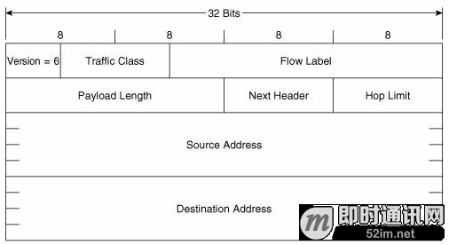
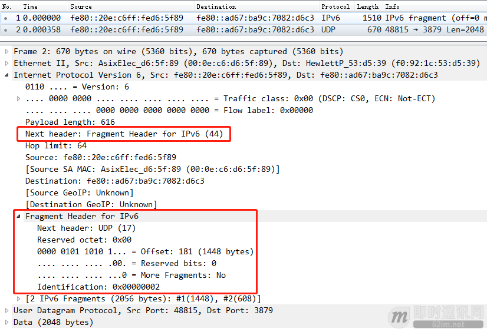
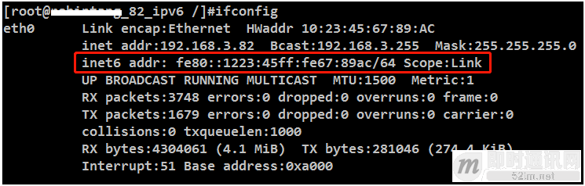
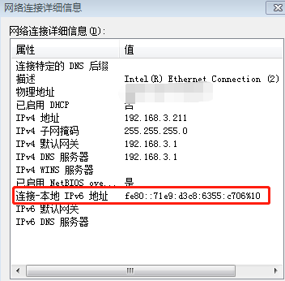

**IPv6技术详解：基本概念、应用现状、技术实践（上篇）**

## 1、前言

普及IPV6喊了多少年了，连苹果的APP上架App Store也早已强制IPV6的支持，然并卵，因为历史遗留问题，即使在IPV4地址如此饥荒的情况下，所谓的普及还是遥遥无期。但不可否认，IPV6肯定是未来趋势，做为网络通信领域的程序员来说，详细学习和了解IPV6是很有必要的，所谓厚积薄发，谁知道哪天IPV6真的普及了呢？那么，我们开始看正文吧。

**推荐阅读：**如果觉得本文太过专业，建议阅读《[网络编程懒人入门(十一)：一文读懂什么是IPv](http://www.52im.net/thread-2979-1-1.html)6》。

## 2、系列文章

**文章太长，分为两篇来讲，本文是2篇文章中的第1篇：**

- 《[IPv6技术详解：基本概念、应用现状、技术实践（上篇）](http://www.52im.net/thread-1605-1-1.html)》（本文）
- 《[IPv6技术详解：基本概念、应用现状、技术实践（下篇）](http://www.52im.net/thread-1607-1-1.html)》

本文是系列文章中的上篇，主要讲解IPV6的基本概念。

## 3、正文引言

2017年11月26日，中共中央办公厅和国务院办公厅印发了《[推荐互联网协议第六版（IPv6）规模部署行动计划](http://www.xinhuanet.com/politics/2017-11/26/c_1122012631.htm)》，并发出通知，要求各地区各部门结合实际认真贯彻落实。这条新闻传达了一个很重要的信息：这个是推进中国IPv6发展的战略总动员令。

**本文将会从以下几个方面进一步介绍IPv6，包括有：**

- 1）IPv6的基本概念；
- 2）IPv6在Linux操作系统下的实现；
- 3）IPv6的实验；
- 4）IPv6的过渡技术介绍；
- 5）IPv6在Linux平台下socket编程应该注意的问题。

值得说的是，目前我们接触得比较多的主流操作系统内核，已经很好地支持IPv6协议栈，例如：

- Windows： windows 7、windows 8.x、windows 10，默认开启IPv6；
- Linux： 内核2.6.x、内核3.x、内核4.x 已经支持IPv6（需要手动开启）；
- iOS：IOS9开始已经支持IPv6 Only，2016年苹果已经强制要求app必须支持IPv6。

本系列文章提到的IPv6节点，没有特殊说明，一般指的是纯IPv6节点（IPv6 Only），也就是只支持IPv6协议栈。IPv4节点，是指纯IPv4的节点，也就是只支持IPv4协议栈。如果节点支持IPv6和IPv4双栈，会指明是双栈节点。

本文是系列文章中的上篇，主要讲解IPV6的基本概念，其它内容将在下篇《[IPv6技术详解：基本概念、应用现状、技术实践（下篇）](http://www.52im.net/thread-1607-1-1.html)》中详细讲解。

众所周知，32位的IPv4地址已经耗竭，IPv6采用128位的地址长度拥有更大的地址空间。首先我们先来认识一下IPv6到底长成什么样子。

## 4、初识IPv6

▲ 图1：IPv6数据报文

**上图是我们最熟悉的ping的IPv6版本ICMPv6，可以看到，IPv6数据报文和IPv4有很大的差别：**

- 1）数据链路层（L2）的type字段标识为 0x86dd，表示承载的上层协议是IPv6（IPv4对比：type字段为0x0800）；
- 2）IPv6的头部字段，和IPv4差别巨大（可以猜测到，IPv6和IPv4无法兼容）。

**IPv6的报文头部格式如下：**

▲ 图2：IPv6报文头部

**IPv6报文头部更精简了，字段更少了，对比起IPv4，有以下几个地方值得注意：**

- 1）IPv6报文头部是定长（固定为40字节），IPv4报文头部是变长的。这个意味着，写代码处理IPv6数据报文的效率会提高很多：）；
- 2）IPv6中Hop Limit字段含义类似IPv4的TTL；
- 3）IPv6中的Traffic Class字段含义类似IPv4中的TOS（Type Of Service）；
- 4）IPv6的报文头部取消了校验和字段：取消这个字段也是对IPv4协议的一个改进。当IPv4报文在网路间传输，每经过一个路由器转发就是修改TTL字段，就需要重新计算校验和，而由于数据链路层L2和传输层L4的校验已经足够强壮，因此IPv6取消这个字段会提高路由器的转发效率。值得一提的是，在IPv6协议下，传输层L4协议UDP、TCP是强制需要进行校验和的（IPv4是可选的）；
- 5）IPv6报文头部中的Next Header字段表示“承载上一层的协议类型”或者“扩展头部类型”。

**这里的含义与IPv4有很大的差别，需要加以解释：**

- 当IPv6数据报文承载的是上层协议ICMPv6、TCP、UDP等的时候，Next Header的值分别为58、6、17，这个时候和IPv4报文头部中的Protocol字段很类似;
- 当不是以上3种协议类型的时候，IPv6报文头部紧接的是扩展头部。扩展头部是IPv6引入的一个新的概念，每个IPv6的数据报文可以承载0个或多个扩展头部，扩展头部通过链表的形式组织起来。当IPv6数据报文承载着扩展头部的时候，Next Header的数值为扩展头部的类型值。

为什么要引入扩展头部这个概念，这里也是IPv6对IPv4改进的一个方面，用扩展头部取代了IPv4的可选项信息，精简了IPv6的头部，增强了IPv6的扩展性。有同学会不会有疑问，IPv6的分片数据报文怎么处理？其实就是使用了IPv6扩展头部。我们来抓一个UDP分片报文来看看。

▲ 图3：IPv6分片报文

当发送一个分片IPv6数据报文的时候，IPv6使用的是扩展头部的形式组织各个分片的信息，如图IPv6报文头部Next Header字段值为44表示存在扩展头部，扩展头部是IPv6分片数据信息。

对比IPv4，分片信息是记录在IPv4报文头部的分片字段中。

IPv6的扩展头部类型有很多种，除了上述的分片头部，还有路由头部、逐跳可选头部等，具体的可以参考[RFC2460](https://tools.ietf.org/html/rfc2460)。

本章主要介绍了IPv6的一些很直观的认识，下面逐渐介绍IPv6上的基本知识和概念。

## 5、IPv6的地址语法

一个IPv6的地址使用冒号十六进制表示方法：128位的地址每16位分成一段，每个16位的段用十六进制表示并用冒号分隔开，例如：
一个普通公网IPv6地址：2001:0D12:0000:0000:02AA:0987:FE29:9871

IPv6地址支持压缩前导零的表示方法，例如上面的地址可以压缩表示为：
200112:0:0:2AA:987:FE29:9871

为了进一步精简IPv6地址，当冒号十六进制格式中出现连续几段数值0的位段时，这些段可以压缩为双冒号的表示，例如上面的地址还可以进一步精简表示为：
200112::2AA:987:FE29:9871

又例如IPv6的地址FF80:0:0:0:FF:3BA:891:67C2可以进一步精简表示为：
FE80::FF:3BA:891:67C2

这里值得注意的是：双冒号只能出现一次。

## 6、IPv6地址的号段划分和前缀表示法

IPv6拥有128位巨大的地址空间，对于那么大的空间，也不是随意的划分，而是使用按照bit位进行号段划分（与鹅厂内部一些的64位uin改造放号的zone划分算法）。

**IPv6的地址结构如下图：**

▲ 图4：IPv6地址结构

例如[RFC4291](https://tools.ietf.org/html/rfc4291)中定义了n=48, m=16，也就是子网和接口ID与各占64位。

IPv6支持子网前缀标识方法，类似于IPv4的无分类域间路由CIDR机制（**注意：**IPv6没有子网掩码mask的概念）。

**使用“IPv6地址/前缀长度”表示方法，例如：**

- 2001:C3:0:2C6A::/64表示一个子网；
- 而2001:C3:0:2C6A:C9B4:FF12:48BC:1A22/64表示该子网下的一个节点地址。

可以看到，一个IPv6的地址有子网前缀+接口ID构成，子网前缀由地址分配和管理机构定义和分配，而接口ID可以由各操作系统实现生成，生成算法后面的章节会介绍。

## 7、IPv6的地址类型

**IPv6地址分三种类型：**

- 1）单播，对应于IPv4的普通公网和私网地址；
- 2）组播，对应于IPv4的组播（多播）地址；
- 3）任播，IPv6新增的地址概念类型。

IPv6没有广播地址，用组播地址实现广播的功能。实际上我们工作和生活最可能最多接触的就是单播地址，接下来本文重点会讲解单播地址的种类。组播和任播地址有兴趣的同学自行查阅相关RFC和文献。

## 8、IPv6单播地址

**注意：**大家如果在网上搜索IPv6的地址，可能都是千篇一律的把所有“出现过”的单播地址介绍出来，其实有一些单播地址类型已经在相关的RFC中被废除或者不建议使用，而本节会指出这类地址。同时，在介绍单播地址的时候，尽量与IPv4中对应的或者相类似的概念做对比，加深理解。

IPv6单播地址有以下几种。

### 8.1全球单播地址

▲ 图5：IPv6全球单播地址结构

前缀2000::/3，相当于IPv4的公网地址（IPv6的诞生根本上就是为了解决IPv4公网地址耗尽的问题）。这种地址在全球的路由器间可以路由。

### 8.2链路本地地址

▲ 图6：链路本地地址结构

前缀FE80::/10，顾名思义，此类地址用于同一链路上的节点间的通信，主要用于自动配置地址和邻居节点发现过程。Windows和Linux支持或开启IPv6后，默认会给网卡接口自动配置一个链路本地地址。也就是说，一个接口一定有一个链路本地地址。

**如下图：**

▲ 图7：Linux下查看链路本地地址

▲ 图8：Windows下查看链路本地地址

**值得说的是：**每个接口必须至少有一个链路本地地址；每个接口可以配置1个以上的单播地址，例如一个接口可以配置一个链路本地地址，同时也可以配置一个全球单播地址。

**注意：**很容易会把链路本地地址和IPv4的私网/内网地址对应起来，其实链路本地地址对应于IPv4的APIPA地址，也就是169.254开头的地址（典型场景就是windows开启自动获取地址而获取失败后自动分配一个169.254的地址）。而IPv4私网对应于IPv6的什么地址，后面会介绍。

**特别地：**在IPv6 socket编程中，可以使用链路本地地址编程通信，但是需要增加一些额外的参数（这是一个小坑），在后面介绍编程的章节会介绍。

### 8.3唯一本地地址

▲ 图9：唯一本地地址结构

前缀FC00::/7，相当于IPv4的私网地址（10.0.0.0、172.16.0.0、192.168.0.0），在RFC4193中新定义的一种解决私网需求的单播地址类型，用来代替废弃使用的站点本地地址。

**可能看到这里，有同学会跳出来说：**IPv6不是为了解决IPv4地址耗尽的问题吗，既然IPv6的地址空间那么大，可以为每一个网络节点分配公网IPv6的节点，那为什么IPv6还需要支持私网？这里需要谈谈对IPv6下私网支持的认识。

在IPv4中，利用NAT技术私网内的网络节点可以使用统一的公网出口访问互联网资源，大大节省了IPv4公网地址的消耗（IPv6推进缓慢的原因之一）。另一方面，由于默认情况下私网内节点与外界通信的发起是单向的，网络访问仅仅能从私网内发起，外部发起的请求会被统一网关或者防火墙阻隔掉，这样的网络架构很好的保护了私网内的节点安全性和私密性。可以设想一下，如果鹅厂内部每台办公电脑都配置了IPv6的公网地址上网，是多么可怕的事情，每台办公电脑都会面临被黑客入侵的威胁（肉鸡真多）。

因此，在安全性和私密性要求下，IPv6中同样需要支持私网，并且也需要支持NAT。在Linux内核3.7版本开始加入对IPv6 NAT的支持，实现的方式和IPv4下的差别不大（Linux内核代码中变量和函数的命名几乎就是ctrl+c和ctrl+v过来的-_-||）。

### 8.4站点本地地址

前缀FEC9::/48，以前是用来部署私网的，但RFC3879中已经不建议使用这类地址，建议使用唯一本地地址。大家知道有这么一回事就可以了。网上还有很多文章还提到这种地址，但是没有说明这种地址已经不再使用。

### 8.5特殊地址：回环地址

0:0:0:0:0:0:0:1或::1，等同于IPv4的127.0.0.1

### 8.6过渡地址：内嵌IPv4地址的IPv6地址

就是在IPv6的某一些十六进制段内嵌这IPv4的地址，例如IPv6地址中64:ff9b::10.10.10.10，此IPv6地址最后4个字节内嵌一个IPv4的地址，这类地址主要用于IPv6/IPv4的过渡技术中。

## 9、IPv4兼容地址

0:0:0:0:0:0:w.x.y.z或::w.x.y.z（其中w.x.y.z是点分十进制的IPv4地址）。但在[RFC4291](https://tools.ietf.org/html/rfc4291)中已经不推荐使用这类地址，大家知道有这么一回事就可以了。

**过渡地址：IPv4映射地址**
0:0:0:0:0:FFFF:w.x.y.z或::FFFF:w.x.y.z（其中w.x.y.z是点分十进制的IPv4地址），用于IPv6地址表示IPv4地址。主要用于某些场景下IPv6节点与IPv4节点通信，Linux内核对这类地址很好地支持，在后面编程和内核分析的章节会分析使用过程。

**过渡地址：特定过渡技术地址**
6to4地址、ISATAP地址、Teredo地址主要用于对应的过渡技术的地址，在后面介绍过渡技术的时候会介绍。

## 10、IPv6接口ID生成算法

从前面的介绍中可以看出，IPv6单播地址是由前缀（64位）+接口ID（64位）组成。

**接口ID的生成算法主要有以下几种：**

- 1）根据[RFC4291](https://tools.ietf.org/html/rfc4291)定义，接口ID可以从EUI-64地址生成：详细算法可以查看regli同学的PPT第14页；
- 2）为了可以具备某种程度的匿名信，接口ID可以使用一个随机分配的，windows操作系统默认就是使用这种生成算法，Linux下也是默认开启这个算法；
- 3）使用状态化的自动配置技术分配，例如DHCPv6分配；
- 4）手工配置。

## 11、IPv6地址配置

前面对IPv6的地址、前缀、接口等等做了介绍，接下来就是要介绍一个接口如何配置IPv6地址。IPv6一个比IPv4更厉害的方面，就是可以自动配置地址，甚至这个配置过程不需要DHCPv6（在IPv4中是DHCPv4）这样的地址配置协议。最典型的例子就是，只要开启了IPv6协议栈的操作系统，每个接口就能自动配置了链路本地地址，这个是和IPv4最重要的区别之一。

**IPv6的地址配置有以下几种：**

- 1）只要开启了IPv6协议栈，接口自动分配链路本地地址；
- 2）无状态自动配置地址（[RFC2462](https://tools.ietf.org/html/rfc2462)），后面会有实验演示；
- 3）有状态自动配置地址，例如DHCPv6。
- 4）手动配置。

## 12、IPv6的域名解析

由于IPv6的地址扩展为128位，比IPv4的更难书写和记忆，因此IPv6下的DNS变得尤为重要。IPv6的的DNS资源记录类型为AAAA（又称作4A），用于解析指向IPv6地址的完全有效域名。

**下面是一个示例：**
Hostipv6.example.wechat.com IN AAAA 2001:db8:1::1

IPv6下的域名解析可以认为是IPv4的扩展，详细可以查看[RFC3596](https://tools.ietf.org/html/rfc3596).