**IPv6技术详解：基本概念、应用现状、技术实践（下篇）**

## 1、前言

在上篇《[IPv6技术详解：基本概念、应用现状、技术实践（上篇）](http://www.52im.net/thread-1605-1-1.html)》，我们讲解了IPV6的基本概念。

**本篇将继续从以下方面展开对IPV6的讲解：**

- IPv6在Linux操作系统下的实现；
- IPv6的实验；
- IPv6的过渡技术介绍；
- IPv6在Linux平台下socket编程应该注意的问题。

如您对IPV6的基本概念尚未了解，请先阅读本文的[上篇](http://www.52im.net/thread-1605-1-1.html)。

**推荐阅读：**如果觉得本文太过专业，建议阅读《[网络编程懒人入门(十一)：一文读懂什么是IPv](http://www.52im.net/thread-2979-1-1.html)6》。

## 2、系列文章

**文章太长，分为两篇来讲，本文是2篇文章中的第2篇：**

- 《[IPv6技术详解：基本概念、应用现状、技术实践（上篇）](http://www.52im.net/thread-1605-1-1.html)》
- 《[IPv6技术详解：基本概念、应用现状、技术实践（下篇）](http://www.52im.net/thread-1607-1-1.html)》（本文）

本文是系列文章中的下篇，主要讲解IPV6的应用现状和技术实践等。

## 3、Linux内核IPv6架构简析

本文后面主要的分析都是基于Linux，会有涉及关于Linux内核对IPv6的实现。主要是因为，现在IPv6的参考资料不多，除了与IPv6相关的RFC之外，还有少数可以参阅的IPv6国外文献，而Linux内核一直都与跟随着IPv6的协议更新和变化，Linux内核IPv6的实现是十分重要的参考材料之一。而且从事后台开发工作主要也是在Linux平台下，熟悉Linux下IPv6的实现也是为以后的工作做知识储备。

**PS：**客户端开发的同学可以参考各自平台的文档......

Linux在很早之前就已经开始支持IPv6，目前我们接触最多的Linux内核版本都很好地支持IPv6，同时也是支持IPv4/IPv6双栈体系。在Linux操作系统中，IPv4是默认必须开启，IPv6是可选编译和配置开启。

**例如在编译内核的时候，需要选择IPv6编译选项才支持IPv6：**

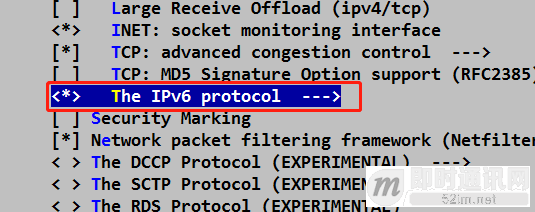

**当开启支持IPv6的Linux的内核网络双栈的结构，如下图：**

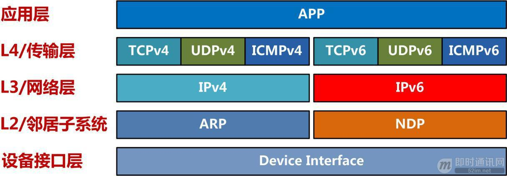

▲ 图11：Linux内核双栈架构

Linux内核中，IPv6协议栈与IPv4协议栈并行关系，IPv6和IPv4完全是两套不一样的代码实现。

**IPv6完整的协议栈逻辑模块包括：**

- 1）网络层IPv6，核心逻辑：IPv6路由子系统；
- 2）传输层TCP/UDP实现：TCPv6、UDPv6；
- 3）控制报文协议ICMPv6，这里值得一提的是ICMPv6在IPv6协议中的地位十分重要：
  ICMPv6不仅提供了与ICMPv4相同的服务诊断功能，例如报告数据包的错误和提供简单的echo服务，ICMPv6是IPv6中邻居发现协议的重要组成部分，用于管理链路上的点到点的通信；
- 4）邻居子系统的实现：邻居发现协议NDP（对应于IPv4里面的ARP协议）；
- 5）其他高级实现（IPv6 NAT、IPv6隧道、iPv6 IPSec等）。

由于我们平时的开发工作在应用层，以上1-4是将会接触得最多。

## 4、IPv6实验

本章我们通过实验，加深对IPv6的认识。这里的实验没有使用真实现网的IPv6接入点（目前国内绝大部分接入点都是教育网），而实验的目的主要是观察IPv6的数据包结构、IPv6的路由配置等，所以决定自己通过搭建中间路由器、应用服务器的方式做实验，便于抓包和代码分析。

客户端：windows 7
路由器：中间路由器使用自己编译和搭建的Linux系统（内核2.6.32.27）
应用服务器：Ubuntu16.04LTS版本。

为什么要使用自己编译的Linux作为路由器？因为IPv6的实践类能参考的文献比较少，而Linux内核的IPv6模块是最重要的参考资源之一，在实践中遇到问题可以使用打LOG和分析代码的方法解决。

### 4.1无状态自动配置地址实验

IPv6地址的获取是最重要的环节之一。本实验使用开源的无状态自动配置服务radvd进行实验。

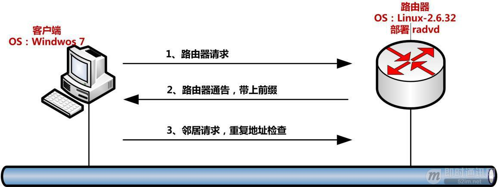

▲ 图12：IPv6无状态自动配置

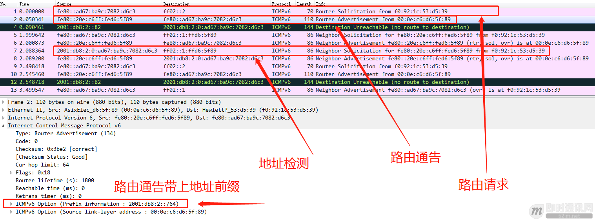

▲ 图13：IPv6无状态自动配置报文分析

**无状态自动配置过程：**

- 1）由链路上的主机向链路发起“路由请求”报文，这个报文是以组播协议发送，寻找链路上最合适的路由器；
- 2）路由器收到请求会返回“路由通告”报文，报文里面带着本链路的地址前缀信息主机将接收到的前缀和自身的接口ID，组成完整的新地址；
- 3）主机尝试使用新地址发起地址重复检测，检测链路上是否有其他主机也是这个地址，如果有，就停止使用该地址；如果没有，就启用这个新地址。

可以看到无状态自动配置过程十分简易（对比DHCPv4和DHCPv6来说），实际上，无状态自动配置可以单独组网使用，也可以配合有状态自动配置一般会配合使用，加强网络节点管理。涉及自动配置和地址检测等更多细节，可以查阅RFC1971、RFC4861。

### 4.2IPv6静态路由配置实验

本次实验主要是了解windows和linux的静态路由配置。

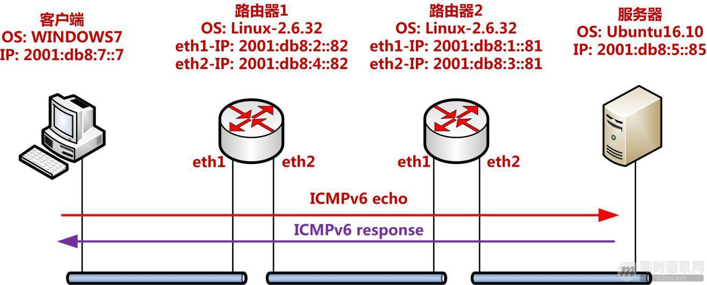

▲ 图14：IPv6典型的网络拓扑

由于各自的网络前缀（网段）不一致，在不使用默认路由的情况下，我们尝试配置路由让客户端可以访问到服务器。

**第一步：Windows 7配置静态路由**
去往服务器的2001:db8:5::/64网段的路由

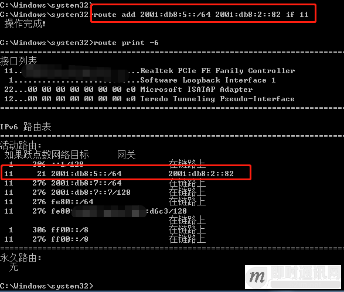

▲ 图15：Windows配置IPv6路由

**第二步：路由器1配置**

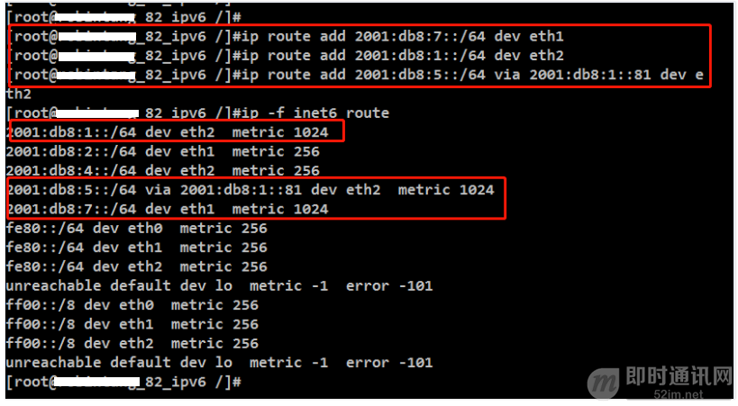

▲ 图16：Linux下配置IPv6路由

**第三步：路由器2配置**

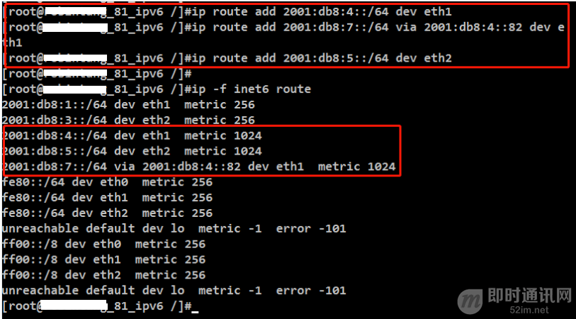

▲ 图17：Linux下配置IPv6路由

**第四步：服务器静态路由配置**

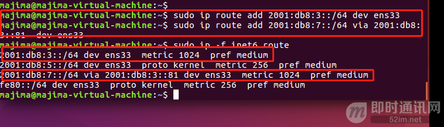

▲ 图18：服务器配置IPv6路由

**第五步：结果**

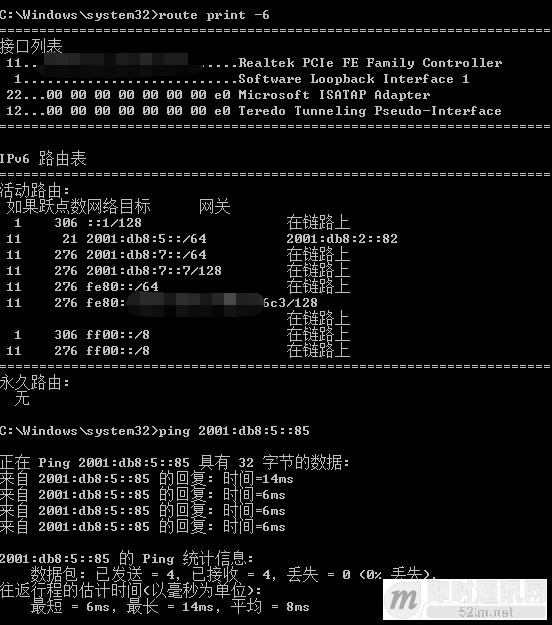

▲ 图19：客户端访问服务器

客户端可以顺利ping通服务器。可以看到，IPv6下的路由配置，无论是windows还是linux，与IPv4的配置差别不大，熟悉IPv4各个平台路由配置的同学可以很快上手IPv6的路由配置。

### 4.3IPv6的web服务

复用2的架构，在服务器端部署一个web服务，在客户端访问该web服务。web服务没有选择像apache或者nginx这样的庞然大物，而选择了很轻量的boa。原因是boa虽然原始支持IPv6，但是我想粗暴的把所有IPv4的socket套接字都替换成IPv6版本，尝试做一个自定义的升级。结果需要改动的代码非常少，不超过20行，boa就能完全支持IPv6。

**配合实验，写了一个简单的CGI，只是在版面echo字符串。如下图：**

▲ 图20：浏览器使用IPv6地址访问网络资源

这里值得注意的是，在浏览器中使用IPv6的地址访问web资源，IPv6的地址必须要使用中括号“[]”包起来。

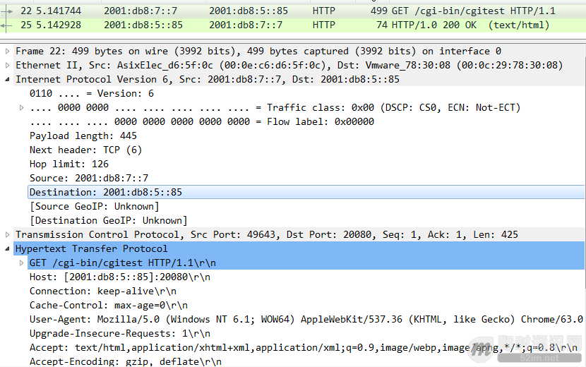

▲ 图21：IPv6下的http报文

从Server端抓包看，IPv6下的Web服务http报文，除了网络层L3的报文头部不一样之外，其余的都和IPv4版本的没有太大差别差别。

### 4.4IPv6的过渡技术实验

这部分将在过渡技术介绍中一起实验。

## 5、IPv6的过渡技术

IPv6的提出，最重要的目的就是解决公网IPv4耗尽的问题，而且IPv6协议的设计就考虑到了更加好的效率、安全、扩展等方面，可以那么说，IPv6是未来网络发展的大趋势。

但为什么IPv6已经发展了十几年了，目前在我们的工作和生活中还是比较少接触和使用。

这里的原因是非常的复杂，有技术上障碍，因为IPv6和IPv4是两个完全不兼容的协议（在极少数的特定场景可以实现兼容），如果要从支持IPv4升级到IPv6，无论是应用程序用客户端、服务器程序端、路由器等等，都要同时支持IPv6才能解决问题，这个的升级改造需要花费的成本是巨大的。

而且，正是由于技术上的升级花费大量的人力物力，无论是运营商还是互联网服务商，一方面要重视用户的体验问题，这个肯定不能强制客户更新换代硬件设备和软件，另一方面也要维护自身的投资和利益，更愿意去选择利用现有技术降低IPv4地址耗尽带来的压力，例如NAT的广泛应用，就是IPv6推广使用的一个重要的“障碍”。

由上所述，IPv4升级到IPv6肯定不会是一蹴而就的，是需要经历一个十分漫长的过渡阶段（用我厂通用的术语说，就是IPv4升级IPv6这个灰度的时间非常长），要数十年的时间都不为过。现阶段，就出现了IPv4慢慢过渡到IPv6的技术（或者叫过渡时期的技术）。过渡技术要解决最重要的问题就是，如何利用现在大规模的IPv4网络进行IPv6的通信。

**要解决上面的问题，这里主要介绍3种过渡技术：**

- 1）双栈技术；
- 2）隧道技术；
- 3）转换技术（有一些文献叫做翻译技术）。

本章节会对以上的过渡技术，选取几个典型的、我们未来最有机会接触到的具体的过渡技术结合实验观察过渡技术的具体实现和数据包的表现形式。

### 5.1什么是双栈技术？

这种技术其实很好理解，就是通信节点同时支持IPv4和IPv6双栈。例如在同一个交换机下面有2个Linux的节点，2个节点都是IPv4/IPv6双栈，节点间原来使用IPv4上的UDP协议通信传输，现在需要升级为IPv6上的UDP传输。由于2个节点都支持IPv6，那只要修改应用程序为IPv6的socket通信基本达到目的了。

上面的例子在局域网通信的改造是很容易的。但是在广域网，问题就变得十分复杂了。因为主要问题是在广域网上的2个节点间往往经过多个路由器，按照双栈技术的部署要求，之间的所有节点都要支持IPv4/IPv6双栈，并且都要配置了IPv4的公网IP才能正常工作，这里就无法解决IPv4公网地址匮乏的问题。因此，双栈技术一般不会直接部署到网络中，而是配合其他过渡技术一起使用，例如在隧道技术中，在隧道的边界路由器就是双栈的，其他参与通信的节点不要求是双栈的。

### 5.2什么是隧道技术？

当前的网络是以IPv4为主，因此尽可能地充分利用IPv4网络进行IPv6通信是十分好的手段之一。隧道技术就是这样子的一种过渡技术。

隧道将IPv6的数据报文封装在IPv4的报文头部后面（IPv6的数据报文是IPv4的载荷部分），IPv6通信节点之间传输的IPv6数据包就可以穿越IPv4网络进行传输。隧道技术的一个很重要的优点是透明性，通过隧道进行通信的两个IPv6节点（或者节点上的应用程序）几乎感觉不到隧道的存在。

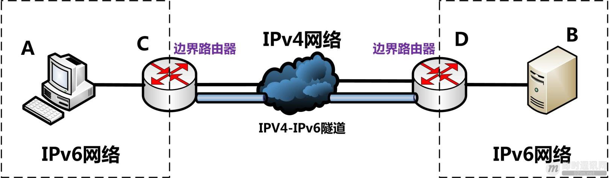

▲ 图22：IPv6典型的隧道

上图是一种典型的隧道技术：路由器-路由器隧道，两个IPv6网络中的主机通过隧道方式穿越了IPv4进行通信。其中C节点和D节点被称为边界路由器，边界路由器必须要支持IPv4-IPv6双栈。当IPv6网络1的主机A将IPv6数据包发给边界路由器C，C对IPv6数据包进行IPv4封装，然后在IPv4网络上进行传输，发送到边界路由器D，D收到IPv4的数据包后剥掉IPv4的包头，还原IPv6的数据包，发送到IPv6网络2的主机B。

根据隧道的出口入口的构成，隧道可以分为路由器-路由器，主机-路由器隧道、路由器-主机、主机-主机隧道等类型。

隧道的类型也分为手动配置类型和自动配置类型两种，手动配置是指点对点的隧道是手动加以配置，例如手动配置点对点隧道外层的IPv4地址才能建立起隧道；自动配置是指隧道的建立和卸载是动态的，一般会把隧道外层的IPv4地址内嵌到数据包的目的IPv6地址里面，在隧道路由器获取该IPv6地址时候取出内嵌IPv4地址从而使用该IPv4地址作为隧道的对端来建立隧道。

下面就介绍几种我们很可能会接触到的具体的隧道技术。

在介绍具体的隧道技术前，特别要说明一下，Linux内核原生支持一种叫做sit（Simple Internet Transition）隧道。这个隧道专门用于IPv6-in-IPv4的数据封装解封和传输，应用十分之广泛，现在很多主流的IPv6隧道技术都能基于sit隧道实现。关于sit隧道的技术实现，可以查阅Linux内核源码 net/ipv6/sit.c 。

### 5.3隧道技术之6to4隧道

6to4是当前使用得比较广泛的一种自动配置隧道技术，这种技术采用特殊的IPv6地址，称为6to4地址，这种地址是以2002开头，接着后面的32位就是内嵌的隧道对端的IPv4地址。当边界路由器收到这类目的地址，取出IPv4地址建立隧道。

6to4隧道一般用在路由器-路由器、主机-路由器、路由器-主机场景，典型的应用场景是两个IPv6的站点内主机通过6to4隧道进行相互访问。

6to4隧道的一个限制是内嵌的IPv4地址必须是公网地址。

6to4隧道实验过程如下。

如下图，就是本次6to4实验中使用的隧道架构，该架构是典型的路由器-路由器隧道，隧道两侧的IPv6网络对隧道的存在无感知。

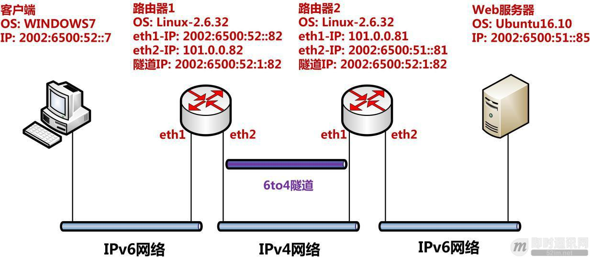

▲ 图23：6to4路由器-路由器隧道
在Linux下的sit隧道可以自适应为6to4隧道。

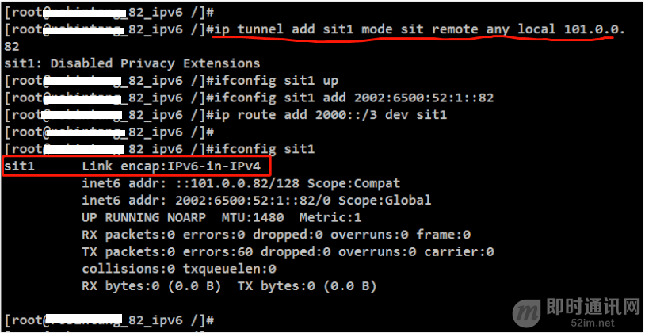

▲ 图24：Linux下配置sit隧道（6to4）
上图就是在路由器上配置sit隧道的命令，因为是使用6to4隧道，隧道的目的端点地址是从目的地址中获取，因此只需要配置本地端点即可。

▲ 图25：浏览器通过隧道访问web服务
配置完隧道后，使用客户端访问web服务，可以正常访问。

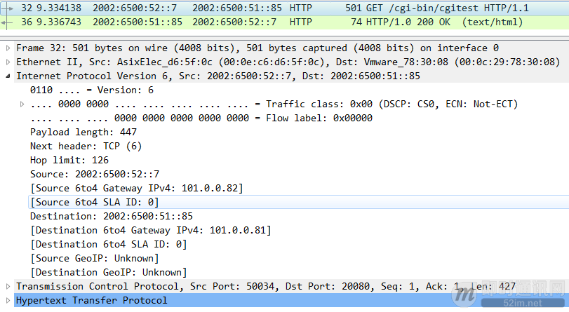

▲ 图26：web服务器端抓取http报文
在web服务端抓取http报文，可以看到，web服务获取到就是一个普通的http请问报文。

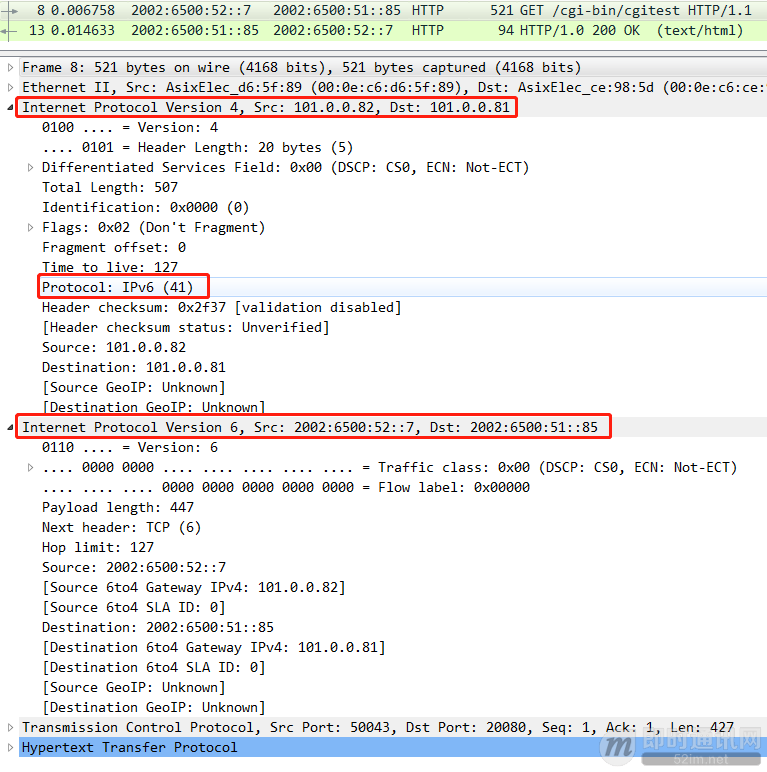

▲ 图27：隧道内抓取http报文
在隧道内抓取http报文，可以看到里面的乾坤。这个不是一般的http报文，它比服务端抓取到的多了一层IPv4报文头部，是隧道的外出通信协议，隧道内层IPv6才是真正的数据。IPv4报文头部中的协议字段，不是我们熟悉的TCP(6)/UDP(17)协议，而是IPv6-in-IPv4专属的隧道协议类型。

可以看到，经过隧道的数据报文，在隧道两端的边界路由器分别完成了隧道协议的封包和解包，在真正获取到数据的节点看来，几乎不感知隧道的存在。

### 5.4隧道技术之ISATAP隧道

ISATAP全称是站点内自动隧道寻址协议（Intra-Site Automatic Tunnel Addressing Protocol），用来为IPv4网络中的IPv6双栈节点可以跨越IPv4网络访问外部的IPv6节点。

ISATAP隧道一般用于主机-主机、主机-路由器的场景。

ISATAP隧道实验过程如下所示。

如下图就是本次实验使用的架构，是一种典型的主机-路由器场景。实验中需要在路由器2上部署radvd服务，用于客户端进行无状态自动配置地址。Linux下的ISATAP隧道也是可以使用sit隧道实现。

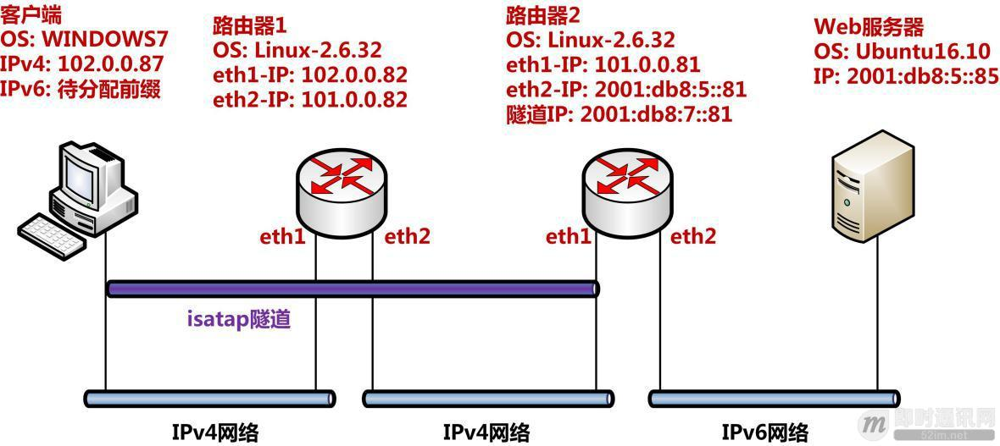

▲ 图28：ISATAP主机-路由器隧道

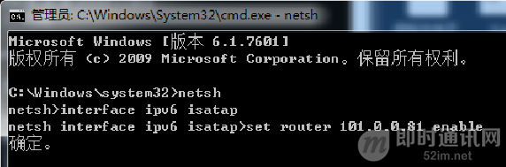

▲ 图29：Windows下配置ISATAP隧道
实验用的客户端使用windows 7，原生支持ISATAP隧道，如上图，需要进入netsh开启并且设置ISATAP的路由器地址（支持域名）。

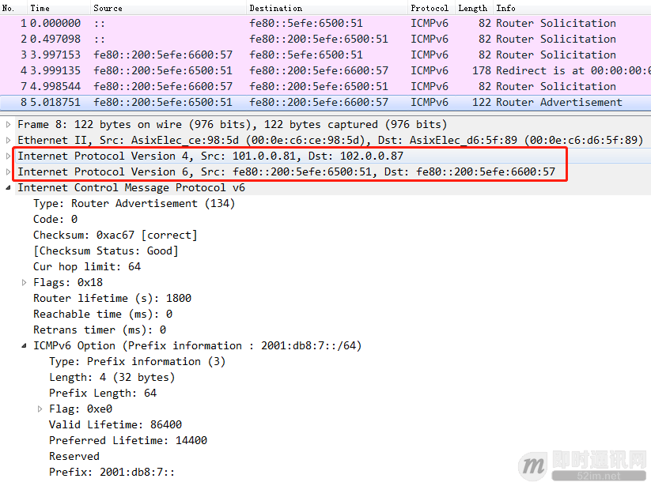

▲ 图30：ISATAP隧道中的无状态自动配置
当客户端设置完router后，隧道已经建立，客户端便发起了无状态自动配置流程，可以看到上面的截图路由器通过隧道将前缀信息下发给客户端，客户端完成无状态自动配置，获取到公网IP地址。

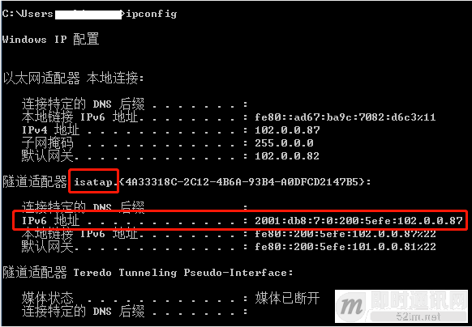

▲ 图31：ISATAP隧道接口地址
在windows 7上查看ISATAP接口，获取到公网地址。这个地址类型是ISATAP专用的地址结构，由64位全球单播路由前缀:200(0):5e5f:w.x.y.z组成(w.x.y.z是客户端的IPv4地址)。

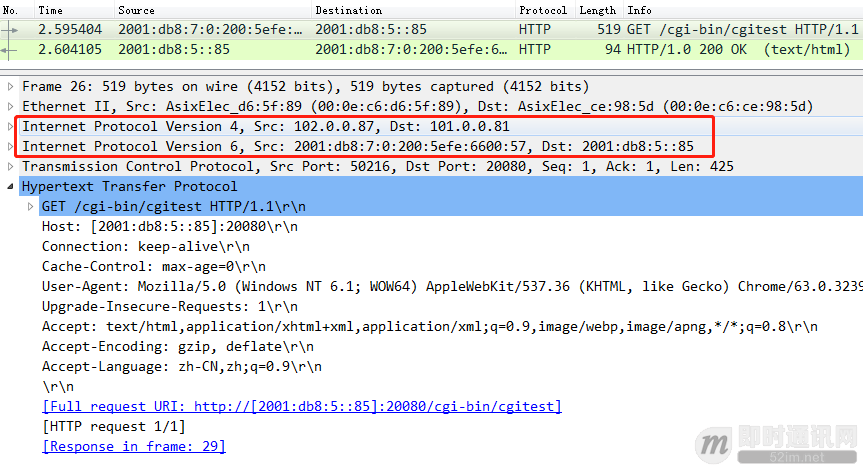

▲ 图32：使用ISATAP隧道访问web服务
如上图，使用ISATAP隧道访问web服务，在隧道内的数据抓包，可以看到和6to4的类似，这里就不再深入阐述。

### 5.5隧道技术之Teredo隧道

前面的隧道技术，主要是在IPv4的数据报文承载着IPv6的数据报文，这是一种特殊的数据包格式（IPV6-in-IPv4），不同于我们熟悉的TCP、UDP等传输层协议。而我们平常接触到的网络都存在于NAT架构中（例如我们的办公网络和家庭网络），在这种网络架构中，路由器仅对于TCP、UDP等传输层协议做NAT处理，而无法正确处理IPv6-in-IPv4这种报文，例如使用ISATAP隧道，IPv6双栈节点与ISATAP路由器之前如果存在NAT，ISATAP建立隧道失败；6to4隧道也会遇到同样的问题。

Teredo隧道是有微软公司主导的一项隧道技术，主要用于在NAT网络架构下建立穿越NAT的隧道。

Teredo隧道的核心思路，是将IPv6的数据封装成IPv4的UDP数据包，利用NAT对IPv4的UDP支持进行穿越NAT的传输，当UDP包到达隧道的另外一端后，再把IPv4的包头、UDP包头剥离，还原IPv6的数据包，再进行下一步的IPv6数据通信转发。Teredo节点会分配一个以2001::/32的前缀，而且地址中还包含Teredo的服务器、标志位和客户端外部映射模糊地址和端口号等信息。

Teredo的实现还会遇到NAT的类型不同而被限制的问题。NAT的类型有锥形NAT、受限制的NAT、对称NAT几种，Teredo只能在锥形NAT和受限制的NAT的环境下正常工作，而且在这两种NAT需要处理的逻辑又是不一样的。因此Teredo整体的实现会比较复杂。

**实验环境搭建：**
在Linux平台下有开源的Teredo实现版本：miredo。由于时间和文章篇幅的原因，而且部署miredo比较复杂，因此这里的实验等以后有机会再补充。

### 5.6什么是转换技术？（有一些文献叫做：翻译技术）

隧道技术是比较好地解决了在很长期一段时间内还是IPv4网络是主流的情况下IPv6节点（或者双栈节点）间的通信问题。但是由于IPv4到IPv6的过渡是十分漫长的，因此也需要解决IPv6节点与IPv4节点通信的问题。协议转换技术可以用来解决这个问题。

协议转换技术根据协议在网络中位置的不同，分为网络层协议转换、传输层协议转换和应用层协议转换等。协议转换技术的核心思路就是在IPv4和IPv6通信节点之间部署中间层，将IPv4和IPv6相互映射转换。

我们非常熟悉的NAT也是一种典型的协议转换技术，是将私网IPv4地址映射转换为公网IPv4地址，这种转换技术又称为NAT44。而我们接着要重点介绍的名为NAT64/DNS64的协议转换技术。

### 5.7转换技术之NAT64/DNS64

提到NAT64/DNS64，相信做iOS客户端开发的同学一定非常熟悉。在2016年中开始，苹果要求app必须支持IPv6网络。而苹果官方提供的过渡解决方案正是NAT64/DNS64。

**以下是苹果提供的技术图：**

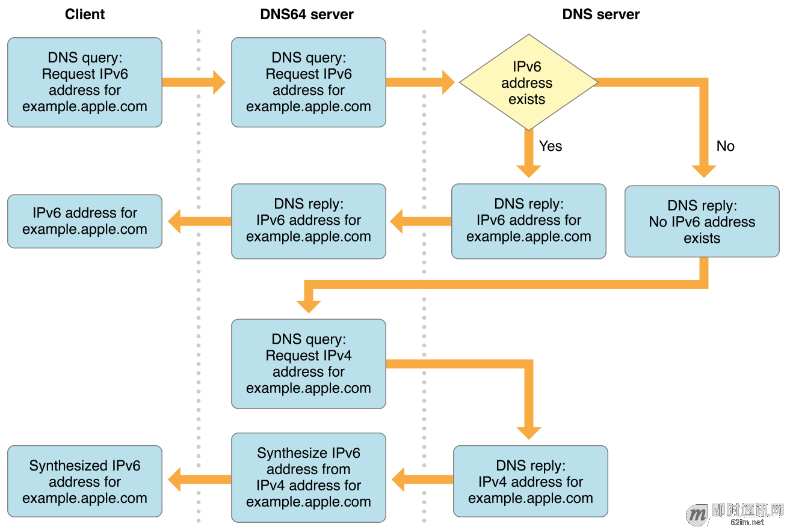

▲ 图33：苹果提供的过渡技术解决方案

NAT64/DNS64分为NAT64、DNS64两大方面，两者需要结合使用。

DNS64在RFC6147中明确定义，将IPv6的地址记录AAAA DNS查询消息转换为IPv4的地址记录查询。当IPv6节点发起DNS请求，NAT64/DNS64中间层同时发起A域名查询和AAAA域名查询。如果仅有A域名查询的IPv4地址响应，表明IPv6节点需要访问一个IPv4的节点，NAT64/DNS64中间层将回应的IPv4地址转换为IPv6地址，返回给IPv6节点。

IPv6节点使用获取到的IPv6服务端地址进行访问，数据包会经过NAT64/DNS64中间层，中间层将IPv6地址映射转换为IPv4的地址进行访问。

实验环境搭建过程如下。

Linux平台下有多个NAT64的开源软件，实现方式各有不同，有纯内核态实现的ecdysis，也有用户态实现的tayga。

DNS64的实现可以使用著名的开源DNS服务BIND就可以很好地支持，详细可以查看上面2个开源软件的搭建说明。

时间的原因，还没有把NAT64/DNS64的开源软件研究透彻，因此这里的实践等以后有机会再补上。

**PS：**在研究tayga和miredo源码的时候，发现了在Linux平台上面有一些有趣的东西，如下图，是tayga的软件实现框架。

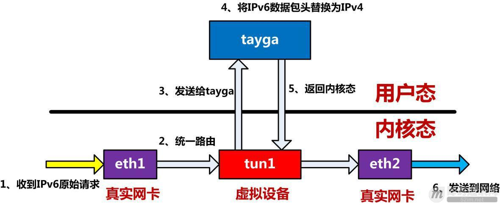

▲ 图34：Linux下的一个有趣的虚拟设备

Linux内核自带了一个软件虚拟设备，也是一种隧道的实现(/dev/net/tun)，该设备可以实现将内核态的网络数据发送到用户态，用户态修改后再返回给内核态，用户态的进程负责完成NAT64这一次“偷龙转凤”操作。

关于/dev/net/tun设备的实现，可以查阅Linux内核源码drivers/net/tun.c，一些著名的VPN软件例如openvpn等，都是以它作为实现基础。

本章只介绍了一些典型的过渡技术，其实过渡技术种类还有很多，有一些在实验室阶段，有一些已经商用，有一些已经被废弃，但是总的来说，每一种过渡技术都是在解决特定时期特定场景下的过渡问题。

## 6、IPv6 Socket编程应该注意的问题

在《IPv6 Socket编程》一文中，ray已经很详细介绍了IPv6下的socket编程细节和应该注意的问题。本章作为一个补充，介绍一下IPv6 socket编程可能还会遇到的问题。

### 6.1IPv6地址编码

IPv4地址本质是一个32位整数，因此一般无论是存储层还是逻辑层，都经常将点分制的IPv4字符串地址转为32位整数使用。而在IPv6，情况就复杂多了（可能也有同学就想到，光是原子性就很难保证了）。

举一个典型的例子，现在有个需求，分别统计每个IP的访问频次。

在IPv4的情况下，最简单就是STL用std::map搞定（单线程），土豪一点的可以开个16G的数组用空间换时间。

但是在IPv6的场景下，那就尴尬了，IPv6可是个128位整数，可以用map吗？可能会有人直接将原始的字符串类型的IPv6地址作为key来累计。一旦那么用，就要十分注意了。由于IPv6是支持前导0和连续0的压缩表示方式，而且支持英文字母大小写，例如：

2001:db8:4::41
2001:db8:4:0:0:0:0:0:41
2001:0db8:4::41
2001B8:4::41

这4个都是合法的IPv6地址，如果将输入毫无修改地作为key来累计，那必须会将累计逻辑分散了，最终得不到正确的频率结果。类似的问题也在MAC地址（BSSID）上面，由于MAC地址分号间的数字前导0可以省略，并且也是支持大小写英文字母，所以也是会同样的问题。在微信安全中心，MAC地址的逻辑统一转为64位整数处理，情况相对还好。

但是到了IPv6有木有更好的解决办法呢？答案是肯定的，但是需要具体问题具体分析。

在上面的频率例子比较优雅的做法，依然用map的话，可以利用自定义key类型解决，这个方法需要重载自定义类型的比较符号’<’，如下图所示：

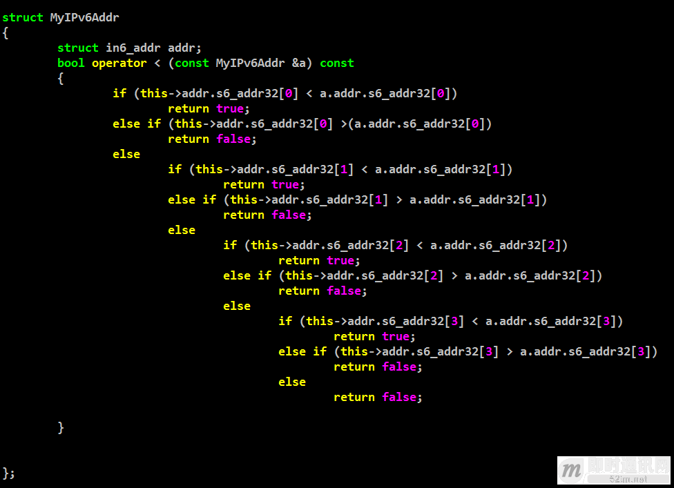

▲ 图35：自定义IPv6地址结构
其中struct in6_addr就是一个128位的IPv6地址结构体。

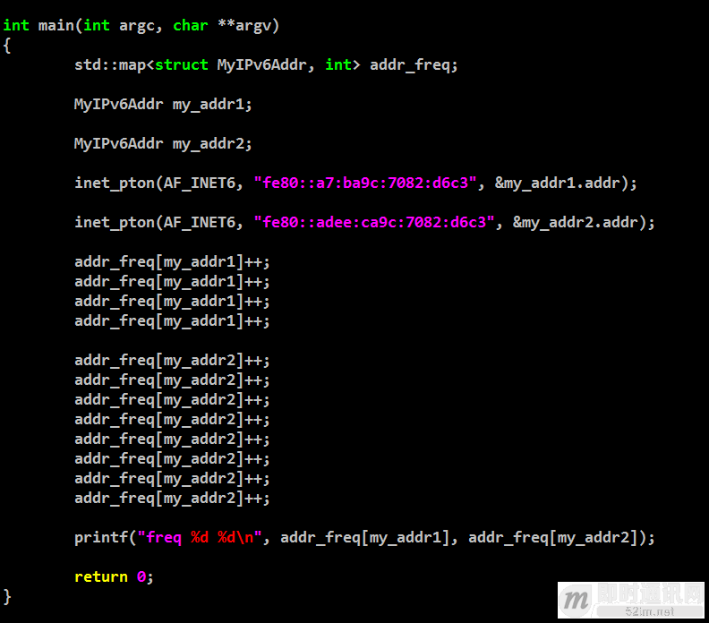

▲ 图36：使用std::map实现IPv6频率

其实还有更优雅的方式，直接将IPv6的地址强制转为2个64位整数来比较，if else会写得更少一些，效率更高一些。

上面说到2个64位整数，微信安全中心有一些静态的key-value数据查询（批量写，多次读），其中key是MD5，我们将MD5也是作为2个64位整数来对待，将2个64位整数联合排序，写入内存，然后使用两次二分查找的方式搜索，效率非常高。在这种场景下面，IPv6也是可以用类似的方法处理。

IPv6地址结构，以后很可能会给我们的编程或多或少带来一些“未知”的坑-_-||。

### 6.2IPv6 socket“兼容”IPv4的情况

在IPv4和IPv6共存的一个很长的时间里，在socket编程上不得不面对的就是IPv6和IPv4一定程度的“兼容问题”。而在文章前面有提到，IPv6和IPv4和完全不兼容的两种协议，但是IPv6协议的地址空间更大，是可以使用IPv6的地址表示IPv4地址，例如IPv4映射地址，因此，在很特殊的情况下，IPv4和IPv6可以实现“兼容”，但是这种兼容是很有限的。在Linux平台下，这种“兼容性”是如何表现的，我们这里来分析一下。

在Linux下面，以IPv6下的UDP Socket举例，详细如下。

有个UDP协议的Server改造IPv6，该Server机器上有一个网卡并且同时配置IPv6和IPv4地址，支持双栈。Server进程创建IPv6 UDP socket套接字，绑定Server本地任意地址（IPv4和IPv6都是以全0地址为绑定任意地址）。客户端是IPv4，向这个Server发送UDP请求数据包。

▲ 图37：IPv6服务收到IPv4报文

可以看到的是，IPv6的socket会正常收到客户端的数据报文，并且会将IPv4地址转化为映射地址，为了明确这个逻辑，我们分析Linux内核的实现。

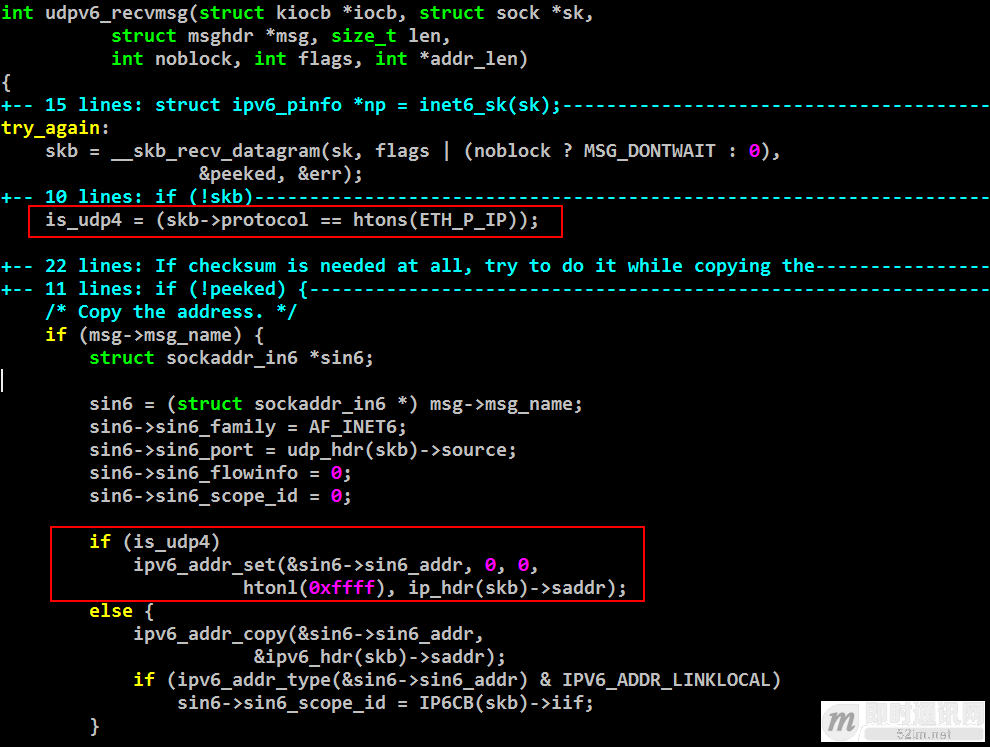

▲ 图38：IPv6下UDP socket收到IPv4数据包内核实现

IPv6的socket收到数据包，如果是IPv4协议，则将来源IPv4的IP地址转为IPv6的IPv4映射地址。与实验的结果很一致。

如果Server的IPv6 socket按照这个来源地址返回数据包，那么内核又是如何处理的呢？

▲ 图39：IPv6下UDP socket发送IPv4数据包内核实现

首先内核会判断目的地址是否为IPv6的IPv4映射地址，如果是映射地址，那么要发送的数据是IPv4数据，直接以IPv4协议栈的形式发送该数据（udp_sendmsg是IPv4 udp发送接口）。

可以看到，Linux内核本身对这类双栈上的改造做了一定的适配，我们可以根据内核的这种特性去进行改造工作。

### 6.3使用链路本地地址

从前面的章节可以知道，IPv6具有自动配置地址的能力。链路本地地址是IPv6要求在每个接口默认自动配置生成的地址，用于链路上的通信，路由器不能转发链路本地地址。除了以上提到的特征外，链路本地地址就是一个普通的IPv6地址，我们可以使用这类地址做socket编程通信。

但是我们在IPv6 Socket编程的时候使用链路本地地址，有一个细节需要注意。

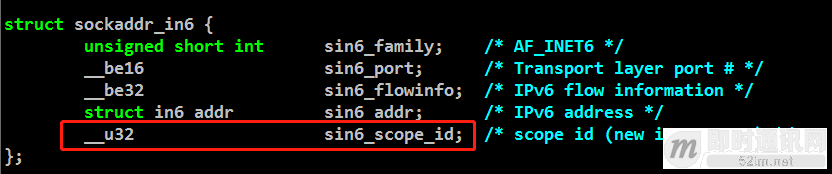

▲ 图40：IPv6地址结构

在IPv6地址结构中（对应于IPv4的struct sockaddr_in），有一个我们非常陌生的字段scope_id，这个字段在我们使用链路本地地址来编程的时候是必须要使用的，这个字段表示我们需要选择接口ID。为什么需要需要有这么一个字段，那是因为链路本地地址的特殊性，一个网络节点可以有多个网络接口，多个网络接口可以有相同的链路本地地址，例如我们需要bind一个本地链路地址，这个时候就会有冲突，操作系统无法决策需要绑定的是哪个接口的本地链路地址。

又例如，如果我们在直连的2个主机之间直接用链路本地地址ping的话，会ping失败。

因此IPv6引入了scope_id来解决这个问题，scope_id指定了使用哪个网络接口。

如何查看这个网络接口（网卡）的scope_id是多少？

**在Linux下查看网络接口的scope_id：**

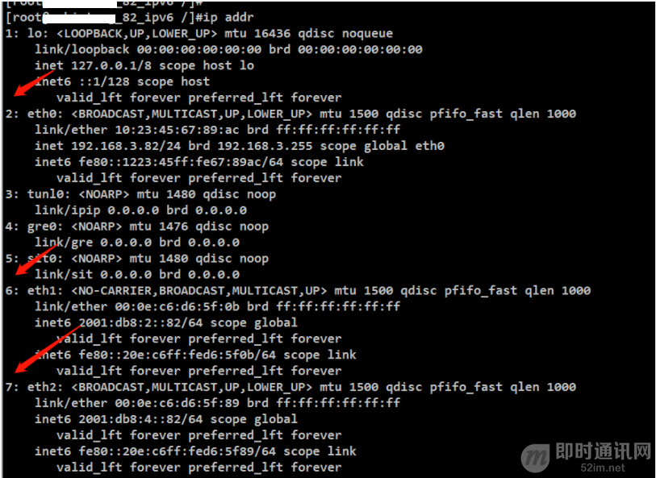

▲ 图41：Linux下查看网络接口scope id

使用ip addr命令可以查看每个接口的scope_id，如图第一列的数字就是scope_id。

**在windows下查看scope_id：**

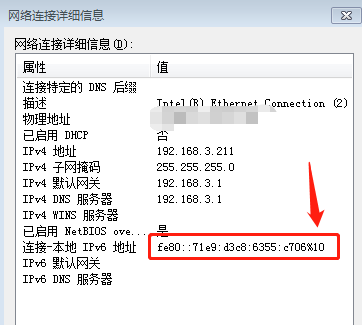

▲ 图42：Windows下查看网路接口scope id

最后的百分号%后面的数字就是该网络接口的scope_id。

Windows下也可以使用route print -6查看接口列表，列表第一列数字就是scope_id。

因此，在使用链路本地地址编程的时候，需要把这个scope_id赋值到sin6_scope_id字段。

而在使用ping命令的时候，需要在地址后面加上%和scope_id才能ping成功，如图：

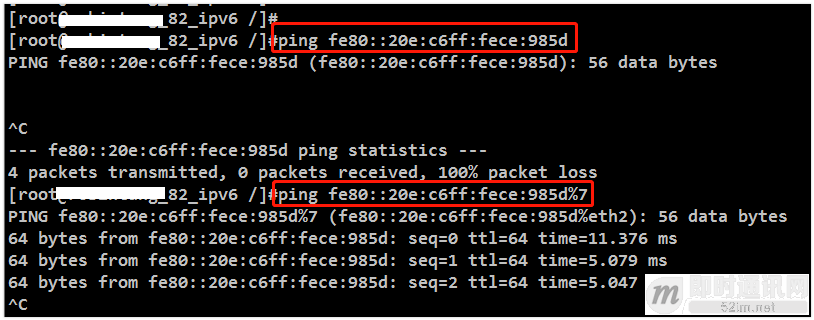

▲ 图43：使用链路本地地址ping

关于这个scope id，详细可以查看[RFC2553](https://tools.ietf.org/html/rfc2553)。

## 7、全文总结

本文主要科普介绍了IPv6的基本内容，配合各种实验分析比较清晰认识了IPv6的各种基本概念；也介绍一些“超纲”的内容（我们的工作中很可能不会接触到），但是我觉得这类内容在技术实现上十分有趣，可以在一些技术的方法和思路上面可能会给我们一些通用的启示，例如NAT64/DNS64就是使用中间层来处理IPv4和IPv6互通的问题，我们的工作中也确实经常遇到类似的技术问题。

IPv6本身是一个很庞大的体系，还有很多高级内容没有介绍（IPv6-IPSec、移动IPv6等等）。而且查看和IPv6相关的RFC，不断在做修正，Linux内核的IPv6模块代码也不断有配合新的RFC修改来做调整，引入新的逻辑，以适应各种场景的实际需求。有兴趣的同学可以一直留意RFC的变化和紧跟Linux内核的版本发布。

本文是我在结合各种文献和实验对IPv6理解的一个总结归纳，难免会有理解偏差和手抖的地方，希望各位同学熟悉的话能帮忙指出其中的错误，并且提供修改建议和意见，谢谢：）。