**P2P技术详解(三)：P2P中的NAT穿越(打洞)方案详解(进阶分析篇)**

# 1、引言

接本系列的上一篇《[P2P技术详解(二)：P2P中的NAT穿越(打洞)方案详解(基本原理篇)](http://www.52im.net/thread-542-1-1.html)》，本篇将深入分析各种NAT穿越(打洞)方案的技术实现原理和数据交互过程，希望能助你透彻理解它们。

**本文作者的其它几篇文章或许你也感兴趣：**

- 《[不为人知的网络编程(一)：浅析TCP协议中的疑难杂症(上篇)](http://www.52im.net/thread-1003-1-1.html)》
- 《[不为人知的网络编程(二)：浅析TCP协议中的疑难杂症(下篇)](http://www.52im.net/thread-1004-1-1.html)》
- 《[不为人知的网络编程(五)：UDP的连接性和负载均衡](http://www.52im.net/thread-1018-1-1.html)》
- 《[不为人知的网络编程(六)：深入地理解UDP协议并用好它](http://www.52im.net/thread-1024-1-1.html)》

*** 阅读注意：**本文属高阶文章，在你了解P2P基础原理或还未读过本系列前几篇之前，请慎读本篇，否则读完要砸电脑，我也拉不住 ....

# 2、《P2P技术详解》系列文章

➊ **本文是《P2P理论详解》系列文章中的第3篇，总目录如下：**

- 《[P2P技术详解(一)：NAT详解——详细原理、P2P简介](http://www.52im.net/thread-50-1-1.html)》
- 《[P2P技术详解(二)：P2P中的NAT穿越(打洞)方案详解(基本原理篇)](http://www.52im.net/thread-542-1-1.html)》
- 《[P2P技术详解(三)：P2P中的NAT穿越(打洞)方案详解(进阶分析篇)](http://www.52im.net/thread-2872-1-1.html)》（本文）
- 《[P2P技术详解(四)：P2P技术之STUN、TURN、ICE详解](http://www.52im.net/thread-557-1-1.html)》

➋ **P2P相关的其它资源：**

- 《[通俗易懂：快速理解P2P技术中的NAT穿透原理](http://www.52im.net/thread-1055-1-1.html)》（* 适合入门）
- 《[最新收集NAT穿越(p2p打洞)免费STUN服务器列表 [附件下载\]](http://www.52im.net/thread-608-1-1.html)》
- 《[一款用于P2P开发的NAT类型检测工具 [附件下载\]](http://www.52im.net/thread-609-1-1.html)》

另外，如果你觉得本文对网络通信的基础知识讲的不够系统话，可继续看看下面这些精华文章大餐。

**➌ 网络编程基础知识：**

- 《[TCP/IP详解](http://www.52im.net/topic-tcpipvol1.html) - [第11章·UDP：用户数据报协议](http://docs.52im.net/extend/docs/book/tcpip/vol1/11/)》
- 《[TCP/IP详解](http://www.52im.net/topic-tcpipvol1.html) - [第17章·TCP：传输控制协议](http://docs.52im.net/extend/docs/book/tcpip/vol1/17/)》
- 《[TCP/IP详解](http://www.52im.net/topic-tcpipvol1.html) - [第18章·TCP连接的建立与终止](http://docs.52im.net/extend/docs/book/tcpip/vol1/18/)》
- 《[TCP/IP详解](http://www.52im.net/topic-tcpipvol1.html) - [第21章·TCP的超时与重传](http://docs.52im.net/extend/docs/book/tcpip/vol1/21/)》
- 《[通俗易懂-深入理解TCP协议（上）：理论基础](http://www.52im.net/thread-513-1-1.html)》
- 《[通俗易懂-深入理解TCP协议（下）：RTT、滑动窗口、拥塞处理](http://www.52im.net/thread-515-1-1.html)》
- 《[理论经典：TCP协议的3次握手与4次挥手过程详解](http://www.52im.net/thread-258-1-1.html)》
- 《[理论联系实际：Wireshark抓包分析TCP 3次握手、4次挥手过程](http://www.52im.net/thread-275-1-1.html)》
- 《[计算机网络通讯协议关系图（中文珍藏版）](http://www.52im.net/thread-180-1-1.html)》
- 《[脑残式网络编程入门(一)：跟着动画来学TCP三次握手和四次挥手](http://www.52im.net/thread-1729-1-1.html)》
- 《[脑残式网络编程入门(二)：我们在读写Socket时，究竟在读写什么？](http://www.52im.net/thread-1732-1-1.html)》
- 《[脑残式网络编程入门(三)：HTTP协议必知必会的一些知识](http://www.52im.net/thread-1751-1-1.html)》
- 《[脑残式网络编程入门(四)：快速理解HTTP/2的服务器推送(Server Push)](http://www.52im.net/thread-1795-1-1.html)》
- 《[脑残式网络编程入门(五)：每天都在用的Ping命令，它到底是什么？](http://www.52im.net/thread-1973-1-1.html)》
- 《[脑残式网络编程入门(六)：什么是公网IP和内网IP？NAT转换又是什么鬼？](http://www.52im.net/thread-2082-1-1.html)》
- 《[脑残式网络编程入门(七)：面视必备，史上最通俗计算机网络分层详解](http://www.52im.net/thread-2851-1-1.html)》

**➍ 如果觉得上面的文章枯燥，则《网络编程懒人入门》系列可能是你的菜：**

- 《[网络编程懒人入门(一)：快速理解网络通信协议（上篇）](http://www.52im.net/thread-1095-1-1.html)》
- 《[网络编程懒人入门(二)：快速理解网络通信协议（下篇）](http://www.52im.net/thread-1103-1-1.html)》
- 《[网络编程懒人入门(三)：快速理解TCP协议一篇就够](http://www.52im.net/thread-1107-1-1.html)》
- 《[网络编程懒人入门(四)：快速理解TCP和UDP的差异](http://www.52im.net/thread-1160-1-1.html)》
- 《[网络编程懒人入门(五)：快速理解为什么说UDP有时比TCP更有优势](http://www.52im.net/thread-1277-1-1.html)》
- 《[网络编程懒人入门(六)：史上最通俗的集线器、交换机、路由器功能原理入门](http://www.52im.net/thread-1629-1-1.html)》
- 《[网络编程懒人入门(七)：深入浅出，全面理解HTTP协议](http://www.52im.net/thread-1677-1-1.html)》
- 《[网络编程懒人入门(八)：手把手教你写基于TCP的Socket长连接](http://www.52im.net/thread-1722-1-1.html)》
- 《[网络编程懒人入门(九)：通俗讲解，有了IP地址，为何还要用MAC地址？](http://www.52im.net/thread-2067-1-1.html)》
- 《[网络编程懒人入门(十)：一泡尿的时间，快速读懂QUIC协议](http://www.52im.net/thread-2816-1-1.html)》

**➎ 如果感到自已已经很牛逼了，《不为人知的网络编程》应该是你菜：**

- 《[不为人知的网络编程(一)：浅析TCP协议中的疑难杂症(上篇)](http://www.52im.net/thread-1003-1-1.html)》
- 《[不为人知的网络编程(二)：浅析TCP协议中的疑难杂症(下篇)](http://www.52im.net/thread-1004-1-1.html)》
- 《[不为人知的网络编程(三)：关闭TCP连接时为什么会TIME_WAIT、CLOSE_WAIT](http://www.52im.net/thread-1007-1-1.html)》
- 《[不为人知的网络编程(四)：深入研究分析TCP的异常关闭](http://www.52im.net/thread-1014-1-1.html)》
- 《[不为人知的网络编程(五)：UDP的连接性和负载均衡](http://www.52im.net/thread-1018-1-1.html)》
- 《[不为人知的网络编程(六)：深入地理解UDP协议并用好它](http://www.52im.net/thread-1024-1-1.html)》
- 《[不为人知的网络编程(七)：如何让不可靠的UDP变的可靠？](http://www.52im.net/thread-1293-1-1.html)》
- 《[不为人知的网络编程(八)：从数据传输层深度解密HTTP](http://www.52im.net/thread-2456-1-1.html)》
- 《[不为人知的网络编程(九)：理论联系实际，全方位深入理解DNS](http://www.52im.net/thread-2740-1-1.html)》

**➏ 如果看完上面的文章还是躁动不安，那看看《高性能网络编程系列》吧：**

- 《[高性能网络编程(一)：单台服务器并发TCP连接数到底可以有多少](http://www.52im.net/thread-561-1-1.html)》
- 《[高性能网络编程(二)：上一个10年，著名的C10K并发连接问题](http://www.52im.net/thread-566-1-1.html)》
- 《[高性能网络编程(三)：下一个10年，是时候考虑C10M并发问题了](http://www.52im.net/thread-568-1-1.html)》
- 《[高性能网络编程(四)：从C10K到C10M高性能网络应用的理论探索](http://www.52im.net/thread-578-1-1.html)》
- 《[高性能网络编程(五)：一文读懂高性能网络编程中的I/O模型](http://www.52im.net/thread-1935-1-1.html)》
- 《[高性能网络编程(六)：一文读懂高性能网络编程中的线程模型](http://www.52im.net/thread-1939-1-1.html)》

# 3、NAT和NAPT

网络地址转换（NAT，全称Network Address Translation），早期的NAT指的是Basic NAT（静态NAT），它在技术上比较简单一点，仅支持地址转换，不支持端口映射。这就需要对每一个当前连接都要对应一个IP地址，因此要维护一个公网的地址池。

我们可以看出，**Basic NAT一个比较明显的缺陷就是：**同一时刻只能少量位于NAT后面的机器能够和外部交互（要看NAT有几个外网IP）。

后期的NAT基本都指的是NAPT(网络地址端口转换)了，这种方式支持端口的映射并允许多台主机共享一个公用IP地址，这样就可以支持同时多个位于NAT后面的机器和外部进行交互了。

**支持端口转换的NAT又可以分为两类：**

- 1）源地址转换（SNAT）；
- 2）目的地址转换NAT（DNAT）。

下面说的NAT都是指NAPT。

# 4、NAT带来的问题

**NAT在缓解IPv4地址资源的紧张的同时，也带来了不少问题：**

- 1）NAT使IP会话的保持时效变短；
- 2）NAT在实现上将多个内部主机发出的连接复用到一个IP上，这就使依赖IP进行主机跟踪的机制都失效了；
- 3）NAT工作机制依赖于修改IP包头的信息，这会妨碍一些安全协议的工作；
- 4）NAT限制了使用一些高层协议(FTP、Quake、SIP)的Peer两端的P2P通信。

***对于问题1：***其主要原因是，NAT设备建立的内网IP、端口到外网IP、端口的映射的表项是有一个保活期的。如果在一个超时时间内，该映射上没有实际数据的传输，那么NAT会过期并回收这个映射表项给其他通信链路用(IP和端口资源有限，通信的链路是无限)。为了避免这种通信链路提前被NAT中断的情况，很多应用层协议在设计的时候就考虑了一个连接保活的机制，即在一段时间没有数据需要发送时，主动发送一个NAT能感知到而又没有实际数据的保活消息，这么做的主要目的就是重置NAT的会话定时器。

***对于问题2：***其主要原因是，对于NAT后面的N多主机，在外部看来都是同一个主机(NAT设备)，于是来之同一个IP的数据包一定是来之同一个主机的前提判断就会不准确了，这样一下基于这个前提的机制(例如：TCP的TIME_WAIT的回收和重用)都会有问题。

***对于问题3：***其主要原因是，NAT篡改了IP地址、传输层端口号和校验和。

***对于问题4：***其主要原因是，一般情况下，NAT是不允许外部的Peer节点主动连接或发送数据包给NAT后面的主机的(这里的主动指的是，在一段时间内，首先发送数据包的一方为主动方)。

**NAT表现出这样的行为，主要基于下面的几点考虑：**

- 1）出于安全考虑，避免来自网络外部的攻击，隐藏并保护网络内部的计算机；
- 2）位于NAT后面的很多主机，对于主动进来的数据包，NAT一般不知道该路由给内部的哪个主机(NAT设备上没有相关转发表项)。

由于NAT这种特性，那么在NAT环境下，实现P2P通信的完整解决方案包括几个部分呢？相关的原理、方法、技术有哪些？

**对于一个完整的P2P通信解决方案，其实现包括下面两个步骤：**

- 1）首先在Server的协助下，通信两端Peer尝试相互连接，如果两端Peer在尝试互联不成功后，那么就将失败结果反馈给Server转入步骤2）；
- 2）这个步骤比较简单粗暴了，就是relay(服务器中转)，简单的来讲就是Peer1将要发给Peer2的数据发给Server，然后由Server帮忙转发给Peer2，同样对于Peer2来说也一样。

对于实现P2P通信，步骤1是大家下功夫最多的，其原因比较简单，就是步骤2需要消耗较多的服务器资源，成本比较高。步骤1实现P2P两个节点间的直接通信，在资源消耗和效率上都是比较好的。

# 5、P2P通信穿越NAT的技术、方法

**目前常见的P2P通信穿越NAT的技术、方法主要有：**

- 1）应用层网关；
- 2）中间件技术；
- 3）打洞技术(Hole Punching)；
- 4）Relay(服务器中转)技术。

# 6、NAT穿越技术1：应用层网关

应用层网关(ALG)是解决NAT对应用层协议无感知的一个最常用方法，已经被NAT设备厂商广泛采用，成为NAT设备的一个必需功能。

## 6.1、原理

利用带有ALG功能的NAT对特定应用层协议的支持和理解，在一个NAT网关检测到新的连接请求时，需要判断是否为已知的应用类型，这通常是基于连接的传输层端口信息来识别的。在识别为已知应用时，再调用相应功能对报文的深层内容进行检查，当发现任何形式表达的IP地址和端口时，将会把这些信息同步转换，并且为这个新连接创建一个附加的转换表项。

这样，当报文到达公网侧的目的主机时，应用层协议中携带的信息就是NAT网关提供的地址和端口。

**例如：**下图，对于使用主动模式的FTP协议(PORT方式)，就需要AGL的支持了。

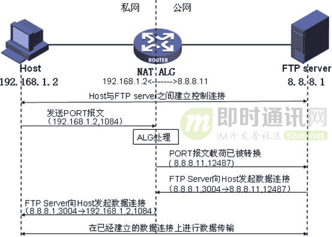

由于FTP协议通信需要两个TCP连接，一个是命令链路，用来在FTP客户端与服务器之间传递命令；另一个是数据链路，用来上传或下载数据。如上图，位于NAT后面的FTP client(192.168.1.2)首先发起一个TCP连接(命令链路)连上外网FTP Server(8.8.8.1)，然后发送PORT报文(192.168.1.2，1084)说自己在1084端口接收数据，然后进过ALG处理PORT报文变成(8.8.8.1，12487)，同NAT建立其一条(192.168.1.2，1084 <—>8.8.8.1，12487)映射。这样FTP Server发往(8.8.8.1，12487)的数据就会被转到(192.168.1.2，1084)，从而实现数据传输(如果没经过ALG处理，那么FTP Server直接连接192.168.1.2，1084是无法连接上的)。

## 6.2、限制

ALG技术是利用NAT本身的支持来进行NAT的穿越，这个方案有很大限制，主要的原因是ALG都是为特定协议的特定规范版本而开发的，然而不管是协议本身，还是协议的数量都在变化，这就使得ALG适应性不强。

# 7、NAT穿越技术2：中间件技术

这是一种通过开发通用方法解决NAT穿越问题的努力。与前者不同之处是，AGL技术中NAT网关是这一解决方案的唯一参与者，而中间件技术中客户端会参与网关公网映射信息的维护。UPnP就是这样一种方法，UPnP中文全称为通用即插即用，是一个通用的网络终端与网关的通信协议，具备信息发布和管理控制的能力。

## 7.1、原理

NAT只要理解客户端的请求并按照要求去分配响应的映射转换表，不需要自己去分析客户端的应用层数据。网关映射请求可以为客户动态添加映射表项。

此时，NAT不再需要理解应用层携带的信息，只转换IP地址和端口信息。而客户端通过控制消息或信令发到公网侧的信息中，直接携带公网映射的IP地址和端口，接收端可以按照此信息建立数据连接。NAT网关在收到数据或连接请求时，按照UPnP建立的表项只转换地址和端口信息，不关心内容，再将数据转发到内网。

## 7.2、限制

这种方案需要网关、内部主机和应用程序都支持UPnP技术，且组网允许内部主机和NAT网关之间可以直接交换UPnP信令才能实施。

# 8、NAT穿越技术3：打洞技术(Hole Punching)

Hole Punching技术是工作在运输层的技术，可以屏蔽上层应用层的差异，并且不需要NAT网关特定的支持，因此其通用性比较强，应用性也比较广。

## 8.1、原理

打洞技术的原理比较简单，就是NAT内网的节点需要在NAT上建立自己的一条转发映射关系(这就是所谓的在NAT上打下一个洞)，然后外网的节点就通过这个”洞”来进行通信。为描述方便，我们将一对IP地址和端口信息的组合称之为一个Endpoint。

**打洞原理可以简化为下面三个过程：**

- 1）首先位于NAT后的Peer1节点需要向外发送数据包，以便让NAT建立起内网Endpoint1(IP1、PORT1)和外网Endpoint2(IP2、PORT2)的映射关系；
- 2）然后通过某种方式将映射后的外网Endpoint2通知给对端节点Peer2；
- 3）最后Peer2往收到的外网Endpoint2发送数据包，然后该数据包就会被NAT转发给内网的Peer1。

**上面三个过程比较简单，然而细心的同学会有些疑问：**

- 1）步骤[1]中的映射关系的建立有什么规律的么?怎样才能获取到映射关系呢？
- 2）通知对端节点Peer2的方式一般是怎么样的？
- 3）步骤[3]一定可以实现么？也就是Peer2往收到的外网Endpoint2发送数据包，就一定能够被NAT转发给内网的Peer1吗？

对于疑问(3)，如果全部会被转发给内网Peer1，那会不会太不安全了，只要知道内网Peer1的映射后的外网Endpoint2，就可以给穿透NAT给内网Peer1发送数据，这样内网Peer1不就很容易遭到攻击了？如果全部都不转发给内网Peer1，这样Peer1只能向外发数据，而无法收到外面的数据，严重影响Peer1的正常通信。

那么，这就比较明了了，我们需要的是一部分可以转发，另外一部分不转发。这就涉及到NAT对外来数据包的一个过滤规则了，而疑问(1)提到的映射关系建立的规则，这涉及到NAT的Endpoint的映射规则。

那么问题来了，有什么方法可以知道NAT的Endpoint映射规则和对外来数据包的过滤规则呢？

## 8.2、方法

由上面原理的讨论我们知道，要实现打洞穿越NAT，首先需要知道NAT的行为规则(NAT的Endpoint映射规则和对外来数据包的过滤规则)，这样才能更好地实现打洞穿越。

那NAT有哪些行为类型？有什么办法来侦测NAT的行为呢？

### 8.2.1NAT行为类型与侦测方法

NAT的行为类型和侦测方法是由STUN（首先在[RFC3489](https://datatracker.ietf.org/doc/rfc3489/)中定义，英文全称是Simple Traversal of UDP Through NATs）协议来描述的，STUN协议包括了[RFC3489](https://datatracker.ietf.org/doc/rfc3489/)、[RFC5389](https://datatracker.ietf.org/doc/rfc5389/)、[RFC5780](https://datatracker.ietf.org/doc/rfc5780/)、[RFC5769](https://datatracker.ietf.org/doc/rfc5769/)几个系列文档。

**早期的STUN协议是由[RFC3489](https://datatracker.ietf.org/doc/rfc3489/)（经典的STUN）来描述，其定义的NAT行为类型如下：**

1）Full Cone NAT - 完全锥形NAT：
所有从同一个内网IP和端口号Endpoint1发送过来的请求都会被映射成同一个外网IP和端口号Endpoint2，并且任何一个外网主机都可以通过这个映射的Endpoint2向这台内网主机发送包。也就是外网所有发往Endpoint2的数据包都会被NAT转发给Endpoint1。由于对外部请求的来源无任何限制，因此这种方式虽然足够简单，但却不安全。

2）Restricted Cone NAT - 限制锥形NAT：
它是Full Cone的受限版本：所有来自同一个内网Endpoint1的请求均被NAT映射成同一个外网Endpoint2，这与Full Cone相同。但不同的是，只有当内网Endpoint1曾经发送过报文给外部主机（假设其IP地址为IP3）后，外部主机IP3发往Endpoint2的数据包才会被NAT转发给Endpoint1。这意味着，NAT设备只向内转发那些来自于当前已知的外部主机的数据包，从而保障了外部请求来源的安全性

3）Port Restricted Cone NAT - 端口限制锥形NAT：
它是Restricted Cone NAT的进一步受限版，与限制锥形NAT很相似，只不过它包括端口号PORT。只有当内网Endpoint1曾经发送过报文给外部Endpoint3(包括IP和端口了)，Endpoint3发往Endpoint2的数据包才会被NAT转发给Endpoint1。端口号PORT这一要求进一步强化了对外部报文请求来源的限制，从而较Restrictd Cone更具安全性。

4）Symmetric NAT - 对称NAT：
上面的1）2）3）所有的Cone NAT中，映射关系只和内网的源Endpoint1相关，只要源Endpoint1不变其都会被映射成同一个Endpoint2。而对称NAT的映射关系不只与源Endpoint1相关，还与目的Endpoint3相关。也就是源Endpoint1发往目的Endpoint30的请求被映射为Endpoint20，而源Endpoint1发往目的Endpoint31的请求，则被映射为Endpoint21了。此外，只有收到过内网主机发送的数据的外网主机才可以反过来向内网主机发送数据包。

经典 STUN 定义的 NAT 行为类型是将NAT的Mapping Behavior （映射规则）和Filtering Behavior（过滤规则）统一来归类的，这样对Symmetric NAT类型的归类过于笼统，使得许多 NAT 不完全符合由它定义的类型。

于是后来，RFC3489被废弃并由RFC5389来替代，在RFC5389中，将Mapping Behavior （映射规则）和Filtering Behavior（过滤规则）分开来，定义了3种Mapping Behavior （映射规则）和3种Filtering Behavior（过滤规则），一共有9种组合。

**为什么是3种呢？其实理由很简单，对于一个特定的内网源Endpoint1，影响其映射关系的因素不外乎就4种情况：**

- 1）目的IP和目的端口PORT都无关；
- 2）目的IP和目的端口PORT都相关；
- 3）仅仅目的IP相关；
- 4）仅仅目的PORT相关。

对于4仅仅考虑一下PORT信息有点鸡肋，基本和1差不多，于是把4去掉了。同样，对于过滤规则也一样。

3种Mapping Behavior （映射规则）和 Filtering Behavior（过滤规则）如下。

**Mapping Behavior：**

1）Endpoint-Independent Mapping：
对于一个内网的EndpointP，其映射的外网EndpointG是基本固定的，不会随着通信外部主机的不同而变化。

2）Address and Port-Dependent Mapping：
对于一个内网的EndpointP，如果与之通信的外部为EndpointGB1，那么EndpointP就会被NAT映射成EndpointG1；如果与之通信的外部为EndpointGB2，那么EndpointP就会被NAT映射成EndpointG2。也就是只要之通信的外部为EndpointGB发生变化，那么映射的外网EndpointG就会变化。

3）Address-Dependent Mapping：
对于一个内网的EndpointP，如果与之通信的外部为EndpointGB1，那么EndpointP就会被NAT映射成EndpointG1；如果与之通信的外部为EndpointGB2(如果EndpointGB2的IP和EndpointGB1的相同)，那么EndpointP同样会被NAT映射成EndpointG1，否则就会被NAT映射成EndpointG2。也就是只要之通信的外部为EndpointGB的IP发生变化，那么映射的外网EndpointG就会变化。

**Filtering Behavior：**

1）Endpoint-Independent Filtering：
对于这种过滤类型，NAT在在自己的一个外网EndpointG1收到数据包，只要找到与之对应的内网EndpointP1，NAT就会转发这个数据包给相应的内网EndpointP1，不管这个数据包的来源是那里。(一般来说，这样过滤规则的NAT是比较少的，因为这样的安全系数比较低)

2）Address and Port-Dependent Filtering：
对于这种过滤类型，NAT在自己的一个外网EndpointG1收到来源是EndpointGA1数据包，这个时候NAT要判断自己是否曾经通过自己的EndpointG1给EndpointGA1发送过数据包，如果曾经发过，那么NAT就允许该数据包通过NAT并路由给内网与之对于的内网EndpointP1；如果没发过，那么NAT会不允许该数据包通过NAT。

3）Address-Dependent Filtering：
对于这种过滤类型，NAT在自己的一个外网EndpointG1收到来源是EndpointGA1数据包，这个时候NAT要判断自己是否曾经通过自己的EndpointG1给和EndpointGA1的IP相同的机器发送过数据包(这里会忽略端口)，如果曾经发过，那么NAT就允许该数据包通过NAT并路由给内网与之对于的内网EndpointP1；如果没发过，那么NAT会不允许该数据包通过NAT。

RFC5389只是定义了协议的相关属性、机制、报文结构以及一些相关的安全注意点等等，并有没对怎么进行完整的NAT类型侦测做介绍。而对完整NAT类型侦测过程主要由RFC5780这个文档来描述。完整的NAT类型侦测的过程主要在RFC5780文档的4.3和4.4节，主要分为NAT映射规则（Determining NAT Mapping Behavior）和NAT过滤规则（Determining NAT Filtering Behavior）。

**下面对具体的侦测过程做介绍：**

要进行NAT类型的侦测，需要一个具有双公网IP的服务器来协助侦测，我们称该服务器为STUN Server。假设STUN Server的双IP分别为IP_SA(125.227.152.3)和IP_SB(125.227.152.4) 监听的两个端口分别为PORT_SA(4777)和PORT_SB(4888)，客户端A的内网和端口分别为IP_CA(10.70.142.12)和PORT_CA(1234)。

1）客户端A以IP_CA: PORT_CA给STUN Server的IP_SA: PORT_SA发送一个bind请求，STUN server以IP_SA: PORT_SA给客户端A的IP_CA: PORT_CA回复响应，响应内容大体为：（NAT映射后的IP地址和端口为：IP_MCA1: PORT_MCA1，STUN Server的另外一个IP地址和端口为：IP_SB: PORT_SB）。这个时候客户端判断，如果IP_CA: PORT_CA == IP_MCA1: PORT_MCA1，那么该客户端是拥有公网IP的，NAT类型侦测结束。

2）客户端A以IP_CA: PORT_CA给STUN server的IP_SB: PORT_SA(相对步骤1 ip改变了)发送一个bind请求，STUN server以IP_SB: PORT_SA给客户端A的IP_CA: PORT_CA回复响应，响应内容大体为：（NAT映射后的IP地址和端口为：IP_MCA2: PORT_MCA2）。这个时候客户端判断，如果IP_MCA1: PORT_MCA1 == IP_MCA2: PORT_MCA2，那么NAT是Endpoint Independent Mapping的映射规则，也就是同样的内网地址IP_CA: PORT_CA经过这种NAT映射后的IP_M: PORT_M是固定不变的；如果IP_MCA1: PORT_MCA1 != IP_MCA2: PORT_MCA2,那么就要进行下面的第3步测试。

3）客户端A以IP_CA: PORT_CA给STUN server的IP_SB: PORT_SB(相对步骤1 ip和port改变了)发送一个bind请求，STUN server以IP_SB: PORT_SB给客户端A的IP_CA: PORT_CA回复响应，响应内容大体为：（NAT映射后的IP地址和端口为：IP_MCA3: PORT_MCA3）。这个时候客户端判断，如果IP_MCA2: PORT_MCA2== IP_MCA3: PORT_MCA3，那么NAT是Address Dependent Mapping的映射规则，也就是只要是目的IP是相同的，那么同样的内网地址IP_CA: PORT_CA经过这种NAT映射后的IP_M: PORT_M是固定不变的；如果IP_MCA2: PORT_MCA2!= IP_MCA3: PORT_MCA3，那么NAT是Address and Port Dependent Mapping，只要目的IP和PORT中有一个不一样，那么同样的内网地址IP_CA: PORT_CA经过这种NAT映射后的IP_M: PORT_M是不一样的。

以上三个步骤是进行Mapping Behavior的侦测，下面两个步骤是进行Filtering Behavior侦测：

4）客户端A以IP_CA: PORT_CA给STUN server的IP_SA: PORT_SA发送一个bind请求（请求中带CHANGE-REQUEST attribute来要求stun server改变IP和PORT来响应），STUN server以IP_SB: PORT_SB给客户端A的IP_CA: PORT_CA回复响应。如果客户端A能收到STUN server的响应，那么NAT是Endpoint-Independent Filtering的过滤规则，也就是只要给客户端A的IP_CA: PORT_CA映射后的IP_MCA: PORT_MCA地址发送数据都能通过NAT到达客户端A的IP_CA: PORT_CA（这种过滤规则的NAT估计很少）。如果不能收到STUN server的响应，那么需要进行下面的第五步测试。

5）客户端A以IP_CA: PORT_CA给STUN server的IP_SA: PORT_SA发送一个bind请求（请求中带CHANGE-REQUEST attribute来要求stun server改变PORT来响应），STUN server以IP_SA: PORT_SB给客户端A的IP_CA: PORT_CA回复响应。如果客户端A能收到STUN server的响应，NAT是Address-Dependent Filtering的过滤规则，也就是只要之前客户端A以IP_CA: PORT_CA给IP为IP_D的主机发送过数据，那么在NAT映射的有效期内，IP为IP_D的主机以任何端口给客户端A的IP_CA: PORT_CA映射后的IP_MCA: PORT_MCA地址发送数据都能通过NAT到达客户端A的IP_CA: PORT_CA；如果不能收到响应，NAT是Address and Port-Dependent Filtering的过滤规则，也即是只有之前客户端A以IP_CA: PORT_CA给目的主机的IP_D: PORT_D发送过数据，那么在NAT映射的有效期内，只有以IP_D: PORT_D给客户端A的IP_CA: PORT_CA映射后的IP_MCA: PORT_MCA地址发送数据才能通过NAT到达客户端A的IP_CA: PORT_CA。

通过以上5个步骤就能完成完整的NAT类型侦测。

**将NAT映射规则和过滤规则组合起来就形成9中不同的NAT行为类型：**

- 1）Endpoint Independent Mapping和Endpoint-Independent Filtering组合对应于RFC3489中的Full Cone NAT；
- 2）Endpoint Independent Mapping和Address-Dependent Filtering组合对应于RFC3489中的Restricted Cone NAT；
- 3）Endpoint Independent Mapping和Address and Port-Dependent Filtering组合对应于RFC3489中的Port Restricted Cone NAT；
- 4）Address and Port-Dependent Mapping和Address and Port-Dependent Filtering组合是RFC3489中所说的Symmetric NAT。

可见RFC3489只描述了9种NAT组合行为类型中的4种。最后一个文档rfc5769，定义了一些STUN协议的测试数据用于测试STUN server的正确性。

### 8.2.2NAT打洞过程

“打洞”方式穿越NAT有两种形式：TCP”打洞”和UDP”打洞”。原理上，TCP”打洞”与UDP”打洞”是没有本质的区别的。

**然而在实现上，TCP”打洞”的成功率远没UDP”打洞”的成功率高，其主要原因有三：**

1）有些NAT防火墙策略对TCP协议不是很友好：
有些NAT的防火墙策略不允许来路不明的外部向内网机器发起TCP连接。由于TCP是有连接的，NAT比较容易分清哪些是NAT  内网机器主动进行通信的外部节点，这样防火墙策略比较明确。而UDP是无连接的，没有连接来标明一个数据流，协议比较简单，这样NAT支持的比较多。

2）TCP协议本身：
由于TCP的TIME_WAIT状态引起，同一个NAT后面的其他主机发起的连接被误判。具体可以看下面的文章：km.oa.com/group/25569/articles/show/246068 。

3）TCP协议的实现API：
因为标准的Berkeley sockets API是围绕C/S编程而设计的。这个API通过connect()允许一个TCP流套接字初始化一个向外的连接，通过listen()和 accept()监听一个外入的连接，一个套接字不能既用来监听又用来初始化向外的连接。更进一步讲， TCP套接字通常与本地主机上的TCP端口一一对应：一个套接字绑定到本地主机机上的某个端口后，另一个套接字就不能再绑定到该端口。然而TCP打洞要成功，需要一个本地的TCP端口既可以监听外入的连接，同时又可以发起多个向外的连接。幸运的是，所有主流的操作系统都支持一个特殊的socket选项SO_REUSEADDR，它运行应用程序绑定多个设置了该选项的套接字到同一端口。BSD系统引入了SO_REUSEPORT选项来控制端口重用，从而把端口重用和地址重用相分离。在这样的系统中，两个选项都需要被设置。尽管如此，要进行TCP打洞需要进行TCP三次握手的同时打开，但是有些TCP/IP的实现，可能不支持这种同时打开的情况，这样也就无法建立TCP连接了。

下面就几种网络拓扑情况下，NAT打洞步骤进行逐一介绍。为了方便描述，假设通信的两个节点分别为Client A和Client B，而辅助NAT穿越的STUN Server为Server S。下面的所有方法都要求Client A、Client B都与Server S保持一条长连接，或者周期性连上Server S，以便能够接收Server S的相关指令，我们称这两个连接分别为ConnectA1，ConnectB1.

***8.2.2.1）网络拓扑类型一：\***

如下图所示，Client A 位于NAT内网，而Client B是具有公网IP的机器。如果是Client A需要连接Client B那么Client A直接连Client B就可以了。如果Client B需要连接Client A，那么Client B直接Connect Client A一般是连接不上的。但是我们可以反过来让Client A主动去连Client B不就可以了。下面所说的Client A或Client B的NAT类型指的是对于Server S能看到的Client的最外层的NAT的类型。

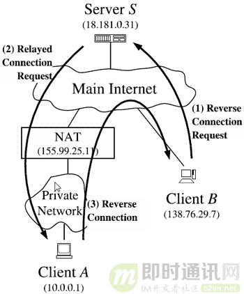

反过来让Client A主动去连Client B的技术就是所谓的：反向连接技术。

**具体的穿越过程如下：**

- 1）Client B通过ConnectB1向Server S发送请求，请求连接Client A；
- 2）Server S按需回复看是否需要启动Client B的NAT类型侦测。(这要看Server S是否已经缓存了Client B的相关NAT信息)；
- 3）Server S通过[2]可以知道Client B具有公网IP，于是，Server S通过ConnectA1发送指令给Client A让Client A主动连Client B并告诉Client A目标Client B的IPB和监听端口PortB；
- 4）Client A收到Client B的IPB和监听端口PortB，然后发送连接请求连上Cient A并附带一下身份信息，于是两者就可以进行通信。

下面为了描述简便，具体的NAT侦测步骤就省略了。

***8.2.2.2）网络拓扑类型二：\***

如下图，Client A和Client B位于同一个NAT后面，这个时候Client A和 Client B位于同一个局域网。

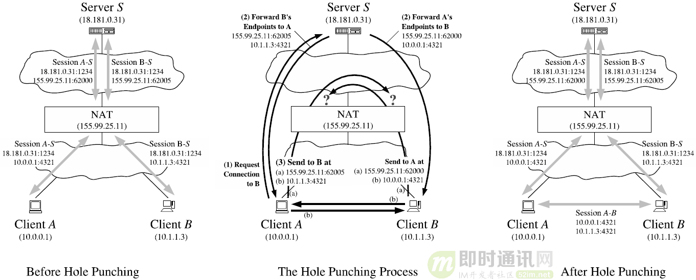

**具体的穿越过程如下：**

- 1）Client A通过ConnectA1向Server S发送请求，请求连接Client B；
- 2）Server S发现Client A、B位于同一个NAT后面，于是返回Client A、Client B的公网EndpointGA、EndpointGB和内网EndpointPA、EndpointPB给Client A；
- 3）Client A收到后，知道Client B和自己位于同一个NAT里面，于是直接连上Client B的内网EndpointPB进行通信。

***8.2.2.3）网络拓扑类型三：\***

如下图，Client A和Client B分别位于不同的NAT后面，这个时候Client A和 Client B位于独立的局域网。

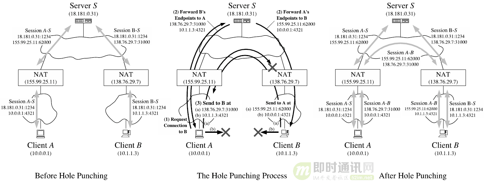

**具体的穿越过程如下：**

- 1）Client A通过ConnectA1向Server S发送请求，请求连接Client B；
- 2）Server S发现Client A、B位于独立的NAT后面，也是通过ConnectA1返回给Client A、Client B的公网EndpointGA、EndpointGB和内网EndpointPA、EndpointPA给Client A。并且通过ConnectB1返回给Client A、Client B的公网EndpointGA、EndpointGB和内网EndpointPA、EndpointPB给Client B。

接下来的步骤和Client A、Client B的NAT类型密切相关，下面会分别就相应的组合进行介绍具体的过程步骤。

**（1）Client A是任意类型NAT，Client B 是Full Cone NAT(Endpoint Independent Mapping和Endpoint-Independent Filtering)**

Full Cone NAT一般是比较少的，因为这样的NAT安全性很差。

[3] Server S通过ConnectA1发送指令让Client A直接Connect Client B的外网EndpointGB，由于Client B的NAT是Full Cone，于是NAT不管三七二十一就把收到的包转发给Client B，于是它们就可以顺利通信了。

**（2）Client A是任意类型NAT，Client B 是Restricted Cone NAT(Endpoint Independent Mapping和Address-Dependent Filtering)**

[3] Server S通过ConnectB1发送指令让Client B 先bind内网EndpointPB然后往Client A的外网EndpointGA发送Connect请求(由于Client B是Endpoint Independent Mapping，那么EndpointPB依旧是映射为EndpointGB)，如果连接建立成功，那么它们就可以进行通信了，反之失败的话，Client B将失败结果反馈给Server S，然后转入[4]；

[4] Server S收到失败反馈，通过ConnectA1发送指令让Client A往Client B的外网EndpointGB发送Connect请求，由于在步骤[3]，Client B已经往Client A发送过数据包，根据过滤规则(Address-Dependent Filtering)，Client B的NAT会允许Client A的数据包通过NAT并转发给Client B。于是，它们就建立其连接进行通信。

**（3）Client A的NAT类型：映射规则是(Endpoint Independent Mapping)的，过滤规则任意；Client B 是Port Restricted Cone NAT(Endpoint Independent Mapping和Address and Port-Dependent Filtering)**

[3] 该步骤和情况(2)中的步骤[3]完全一样。

[4] Server S收到失败反馈，通过ConnectA1发送指令让Client A 先bind内网EndpointPA然后往Client B的外网EndpointGB发送Connect请求(由于Client A是Endpoint Independent Mapping，那么EndpointPA依旧是映射为EndpointGA)，由于在步骤[3]，Client B已经往Client A的EndpointGA发送过数据包，根据过滤规则(Address and Port-Dependent Filtering)，Client B的NAT会允许Client A的EndpointGA的数据包通过NAT并转发给Client B。于是，它们就建立其连接进行通信。

**（4）Client A的NAT类型：映射规则是(非Endpoint Independent Mapping)的，过滤规则任意；Client B 是Port Restricted Cone NAT(Endpoint Independent Mapping和Address and Port-Dependent Filtering)**

在这种情况下，在上面的步骤[4]的时候，由于Client A是非Endpoint Independent Mapping，那么EndpointPA就会映射为是EndpointGA_B而不是EndpointGA了。这样根据过滤 规则(Address and Port-Dependent Filtering)，Client B的NAT将不会允许Client A的EndpointGA_B的数据包通过NAT。要想数据包能通过Client B的NAT，需要Client B曾经给EndpointGA_B发送过数据。但是，我们无法通过直接的方法让Client B提前知道Client A的外网EndpointGA_B，难道就无能为力了吗？不，还是有些方法的，虽然无法直接知道Client A的外网EndpointGA_B，但是我们可以进行预测。

具体过程如下：

[3] 该步骤和情况(2)中的步骤[3]完全一样。

[4] Server S收到失败反馈，通过ConnectA1发送指令让Client A 启动端口映射预测过程。端口映射预测可以简单、可以复杂，大体就是让Client A往Server的不同端口、不同ip发送数据包，以便Server收集到Client A的端口映射样本，以便能够根据样本的端口映射变化规律预测Client A的NAT的Mapping规则。

[5] Server S根据[4]的预测情况，通过ConnectB1发送给Client B接下来Client A可能的映射端口列表也就是可能的外网EndpointGA1、EndpointGA2 ... EndpointGAn，然后让Client B都往这些外网EndpointGA1、EndpointGA2 ... EndpointGAn发送数据包。

[6] 然后Server S通过ConnectA1发送指令让Client A 先bind内网EndpointPA然后往Client B的外网EndpointGB发送Connect请求(这个时候，假设预测算法有效的话，那么Client A的内网EndpointPA将会映射为EndpointGAi)，由于在步骤[5]，Client B已经往Client A的EndpointGAi发送过数据包，根据过滤规则(Address and Port-Dependent Filtering)，Client B的NAT会允许Client A的EndpointGAi的数据包通过NAT并转发给Client B。于是，它们就建立其连接进行通信。

[7] 如果在步骤[4]的预测失败，那么在步骤[6]将建立连接失败，然后Client B将失败结果反馈给Server S。这个时候Server S可以启动重试步骤[4][5][6]或直接判断Client A和Client B无法建立直接的P2P通信了，于是进入Relay(服务器中转)环节。Realy部分在后面会单独介绍。

***8.2.2.4）网络拓扑类型四：\***

如下图，Client A和 Client B位于多层NAT后面。

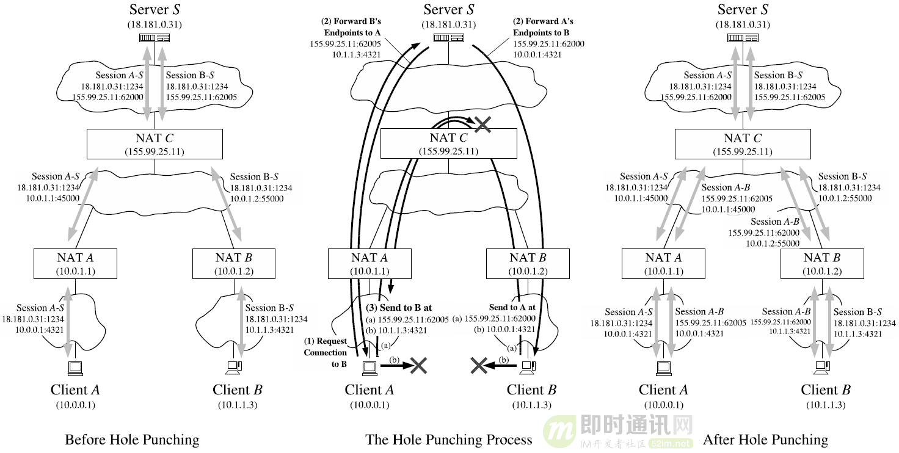

**具体过程如下：**

- 1）Client A通过ConnectA1向Server S发送请求，请求连接Client B；
- 2）Server S发现Client A、B位于同一个NAT后面，于是返回Client A、Client B的公网EndpointGA、EndpointGB和内网EndpointPA、EndpointPB给Client A；
- 3）Client A收到后，认为Client B和自己位于同一个NAT里面，于是往Client B的内网EndpointPB发送连接请求，当然是连接不上的；
- 4）在连接失败后，接着Client A尝试向Client B的外网EndpointGB发送连接请求，这个时候NAT C收到数据包后是否转发该数据包要看NAT C是否支持回环转换（hairpin translation），如果不支持那么就无法进行直连P2P通信，需要就需要反馈给Server S开启Relay。

5）在步骤4）失败了，Client A是无法知道是因为NAT C不支持回环转换造成的失败，还是内层NAT的行为造成的失败。于是Client A就假设NAT C是支持回环转换的，这个时候网络拓扑情况就变成网络拓扑类型三了，那么接下来的穿越步骤就和网络拓扑类型三的多种情况一样的了，这里就不重复了。

上图，只是给出了Client A、Client B位于两层NAT后面的一种情况，对于多层NAT的各种组合本文就不介绍了。对于多层NAT的组合，在穿透失败的时候，是比较难判断出到底是哪层NAT的行为造成的。我们只能用上面说过的所有方法进行逐一重试，如果还是失败，那只能启动Relay进行服务器中转了。

# 9、NAT穿越技术4：Relay服务器中转技术

由于进行P2P穿透是否成功与NAT的行为和防火墙策略有很大的关系，因此就算是一个P2P友好NAT也很难保证100%穿透成功。举个例子：8.2.2.4 网络拓扑类型四，假设NAT A、NAT B 、NAT C都是Full Cone NAT（完全锥型），但是如果NAT C不支持回环转换（hairpin translation）那么也是无法穿透成功的。那么一个完整的P2P穿透的解决方案必不可少的一个部分就是relay了，relay部分主要TURN协议描述。作为STUN协议的一个补充，TURN协议主要由[RFC5766](https://datatracker.ietf.org/doc/rfc5766/)、[RFC6062](https://datatracker.ietf.org/doc/rfc6062/)、[RFC6156](https://datatracker.ietf.org/doc/rfc6156/)来描述，其中[RFC5766](https://datatracker.ietf.org/doc/rfc5766/)主要描述的是UDP协议的relay，RFC6062描述的是TCP协议（IPV4）的relay，而RFC6156描述的是IPV6的relay。下面主要介绍一下RFC5766和RFC6062两个文档中描述的较为重要的交互过程，具体的协议相关属性、报文结构等等，有兴趣的可以细读一下协议文档。

TURN协议简单的来讲，如下图所示：client向turn server发送一个Allocation request请求一个分配（allocation），如果turn server接收请求就会给client分配一个relay地址（IP_RELAYA: PORT_RELAYA），每个allocation都有一个有效期，过了有效期就不能使用了。在有效期内client可以发送refresh request来刷新延长有效期。Client A想给peer A发送数据需要创建权限，这个通过createPermission request请求来创建权限，权限创建成功后，client A就可以发送数据给turn server由turn server中转给peer A，同时peer A发送给turn server数据也会被turn server中转给client A。如图中所示，由于client 没有注册peer B的权限，那么client 发给peer B的数据会被turn server丢弃，同时peer B发给client 的数据也会被turn server丢弃。

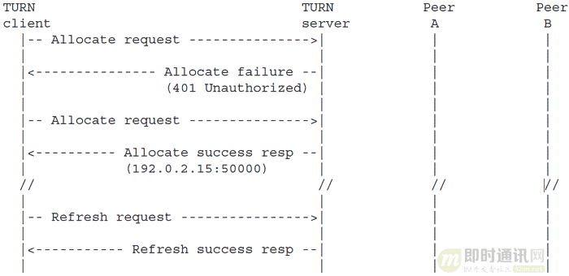

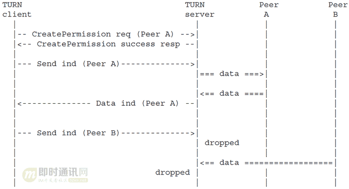

## 9.1、UDP协议的Relay

首先介绍[RFC5766](https://datatracker.ietf.org/doc/rfc5766/)，UDP协议的relay，主要有两种方式：第一种是Send and Data methods，第二种是channels。下面分别介绍这两个方式。

### 9.1.1方式一、Send and Data methods，具体交互过程如下：

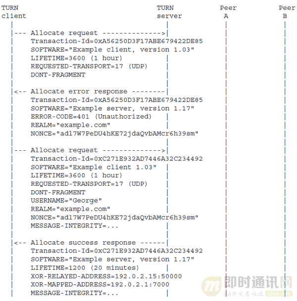

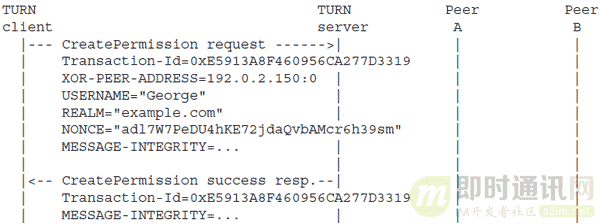

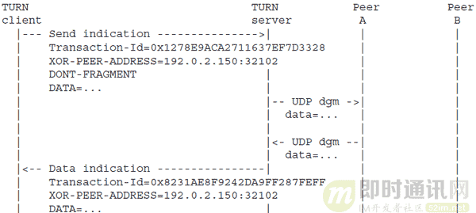

**（1）首先client发送Allocate request 给TURN server 请求一个分配。其中携带的主要属性：**

Transaction-Id=0xA56250D3F17ABE679422DE85 ：事务ID用于标识一个交互过程
SOFTWARE="Example client, version 1.03" ：可有可无的属性
LIFETIME=3600 (1 hour) ：请求分配的有效期，期望有效期
REQUESTED-TRANSPORT=17 (UDP) ：未来数据传输采用的协议
DONT-FRAGMENT ：请求不要将数据进行分割分包转发给PEER。

**（2）TURN server回复一个Allocate error response响应，表示请求未通过授权，需要进行用户验证：**

Transaction-Id=0xA56250D3F17ABE679422DE85 ：事务ID要和（1）的一样
SOFTWARE="Example server, version 1.17" ：可有可无
ERROR-CODE=401 (Unauthorized) ：错误码
REALM="example.com" ：为了让客户端下次请求的时候要带上这个属性
NONCE="adl7W7PeDU4hKE72jdaQvbAMcr6h39sm" ：为了让客户端下次请求的时候要带上这个属性

**（3）Client收到响应后，发现是401错误响应，那么需要给TURN server提供用户名和密码进行验证。于是client重新发送Allocate request请求：**

Transaction-Id=0xC271E932AD7446A32C234492 ：另起一个事务，标识另外一个请求过程
SOFTWARE="Example client 1.03" ：同（1）
LIFETIME=3600 (1 hour) ：同（1）
REQUESTED-TRANSPORT=17 (UDP) ：同（1）
DONT-FRAGMENT ：同（1）
USERNAME="George" ：client的用户名
REALM="example.com" :（2）中TURN server响应给client的
NONCE="adl7W7PeDU4hKE72jdaQvbAMcr6h39sm" :（2）中TURN server响应给client的
MESSAGE-INTEGRITY=... ：一些加密信息，用于验证client的

**（4）TURN server 验证client通过后给client响应Allocate success response：**

Transaction-Id=0xC271E932AD7446A32C234492 ：事务ID要和（3）相同
SOFTWARE="Example server, version 1.17" ：同(3)
LIFETIME=1200 (20 minutes) ：该分配的有效期，实际有效期
XOR-RELAYED-ADDRESS=192.0.2.15:50000 ：给client分配的relay地址
XOR-MAPPED-ADDRESS=192.0.2.1:7000 ：client的经NAT后的映射地址
MESSAGE-INTEGRITY=... ：一些加密信息

**（5）收到TURN server的success响应后，client发送CreatePermission request来创建peer的权限：**

Transaction-Id=0xE5913A8F460956CA277D3319 ：另起一个事务，标识另外一个请求过程
XOR-PEER-ADDRESS=192.0.2.150:0 ：需要创建权限的peer的IP地址，权限只与IP地址相关，与端口无关
USERNAME="George"
REALM="example.com" :（2）中TURN server响应给client的
NONCE="adl7W7PeDU4hKE72jdaQvbAMcr6h39sm" :（2）中TURN server响应给client的
MESSAGE-INTEGRITY=... ：一些加密的信息

**（6）TURN server接受创建权限请求，发送CreatePermission success resp 响应给client：**

Transaction-Id=0xE5913A8F460956CA277D3319 ：事务ID要和（5）相同
MESSAGE-INTEGRITY=... ：一些加密信息

**（7）创建权限成功后，client就可以用Send indication来发送数据给TURN server然后由TURN server将数据relay给peer：**

Transaction-Id=0x1278E9ACA2711637EF7D3328 ：另起一个事务，标识另外一个请求过程
XOR-PEER-ADDRESS=192.0.2.150:32102 ：需要发送数据的peer监听的IP: PORT（注意IP一定要和注册权限的时候的IP一样，否则会被拒绝relay并响应错误）
DONT-FRAGMENT ：请求TURN server不要将data数据分片发送
DATA=... ：client需要发给peer的数据内容

**（8）TURN server收到Send indication请求后，进行一些权限检查后，提取出协议包中的data属性中的数据内容，然后将数据内容用UDP协议从client的relay地址（源：192.0.2.15:50000）发送给peer（目的：192.0.2.150:32102）：**

-- UDP dgm ->
data=... ： 发给peer的UDP 数据包

**（9）peer收到UPD数据包后，如果有响应数据，那么就将响应数据用UDP发给TURN server的192.0.2.15:50000地址：**

<- UDP dgm –
data=... ：响应给TURN server的UDP数据包

**（10）TURN server在client的relay地址（192.0.2.15:50000）那收到peer（192.0.2.150:32102）的UDP数据包，这时TURN server需要检测client是否注册了IP192.0.2.150的权限，如果没有就会丢弃该数据包。如果有那么就取出UDP数据包中的data部分，然后将data封装成TURN协议数据包，给client发送Data indication：**

Transaction-Id=0x8231AE8F9242DA9FF287FEFF ：协议并不要求这个事务ID要和（7）中的一样
XOR-PEER-ADDRESS=192.0.2.150:32102 ：标识数据来自哪个peer
DATA=... : peer 发给client的数据内容

以上是Send and Data methods方式的核心交互过程，较为完整交互过程可以查看一下协议文档。这里有个问题需要说明一下，就是每个allocation都有一个有效期，client需要把握好有效期，及时在有效期内发送refresh request来刷新延长有效期。

### 9.1.2方式二、channels，具体交互过程如下：

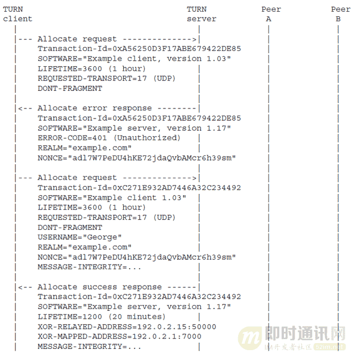

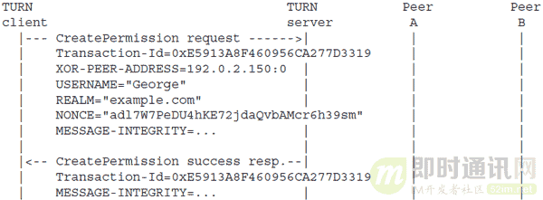

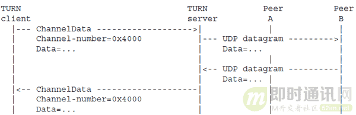

**（1）--（6）交互过程和Send and Data methods方式是一样的，这里就不在重复了。**

**（7）权限创建成功后，client发送ChannelBind request给TURN server请求进行channel bind。**

Transaction-Id=0x6490D3BC175AFF3D84513212 ：事务ID
CHANNEL-NUMBER=0x4000 ：client定义的bind channel ID
XOR-PEER-ADDRESS=192.0.2.210:49191 ：peer B的IP和PORT
USERNAME="George" ：同方式一
REALM="example.com" ：同方式一
NONCE="adl7W7PeDU4hKE72jdaQvbAMcr6h39sm" ：同方式一
MESSAGE-INTEGRITY=... ：同方式一

**（8）TURN server接受channelBind请求后，给client发送ChannelBind success response响应**

Transaction-Id=0x6490D3BC175AFF3D84513212 ：事务ID，和（7）相同
MESSAGE-INTEGRITY=... |

**（9）client收到ChannelBind success response后就可以通过ChannelData来发送数据了。**

Channel-number=0x4000 ：（7）中定义bind channel ID
Data=... ：client需要发给peer B的数据内容

**（10）TURN server收到ChannelData后首先从TURN协议数据包中提取出Channel-number，接着查找Channel-number是否已经绑定peer，如果没有就返回错误并丢弃数据包；如果查找到有绑定peer，那么就提前出Data属性中的数据内容用UDP协议通过client的relay地址（源：192.0.2.15:50000）发送给peer B（目的：192.0.2.210:49191）。**

--- UDP datagram --------->
Data=... 发给peer B的UDP 数据包

**（11）peer收到UPD数据包后，如果有响应数据，那么就将响应数据用UDP发给TURN server的192.0.2.15:50000地址**

<-- UDP datagram ----------
Data=... :peer 发给client的数据内容

**（12）TURN server在client的relay地址（192.0.2.15:50000）那收到peer（192.0.2.210:49191）的UDP数据包，这时TURN server需要检测client是否注册了IP192.0.2.150的权限，如果没有就会丢弃该数据包。如果有注册权限，那就检查client是有channel绑定该peer，如果有那么就通过Channel Data 方式relay数据给client，否则就通过方式一中的Data indication 方式relay数据给client**

Channel-number=0x4000 ：（7）中定义bind channel ID
Data=... ：peer B发给client的数据内容

以上是channels的核心交互过程，较为详细的过程可以查看协议文档。方式二比方式一多了一个channel Bind的步骤，这个步骤是为了告诉TURN server接下来以Channel-number标识的协议数据包是要发给谁的，这样才使得ChannelData中只要携带一个Channel-number头部信息就可以，而不用携带方式一中的Transaction-Id、XOR-PEER-ADDRESS等额外的头部信息，减少数据量。

## 9.2、TCP协议的Relay

TCP协议的relay是在RFC6062中描述，其中主要有两种情况下的relay：1. Client to peer 2. Client to client。下面分别介绍两种情况下relay。

### 9.2.1情况一、Client to peer，网络拓扑如下：

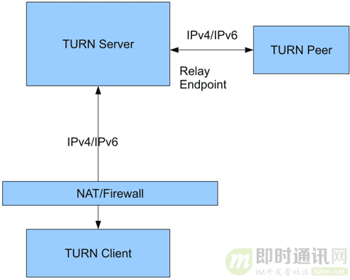

在上面的网络拓扑下，有两种方式的relay：1. TURN Client 主动发起的relay 2. TURN Peer主动发起的relay。下面分别介绍这两种方式的交互过程。这里Turn Client表示能够理解TURN协议的主机，而Turn Peer表示普通的一般主机。

***9.2.1.1）TURN Client 主动发起的relay：\***

在这种方式下，TURN server要能够直接连接上TURN Peer监听的端口才行。具体交互过程如下：

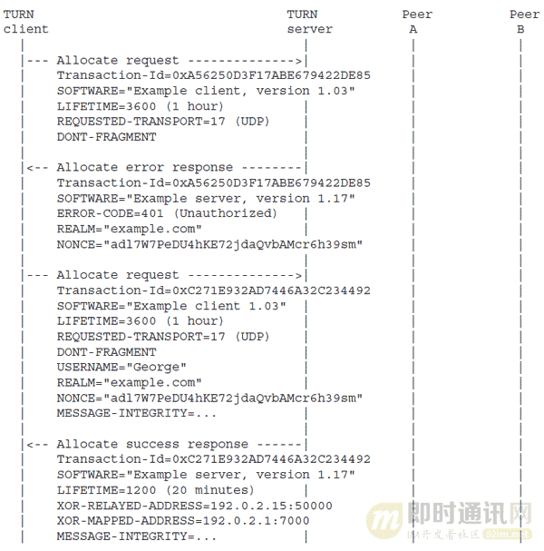

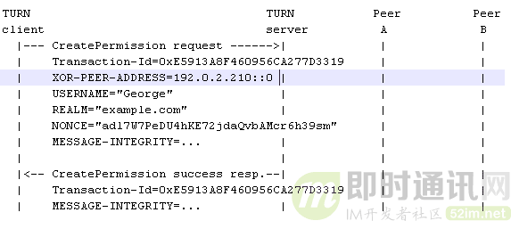

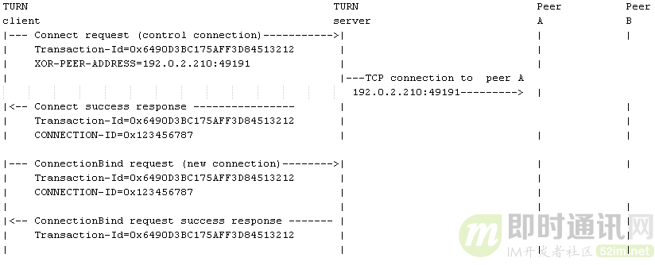

**（1）--（6）交互过程和RFC5766的是基本一样的，这里就不在重复了。所不同的是RFC5766中是UDP协议，而这里是TCP协议，并且（1）--（6）是在一个连接中完成，我们称这个连接为control connection。**

**（7）client创建权限成功后，通过control connection发送Connect request给TURN server请求TURN server去连接Peer A**

Transaction-Id=0x6490D3BC175AFF3D84513212 ：事务ID
XOR-PEER-ADDRESS=192.0.2.210:49191 ：Peer A监听的IP和端口

**（8）TURN server收到Connect request后， 它会通过client的relay地址（源：192.0.2.15:50000）尝试TCP连接到Peer A的192.0.2.210:49191，如果连接不成功，那么给client响应错误码为447的错误。如果连接成功那么转入（9），我们称这个连接为Peer data connection**

**（9）TURN server连接Peer A成功后，给client发送Connect success response**

Transaction-Id=0x6490D3BC175AFF3D84513212 ：事务ID，同（7）
CONNECTION-ID=0x123456787 ：TURN server给client响应的标识，用于将两条TCP连接联系起来用的。

**（10）client在control connection上收到Connect success response，那么client需要建立另外一条TCP连接连上TURN server，我们称这条连接为new connection。Client通过new connection给TURN server发送ConnectionBind request，请求将new connection和Peer data connection进行绑定。**

Transaction-Id=0x6490D3BC175AFF3D84513212 ：事务ID
CONNECTION-ID=0x123456787 ：（9）中收到的CONNECTION-ID

**（11）TURN server 收到ConnectionBind request后，进行一些操作，把new connection和Peer A connection两条TCP连接联系起来。**

通过上面11个步骤以后，client和peer A就能分别通过new connection和Peer data connection两条TCP连接来发送数据了。Client通过new connection发送的数据到达TURN server，TURN server就会将数据原封不动通过Peer data connection转发给Peer A，同样对于Peer A也是一样的，TURN server就像进行端口转发一样了。这里有个问题是：Peer A connection这条TCP连接要比new connection这条TCP连接早一些建立起来的，这样在new connection建立起来之前peer A就开始发送数据的话，那么TURN server这个时候是无法将数据转发给client的，所以RFC6062协议要求，只要Peer data connection连接建立好了，那么TURN server就必须做好准备接收peer A的数据，并将接收到的数据buffer住，等new connection建立好后在转发给client。但是，有些开源实现并没有这样做，所以这点要注意一下。

***9.2.1.2）TURN Peer主动发起的relay：\***

在这种方式下，TURN Peer可以位于NAT后面，具体交互如下：

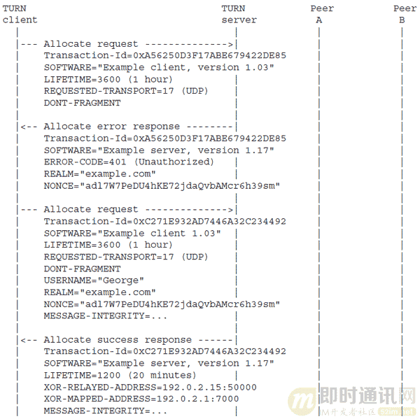

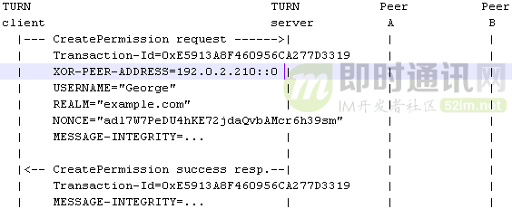

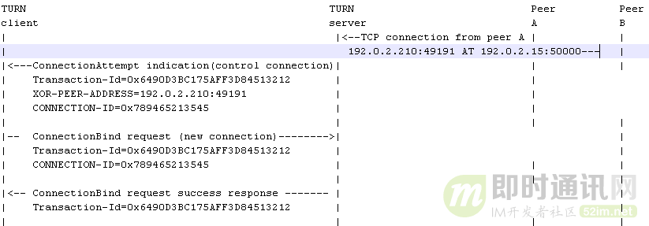

**（1）--（6）交互过程和方式1的是一样的，这里就不在重复了。**

**（7）Peer A通过192.0.2.210:49191向client的relay地址192.0.2.15:50000发起TCP连接。TURN server 马上accept这个TCP连接并做好buffer Peer A发送的数据流的准备。然后，TURN server检查 拥有relay地址192.0.2.15:50000的client是否已经注册了Peer A（192.0.2.210）的权限，如果没有，那么TURN server会马上close刚刚accept的连接。如果有，那么转向（8），我们把这个连接称为peer data connection**

**（8）TURN server 查找到拥有relay地址192.0.2.15:50000的client的control connection，通过control connection给client发送ConnectionAttempt indication。**

Transaction-Id=0x6490D3BC175AFF3D84513212 ：事务ID
XOR-PEER-ADDRESS=192.0.2.210:49191 ：（7）中accept那个peer A的IP和端口
CONNECTION-ID=0x789465213545 ：TURN server给client响应的标识，用于将两条TCP连接联系起来用的

**（9）client收到ConnectionAttempt indication，如果接收这个peer的话，那么client会新起一个连接连上TURN server，我们称这个连接为new connection，client通过new connection给TURN server发送ConnectionBind request，请求绑定peer data connection。**

Transaction-Id=0x6490D3BC175AFF3D84513212 ：事务ID
CONNECTION-ID=0x789465213545 ： （8）中收到的CONNECTION-ID

**（10）TURN server收到ConnectionBind request后会通过new connection给client发送ConnectionBind request success response。**
通过上面10个步骤以后，client和peer A就能分别通过new connection和Peer data connection两条TCP连接来发送数据了。这个方式同样存在方式1中的数据buffer住问题。在这种情况下，在Peer A看来与之通信的是Endpoint(client的relay地址192.0.2.15:50000)，Peer A不需要知道真实的Client的地址。

### 9.2.2情况二、Client to client，网络拓扑结构如下：

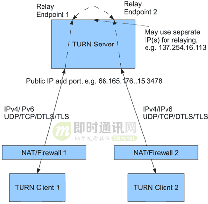

这种情况下，RFC6062文档中并没有讲到，估计是因为这种情况是情况一的一个特例而已，我这里展开来讲一下是希望能帮助大家更加深刻理解协议本身。

**TURN Client1和TURN Client2（1）-（6）步骤的交互情况基本和上面的一样，并且是比较独立的，所以下面直接给出了。**

TURN Client1 的（1）-（6）步骤交互情况如下：

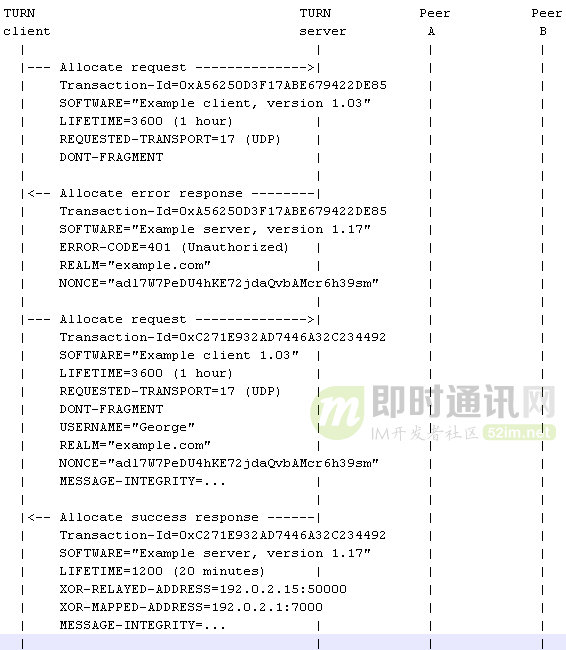

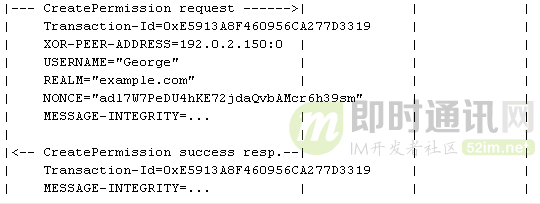

TURN Client2 的（1）-（6）步骤交互情况如下：

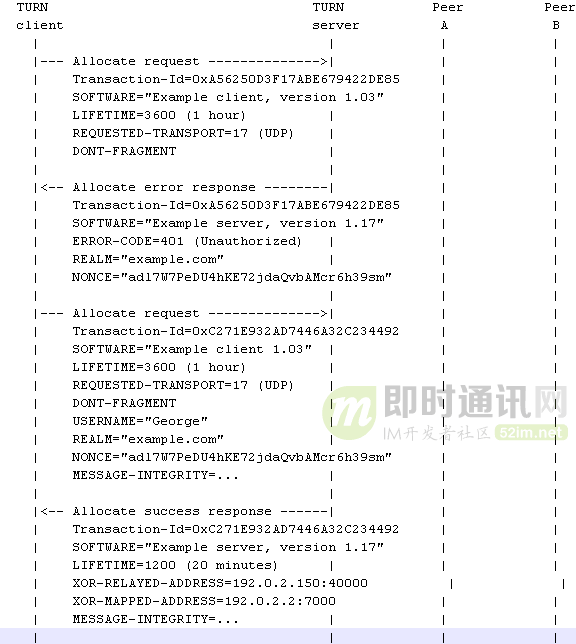

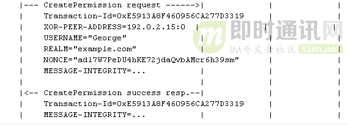

从上面的交互可以知道TURN Client 1 的relay地址是：192.0.2.15:50000 ，NAT映射后的地址是：192.0.2.1:7000，而TURN Client2的relay地址是：192.0.2.150:40000 ，NAT映射后的地址是：192.0.2.2:7000。下面继续给出TURN Client 1和TURN Client 2的其他交互情况，由于它们和TURN server的交互带有一定的时序性，下面会交错给出它们和TURN server的交互步骤。TURN Client1和TURN Client2是对称，这里不妨假设TURN Client1是数据交互的发起者，具体交互过程如下：

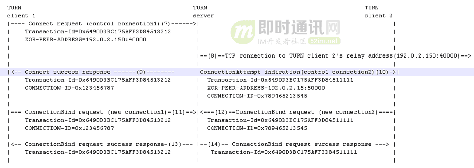

**（7）TURN Client1 首先通过control connection1发送Connect request给TURN server，请求连接TURN Client 2的relay地址192.0.2.150:40000。**

Transaction-Id=0x6490D3BC175AFF3D84513212 ：事务ID
XOR-PEER-ADDRESS=192.0.2.150:40000 ： TURN Client2的relay地址

**（8）TURN server收到Connect request后， 它会通过TURN Client1的relay地址（源：192.0.2.15:50000）尝试TCP连接到192.0.2.150:40000，这个连接一般都会成功，因为这个是TURN server给的relay地址，我们称这个连接为peer data connection1**

**（9）TURN server连接192.0.2.150:40000成功后，给TURN Client1发送Connect success response**

Transaction-Id=0x6490D3BC175AFF3D84513212：事务ID
CONNECTION-ID=0x123456787 ：TURN server给client响应的标识，用于将两条TCP连接联系起来用的

**（10）这个步骤和（9）几乎同时发生的，TURN server发现TURN Client2的relay地址192.0.2.150:40000有个TCP连接上来，那么TURN server马上accept这个连接，我们称这个连接是peer data connection2（其实就是peer data connection1）；经过权限检查后，TURN server通过TURN Client2的control connection2给TURN Client2发送ConnectionAttempt indication**

Transaction-Id=0x6490D3BC175AFF3D84511111 ：事务ID
XOR-PEER-ADDRESS=192.0.2.15:50000 ：TURN Client1的relay地址
CONNECTION-ID=0x789465213545 ：TURN server给client响应的标识，用于将两条TCP连接联系起来用的

**（11）TURN Client1 收到Connect success response后，另起一个TCP connection连接上TURN server，我们称这个连接为new connection1。TURN Client1通过new connection1给TURN server 发送ConnectionBind request**

Transaction-Id=0x6490D3BC175AFF3D84513212 ：事务ID
CONNECTION-ID=0x123456787 ： （9）中TURN server响应的CONNECTION-ID

**（12）这个步骤几乎和（11）同时发生，TURN Client2 收到ConnectionAttempt indication，表示接受，然后它另起一个TCP connection连接上TURN server我们称这个连接为new connection2。TURN Client2通过new connection2给TURN server发送ConnectionBind request。**

Transaction-Id=0x6490D3BC175AFF3D84511111 ：事务ID
CONNECTION-ID=0x789465213545 ：（10）中TURN server响应的CONNECTION-ID

**（13）和（14）TURN server分别通过new connection1和new connection2给TURN Client 1和TURN Client 2发送ConnectionBind request success response。**

通过以上14个步骤，TURN Client 1就能借助new connection1和peer data connection1与TURN Client 2进行数据交互。而TURN Client 2借助new connection2和peer data connection2与TURN Client 1进行数据交互。

到这里，P2P通信穿越NAT的相关原理、技术、方法的进阶分析基本介绍完毕，关于STUN和TURN协议，有个开源实现，有兴趣的同学可以阅读一下源码：https://github.com/coturn/rfc5766-turn-server

**另外还有一个ICE协议，这个也有一个文档系列：**

- [RFC 5245](https://datatracker.ietf.org/doc/rfc5245/) - ICE
- [RFC 5768](https://datatracker.ietf.org/doc/rfc5678/) – ICE–SIP
- [RFC 6336](https://datatracker.ietf.org/doc/rfc6336/) – ICE–IANA Registry
- [RFC 6544](https://datatracker.ietf.org/doc/rfc6544/) – ICE–TCP
- [RFC 5928](https://datatracker.ietf.org/doc/rfc5928/) - TURN Resolution Mechanism

这个文档系列较为复杂一些，有兴趣的可以阅读一下。

# 10、参考文献

- [1]《[P2P技术详解(一)：NAT详解——详细原理、P2P简介](http://www.52im.net/thread-50-1-1.html)》
- [2]《[P2P技术详解(二)：P2P中的NAT穿越(打洞)方案详解(基本原理篇)](http://www.52im.net/thread-542-1-1.html)》
- [3] 《[Peer-to-Peer Communication Across Network Address Translators](http://www.brynosaurus.com/pub/net/p2pnat/)》