## 1、写在前面

如果你的 App，在不需要任何修改的情况下就能提升 15% 以上的访问速度。特别是弱网络的时候能够提升 20% 以上的访问速度。

如果你的 App，在频繁切换 4G 和 WIFI 网络的情况下，不会断线，不需要重连，用户无任何感知。如果你的 App，既需要 TLS 的安全，也想实现 HTTP2 多路复用的强大。

如果你刚刚才听说 HTTP2 是下一代互联网协议，如果你刚刚才关注到 TLS1.3 是一个革命性具有里程碑意义的协议，但是这两个协议却一直在被另一个更新兴的协议所影响和挑战。

如果这个新兴的协议，它的名字就叫做“快”，并且正在标准化为新一代的互联网传输协议。

你愿意花一点点时间了解这个协议吗？你愿意投入精力去研究这个协议吗？你愿意全力推动业务来使用这个协议吗？

***\*推荐：\****如果你觉得本文有点难懂，可以读一读《[网络编程懒人入门(十)：一泡尿的时间，快速读懂QUIC协议](http://www.52im.net/thread-2816-1-1.html)》。

## 2、相关文章

《[网络编程懒人入门(十)：一泡尿的时间，快速读懂QUIC协议](http://www.52im.net/thread-2816-1-1.html)》
《[技术扫盲：新一代基于UDP的低延时网络传输层协议——QUIC详解](http://www.52im.net/thread-1309-1-1.html)》
《[让互联网更快：新一代QUIC协议在腾讯的技术实践分享](http://www.52im.net/thread-1407-1-1.html)》
《[七牛云技术分享：使用QUIC协议实现实时视频直播0卡顿！](http://www.52im.net/thread-1406-1-1.html)》

## 3、本文作者

**罗成：**腾讯资深研发工程师。目前主要负责腾讯 stgw(腾讯安全云网关）的相关工作，整体推进腾讯内部及腾讯公有云，混合云的七层负载均衡及全站 HTTPS 接入。对 HTTPS，SPDY，HTTP2，QUIC 等应用层协议、高性能服务器技术、云网络技术、用户访问速度、分布式文件传输等有较深的理解。（作者微博：[点此进入](https://weibo.com/u/1822556675)）

## 4、QUIC 协议概述

Quic 全称 quick udp internet connection [1]，“快速 UDP 互联网连接”，（和英文 quick 谐音，简称“快”）是由 Google 提出的使用 udp 进行多路并发传输的协议。

**Quic 相比现在广泛应用的 http2+tcp+tls 协议有如下优势 [2]：**

- 减少了 TCP 三次握手及 TLS 握手时间；
- 改进的拥塞控制；
- 避免队头阻塞的多路复用；
- 连接迁移；
- 前向冗余纠错。

**下图是网络层对比图：**

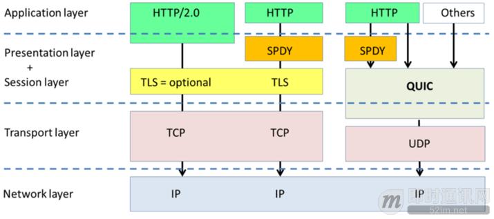

**下图是通信延迟对比图：**

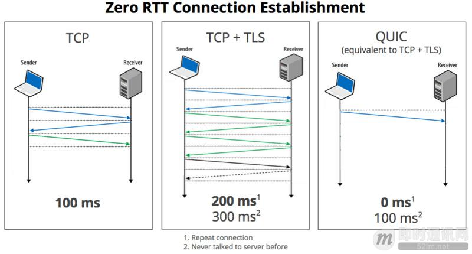

## 5、为什么需要 QUIC

### 5.1概述

从上个世纪 90 年代互联网开始兴起一直到现在，大部分的互联网流量传输只使用了几个网络协议。使用 IPv4 进行路由，使用 TCP 进行连接层面的流量控制，使用 SSL/TLS 协议实现传输安全，使用 DNS 进行域名解析，使用 HTTP 进行应用数据的传输。

而且近三十年来，这几个协议的发展都非常缓慢。TCP 主要是拥塞控制算法的改进，SSL/TLS 基本上停留在原地，几个小版本的改动主要是密码套件的升级，TLS1.3[3] 是一个飞跃式的变化，但截止到今天，还没有正式发布。IPv4 虽然有一个大的进步，实现了 IPv6，DNS 也增加了一个安全的 DNSSEC，但和 IPv6 一样，部署进度较慢。

随着移动互联网快速发展以及物联网的逐步兴起，网络交互的场景越来越丰富，网络传输的内容也越来越庞大，用户对网络传输效率和 WEB 响应速度的要求也越来越高。

一方面是历史悠久使用广泛的古老协议，另外一方面用户的使用场景对传输性能的要求又越来越高。

**如下几个由来已久的问题和矛盾就变得越来越突出：**

- 协议历史悠久导致中间设备僵化；
- 依赖于操作系统的实现导致协议本身僵化；
- 建立连接的握手延迟大；
- 队头阻塞。

这里分小节简单说明一下。

### 5.2中间设备的僵化

可能是 TCP 协议使用得太久，也非常可靠。所以我们很多中间设备，包括防火墙、NAT 网关，整流器等出现了一些约定俗成的动作。

比如有些防火墙只允许通过 80 和 443，不放通其他端口。NAT 网关在转换网络地址时重写传输层的头部，有可能导致双方无法使用新的传输格式。整流器和中间代理有时候出于安全的需要，会删除一些它们不认识的选项字段。

TCP 协议本来是支持端口、选项及特性的增加和修改。但是由于 TCP 协议和知名端口及选项使用的历史太悠久，中间设备已经依赖于这些潜规则，所以对这些内容的修改很容易遭到中间环节的干扰而失败。

而这些干扰，也导致很多在 TCP 协议上的优化变得小心谨慎，步履维艰。

### 5.3依赖于操作系统的实现导致协议僵化

TCP 是由操作系统在内核西方栈层面实现的，应用程序只能使用，不能直接修改。虽然应用程序的更新迭代非常快速和简单。但是 TCP 的迭代却非常缓慢，原因就是操作系统升级很麻烦。

现在移动终端更加流行，但是移动端部分用户的操作系统升级依然可能滞后数年时间。PC 端的系统升级滞后得更加严重，windows xp 现在还有大量用户在使用，尽管它已经存在快 20 年。

服务端系统不依赖用户升级，但是由于操作系统升级涉及到底层软件和运行库的更新，所以也比较保守和缓慢。

这也就意味着即使 TCP 有比较好的特性更新，也很难快速推广。比如 TCP Fast Open。它虽然 2013 年就被提出了，但是 Windows 很多系统版本依然不支持它。

### 5.4建立连接的握手延迟大

不管是 HTTP1.0/1.1 还是 HTTPS，HTTP2，都使用了 TCP 进行传输。HTTPS 和 HTTP2 还需要使用 TLS 协议来进行安全传输。

**这就出现了两个握手延迟：**

- 1）TCP 三次握手导致的 TCP 连接建立的延迟；
- 2）TLS 完全握手需要至少 2 个 RTT 才能建立，简化握手需要 1 个 RTT 的握手延迟。

对于很多短连接场景，这样的握手延迟影响很大，且无法消除。

### 5.5队头阻塞

队头阻塞主要是 TCP 协议的可靠性机制引入的。TCP 使用序列号来标识数据的顺序，数据必须按照顺序处理，如果前面的数据丢失，后面的数据就算到达了也不会通知应用层来处理。

另外 TLS 协议层面也有一个队头阻塞，因为 TLS 协议都是按照 record 来处理数据的，如果一个 record 中丢失了数据，也会导致整个 record 无法正确处理。

概括来讲，TCP 和 TLS1.2 之前的协议存在着结构性的问题，如果继续在现有的 TCP、TLS 协议之上实现一个全新的应用层协议，依赖于操作系统、中间设备还有用户的支持。部署成本非常高，阻力非常大。

所以 QUIC 协议选择了 UDP，因为 UDP 本身没有连接的概念，不需要三次握手，优化了连接建立的握手延迟，同时在应用程序层面实现了 TCP 的可靠性，TLS 的安全性和 HTTP2 的并发性，只需要用户端和服务端的应用程序支持 QUIC 协议，完全避开了操作系统和中间设备的限制。

## 6、QUIC 核心特性

### 6.1连接建立延时低

0RTT 建连可以说是 QUIC 相比 HTTP2 最大的性能优势。那什么是 0RTT 建连呢？

**这里面有两层含义：**

- 传输层 0RTT 就能建立连接；
- 加密层 0RTT 就能建立加密连接。

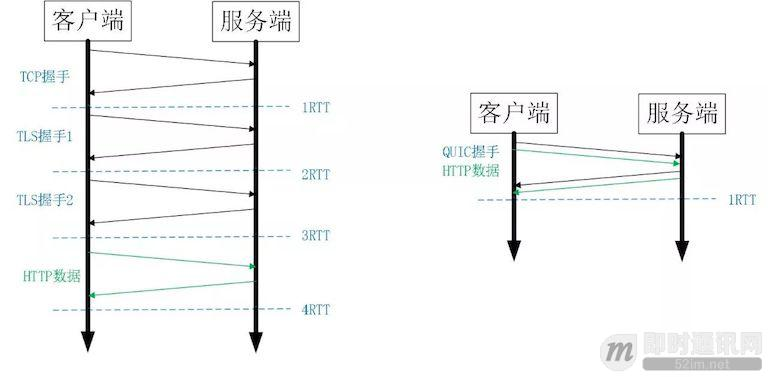

▲ 图 1 HTTPS 及 QUIC 建连过程

比如上图左边是 HTTPS 的一次完全握手的建连过程，需要 3 个 RTT。就算是 Session Resumption[14]，也需要至少 2 个 RTT。

而 QUIC 呢？由于建立在 UDP 的基础上，同时又实现了 0RTT 的安全握手，所以在大部分情况下，只需要 0 个 RTT 就能实现数据发送，在实现前向加密 [15] 的基础上，并且 0RTT 的成功率相比 TLS 的 Sesison Ticket[13] 要高很多。

### 6.2改进的拥塞控制

TCP 的拥塞控制实际上包含了四个算法：慢启动，拥塞避免，快速重传，快速恢复 [22]。

QUIC 协议当前默认使用了 TCP 协议的 Cubic 拥塞控制算法 [6]，同时也支持 CubicBytes, Reno, RenoBytes, BBR, PCC 等拥塞控制算法。

从拥塞算法本身来看，QUIC 只是按照 TCP 协议重新实现了一遍，那么 QUIC 协议到底改进在哪些方面呢？主要有如下几点。

**【可插拔】：**

**什么叫可插拔呢？就是能够非常灵活地生效，变更和停止。体现在如下方面：**

- 1）应用程序层面就能实现不同的拥塞控制算法，不需要操作系统，不需要内核支持。这是一个飞跃，因为传统的 TCP 拥塞控制，必须要端到端的网络协议栈支持，才能实现控制效果。而内核和操作系统的部署成本非常高，升级周期很长，这在产品快速迭代，网络爆炸式增长的今天，显然有点满足不了需求；
- 2）即使是单个应用程序的不同连接也能支持配置不同的拥塞控制。就算是一台服务器，接入的用户网络环境也千差万别，结合大数据及人工智能处理，我们能为各个用户提供不同的但又更加精准更加有效的拥塞控制。比如 BBR 适合，Cubic 适合；
- 3）应用程序不需要停机和升级就能实现拥塞控制的变更，我们在服务端只需要修改一下配置，reload 一下，完全不需要停止服务就能实现拥塞控制的切换。

STGW 在配置层面进行了优化，我们可以针对不同业务，不同网络制式，甚至不同的 RTT，使用不同的拥塞控制算法。

**【单调递增的 Packet Number】：**

TCP 为了保证可靠性，使用了基于字节序号的 Sequence Number 及 Ack 来确认消息的有序到达。

QUIC 同样是一个可靠的协议，它使用 Packet Number 代替了 TCP 的 sequence number，并且每个 Packet Number 都严格递增，也就是说就算 Packet N 丢失了，重传的 Packet N 的 Packet Number 已经不是 N，而是一个比 N 大的值。而 TCP 呢，重传 segment 的 sequence number 和原始的 segment 的 Sequence Number 保持不变，也正是由于这个特性，引入了 Tcp 重传的歧义问题。

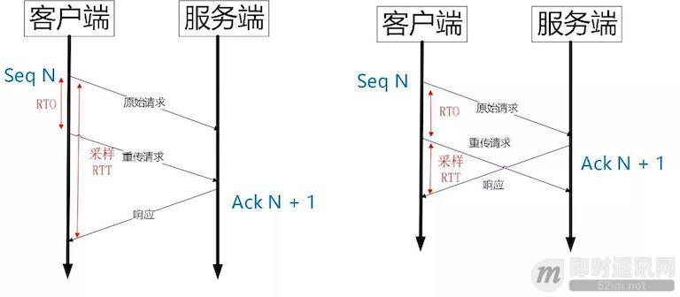

▲ 图 2 Tcp 重传歧义性

如上图所示，超时事件 RTO 发生后，客户端发起重传，然后接收到了 Ack 数据。由于序列号一样，这个 Ack 数据到底是原始请求的响应还是重传请求的响应呢？不好判断。

如果算成原始请求的响应，但实际上是重传请求的响应（上图左），会导致采样 RTT 变大。如果算成重传请求的响应，但实际上是原始请求的响应，又很容易导致采样 RTT 过小。

由于 Quic 重传的 Packet 和原始 Packet 的 Pakcet Number 是严格递增的，所以很容易就解决了这个问题。

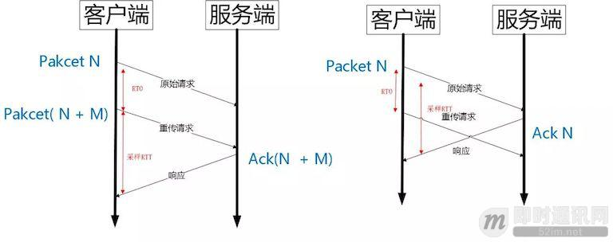

▲ 图 3 Quic 重传没有歧义性

如上图所示，RTO 发生后，根据重传的 Packet Number 就能确定精确的 RTT 计算。如果 Ack 的 Packet Number 是 N+M，就根据重传请求计算采样 RTT。如果 Ack 的 Pakcet Number 是 N，就根据原始请求的时间计算采样 RTT，没有歧义性。

但是单纯依靠严格递增的 Packet Number 肯定是无法保证数据的顺序性和可靠性。QUIC 又引入了一个 Stream Offset 的概念。

即一个 Stream 可以经过多个 Packet 传输，Packet Number 严格递增，没有依赖。但是 Packet 里的 Payload 如果是 Stream 的话，就需要依靠 Stream 的 Offset 来保证应用数据的顺序。如错误! 未找到引用源。所示，发送端先后发送了 Pakcet N 和 Pakcet N+1，Stream 的 Offset 分别是 x 和 x+y。

假设 Packet N 丢失了，发起重传，重传的 Packet Number 是 N+2，但是它的 Stream 的 Offset 依然是 x，这样就算 Packet N + 2 是后到的，依然可以将 Stream x 和 Stream x+y 按照顺序组织起来，交给应用程序处理。

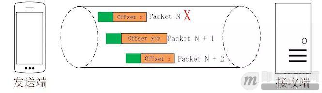

▲ 图 4 Stream Offset 保证有序性

**【不允许 Reneging】：**

什么叫 Reneging 呢？就是接收方丢弃已经接收并且上报给 SACK 选项的内容 [8]。TCP 协议不鼓励这种行为，但是协议层面允许这样的行为。主要是考虑到服务器资源有限，比如 Buffer 溢出，内存不够等情况。

Reneging 对数据重传会产生很大的干扰。因为 Sack 都已经表明接收到了，但是接收端事实上丢弃了该数据。

QUIC 在协议层面禁止 Reneging，一个 Packet 只要被 Ack，就认为它一定被正确接收，减少了这种干扰。

**【更多的 Ack 块】：**

TCP 的 Sack 选项能够告诉发送方已经接收到的连续 Segment 的范围，方便发送方进行选择性重传。

由于 TCP 头部最大只有 60 个字节，标准头部占用了 20 字节，所以 Tcp Option 最大长度只有 40 字节，再加上 Tcp Timestamp option 占用了 10 个字节 [25]，所以留给 Sack 选项的只有 30 个字节。

每一个 Sack Block 的长度是 8 个，加上 Sack Option 头部 2 个字节，也就意味着 Tcp Sack Option 最大只能提供 3 个 Block。

但是 Quic Ack Frame 可以同时提供 256 个 Ack Block，在丢包率比较高的网络下，更多的 Sack Block 可以提升网络的恢复速度，减少重传量。

**【Ack Delay 时间】：**

Tcp 的 Timestamp 选项存在一个问题 [25]，它只是回显了发送方的时间戳，但是没有计算接收端接收到 segment 到发送 Ack 该 segment 的时间。这个时间可以简称为 Ack Delay。

**这样就会导致 RTT 计算误差。如下图：**

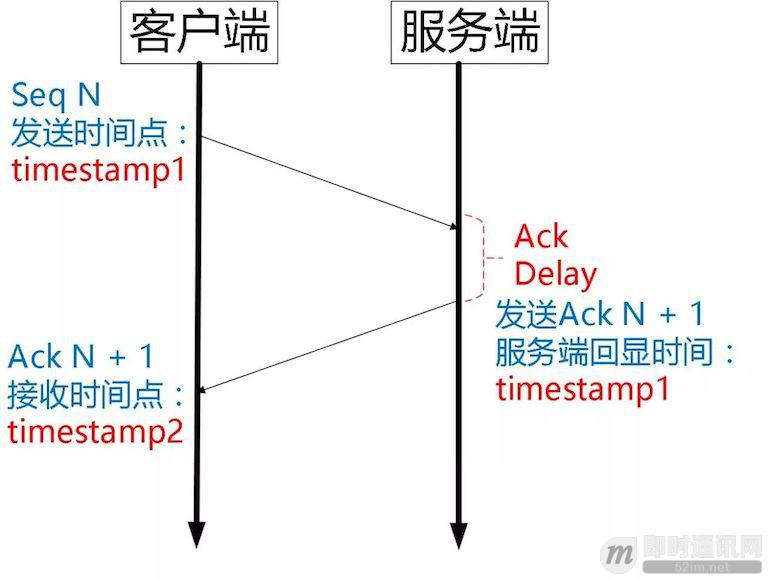

**可以认为 TCP 的 RTT 计算：**

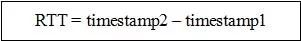

**而 Quic 计算如下：**

**当然 RTT 的具体计算没有这么简单，需要采样，参考历史数值进行平滑计算，参考如下公式 [9]：**

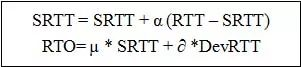

### 6.3基于 stream 和 connecton 级别的流量控制

QUIC 的流量控制 [22] 类似 HTTP2，即在 Connection 和 Stream 级别提供了两种流量控制。为什么需要两类流量控制呢？主要是因为 QUIC 支持多路复用。

Stream 可以认为就是一条 HTTP 请求。

Connection 可以类比一条 TCP 连接。多路复用意味着在一条 Connetion 上会同时存在多条 Stream。既需要对单个 Stream 进行控制，又需要针对所有 Stream 进行总体控制。

QUIC 实现流量控制的原理比较简单：

通过 window_update 帧告诉对端自己可以接收的字节数，这样发送方就不会发送超过这个数量的数据。

通过 BlockFrame 告诉对端由于流量控制被阻塞了，无法发送数据。

QUIC 的流量控制和 TCP 有点区别，TCP 为了保证可靠性，窗口左边沿向右滑动时的长度取决于已经确认的字节数。如果中间出现丢包，就算接收到了更大序号的 Segment，窗口也无法超过这个序列号。

但 QUIC 不同，就算此前有些 packet 没有接收到，它的滑动只取决于接收到的最大偏移字节数。

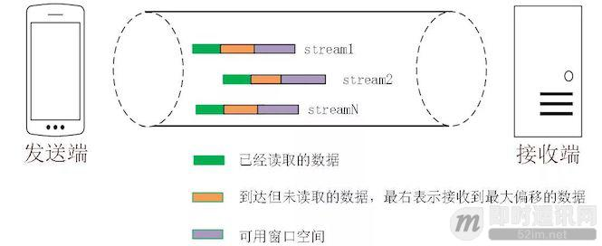

▲ 图 5 Quic Flow Control

**针对 Stream：**

**针对 Connection：**

同样地，STGW 也在连接和 Stream 级别设置了不同的窗口数。

最重要的是，我们可以在内存不足或者上游处理性能出现问题时，通过流量控制来限制传输速率，保障服务可用性。

### 6.4没有队头阻塞的多路复用

QUIC 的多路复用和 HTTP2 类似。在一条 QUIC 连接上可以并发发送多个 HTTP 请求 (stream)。但是 QUIC 的多路复用相比 HTTP2 有一个很大的优势。

QUIC 一个连接上的多个 stream 之间没有依赖。这样假如 stream2 丢了一个 udp packet，也只会影响 stream2 的处理。不会影响 stream2 之前及之后的 stream 的处理。

这也就在很大程度上缓解甚至消除了队头阻塞的影响。

多路复用是 HTTP2 最强大的特性 [7]，能够将多条请求在一条 TCP 连接上同时发出去。但也恶化了 TCP 的一个问题，队头阻塞 [11]，如下图示：

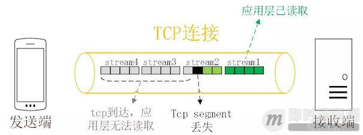

▲ 图 6 HTTP2 队头阻塞

HTTP2 在一个 TCP 连接上同时发送 4 个 Stream。其中 Stream1 已经正确到达，并被应用层读取。但是 Stream2 的第三个 tcp segment 丢失了，TCP 为了保证数据的可靠性，需要发送端重传第 3 个 segment 才能通知应用层读取接下去的数据，虽然这个时候 Stream3 和 Stream4 的全部数据已经到达了接收端，但都被阻塞住了。

不仅如此，由于 HTTP2 强制使用 TLS，还存在一个 TLS 协议层面的队头阻塞 [12]。

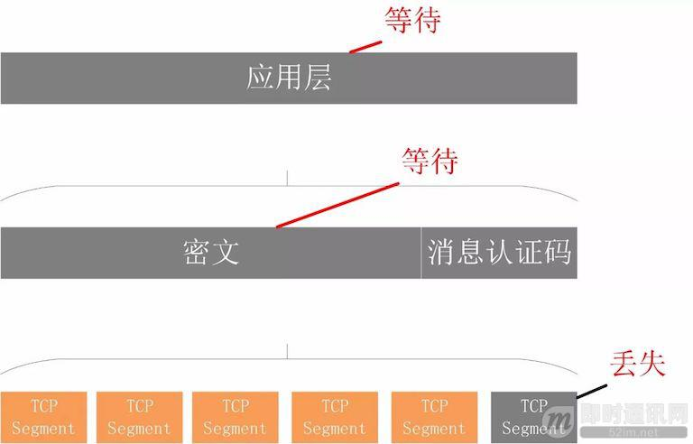

▲ 图 7 TLS 队头阻塞

Record 是 TLS 协议处理的最小单位，最大不能超过 16K，一些服务器比如 Nginx 默认的大小就是 16K。由于一个 record 必须经过数据一致性校验才能进行加解密，所以一个 16K 的 record，就算丢了一个字节，也会导致已经接收到的 15.99K 数据无法处理，因为它不完整。

**那 QUIC 多路复用为什么能避免上述问题呢？**

- 1）QUIC 最基本的传输单元是 Packet，不会超过 MTU 的大小，整个加密和认证过程都是基于 Packet 的，不会跨越多个 Packet。这样就能避免 TLS 协议存在的队头阻塞；
- 2）Stream 之间相互独立，比如 Stream2 丢了一个 Pakcet，不会影响 Stream3 和 Stream4。不存在 TCP 队头阻塞。

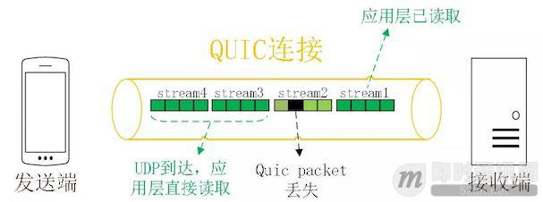

▲ 图 8 QUIC 多路复用时没有队头阻塞的问题

当然，并不是所有的 QUIC 数据都不会受到队头阻塞的影响，比如 QUIC 当前也是使用 Hpack 压缩算法 [10]，由于算法的限制，丢失一个头部数据时，可能遇到队头阻塞。

总体来说，QUIC 在传输大量数据时，比如视频，受到队头阻塞的影响很小。

### 6.5加密认证的报文

TCP 协议头部没有经过任何加密和认证，所以在传输过程中很容易被中间网络设备篡改，注入和窃听。比如修改序列号、滑动窗口。这些行为有可能是出于性能优化，也有可能是主动攻击。

但是 QUIC 的 packet 可以说是武装到了牙齿。除了个别报文比如 PUBLIC_RESET 和 CHLO，所有报文头部都是经过认证的，报文 Body 都是经过加密的。

这样只要对 QUIC 报文任何修改，接收端都能够及时发现，有效地降低了安全风险。

如下图所示，红色部分是 Stream Frame 的报文头部，有认证。绿色部分是报文内容，全部经过加密。

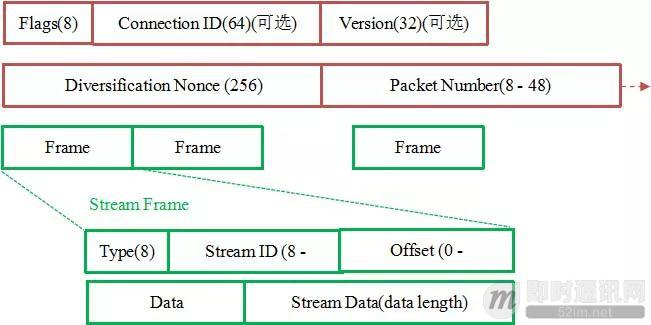

### 6.6连接迁移

一条 TCP 连接 [17] 是由四元组标识的（源 IP，源端口，目的 IP，目的端口）。什么叫连接迁移呢？就是当其中任何一个元素发生变化时，这条连接依然维持着，能够保持业务逻辑不中断。当然这里面主要关注的是客户端的变化，因为客户端不可控并且网络环境经常发生变化，而服务端的 IP 和端口一般都是固定的。

比如大家使用手机在 WIFI 和 4G 移动网络切换时，客户端的 IP 肯定会发生变化，需要重新建立和服务端的 TCP 连接。

又比如大家使用公共 NAT 出口时，有些连接竞争时需要重新绑定端口，导致客户端的端口发生变化，同样需要重新建立 TCP 连接。

针对 TCP 的连接变化，MPTCP[5] 其实已经有了解决方案，但是由于 MPTCP 需要操作系统及网络协议栈支持，部署阻力非常大，目前并不适用。

所以从 TCP 连接的角度来讲，这个问题是无解的。

那 QUIC 是如何做到连接迁移呢？很简单，任何一条 QUIC 连接不再以 IP 及端口四元组标识，而是以一个 64 位的随机数作为 ID 来标识，这样就算 IP 或者端口发生变化时，只要 ID 不变，这条连接依然维持着，上层业务逻辑感知不到变化，不会中断，也就不需要重连。

由于这个 ID 是客户端随机产生的，并且长度有 64 位，所以冲突概率非常低。

### 6.7其他亮点

此外，QUIC 还能实现前向冗余纠错，在重要的包比如握手消息发生丢失时，能够根据冗余信息还原出握手消息。

QUIC 还能实现证书压缩，减少证书传输量，针对包头进行验证等。

限于篇幅，本文不再详细介绍，有兴趣的可以参考文档 [23] 和文档 [4] 和文档 [26]。