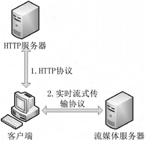

**基于RTMP数据传输协议的实时流媒体技术研究**

## 前言


本文来自论文《基于 RTMP 协议的流媒体技术的原理与应用》，文中研究了基于 Flash 平台的流媒体系统中使用的 RTMP 协议的原理和应用，并对网络上实时流媒体的各种传输方式的优缺点进行了分析。然后,重点分析了基于 RTMP 协议的流媒体技术的特点,并且介绍了 RTMP 协议报文的格式。最后,实现了一个基于 RTMP 协议的流媒体直播系统。

对于即时通讯开发人员来说，文中的相关理论和思路，对于研究即时通讯实时音视频（IM聊天应用的视时音视频通话）技术中的数据传输方案，原理是相通的，有一定的学习和借鉴意义，希望能给你带来一定的启发。即时通讯网(52im.net)现全文收录之。

更多实时音视频开发资料，请见社区精选专辑《[实时音视频开发资料汇总](http://www.52im.net/forum.php?mod=collection&action=view&ctid=4&fromop=all)》。以下是《基于 RTMP 协议的流媒体技术的原理与应用》的论文全文。

## 论文摘要


本文介绍了基于 Flash 平台的流媒体系统中使用的 RTMP 协议的原理和应用。首先,对网络上流媒体的各种 传输方式的优缺点进行了分析。然后,重点分析了基于 RTMP 协议的流媒体技术的特点,并且介绍了 RTMP 协议 报文的格式。最后,实现了一个基于 RTMP 协议的流媒体直播系统。

## 1 引言


近年来,随着网络带宽的提升,以及多媒体压缩编码技术的发展,流媒体技术得到了非常广泛的应用。全球的流媒体市场正在以极高的速度向前发展,并逐步取代了以文本和图片为主的传统互联网。根据Cisco的VisualNetworkingIndex(VNI)统计,2005年流媒体流量仅占全球互联网总流量的5%,而到了2011年这一比例已经提升到40%,预计到2015年这一比例将会进一步提升到62%。与此同时,流媒体技术也已经突破了电脑的限制,进入了平板电脑和智能手机等领域,一个Video Every Where的时代即将到来[1]。

在这种流媒体快速发展的大环境下,各个地方的电视台,视频服务提供商纷纷开始了自己的流媒体业务。在搭建业务平台的时候,如何选取合适自己的流媒体平台成为一个至关重要的问题。中国网络电视台,中国教育电视台,河南电视台,深圳电视台等多家电视台,以及六间房,奇异网,威视网等流媒体服务商都选择了Adobe公司的基于Flash平台的流媒体系统。该系统传输数据使用的RTMP协议[2]因此得到了非常广泛的应用。本文将会对其特点进行详细的分析,并搭建一个基于RTMP协议的流媒体直播系统。

## 2 流媒体


当前互联网中的流媒体服务从传输方式上大体上可以分为两种方式：顺序流式传输和实时流式传输。


### 1顺序流式传输


顺序流式传输采用普通的HTTP服务器作为存储多媒体文件的服务器。当客户端发起连接想要观看多媒体资源的时候,直接通过HTTP协议把文件下载到客户端本地系统的临时文件夹中,再使用播放器播放已经下载好的文件。它的与服务器交互的流程如下图所示。

顺序流式传输的实质就是播放本地文件。顺序流式传输目前得到了十分广泛的应用：YouTube、优酷网、土豆网等视频服务商都采用了该种方式提供多媒体服务。顺序流式传输的好处主要是减轻了服务器的压力,即当多媒体文件下载完成后就可以断开连接,从而节省出服务器资源再为其他客户端服务。此外，顺序流式传输使用的是普通的HTTP服务器，视频服务商不必花费额外的资金购买流媒体服务器，从而节省了一笔经费。

**顺序流式传输如下图：**


### 2实时流式传输


实时流式传输采用专门的流媒体服务器存储多媒体文件。当客户端发起连接想要观看多媒体资源的时候，一般通过专有的实时流式传输协议把位于流媒体服务器上的多媒体数据直接传输给客户端的播放器，再实时播放。他与服务器交互的流程如下图所示。

实时流式传输的应用目前还处于发展阶段，主要应用于网络直播和正版影视的点播。使用实时流式传输方式观看多媒体资源的时候，由于不会把文件下载到本地，可以防止视音频提供商的内容被非法拷贝，从而保护了视音频内容的版权。此外，使用实时流式传输方式观看多媒体资源的时候，可以随意跳转到该视音频的任何位置，而不必像顺序流式传输那样只能观看已经下载过的部分，因此大大增加了观看时的自由度。

**实时流式传输如下图：**




## 3 实时流式传输


流媒体系统中媒体数据传输需要相应的实时流 式传输协议支持。实时流式传输协议属于互联网 TCP/IP 五层体系结构中应用层的协议。在当前的互联网中，很多实时流式传输协议的标准是公司私有的，因此这些协议规范并不公开。目前公开规范 的实时流式传输协议有以下几种:


### 1RTSP+RTP


RTSP 是由 IETF( Internet 工程任务组) 提出 的[3]。RTSP 协议全称是 Real Time Streaming Proto- col,即实时流传输协议,是 IETF 的 RFC 标准。

RTSP 用于控制流媒体的传输,比如建立连接,播放, 暂停等等,但本身并不传输多媒体数据。多媒体数据通常都是使用 RTP/RTCP 协议进行传输。RTP/ RTCP 协议全称是 Real - time Transport Protocol / Real - time Transport Control Protocol,即实时传送协议 / 实时传送控制协议,也是 IETF 的 RFC 标准,专门用于传输多媒体数据。

虽然 RTSP + RTP 是一个国际标准的组合,但是在互联网世界中却没能做到“一统天下”。这与互联网的环境有很大关系。

RTP/ RTCP 作为传输多媒体数据的网络协议,一般情况下使用 UDP 协议作为其传输层的网络协议[3]。 UDP 是无连接的,不提供可靠交付,因此在互联网上( 尤其是广域网) 传输数据的时候极易产生丢包, 时延,抖动等问题。多媒体数据对丢包,时延,抖动 有很高的要求,一点点小问题就会极大的影响用户的体验质量(QoE)[4]。因此互联网上采用RTSP + RTP 方式传输的流媒体并不是很多。

不过，也有例外，现在主流的即时通讯（即IM聊天应用）中的实时音视频聊天中，多使用这种组件，原因在于实时音视频聊天不同于影片播放这种场景，实时性比完整性更重要，播放影片网络不好的时候可以加载一会，用户可以等，但实时音视频聊天时这就是大忌，好在实时音视频聊天时网络很烂的情况下，图像帧丢失的情况并不会有实质性地影响，因而为了效率和实时体验，RTP/RTCP的UDP方式相反却是最佳的。

与在因特网上传输的流媒体不同，IPTV 通常都采用 RTSP + RTP 的方式传输多媒体数据[5]。因为 IPTV 通常采用专网传输，网络状况较好，极少出现丢包,时延,抖动等问题，而 UDP 简单的协议规则可以大幅提高传输效率,所以可以“放心大胆”的使用 RTSP + RTP 的方式传输。


### 2MMS


MMS 是由微软公司提出的。MMS 协议全称是 Microsoft Media Server protocol,即微软媒体服务协议,用于访问 Windows Media 发布点上的内容。


### 3HLS


HLS 是由苹果公司提出的。HLS 全称是 HTTP Live Streaming,即基于 HTTP 的实时流式传输协议, 可实现流媒体的直播和点播,主要应用在 iOS 系统, 为 iOS 设备( 如 iPhone、iPad) 提供音视频直播和点播方案。


### 4RTMP


RTMP 是由 Adobe 公司提出的。RTMP 协议全称是 Real Time Messaging Protocol,即实时消息传送协议,用于在 Flash 平台之间传递视音频以及数据。 与 RTSP + RTP 组合提供流媒体服务的方式不同, RTMP 协议本身既可以传输多媒体数据也可以控制多媒体播放。

RTMP 协议使用 TCP 协议作为其传输层的网络协议。TCP 是面向连接的[3],提供可靠交付的协议,因此在互联网上传输时不会出现丢包情况,从而保证了用户体验( QoE) 。但是 TCP 协议提供可靠交付的代价就是增加了一些额外的开销,占用了一些带宽和处理机资源。随着网络带宽的提高和计算机硬件的发展,这些开销会显得越来越微不足道。因此 RTMP 协议在未来有很好的发展前景。

## 4 基于 RTMP 的系统的特点


很多网络电视台,流媒体服务提供商之所以会选择 RTMP 协议作为其提供流媒体服务的应用层协 议,在于它有以下几个特点:：无须安装客户端程序, 保证了媒体传输质量。


### 1无须安装客户端程序


收看采用 RTMP 协议提供的流媒体无需安装客 户端程序,大大简化了客户操作的复杂度。一般收 看流媒体都需要相应的客户端软件的支持,用户需 要收看流媒体就必须下载相应的软件( 或插件) 。 而支持 RTMP 协议的流媒体客户端可以制作成一个普通的 Flash 文件,只要安装过 Flash Player 的网页浏览器就可以自动下载该文件并运行它。而 Flash Player 是一个上网必备的插件。据统计,全世界 98% 的网页浏览器都安装了 Flash Player。因此,普通用户不需要任何操作,只要使用网页浏览器打开播放页面,就可以收看流媒体[6]。


### 2保证了媒体传输质量


RTMP 协议有效的保证了媒体传输质量,使用户可以观看到高质量的多媒体。RTMP 采用 TCP 协议作为其在传输层的协议,避免了多媒体数据在广域网传输过程中的丢包对质量造成的损失。此外 RTMP 协议传输的 FLV 封装格式支持的 H. 264 视频编码方式可以在很低的码率下显示质量还不错的画面,非常适合网络带宽不足的情况下收看流媒体。

## 5 RTMP 的规范


### 1RTMP 的规范 协 议 格 式


RTMP 协议是一个互联网 TCP/IP 五层体系结构中应用层的协议。RTMP 协议中基本的数据单元称为消息( Message) 。当 RTMP 协议在互联网中传 输数据的时候,消息会被拆分成更小的单元,称为消 息块( Chunk) 。

**消息：**
消息是 RTMP 协议中基本的数据单元。不同种 类的消息包含不同的 Message Type ID,代表不同的 功能。RTMP 协议中一共规定了十多种消息类型, 分别发挥着不同的作用。例如,Message Type ID 在 1 - 7 的消息用于协议控制,这些消息一般是 RTMP 协议自身管理要使用的消息,用户一般情况下无需操作其中的数据。Message Type ID 为 8,9 的消息分别用于传输音频和视频数据。Message Type ID 为 15-20的消息用于发送AMF编码[8]的命令,负责 用户与服务器之间的交互,比如播放,暂停等等。消息首部( Message Header) 有四部分组成: 标志消息 类型的 Message Type ID,标 志 消 息 长 度 的 Payload Length,标识时间戳的 Timestamp,标识消息所属媒 体流的 Stream ID。消息的报文结构如下图所示。


**消息块：**
在网络上传输数据时,消息需要被拆分成较小的数据块,才适合在相应的网络环境上传输。RTMP 协议中规定,消息在网络上传输时被拆分成消息块 ( Chunk) 。消息块首部( Chunk Header) 有三部分组成: 用于标识本块的 Chunk Basic Header,用于标识 本块负载所属消息的 Chunk Message Header,以及当 时间戳溢出时才出现的 Extended Timestamp。消息 块的报文结构如下图所示。


**消息分块：**
在消息被分割成几个消息块的过程中,消息负载部分( Message Body) 被分割成大小固定的数据块 ( 默认是 128 字节,最后一个数据块可以小于该固定长度) ,并在其首部加上消息块首部( Chunk Head- er) ,就组成了相应的消息块。消息分块过程如下图所示,一个大小为 307 字节的消息被分割成 128 字 节的消息块( 除了最后一个) 。


RTMP 传输媒体数据的过程中,发送端首先把媒体数据封装成消息,然后把消息分割成消息块,最后将分割后的消息块通过 TCP 协议发送出去。接收端在通过 TCP 协议收到数据后,首先把消息块重新组合成消息,然后通过对消息进行解封装处理就 可以恢复出媒体数据。


### 2连接方式


RTMP 协议规定,发布一个媒体流之前需要创 建两个逻辑结构: 第一步,建立一个网络连接( Net- Connection) ; 第二步,基于该网络连接建立一个网络 流( NetStream) 。其中,网络连接代表服务器端和客户端之间基础的联系; 网络流代表了发送多媒体数 连接,但是基于该连接可以创建很多网络流。他们据的通道。服务器和客户端之间只能建立一个网络 的关系如下图所示:


## 6 基于 RTMP 的直播系统的搭建


### 1系统结构


本文将会实现一个基于 RTMP 协议的流媒体直 播系统。一个完整的流媒体直播系统包括以下几个 部分: 视频源,流媒体服务器和客户端,系统的构成如下图所示。视频源将视频数据经过 RTMP 协议发 布到流媒体服务器上; 视频成功发布以后,客户端通 过 RTMP 连接到流媒体服务器,就可以播放相应的 视频。其中,视频源和客户端都是使用 ActionScript 语言编写的 Flash 程序[10],流媒体服务器使用 Ado- be 公司的 Flash Media Server 软件。


### 2视频源


视频源是一个提供视频流的应用程序。本系统 中使用一个 ActionScript 代码编写的 Flash 程序作为 视频源。该程序采集本机摄像头数据,将数据压缩 编码后使用 RTMP 协议将数据发布到流媒体服务器 相应的应用程序( Application) 上面。

**下面简要介绍一下视频源部分重要代码含义:**

```
// 建立一个 RTMP 网络连接``var` `nc: NetConnection = ``new` `NetConnection( ) ; ``//连接到 IP 为 222. 31. 64. 249 的流媒体服务器上名字为 publishlive 的应用程序 ``nc.connect(``"rtmp://222.31.64.249/publish-live"` `) ;``// 建立一个基于该连接的网络流``ns = ``new` `NetStream( nc) ; ``// 调用本机的摄像头``cam = Camera. getCamera( ) ;``// 把摄像头添加到新建的流上 ``ns. attachCamera( cam) ;``//把一个多媒体流发布到服务器的应用程序 上,取名为“myCamera”``ns. publish( ``" myCamera"` `,``" live"` `) ;
```


### 3流媒体服务器


流媒体服务器是存储( 或接收) 媒体流并且等 待客户端连接的软件。本系统采用 Adobe 公司的 Flash Media Server 作为流媒体服务器。媒体流必需 发布到已经在流媒体服务器上注册过的应用程序 上。在 Flash Media Server 的 安 装 目 录 的“Applica- tion”文件 夹 下 新 建 一 个“publishlive ”文 件 夹,即 可 注册一个名为“publishlive”的应用程序,不需要编写 任何代码。


### 4客户端


客户端是播放视频流的应用程序。本系统采用一个 ActionScript 语言编写的 Flash 程序作为播放实时流的客户端。使用 RTMP 协议从流媒体服务器获 得视频数据并显示播放。

**下面简要介绍一下客户端的部分关键代码的含义：**

```
// 建立一个 RTMP 网络连接``var` `nc: NetConnection = ``new` `NetConnection( ) ;``//连接到 IP 为 222. 31. 64. 249 的流媒体服务 器上名字为 publishlive 的应用程序``nc.connect( ``"rtmp://222.31.64.249/publish- live"` `) ;``// 建立一个基于该连接的多媒体流 ``nsPlayer = ``new` `NetStream( nc) ;``// 播放名为“myCamera”的多媒体流 ``nsPlayer. play( ``" myCamera"` `) ;``// 新建一个 Video 对象用于显示视频``vidPlayer = ``new` `Video ( cam. width,cam.height) ;``// 将多媒体流添加到 Video 类上``vidPlayer. attachNetStream( nsPlayer) ; ``// 在 Flash 舞台上显示 Video 对象``addChild( vidPlayer) ;
```


## 7 小结和展望


本文分析了流媒体的两种基本传输方式: 顺序 流式传输和实时流式传输的区别。并重点分析了几 种主要的实时流式传输协议的特点。以 RTMP 协议 为基础,分析了它的特点和格式,最后实现了一个的 基于 RTMP 协议的流媒体直播系统。对于全面了解 RTMP 协议的原理有很大的帮助,同时可以为设计 与实现更为复杂的基于 RTMP 协议的流媒体系统提 供一个参考。

今年以来,随着互联网电视( Over - The - Top TV) 逐渐兴起,流媒体技术将会随之迎来一个大发 展阶段。可以预见,以流媒体技术为支撑的流媒体 在未来将会占据传统电视的部分市场并获得相当数量的客户群。而不需要用户安装客户端,视音频质 量良好的基于 RTMP 协议的流媒体系统,也将会在 众多流媒体系统中凸现出来,获得很大的市场份额。

## 参考文献


[1] 中广研究,视讯天下. 在线视频平台白皮书[C]. 北京: 中国标准出版社,2012.
[2] Adobe Systems Incorporated. RTMP Specification [EB / OL]. http: / / wwwimages. adobe. com / www. adobe. com/content/dam/Adobe/en/devnet/rtmp/pdf/rtmp_specification_1.0. pdf,2009.
[3] 谢希仁. 计算机网络( 第五版) [M]. 北京: 电子工业出版社,2009 .
[4] 苏佳,姜秀华. IPTV 视频质量评价介绍[J]. 电视技术,2011,35( 6) : 78 - 81.
[5] 万晓榆,张洪,欧阳春,张溢华. IPTV 技术与运营[M]. 北京: 科学出版社,2010.
[6] 林晓伟.FlashPlayer内部机制[EB/OL].http: / /wenku. baidu. com/view/d4243af3f90f76c661371af4. html,2010.
[7] 姜浩然,徐林.基于RTMP的流媒体服务器的研究[J]. 计算机与数字工程,2011,39( 10) : 104 -108 .
[8] Adobe Systems Incorporated. AMF 3 Specification[EB / OL]. http: / / wwwimages. adobe. com / www. adobe. com/content/dam/Adobe/en/devnet/amf/ pdf / amf - file - format - spec. pdf,2006.
[9] Adobe Systems Incorporated. Adobe Flash Media Server 4. 5 Developer's Guide [EB/OL]. http: / / help. adobe. com / en _ US / flashmediaserver / devguide/flashmediaserver_4. 5_dev_guide. pdf, 2012.
[10] Zerlot Ma. Flash Media Server 3. 0 技 术 指 南 Part1 [EB/OL]. http: / /wenku. baidu. com/ view/ab293b48c850ad02de80418f. html,2006.

## 论文下载


基于RTMP协议的流媒体技术的原理与应用（技术论文）[附件下载]：http://www.52im.net/thread-272-1-1.html