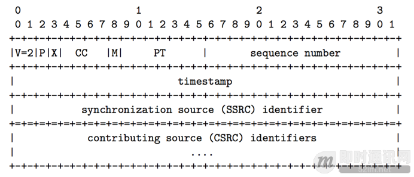
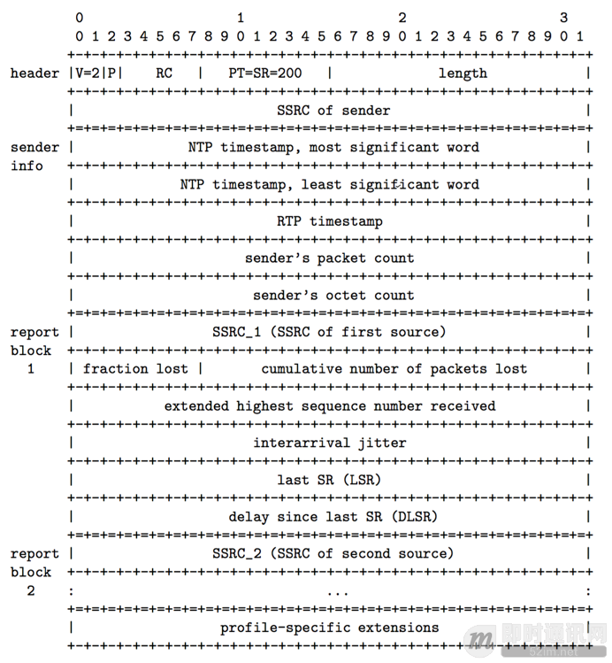
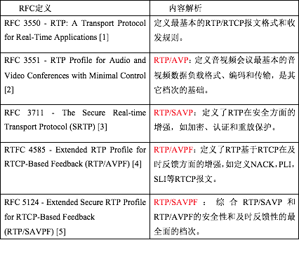

**RTP/RTCP实时传输协议基础知识**

## 1、前言

[RF3550](https://tools.ietf.org/html/rfc3550)定义了实时传输协议RTP和它的控制协议RTCP。RTP协议是Internet上针对实时流媒体传输的基础协议，该协议详细说明在互联网上传输音视频的标准数据包格式。RTP本身只保证实时数据的传输，并不能提供可靠传输、流量控制和拥塞控制等服务质量保证，这需要RTCP协议提供这些服务。

RTCP协议负责流媒体的传输质量保证，提供流量控制和拥塞控制等服务。在RTP会话期间，各参与者周期性彼此发送RTCP报文。报文中包含各参与者数据发送和接收等统计信息，参与者可以据此动态控制流媒体传输质量。RTP和RTCP配合使用，通过有效反馈使使流媒体传输效率最佳化。

IETF的RFC3550定义了RTP/RTCP协议的基本内容，包括报文格式、传输规则等。除此之外，IETF还定义一系列扩展协议，包括RTP扩展，RTCP报文类型扩展，等等。本文对这些协议进行初步归纳总结，在分析RFC3550的基础上，重点分析RTP系列协议，并以报文类型为主线分析RTCP系列协议。

## 2、RFC3550协议

[RFC3550](https://tools.ietf.org/html/rfc3550) - RTP: A Transport Protocol for Real-Time Applications (RTP)
RFC3550协议定义RTP和RTCP协议的最基本内容，包括报文格式及头部扩展、发送和接收规则、RTP Mixer和Translator、协议安全等内容。详细内容都在协议中定义，这里只简述RTP和RTCP报文的基本格式。

**RTP报文头部格式：**

RTP报文由固定头部、(可选)扩展头部和负载三部分组成，如图1所示。头部中的X域标示固定头部后面是否跟随扩展头部，PT域定义负载类型。各部分的详细定义请参考RFC3550[1]。

**RTCP报文Sender Report头部格式：**

RFC3550根据RTCP报文类型定义SR、RR、SDES、BYE和APP五种报文格式。图2显示了SR(Sender Report)的报文格式，包括固定头部、发送端信息和报告块三部分组成：发送端信息携带NTP时间同步和数据发送统计等内容，报告块则包含发送端接收到数据的统计信息。关于RTCP报文格式的详细信息，请继续参考[RFC3550](https://tools.ietf.org/html/rfc3550)。

## 3、RTP档次扩展

RFC3550关于RTP档次的定义如下：“档次定义了一系列负载类型和对应的负载格式，也定义了特定于具体应用的RTP扩展和修改。典型地，某个应用仅基于一个档次运行。”

**IETF针对RFC3550在档次方面定义了一系列扩展协议，总结如下表：**

RFC3551(RTP/AVP)在RFC3550的基础上针对RTP档次进行补充形成RTP/APVP档次，被用在具有最小会话控制的音视频会议中，是其它扩展档次的基础。该档次在没有参数协商和成员控制的会话中非常有用。该档次也为音视频定义一系列编码和负载格式。对于具体的流媒体负载格式，IETF也定义一系列协议详细描述，如V[P8视频负载格式](https://tools.ietf.org/html/rfc7741)和[H264视频负载格式](https://tools.ietf.org/html/rfc6184)，等等。

[RFC3711](https://tools.ietf.org/html/rfc3711)(SRTP，也即RTP/SAVP)是RTP/AVP在安全方面进行扩展形成的档次，为RTP/RTCP提供数据加密、消息认证、重放保护等功能。SRTP具有高吞吐量和低数据膨胀等特点，是异构环境下对RTP/RTCP数据的有效保护。

[RFC4585](https://tools.ietf.org/html/rfc4585)(RTP/AVPF)是RTP/AVP在及时反馈方面进行扩展形成的档次，使得接收端能够向发送端提供及时反馈，实现短时调整和基于反馈的修复机制。该协议定义早期RTCP报文以实现及时反馈，并定义一系列通用RTCP反馈报文和特定于应用的反馈报文，如NACK、PLI、SLI、RPSI等。

[RTC5124](https://tools.ietf.org/html/rfc5124)(RTP/SAVPF)则是RTP/SAVP和RTP/AVPF的综合。SAVP和AVPF在使用时，需要参与者借助于SDP协议[8]就档次和参数信息达成一致。但是对一个RTP会话来说，这两种档次不能同时被协商。而实际应用中，我们有同时使用这两种档次的需要。因此，RTP/SAVPF档次应运而生，它能够使得RTP会话同时具有安全和及时反馈两方面的特性。

本节对RFC3550在档次方面扩展形成的一系列协议进行初步分析。可以看到，RFC3550只定义最基本的内容，在实际应用中会对其在安全性、及时反馈等方面进行扩展。

## 4、RTCP报文类型扩展

RFC 3550定义五种RTCP报文，类型在报文头部的PT域定义。下图对它们作简单描述。

**RFC3550定义的五种RTCP报文：**

SR报文用于发送端报告本端的数据发送统计信息和数据接收统计信息，RR报文用于报告本端的数据接收统计信息，SDES报文用于报告本端的描述性信息，BYE在本端离开会话时发送，而APP则是特定于应用的数据。

**IETF根据实际需求对RTCP的报文类型进行扩展，定义了一系列协议。对这类RTCP报文总结如下表所示：**

下面对这些RFC做进一步分析。

**[RFC5450](https://tools.ietf.org/html/rfc5450) - Transmission Time Offsets in RTP Streams：**
该协议在定义一种更精细地描述传输时间的方法的基础上，定义一种改进的Jitter报告报文，负载类型为195。

**[RFC5104](https://tools.ietf.org/html/rfc5104) - Codec Control Messages in the RTP Audio-Visual Profile with Feedback (AVPF)：**
该协议对RFC4585 AVPF档次进一步补充，定义一系列传输层和特定于负载的RTCP报文格式。该系列报文对SR/RR报文的RC域重定义为FMT域，用以区分报文的子类型。综合RFC4585所定义的报文，如下表所示：

**[RFC3611](https://tools.ietf.org/html/rfc3611) - RTP Control Protocol Extended Reports (RTCP XR)：**
该协议定义RTCP扩展报告块，负载类型为207。RTCP扩展报告块在SR/RR报告块的基础上传输更多的信息。RFC3661定义了7种子报告块，总结如表5:

本节以报文类型为主线，归纳总结RTCP报文及其扩展报文，内容比较多也比较繁琐。这些报文为RTP提供更丰富的控制信息和统计数据。

## 5、小结

本文在分析RTP/RTCP基础协议[RFC3550](https://tools.ietf.org/html/rfc3550)的基础上，以档次为主线分析RTP系列扩展协议，以报文类型为主线分析RTCP系列扩展协议。通过以上工作，得到一个较为清晰的框架和流程，为进一步学习RTP/RTCP协议打下良好基础。