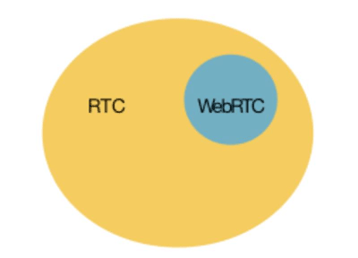
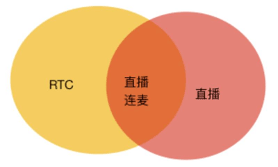

**实时通信RTC技术栈之：视频编解码**

## 1、前言

RTC（Real-time Communications），实时通信，是一个正在兴起的风口行业，经过短短一年的时间，已经有很多玩家进入了这个行业，最典型的应用就是直播连麦和实时音视频通信。但是，很多开发者对一些概念还是有混淆的，比如 RTC 与 WebRTC，RTC 与直播，RTC 与 IM。

那么 RTC 技术栈究竟包含哪些技术，我们会提供一系列文章，来解读 RTC 技术栈。本文是系列文章的第一篇：讲述视频编解码的一些基本知识。

先来纠正几个概念。

## 2、RTC 和 WebRTC 有什么区别？

实时通信（RTC）最容易和 WebRTC 混淆，实际上，二者不能划等号。

RTC 从功能流程上来说，包含采集、编码、前后处理、传输、解码、缓冲、渲染等很多环节，上图展现了一次 RTC 通信的简要流程。每一个细分环节，还有更细分的技术模块。比如，前后处理环节 有美颜、滤镜、回声消除、噪声抑制等，采集有麦克风阵列等，编解码有 VP8、VP9、H.264、H.265 等等。

上图展现了 RTC 与 WebRTC 的关系，WebRTC 是 RTC 的一部分。WebRTC，是 Google 的一个专门针对网页实时通信的标准及开源项目，只提供了基础的前端功能实现，包括编码解码和抖动缓冲等，开发者若要基于 WebRTC 开发商用项目，那么需要自行做服务端实现和部署，信令前后端选型实现部署，以及手机适配等一系列具体工作；在此之外还要在可用性和高质量方面，进行大量的改进和打磨，对自身开发能力的门槛要求非常高。一个专业的 RTC 技术服务系统，需要除了涵盖上述的通信环节外，实际上还需要有解决互联网不稳定性的专用通信网络，以及针对互联网信道的高容忍度的音视频信号处理算法。当然常规云服务的高可用、服务质量的保障和监控维护工具等都只能算是一个专业服务商的基本模块。

所以，WebRTC 仅是 RTC 技术栈中的几个小细分的技术组合，并不是一个全栈解决方案。

## 3、RTC 和直播有什么区别？

上图展现的就是 RTC 与直播的关系，RTC 的一个具体应用是直播场景中的直播连麦，也就是低延时直播。普通直播，一般采用 TCP 协议，使用 CDN 进行内容分发，会有几秒甚至十几秒的延时，主播和观众的互动只能通过文字短消息或送礼来进行。而直播连麦，使用 UDP 协议，内容实时传输，主播和观众可以进行音视频连麦互动，实时沟通，延时一般低至几百毫秒。

## 4、视频编解码的现状

视频编解码的作用，就是在设备的摄像头采集画面和前处理后，将图像进行压缩，进行数字编码，用于传输。编解码器的优劣基本在于：压缩效率的高低，速度和功耗。

VP8，是视频压缩解决方案厂商 On2 Technologies 的第八代视频编解码标准，Google 收购 On2 后，就将 VP8 开源了，并且将其应用到 WebRTC 中。目前，Google 也在主推新一代的编解码标准——VP9。

H.264，是由 ITU-T 视频编码专家组（VCEG）和 ISO/IEC 动态图像专家组（MPEG）联合组成的联合视频组（JVT，Joint Video Team）提出的高度压缩数字视频编解码器国际标准。 WebRTC 也同时支持 H.264。

VP8 和 H.264 是十几年前发明的标准，属于同一代技术。这两个标准处于发展成熟的阶段，编码效率、运算复杂度和功耗上都达到了比较好的均衡。技术和应用程度上，二者也略有区别，比如，硬件厂商对 H.264 的支持较广泛，而对 VP8 的支持就比较有限。

VP9，开发始于 2011 年。VP9 的目标之一是在保证相同质量的情况下相对于 VP8 可以减少 50% 左右的码率，换句话说，相同的码率，VP9 能比 VP8 画质有非常明显的提高。VP9 的一大的优势是专利费用，Google 声明可以免费进行使用。这和 H.264 和 H.265 不同有较大的差异（虽然，2013 年 cisco 已将 open264 开源，并声称在不修改 open264 代码的情况下，能保证由 cisco 覆盖相关的专利费用）。

H.265 旨在在有限带宽下传输更高质量的网络视频，仅需原先的一半带宽即可播放相同质量的视频。它与 H.264 有着相类似的算法架构，并同时对一些相关技术加以改进而大幅提高视频质量。举例来说，H.264 编码器可以以 1Mbps 码率实现标清数字视频压缩；而 H.265 编码器则可以利用相同的码率编码 720P 甚至更高的分辨率的高清视频。这也意味着，在现有的家庭网络情况下，我们的智能手机、平板机等移动设备将能够直接在线播放 1080p 的全高清视频。同时，H.265 标准也同时支持 4K 和 8K 超高清视频。

VP9 和 H.265，是最近 5 年制定的标准，是当前已经完成标准中压缩效率最高的。同样的，H.265 是国际标准，VP9 是 Google 目前主推的标准。H.265 在硬件支持上比较广泛，Apple、高通、intel 等的芯片都支持 H.265 的硬件编解码器。VP9 的硬件支持依然十分有限。总体来说，新一代编码器，编码效率能比上一代提高了 30-50%，但是复杂度和功耗会比上一代大很多，所以纯软件编码实现的话有一定瓶颈，现有的技术下，还是需要依靠硬件编解码为主。

AVS 是我国具备自主知识产权的第二代信源编码标准。目前，AVS1.0 在第三世界国家中已有广泛应用。AVS2.0，属于与 H.265 和 VP9 同级的新一代标准。
编码器只是标准和语法，并没有限定应用场景。因此，在实际应用中，还要结合场景特点，来进行改进和深度优化。声网的视频编码器，针对实时音视频通信做了深度改进，更适应公共互联网的特点，实时性和质量上有很大提升。尤其是与网络的深度结合，同时兼顾对抗丢包和网络带宽的波动。

## 5、视频编解码的探索方向

### 1VR 视频标准

VR 视频标准是当前不论是学术界，还是商业应用的热门探索方向之一。VR 视频的编码目前继续解决的技术问题有：图像的显示质量、合成质量和传输带宽。

VR 视频编码先前的做法是，将已有的视频压缩标准，应用到 VR 场景中。但是，由于 VR 视频内容的特殊性和网络带宽的限制，目前的标准无法满足 VR 视频的压缩需求。业界对 VR 视频压缩标准呼声极高。将来高级的 VR 视频形态应该是自由沉浸立体视频：在一定空间范围内提供 Anywhere + Anytime + Anyview +Stereo 的沉浸体验。

### 2高分辨率的需求

在 H.264 时代，编码器主要应用于低于 HD 的中小分辨率，稍微兼顾 1080P 高分辨率。但 H.265 时代，随着硬件设备更好、带宽更高，用户开始对视频分辨率的要求更高，人们开始发现，用户对视频质量要求是没有止境。因此，新一代编码器，更倾向于支持高分辨率，比如 4K 高清分辨率。新一代编码器对高分辨率的压缩效率可提高 50% 以上。