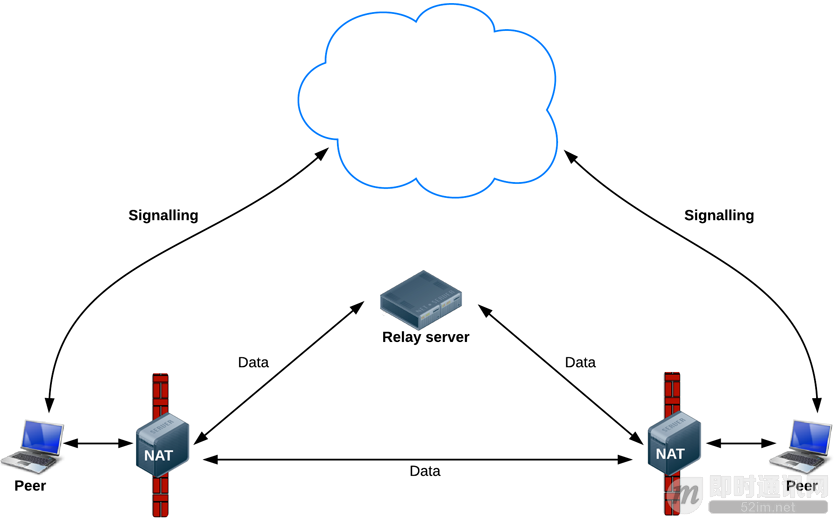

**WebRTC实时音视频技术的整体架构介绍**

## WebRTC 简介

WebRTC，名称源自网页实时通信（Web Real-Time Communication）的缩写，是一个支持网页浏览器进行实时语音通话或视频聊天的技术，是谷歌2010年以6820万美元收购Global IP Solutions公司而获得的一项技术。

WebRTC提供了实时音视频的核心技术，包括音视频的采集、编解码、网络传输、显示等功能，并且还支持跨平台：windows，linux，mac，android。

虽然WebRTC的目标是实现跨平台的Web端实时音视频通讯，但因为核心层代码的Native、高品质和内聚性，开发者很容易进行除Web平台外的移殖和应用。很长一段时间内WebRTC是业界能免费得到的唯一高品质实时音视频通讯技术。

## 更多资料

《[良心分享：WebRTC 零基础开发者教程（中文）](http://www.52im.net/thread-265-1-1.html)》
《[WebRTC实时音视频资料精选](http://www.52im.net/forum.php?mod=collection&action=view&ctid=5)》
《[官方权威入门文档：Getting Started with WebRTC](https://webrtc.org/start/)》

另外，你也可以访问WebRTC的官方网站，各种权威资料都能找到，但内容都是英文的：[https://webrtc.org](https://webrtc.org/)。

## WebRTC的目标

WebRTC（Web Real-Time Communication）项目的最终目的主要是让Web开发者能够基于浏览器（Chrome\FireFox\…）轻易快捷开发出丰富的实时多媒体应用，而无需下载安装任何插件，Web开发者也无需关注多媒体的数字信号处理过程，只需编写简单的Javascript程序即可实现。

W3C等组织正在制定Javascript 标准API，目前是[WebRTC 1.0版本、Draft状态](http://dev.w3.org/2011/webrtc/editor/webrtc.html)。

另外WebRTC还希望能够建立一个多互联网浏览器间健壮的实时通信的平台，形成开发者与浏览器厂商良好的生态环境。同时，Google也希望和致力于让WebRTC的技术成为HTML5标准之一，可见Google布局之深远。

## WebRTC技术架构图

**架构图颜色标识说明：**

- 紫色部分是Web开发者API层；
- 蓝色实线部分是面向浏览器厂商的API层（也就是红色框标内模块）
- 蓝色虚线部分浏览器厂商可以自定义实现

**官方给出的平台支持情况：**

## WebRTC架构组件介绍

### 1Your Web App

Web开发者开发的程序，Web开发者可以基于集成WebRTC的浏览器提供的web API开发基于视频、音频的实时通信应用。

### 2Web API

面向第三方开发者的WebRTC标准API（Javascript），使开发者能够容易地开发出类似于网络视频聊天的web应用，最新的标准化进程可以查看这里。

### 3WebRTC Native C++ API

本地C++ API层，使浏览器厂商容易实现WebRTC标准的Web API，抽象地对数字信号过程进行处理。

### 4Transport / Session

传输/会话层：会话层组件采用了libjingle库的部分组件实现，无须使用xmpp/jingle协议。

\- a. RTP Stack协议栈：Real Time Protocol；
\- b. STUN/ICE：可以通过STUN和ICE组件来建立不同类型网络间的呼叫连接；
\- c. Session Management：一个抽象的会话层，提供会话建立和管理功能。该层协议留给应用开发者自定义实现。

**官方给出的WebRTC STUN原理图：**

**官方给出的WebRTC P2P数据收发原理图：**

### 5VoiceEngine

音频引擎是包含一系列音频多媒体处理的框架，包括从视频采集卡到网络传输端等整个解决方案。

VoiceEngine是WebRTC极具价值的技术之一，是Google收购GIPS公司后开源的。在VoIP上，技术业界领先。

a. iSAC
Internet Speech Audio Codec：针对VoIP和音频流的宽带和超宽带音频编解码器，是WebRTC音频引擎的默认的编解码器。

- 采样频率：16khz，24khz，32khz；（默认为16khz）
- 自适应速率为10kbit/s ~ 52kbit/；
- 自适应包大小：30~60ms；
- 算法延时：frame + 3ms

b. iLBC
Internet Low Bitrate Codec：VoIP音频流的窄带语音编解码器。标准由IETF RFC3951和RFC3952定义。

- 采样频率：8khz；
- 20ms帧比特率为15.2kbps
- 30ms帧比特率为13.33kbps

c. NetEQ for Voice
针对音频软件实现的语音信号处理元件。NetEQ算法：自适应抖动控制算法以及语音包丢失隐藏算法。使其能够快速且高解析度地适应不断变化的网络环境，确保音质优美且缓冲延迟最小。是GIPS公司独步天下的技术，能够有效的处理由于网络抖动和语音包丢失时候对语音质量产生的影响。

NetEQ 也是WebRTC中一个极具价值的技术，对于提高VoIP质量有明显效果，加以AEC\NR\AGC等模块集成使用，效果更好。

d. Acoustic Echo Canceler (AEC)
回声消除器是一个基于软件的信号处理元件，能实时的去除mic采集到的回声。

e. Noise Reduction (NR)
噪声抑制也是一个基于软件的信号处理元件，用于消除与相关VoIP的某些类型的背景噪声（嘶嘶声，风扇噪音等等… …）

### 6VideoEngine

WebRTC视频处理引擎：VideoEngine是包含一系列视频处理的整体框架，从摄像头采集视频到视频信息网络传输再到视频显示整个完整过程的解决方案。

a. VP8
视频图像编解码器，是WebRTC视频引擎的默认的编解码器。VP8适合实时通信应用场景，因为它主要是针对低延时而设计的编解码器。

VPx编解码器是Google收购ON2公司后开源的，VPx现在是WebM项目的一部分，而WebM项目是Google致力于推动的HTML5标准之一。

b. Video Jitter Buffer
视频抖动缓冲器，可以降低由于视频抖动和视频信息包丢失带来的不良影响。

c. Image enhancements
图像质量增强模块：对网络摄像头采集到的图像进行处理，包括明暗度检测、颜色增强、降噪处理等功能，用来提升视频质量。

## 附录：更多实时音视频技术文章