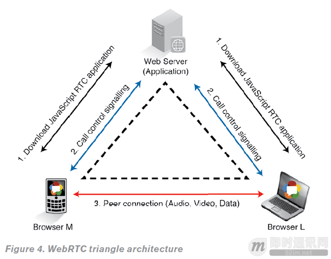
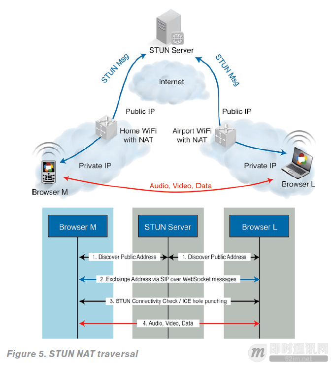
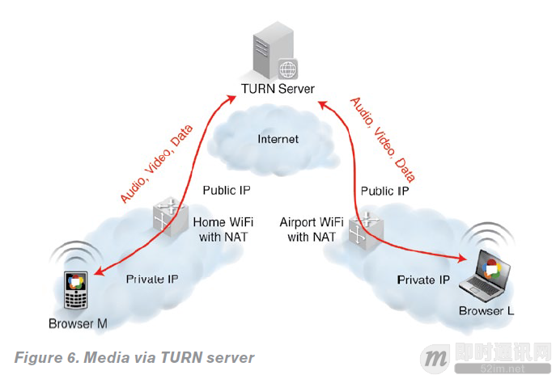
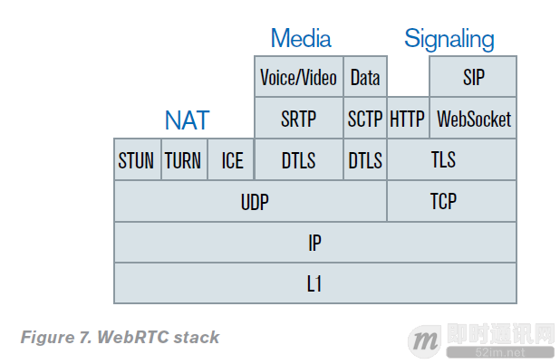

**WebRTC实时音视频技术基础：基本架构和协议栈**

## 概述

本文主要介绍WebRTC的架构和协议栈。

## 最基本的三角形WebRTC架构

为了便于理解，我们来看一个最基本的三角形WebRTC架构（见下图）：

在这个架构中，移动电话用“浏览器M”表示，笔记本电脑用“浏览器L”表示，通过Web服务器将它们连接起来。要建立一个实时媒体通讯，两台设备需要了解彼此的媒体功能，通过交换呼叫信令控制协议实现。

**诸如这样的信令协议在WebRTC标准中并非事先规定，而是由开发者自行制定。在浏览器RTC会话的步骤如下：**

- 首先，两个浏览器都从Web服务器下载了WebRTC程序（HTML5/JavaScript）；
- 其次，两个浏览器通过Web服务器交换控制信令信息（使用嵌入式信令服务器），建立媒体功能功能互通。
- 最后，两个浏览器直接建立RTC媒体的音频、视频和数据通道。

## 真正实用的基于P2P的WebRTC架构

WebRTC使用P2P媒体流，音频、视频和数据的连接直接通过浏览器实现。但是，浏览器却隐藏在NAT（网络地址翻译）和防火墙的后面，这增加了建立P2P媒体会话的难度。这些流程和协议，如ICE或Trickle ICE，STUN和TURN，在建立P2P媒体流都是必不可少的。

**如何使用STUN协议建立一个P2P RTC媒体（如图5所示），简化版的ICE流程如下：**

- 1.两个浏览器通过自己的公网IP地址，使用STUN协议信息和STUN服务器建立联系；
- 2.两个浏览器通过SDP提供/应答机制，使用呼叫控制信令消息交换它们已发现的公共IP地址（ICE候选）；
- 3.两个浏览器执行连接检查（ICE冲孔），确保P2P可以连接；
- 4.建立连接后，RTC媒体会话和媒体交换就可以实现了。
- 5.但是，假如在一个高度限制的NAT或防火墙，这种直接的路径将无法建立，只能到达TURN服务器。结果是媒体通过TURN服务器分程传递（如下图所示）。

## WebRTC的协议栈

**由互联网工程任务组（IETF）基于标准的可互操作的通信模型和协议栈详细地定义了WebRTC技术（参见图7），如下：**

如前所述的信令栈，并非由WebRTC实现规定，而是由开发者自行决定。在这个例子中，我们将使用SIP-over-WebSocket（SIPoWS）作为信令栈。HTTP协议用于浏览器下载HTML5/JavaScript程序内容；NAT栈解决P2P连接问题；媒体栈用于发送和接收RTC的音频和视频。

LETF标准规定G.711和Opus作为音频/视频解码器。视频解码器尚未授权，但是H.248和VP8已经获得授权。媒体栈也用于交换RTC数据。本例中，实时信息采用消息会话中继协议（MSRP），实时会议采用二层控制协议（BFCP），实时文本服务采用T.140。