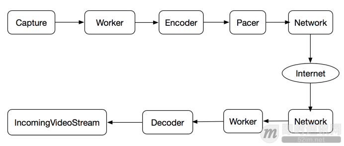
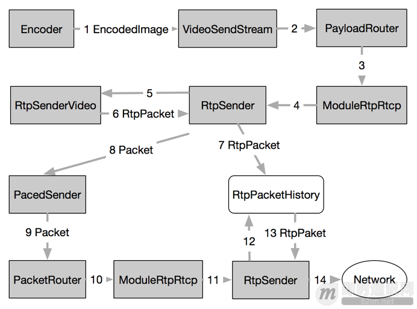
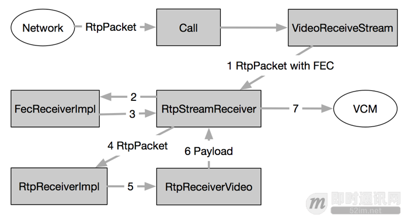
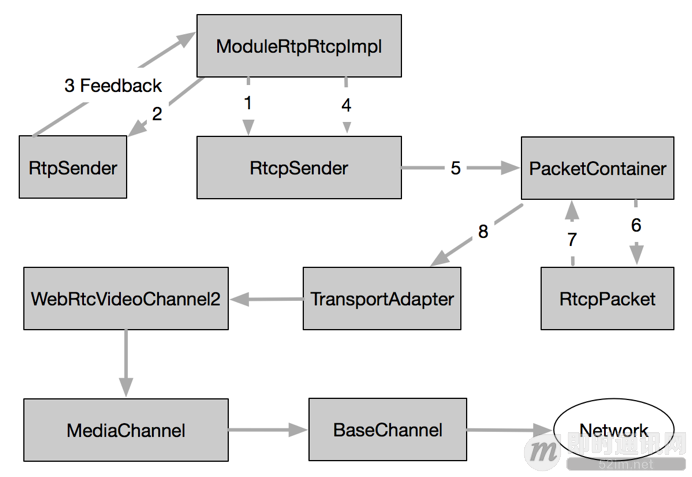
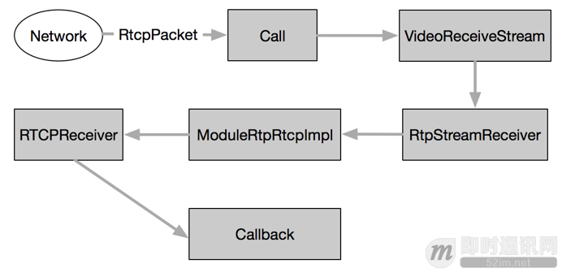

**开源实时音视频技术WebRTC中RTP/RTCP数据传输协议的应用**

## 1、前言

RTP/RTCP协议是流媒体通信的基石。RTP协议定义流媒体数据在互联网上传输的数据包格式，而RTCP协议则负责可靠传输、流量控制和拥塞控制等服务质量保证。在WebRTC项目中，RTP/RTCP模块作为传输模块的一部分，负责对发送端采集到的媒体数据进行进行封包，然后交给上层网络模块发送；在接收端RTP/RTCP模块收到上层模块的数据包后，进行解包操作，最后把负载发送到解码模块。因此，RTP/RTCP 模块在WebRTC通信中发挥非常重要的作用。

本文在深入研究WebRTC源代码的基础上，以Video数据的发送和接收为例，力求用简洁语言描述RTP/RTCP模块的实现细节，为进一步深入掌握WebRTC打下良好基础。

## 2、RTP/RTCP协议概述

RTP协议是Internet上针对流媒体传输的基础协议，该协议详细说明在互联网上传输音视频的标准数据包格式。RTP协议本身只保证实时数据的传输，RTCP协议则负责流媒体的传输质量保证，提供流量控制和拥塞控制等服务。在RTP会话期间，各参与者周期性彼此发送RTCP报文。报文中包含各参与者数据发送和接收等统计信息，参与者可以据此动态控制流媒体传输质量。

[RFC3550](https://tools.ietf.org/html/rfc3550) 定义RTP/RTCP协议的基本内容，包括报文格式、传输规则等。除此之外，IETF还定义一系列扩展协议，包括RTP协议基于档次的扩展，和RTCP协议基于报文类型的扩展，等等。详细内容可参考：《[学习RFC3550：RTP/RTCP实时传输协议基础知识](http://www.52im.net/thread-590-1-1.html)》。

## 3、WebRTC的数据处理和传输过程

WebRTC对外提供两个线程：Signal和Worker，前者负责信令数据的处理和传输，后者负责媒体数据的处理和传输。在WebRTC内部，有一系列线程各司其职，相互协作完成数据流管线。下面以Video数据的处理流程为例，说明WebRTC内部的线程合作关系。

**WebRTC线程关系和数据Pipline：**

如上图所示，Capture线程从摄像头采集原始数据，得到VideoFrame；Capture线程是系统相关的，在Linux系统上可能是调用V4L2接口的线程，而在Mac系统上可能是调用AVFoundation框架的接口。接下来原始数据VideoFrame从Capture线程到达Worker线程，Worker线程起搬运工的作用，没有对数据做特别处理，而是转发到Encoder线程。Encoder线程调用具体的编码器(如VP8, H264)对原始数据VideoFrame进行编码，编码后的输出进一步进行RTP封包形成RTP数据包。然后RTP数据包发送到Pacer线程进行平滑发送，Pacer线程会把RTP数据包推送到Network线程。最终Network线程调用传输层系统函数把数据发送到网络。

在接收端，Network线程从网络接收字节流，接着Worker线程反序列化为RTP数据包，并在VCM模块进行组帧操作。Decoder线程对组帧完成的数据帧进行解码操作，解码后的原始数据VideoFrame会推送到IncomingVideoStream线程，该线程把VideoStream投放到render进行渲染显示。至此，一帧视频数据完成从采集到显示的完整过程。

在上述过程中，RTP数据包产生在发送端编码完成后，其编码输出被封装为RTP报文，然后经序列化发送到网络。在接收端由网络线程收到网络数据包后，经过反序列化还原成RTP报文，然后经过解包得到媒体数据负载，供解码器进行解码。RTP报文在发送和接收过程中，会执行一系列统计操作，统计结果作为数据源供构造RTCP报文之用。RTP报文构造、发送/接收统计和RTCP报文构造、解析反馈，是接下来分析的重点。

## 4、RTP报文发送和接收

RTP报文的构造和发送发生在编码器编码之后、网络层发送数据包之前，而接收和解包发生在网络层接收数据之后、解码器编码之前。本节详细分析这两部分的内容。

### 1RTP报文构造和发送

下图描述发送端编码之后RTP报文的构造和发送过程，涉及三个线程：Encoder、Pacer和Network，分别负责编码和构造RTP报文，平滑发送和传输层发送。下面详细描述这三个线程的协同工作过程。

**RTP报文构造和发送：**

Encode线程调用编码器(比如VP8)对采集到的Raw VideoFrame进行编码，编码完成以后，其输出EncodedImage通过回调到达VideoSendStream::Encoded()函数，进而通过PayloadRouter路由到ModuleRtpRtcpImpl::SendOutgoingData()。接下来，该函数向下调用RtpSender::SendOutgoingData()，进而调用RtpSenderVideo::SendVideo()。该函数对EncodedImage进行打包，然后填充RTP头部构造RTP报文；如果配置了FEC，则进一步封装为FEC报文。最后返回RtpSender::SendToNetwork()进行下一步发送。

RtpSender::SendToNetwork()函数把报文存储到RTPPacketHistory结构中进行缓存。接下来如果开启PacedSending，则构造Packe发送到PacedSender进行排队，否则直接发送到网络层。

Pacer线程周期性从队列中获取Packet，然后调用PacedSender::SendPacket()进行发送，接下来经过ModuleRtpRtcpImpl到达RtpSender::TimeToSendPacket()。该函数首先从RtpPacketHistory缓存中拿到Packet的负载，然后调用PrepareAndSendPacket()函数：更新RtpHeader的相关域，统计延迟和数据包，调用SendPacketToNetwork()把报文发送到传输模块。

Network线程则调用传输层套接字执行数据发送操作。至此，发送端的RTP构造和发送流程完成。需要注意的是，在RtpSender中进行Rtp发送后，会统计RTP报文相关信息。这些信息作为RTCP构造SR/RR报文的数据来源，因此非常重要。

### 2RTP报文接收和解析

在接收端，RTP报文的接收和解包操作主要在Worker线程中执行，RTP报文从Network线程拿到后，进入Worker线程，经过解包操作，进入VCM模块，由Decode线程进行解码，最终由Render线程进行渲染。下图描述RTP报文在Worker线程中的处理流程。

**RTP报文接收和解析：**

RTP数据包经网络层到达Call对象，根据其SSRC找到对应的VideoReceiveStream，通过调用其DeliverRtp()函数到RtpStreamReceiver:eliverRtp()。该函数首先解析数据包得到RTP头部信息，接下来执行三个操作：1.码率估计；2.继续发送数据包；3.接收统计。码率估计模块使用GCC算法估计码率，构造REMB报文，交给RtpRtcp模块发送回发送端。而接收统计则统计RTP接收信息，这些信息作为RTCP RR报文的数据来源。下面重点分析接下来的数据包发送流程。

RtpStreamReceiver::ReceivePacket()首先判断数据包是否是FEC报文，如果是则调用FecReceiver进行解包，否则直接调用RtpReceiver::IncomingRtpPacket()。该函数分析RTP报文得到通用的RTP头部描述结构，然后调用RtpReceiverVideo:arseRtpPacket()进一步得到Video相关信息和负载，接着经过回调返回RtpStreamReceiver对象。该对象把Rtp描述信息和负载发送到VCM模块，继续接下来的JitterBuffer缓存和解码渲染操作。

RTP报文解包过程是封包的逆过程，重要的输出信息是RTP头部描述和媒体负载，这些信息是下一步JitterBuffer缓存和解码的基础。另外对RTP报文进行统计得到的信息则是RTCP RR报文的数据来源。

## 5、RTCP报文发送和接收

RTCP协议是RTP协议的控制下可以，负责流媒体的服务质量保证。比较常用的RTCP报文由发送端报告SR和接收端报告RR，分别包含数据发送统计信息和数据接收信息。这些信息对于流媒体质量保证非常重要，比如码率控制、负载反馈，等等。其他RTCP报文还有诸如SDES、BYE、SDES等，RFC3550对此有详细定义。

本节重点分析WebRTC内部RTCP报文的构造、发送、接收、解析、反馈等流程。需要再次强调的是，RTCP报文的数据源来自RTP报文发送和接收时的统计信息。在WebRTC内部，RTCP报文的发送采取周期性发送和及时发送相结合的策略：ModuleProcess线程周期性发送RTCP报文；而RtpSender则在每次发送RTP报文之前都判断是否需要发送RTCP报文；另外在接收端码率估计模块构造出REMB报文后，通过设置超时让ModuleProcess模块立即发送RTCP报文。

### 1RTCP报文构造和发送

在发送端，RTCP以周期性发送为基准，辅以RTP报文发送时的及时发送和REMB报文的立即发送。发送过程主要包括Feedback信息获取、RTCP报文构造、序列化和发送。下图描述了RTCP报文的构造和发送过程。

**RTCP报文构造和发送：**

ModuleProcess线程周期性调用ModuleRtpRtcpImpl:rocess()函数，该函数通过RTCPSender::TimeToSendRtcpReport()函数确定当前是否需要立即发送RTCP报文。若是，则首先从RTPSender::GetDataCounters()获取RTP发送统计信息，然后调用RTCPSender::SendRTCP()，接着是SendCompoundRTCP()发送RTCP组合报文。关于RTCP组合报文的定义，请参考文献[1]。

在SendCompoundRTCP()函数中，首先通过PrepareReport()确定将要发送何种类型的RTCP报文。然后针对每一种报文，调用其构造函数(如构造SR报文为BuildSR()函数)，构造好的报文存储在PacketContainer容器中。最后调用SendPackets()进行发送。

接下来每种RTCP报文都会调用各自的序列化函数，把报文序列化为网络字节流。最后通过回调到达PacketContainer::OnPacketReady()，最终把字节流发送到传输层模块：即通过TransportAdapter到达BaseChannel，Network线程调用传输层套接字API发送数据到网络。

RTCP报文的构造和发送过程总体不是很复杂，最核心的操作就是获取数据源、构造报文、序列化和发送。相对来说构造报文和序列化比较繁琐，基于RFC定义的细节进行。

### 2RTCP报文接收和解析

**接收端的RTCP报文接收和解析过程如下图所示：**

在接收端，RTCP报文的接收流程和RTP一样，经过网络接收之后到达Call对象，进而通过SSRC找到VideoReceiveStream，继而到达RtpStreamReceiver。接下来RTCP报文的解析和反馈操作都在ModuleRtpRtcpImpl::IncomingRtcpPacket()函数中完成。该函数首先调用RTCPReceiver::IncomingRtcpPacket()解析RTCP报文，得到RTCPPacketInformation对象，然后调用 TriggerCallbacksFromRTCPPacket()，触发注册在此处的各路观察者执行回调操作。

RTCPReceiver::IncomingRtcpPacket()使用RTCPParser解析组合报文，针对每一种报文类型，调用对应的处理函数(如处理SDES的HandleSDES函数)，反序列化后拿到报文的描述结构。最后所有报文综合在一起形成RTCPPacketInformation对象。该对象接下来作为参数调用TriggerCallbacksFromRTCPPacket()函数触发回调操作，如处理NACK的回调，处理SLI的回调，处理REMB的回调，等等。这些回调在各自模块控制流媒体数据的编码、发送、码率等服务质量保证，这也是RTCP报文最终起作用的地方。

至此，我们分析了RTCP报文发送和接收的整个流程。

## 6、小结

本文在深入分析WebRTC源代码的基础上，结合流程图描述出RTP/RTCP模块的实现流程，在关键问题上(如RTCP报文的数据来源)进行深入细致的研究。为进一步深入掌握WebRTC的实现原理和细节打下良好基础。