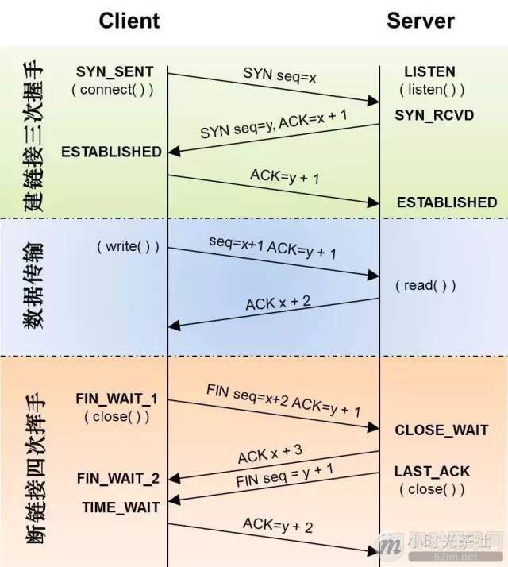
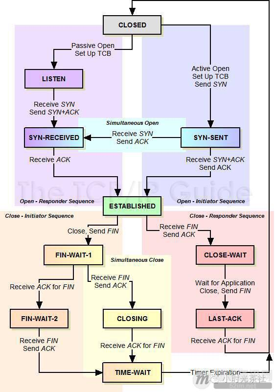
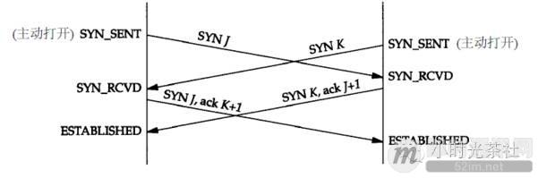
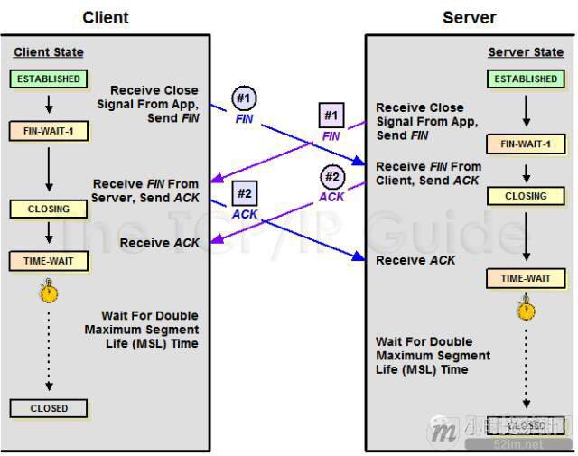

**不为人知的网络编程(一)：浅析TCP协议中的疑难杂症(上篇)**

## 1、前言

说到TCP协议，相信大家都比较熟悉了，对于TCP协议总能说个一二三来，但是TCP协议又是一个非常复杂的协议，其中有不少细节点让人头疼点。本文就是来说说这些头疼点的，浅谈一些TCP的疑难杂症。那么从哪说起呢？当然是从三次握手和四次挥手说起啦，可能大家都知道TCP是三次交互完成连接的建立，四次交互来断开一个连接，那为什么是三次握手和四次挥手呢？反过来不行吗？

## 2、系列文章

**本文是系列文章中的第1篇，本系列文章的大纲如下：**

- 《[不为人知的网络编程(一)：浅析TCP协议中的疑难杂症(上篇)](http://www.52im.net/thread-1003-1-1.html)》（本文）
- 《[不为人知的网络编程(二)：浅析TCP协议中的疑难杂症(下篇)](http://www.52im.net/thread-1004-1-1.html)》
- 《[不为人知的网络编程(三)：关闭TCP连接时为什么会TIME_WAIT、CLOSE_WAIT](http://www.52im.net/thread-1007-1-1.html)》
- 《[不为人知的网络编程(四)：深入研究分析TCP的异常关闭](http://www.52im.net/thread-1014-1-1.html)》
- 《[不为人知的网络编程(五)：UDP的连接性和负载均衡](http://www.52im.net/thread-1018-1-1.html)》
- 《[不为人知的网络编程(六)：深入地理解UDP协议并用好它](http://www.52im.net/thread-1024-1-1.html)》
- 《[不为人知的网络编程(七)：如何让不可靠的UDP变的可靠？](http://www.52im.net/thread-1293-1-1.html)》
- 《[不为人知的网络编程(八)：从数据传输层深度解密HTTP](http://www.52im.net/thread-2456-1-1.html)》
- 《[不为人知的网络编程(九)：理论联系实际，全方位深入理解DNS](http://www.52im.net/thread-2740-1-1.html)》

**如果您觉得本系列文章过于专业，您可先阅读《网络编程懒人入门》系列文章，该系列目录如下：**

- 《[网络编程懒人入门(一)：快速理解网络通信协议（上篇）](http://www.52im.net/thread-1095-1-1.html)》
- 《[网络编程懒人入门(二)：快速理解网络通信协议（下篇）](http://www.52im.net/thread-1103-1-1.html)》
- 《[网络编程懒人入门(三)：快速理解TCP协议一篇就够](http://www.52im.net/thread-1107-1-1.html)》
- 《[网络编程懒人入门(四)：快速理解TCP和UDP的差异](http://www.52im.net/thread-1160-1-1.html)》
- 《[网络编程懒人入门(五)：快速理解为什么说UDP有时比TCP更有优势](http://www.52im.net/thread-1277-1-1.html)》

**本站的《脑残式网络编程入门》也适合入门学习，本系列大纲如下：**

- 《[脑残式网络编程入门(一)：跟着动画来学TCP三次握手和四次挥手](http://www.52im.net/thread-1729-1-1.html)》
- 《[脑残式网络编程入门(二)：我们在读写Socket时，究竟在读写什么？](http://www.52im.net/thread-1732-1-1.html)》
- 《[脑残式网络编程入门(三)：HTTP协议必知必会的一些知识](http://www.52im.net/thread-1751-1-1.html)》
- 《[脑残式网络编程入门(四)：快速理解HTTP/2的服务器推送(Server Push)](http://www.52im.net/thread-1795-1-1.html)》

**关于移动端网络特性及优化手段的总结性文章请见：**

- 《[现代移动端网络短连接的优化手段总结：请求速度、弱网适应、安全保障](http://www.52im.net/thread-1413-1-1.html)》
- 《[移动端IM开发者必读(一)：通俗易懂，理解移动网络的“弱”和“慢”](http://www.52im.net/thread-1587-1-1.html)》
- 《[移动端IM开发者必读(二)：史上最全移动弱网络优化方法总结](http://www.52im.net/thread-1588-1-1.html)》

## 3、参考资料

《[TCP/IP详解](http://www.52im.net/topic-tcpipvol1.html) - [第11章·UDP：用户数据报协议](http://docs.52im.net/extend/docs/book/tcpip/vol1/11/)》
《[TCP/IP详解](http://www.52im.net/topic-tcpipvol1.html) - [第17章·TCP：传输控制协议](http://docs.52im.net/extend/docs/book/tcpip/vol1/17/)》
《[TCP/IP详解](http://www.52im.net/topic-tcpipvol1.html) - [第18章·TCP连接的建立与终止](http://docs.52im.net/extend/docs/book/tcpip/vol1/18/)》
《[TCP/IP详解](http://www.52im.net/topic-tcpipvol1.html) - [第21章·TCP的超时与重传](http://docs.52im.net/extend/docs/book/tcpip/vol1/21/)》
《[通俗易懂-深入理解TCP协议（上）：理论基础](http://www.52im.net/thread-513-1-1.html)》
《[通俗易懂-深入理解TCP协议（下）：RTT、滑动窗口、拥塞处理](http://www.52im.net/thread-515-1-1.html)》
《[理论经典：TCP协议的3次握手与4次挥手过程详解](http://www.52im.net/thread-258-1-1.html)》
《[理论联系实际：Wireshark抓包分析TCP 3次握手、4次挥手过程](http://www.52im.net/thread-275-1-1.html)》

## 4、疑症 1 ：TCP 的三次握手、四次挥手

**下面两图大家再熟悉不过了，TCP的三次握手和四次挥手见下面左边的”TCP建立连接”、”TCP数据传送”、”TCP断开连接”时序图和右边的”TCP协议状态机”：**

（更多详情，请见《[TCP/IP详解：卷1 - 第18章 TCP连接的建立与终止](http://docs.52im.net/extend/docs/book/tcpip/vol1/18/#h18_6)》）

**TCP三次握手、四次挥手时序图：**

**TCP协议状态机：**
要弄清TCP建立连接需要几次交互才行，我们需要弄清建立连接进行初始化的目标是什么。TCP进行握手初始化一个连接的目标是：分配资源、初始化序列号(通知peer对端我的初始序列号是多少)，知道初始化连接的目标，那么要达成这个目标的过程就简单了。

**握手过程可以简化为下面的四次交互：**

- 1 ) clien 端首先发送一个 SYN 包告诉 Server 端我的初始序列号是 X；
- 2 ) Server 端收到 SYN 包后回复给 client 一个 ACK 确认包，告诉 client 说我收到了；
- 3 ) 接着 Server 端也需要告诉 client 端自己的初始序列号，于是 Server 也发送一个 SYN 包告诉 client 我的初始序列号是Y；
- 4 ) Client 收到后，回复 Server 一个 ACK 确认包说我知道了。

**整个过程4次交互即可完成初始化，但是，细心的同学会发现两个问题：**

- 1）Server发送SYN包是作为发起连接的SYN包，还是作为响应发起者的SYN包呢？怎么区分？比较容易引起混淆；
- 2）Server的ACK确认包和接下来的SYN包可以合成一个SYN ACK包一起发送的，没必要分别单独发送，这样省了一次交互同时也解决了问题[1]. 这样TCP建立一个连接，三次握手在进行最少次交互的情况下完成了Peer两端的资源分配和初始化序列号的交换。

大部分情况下建立连接需要三次握手，也不一定都是三次，有可能出现四次握手来建立连接的。

**如下图，当Peer两端同时发起SYN来建立连接的时候，就出现了四次握手来建立连接(对于有些TCP/IP的实现，可能不支持这种同时打开的情况)：**

**在三次握手过程中，细心的同学可能会有以下疑问：**

- 1）初始化序列号X、Y是可以是写死固定的吗，为什么不能呢？
- 2）假如Client发送一个SYN包给Server后就挂了或是不管了，这个时候这个连接处于什么状态呢？会超时吗？为什么呢？

TCP进行断开连接的目标是：回收资源、终止数据传输。由于TCP是全双工的，需要Peer两端分别各自拆除自己通向Peer对端的方向的通信信道。

**这样需要四次挥手来分别拆除通信信道，就比较清晰明了了：**

- 1）Client 发送一个FIN包来告诉 Server 我已经没数据需要发给 Server了；
- 2）Server 收到后回复一个 ACK 确认包说我知道了；
- 3）然后 server 在自己也没数据发送给client后，Server 也发送一个 FIN 包给 Client 告诉 Client 我也已经没数据发给client 了；
- 4）Client 收到后，就会回复一个 ACK 确认包说我知道了。

到此，四次挥手，这个TCP连接就可以完全拆除了。

**在四次挥手的过程中，细心的同学可能会有以下疑问：**

- 1）Client和Server同时发起断开连接的FIN包会怎么样呢，TCP状态是怎么转移的?
- 2）左侧图中的四次挥手过程中，Server端的ACK确认包能不能和接下来的FIN包合并成一个包呢，这样四次挥手就变成三次挥手了。
- 3）四次挥手过程中，首先断开连接的一端，在回复最后一个ACK后，为什么要进行TIME_WAIT呢(超时设置是 2*MSL，RFC793定义了MSL为2分钟，Linux设置成了30s)，在TIME_WAIT的时候又不能释放资源，白白让资源占用那么长时间，能不能省了TIME_WAIT呢，为什么？

## 5、疑症 2 : TCP 连接的初始化序列号能否固定

**如果初始化序列号（缩写为ISN：Inital Sequence Number）可以固定，我们来看看会出现什么问题：**

- 假设ISN固定是1，Client和Server建立好一条TCP连接后，Client连续给Server发了10个包，这10个包不知怎么被链路上的路由器缓存了(路由器会毫无先兆地缓存或者丢弃任何的数据包)，这个时候碰巧Client挂掉了；
- 然后Client用同样的端口号重新连上Server，Client又连续给Server发了几个包，假设这个时候Client的序列号变成了5；
- 接着，之前被路由器缓存的10个数据包全部被路由到Server端了，Server给Client回复确认号10，这个时候，Client整个都不好了，这是什么情况？我的序列号才到5，你怎么给我的确认号是10了，整个都乱了。

[RFC793](https://tools.ietf.org/html/rfc793)中，建议ISN和一个假的时钟绑在一起，这个时钟会在每4微秒对ISN做加一操作，直到超过2^32，又从0开始，这需要4小时才会产生ISN的回绕问题，这几乎可以保证每个新连接的ISN不会和旧的连接的ISN产生冲突。这种递增方式的ISN，很容易让攻击者猜测到TCP连接的ISN，现在的实现大多是在一个基准值的基础上进行随机的。

## 6、疑症 3 : 初始化连接的 SYN 超时问题

Client发送SYN包给Server后挂了，Server回给Client的SYN-ACK一直没收到Client的ACK确认，这个时候这个连接既没建立起来，也不能算失败。这就需要一个超时时间让Server将这个连接断开，否则这个连接就会一直占用Server的SYN连接队列中的一个位置，大量这样的连接就会将Server的SYN连接队列耗尽，让正常的连接无法得到处理。

目前，Linux下默认会进行5次重发SYN-ACK包，重试的间隔时间从1s开始，下次的重试间隔时间是前一次的双倍，5次的重试时间间隔为1s, 2s, 4s, 8s, 16s，总共31s，第5次发出后还要等32s都知道第5次也超时了.所以，总共需要 1s + 2s + 4s+ 8s+ 16s + 32s = 63s，TCP才会把断开这个连接。

由于，SYN超时需要63秒，那么就给攻击者一个攻击服务器的机会，攻击者在短时间内发送大量的SYN包给Server(俗称 SYN flood 攻击)，用于耗尽Server的SYN队列。对于应对SYN 过多的问题，linux提供了几个TCP参数：tcp_syncookies、tcp_synack_retries、tcp_max_syn_backlog、tcp_abort_on_overflow 来调整应对。

## 7、疑症 4 : TCP 的 Peer 两端同时断开连接

**由上面的“TCP协议状态机 ”图可以看出：**

- TCP的Peer端在收到对端的FIN包前发出了FIN包，那么该Peer的状态就变成了FIN_WAIT1；
- Peer在FIN_WAIT1状态下收到对端Peer对自己FIN包的ACK包的话，那么Peer状态就变成FIN_WAIT2；
- Peer在FIN_WAIT2下收到对端Peer的FIN包，在确认已经收到了对端Peer全部的Data数据包后，就响应一个ACK给对端Peer，然后自己进入TIME_WAIT状态。

但是如果Peer在FIN_WAIT1状态下首先收到对端Peer的FIN包的话，那么该Peer在确认已经收到了对端Peer全部的Data数据包后，就响应一个ACK给对端Peer，然后自己进入CLOSEING状态，Peer在CLOSEING状态下收到自己的FIN包的ACK包的话，那么就进入TIME WAIT 状态。于是，TCP的Peer两端同时发起FIN包进行断开连接，那么两端Peer可能出现完全一样的状态转移 FIN_WAIT1-->CLOSEING-->TIME_WAIT，也就会Client和Server最后同时进入TIME_WAIT状态。

**同时关闭连接的状态转移如下图所示：**

## 8、疑症 5 : 四次挥手能不能变成三次挥手呢？

答案是可能的。

TCP是全双工通信，Cliet在自己已经不会在有新的数据要发送给Server后，可以发送FIN信号告知Server，这边已经终止Client到对端Server那边的数据传输。但是，这个时候对端Server可以继续往Client这边发送数据包。于是，两端数据传输的终止在时序上是独立并且可能会相隔比较长的时间，这个时候就必须最少需要2+2 = 4 次挥手来完全终止这个连接。但是，如果Server在收到Client的FIN包后，在也没数据需要发送给Client了，那么对Client的ACK包和Server自己的FIN包就可以合并成为一个包发送过去，这样四次挥手就可以变成三次了(似乎linux协议栈就是这样实现的)。

## 9、疑症 6 : TCP 的头号疼症 TIME_WAIT 状态

要说明TIME_WAIT的问题，需要解答以下几个问题。

### 1Peer两端，哪一端会进入TIME_WAIT呢？为什么?

相信大家都知道，TCP主动关闭连接的那一方会最后进入TIME_WAIT。那么怎么界定主动关闭方呢？是否主动关闭是由FIN包的先后决定的，就是在自己没收到对端Peer的FIN包之前自己发出了FIN包，那么自己就是主动关闭连接的那一方。对于疑症（4）中描述的情况，那么Peer两边都是主动关闭的一方，两边都会进入TIME_WAIT。为什么是主动关闭的一方进行TIME_WAIT呢，被动关闭的进入TIME_WAIT可以不呢？

**我们来看看TCP四次挥手可以简单分为下面三个过程：**

- 过程一：主动关闭方发送FIN；
- 过程二：被动关闭方收到主动关闭方的FIN后发送该FIN的ACK，被动关闭方发送FIN；
- 过程三：主动关闭方收到被动关闭方的FIN后发送该FIN的ACK，被动关闭方等待自己FIN的ACK。

问题就在过程三中，据TCP协议规范，不对ACK进行ACK，如果主动关闭方不进入TIME_WAIT，那么主动关闭方在发送完ACK就走了的话，如果最后发送的ACK在路由过程中丢掉了，最后没能到被动关闭方，这个时候被动关闭方没收到自己FIN的ACK就不能关闭连接，接着被动关闭方会超时重发FIN包，但是这个时候已经没有对端会给该FIN回ACK，被动关闭方就无法正常关闭连接了，所以主动关闭方需要进入TIME_WAIT以便能够重发丢掉的被动关闭方FIN的ACK。

### 2TIME_WAIT状态是用来解决或避免什么问题呢？

**TIME_WAIT主要是用来解决以下几个问题：**

- 1）上面解释为什么主动关闭方需要进入TIME_WAIT状态中提到的： 主动关闭方需要进入TIME_WAIT以便能够重发丢掉的被动关闭方FIN包的ACK。如果主动关闭方不进入TIME_WAIT，那么在主动关闭方对被动关闭方FIN包的ACK丢失了的时候，被动关闭方由于没收到自己FIN的ACK，会进行重传FIN包，这个FIN包到主动关闭方后，由于这个连接已经不存在于主动关闭方了，这个时候主动关闭方无法识别这个FIN包，协议栈会认为对方疯了，都还没建立连接你给我来个FIN包？，于是回复一个RST包给被动关闭方，被动关闭方就会收到一个错误(我们见的比较多的：connect reset by peer，这里顺便说下 Broken pipe，在收到RST包的时候，还往这个连接写数据，就会收到 Broken pipe错误了)，原本应该正常关闭的连接，给我来个错误，很难让人接受；
- 2）防止已经断开的连接1中在链路中残留的FIN包终止掉新的连接2(重用了连接1的所有的5元素(源IP，目的IP，TCP，源端口，目的端口)），这个概率比较低，因为涉及到一个匹配问题，迟到的FIN分段的序列号必须落在连接2的一方的期望序列号范围之内，虽然概率低，但是确实可能发生，因为初始序列号都是随机产生的，并且这个序列号是32位的，会回绕；
- 3）防止链路上已经关闭的连接的残余数据包(a lost duplicate packet or a wandering duplicate packet) 干扰正常的数据包，造成数据流的不正常。这个问题和2）类似。

### 3TIME_WAIT会带来哪些问题呢？

TIME_WAIT带来的问题注意是源于：一个连接进入TIME_WAIT状态后需要等待2*MSL(一般是1到4分钟)那么长的时间才能断开连接释放连接占用的资源，会造成以下问题：

- 1） 作为服务器，短时间内关闭了大量的Client连接，就会造成服务器上出现大量的TIME_WAIT连接，占据大量的tuple，严重消耗着服务器的资源；
- 2） 作为客户端，短时间内大量的短连接，会大量消耗的Client机器的端口，毕竟端口只有65535个，端口被耗尽了，后续就无法在发起新的连接了。

( 由于上面两个问题，作为客户端需要连本机的一个服务的时候，首选UNIX域套接字而不是TCP )。

TIME_WAIT很令人头疼，很多问题是由TIME_WAIT造成的，但是TIME_WAIT又不是多余的不能简单将TIME_WAIT去掉，那么怎么来解决或缓解TIME_WAIT问题呢？可以进行TIME_WAIT的快速回收和重用来缓解TIME_WAIT的问题。有没一些清掉TIME_WAIT的技巧呢？

我们将在下篇文章中继续深入讨论，敬请关注！

