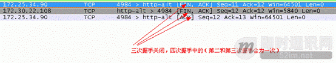
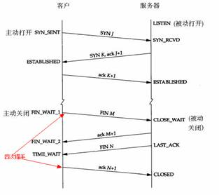
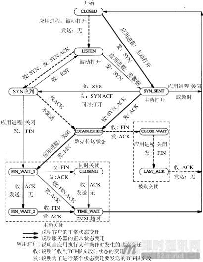
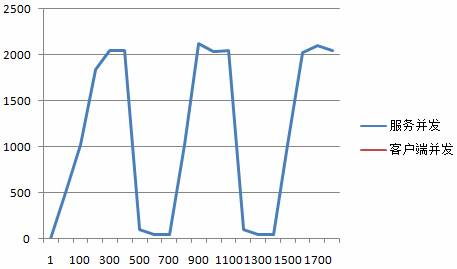
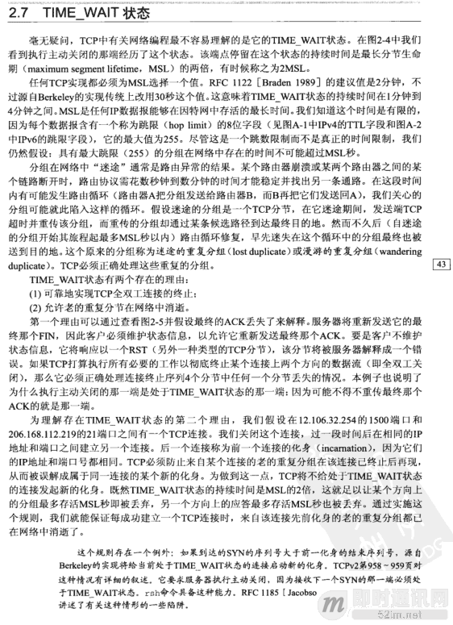

**不为人知的网络编程(三)：关闭TCP连接时为什么会TIME_WAIT、CLOSE_W**

## 1、前言

最近一段时间一直在学习阅读mina和nio的源码，也发现了一些问题无法解决，然后重读了一下tcp协议，收获颇多。（这就是带着问题去读书的好处）

这次就和大家分享一下我们的netframework服务总会抛出一个“connet reset by peer”的原因吧。通过抓包工具分析，主动关闭方直接发送了一个RST flags，而非FIN，就终止连接了。

**如下图所示：**

## 2、系列文章

**本文是系列文章中的第3篇，本系列文章的大纲如下：**

- 《[不为人知的网络编程(一)：浅析TCP协议中的疑难杂症(上篇)](http://www.52im.net/thread-1003-1-1.html)》
- 《[不为人知的网络编程(二)：浅析TCP协议中的疑难杂症(下篇)](http://www.52im.net/thread-1004-1-1.html)》
- 《[不为人知的网络编程(三)：关闭TCP连接时为什么会TIME_WAIT、CLOSE_WAIT](http://www.52im.net/thread-1007-1-1.html)》（本文）
- 《[不为人知的网络编程(四)：深入研究分析TCP的异常关闭](http://www.52im.net/thread-1014-1-1.html)》
- 《[不为人知的网络编程(五)：UDP的连接性和负载均衡](http://www.52im.net/thread-1018-1-1.html)》
- 《[不为人知的网络编程(六)：深入地理解UDP协议并用好它](http://www.52im.net/thread-1024-1-1.html)》
- 《[不为人知的网络编程(七)：如何让不可靠的UDP变的可靠？](http://www.52im.net/thread-1293-1-1.html)》
- 《[不为人知的网络编程(八)：从数据传输层深度解密HTTP](http://www.52im.net/thread-2456-1-1.html)》
- 《[不为人知的网络编程(九)：理论联系实际，全方位深入理解DNS](http://www.52im.net/thread-2740-1-1.html)》

**如果您觉得本系列文章过于专业，您可先阅读《网络编程懒人入门》系列文章，该系列目录如下：**

- 《[网络编程懒人入门(一)：快速理解网络通信协议（上篇）](http://www.52im.net/thread-1095-1-1.html)》
- 《[网络编程懒人入门(二)：快速理解网络通信协议（下篇）](http://www.52im.net/thread-1103-1-1.html)》
- 《[网络编程懒人入门(三)：快速理解TCP协议一篇就够](http://www.52im.net/thread-1107-1-1.html)》
- 《[网络编程懒人入门(四)：快速理解TCP和UDP的差异](http://www.52im.net/thread-1160-1-1.html)》
- 《[网络编程懒人入门(五)：快速理解为什么说UDP有时比TCP更有优势](http://www.52im.net/thread-1277-1-1.html)》

**本站的《脑残式网络编程入门》也适合入门学习，本系列大纲如下：**

- 《[脑残式网络编程入门(一)：跟着动画来学TCP三次握手和四次挥手](http://www.52im.net/thread-1729-1-1.html)》
- 《[脑残式网络编程入门(二)：我们在读写Socket时，究竟在读写什么？](http://www.52im.net/thread-1732-1-1.html)》
- 《[脑残式网络编程入门(三)：HTTP协议必知必会的一些知识](http://www.52im.net/thread-1751-1-1.html)》
- 《[脑残式网络编程入门(四)：快速理解HTTP/2的服务器推送(Server Push)](http://www.52im.net/thread-1795-1-1.html)》

**关于移动端网络特性及优化手段的总结性文章请见：**

- 《[现代移动端网络短连接的优化手段总结：请求速度、弱网适应、安全保障](http://www.52im.net/thread-1413-1-1.html)》
- 《[移动端IM开发者必读(一)：通俗易懂，理解移动网络的“弱”和“慢”](http://www.52im.net/thread-1587-1-1.html)》
- 《[移动端IM开发者必读(二)：史上最全移动弱网络优化方法总结](http://www.52im.net/thread-1588-1-1.html)》

## 3、参考资料

《[TCP/IP详解](http://www.52im.net/topic-tcpipvol1.html) - [第11章·UDP：用户数据报协议](http://docs.52im.net/extend/docs/book/tcpip/vol1/11/)》
《[TCP/IP详解](http://www.52im.net/topic-tcpipvol1.html) - [第17章·TCP：传输控制协议](http://docs.52im.net/extend/docs/book/tcpip/vol1/17/)》
《[TCP/IP详解](http://www.52im.net/topic-tcpipvol1.html) - [第18章·TCP连接的建立与终止](http://docs.52im.net/extend/docs/book/tcpip/vol1/18/)》
《[TCP/IP详解](http://www.52im.net/topic-tcpipvol1.html) - [第21章·TCP的超时与重传](http://docs.52im.net/extend/docs/book/tcpip/vol1/21/)》
《[通俗易懂-深入理解TCP协议（上）：理论基础](http://www.52im.net/thread-513-1-1.html)》
《[通俗易懂-深入理解TCP协议（下）：RTT、滑动窗口、拥塞处理](http://www.52im.net/thread-515-1-1.html)》
《[理论经典：TCP协议的3次握手与4次挥手过程详解](http://www.52im.net/thread-258-1-1.html)》
《[理论联系实际：Wireshark抓包分析TCP 3次握手、4次挥手过程](http://www.52im.net/thread-275-1-1.html)》

## 4、为什么调用sokcet的close时只通过一次握手就终结连接了？

要分析这个原因那就得从关闭连接程的四次握手，有时也会是三次握手，说起。

**如下图所示：**

**大家都知道tcp正常的关闭连接要经过四次握手，如下所示：**

（详见《[TCP/IP详解 卷1：协议 - 18.6 TCP的状态变迁图](http://docs.52im.net/extend/docs/book/tcpip/vol1/18/#h18_6)》）

在这四次握手状态中，有一个特别要注意的状态TIME_WAIT。这个状态是主动关闭方在收到被关闭方的FIN后会处于并长期（2个MSL时间，根据具体的实现不同，这个值会不同，在RFC 1122建议MSL=2分钟，但在Berkeley的实现上使用的值为30s,具体可以看[www.rfc.net](http://www.rfc.net/),要是没有耐心去看英文的可以看这个网站[www.cnpaf.net](http://www.cnpaf.net/) 里面有协议说明以及相应的源码，java源码中我没有发现这个值，我只能追踪到PlainSocketImpl.java这个类，再往下就是本地接口调用了，因此它是依赖本地操作系统的实现）处于的一个状态。也就是大约1-4分钟，然后由操作系统自动回收并将TCP连接设为CLOSED初始状态。

**如下图所示：**

（详见《[TCP/IP详解 卷1：协议 - 18.6 TCP的状态变迁图](http://docs.52im.net/extend/docs/book/tcpip/vol1/18/#h18_6)》）

然而在socket的处于TIME_WAIT状态之后到它结束之前，该socket所占用的本地端口号将一直无法释放，因此服务在高并发高负载下运行一段时间后，就常常会出现做为客户端的程序无法向服务端建立新的socket连接的情况，过了1~4分钟之后，客户又可以连接上了，没多久又连接不上，再等1~4分钟之后又可以连接上。

**上一个星期我们在做一个服务切换时遇到了这种情况：**

这是因为服务方socket资源已经耗尽。netstat命令查看系统将会发现机器上存在大量处于TIME_WAIT状态的socket连接,我这边曾经出现达到了2w多个，并且占用大量的本地端口号。而此时机器上的可用本地端口号被占完，旧的大量处于TIME_WAIT状态的socket尚未被系统回收时，就会出现无法向服务端创建新的socket连接的情况。只能过2分钟之后等系统回收这些socket和端口资源之后才能服务，就这样往复下去。

## 5、TCP为什么要让这种TIME_WAIT状态存活这么久呢？

**其原因有两个（参考stevens的unix网络编程卷1 第38页）：**

- 可靠地实现TCP全双工连接的终止。（确保最后的ACK能让被关闭方接收）；
- 允许老的重复分节在网络中消逝。（TCP中是可靠的服务，当数据包丢失会重传，当有数据包迷路的情况下，如果不等待2MSL时，当客户端以同样地方式重新和服务建立连接后，上一次迷路的数据包这时可能会到达服务，这时会造成旧包被重新读取）。

**unix网络编程卷1 第38页摘录如下：**

## 6、实践中总结的解决方法

- 1）**推荐方法，只能治标不治本：**
  重用本地端口设置SO_REUSEADDR和SO_REUSEPORT (stevens的unix网络编程卷1 第179~182页)有详情的讲解，这样就可以允许同一端口上启动同一服务器的多个实例。怎样理解呢？说白了就是即使socket断了，重新调用前面的socket函数不会再去占用新的一个，而是始终就是一个端口，这样防止socket始终连接不上，会不断地换新端口。Java 中通过调用Socket的setReuseAddress,详细可以查看java.net.Socket源码。【这个地方会有风险，具体可以看(stevens的unix网络编程卷1 第181页)】
- 2）**修改内核TIME_WAIT等待的值：**
  如果客户端和服务器都在同个路由器下，这个是非常推荐的。（链路好，重传机率低）
- 3）**不推崇，但目前我们是这样做的：**
  这个是造成（“connet reset by peer”）的元凶）设置SO_LINGER的值，java中是调用socket的 setSoLinger目前我们是设置为0的。设置为这个值的意思是当主动关闭方设置了setSoLinger（true,0）时，并调用close后，立该发送一个RST标志给对端，该TCP连接将立刻夭折，无论是否有排队数据未发送或未被确认。这种关闭方式称为“强行关闭”，而后套接字的虚电路立即被复位，尚未发出的所有数据都会丢失。而被动关闭方却不知道对端已经彻底断开。当被动关闭方正阻塞在recv()调用上时，接受到RST时，会立刻得到一个“connet reset by peer”的异常（即对端已经关闭），c中是返回一个EPEERRST错。

**关于解决方法3的补充说明：**
为什么不推崇这种方法（在 stevens的unix网络编程卷1 第173页 有详细的讲解）：因为TIME_WAIT状态是我们的朋友，它是有助有我们的（也就是说，它会让旧的重复分节在网络中超时消失（当我们的链路越长，ISP复杂的情况下（从网通到教育网的ping包用了9000ms），重复的分节的比例是非常高的。））。而且我们主动关闭连接方大都是由客户端发起的（除

了HTTP服务和异常），而且客户方一般都不会有持续的大并发请求。 因此对资源没有这么苛刻要求。