**不为人知的网络编程(九)：理论联系实际，全方位深入理解DNS**

## 1、引言


对于 [DNS(Domain Name System)](https://baike.baidu.com/item/dns/427444) 大家肯定不陌生，不就是用来将一个网站的域名转换为对应的IP吗。当我们发现可以上QQ但不能浏览网页时，我们会想到可能是域名服务器挂掉了；当我们用别人提供的hosts文件浏览到一个“不存在”的网页时，我们会了解到域名解析系统的脆弱。

然而关于DNS还有一大堆故事值得我们去倾听，去思考。

## 2、系列文章


**本文是系列文章中的第9篇，本系列文章的大纲如下：**


- 《[不为人知的网络编程(一)：浅析TCP协议中的疑难杂症(上篇)](http://www.52im.net/thread-1003-1-1.html)》
- 《[不为人知的网络编程(二)：浅析TCP协议中的疑难杂症(下篇)](http://www.52im.net/thread-1004-1-1.html)》
- 《[不为人知的网络编程(三)：关闭TCP连接时为什么会TIME_WAIT、CLOSE_WAIT](http://www.52im.net/thread-1007-1-1.html)》
- 《[不为人知的网络编程(四)：深入研究分析TCP的异常关闭](http://www.52im.net/thread-1014-1-1.html)》
- 《[不为人知的网络编程(五)：UDP的连接性和负载均衡](http://www.52im.net/thread-1018-1-1.html)》
- 《[不为人知的网络编程(六)：深入地理解UDP协议并用好它](http://www.52im.net/thread-1024-1-1.html)》
- 《[不为人知的网络编程(七)：如何让不可靠的UDP变的可靠？](http://www.52im.net/thread-1293-1-1.html)》
- 《[不为人知的网络编程(八)：从数据传输层深度解密HTTP](http://www.52im.net/thread-2456-1-1.html)》
- 《[不为人知的网络编程(九)：理论联系实际，全方位深入理解DNS](http://www.52im.net/thread-2740-1-1.html)》（本文）


**如果您觉得本系列文章过于专业，您可先阅读《网络编程懒人入门》系列文章，该系列目录如下：**


- 《[网络编程懒人入门(一)：快速理解网络通信协议（上篇）](http://www.52im.net/thread-1095-1-1.html)》
- 《[网络编程懒人入门(二)：快速理解网络通信协议（下篇）](http://www.52im.net/thread-1103-1-1.html)》
- 《[网络编程懒人入门(三)：快速理解TCP协议一篇就够](http://www.52im.net/thread-1107-1-1.html)》
- 《[网络编程懒人入门(四)：快速理解TCP和UDP的差异](http://www.52im.net/thread-1160-1-1.html)》
- 《[网络编程懒人入门(五)：快速理解为什么说UDP有时比TCP更有优势](http://www.52im.net/thread-1277-1-1.html)》
- 《[网络编程懒人入门(六)：史上最通俗的集线器、交换机、路由器功能原理入门](http://www.52im.net/thread-1629-1-1.html)》
- 《[网络编程懒人入门(七)：深入浅出，全面理解HTTP协议](http://www.52im.net/thread-1677-1-1.html)》
- 《[网络编程懒人入门(八)：手把手教你写基于TCP的Socket长连接](http://www.52im.net/thread-1722-1-1.html)》
- 《[网络编程懒人入门(九)：通俗讲解，有了IP地址，为何还要用MAC地址？](http://www.52im.net/thread-2067-1-1.html)》


**本站的《脑残式网络编程入门》也适合入门学习，本系列大纲如下：**


- 《[脑残式网络编程入门(一)：跟着动画来学TCP三次握手和四次挥手](http://www.52im.net/thread-1729-1-1.html)》
- 《[脑残式网络编程入门(二)：我们在读写Socket时，究竟在读写什么？](http://www.52im.net/thread-1732-1-1.html)》
- 《[脑残式网络编程入门(三)：HTTP协议必知必会的一些知识](http://www.52im.net/thread-1751-1-1.html)》
- 《[脑残式网络编程入门(四)：快速理解HTTP/2的服务器推送(Server Push)](http://www.52im.net/thread-1795-1-1.html)》
- 《[脑残式网络编程入门(五)：每天都在用的Ping命令，它到底是什么？](http://www.52im.net/thread-1973-1-1.html)》
- 《[脑残式网络编程入门(六)：什么是公网IP和内网IP？NAT转换又是什么鬼？](http://www.52im.net/thread-2082-1-1.html)》


**关于移动端网络特性及优化手段的总结性文章请见：**


- 《[现代移动端网络短连接的优化手段总结：请求速度、弱网适应、安全保障](http://www.52im.net/thread-1413-1-1.html)》
- 《[移动端IM开发者必读(一)：通俗易懂，理解移动网络的“弱”和“慢”](http://www.52im.net/thread-1587-1-1.html)》
- 《[移动端IM开发者必读(二)：史上最全移动弱网络优化方法总结](http://www.52im.net/thread-1588-1-1.html)》
- 《[全面了解移动端DNS域名劫持等杂症：技术原理、问题根源、解决方案等](http://www.52im.net/thread-2121-1-1.html)》
- 《[美图App的移动端DNS优化实践：HTTPS请求耗时减小近半](http://www.52im.net/thread-2172-1-1.html)》
- 《[百度APP移动端网络深度优化实践分享(一)：DNS优化篇](http://www.52im.net/thread-2472-1-1.html)》
- 《[百度APP移动端网络深度优化实践分享(二)：网络连接优化篇](http://www.52im.net/thread-2479-1-1.html)》
- 《[百度APP移动端网络深度优化实践分享(三)：移动端弱网优化篇](http://www.52im.net/thread-2678-1-1.html)》


## 3、参考资料


《[DNS cache poisoning](http://viewdns.info/research/dns-cache-poisoning-in-the-peoples-republic-of-china/)》
《[DNS Spoofing vs DNS Cache Poisoning](http://security.stackexchange.com/questions/33257/dns-spoofing-vs-dns-cache-poisoning)》
《[Reset the DNS cache in OS X](https://support.apple.com/en-us/HT202516)》
《[人为网络故障](http://www.williamlong.info/archives/2195.html)》
《[DNS欺骗原理及工作工程分析](http://blog.csdn.net/zhaqiwen/article/details/10108667)》
《[全面了解移动端DNS域名劫持等杂症：技术原理、问题根源、解决方案等](http://www.52im.net/thread-2121-1-1.html)》
《[美图App的移动端DNS优化实践：HTTPS请求耗时减小近半](http://www.52im.net/thread-2172-1-1.html)》
《[百度APP移动端网络深度优化实践分享(一)：DNS优化篇](http://www.52im.net/thread-2472-1-1.html)》

## 4、DNS 源起


要想访问网络上的一台计算机，我们必须要知道它的IP地址，但是这些地址（比如243.185.187.39）只是一串数字，没有规律，因此我们很难记住。并且如果一台计算机变更IP后，它必须通知所有的人。

显然，直接使用IP地址是一个愚蠢的方案。于是人们想出了一个替代的方法，即为每一台计算机起一个名字，然后建立计算机名字到地址的一个映射关系。我们访问计算机的名字，剩下的名字到地址的转换过程则由计算机自动完成。


### 4.1hosts映射


早期，名字到地址的转换过程十分简单。每台计算机保存一个hosts文件，里面列出所有计算机名字和对应的IP地址，然后定期从一个维护此文件的站点更新里面的记录。当我们访问某个计算机名字时，先在hosts文件找到对应的IP，然后就可以建立连接。


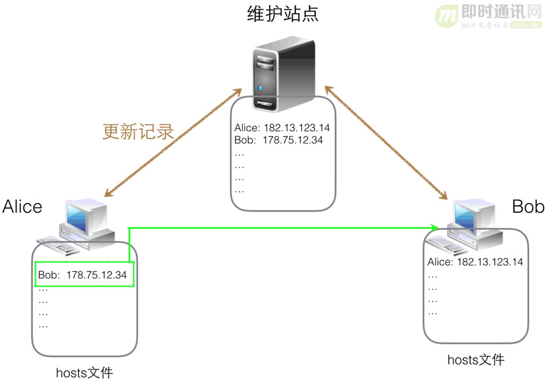


▲ hosts 管理主机

早期的 [ARPANET](https://baike.baidu.com/item/arpanet/3562284?fr=aladdin) 就是这样做的，但是随着网络规模的扩大，这种方法渐渐吃不消了。

**主要有以下三个原因：**


- 1）hosts文件变得非常大；
- 2）主机名字会冲突；
- 3）集中的维护站点会不堪重负（需要给几百万机器提供hosts文件，想想就可怕）。


### 4.2域名系统


为了解决上面的问题，1983年[Paul Mockapetris](https://baike.baidu.com/item/保罗·莫卡派乔斯/9921504?fr=aladdin)提出了域名系统（DNS, Domain Name System)，这是一种层次的、基于域的命名方案，并且用一个分布式数据库系统加以实现。当我们需要访问一个域名（其实就是前面说的计算机的名字）时，应用程序会向DNS服务器发起一个DNS请求，DNS服务器返回该域名对应的IP地址。

**人物介绍：保罗·莫卡派乔斯（Paul V. Mockapetris）：**


保罗·莫卡派乔斯是发明Domain Name System (DNS域名系统)体系结构的RFCs882和883技术创始人和计算机科学家，同时也是现代Internet的奠基者之一。他在1983年的第882和在南加州大学里资讯科学研究院所提出的883号因特网标准草案中提出DNS的架构。他发现了早期因特网，包括阿帕网中基于单个主机单一层面上的域名-IP地址转换的缺陷，并提议将其改进为分布式和动态的数据库域名系统,也就是我们今天所用的域名系统的雏形。在2005年，他获得了ACM（美国计算机协会）数据通信专业组终身成就奖。


**通过下面三种手段解决了上面的问题：**


- 1）用户计算机上并没有存储所有的名字到IP的映射，这样避免了hosts文件过于庞大（现在各操作系统中hosts文件默认都是空的）；
- 2）规定了域名的命名规则，保证主机名字不会重复；
- 3）DNS服务器不再是单一的一台机器，而是一个层次的、合理组织的服务器集群。


**这样访问一个域名的过程可以简化为下图：**

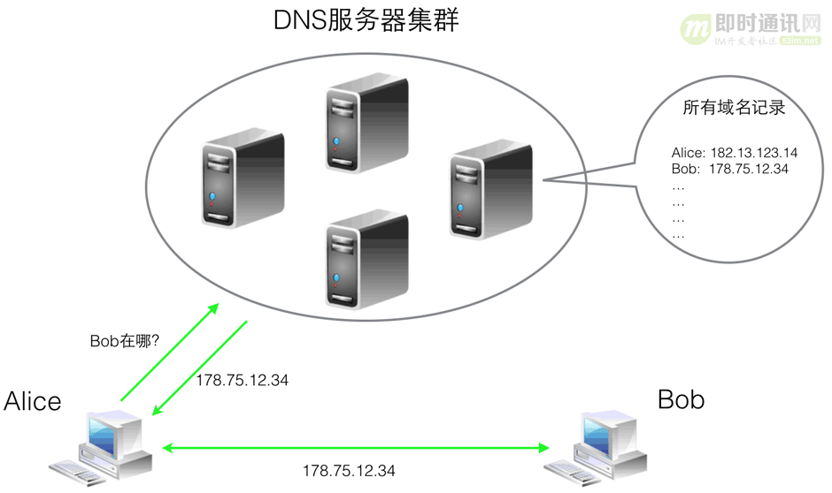


▲ 域名hosts解析过程

## 5、DNS 协议


那么如何具体实现这个所谓的域名系统呢，要知道管理一个超大型并且不断变化的域名到IP的映射集合可不是一个简单的事，况且还要去应付成千上万的DNS查询请求。人们最终想出了一套不错的协议，规定如何来实现这个系统，下面我们一起来看看吧。


### 5.1域名空间


首先我们需要制定一套命名规则，防止域名出现重复。DNS关于域名的规则和我们生活中的快递系统类似，使用层次的地址结构。快递系统中要给某人邮寄物品，地址可能是这样：中国、广东省、广州市、番禺区、中山西路12号 XXX。而一个域名看起来则是这样的groups.google.com（为什么不是com.google.groups？我猜可能和老外写地址的习惯有关）。

对于Internet来说，域名层次结构的顶级（相当于国际快递地址中的国家部分）由[ICANN（互联网名称与数字地址分配机构）](https://www.icann.org/)负责管理。目前，已经有超过250个顶级域名，每个顶级域名可以进一步划为一些子域（二级域名），这些子域可被再次划分（三级域名），依此类推。

**所有这些域名可以组织成一棵树，如下图所示：**

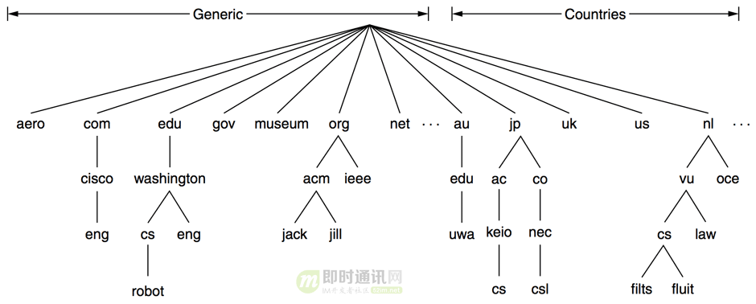


▲ 域名空间树


### 5.2域名资源记录


DNS设计之初是用来建立域名到IP地址的映射，理论上对于每一个域名我们只需要在域名服务器上保存一条记录即可。

**这里的记录一般叫作域名资源记录，它是一个五元组，可以用以下格式表示：**

```
Domain_name Time_to_live Class Type Value
```


**其中：**


- 1）Domain_name: 指出这条记录适用于哪个域名；
- 2）Time_to_live: 用来表明记录的生存周期，也就是说最多可以缓存该记录多长时间（后面会讲到缓存机制）；
- 3）Class: 一般总是IN；
- 4）Type: 记录的类型；
- 5）Value: 记录的值，如果是A记录，则value是一个IPv4地址。


我们看到域名资源记录有一个Type字段，用来表明记录的类型。这是为什么呢？因为对于一个域名来说，通常并非只记录其IP地址，还可能需要一些其他种类的记录。

**一些常见的记录类型如下：**

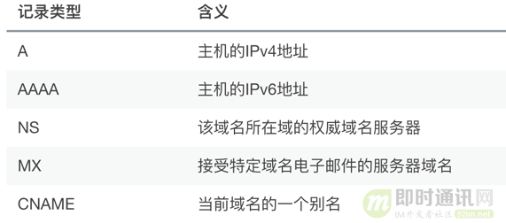


关于这些域名资源记录的实例我们将在文章后半部分看到。


### 5.3域名服务器


我们知道不能只用一台域名服务器来响应所有的DNS查询，因为没有一台机器能够给全球的用户提供查询服务，计算能力、存储、带宽都不允许。只能合理组织一个域名服务器集群，使他们协同工作，共同提供域名解析服务。接下来首先要面对的一个问题是：如何合理地将所有的域名资源记录存储到不同的域名服务器上。

前面说过域名的名字空间可以组织为一棵树，这里我们可以进一步将其划分为不重叠的区域（[DNS zone](https://en.wikipedia.org/wiki/DNS_zone)）。

**针对上图的域名空间，一种可能的域名划分如下图：**

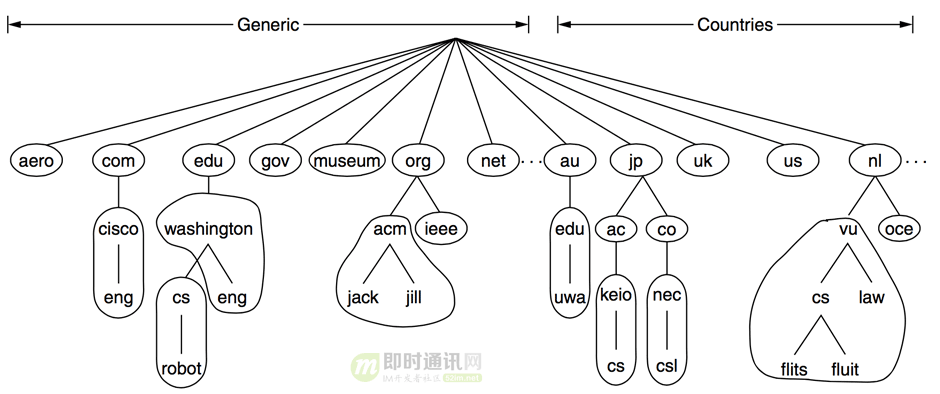


▲ 域名划分

然后将每个区域与多个域名服务器（其中一个是master，其他slave服务器则用来提供数据备份、加快解析速度、保证服务可用性）关联起来，称这些域名服务器为该区域的权威域名服务器(Authoritative Name Servers )。

**它保存两类域名资源记录：**


- 1）该区域内所有域名的域名资源记录；
- 2）父区域和子区域的域名服务器对应的域名资源记录（主要是NS记录）。


这样，所有的域名资源记录都保存在多个域名服务器中，并且所有的域名服务器也组成了一个层次的索引结构，便于我们后面进行域名解析。下面以一个简化的域名空间为例子，说明域名资源记录是如何保存在域名服务器中的。

**如下图a：**

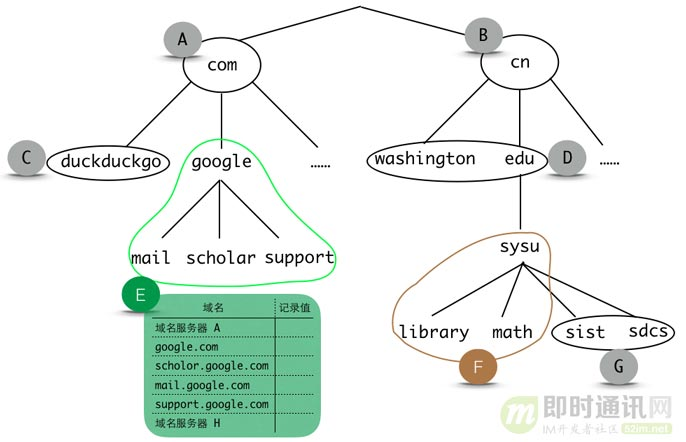


▲ 域名服务器

图中域名空间划分为A, B, C, D, E, F, G七个DNS区域，每个DNS区域都有多个权威域名服务器，这些域名服务器里面保存了许多域名解析记录。对于上图的NDS区域E来说，它的权威域名服务器里面保存的记录如图中表格所示。

仔细观察上图你可能会发现区域A、B并没有父区域，他们之间并没有一条路径连在一起。这将导致一个很麻烦的问题，那就是区域A的权威域名服务器可能根本不知道区域B的存在。认识到这一点后，你可能会想出一个很自然的解决方案，就是在A中记录B域名服务器的地址，同时在B中记录A的，这样它们两个就联系起来了。但是考虑到我们有超过250个顶级域名，这样做并不是很恰当。

而我们使用的域名系统则采用了一种更加聪明的方法，那就是引入[根域名服务器](https://baike.baidu.com/item/根域名服务器)，它保存了所有顶级区域的权威域名服务器记录。现在通过根域名服务器，我们可以找到所有的顶级区域的权威域名服务器，然后就可以往下一级一级找下去了。

**下图为全球根域名服务器的分布图：**

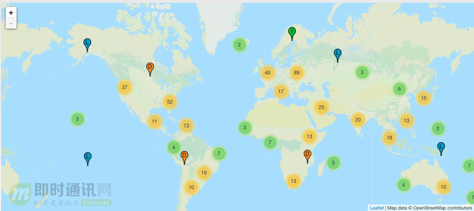


（本图的清晰大图，来自：http://www.root-servers.org/）

现在为止，我们的权威域名服务器和根域名服务器其实组成了一个树，树根为根域名服务器，下面每个节点都是一个区域的权威域名服务器，对于图a中各个DNS区域的权威域名服务器，它们组成了下面这棵树（实际中，一个权威域名服务器可能保存有多个DNS区域的记录，因此权威域名服务器之间的联系并不构成一棵树。这部分的详细内容可以参考[RFC 1034: 4. NAME SERVERS](https://datatracker.ietf.org/doc/rfc1034/?include_text=1)。

**下面为了容易理解，将其简化为一棵树）：**

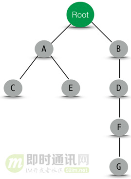


### 5.4域名解析


我们已经有了一个域名服务器集群，该集群合理地保存了域名空间和域名资源记录的对应关系。现在我们要做的就是发送一个DNS请求给域名服务器，然后坐等它返回正确的域名资源记录，这个过程叫作域名解析。

严格来说，域名解析的过程最早要追溯到建立网络连接。因为每当连接上网络之后，计算机会自动获得一个默认的DNS服务器，当然你也可以用自己信任的DNS服务器，比如8.8.8.8（DNS服务器也有信任不信任之分，是的，实践篇会讲到），我们把这个域名服务器也叫作本地域名服务器。接下来当我们需要知道一个域名对应的资源记录时，会向本地域名服务器发起请求，如果该域名恰好在本地域名服务器所辖属的域名区域（DNS zone）内，那么可以直接返回记录。

如果在本地域名服务器没有发现该域名的资源记录，就需要在整个域名空间搜索该域名。而整个域名空间的资源记录存储在一个分层的、树状联系的一系列域名服务器上，所以本地域名服务器首先要从根域名服务器开始往下搜索。这里有一个问题就是：本地域名服务器如何找到根域名服务器在哪里呢？其实域名服务器启动的时候，就会加载一个配置文件，里面保存了根域名服务器的NS记录（要知道根域名服务器地址一般非常稳定，不会轻易改变，并且数量很少，所以这个配置文件会很小）。找到根域名服务器之后，就可以一级一级地往下查找啦。

**仍然以我们的图a为例，现在假设区域E内的某个用户想访问math.sysu.edu.cn，那么请求的过程如下：**

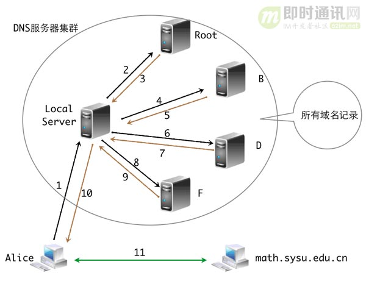


**用语言简单描述如下：**


- 1）用户：喂，本地域名服务器，告诉我math.sysu.edu.cn的地址；
- 2）本地域名服务器：哎呀，我不知道啊，不在我的辖区，容我去问问老大哥吧。root老大，能告诉我math.sysu.edu.cn的地址吗；
- 3）根域名服务器：忙着呢，你去问B（.cn）；
- 4）本地域名服务器：喂，B，告诉我math.sysu.edu.cn的地址；
- 5）B：你去问D（.edu.cn）；
- 6）本地域名服务器：喂，D，告诉我math.sysu.edu.cn的地址；
- 7）D：你去问F（sysu.edu.cn）；
- 8）本地域名服务器：喂，F，告诉我math.sysu.edu.cn的地址；
- 9）F：容老衲看看，哎呀，找到了，是X.X.X.X；
- 10）本地域名服务器：踏破铁鞋终于找到啦，喂用户，出来啊，我找到了，是X.X.X.X。


仔细想想，这和我们邮寄快递实在是如出一辙啊，假设你从美国邮东西到广州市番禺区，首先快递送到中国（不过这里没有一个类似根域名服务器的中转站而已），然后往下到广东省，接下来是广州市，再往下是番禺了。

上面的是本地域名服务器的迭代解析过程，其实也可以递归查询，这里就不说了，道理差不多。

## 6、缓存机制


现在整个域名系统已经可以为我们提供域名解析服务了，当我们输入域名，计算机发送DNS请求，然后DNS服务器返回给我们解析的结果，一切看起来很完美。然而是不是可以更完美呢？

**回顾一下平时浏览网站的情况，我们会发现两个比较有意思的结论：**


- 1）80%的时间我们都在看那些20%的网站，这就是大名鼎鼎的 [80/20 Rule](https://en.wikipedia.org/wiki/Pareto_principle)；
- 2）我们会在一个网站的不同网页之间跳转，也就是不断地访问同一个域名，类似程序访问的局部性原理。


这两条结论很容易让我们联想到缓存机制。如果我们将已经访问过的那些域名的解析结果缓存在自己的计算机上，那么下次访问的时候可以直接读取结果，不用再次重复DNS查询过程，给自己和域名服务器都节省了麻烦。

当然，这样做的一个前提是要缓存的解析结果不会频繁更改，也就是说我十分钟后解析一个域名的结果和现在解析的结果是一样的。对大多数域名来说，这都是一个不争的事实。但是难免有一些“善变”的域名，他们可能会频繁更改自己的解析结果。为了使缓存机制适应这两类情况，我们在域名资源记录里面添加一个 *Time_to_live* 字段，表明这条记录最多可以缓存多久。对于那些“稳如泰山”的域名，给一个比较大的值，而那些“朝三暮四”的域名，则可以给定一个小的值。

我们既然可以在本机利用缓存，那么可不可以在域名服务器上也利用缓存机制呢，答案当然是可以的。因为对于域名服务器来说，上面的两条有意思的结论仍然有效。所以，域名服务器可以将那些访问过的域名资源记录缓存，用户再次发起请求时，可以直接返回缓存结果，不用去迭代或者递归解析。

关于DNS理论部分，更多内容还可以参考这两个文本：《[RFC 1034: Domain Names - Concepts and Facilities](https://tools.ietf.org/html/rfc1034)》。

## 7、文章并没有结束


在上面的理论内容章节里，我们基本了解了DNS的整个协议原理。

**但是可能还会有着下面的疑问：**


- 1）为什么我想申请的域名都没了？
- 2）DNS 域名还要备案，这是为什么啊？
- 3）如何将刚申请的域名绑定到自己的网站呢？
- 4）怎么才能看到那些在背后默默给我解析的域名服务器呢？
- 5）他们说用一个什么文件就可以访问好多好多不存在的网站，是真的吗？
- 6）可信任的域名服务器是怎么一回事，难道有些域名服务器会做坏事？
- 7）怎么知道我现在用的域名服务器有没有使坏呢？
- 8）……


我不准备一个一个地去回答这些问题，不过相信我，读完下面的内容，对于上面问题的答案你会有一个清晰的认识，并且可以解决其他各种各样关于 DNS 方面的问题。

## 8、域名注册、绑定


首先明确一点，每个人都可以去注册域名。大多数时候我们希望去注册一个顶级域名（比如52im.net、google.com等），那些二级域名毕竟不够好记（比如github托管博客的域名：username.github.io）。有的顶级域名（比如.tk域名）提供免费的一年域名试用，不过绝大多时候还是要为自己的域名付费的（一般是按年付费，也不是很贵）。要想去注册域名，首先得找到域名注册商，国内的比较著名的有[万网](https://wanwang.aliyun.com/)等（PS：万网已被阿埋里收购了），国外的有[godaddy](https://www.godaddy.com/)等。相信注册过域名的人都知道绝大多数我们能想到的自己喜欢的域名都已名花有主了，只剩那些不是那么惹人关注的域名供我们选择。所以，注册域名时，发现自己每想到一个域名都显示被人注册后，那太正常不过了，说明你的品味比较正常。

这里一点个人建议，选中一个域名后不要轻易去改了，因为换域名成本挺高的（我猜现在就算给淘宝一千万，它也不会换另成一个域名吧）。所以，最好不要去用免费的域名，因为指不定啥时候就不让你用了。你应该相信这么一个观点：**天下没有免费的午餐**。拓展一下就是，掏钱买服务，心里踏实。

接下来你可能会希望将自己的站点或者博客挂在自己选中的域名下，这其实很简单，只需要找到一个提供域名解析的服务商，然后填写相应的域名解析记录。大多时候，你注册域名的服务商都会免费提供域名解析服务。

现实中，大部分人可能会拥有个人博客，以前我们都是依赖一个博客平台（如CSDN），或者是买一台VPS托管自己的博客。不过自从Github推出了Blog服务，好多程序员都转而将博客托管在上面。Github Blog支持绑定个人域名，并提供了详细的绑定文档：[Adding a CNAME file to your repository](https://help.github.com/articles/adding-a-cname-file-to-your-repository/)。假设你的博客已经可以通过 username.github.io 访问，接下来只需要用 CNAME 告诉Github你的博客绑定了哪个域名（比如说是selfboot.cn），然后在域名解析商那里添加解析记录即可。

**下图是我个人博客在DNSpod的解析记录：**

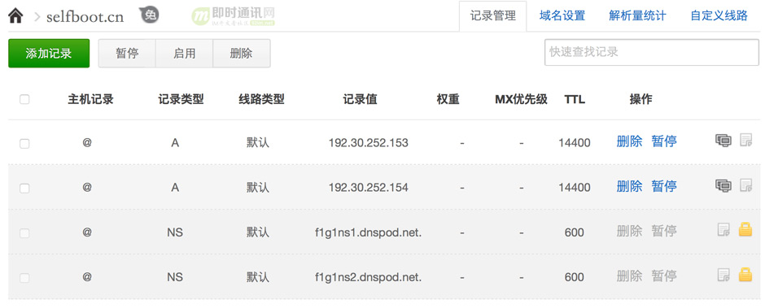


▲ 域名解析记录

现在当我们访问 selfboot.cn 时，DNSpod就会将请求解析到 Github 提供的 IP 地址上。之后 Github 上面的博客托管服务器在所有用户的 CNAME 记录中，找到本次请求的域名对应的博客项目地址，比如说是 xuelangZF.github.io，然后返回博客内容。

## 9、域名解析


我们都知道一个域名的解析过程中，可能会有多台域名服务器给我们帮助，那么我们怎么能看到这些背后的功臣呢？先介绍两个常用的关于DNS的命令。


### 9.1dig和nslookup命令


**dig**(Domain Information Groper), 是 UNIX/BSD 系统自带的 DNS 诊断工具，使用十分灵活、方便。

**查询 selfboot.cn 的A记录，并返回简短的结果：**

```
$ ``dig` `selfboot.cn -t A +short``192.30.252.153``192.30.252.154
```


**用 dig 还可以查询某一 ip 对应的域名，如下：**

```
$ ``dig` `-x 192.30.252.153 +short``pages.github.com.
```


这里返回的是pages.github.com，因为当你访问博客地址 selfboot.cn 时，其实是Github的pages 服务器（域名是：pages.github.com）在后台返回该博客内容的（根据 CNAME 确定返回哪个博客）。

nslookup 也是一个 DNS 诊断工具，几乎所有平台都自带该工具，使用也很简答，可以用 man 查询手册。


### 9.2解析路径查询


接下来用 dig 命令查看从根域名到指定域名中间可能经过的所有域名服务器，使用 *+trace* 选项即可。


```
dig` `selfboot.cn +trace @8.8.8.8``; <<>> DiG 9.8.3-P1 <<>> selfboot.cn +trace @8.8.8.8``;; global options: +cmd``.            474418    IN    NS    j.root-servers.net.``.            474418    IN    NS    g.root-servers.net.``......``.            474418    IN    NS    l.root-servers.net.``.            474418    IN    NS    m.root-servers.net.``;; Received 496 bytes from 8.8.8.8``#53(8.8.8.8) in 12 ms``cn.            172800    IN    NS    a.dns.cn.``......``cn.            172800    IN    NS    e.dns.cn.``cn.            172800    IN    NS    ns.cernet.net.``;; Received 292 bytes from 2001:500:1::803f:235``#53(2001:500:1::803f:235) in 382 ms``selfboot.cn.        86400    IN    NS    f1g1ns2.dnspod.net.``selfboot.cn.        86400    IN    NS    f1g1ns1.dnspod.net.``;; Received 83 bytes from 203.119.25.1``#53(203.119.25.1) in 816 ms``selfboot.cn.        14400    IN    A    192.30.252.153``selfboot.cn.        14400    IN    A    192.30.252.154``selfboot.cn.        600    IN    NS    f1g1ns1.dnspod.net.``selfboot.cn.        600    IN    NS    f1g1ns2.dnspod.net.``;; Received 125 bytes from 115.236.137.40``#53(115.236.137.40) in 31 ms
```


可以看到最开始是13台顶级域名服务器的NS记录（中间省去一些记录减少行数，方便观察更清楚），接下来是顶级域名 cn. 的权威域名服务器（省略一些输出），然后是 selfboot.cn 的 NS 记录，即 DNSpod 的两条 NS 记录，最后从 f1g1ns2.dnspod.net 找到 selfboot.cn 的 A 记录。

[seveas](https://github.com/seveas) 提供了一个可视化的路径查询工具：[dnsgraph](http://ip.seveas.net/dnsgraph/)，可以在线绘制跟域名到指定域名的所有可能路径。

当然，实际查询过程中，大多时候我们在本地缓存或者本地域名服务器缓存就能直接找到需要的域名记录，不需要每次都向根域名服务器发起请求，然后重复迭代或者递归查询过程。

## 10、DNS目前存在的缺陷


域名系统设计的很理想很美好，然而仍有一些小的瑕疵，可能会给我们带来些许困扰。


### 10.1域名抢注


首先，有些域名对注册人没有限制，而另外一些域名则对谁可以得到一个域名空间中的名字有限制。比如pro域名是分配给合适的专业人员，但问题是谁才是专业的呢？显然医生、工程师是专业人员，但理发师、管道工呢？

此外，域名也可以被倒卖。黄牛们会批量注册大量域名（据说com域名下几乎每一个普通词都被人尝试注册了域名），然后转身就以高价转卖给那些对该域名感兴趣的人，这就是所谓的域名抢注。所以，现在你想注册一个符合自己网站特点的域名是很难的。

这个问题其实还不算严重，更要命的是下面两个问题。


### 10.2DNS 劫持


我们知道一个域名服务器对其区域内的用户解析请求负责，但是并没有一个机制去监督它有没有真地负责。也就是说域名服务器的权力并没有被关在笼子里，所以它既可以认真地“为人民服务”，也可以指鹿为马。于是有些流氓的域名服务器故意更改一些域名的解析结果，将用户引向一个错误的目标地址。这就叫作 DNS 劫持，主要用来阻止用户访问某些特定的网站，或者是将用户引导到广告页面。


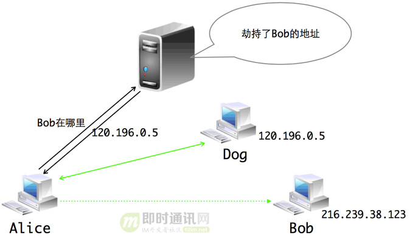


▲ DNS 劫持原理

**下面验证下我所用的域名服务器有没有干这种坏事，只需要一条简单的命令即可：**

```
➜ ~ ``nslookup` `google.com``Server:        10.8.4.4``Address:    10.8.4.4``#53``Non-authoritative answer:``Name:    google.com``Address: 120.196.0.5
```


我的DNS服务器地址为10.8.4.4，他告诉我google.com的地址是120.196.0.5，我才不信呢。于是用*whois 120.196.0.5*一看，果真不是Google的地址。针对DNS劫持，我们可以简单地更换域名服务器，比较靠谱的一个是Google提供的8.8.8.8。下面用 8.8.8.8 来解析一下 [www.google.com](http://www.google.com/) 就能看到正确的地址了。

```
$ ``nslookup` `[url=http:``//www``.google.com]www.google.com[``/url``] 8.8.8.8``Server:        8.8.8.8``Address:    8.8.8.8``#53``Non-authoritative answer:``Name:    [url=http:``//www``.google.com]www.google.com[``/url``]``Address: 216.58.221.68
```


**更多关于DNS劫持这方面的内容，可以详见：**《[全面了解移动端DNS域名劫持等杂症：技术原理、问题根源、解决方案等](http://www.52im.net/thread-2121-1-1.html)》。


### 10.3DNS 欺骗


DNS 劫持通过简单的切换域名服务器就可以绕过，不过一旦你遇上了 DNS 欺骗，就无法简单地绕过了。下面我们用不同的域名服务器来查看 fb 的 IP 地址，结果都返回了同一个地址，看起来好像是真的一样，不过也仅仅是看起来而已。

```
$ ``nslookup` `facebook.com``Server:        10.8.4.4``Address:    10.8.4.4``#53``Non-authoritative answer:``Name:    facebook.com``Address: 159.106.121.75``$ ``nslookup` `facebook.com 8.8.8.8``Server:        8.8.8.8``Address:    8.8.8.8``#53``Non-authoritative answer:``Name:    facebook.com``Address: 159.106.121.75
```


这个地址并不是 fb 的服务器地址（可以在 ViewDNS 查询所有域名真实的域名资源记录，[ViewDNS](http://viewdns.info/dnsrecord/) 是个很好玩的网站，里面有许多有意思的工具）。其实我Google了一下这个地址，竟然发现了一篇不错的 [译文](http://ichuan.net/post/7/dns-cache-poisoning-in-china/) ，看来这个地址早在 2011 年就有了特殊的含义（英文原文是相关阅读第一个）。

DNS 欺骗简单来说就是用一个假的 DNS 应答来欺骗用户计算机，让其相信这个假的地址，并且抛弃真正的 DNS 应答。在一台主机发出 DNS 请求后，它就开始等待应答，如果此时有一个看起来正确（拥有和DNS请求一样的序列号）的应答包，它就会信以为真，并且丢弃稍晚一点到达的应答。


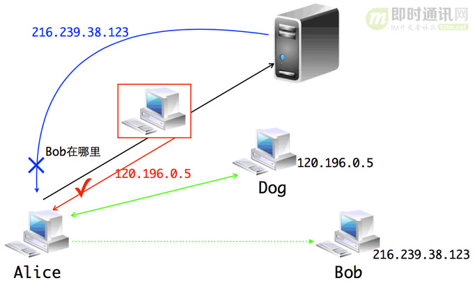


▲ DNS欺骗原理

实施 DNS 欺骗的关键在于伪造一个有特定序列号的应答包，并且让其抢先一步到达发起请求的主机。这对于个人来说还有点难度，但是对于拥有骨干网节点的组织来说，实在是易如反掌，所以这么多网站都已沦陷。不过使用网上流传的那些 hosts文件，就可以在本机缓存许多网站的ip地址，进而可以和部分网站通信。但是通过hosts文件并不能完全 Cross the Great FireWall，因为人家还有很多其他手段。