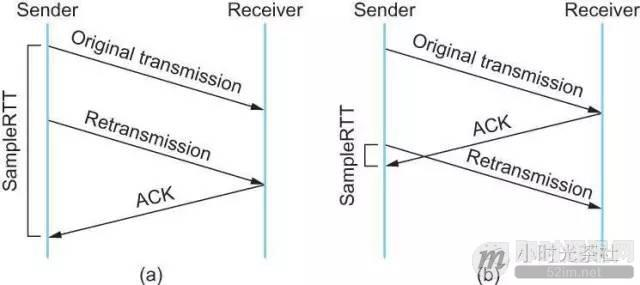
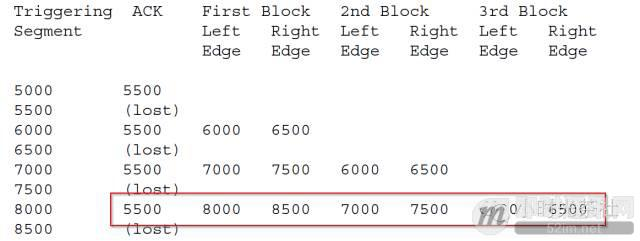
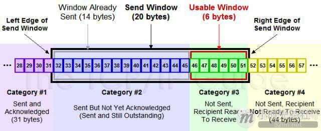
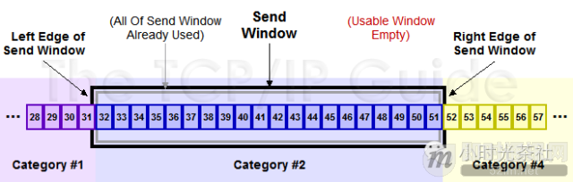
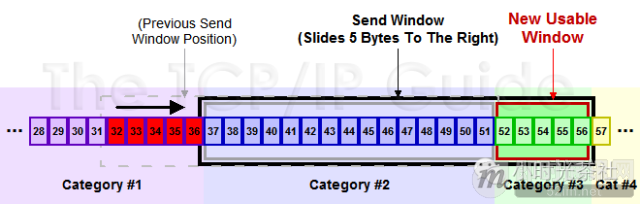
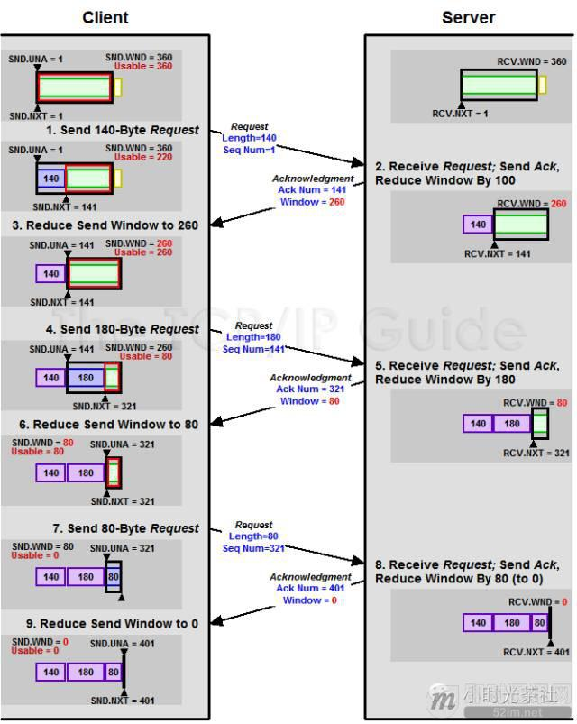
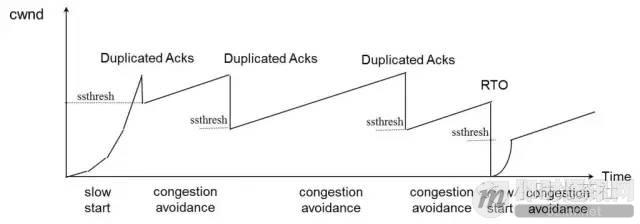
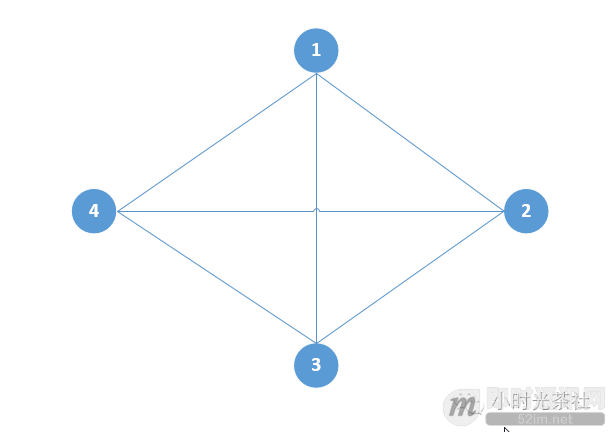

**不为人知的网络编程(二)：浅析TCP协议中的疑难杂症(下篇)**

## 1、前言

本文接上篇《[不为人知的网络编程(一)：浅析TCP协议中的疑难杂症(上篇)](http://www.52im.net/thread-1003-1-1.html)》，我们提到第6个疑问：TCP的头号疼症TIME_WAIT状态，下面我们继续这个问题的解答。

## 2、系列文章

**本文是系列文章中的第2篇，本系列文章的大纲如下：**

- 《[不为人知的网络编程(一)：浅析TCP协议中的疑难杂症(上篇)](http://www.52im.net/thread-1003-1-1.html)》
- 《[不为人知的网络编程(二)：浅析TCP协议中的疑难杂症(下篇)](http://www.52im.net/thread-1004-1-1.html)》（本文）
- 《[不为人知的网络编程(三)：关闭TCP连接时为什么会TIME_WAIT、CLOSE_WAIT](http://www.52im.net/thread-1007-1-1.html)》
- 《[不为人知的网络编程(四)：深入研究分析TCP的异常关闭](http://www.52im.net/thread-1014-1-1.html)》
- 《[不为人知的网络编程(五)：UDP的连接性和负载均衡](http://www.52im.net/thread-1018-1-1.html)》
- 《[不为人知的网络编程(六)：深入地理解UDP协议并用好它](http://www.52im.net/thread-1024-1-1.html)》
- 《[不为人知的网络编程(七)：如何让不可靠的UDP变的可靠？](http://www.52im.net/thread-1293-1-1.html)》
- 《[不为人知的网络编程(八)：从数据传输层深度解密HTTP](http://www.52im.net/thread-2456-1-1.html)》
- 《[不为人知的网络编程(九)：理论联系实际，全方位深入理解DNS](http://www.52im.net/thread-2740-1-1.html)》

**如果您觉得本系列文章过于专业，您可先阅读《网络编程懒人入门》系列文章，该系列目录如下：**

- 《[网络编程懒人入门(一)：快速理解网络通信协议（上篇）](http://www.52im.net/thread-1095-1-1.html)》
- 《[网络编程懒人入门(二)：快速理解网络通信协议（下篇）](http://www.52im.net/thread-1103-1-1.html)》
- 《[网络编程懒人入门(三)：快速理解TCP协议一篇就够](http://www.52im.net/thread-1107-1-1.html)》
- 《[网络编程懒人入门(四)：快速理解TCP和UDP的差异](http://www.52im.net/thread-1160-1-1.html)》
- 《[网络编程懒人入门(五)：快速理解为什么说UDP有时比TCP更有优势](http://www.52im.net/thread-1277-1-1.html)》

**本站的《脑残式网络编程入门》也适合入门学习，本系列大纲如下：**

- 《[脑残式网络编程入门(一)：跟着动画来学TCP三次握手和四次挥手](http://www.52im.net/thread-1729-1-1.html)》
- 《[脑残式网络编程入门(二)：我们在读写Socket时，究竟在读写什么？](http://www.52im.net/thread-1732-1-1.html)》
- 《[脑残式网络编程入门(三)：HTTP协议必知必会的一些知识](http://www.52im.net/thread-1751-1-1.html)》
- 《[脑残式网络编程入门(四)：快速理解HTTP/2的服务器推送(Server Push)](http://www.52im.net/thread-1795-1-1.html)》

**关于移动端网络特性及优化手段的总结性文章请见：**

- 《[现代移动端网络短连接的优化手段总结：请求速度、弱网适应、安全保障](http://www.52im.net/thread-1413-1-1.html)》
- 《[移动端IM开发者必读(一)：通俗易懂，理解移动网络的“弱”和“慢”](http://www.52im.net/thread-1587-1-1.html)》
- 《[移动端IM开发者必读(二)：史上最全移动弱网络优化方法总结](http://www.52im.net/thread-1588-1-1.html)》

## 3、参考资料

《[TCP/IP详解](http://www.52im.net/topic-tcpipvol1.html) - [第11章·UDP：用户数据报协议](http://docs.52im.net/extend/docs/book/tcpip/vol1/11/)》
《[TCP/IP详解](http://www.52im.net/topic-tcpipvol1.html) - [第17章·TCP：传输控制协议](http://docs.52im.net/extend/docs/book/tcpip/vol1/17/)》
《[TCP/IP详解](http://www.52im.net/topic-tcpipvol1.html) - [第18章·TCP连接的建立与终止](http://docs.52im.net/extend/docs/book/tcpip/vol1/18/)》
《[TCP/IP详解](http://www.52im.net/topic-tcpipvol1.html) - [第21章·TCP的超时与重传](http://docs.52im.net/extend/docs/book/tcpip/vol1/21/)》
《[通俗易懂-深入理解TCP协议（上）：理论基础](http://www.52im.net/thread-513-1-1.html)》
《[通俗易懂-深入理解TCP协议（下）：RTT、滑动窗口、拥塞处理](http://www.52im.net/thread-515-1-1.html)》
《[理论经典：TCP协议的3次握手与4次挥手过程详解](http://www.52im.net/thread-258-1-1.html)》
《[理论联系实际：Wireshark抓包分析TCP 3次握手、4次挥手过程](http://www.52im.net/thread-275-1-1.html)》

## 4、TIME_WAIT的快速回收和重用

### 1TIME_WAIT快速回收

linux下开启TIME_WAIT快速回收需要同时打开tcp_tw_recycle和tcp_timestamps(默认打开)两选项。Linux下快速回收的时间为3.5 * RTO（Retransmission Timeout），而一个RTO时间为200ms至120s。开启快速回收TIME_WAIT，可能会带来(问题一、)中说的三点危险。

**为了避免这些危险，要求同时满足以下三种情况的新连接要被拒绝掉：**

- 1）来自同一个对端Peer的TCP包携带了时间戳；
- 2）之前同一台peer机器(仅仅识别IP地址，因为连接被快速释放了，没了端口信息)的某个TCP数据在MSL秒之内到过本Server；
- 3）Peer机器新连接的时间戳小于peer机器上次TCP到来时的时间戳，且差值大于重放窗口戳(TCP_PAWS_WINDOW)。初看起来正常的数据包同时满足下面3条几乎不可能， 因为机器的时间戳不可能倒流的，出现上述的3点均满足时，一定是老的重复数据包又回来了，丢弃老的SYN包是正常的。到此，似乎启用快速回收就能很大程度缓解TIME_WAIT带来的问题。但是，这里忽略了一个东西就是NAT。。。在一个NAT后面的所有Peer机器在Server看来都是一个机器，NAT后面的那么多Peer机器的系统时间戳很可能不一致，有些快，有些慢。这样，在Server关闭了与系统时间戳快的Client的连接后，在这个连接进入快速回收的时候，同一NAT后面的系统时间戳慢的Client向Server发起连接，这就很有可能同时满足上面的三种情况，造成该连接被Server拒绝掉。所以，在是否开启tcp_tw_recycle需要慎重考虑了。

### 2TIME_WAIT重用

linux上比较完美的实现了TIME_WAIT重用问题。只要满足下面两点中的一点，一个TW状态的四元组(即一个socket连接)可以重新被新到来的SYN连接使用：

- 1）新连接SYN告知的初始序列号比TIME_WAIT老连接的末序列号大；
- 2）如果开启了tcp_timestamps，并且新到来的连接的时间戳比老连接的时间戳大。

要同时开启tcp_tw_reuse选项和tcp_timestamps 选项才可以开启TIME_WAIT重用，还有一个条件是：重用TIME_WAIT的条件是收到最后一个包后超过1s。细心的同学可能发现TIME_WAIT重用对Server端来说并没解决大量TIME_WAIT造成的资源消耗的问题，因为不管TIME_WAIT连接是否被重用，它依旧占用着系统资源。即便如此，TIME_WAIT重用还是有些用处的，它解决了整机范围拒绝接入的问题，虽然一般一个单独的Client是不可能在MSL内用同一个端口连接同一个服务的，但是如果Client做了bind端口那就是同个端口了。时间戳重用TIME_WAIT连接的机制的前提是IP地址唯一性，得出新请求发起自同一台机器，但是如果是NAT环境下就不能这样保证了，于是在NAT环境下，TIME_WAIT重用还是有风险的。

有些同学可能会混淆tcp_tw_reuse和SO_REUSEADDR 选项，认为是相关的一个东西，其实他们是两个完全不同的东西，可以说两个半毛钱关系都没。tcp_tw_reuse是内核选项，而SO_REUSEADDR用户态的选项，使用SO_REUSEADDR是告诉内核，如果端口忙，但TCP状态位于 TIME_WAIT ，可以重用端口。如果端口忙，而TCP状态位于其他状态，重用端口时依旧得到一个错误信息， 指明Address already in use”。如果你的服务程序停止后想立即重启，而新套接字依旧使用同一端口，此时 SO_REUSEADDR 选项非常有用。但是，使用这个选项就会有(问题二、)中说的三点危险，虽然发生的概率不大。

## 5、清掉TIME_WAIT的奇技怪巧

**可以用下面两种方式控制服务器的TIME_WAIT数量：**

- **修改tcp_max_tw_buckets：**
  tcp_max_tw_buckets 控制并发的TIME_WAIT的数量，默认值是180000。如果超过默认值，内核会把多的TIME_WAIT连接清掉，然后在日志里打一个警告。官网文档说这个选项只是为了阻止一些简单的DoS攻击，平常不要人为的降低它；
- **利用RST包从外部清掉TIME_WAIT链接：**
  根据TCP规范，收到任何的发送到未侦听端口、已经关闭的连接的数据包、连接处于任何非同步状态（LISTEN, SYS-SENT, SYN-RECEIVED）并且收到的包的ACK在窗口外，或者安全层不匹配，都要回执以RST响应(而收到滑动窗口外的序列号的数据包，都要丢弃这个数据包，并回复一个ACK包)，内核收到RST将会产生一个错误并终止该连接。我们可以利用RST包来终止掉处于TIME_WAIT状态的连接，其实这就是所谓的RST攻击了。为了描述方便：假设Client和Server有个连接Connect1，Server主动关闭连接并进入了TIME_WAIT状态，我们来描述一下怎么从外部使得Server的处于 TIME_WAIT状态的连接Connect1提前终止掉。要实现这个RST攻击，首先我们要知道Client在Connect1中的端口port1(一般这个端口是随机的，比较难猜到，这也是RST攻击较难的一个点)，利用IP_TRANSPARENT这个socket选项，它可以bind不属于本地的地址，因此可以从任意机器绑定Client地址以及端口port1，然后向Server发起一个连接，Server收到了窗口外的包于是响应一个ACK，这个ACK包会路由到Client处，这个时候99%的可能Client已经释放连接connect1了，这个时候Client收到这个ACK包，会发送一个RST包，server收到RST包然后就释放连接connect1提前终止TIME_WAIT状态了。提前终止TIME_WAIT状态是可能会带来(问题二、)中说的三点危害，具体的危害情况可以看下RFC1337。RFC1337中建议，不要用RST过早的结束TIME_WAIT状态。

**至此，上面的疑症都解析完毕，然而细心的同学会有下面的疑问：**

- 1）TCP的可靠传输是确认号来实现的，那么TCP的确认机制是怎样的呢？是收到一个包就马上确认，还是可以稍等一下在确认呢？
- 2）假如发送一个包，一直都没收到确认呢？什么时候重传呢？超时机制的怎样的？
- 3）TCP两端Peer的处理能力不对等的时候，比如发送方处理能力很强，接收方处理能力很弱，这样发送方是否能够不管接收方死活狂发数据呢？如果不能，流量控制机制的如何的？
- 4）TCP是端到端的协议，也就是TCP对端Peer只看到对方，看不到网络上的其他点，那么TCP的两端怎么对网络情况做出反映呢？发生拥塞的时候，拥塞控制机制是如何的？

## 6、疑症7：TCP的延迟确认机制

按照TCP协议，确认机制是累积的，也就是确认号X的确认指示的是所有X之前但不包括X的数据已经收到了。确认号(ACK)本身就是不含数据的分段，因此大量的确认号消耗了大量的带宽，虽然大多数情况下，ACK还是可以和数据一起捎带传输的，但是如果没有捎带传输，那么就只能单独回来一个ACK，如果这样的分段太多，网络的利用率就会下降。为缓解这个问题，RFC建议了一种延迟的ACK，也就是说，ACK在收到数据后并不马上回复，而是延迟一段可以接受的时间，延迟一段时间的目的是看能不能和接收方要发给发送方的数据一起回去，因为TCP协议头中总是包含确认号的，如果能的话，就将数据一起捎带回去，这样网络利用率就提高了。

延迟ACK就算没有数据捎带，那么如果收到了按序的两个包，那么只要对第二包做确认即可，这样也能省去一个ACK消耗。由于TCP协议不对ACK进行ACK的，RFC建议最多等待2个包的积累确认，这样能够及时通知对端Peer，我这边的接收情况。Linux实现中，有延迟ACK和快速ACK，并根据当前的包的收发情况来在这两种ACK中切换。一般情况下，ACK并不会对网络性能有太大的影响，延迟ACK能减少发送的分段从而节省了带宽，而快速ACK能及时通知发送方丢包，避免滑动窗口停等，提升吞吐率。

关于ACK分段，有个细节需要说明一下，ACK的确认号，是确认按序收到的最后一个字节序，对于乱序到来的TCP分段，接收端会回复相同的ACK分段，只确认按序到达的最后一个TCP分段。TCP连接的延迟确认时间一般初始化为最小值40ms，随后根据连接的重传超时时间（RTO）、上次收到数据包与本次接收数据包的时间间隔等参数进行不断调整。

## 7、疑症8：TCP的重传机制以及重传的超时计算

### 1TCP的重传超时计算

TCP交互过程中，如果发送的包一直没收到ACK确认，是要一直等下去吗？显然不能一直等(如果发送的包在路由过程中丢失了，对端都没收到又如何给你发送确认呢？)，这样协议将不可用，既然不能一直等下去，那么该等多久呢？等太长时间的话，数据包都丢了很久了才重发，没有效率，性能差；等太短时间的话，可能ACK还在路上快到了，这时候却重传了，造成浪费，同时过多的重传会造成网络拥塞，进一步加剧数据的丢失。也是，我们不能去猜测一个重传超时时间，应该是通过一个算法去计算，并且这个超时时间应该是随着网络的状况在变化的。为了使我们的重传机制更高效，如果我们能够比较准确知道在当前网络状况下，一个数据包从发出去到回来的时间RTT——Round Trip Time，那么根据这个RTT我们就可以方便设置TimeOut——RTO（Retransmission TimeOut）了。

**为了计算这个RTO，RFC793中定义了一个经典算法，算法如下：**

- 1）首先采样计算RTT值；
- 2）然后计算平滑的RTT，称为Smoothed Round Trip Time (SRTT)，SRTT = ( ALPHA SRTT ) + ((1-ALPHA) RTT)；
- 3）RTO = min[UBOUND,max[LBOUND,(BETA*SRTT)]]。

其中：UBOUND是RTO值的上限；例如：可以定义为1分钟，LBOUND是RTO值的下限，例如，可以定义为1秒；ALPHA is a smoothing factor (e.g., .8 to .9), and BETA is a delay variance factor (e.g., 1.3 to 2.0)。

然而这个算法有个缺点就是：在算RTT样本的时候，是用第一次发数据的时间和ack回来的时间做RTT样本值，还是用重传的时间和ACK回来的时间做RTT样本值？不管是怎么选择，总会造成会要么把RTT算过长了，要么把RTT算过短了。如下图：(a)就计算过长了，而(b)就是计算过短了。

针对上面经典算法的缺陷，于是提出Karn / Partridge Algorithm对经典算法进行了改进(算法大特点是——忽略重传，不把重传的RTT做采样)，但是这个算法有问题：如果在某一时间，网络闪动，突然变慢了，产生了比较大的延时，这个延时导致要重转所有的包（因为之前的RTO很小）。于是，因为重转的不算，所以，RTO就不会被更新，这是一个灾难。

于是，为解决上面两个算法的问题，又有人推出来了一个新的算法，这个算法叫Jacobson / Karels Algorithm（参看RFC6289），这个算法的核心是：除了考虑每两次测量值的偏差之外，其变化率也应该考虑在内，如果变化率过大，则通过以变化率为自变量的函数为主计算RTT(如果陡然增大，则取值为比较大的正数，如果陡然减小，则取值为比较小的负数，然后和平均值加权求和)，反之如果变化率很小，则取测量平均值。

**公式如下：（其中的DevRTT是Deviation RTT的意思）**

SRTT = SRTT + α (RTT – SRTT) —— 计算平滑RTT；
DevRTT = (1-β)DevRTT + β(|RTT-SRTT|) ——计算平滑RTT和真实的差距（加权移动平均）；
RTO= μ SRTT + ∂ DevRTT —— 神一样的公式。

（其中：在Linux下，α = 0.125，β = 0.25， μ = 1，∂ = 4 ——这就是算法中的“调得一手好参数”，nobody knows why, it just works…）

最后的这个算法在被用在今天的TCP协议中并工作非常好。

知道超时怎么计算后，很自然就想到定时器的设计问题。一个简单直观的方案就是为TCP中的每一个数据包维护一个定时器，在这个定时器到期前没收到确认，则进行重传。这种设计理论上是很合理的，但是实现上，这种方案将会有非常多的定时器，会带来巨大内存开销和调度开销。既然不能每个包一个定时器，那么多少个包一个定时器才好呢，这个似乎比较难确定。可以换个思路，不要以包量来确定定时器，以连接来确定定时器会不会比较合理呢？

**目前，采取每一个TCP连接单一超时定时器的设计则成了一个默认的选择，并且RFC2988给出了每连接单一定时器的设计建议算法规则：**

- 1）每一次一个包含数据的包被发送（包括重发），如果还没开启重传定时器，则开启它，使得它在RTO秒之后超时（按照当前的RTO值）；
- 2）当接收到一个ACK确认一个新的数据, 如果所有的发出数据都被确认了，关闭重传定时器；
- 3）当接收到一个ACK确认一个新的数据，还有数据在传输，也就是还有没被确认的数据，重新启动重传定时器，使得它在RTO秒之后超时（按照当前的RTO值）；
- 4）当重传定时器超时后，依次做下列3件事情：
    \- 4.1）重传最早的尚未被TCP接收方ACK的数据包
    \- 4.2）重新设置RTO 为 RTO * 2（“还原定时器”），但是新RTO不应该超过RTO的上限(RTO有个上限值，这个上限值最少为60s)
    \- 4.3）重启重传定时器。

上面的建议算法体现了一个原则：没被确认的包必须可以超时，并且超时的时间不能太长，同时也不要过早重传。规则[1][3][4.3]共同说明了只要还有数据包没被确认，那么定时器一定会是开启着的(这样满足 没被确认的包必须可以超时的原则)。规则[4.2]说明定时器的超时值是有上限的(满足 超时的时间不能太长 )。规则[3]说明，在一个ACK到来后重置定时器可以保护后发的数据不被过早重传；因为一个ACK到来了，说明后续的ACK很可能会依次到来，也就是说丢失的可能性并不大。规则[4.2]也是在一定程度上避免过早重传，因为，在出现定时器超时后，有可能是网络出现拥塞了，这个时候应该延长定时器，避免出现大量的重传进一步加剧网络的拥塞。

### 2TCP的重传机制

通过上面我们可以知道，TCP的重传是由超时触发的，这会引发一个重传选择问题，假设TCP发送端连续发了1、2、3、4、5、6、7、8、9、10共10包，其中4、6、8这3个包全丢失了，由于TCP的ACK是确认最后连续收到序号。

**这样发送端只能收到3号包的ACK，这样在TIME_OUT的时候，发送端就面临下面两个重传选择：**

- 1）仅重传4号包；
- 2）重传3号后面所有的包，也就是重传4~10号包。

**对于，上面两个选择的优缺点都比较明显：**

- **方案[1]-优点：**按需重传，能够最大程度节省带宽。缺点：重传会比较慢，因为重传4号包后，需要等下一个超时才会重传6号包;
- **方案[2]-优点：**重传较快，数据能够较快交付给接收端。缺点：重传了很多不必要重传的包，浪费带宽，在出现丢包的时候，一般是网络拥塞，大量的重传又可能进一步加剧拥塞。

上面的问题是由于单纯以时间驱动来进行重传的，都必须等待一个超时时间，不能快速对当前网络状况做出响应，如果加入以数据驱动呢？TCP引入了一种叫Fast Retransmit(快速重传 )的算法，就是在连续收到3次相同确认号的ACK，那么就进行重传。这个算法基于这么一个假设，连续收到3个相同的ACK，那么说明当前的网络状况变好了，可以重传丢失的包了。

快速重传解决了timeout的问题，但是没解决重传一个还是重传多个的问题。出现难以决定是否重传多个包问题的根源在于，发送端不知道那些非连续序号的包已经到达接收端了，但是接收端是知道的，如果接收端告诉一下发送端不就可以解决这个问题吗？

**于是，RFC2018提出了Selective Acknowledgment (SACK，选择确认)机制，SACK是TCP的扩展选项，包括：**

- 1）SACK允许选项（Kind=4,Length=2，选项只允许在有SYN标志的TCP包中）；
- 2）SACK信息选项（Kind=5,Length）。

一个SACK的例子如下图，红框说明：接收端收到了0-5500，8000-8500，7000-7500，6000-6500的数据了，这样发送端就可以选择重传丢失的5500-6000，6500-7000，7500-8000的包：

SACK依靠接收端的接收情况反馈，解决了重传风暴问题，这样够了吗？接收端能不能反馈更多的信息呢？显然是可以的，于是，RFC2883对对SACK进行了扩展，提出了D-SACK，也就是利用第一块SACK数据中描述重复接收的不连续数据块的序列号参数，其他SACK数据则描述其他正常接收到的不连续数据。这样发送方利用第一块SACK，可以发现数据段被网络复制、错误重传、ACK丢失引起的重传、重传超时等异常的网络状况，使得发送端能更好调整自己的重传策略。

**D-SACK，有几个优点：**

- 1）发送端可以判断出，是发包丢失了，还是接收端的ACK丢失了。(发送方，重传了一个包，发现并没有D-SACK那个包，那么就是发送的数据包丢了；否则就是接收端的ACK丢了，或者是发送的包延迟到达了)；
- 2）发送端可以判断自己的RTO是不是有点小了，导致过早重传(如果收到比较多的D-SACK就该怀疑是RTO小了)；
- 3）发送端可以判断自己的数据包是不是被复制了。(如果明明没有重传该数据包，但是收到该数据包的D-SACK)；
- 4）发送端可以判断目前网络上是不是出现了有些包被delay了，也就是出现先发的包却后到了。

## 8、疑症9：TCP的流量控制

我们知道TCP的窗口(window)是一个16bit位字段，它代表的是窗口的字节容量，也就是TCP的标准窗口最大为2^16-1=65535个字节。另外在TCP的选项字段中还包含了一个TCP窗口扩大因子，option-kind为3，option-length为3个字节，option-data取值范围0-14。窗口扩大因子用来扩大TCP窗口，可把原来16bit的窗口，扩大为31bit。这个窗口是接收端告诉发送端自己还有多少缓冲区可以接收数据。于是发送端就可以根据这个接收端的处理能力来发送数据，而不会导致接收端处理不过来。也就是，发送端是根据接收端通知的窗口大小来调整自己的发送速率的，以达到端到端的流量控制。尽管流量控制看起来简单明了，就是发送端根据接收端的限制来控制自己的发送就好了。

**但是细心的同学还是会有些疑问的：**

- 1）发送端是怎么做到比较方便知道自己哪些包可以发，哪些包不能发呢？
- 2）如果接收端通知一个零窗口给发送端，这个时候发送端还能不能发送数据呢？如果不发数据，那一直等接收端口通知一个非0窗口吗，如果接收端一直不通知呢？
- 3）如果接收端处理能力很慢，这样接收端的窗口很快被填满，然后接收处理完几个字节，腾出几个字节的窗口后，通知发送端，这个时候发送端马上就发送几个字节给接收端吗？发送的话会不会太浪费了，就像一艘万吨油轮只装上几斤的油就开去目的地一样。对于发送端产生数据的能力很弱也一样，如果发送端慢吞吞产生几个字节的数据要发送，这个时候该不该立即发送呢？还是累积多点在发送？

### 1疑问1）的解决

发送方要知道那些可以发，哪些不可以发，一个简明的方案就是按照接收方的窗口通告，发送方维护一个一样大小的发送窗口就可以了，在窗口内的可以发，窗口外的不可以发，窗口在发送序列上不断后移，这就是TCP中的滑动窗口。

**如下图所示，对于TCP发送端其发送缓存内的数据都可以分为4类：**

- [1]-已经发送并得到接收端ACK的;
- [2]-已经发送但还未收到接收端ACK的;
- [3]-未发送但允许发送的(接收方还有空间);
- [4]-未发送且不允许发送(接收方没空间了)。

其中，[2]和[3]两部分合起来称之为发送窗口。

**下面两图演示的窗口的滑动情况，收到36的ACK后，窗口向后滑动5个byte：**

### 2疑问2）的解决

由问题1）我们知道，发送端的发送窗口是由接收端控制的。下图，展示了一个发送端是怎么受接收端控制的：

由上图我们知道，当接收端通知一个zero窗口的时候，发送端的发送窗口也变成了0，也就是发送端不能发数了。如果发送端一直等待，直到接收端通知一个非零窗口在发数据的话，这似乎太受限于接收端，如果接收端一直不通知新的窗口呢？显然发送端不能干等，起码有一个主动探测的机制。为解决0窗口的问题，TCP使用了Zero Window Probe技术，缩写为ZWP。发送端在窗口变成0后，会发ZWP的包给接收方，来探测目前接收端的窗口大小，一般这个值会设置成3次，每次大约30-60秒（不同的实现可能会不一样）。

如果3次过后还是0的话，有的TCP实现就会发RST掉这个连接。正如有人的地方就会有商机，那么有等待的地方就很有可能出现DDoS攻击点。攻击者可以在和Server建立好连接后，就向Server通告一个0窗口，然后Server端就只能等待进行ZWP，于是攻击者会并发大量的这样的请求，把Server端的资源耗尽。

### 3疑问点3）的解决

疑点3）本质就是一个避免发送大量小包的问题。造成这个问题原因有二：1)接收端一直在通知一个小的窗口; 2)发送端本身问题，一直在发送小包。这个问题，TCP中有个术语叫Silly Window Syndrome(糊涂窗口综合症)。解决这个问题的思路有两，1)接收端不通知小窗口，2)发送端积累一下数据在发送。

思路1)是在接收端解决这个问题，David D Clark’s 方案，如果收到的数据导致window size小于某个值，就ACK一个0窗口，这就阻止发送端在发数据过来。等到接收端处理了一些数据后windows size 大于等于了MSS，或者buffer有一半为空，就可以通告一个非0窗口。思路2)是在发送端解决这个问题，有个著名的Nagle’s algorithm。

**Nagle 算法的规则：**

- [1]如果包长度达到 MSS ，则允许发送；
- [2]如果该包含有 FIN ，则允许发送；
- [3]设置了 TCP_NODELAY 选项，则允许发送；
- [4]设置 TCP_CORK 选项时，若所有发出去的小数据包（包长度小于 MSS ）均被确认，则允许发送；
- [5]上述条件都未满足，但发生了超时（一般为 200ms ），则立即发送。

规则[4]指出TCP连接上最多只能有一个未被确认的小数据包。从规则[4]可以看出Nagle算法并不禁止发送小的数据包(超时时间内)，而是避免发送大量小的数据包。由于Nagle算法是依赖ACK的，如果ACK很快的话，也会出现一直发小包的情况，造成网络利用率低。TCP_CORK选项则是禁止发送小的数据包(超时时间内)，设置该选项后，TCP会尽力把小数据包拼接成一个大的数据包（一个 MTU）再发送出去，当然也不会一直等，发生了超时（一般为 200ms ），也立即发送。Nagle 算法和CP_CORK 选项提高了网络的利用率，但是增加是延时。从规则[3]可以看出，设置TCP_NODELAY 选项，就是完全禁用Nagle 算法了。

这里要说一个小插曲，Nagle算法和延迟确认(Delayed Acknoledgement)一起，当出现( write-write-read)的时候会引发一个40ms的延时问题，这个问题在HTTP svr中体现的比较明显。

**场景如下：**

- 客户端在请求下载HTTP svr中的一个小文件，一般情况下，HTTP svr都是先发送HTTP响应头部，然后在发送HTTP响应BODY(特别是比较多的实现在发送文件的实施采用的是sendfile系统调用，这就出现write-write-read模式了)。当发送头部的时候，由于头部较小，于是形成一个小的TCP包发送到客户端，这个时候开始发送body，由于body也较小，这样还是形成一个小的TCP数据包，根据Nagle算法，HTTP svr已经发送一个小的数据包了，在收到第一个小包的ACK后或等待200ms超时后才能在发小包，HTTP svr不能发送这个body小TCP包；
- 客户端收到http响应头后，由于这是一个小的TCP包，于是客户端开启延迟确认，客户端在等待Svr的第二个包来在一起确认或等待一个超时(一般是40ms)在发送ACK包；这样就出现了你等我、然而我也在等你的死锁状态，于是出现最多的情况是客户端等待一个40ms的超时，然后发送ACK给HTTP svr，HTTP svr收到ACK包后在发送body部分。大家在测HTTP svr的时候就要留意这个问题了。

## 9、疑症10：TCP的拥塞控制

谈到拥塞控制，就要先谈谈拥塞的因素和本质。本质上，网络上拥塞的原因就是大家都想独享整个网络资源，对于TCP，端到端的流量控制必然会导致网络拥堵。这是因为TCP只看到对端的接收空间的大小，而无法知道链路上的容量，只要双方的处理能力很强，那么就可以以很大的速率发包，于是链路很快出现拥堵，进而引起大量的丢包，丢包又引发发送端的重传风暴，进一步加剧链路的拥塞。另外一个拥塞的因素是链路上的转发节点，例如路由器，再好的路由器只要接入网络，总是会拉低网络的总带宽，如果在路由器节点上出现处理瓶颈，那么就很容易出现拥塞。由于TCP看不到网络的状况，那么拥塞控制是必须的并且需要采用试探性的方式来控制拥塞，于是拥塞控制要完成两个任务：[1]公平性；[2]拥塞过后的恢复。

TCP发展到现在，拥塞控制方面的算法很多，其中Reno是目前应用最广泛且较为成熟的算法，下面着重介绍一下Reno算法(RFC5681)。介绍该算法前，首先介绍一个概念duplicate acknowledgment(冗余ACK、重复ACK)。

**一般情况下一个ACK被称为冗余ACK，要同时满足下面几个条件(对于SACK，那么根据SACK的一些信息来进一步判断)：**

- [1] 接收ACK的那端已经发出了一些还没被ACK的数据包
- [2] 该ACK没有捎带data
- [3] 该ACK的SYN和FIN位都是off的，也就是既不是SYN包的ACK也不是FIN包的ACK。
- [4] 该ACK的确认号等于接收ACK那端已经收到的ACK的最大确认号
- [5] 该ACK通知的窗口等接收该ACK的那端上一个收到的ACK的窗口。

**Reno算法包含4个部分：**

- [1]慢热启动算法 – Slow Start;
- [2]拥塞避免算法 – Congestion Avoidance;
- [3]快速重传 - Fast Retransimit;
- [4]快速恢复算法 – Fast Recovery。

TCP的拥塞控制主要原理依赖于一个拥塞窗口(cwnd)来控制，根据前面的讨论，我们知道有一个接收端通告的接收窗口(rwnd)用于流量控制；加上拥塞控制后，发送端真正的发送窗口=min(rwnd, cwnd)。关于cwnd的单位，在TCP中是以字节来做单位的，我们假设TCP每次传输都是按照MSS大小来发送数据，因此你可以认为cwnd按照数据包个数来做单位也可以理解，下面如果没有特别说明是字节，那么cwnd增加1也就是相当于字节数增加1个MSS大小。

### 1慢热启动算法 – Slow Start

慢启动体现了一个试探的过程，刚接入网络的时候先发包慢点，探测一下网络情况，然后在慢慢提速。不要一上来就拼命发包，这样很容易造成链路的拥堵，出现拥堵了在想到要降速来缓解拥堵这就有点成本高了，毕竟无数的先例告诫我们先污染后治理的成本是很高的。

**慢启动的算法如下(cwnd全称Congestion Window)：**

- 1）连接建好的开始先初始化cwnd = N，表明可以传N个MSS大小的数据。
- 2）每当收到一个ACK，++cwnd; 呈线性上升
- 3）每当过了一个RTT，cwnd = cwnd*2; 呈指数让升
- 4）还有一个慢启动门限ssthresh（slow start threshold），是一个上限，当cwnd >= ssthresh时，就会进入"拥塞避免算法 - Congestion Avoidance"。

根据RFC5681，如果MSS > 2190 bytes，则N = 2;如果MSS < 1095 bytes，则N = 4;如果2190 bytes >= MSS >= 1095 bytes，则N = 3;一篇Google的论文《An Argument for Increasing TCP’s Initial Congestion Window》建议把cwnd 初始化成了 10个MSS。Linux 3.0后采用了这篇论文的建议。

### 2拥塞避免算法 – Congestion Avoidance

慢启动的时候说过，cwnd是指数快速增长的，但是增长是有个门限ssthresh(一般来说大多数的实现ssthresh的值是65535字节)的，到达门限后进入拥塞避免阶段。

**在进入拥塞避免阶段后，cwnd值变化算法如下：**

- 1）每收到一个ACK，调整cwnd 为 (cwnd + 1/cwnd) * MSS个字节；
- 2）每经过一个RTT的时长，cwnd增加1个MSS大小。

TCP是看不到网络的整体状况的，那么TCP认为网络拥塞的主要依据是它重传了报文段。

**前面我们说过TCP的重传分两种情况：**

- 1）出现RTO超时，重传数据包。这种情况下，TCP就认为出现拥塞的可能性就很大，于是它反应非常'强烈'：
    \- [1] 调整门限ssthresh的值为当前cwnd值的1/2；
    \- [2] reset自己的cwnd值为1；
    \- [3] 然后重新进入慢启动过程。
- 2）在RTO超时前，收到3个duplicate ACK进行重传数据包。这种情况下，收到3个冗余ACK后说明确实有中间的分段丢失，然而后面的分段确实到达了接收端，因为这样才会发送冗余ACK，这一般是路由器故障或者轻度拥塞或者其它不太严重的原因引起的，因此此时拥塞窗口缩小的幅度就不能太大，此时进入快速重传。

### 3快速重传 - Fast Retransimit

**快速重传做的事情有：**

- 1） 调整门限ssthresh的值为当前cwnd值的1/2；
- 2） 将cwnd值设置为新的ssthresh的值；
- 3） 重新进入拥塞避免阶段。

在快速重传的时候，一般网络只是轻微拥堵，在进入拥塞避免后，cwnd恢复的比较慢。针对这个，“快速恢复”算法被添加进来，当收到3个冗余ACK时，TCP最后的[3]步骤进入的不是拥塞避免阶段，而是快速恢复阶段。

### 4快速恢复算法 – Fast Recovery

快速恢复的思想是“数据包守恒”原则，即带宽不变的情况下，在网络同一时刻能容纳数据包数量是恒定的。当“老”数据包离开了网络后，就能向网络中发送一个“新”的数据包。既然已经收到了3个冗余ACK，说明有三个数据分段已经到达了接收端，既然三个分段已经离开了网络，那么就是说可以在发送3个分段了。于是只要发送方收到一个冗余的ACK，于是cwnd加1个MSS。

**快速恢复步骤如下(在进入快速恢复前，cwnd 和 sshthresh已被更新为：sshthresh = cwnd /2，cwnd = sshthresh)：**

- 1）把cwnd设置为ssthresh的值加3，重传Duplicated ACKs指定的数据包
- 2）如果再收到 duplicated Acks，那么cwnd = cwnd +1
- 3）如果收到新的ACK，而非duplicated Ack，那么将cwnd重新设置为【3】中1）的sshthresh的值。然后进入拥塞避免状态。

细心的同学可能会发现快速恢复有个比较明显的缺陷就是：它依赖于3个冗余ACK，并假定很多情况下，3个冗余的ACK只代表丢失一个包。但是3个冗余ACK也很有可能是丢失了很多个包，快速恢复只是重传了一个包，然后其他丢失的包就只能等待到RTO超时了。超时会导致ssthresh减半，并且退出了Fast Recovery阶段，多个超时会导致TCP传输速率呈级数下降。出现这个问题的主要原因是过早退出了Fast Recovery阶段。为解决这个问题，提出了New Reno算法，该算法是在没有SACK的支持下改进Fast Recovery算法(SACK改变TCP的确认机制，把乱序等信息会全部告诉对方，SACK本身携带的信息就可以使得发送方有足够的信息来知道需要重传哪些包，而不需要重传哪些包)。

**具体改进如下：**

- 1）发送端收到3个冗余ACK后，重传冗余ACK指示可能丢失的那个包segment1，如果segment1的ACK通告接收端已经收到发送端的全部已经发出的数据的话，那么就是只丢失一个包，如果没有，那么就是有多个包丢失了；
- 2）发送端根据segment1的ACK判断出有多个包丢失，那么发送端继续重传窗口内未被ACK的第一个包，直到sliding window内发出去的包全被ACK了，才真正退出Fast Recovery阶段。

我们可以看到，拥塞控制在拥塞避免阶段，cwnd是加性增加的，在判断出现拥塞的时候采取的是指数递减。为什么要这样做呢？这是出于公平性的原则，拥塞窗口的增加受惠的只是自己，而拥塞窗口减少受益的是大家。这种指数递减的方式实现了公平性，一旦出现丢包，那么立即减半退避，可以给其他新建的连接腾出足够的带宽空间，从而保证整个的公平性。

至此，TCP的疑难杂症基本介绍完毕了，总的来说TCP是一个有连接的、可靠的、带流量控制和拥塞控制的端到端的协议。TCP的发送端能发多少数据，由发送端的发送窗口决定(当然发送窗口又被接收端的接收窗口、发送端的拥塞窗口限制)的，那么一个TCP连接的传输稳定状态应该体现在发送端的发送窗口的稳定状态上，这样的话，TCP的发送窗口有哪些稳定状态呢？

**TCP的发送窗口稳定状态主要有上面三种稳定状态：**

- 【1】接收端拥有大窗口的经典锯齿状：
  大多数情况下都是处于这样的稳定状态，这是因为，一般情况下机器的处理速度就是比较快，这样TCP的接收端都是拥有较大的窗口，这时发送端的发送窗口就完全由其拥塞窗口cwnd决定了；网络上拥有成千上万的TCP连接，它们在相互争用网络带宽，TCP的流量控制使得它想要独享整个网络，而拥塞控制又限制其必要时做出牺牲来体现公平性。于是在传输稳定的时候TCP发送端呈现出下面过程的反复：
  \- [1]用慢启动或者拥塞避免方式不断增加其拥塞窗口，直到丢包的发生；
  \- [2]然后将发送窗口将下降到1或者下降一半，进入慢启动或者拥塞避免阶段(要看是由于超时丢包还是由于冗余ACK丢包)；
  过程如下图：
  
- 【2】接收端拥有小窗口的直线状态：这种情况下是接收端非常慢速，接收窗口一直很小，这样发送窗口就完全有接收窗口决定了。由于发送窗口小，发送数据少，网络就不会出现拥塞了，于是发送窗口就一直稳定的等于那个较小的接收窗口，呈直线状态。
- 【3】两个直连网络端点间的满载状态下的直线状态：这种情况下，Peer两端直连，并且只有位于一个TCP连接，那么这个连接将独享网络带宽，这里不存在拥塞问题，在他们处理能力足够的情况下，TCP的流量控制使得他们能够跑慢整个网络带宽。

通过上面我们知道，在TCP传输稳定的时候，各个TCP连接会均分网络带宽的。相信大家学生时代经常会发生这样的场景，自己在看视频的时候突然出现视频卡顿，于是就大叫起来，哪个开了迅雷，赶紧给我停了。其实简单的下载加速就是开启多个TCP连接来分段下载就达到加速的效果，假设宿舍的带宽是1000K/s，一开始两个在看视频，每人平均网速是500k/s，这速度看起视频来那叫一个顺溜。突然其中一个同学打打开迅雷开着99个TCP连接在下载爱情动作片，这个时候平均下来你能分到的带宽就剩下10k/s，这网速下你的视频还不卡成幻灯片。在通信链路带宽固定(假设为W)，多人公用一个网络带宽的情况下，利用TCP协议的拥塞控制的公平性，多开几个TCP连接就能多分到一些带宽(当然要忽略有些用UDP协议带来的影响)，然而不管怎么最多也就能把整个带宽抢到，于是在占满整个带宽的情况下，下载一个大小为FS的文件，那么最快需要的时间是FS/W，难道就没办法加速了吗？

答案是有的，这样因为网络是网状的，一个节点是要和很多几点互联的，这就存在多个带宽为W的通信链路，如果我们能够将要下载的文件，一半从A通信链路下载，另外一半从B通信链路下载，这样整个下载时间就减半了为FS/(2W)，这就是p2p加速。相信大家学生时代在下载爱情动作片的时候也遇到过这种情况，明明外网速度没这么快的，自己下载的爱情动作片的速度却达到几M/s，那是因为，你的左后或右后的宿友在帮你加速中。我们都知道P2P模式下载会快，并且越多人下载就越快，那么问题来了，P2P下载加速理论上的加速比是多少呢？

## 10、附加题1：P2P理论上的加速比

传统的C/S模式传输文件，在跑满Client带宽的情况下传输一个文件需要耗时FS/BW，如果有n个客户端需要下载文件，那么总耗时是n(FS/BW)，当然啦，这并不一定是串行传输，可以并行来传输的，这样总耗时也就是FS/BW了，但是这需要服务器的带宽是n个client带宽的总和nBW。C/S模式一个明显的缺点是服务要传输一个文件n次，这样对服务器的性能和带宽带来比较大的压力，我可以换下思路，服务器将文件传给其中一个Client后，让这些互联的Client自己来交互那个文件，那服务器的压力就减少很多了。这就是P2P网络的好处，P2P利用各个节点间的互联，提倡“人人为我，我为人人”。

知道P2P传输的好处后，我们来谈下理论上的最大加速比，为了简化讨论，一个简单的网络拓扑图如下，有4个相互互联的节点，并且每个节点间的网络带宽是BW，传输一个大小为FS的文件最快的时间是多少呢？假设节点N1有个大小为FS的文件需要传输给N2，N3，N4节点，一种简单的方式就是：节点N1同时将文件传输给节点N2，N3，N4耗时FS/BW，这样大家都拥有文件FS了。大家可以看出，整个过程只有节点1在发送文件，其他节点都是在接收，完全违反了P2P的“人人为我，我为人人”的宗旨。那怎么才能让大家都做出贡献了呢？

**解决方案是切割文件：**

- [1]首先：节点N1 文件分成3个片段FS2,FS3,FS4 ，接着将FS2发送给N2，FS3发送给N3，FS4发送给N4，耗时FS/(3BW)；
- [2]然后：N2,N3,N4执行“人人为我，我为人人”的精神，将自己拥有的F2,F3,F4分别发给没有的其他的节点，这样耗时FS/(3BW)完成交换。

于是总耗时为2FS/(3BW)完成了文件FS的传输，可以看出耗时减少为原来的2/3了，如果有n个节点，那么时间就是原来的2/(n-1)，也就是加速比是2/(n-1)，这就是加速的理论上限了吗？还没发挥最多能量的，相信大家已经看到分割文件的好处了，上面的文件分割粒度还是有点大，以至于，在第二阶段[2]传输过程中，节点N1无所事事。为了最大化发挥大家的作用，我们需要将FS2,FS3,FS4在进行分割，假设将它们都均分为K等份，这样就有FS21,FS22…FS2K、FS31,FS32…FS3K、FS41,FS42…FS4K，一共3K个分段。

**于是下面就开始进行加速分发：**

- [1]节点N1将分段FS21，FS31，FS41分别发送给N2，N3，N4节点。耗时，FS/(3KBW)
- [2]节点N1将分段FS22，FS32，FS42分别发送给N2，N3，N4节点，同时节点N2，N3，N4将阶段[1]收到的分段相互发给没有的节点。耗时，FS/(3KBW)
- 。。。。。。
- [K]节点N1将分段FS2K，FS3K，FS4K分别发送给N2，N3，N4节点，同时节点N2，N3，N4将阶段[K-1]收到的分段相互发给没有的节点。耗时，FS/(3KBW)
- [K+1]节点N2，N3，N4将阶段[K]收到的分段相互发给没有的节点。耗时，FS/(3KBW)。

于是总的耗时为(K+1) (FS/(3KBW)) = FS/(3BW) + FS/(3KBW)，当K趋于无穷大的时候，文件进行无限细分的时候，耗时变成了FS/(3*BW)，也就是当节点是n+1的时候，加速比是n。这就是理论上的最大加速比了，最大加速比是P2P网络节点个数减1。

## 11、附加题2：系统调用listen() 的backlog参数指的是什么

**要说明backlog参数的含义，首先需要说一下Linux的协议栈维护的TCP连接的两个连接队列：**

- [1]SYN半连接队列；
- [2]accept连接队列。

**[1] SYN半连接队列：**
Server端收到Client的SYN包并回复SYN,ACK包后，该连接的信息就会被移到一个队列，这个队列就是SYN半连接队列(此时TCP连接处于 非同步状态 )。

**[2] accept连接队列：**
Server端收到SYN,ACK包的ACK包后，就会将连接信息从[1]中的队列移到另外一个队列，这个队列就是accept连接队列(这个时候TCP连接已经建立，三次握手完成了)。

用户进程调用accept()系统调用后，该连接信息就会从[2]中的队列中移走。

相信不少同学就backlog的具体含义进行争论过，有些认为backlog指的是[1]和[2]两个队列的和。而有些则认为是backlog指的是[2]的大小。其实，这两个说法都对，在linux kernel 2.2之前backlog指的是[1]和[2]两个队列的和。而2.2以后，就指的是[2]的大小，那么在kernel 2.2以后，[1]的大小怎么确定的呢？两个队列的作用分别是什么呢？

**SYN半连接队列的作用：**
对于SYN半连接队列的大小是由（/proc/sys/net/ipv4/tcp_max_syn_backlog）这个内核参数控制的，有些内核似乎也受listen的backlog参数影响，取得是两个值的最小值。当这个队列满了，Server会丢弃新来的SYN包，而Client端在多次重发SYN包得不到响应而返回（connection time out）错误。但是，当Server端开启了syncookies，那么SYN半连接队列就没有逻辑上的最大值了，并且/proc/sys/net/ipv4/tcp_max_syn_backlog设置的值也会被忽略。

**accept连接队列：**
accept连接队列的大小是由backlog参数和（/proc/sys/net/core/somaxconn）内核参数共同决定，取值为两个中的最小值。当accept连接队列满了，协议栈的行为根据（/proc/sys/net/ipv4/tcp_abort_on_overflow）内核参数而定。 如果tcp_abort_on_overflow=1，server在收到SYN_ACK的ACK包后，协议栈会丢弃该连接并回复RST包给对端，这个是Client会出现(connection reset by peer)错误。如果tcp_abort_on_overflow=0，server在收到SYN_ACK的ACK包后，直接丢弃该ACK包。这个时候Client认为连接已经建立了，一直在等Server的数据，直到超时出现read timeout错误。