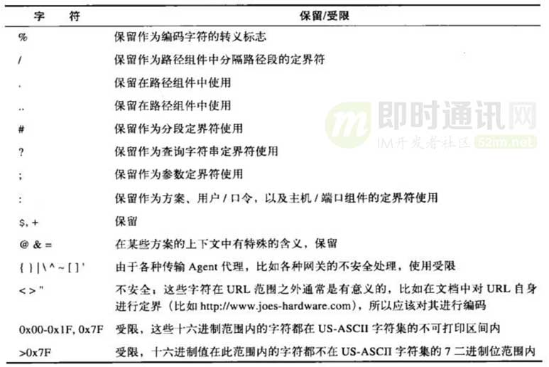

**不为人知的网络编程(八)：从数据传输层深度解密HTTP**

## 1、引言


在文章《[理论联系实际：Wireshark抓包分析TCP 3次握手、4次挥手过程](http://www.52im.net/thread-275-1-1.html)》中，我们学会了用wireshark来分析TCP的“三次握手，四次挥手”，非常好用。这就是传说中的锤子，拿着 锤子，看什么都像 钉子！在这本文中，我对将准 HTTP这颗钉子，狠狠地砸下去。。。

为了对网络数据包的“流转”有更加深刻的理解，我在docker（远程）上部署一个服务，支持http方式调用。从客户端（本地）用http方式请求其中的一个接口，并得到响应数据。同时本地通过wireshark抓包，远程用tcpdump抓包，然后分析过程中的所有通信细节（悲剧是把美好的东西撕碎给人看，而我则是把复杂的东西撕碎了给人看）。

**本文的主要内容是：**先通过工具获取HTTP通信的数据包，再来抽丝剥茧，深入传输层二进制的天地里，解密HTTP所有的通信细节。分析过程中，由点到面，将相关知识串接起来。市面上讲HTTP协议的文章很多，但深入到传输层从2进制的角度来解析，则相当少见。*保证全篇读完之后，你对HTTP的理解会上升一个台阶！*

本文稍长，请在看本文时保持耐心。


## 2、关于作者


**饶全成：**毕业于华中科技大学，中科院计算所硕士，滴滴出行后端研发工程师。微信公众号： 码农桃花源，个人博客：https://www.cnblogs.com/qcrao-2018/。

## 3、系列文章


**本文是系列文章中的第8篇，本系列文章的大纲如下：**


- 《[不为人知的网络编程(一)：浅析TCP协议中的疑难杂症(上篇)](http://www.52im.net/thread-1003-1-1.html)》
- 《[不为人知的网络编程(二)：浅析TCP协议中的疑难杂症(下篇)](http://www.52im.net/thread-1004-1-1.html)》
- 《[不为人知的网络编程(三)：关闭TCP连接时为什么会TIME_WAIT、CLOSE_WAIT](http://www.52im.net/thread-1007-1-1.html)》
- 《[不为人知的网络编程(四)：深入研究分析TCP的异常关闭](http://www.52im.net/thread-1014-1-1.html)》
- 《[不为人知的网络编程(五)：UDP的连接性和负载均衡](http://www.52im.net/thread-1018-1-1.html)》
- 《[不为人知的网络编程(六)：深入地理解UDP协议并用好它](http://www.52im.net/thread-1024-1-1.html)》
- 《[不为人知的网络编程(七)：如何让不可靠的UDP变的可靠？](http://www.52im.net/thread-1293-1-1.html)》
- 《[不为人知的网络编程(八)：从数据传输层深度解密HTTP](http://www.52im.net/thread-2456-1-1.html)》（本文）
- 《[不为人知的网络编程(九)：理论联系实际，全方位深入理解DNS](http://www.52im.net/thread-2740-1-1.html)》


**如果您觉得本系列文章过于专业，您可先阅读《网络编程懒人入门》系列文章，该系列目录如下：**


- 《[网络编程懒人入门(一)：快速理解网络通信协议（上篇）](http://www.52im.net/thread-1095-1-1.html)》
- 《[网络编程懒人入门(二)：快速理解网络通信协议（下篇）](http://www.52im.net/thread-1103-1-1.html)》
- 《[网络编程懒人入门(三)：快速理解TCP协议一篇就够](http://www.52im.net/thread-1107-1-1.html)》
- 《[网络编程懒人入门(四)：快速理解TCP和UDP的差异](http://www.52im.net/thread-1160-1-1.html)》
- 《[网络编程懒人入门(五)：快速理解为什么说UDP有时比TCP更有优势](http://www.52im.net/thread-1277-1-1.html)》


**本站的《脑残式网络编程入门》也适合入门学习，本系列大纲如下：**


- 《[脑残式网络编程入门(一)：跟着动画来学TCP三次握手和四次挥手](http://www.52im.net/thread-1729-1-1.html)》
- 《[脑残式网络编程入门(二)：我们在读写Socket时，究竟在读写什么？](http://www.52im.net/thread-1732-1-1.html)》
- 《[脑残式网络编程入门(三)：HTTP协议必知必会的一些知识](http://www.52im.net/thread-1751-1-1.html)》
- 《[脑残式网络编程入门(四)：快速理解HTTP/2的服务器推送(Server Push)](http://www.52im.net/thread-1795-1-1.html)》


**本站其它跟HTTP有关的文章：**


- 《[从HTTP/0.9到HTTP/2：一文读懂HTTP协议的历史演变和设计思路](http://www.52im.net/thread-1709-1-1.html)》
- 《[美图App的移动端DNS优化实践：HTTPS请求耗时减小近半](http://www.52im.net/thread-2172-1-1.html)》
- 《[一分钟理解 HTTPS 到底解决了什么问题](http://www.52im.net/thread-2027-1-1.html)》
- 《[一篇读懂HTTPS：加密原理、安全逻辑、数字证书等](http://www.52im.net/thread-2446-1-1.html)》
- 《[小白必读：闲话HTTP短连接中的Session和Token](http://www.52im.net/thread-1686-1-1.html)》
- 《[IM开发基础知识补课：正确理解前置HTTP SSO单点登陆接口的原理](http://www.52im.net/thread-1351-1-1.html)》
- 《[从HTTP到MQTT：一个基于位置服务的APP数据通信实践概述](http://www.52im.net/thread-605-1-1.html)》
- 《[基于APNs最新HTTP/2接口实现iOS的高性能消息推送(服务端篇)](http://www.52im.net/thread-1820-1-1.html)》
- 《[Comet技术详解：基于HTTP长连接的Web端实时通信技术](http://www.52im.net/thread-334-1-1.html)》
- 《[WebSocket详解（四）：刨根问底HTTP与WebSocket的关系(上篇)](http://www.52im.net/thread-1258-1-1.html)》
- 《[WebSocket详解（五）：刨根问底HTTP与WebSocket的关系(下篇)](http://www.52im.net/thread-1266-1-1.html)》


## 4、在传输层捕获HTTP报文


### 4.1背景介绍


我手头现在有一个地理几何相关的服务，它提供一组接口对外使用。其中有一个接口是Fence2Area. 使用方传入一个围栏（由点的列表组成，点由<经度，纬度>表示）、点的坐标系类型（谷歌地图用的是wgs84, 国内腾讯、高德用的是soso, 而百度用的是另一套自己的坐标系），接口输出的则是围栏的面积。

我请求服务的“Fence2Area”接口，输入围栏(fence)顶点(lng, lat)坐标、坐标系类型(coordtype)，输出的则是多边形的面积(area).

**一次正常的请求示例url, 这个大家都不陌生（我用docker_ip代替真实的ip）:**

```
http:``//docker_ip:7080/data?cmd=Fence2Area&meta={"caller":"test","TraceId":"test"}&request={"fence":[{"lng":10.2,"lat":10.2}, {"lng":10.2,"lat":8.2}, {"lng":8.2,"lat":8.2}, {"lng":8.2,"lat":10.2}],"coordtype":2}
```


**请求发出后，服务器进行处理，之后，客户端收到返回的数据如下：**

```
{``  ``"data"``: {``    ``"area"``: 48764135597.842606``  ``},``  ``"errstr"``: ``""``}
```


area字段表示面积，errstr表示出错信息，空说明没有出错。


### 4.2抓包


在真正发送请求之前，需要进行抓包前的设置。在本地mac，我用wireshark; 而在远程docker上，我用tcpdump工具。

**mac本地：**设置wireshark包过滤器，监控本地主机和远程docker之间的通信。

ip.addr eq docker_ip


点击开始捕获。

**远程docker：**该服务通过7080端口对外提供，使用如下命令捕获网络包：

tcpdump -w /tmp/testHttp.cap port 7080 -s0


### 4.3请求、捕获、分析


**准备工作做完，我选了一个神圣的时刻，在本地通过浏览器访问如下url:**

```
http:``//docker_ip:7080/data?cmd=Fence2Area&meta={"caller":"test","TraceId":"test"}&request={"fence":[{"lng":10.2,"lat":10.2}, {"lng":10.2,"lat":8.2}, {"lng":8.2,"lat":8.2}, {"lng":8.2,"lat":10.2}],"coordtype":2}
```


这样本地的wireshark和远程的tcpdump都能抓取到HTTP网络数据包。

***【关闭服务进程】：\***

正式请求之前，我们先看一下几种特殊的情形。

首先，关闭gcs服务进程，请求直接返回RST报文。


如上图，我在请求的时候，访问服务端的另一个端口5010, 这个端口没有服务监听，和关闭gcs服务进程是同样的效果。可以看到，客户端发送SYN报文，但直接被远程docker RST掉了。因为服务端操作系统找不到监听此端口的进程。

***【关闭docker】：\***

关闭docker, 由于发送的SYN报文段得不到响应，因此会进行重试，mac下重试的次数为10次。


先每隔1秒重试了5次，再用“指数退避”的时间间隔重试，2s, 4s, 8s, 16s, 32s. 最后结束。

***【重启docker】：\***

先进行一次正常的访问，随后重启docker。并再次在本地访问以上url, 浏览器这时还是用的上一次的端口，访问到服务端后，因为它已经重启了，所以服务端已经没有这个连接的消息了。因此会返回一个RST报文。

***【正常请求】：\***

服务正常启动，正常发送请求，这次请求成功，那是当然的，嘿嘿！


这是在mac上用wireshark捕获的数据包，共7个包，前三个包为3次握手的包，第四个包为HTTP层发送的请求数据，第五个包为服务端的TCP 确认报文，第六个包为服务端在HTTP层发送的响应数据，第七个包为mac对第六个包的确认报文。

重点来关注后面几个包，先看第四个包：

```
0x0000: 4500 0295 0000 4000 3606 623b ac17 ccdc``0x0010: 0a60 5cd4 db9b 1ba8 a59a 46ce 6d03 e87d``0x0020: 8018 1015 0ee7 0000 0101 080a 2e4c b2ef``0x0030: 0f20 3acf 4745 5420 2f64 6174 613f 636d``0x0040: 643d 4665 6e63 6532 4172 6561 266d 6574``0x0050: 613d 7b25 3232 6361 6c6c 6572 2532 323a``0x0060: 2532 3274 6573 7425 3232 2c25 3232 5472``0x0070: 6163 6549 6425 3232 3a25 3232 7465 7374``0x0080: 2532 327d 2672 6571 7565 7374 3d7b 2532``0x0090: 3266 656e 6365 2532 323a 5b7b 2532 326c``0x00a0: 6e67 2532 323a 3130 2e32 2c25 3232 6c61``0x00b0: 7425 3232 3a31 302e 327d 2c25 3230 7b25``0x00c0: 3232 6c6e 6725 3232 3a31 302e 322c 2532``0x00d0: 326c 6174 2532 323a 382e 327d 2c25 3230``0x00e0: 7b25 3232 6c6e 6725 3232 3a38 2e32 2c25``0x00f0: 3232 6c61 7425 3232 3a38 2e32 7d2c 2532``0x0100: 307b 2532 326c 6e67 2532 323a 382e 322c``0x0110: 2532 326c 6174 2532 323a 3130 2e32 7d5d``0x0120: 2c25 3232 636f 6f72 6474 7970 6525 3232``0x0130: 3a32 7d20 4854 5450 2f31 2e31 0d0a 486f``0x0140: 7374 3a20 3130 2e39 362e 3932 2e32 3132``0x0150: 3a37 3038 300d 0a55 7067 7261 6465 2d49``0x0160: 6e73 6563 7572 652d 5265 7175 6573 7473``0x0170: 3a20 310d 0a41 6363 6570 743a 2074 6578``0x0180: 742f 6874 6d6c 2c61 7070 6c69 6361 7469``0x0190: 6f6e 2f78 6874 6d6c 2b78 6d6c 2c61 7070``0x01a0: 6c69 6361 7469 6f6e 2f78 6d6c 3b71 3d30``0x01b0: 2e39 2c2a 2f2a 3b71 3d30 2e38 0d0a 5573``0x01c0: 6572 2d41 6765 6e74 3a20 4d6f 7a69 6c6c``0x01d0: 612f 352e 3020 284d 6163 696e 746f 7368``0x01e0: 3b20 496e 7465 6c20 4d61 6320 4f53 2058``0x01f0: 2031 305f 3133 5f36 2920 4170 706c 6557``0x0200: 6562 4b69 742f 3630 352e 312e 3135 2028``0x0210: 4b48 544d 4c2c 206c 696b 6520 4765 636b``0x0220: 6f29 2056 6572 7369 6f6e 2f31 322e 302e``0x0230: 3220 5361 6661 7269 2f36 3035 2e31 2e31``0x0240: 350d 0a41 6363 6570 742d 4c61 6e67 7561``0x0250: 6765 3a20 7a68 2d63 6e0d 0a41 6363 6570``0x0260: 742d 456e 636f 6469 6e67 3a20 677a 6970``0x0270: 2c20 6465 666c 6174 650d 0a43 6f6e 6e65``0x0280: 6374 696f 6e3a 206b 6565 702d 616c 6976``0x0290: 650d 0a0d 0a
```


我们来逐字节分析：


剩余的数据部分即为TCP协议相关的。

TCP也是20B固定长度+可变长度部分：


可变长度部分，协议如下：


剩下来的就是数据部分了。我们一行一行地看。

因为http是字符流，所以我们先看一下ascii字符集，执行命令：

man ascii


可以得到ascii码，我们直接看十六进制的结果：


把上表的最后一列连起来，就是：

```
GET ``/data``?cmd=Fence2Area&meta={%22caller%22:%22test%22,%22TraceId%22:%22test%22}&request={%22fence%22:[{%22lng%22:10.2,%22lat%22:10.2},%20{%22lng%22:10.2,%22lat%22:8.2},%20{%22lng%22:8.2,%22lat%22:8.2},%20{%22lng%22:8.2,%22lat%22:10.2}],%22coordtype%22:2} HTTP``/1``.1 ``Host: 10.96.92.212:7080 ``Upgrade-Insecure-Requests: 1 ``Accept: text``/html``,application``/xhtml``+xml,application``/xml``;q=0.9,*/*;q=0.8 ``User-Agent: Mozilla``/5``.0 (Macintosh; Intel Mac OS X 10_13_6) AppleWebKit``/605``.1.15 (KHTML, like Gecko) Version``/12``.0.2 Safari``/605``.1.15 ``Accept-Language: zh-cn ``Accept-Encoding: ``gzip``, deflate ``Connection: keep-alive
```


其中，cr nl表示回车，换行。

docker收到数据后，会回复一个ack包。第四个包的总长度为661字节，去掉IP头部20字节，TCP头部固定部分20字节，TCP头部可选长度为12字节，共52字节，因此TCP数据部分总长度为661-52=609字节。另外，序列号为2778351310.

再来看第5个包，字节流如下：

```
0x0000: 4500 0034 d28b 4000 4006 8810 0a60 5cd4``0x0010: ac17 ccdc 1ba8 db9b 6d03 e87d a59a 492f``0x0020: 8010 00ec e04e 0000 0101 080a 0f20 3af7``0x0030: 2e4c b2ef
```


剩余的数据部分即为TCP协议相关的。

TCP也是20B固定长度+可变长度部分：


可变长度部分，协议如下：


数据部分为空，这个包仅为确认包。

再来看第六个包，字节流如下：

```
0x0000: 4500 00f9 d28c 4000 4006 874a 0a60 5cd4``0x0010: ac17 ccdc 1ba8 db9b 6d03 e87d a59a 492f``0x0020: 8018 00ec e113 0000 0101 080a 0f20 3af8``0x0030: 2e4c b2ef 4854 5450 2f31 2e31 2032 3030``0x0040: 204f 4b0d 0a41 6363 6573 732d 436f 6e74``0x0050: 726f 6c2d 416c 6c6f 772d 4f72 6967 696e``0x0060: 3a20 2a0d 0a44 6174 653a 2054 6875 2c20``0x0070: 3033 204a 616e 2032 3031 3920 3132 3a32``0x0080: 333a 3437 2047 4d54 0d0a 436f 6e74 656e``0x0090: 742d 4c65 6e67 7468 3a20 3438 0d0a 436f``0x00a0: 6e74 656e 742d 5479 7065 3a20 7465 7874``0x00b0: 2f70 6c61 696e 3b20 6368 6172 7365 743d``0x00c0: 7574 662d 380d 0a0d 0a7b 2264 6174 6122``0x00d0: 3a7b 2261 7265 6122 3a34 3837 3634 3133``0x00e0: 3535 3937 2e38 3432 3630 367d 2c22 6572``0x00f0: 7273 7472 223a 2222 7d
```


剩余的数据部分即为TCP协议相关的。TCP也是20B固定长度+可变长度部分：


可变长度部分，协议如下：


剩下来的就是数据部分了。我们一行一行地看：


把上表的最后一列连起来，就是：

```
HTTP/1.1 200 OK ``Access-Control-Allow-Origin: * ``Date: Thu, 03 Jan 2019 12:23:47 GMT ``Content-Length: 48 ``Content-Type: text/plain; charset=utf-8 ``{"data":{"area":48764135597.842606},"errstr":""}
```


Content-Length: 48，最后一行的长度即为48个字节。

最后，第七个包，字节流如下：

```
0x0000: 4500 0034 0000 4000 3606 649c ac17 ccdc``0x0010: 0a60 5cd4 db9b 1ba8 a59a 492f 6d03 e942``0x0020: 8010 100f 1eb9 0000 0101 080a 2e4c b314``0x0030: 0f20 3af8
```


剩余的数据部分即为TCP协议相关的。TCP也是20B固定长度+可变长度部分：


可变长度部分，协议如下：


至此，一次完整的http请求的报文就解析完了。感觉如何，是不是很亲切？（PS: WTF？看的人都抓狂了，还亲切？哈哈）

## 5、在应用层学习HTTP协议


上面我们把HTTP协议相关的数据从2进制层给解密了，下面我将对照上面的数据拆解结果，一步步带你从应用层深入认识HTTP协议。


### 5.1整体介绍


HTTP(Hypertext Transfer Protocol)超文本传输协议，是在互联网上进行通信时使用的一种协议。说得更形象一点：HTTP是现代互联网中使用的公共语言。它最著名的应用是用在浏览器的服务器间的通信。

HTTP属于应用层协议，底层是靠TCP进行可靠地信息传输。


HTTP在传输一段报文时，会以流的形式将报文数据的内容通过一条打开的TCP连接按序传输。TCP接到上层应用交给它的数据流之后，会按序将数据流打散成一个个的分段。再交到IP层，通过网络进行传输。另一端的接收方则相反，它们将接收到的分段按序组装好，交给上层HTTP协议进行处理。


### 5.2编码


**我们再来回顾一下：**


在之前的报文拆解过程中，我们看到多了很多%22，其实，0x22是单引号"的ascii值。


- 一方面，URL描述的资源为了能通过其他各种协议传送，但是有些协议在传输过程中会剥去一些特定的字符；
- 另一方面，URL还是可读的，所以那些不可打印的字符就不能在URL中使用了，比如空格；
- 最后，URL还得是完整的，它需要支持所有语言的字符。


总之，基于很多原因，URL设计者将US-ASCII码和其转义序列集成到URL中，通过转义序列，就可以用US-ASCII字符集的有限子集对任意字符或数据进行编码了。

**转义的方法：百分号(%)后跟着两个表示ASCII码的十六进制数。比如：**


**所以上面在浏览器发送给服务器的URL进行了非“安全字符”编码，也就不奇怪了吧？**




在URL中，当上面的保留字符用在保留用途之外的场合时，需要对URL进行编码。


### 5.3MIME类型


**响应数据中，我们注意到有一个首部：**

Content-Type: text/plain; charset=utf-8


互联网上有数千种不同的数据类型，HTTP给每种对象都打上了MIME(Multipurpose Internet Media Extension, 多用途因特网邮件扩展)标签，也就是响应数据中的Content-Type. MIME本来是用在邮件协议中的，后来被移植到了HTTP中。浏览器从服务器上取回了一个对象时，会去查看MIME类型，从而得知如何处理这种对象，是该展示图片，还是调用声卡播放声音。

**MIME通过斜杠来标识对象的主类型和其中的特定的子类型，下表展示了一些常见的类型，其中的实体主体是指body部分：**


### 5.4URI/URL/URN


URI(Uniform Resource Identifier, 统一资源标识符)表示服务器资源，URL(Uniform Resource Locator, 统一资源定位符)和URN(Uniform Resource Name, 统一资源名)是URI的具体实现。URI是一个通用的概念，由两个主要的子集URL和URN构成，URL通过位置、URN通过名字来标识资源。

URL定义了资源的位置，表示资源的实际地址，在使用URL的过程中，如果URL背后的资源发生了位置移动，访问者就找不到它了。这个时候就要用到URN了，它给定资源一个名字，无论它移动到哪里，都可以通过这个名字来访问到它，简直完美！

**URL通常的格式是：**

协议方案+服务器地址+具体的资源路径


协议方案(scheme)，如 http, ftp，告知web客户端怎样访问资源)；服务器地址，如 [www.oreilly.com](http://www.oreilly.com/); 具体的资源路径，如 index.html.


### 5.5HTTP方法


**HTTP支持几种不同的请求方法，每种方法对服务器要求的动作不同，如下图是几种常见的方法：**


HEAD方法只获取头部，不获取数据部分。通过头部可以获取比如资源的类型(Content-Type)、资源的长度(Content-Length)这些信息。这样，客户端可以获取即将请求资源的一些情况，可以做到心中有数。


- POST用于向服务器发送数据，常见的是提交表单；
- PUT用于向服务器上的资源存储数据。


### 5.6状态码


每条HTTP的响应报文都会带上一个三位数字的状态码和一条解释性的“原因短语”，通知客户端本次请求的状态，帮助客户端快速理解事务处理结果，**最常见的是：**

200 OK
404 Not Found
500 Internal Server Error


我们平时使用浏览器的时候，很多的错误码其实是由浏览器处理的，我们感知不到。但是404 Not Found会穿透重重迷雾，来到我们面前，为何？那是因为他对我们爱的深沉啊！

客户端可以据此状态码，决定下一步的行动（如重定向等）。

**三位数字的第一位表示分类：**


### 5.7报文格式


HTTP报文实际上是由一行行的字符串组成的，每行字符串的末尾用\r\n分隔，人类可以很方便的阅读。顺便说一句，不是所有的协议都对人类这么友好的，像thrift协议，直接甩一堆字节给你，告诉你说0x0001表示调用方法，诸如此类的，你只能对着一个十六进制的数据块一个个地去“解码”。不可能像HTTP协议这样，直接将字符编码，人类可以直接读懂。

**举个简单的请求报文和响应报文的格式的例子：**


实际上，请求报文也是可以有body（主体）部分的。请求报文是由请求行（request line）、请求头部（header）、空行、请求数据四个部分组成。唯一要注意的一点就是，请求报文即使body部分是空的，请求头部后的回车换行符也是必须要有的。


**响应报文的格式和请求报文的格式类似：**


请求报文、响应报文的起始行和响应头部里的字段都是文本化、结构化的。而请求body却可以包含任意二进制数据（如图片、视频、软件等），当然也可以包含文本。

有些首部是通用的，有些则是请求或者响应报文才会有的。


顺便提一下， 用telnet直连服务器的http端口，telnet命令会建立一条TCP通道，然后就可以通过这个通道直接发送HTTP请求数据，获取响应数据了。


## 6、HTTP协议进阶


### 6.1代理


HTTP的代理服务器既是Web服务器，又是Web客户端。


使用代理可以“接触”到所有流过的HTTP流量，代理可以对其进行监视和修改。常见的就是对儿童过滤一些“成人”内容；网络工程师会利用代理服务器来提高安全性，它可以限制哪些应用层的协议数据可以通过，过滤“病毒”等数据；代理可以存储缓存的文件，直接返回给访问者，无需请求原始的服务器资源；对于访问慢速网络上的公共内容时，可以假扮服务器提供服务，从而提高访问速度；这被称为反向代理；可以作为内容路由器，如对付费用户，则将请求导到缓存服务器，提高访问速度；可以将页面的语言转换到与客户端相匹配，这称为内容转码器; 匿名代理会主动从HTTP报文中删除身份相关的信息，如User-Agent, Cookie等字段。

**现实中，请求通过以下几种方式打到代理服务器上去：**


报文每经过一个中间点（代理或网关），都需要在首部via字段的末尾插入一个可以代表本节点的独特的字符串，包含实现的协议版本和主机地址。注意下图中的via字段。


请求和响应的报文传输路径通常都是一致的，只不过方向是相反的。因此，响应报文上的via字段表示的中间节点的顺序是刚好相反的。


### 6.2缓存


当有很多请求访问同一个页面时，服务器会多次传输同一份数据，这些数据重复地在网络中传输着，消耗着大量带宽。如果将这些数据缓存下来，就可以提高响应速度，节省网络带宽了。

大部分缓存只有在客户端发起请求，并且副本已经比较旧的情况下才会对副本的新鲜度进行检测。最常用的请求首部是If-Modified-Since, 如果在xx时间(此时间即为If-Modified-Since的值)之后内容没有变化，服务器会回应一个304 Not Modified. 否则，服务器会正常响应，并返回原始的文件数据，而这个过程中被称为再验证命中。

**再验证可能出现命中或未命中的情况：**


- 1）未命中时，服务器回复200 OK，并且返回完整的数据；
- 2）命中时，服务器回复304 Not Modified。


还有一种情况，缓存被删除了，那么根据响应状态码，缓存服务器也会删除自己缓存的副本。

顺带提一句，若要在项目中使用缓存，就一定要关注缓存命中比例。若命中比例不高，就要重新考虑设置缓存的必要性了。

缓存服务器返回响应的时候，是基于已缓存的服务器响应的首部，再对一些首部字段做一些微调。比如向其中插入新鲜度信息（如Age, Expires首部等），而且通常会包含一个via首部来说明缓存是由一个缓存代理提供的。注意，这时不要修改Date字段，它表示原始服务器最初构建这条响应的日期。

HTTP通过文档过期机制和服务器再验证机制保持已缓存数据和服务器间的数据充分一致。

**文档过期通过如下首部字段来表示缓存的有效期：**


当上面两个字段暗示的过期时间已到，需要向服务器再次验证文档的新鲜度。如果这时缓存仍和服务器上的原始文档一致，缓存只需要更新头部的相关字段。如上表中提到的Expires字段等。

为了更好的节省网络流量，缓存服务器可以通过相关首部向原始服务器发送一个条件GET请求, 这样只有在缓存真正过期的情况下，才会返回原始的文档，否则只会返回相关的首部。

**条件GET请求会用到如下的字段：**


### 6.3cookie


cookie是服务器“贴在”客户端身上的标签，由客户端维护的状态片段，并且只会回送给合适的站点。

**有两类cookie:**


- 1）会话cookie、持久cookie. 会话cookie在退出浏览器后就被删除了；
- 2）而持久cookie则保存在硬盘中，计算机重启后仍然存在。


服务器在给客户端的响应字段首部加上Set-cookie或Set-cookie2, 值为名字=值的列表，即可以包含多个字段。当下次浏览器再次访问到相同的网站时，会将这些字段通过Cookie带上。cookie中保留的内容是服务器给此客户端打的标签，方便服务进行追踪的识别码。浏览器会将cookie以特定的格式存储在特定的文件中。

浏览器只会向产生这条cookie的站点发生cookie. Set-cookie字段的值会包含domain这个字段，告知浏览器可以把这条cookie发送给给相关的匹配的站点。path字段也是相似的功能。

**如i浏览器收到如下的cookie:**

Set-cookie: user="mary"; domain="stefno.com"


**那么浏览器在访问任意以stefno.com结尾的站点都会发送：**

Cookie: user="mary"


### 6.4实体和编码


响应报文中的body部分传输的数据本质上都是二进制。我们从上面的报文数据也可以看出来，都是用十六进制数来表示，关键是怎么解释这块内容。

如果Content-Type定义是text/plain, 那说明body内容就是文本，我们直接按文本编码来解释；如果Content-Type定义是image/png, 说明body部分是一幅图片，那我们就按图片的格式去解释数据。

Content-Length标示报文主体部分的数据长度大小，如果内容是压缩的，那它表示的就是压缩后的大小。另外，Content-Length在长连接的情况下，可以对多个报文进行正确地分段。所以，如果没有采用分块编码，响应数据中必须带上Content-Length字段。分块编码的情形中，数据被拆分成很多小块，每块都有大小说明。因此，任何带有主体部分的报文（请求或是响应）都应带上正确的Content-Length首部。

HTTP的早期版本采用关闭连接的方式来划定报文的结束。这带来的问题是显而易见的：客户端并不能分清是因为服务器正常结束还是中途崩溃了。这里，如果是客户端用关闭来表示请求报文主体部分的结束，是不可取的，因为关闭之后，就无法获取服务器的响应了。当然，客户端可以采用半关闭的方式，只关闭数据发送方向，但是很多服务器是不识别的，会把半关闭当成客户端要成服务器断开来处理。

HTTP报文在传输的过程中可能会遭到代理或是其他通信实体的无意修改，为了让接收方知道这种情况，服务器会对body部分作一个md5, 并把值放到Content-MD5这个字段中。但是，如果中间的代理即修改了报文主体，又修改了md5, 就不好检测了。因此规定代理是不能修改Content-MD5首部的。这样，客户端在收到数据后，先进行解码，再算出md5, 并与Content-MD5首部进行比较。这主要是防止代理对报文进行了无意的改动。

HTTP在发送内容之前需要对其进行编码，它是对报文主体进行的可逆变换。比如将报文用gzip格式进行压缩，减少传输时间。

**常见的编码类型如下：**


当然，客户端为了避免服务器返回自己不能解码的数据，请求的时候，会在Accept-Encoding首部里带上自己支持的编码方式。如果不传输的话，默认可以接受任何编码方式。

上面提到的编码是内容编码，它只是在响应报文的主体报文将原始数据进行编码，改变的是内容的格式。还有另一种编码：传输编码。它与内容无关，它是为了改变报文数据在网络上传输的方式。传输编码是在HTTP 1.1中引入的一个新特性。

通常，服务器需要先生成数据，再进行传输，这时，可以计算数据的长度，并将其编码到Content-Length中。但是，有时，内容是动态生成的，服务器希望在数据生成之前就开始传输，这时，是没有办法知道数据大小的。这种情况下，就要用到传输编码来标注数据的结束的。

**HTTP协议中通过如下两个首部来描述和控制传输编码：**


**分块编码的报文形式是这样的：**


每个分块包含一个长度值（十六进制，字节数）和该分块的数据。<CR><LF>用于区隔长度值和数据。长度值不包含分块中的任何<CR><LF>序列。最后一个分块，用长度值0来表示结束。注意报文首部包含一个Trailer: Content-MD5, 所以在紧跟着最后一个报文结束之后，就是一个拖挂。其他如，Content-Length, Trailer, Transfer-Encoding也可以作为拖挂。

内容编码和传输编码是可以结合起来使用的。


### 6.5国际化支持


HTTP为了支持国际化的内容，客户端要告知服务器自己能理解的何种语言，以及浏览器上安装了何种字母表编码算法。这通过Accept-Charset和Accept-Language首部实现。

**比如：**

Accept-Language: fr, en;q=0.8
Accept-Charset: iso-8859-1, utf-8


**表示：**客户端接受法语(fr, 优先级默认为1.0）、英语（en, 优先级为0.8），支持iso-8859-1, utf-8两种字符集编码。服务器则会在Content-Type首部里放上charset.

本质上，HTTP报文的body部分存放的就是一串二进制码，我们先把二进制码转换成字符代码（如ascii是一个字节表示一个字符，而utf-8则表示一个字符的字节数不定，每个字符1~6个字节），之后，用字符代码去字符集中找到对应的元素。

比较常见的字符集是US-ASCII: 这个字符集是所有字符集的始祖，早在1968年就发布了标准。ASCII码的代码值从0到127, 只需要7个bit位就可以覆盖代码空间。HTTP报文的首部、URL使用的字符集就是ASCII码。可以再看下上文报文分析部分的acsii码集。

US-ASCII是把每个字符编码成固定的7位二进制值。UTF-8则是无固定的编码方案。第一个字节的高位用来表示编码后的字符所用的字节数（如果所用的字节数是5，则第一个字节前5bit都是1，第6bit是0），所需的后续的字节都含有6位的代码值，前两个bit位是用10标识。


举个例子，汉字“严”的Unicode编码为4E25(100111000100101), 共有15位，落在上表中的第三行，因此“严”的编码就需要三个字节。将100111000100101填入上表中的c位即可。因此，严的UTF-8编码是11100100 10111000 10100101，转换成十六进制就是E4B8A5. 比如我在谷歌搜索框里搜索“严”字，google发出的请求如下：

https://www.google.com.hk/search?q=%E4%B8%A5&oq=%E4%B8%A5&aqs=chrome..69i57j0l5.3802j0j4&sourceid=chrome&ie=UTF-8&gws_rd=cr


*q=%E4%B8%A5* 这个就是搜索的词了。


### 6.6重定向与负载均衡


Web内容通常分散地分布在很多地方，这可以防止“单点故障”，万一某个地方发生地震了，机房被毁了，那还有其他地方的机房可以提供服务。一般都会有所谓的“双活”，“多活”，所谓狡兔三窟嘛。

这样，用户的请求会根据负载均衡的原则，被重定向到它应该去的地方。

**HTTP重定向：**

服务器收到客户端请求后，向客户端返回一条带有状态码302重定向的报文，告诉他们应该去其他的地方试试。web站点将重定向看成一种简单的负载均衡策略来使用，重定向服务器找到可用的负载最小的机器，由于服务器知道客户端的地址，理论上来说，可以做到最优的重定向选择。

当然，缺点也是显而易见的，由于客户端要发送两次请求，因此会增加耗时。

**DNS重定向：**

DNS将几个IP地址关联到一个域上，采用算法决定返回的IP地址。可以是简单的轮转；也可以是更高级的算法，如返回负载最轻的服务器的IP地址，称为负载均衡算法；如果考虑地理位置，返回给客户端最近位置的地址，称为邻接路由算法；还有一种是绕过出现故障的地址，称为故障屏蔽算法。

DNS服务器总是会返回所有的IP地址，但是DNS客户端一般只会使用第一个IP地址，而且会缓存下来，之后会一直用这个地址。所以，DNS轮转通常不会平衡单个客户端的负载。但是，由于DNS服务器对于不同的请求，总是会返回轮转后的IP地址列表，因此，会把负载分散到多个客户端。


### 6.7HTTP连接


HTTP连接是HTTP报文传输的关键通道。

***【并行连接】：\***

对于一个页面上同时出现多个对象的时候，如果浏览器并行地打开多个连接，同时去获取这些对象，多个连接的TCP握手时延可以进行重叠，速度会快起来。

如一个包含3张图片的页面，浏览器要发送4次HTTP请求来获取页面。1个用于顶层的HTML页面，3个用于图片。

**如果采用串行方式，那么连接时延会进行叠加：**


**采用并行连接之后：**


但是并行连接也不绝对提升速度，如果一个页面有数百个内嵌对象，那要启动数百个连接，对服务器的性能也是非常大的挑战。所以，通常浏览器会限制并行连接的总数据在一个较小的值，通常是4个，而且服务端可以随意关闭客户端超量的连接。

另一方面，如果客户端网络带宽较小，每个连接都会去争抢有限的带宽，每个连接都会获取较小的速度，即每个对象都会以较小的速度去加载。这样，并行连接带来的速度提升就会比较小，甚至没有提升。

***【持久连接】：\***

持久连接即HTTP的keep-alive机制。

我们知道HTTP请求是“请求-应答”模式，每次请求-应答都要新建一个连接，完成之后要断开连接。HTTP是无状态的，连接之间没有任何关系。

HTTP是应用层协议，TCP是传输层协议。HTTP底层仍然采用TCP进行传输数据。TCP为HTTP提供了一层可靠的比特传输通道。HTTP一般交换的数据都不大，而每次连接都要进行TCP三次握手，很大一部分时间都消耗在这上面，有时候甚至能达到50%。如果能复用连接，就可以减少由于TCP三次握手所带来的时延。

HTTP 1.1默认开启keep-alive机制，从上面抓到的包也可以看到。这样，数据传输完成之后保持TCP连接不断开，之后同域名下复用连接，继续用这个通道传输数据。服务器在响应一个请求后，可以保持这个连接keep-alive timeout的时间，在这个时间内没有请求，则关闭此连接；否则，重新开始倒计时keep-alive timeout时间。


HTTP有keep-alive机制，目的是可以在一个TCP连接上传输多个HTTP事务，以此提高通信效率。底层的TCP其实也有keep-alive机制，它是为了探测TCP连接的活跃性。TCP层的keepalive可以在任何一方设置，可以是一端设置、两端同时设置或者两端都没有设置。新建socket的时候需要设置，从而使得协议栈调用相关函数tcp_set_keepalive，来激活连接的keep-alive属性。

当网络两端建立了TCP连接之后，闲置（双方没有任何数据流发送往来）时间超过tcp_keepalive_time后，服务器内核就会尝试向客户端发送侦测包，来判断TCP连接状况(有可能客户端崩溃、强制关闭了应用、主机不可达等等)。如果没有收到对方的回答(ack包)，则会在 tcp_keepalive_intvl后再次尝试发送侦测包，直到收到对方的ack,如果一直没有收到对方的ack,一共会尝试 tcp_keepalive_probes次，每次的间隔时间在这里分别是15s, 30s, 45s, 60s, 75s。如果尝试tcp_keepalive_probes次后,依然没有收到对方的ack包，则会丢弃该TCP连接。TCP连接默认闲置时间是2小时，一般设置为30分钟足够了。

***【管道化连接】：\***

在keep-alive的基础上，我们可以做地更进一步，在响应到达之前，我们将多条请求按序放入请求队列，服务端在收到请求后，必须按照顺序对应请求的响应。但由于网络环境非常复杂，因此即使请求是按顺序发送的，也不一定是按顺序到达服务端的。而且就算是服务端按序处理的，也不一定是按序返回给客户端，所以最好是在响应中附带一些可以标识请求的参数。

为了安全起见，管道化的连接只适合“幂等”的请求，一般我们认为：GET/HEAD/PUT/DELETE/TRACE/OPTIONS等方法都是幂等的。

## 7、本文小结


以上，就是所有HTTP的通信细节了，足够在日常开发 作中使用了。更多没有涉及的细节可以在用到的时候再去仔细研究。

文章看完了，不知道你对HTTP的理解有没有更上一层楼？欢迎一起交流探讨。