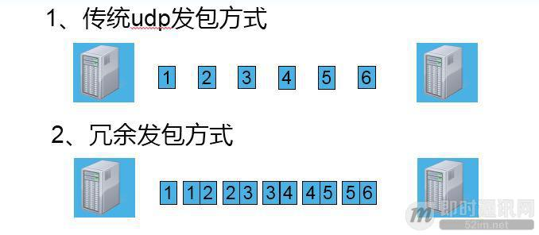

**不为人知的网络编程(六)：深入地理解UDP协议并用好它**

## 1、前言

很早就计划写篇关于UDP的文章，尽管UDP协议远没TCP协议那么庞大、复杂，但是要想将UDP描述清楚，用好UDP却要比TCP难不少，于是文章从下笔写到最终写成，断断续续拖了好几个月。

本文接系列文章的上篇《[不为人知的网络编程(五)：UDP的连接性和负载均衡](http://www.52im.net/thread-1018-1-1.html)》，将从实践出发，讨论如何深入地理解UDP协议并在实践中用好它。

**注意：**本文中涉及到的具体代码、函数都是以Linux C++为例来讲解，如果您对Linux C++不太了解的话也没有关系，把它们当伪码看即可，必竟具体的语言实现并不妨碍问题解决思路的表达。

## 2、系列文章

**本文是系列文章中的第6篇，本系列文章的大纲如下：**

- 《[不为人知的网络编程(一)：浅析TCP协议中的疑难杂症(上篇)](http://www.52im.net/thread-1003-1-1.html)》
- 《[不为人知的网络编程(二)：浅析TCP协议中的疑难杂症(下篇)](http://www.52im.net/thread-1004-1-1.html)》
- 《[不为人知的网络编程(三)：关闭TCP连接时为什么会TIME_WAIT、CLOSE_WAIT](http://www.52im.net/thread-1007-1-1.html)》
- 《[不为人知的网络编程(四)：深入研究分析TCP的异常关闭](http://www.52im.net/thread-1014-1-1.html)》
- 《[不为人知的网络编程(五)：UDP的连接性和负载均衡](http://www.52im.net/thread-1018-1-1.html)》
- 《[不为人知的网络编程(六)：深入地理解UDP协议并用好它](http://www.52im.net/thread-1024-1-1.html)》（本文）
- 《[不为人知的网络编程(七)：如何让不可靠的UDP变的可靠？](http://www.52im.net/thread-1293-1-1.html)》
- 《[不为人知的网络编程(八)：从数据传输层深度解密HTTP](http://www.52im.net/thread-2456-1-1.html)》
- 《[不为人知的网络编程(九)：理论联系实际，全方位深入理解DNS](http://www.52im.net/thread-2740-1-1.html)》

**如果您觉得本系列文章过于专业，您可先阅读《网络编程懒人入门》系列文章，该系列目录如下：**

- 《[网络编程懒人入门(一)：快速理解网络通信协议（上篇）](http://www.52im.net/thread-1095-1-1.html)》
- 《[网络编程懒人入门(二)：快速理解网络通信协议（下篇）](http://www.52im.net/thread-1103-1-1.html)》
- 《[网络编程懒人入门(三)：快速理解TCP协议一篇就够](http://www.52im.net/thread-1107-1-1.html)》
- 《[网络编程懒人入门(四)：快速理解TCP和UDP的差异](http://www.52im.net/thread-1160-1-1.html)》
- 《[网络编程懒人入门(五)：快速理解为什么说UDP有时比TCP更有优势](http://www.52im.net/thread-1277-1-1.html)》

**本站的《脑残式网络编程入门》也适合入门学习，本系列大纲如下：**

- 《[脑残式网络编程入门(一)：跟着动画来学TCP三次握手和四次挥手](http://www.52im.net/thread-1729-1-1.html)》
- 《[脑残式网络编程入门(二)：我们在读写Socket时，究竟在读写什么？](http://www.52im.net/thread-1732-1-1.html)》
- 《[脑残式网络编程入门(三)：HTTP协议必知必会的一些知识](http://www.52im.net/thread-1751-1-1.html)》
- 《[脑残式网络编程入门(四)：快速理解HTTP/2的服务器推送(Server Push)](http://www.52im.net/thread-1795-1-1.html)》

**关于移动端网络特性及优化手段的总结性文章请见：**

- 《[现代移动端网络短连接的优化手段总结：请求速度、弱网适应、安全保障](http://www.52im.net/thread-1413-1-1.html)》
- 《[移动端IM开发者必读(一)：通俗易懂，理解移动网络的“弱”和“慢”](http://www.52im.net/thread-1587-1-1.html)》
- 《[移动端IM开发者必读(二)：史上最全移动弱网络优化方法总结](http://www.52im.net/thread-1588-1-1.html)》

## 3、参考资料

《[TCP/IP详解](http://www.52im.net/topic-tcpipvol1.html) - [第11章·UDP：用户数据报协议](http://docs.52im.net/extend/docs/book/tcpip/vol1/11/)》
《[为什么QQ用的是UDP协议而不是TCP协议？](http://www.52im.net/thread-279-1-1.html)》
《[移动端IM/推送系统的协议选型：UDP还是TCP？](http://www.52im.net/thread-33-1-1.html)》
《[简述传输层协议TCP和UDP的区别](http://www.52im.net/thread-580-1-1.html)》
《[UDP中一个包的大小最大能多大](http://www.52im.net/thread-29-1-1.html)》
《[为什么说基于TCP的移动端IM仍然需要心跳保活？](http://www.52im.net/thread-281-1-1.html)》

## 4、UDP的疑难杂症

### 4.1UDP的传输方式：面向报文

面向报文的传输方式决定了 UDP 的数据发送方式是一份一份的，也就是应用层交给 UDP 多长的报文，UDP 就照样发送，即一次发送一个报文。那么UDP的报文大小由哪些影响因素呢？ UDP 数据包的理论长度是多少，合适的 UDP 数据包应该是多少呢？

**(1) UDP 报文大小的影响因素，主要有以下3个：**

- [1] UDP协议本身，UDP协议中有16位的UDP报文长度，那么UDP报文长度不能超过2^16=65536；
- [2] 以太网(Ethernet)数据帧的长度，数据链路层的MTU(最大传输单元)；
- [3] socket的UDP发送缓存区大小。

**(2) UDP数据包最大长度：**

根据 UDP 协议，从 UDP 数据包的包头可以看出，UDP 的最大包长度是2^16-1的个字节。由于UDP包头占8个字节，而在IP层进行封装后的IP包头占去20字节，所以这个是UDP数据包的最大理论长度是2^16 - 1 - 8 - 20 = 65507字节。如果发送的数据包超过65507字节，send或sendto函数会错误码1(Operation not permitted， Message too long)，当然啦，一个数据包能否发送65507字节，还和UDP发送缓冲区大小（linux下UDP发送缓冲区大小为：cat /proc/sys/net/core/wmem_default）相关，如果发送缓冲区小于65507字节，在发送一个数据包为65507字节的时候，send或sendto函数会错误码1(Operation not permitted， No buffer space available)。

**(3) UDP数据包理想长度：**

理论上 UDP 报文最大长度是65507字节，实际上发送这么大的数据包效果最好吗？我们知道UDP是不可靠的传输协议，为了减少 UDP 包丢失的风险，我们最好能控制 UDP 包在下层协议的传输过程中不要被切割。相信大家都知道MTU这个概念。 MTU 最大传输单元，这个最大传输单元实际上和链路层协议有着密切的关系，EthernetII 帧的结构 DMAC + SMAC + Type + Data + CRC 由于以太网传输电气方面的限制，每个以太网帧都有最小的大小64字节，最大不能超过1518字节，对于小于或者大于这个限制的以太网帧我们都可以视之为错误的数据帧，一般的以太网转发设备会丢弃这些数据帧。由于以太网 EthernetII 最大的数据帧是1518字节，除去以太网帧的帧头（DMAC目的 MAC 地址48bit=6Bytes+SMAC源 MAC 地址48bit=6Bytes+Type域2bytes）14Bytes和帧尾CRC校验部分4Bytes那么剩下承载上层协议的地方也就是Data域最大就只能有1500字节这个值我们就把它称之为MTU。

在下层数据链路层最大传输单元是1500字节的情况下，要想IP层不分包，那么UDP数据包的最大大小应该是1500字节 – IP头(20字节) – UDP头(8字节) = 1472字节。不过鉴于Internet上的标准MTU值为576字节，所以建议在进行Internet的UDP编程时，最好将UDP的数据长度控制在 (576-8-20)548字节以内（论坛里的另一篇文章也深入地讨论了这个问题，详情请见《[UDP中一个包的大小最大能多大](http://www.52im.net/thread-29-1-1.html)》）。

### 4.2UDP数据包的发送和接收问题

**(1) UDP的通信有界性：**

在阻塞模式下，UDP的通信是以数据包作为界限的，即使server端的缓冲区再大也要按照client发包的次数来多次接收数据包，server只能一次一次的接收，client发送多少次，server就需接收多少次，即客户端分几次发送过来，服务端就必须按几次接收。

**(2) UDP数据包的无序性和非可靠性：**

client依次发送1、2、3三个UDP数据包，server端先后调用3次接收函数，可能会依次收到3、2、1次序的数据包，收包可能是1、2、3的任意排列组合，也可能丢失一个或多个数据包。

**(3) UDP数据包的接收：**

client发送两次UDP数据，第一次 500字节，第二次300字节，server端阻塞模式下接包，第一次recvfrom( 1000 )，收到是 1000，还是500，还是300，还是其他？

由于UDP通信的有界性，接收到只能是500或300，又由于UDP的无序性和非可靠性，接收到可能是300，也可能是500，也可能一直阻塞在recvfrom调用上，直到超时返回(也就是什么也收不到)。

在假定数据包是不丢失并且是按照发送顺序按序到达的情况下，server端阻塞模式下接包，先后三次调用：recvfrom( 200)，recvfrom( 1000)，recvfrom( 1000)，接收情况如何呢？

由于UDP通信的有界性，第一次recvfrom( 200)将接收第一个500字节的数据包，但是因为用户空间buf只有200字节，于是只会返回前面200字节，剩下300字节将丢弃。第二次recvfrom( 1000)将返回300字节，第三次recvfrom( 1000)将会阻塞。

**(4) UDP包分片问题：**

如果MTU是1500，Client发送一个8000字节大小的UDP包，那么Server端阻塞模式下接包，在不丢包的情况下，recvfrom(9000)是收到1500，还是8000。如果某个IP分片丢失了，recvfrom(9000)，又返回什么呢？

根据UDP通信的有界性，在buf足够大的情况下，接收到的一定是一个完整的数据包，UDP数据在下层的分片和组片问题由IP层来处理，提交到UDP传输层一定是一个完整的UDP包，那么recvfrom(9000)将返回8000。如果某个IP分片丢失，udp里有个CRC检验，如果包不完整就会丢弃，也不会通知是否接收成功，所以UDP是不可靠的传输协议，那么recvfrom(9000)将阻塞。

### 4.3UDP丢包问题

在不考虑UDP下层IP层的分片丢失，CRC检验包不完整的情况下，造成UDP丢包的因素有哪些呢？

**[1] UDP socket缓冲区满造成的UDP丢包：**

通过 cat /proc/sys/net/core/rmem_default 和cat /proc/sys/net/core/rmem_max可以查看socket缓冲区的缺省值和最大值。如果socket缓冲区满了，应用程序没来得及处理在缓冲区中的UDP包，那么后续来的UDP包会被内核丢弃，造成丢包。在socket缓冲区满造成丢包的情况下，可以通过增大缓冲区的方法来缓解UDP丢包问题。但是，如果服务已经过载了，简单的增大缓冲区并不能解决问题，反而会造成滚雪球效应，造成请求全部超时，服务不可用。

**[2] UDP socket缓冲区过小造成的UDP丢包：**

如果Client发送的UDP报文很大，而socket缓冲区过小无法容下该UDP报文，那么该报文就会丢失。

**[3] ARP缓存过期导致UDP丢包：**

ARP 的缓存时间约10分钟，APR 缓存列表没有对方的 MAC 地址或缓存过期的时候，会发送 ARP 请求获取 MAC 地址，在没有获取到 MAC 地址之前，用户发送出去的 UDP 数据包会被内核缓存到 arp_queue 这个队列中，默认最多缓存3个包，多余的 UDP 包会被丢弃。被丢弃的 UDP 包可以从 /proc/net/stat/arp_cache 的最后一列的 unresolved_discards 看到。当然我们可以通过 echo 30 > /proc/sys/net/ipv4/neigh/eth1/unres_qlen 来增大可以缓存的 UDP 包。

UDP 的丢包信息可以从 cat /proc/net/udp 的最后一列drops中得到，而倒数第四列 inode 是丢失 UDP 数据包的 socket 的全局唯一的虚拟i节点号，可以通过这个 inode 号结合 lsof ( lsof -P -n | grep 25445445)来查到具体的进程。

### 4.4UDP的冗余传输方案

在外网通信链路不稳定的情况下，有什么办法可以降低UDP的丢包率呢？一个简单的办法来采用冗余传输的方式。如下图，一般采用较多的是延时双发，双发指的是将原本单发的前后连续的两个包合并成一个大包发送，这样发送的数据量是原来的两倍。这种方式提高丢包率的原理比较简单，例如本例的冗余发包方式，在偶数包全丢的情况下，依然能够还原出完整的数据，也就是在这种情况下，50%的丢包率，依然能够达到100%的数据接收。

## 5、UDP真的比TCP要高效吗

相信很多同学都认为UDP无连接，无需重传和处理确认，UDP比较高效。然而UDP在大多情况下并不一定比TCP高效，TCP发展至今天，为了适应各种复杂的网络环境，其算法已经非常丰富，协议本身经过了很多优化，如果能够合理配置TCP的各种参数选项，那么在多数的网络环境下TCP是要比UDP更高效的。

影响UDP高效因素有以下3点。

**(1) 无法智能利用空闲带宽导致资源利用率低：**
一个简单的事实是UDP并不会受到MTU的影响，MTU只会影响下层的IP分片，对此UDP一无所知。在极端情况下，UDP每次都是发小包，包是MTU的几百分之一，这样就造成UDP包的有效数据占比较小(UDP头的封装成本)；或者，UDP每次都是发巨大的UDP包，包大小MTU的几百倍，这样会造成下层IP层的大量分片，大量分片的情况下，其中某个分片丢失了，就会导致整个UDP包的无效。由于网络情况是动态变化的，UDP无法根据变化进行调整，发包过大或过小，从而导致带宽利用率低下，有效吞吐量较低。而TCP有一套智能算法，当发现数据必须积攒的时候，就说明此时不积攒也不行，TCP的复杂算法会在延迟和吞吐量之间达到一个很好的平衡。

**(2) 无法动态调整发包：**
由于UDP没有确认机制，没有流量控制和拥塞控制，这样在网络出现拥塞或通信两端处理能力不匹配的时候，UDP并不会进行调整发送速率，从而导致大量丢包。在丢包的时候，不合理的简单重传策略会导致重传风暴，进一步加剧网络的拥塞，从而导致丢包率雪上加霜。更加严重的是，UDP的无秩序性和自私性，一个疯狂的UDP程序可能会导致这个网络的拥塞，挤压其他程序的流量带宽，导致所有业务质量都下降。

**(3) 改进UDP的成本较高：**
可能有同学想到针对UDP的一些缺点，在用户态做些调整改进，添加上简单的重传和动态发包大小优化。然而，这样的改进并比简单的，UDP编程可是比TCP要难不少的，考虑到改造成本，为什么不直接用TCP呢？当然可以拿开源的一些实现来抄一下(例如：libjingle)，或者拥抱一下Google的QUIC协议，然而，这些都需要不少成本的。

上面说了这么多，难道真的不该用UDP了吗？其实也不是的，在某些场景下，我们还是必须UDP才行的。那么UDP的较为合适的使用场景是哪些呢？

## 6、UDP协议的正确使用场合

### 6.1高通信实时性要求和低持续性要求的场景下

**在分组交换通信当中，协议栈的成本主要表现在以下两方面：**

- [1] 封装带来的空间复杂度；
- [2] 缓存带来的时间复杂度。

以上两者是对立影响的，如果想减少封装消耗，那么就必须缓存用户数据到一定量在一次性封装发送出去，这样每个协议包的有效载荷将达到最大化，这无疑是节省了带宽空间，带宽利用率较高，但是延时增大了。如果想降低延时，那么就需要将用户数据立马封装发出去，这样显然会造成消耗更多的协议头等消耗，浪费带宽空间。

因此，我们进行协议选择的时候，需要重点考虑一下空间复杂度和时间复杂度间的平衡。

**通信的持续性对两者的影响比较大，根据通信的持续性有两种通信类型：**

- [1] 短连接通信；
- [2] 长连接通信。

对于短连接通信，一方面如果业务只需要发一两个包并且对丢包有一定的容忍度，同时业务自己有简单的轮询或重复机制，那么采用UDP会较为好些。在这样的场景下，如果用TCP，仅仅握手就需要3个包，这样显然有点不划算，一个典型的例子是DNS查询。另一方面，如果业务实时性要求非常高，并且不能忍受重传，那么首先就是UDP了或者只能用UDP了，例如NTP 协议，重传NTP消息纯属添乱(为什么呢？重传一个过期的时间包过来，还不如发一个新的UDP包同步新的时间过来)。如果NTP协议采用TCP，撇开握手消耗较多数据包交互的问题，由于TCP受Nagel算法等影响，用户数据会在一定情况下会被内核缓存延后发送出去，这样时间同步就会出现比较大的偏差，协议将不可用。

### 6.2多点通信的场景下

对于一些多点通信的场景，如果采用有连接的TCP，那么就需要和多个通信节点建立其双向连接，然后有时在NAT环境下，两个通信节点建立其直接的TCP连接不是一个容易的事情，在涉及NAT穿越的时候，UDP协议的无连接性使得穿透成功率更高（原因详见：由于UDP的无连接性，那么其完全可以向一个组播地址发送数据或者轮转地向多个目的地持续发送相同的数据，从而更为容易实现多点通信。）

一个典型的场景是多人实时音视频通信，这种场景下实时性要求比较高，可以容忍一定的丢包率。比如：对于音频，对端连续发送p1、p2、p3三个包，另一端收到了p1和p3，在没收到p2的保持p1的最后一个音（也是为什么有时候网络丢包就会听到嗞嗞嗞嗞嗞嗞…或者卟卟卟卟卟卟卟卟…重音的原因），等到到p3就接着播p3了，不需要也不能补帧，一补就越来越大的延时。对于这样的场景就比较合适用UDP了，如果采用TCP，那么在出现丢包的时候，就可能会出现比较大的延时。

### 6.3UDP的使用原则小结

通常情况下，UDP的使用范围是较小的，在以下的场景下，使用UDP才是明智的。

- [1] 实时性要求很高，并且几乎不能容忍重传：
  **例子：**NTP协议，实时音视频通信，多人动作类游戏中人物动作、位置。
- [2] TCP实在不方便实现多点传输的情况；
- [3] 需要进行NAT穿越；
- [4] 对网络状态很熟悉，确保udp网络中没有氓流行为，疯狂抢带宽；
- [5] 熟悉UDP编程。