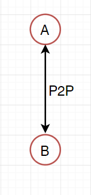
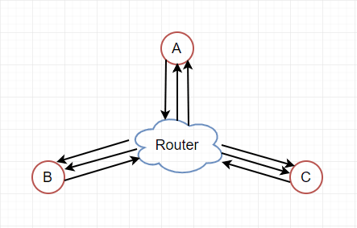
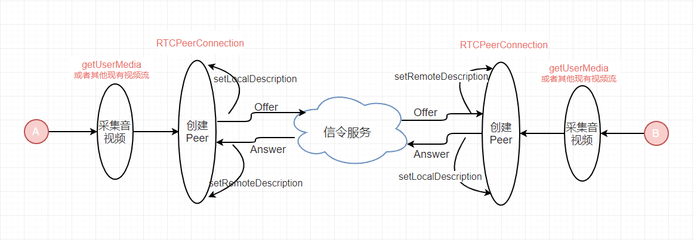
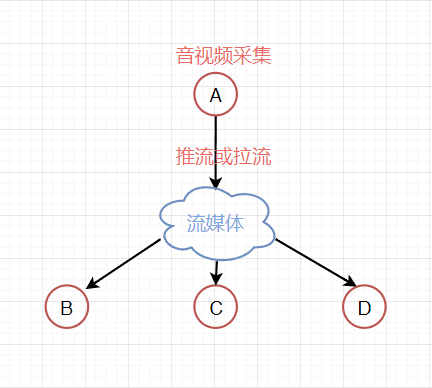

# 【从头到脚】前端实现多人视频聊天— WebRTC 实战（多人篇）

## 前言

这是 WebRTC 系列的第三篇文章，主要讲多人点对点连接。如果你对 WebRTC 还不太了解，推荐阅读我之前的文章。

- [WebRTC 基础及 1 v 1 对等连接](https://link.zhihu.com/?target=https%3A//juejin.im/post/5c3acfa56fb9a049f36254be)
- [WebRTC 实战之共享画板](https://link.zhihu.com/?target=https%3A//juejin.im/post/5c9cbbb85188251c3a2f36e8)

**文章仓库在 [fe-code](https://link.zhihu.com/?target=https%3A//github.com/wuyawei/fe-code)，欢迎 star**。

**源码地址 [webrtc-stream](https://link.zhihu.com/?target=https%3A//github.com/wuyawei/webrtc-stream)**

**线上预览 [https://webrtc-stream-depaadjmes.now.sh](https://link.zhihu.com/?target=https%3A//webrtc-stream-depaadjmes.now.sh/)**

## 三种模式

> 简单介绍一下基于 WebRTC 的多人通信的几种架构模式。

- Mesh 架构

我们之前写过几个 1 v 1 的栗子，它们的连接模式如下：





这是典型的端到端对等连接，所以当我们要实现多人视频（实际上也就是多端通信）的时候，我们会很自然的想到在 1 v 1 的基础上扩充，给每个客户端创建多个 1 v 1 的对等连接：


这就是所谓的 Mesh 模式，不需要额外的服务器处理媒体数据（当然，信令服务器是不可少的），仅仅是基于 WebRTC 自身的点对点连接进行通信，本期的实例也是采用这种模式。

但是这种架构的缺点也是十分明显的，如果连接的客户端过多，上行带宽面临的压力将会非常大，相应的视频通话 。 * Mixer 架构

传统的视频会议，一般都是采用 Mixer 架构。以录播摄像为例，会利用 MCU (多点控制单元) 接收并混合每个客户端传入的媒体流。也就是将多个客户端的音视频画面合成单个流，再传输给每个参与的客户端。这样也可以保证客户端始终是 1 对 1 的连接，有效缓解了 Mesh 架构的问题。缺点则是依赖服务端，成本比较大，而且服务端处理过多也更容易导致视频流的延迟。


- Router 架构

Router 模式和 Mixer 很类似，比较来说，它只是单纯的进行数据流的转发，而不用合成、转码等操作。




因此，在实际运用中，使用哪种方式来处理，需要结合项目需求、成本等因素综合考量。

## 多人视频

### 1 v 1

我们基于 Mesh 模式来做多人视频的演示，所以需要给每个客户端创建多个 1 v 1 的对等连接。除了 WebRTC 的基础知识，还需要用到 `Socket.io` 和 Koa 来做信令服务。





先复习一下 1 v 1 的连接过程：

```text
A 创建 offer 信息后，先调用 setLocalDescription 存储本地 offer 描述，再将其发送给 B。
B 收到 offer 后，先调用 setRemoteDescription 存储远端 offer 描述；
  然后又创建 answer 信息，同样需要调用 setLocalDescription 存储本地 answer 描述，再返回给 A
A 拿到 answer 后，再次调用 setRemoteDescription 设置远端 answer 描述。
```

当然，NAT 穿越和候选信息交换也是必不可少的。

```text
本地 ICE 候选信息采集完成后，通过信令服务进行交换。
这一步也是在创建 Peer 之后，但与 offer 的发送没有先后关系。
```

### 1 v 多

我们平时观看直播实际上就是 1 v 多，也就是只有一端输出视频流，其他观看端只需要接收就好了。但是这种形式，一般不会采用点对点连接，而是用传统的直播方式，服务端进行媒体流的转发。有些直播可以和主播进行互动，这里的原理大致和上篇文章中的共享画板类似。





这里只是给大家介绍一下这种直播模式，所以具体的就不细说了。

### 多路通话

其实这种情况，主要用于视频会议或者多人视频通话，类似于微信的视频通话一样。

### 注意事项

我们刚刚回忆过 1 v 1 的连接流程，也知道要基于 Mesh 架构来做，那么到底该如何去做呢？这里先提炼两个要点： *如何给每个客户端创建多个点对点连接？* 如何确认连接的顺序？


我们以 3 个客户端 A、B、C 为例。A 最先打开浏览器或者说 A 是第一个加入房间的，那么 A 进入的时候房间内没有其他人，这个时候要做什么？只需要初始化一下自己的视频画面就好，并不需要进行任何连接操作，因为这个时候没有第二个人，也就没有连接的对象。

什么时候需要进行连接？等 B 加入房间的时候。这里又一个问题，B 加入房间时，谁发送 Offer ？ 因为都参与通话，B 加入的时候首先也会初始化自己的视频流，那么此时 A 和 B 都可以 createOffer 。这也是和之前 1 v 1 的区别所在，因为 1 v 1 我们有明确的 **呼叫端** 和 **接收端**，不需要考虑这个问题。**所以，为了避免连接混乱，我们只用后加入的成员，向房间内所有已加入成员分别发送 Offer，也就是说 B 加入时，给 A 发；C 加入时，再给 A 和 B 分别发。** 以此来保证连接的有序性，这是第二个问题。

那么如何在一个端建立多个点对点连接呢？我采用的策略是，**两两之间的连接，都是单独创建的 Peer 实例**。也就是说，A ——> B 、A ——> C 的连接中，A 会创建两个 Peer 实例，用来分别与 B、C 做连接，同样的 B、C 也会创建多个 Peer 实例。但是我们需要确保每个端之间的 Peer 是一一对应的，简单来说，就是 A 的 PeerA-B 必须和 B 的 peerA-B 连接。很明显，这里需要一个唯一性标识。

```js
// loginname 唯一
// 假设 A 的 loginname 是 A；B 的 loginname 是 B；
// 在客户端 A 中
let arr = ['A', 'B'];
let id = arr.sort().join('-'); // 排序后再连接 A-B
this.PeerList[id] = Peer; // 将创建的 peer 以键值对形式都存放到 PeerList 中
// PS: 在客户端 B 中，操作一样
```

### 代码写起来

其实实现多人通信的主要思路刚刚已经讲完了，我习惯于先将思路理清楚，再讲代码实现。个人觉得这样比大家直接看代码注释效果要好，大家有什么好的意见也可以在评论区提出，我们一起讨论。

我们先做一个加入房间的过渡页，简单的 Vue 写法，没啥好说的。

```html
<div class="center">
    登录名：<input type="text" v-model="account"> <br>
    房间号：<input type="text" v-model="roomid"> <br>
    <button @click="join">加入房间</button>
</div>

// ···
methods: {
    join() {
        if (this.account && this.roomid) {
            this.$router.push({name: 'room',
            params: {roomid: this.roomid, account: this.account}})
        }
        // 参数是路由形式的，如 room/id/account
    }
}
```

初始化步骤和前两期 1 v 1 的栗子没有区别，视频通话首先当然是获取视频流。

```js
getUserMedia() { // 获取媒体流
    let myVideo = this.$refs['video-mine']; // 默认播放自己视频流的 video
    let getUserMedia = (navigator.getUserMedia ||
        navigator.webkitGetUserMedia ||
        navigator.mozGetUserMedia ||
        navigator.msGetUserMedia);
    //获取本地的媒体流，并绑定到一个video标签上输出
    return new Promise((resolve, reject) => {
        getUserMedia.call(navigator, {
            "audio": true,
            "video": true
        }, (stream) => {
            //绑定本地媒体流到video标签用于输出
            myVideo.srcObject = stream;
            this.localStream = stream;
            resolve();
        }, function(error){
            reject(error);
            // console.log(error);
            //处理媒体流创建失败错误
        });
    })
}
```

大家还记不记得，在 1 v 1 中，我们创建 Peer 实例的时机是： **接收端** 点击同意通话后，初始化自己的 Peer 实例；**呼叫端** 收到对方同意申请的通知后，初始化 Peer 实例，并向其发送 Offer。刚刚分析过，多人通信思路有些不一样，但是 初始化方法是差不多的，我们先写个初始化方法。

```js
getPeerConnection(v) {
    let videoBox = this.$refs['video-box']; // 用于向 box 中添加新加入的成员视频
    let iceServer = { // stun 服务，如果要做到 NAT 穿透，还需要 turn 服务
        "iceServers": [
            {
                "url": "stun:stun.l.google.com:19302"
            }
        ]
    };
    let PeerConnection = (window.RTCPeerConnection ||
        window.webkitRTCPeerConnection ||
        window.mozRTCPeerConnection);
    // 创建 peer 实例
    let peer = new PeerConnection(iceServer);
    //向PeerConnection中加入需要发送的流
    peer.addStream(this.localStream);

    // 如果检测到媒体流连接到本地，将其绑定到一个video标签上输出
    // v.account 就是上面提到的 A-B
    peer.onaddstream = function(event){
        let videos = document.querySelector('#' + v.account);
        if (videos) { // 如果页面上有这个标识的播放器，就直接赋值 src
            videos.srcObject = event.stream;
        } else {
            let video = document.createElement('video');
            video.controls = true;
            video.autoplay = 'autoplay';
            video.srcObject = event.stream;
            video.id = v.account; 
            // video加上对应标识，这样在对应客户端断开连接后，可以移除相应的video
            videoBox.append(video);
        }
    };
    // 发送ICE候选到其他客户端
    peer.onicecandidate = (event) => {
        if (event.candidate) {
            // ··· 发送 ICE
        }
    };
    this.peerList[v.account] = peer; // 存储 Peer
}
```

创建 Peer 的时候用到了 account 标识来做保存，这里也涉及到我们建立点对点连接的时机问题。现在我们来看看，之前分析的第二个问题如何体现在代码上呢？

```js
// data 是后端返回的房间内所有成员列表
// account 是本次新加入成员 loginname
socket.on('joined', (data, account) => {
// joined 在每次有人加入房间时触发，自己加入时，自己也会收到
    if (data.length> 1) { // 成员数大于1，也就是前面提到的从第二个开始，每个新加入成员发送 Offer
        data.forEach(v => {
            let obj = {};
            let arr = [v.account, this.$route.params.account];
            obj.account = arr.sort().join('-'); // 组合 Peer 的标识
            if (!this.peerList[obj.account] && v.account !== this.$route.params.account) {
                // 如果列表中没有这个标识的 Peer ，则创建 Peer实例
                // 如果是自己，就不创建，否则就重复了
                // 比如所有成员列表中，有 A 和 B，我自己就是 A，如果不排除，就会创建两个 A-B
                this.getPeerConnection(obj);
            }
        });
        if (account === this.$route.params.account) { 
        // 如果新加入成员是自己，则给所有已加入成员发送 Offer
            for (let k in this.peerList) {
                this.createOffer(k, this.peerList[k]);
            }
        }
    }
});
```

我们在初始化 Peer 实例的时候，还做了一个发送 ICE 的操作。那我们就以 ICE 接收为例，看一下这种加了唯一标识的处理和之前有什么区别。

```text
getPeerConnection(v) {
    // ··· 部分代码省略
    // 发送ICE候选到其他客户端
    peer.onicecandidate = (event) => {
        if (event.candidate) {
            socket.emit('__ice_candidate',
            {candidate: event.candidate,
            roomid: this.$route.params.roomid,
            account: v.account});
            // 将标识 v.account 也放进数据中转发给对方，用于匹配对应的 Peer
        }
    };
}

// 在mounted 方法中接收
socket.on('__ice_candidate', v => {
    //如果是一个ICE的候选，则将其加入到PeerConnection中
    if (v.candidate) {
        // 利用传过来的唯一标识匹配对应的 Peer，并添加 Ice
        this.peerList[v.account] && this.peerList[v.account].addIceCandidate(v.candidate).catch((e) => {                    console.log('err', e)
        });
    }
});
```

其实区别就是，我们把标识（A-B）也放进了信令交互的数据中，这样才能在两端之前匹配到对应的 Peer 实例，而不至于混乱。

最后，后端代码比较简单，看一下需要注意的点就好。

```js
const users = {};
app._io.on( 'connection', sock => {
    sock.on('join', data=>{
        sock.join(data.roomid, () => {
            if (!users[data.roomid]) {
                users[data.roomid] = [];
            }
            // 因为多房间，采用了这种格式保存房间成员
            // {'room1': [userA, userB, userC]}   userA 包含loginname 和 sock.id
            let obj = {
                account: data.account,
                id: sock.id
            };
            let arr = users[data.roomid].filter(v => v.account === data.account);
            if (!arr.length) {
                users[data.roomid].push(obj);
            }
            app._io.in(data.roomid).emit('joined', users[data.roomid], data.account, sock.id); 
            // 新成员加入时，把房间内成员列表发给房间内所有人
        });
    });
    sock.on('offer', data=>{ // 转发 Offer
        sock.to(data.roomid).emit('offer',data);
    });
    // 这里转发是直接转发到房间了，也可以转发到指定的客户端
    // 看过上一篇共享画板的同学应该有印象，没看过的可以去看看，这里就不再多说
    sock.on('answer', data=>{ // 转发 Answer
        sock.to(data.roomid).emit('answer',data);
    });
    sock.on('__ice_candidate', data=>{ // 转发ICE
        sock.to(data.roomid).emit('__ice_candidate',data);
    });
})

app._io.on('disconnect', (sock) => { // 断开连接时，删除对应的客户端数据
    for (let k in users) {
        users[k] = users[k].filter(v => v.id !== sock.id);
    }
    console.log(`disconnect id => ${users}`);
});
```

到这里，主要流程就讲完了。另外关于 Offer、Answer 的创建和交换和 1 v 1 的区别也只在于多加了一个标识，跟上面讲的 ICE 传输一样。所以，就不贴代码了，有需要的同学可以去代码仓库看 [完整代码](https://link.zhihu.com/?target=https%3A//github.com/wuyawei/webrtc-stream)。

## 交流群

> qq前端交流群：960807765，欢迎各种技术交流，期待你的加入

## 后记

如果你看到了这里，且本文对你有一点帮助的话，希望你可以动动小手支持一下作者，感谢 。文中如有不对之处，也欢迎大家指出，共勉。好了，又耽误大家的时间了，感谢阅读，下次再见！