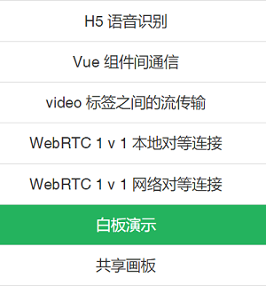
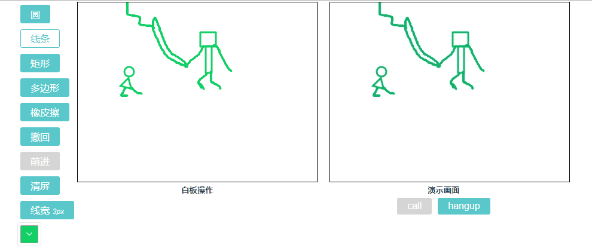
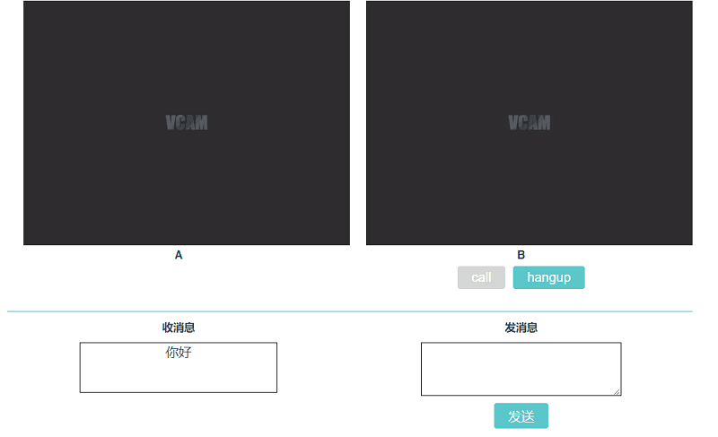
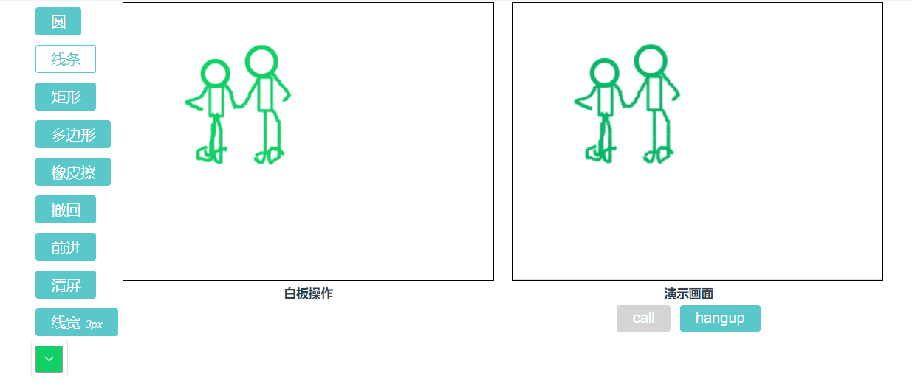
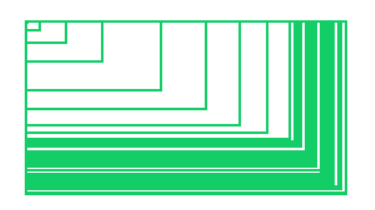
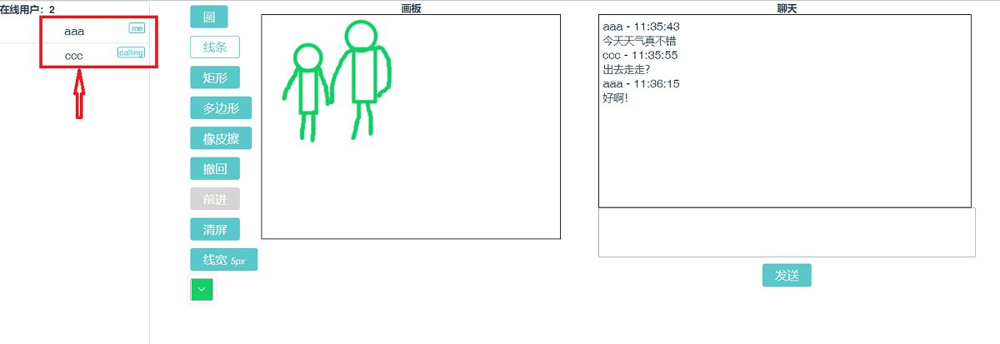
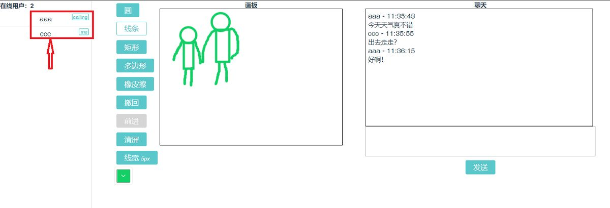

# 从头到脚】WebRTC + Canvas 实现一个双人协作的共享画板

## 前言

笔者之前写过一篇 [【从头到脚】撸一个多人视频聊天 — 前端 WebRTC 实战（一）](https://link.zhihu.com/?target=https%3A//juejin.im/post/5c3acfa56fb9a049f36254be)，主要讲 WebRTC 的一些基础知识以及单人通话的简单实现。原计划这篇写多人通话的，鉴于有同学留言说想看画板，所以把这篇文章提前了，希望可以给大家提供一些思路。

本期的主要内容，便是实现一个共享画板，还有上期没讲的一个知识点：RTCDataChannel 。

**特别注意**：介于本次的实现多基于上期的知识点以及相关示例，所以强烈建议不太了解 WebRTC 基础的同学，配合上篇一起看 [传送门](https://link.zhihu.com/?target=https%3A//juejin.im/post/5c3acfa56fb9a049f36254be)。最近文章的相关示例都集中在一个项目里，截至本期目录如下：





- 本文示例 **源码库**[webrtc-stream](https://link.zhihu.com/?target=https%3A//github.com/wuyawei/webrtc-stream)
- **文章仓库**[ fe-code](https://link.zhihu.com/?target=https%3A//github.com/wuyawei/fe-code)
- 本文 [演示地址](https://link.zhihu.com/?target=https%3A//webrtc-stream-jukbknonbo.now.sh/%23/)（建议谷歌查看）

照例先看下本期的实战目标（灵魂画手上线）：实现一个可以两人（基于上期文章的 1 对 1 对等连接）协作作画的画板。是什么概念呢？简单来说就是两个人可以共享一个画板，都可以在上面作画。

**先来感受一下恐惧！颤抖吧！人类！**

（图为白板演示，共享在下面）

## RTCDataChannel

> 我们先把上期留下的知识点补上，因为今天的栗子也会用到它。

### 介绍

简单来说，RTCDataChannel 就是在点对点连接中建立一个双向的数据通道，从而获得文本、文件等数据的点对点传输能力。它依赖于流控制传输协议（SCTP），`SCTP 是一种传输协议，类似于 TCP 和 UDP，可以直接在 IP 协议之上运行。但是，在 WebRTC 的情况下，SCTP 通过安全的 DTLS 隧道进行隧道传输，该隧道本身在 UDP 之上运行`。 嗯，我是个学渣，对于这段话我也只能说是，看过！大家可以直接 [查看原文](https://link.zhihu.com/?target=https%3A//hpbn.co/webrtc/)。

另外总的来说 RTCDataChannel 和 WebSocket 很像，只不过 WebSocket 不是 P2P 连接，需要服务器做中转。

### 使用

RTCDataChannel 通过上一期讲过的 RTCPeerConnection 来创建。

```js
// 创建
let Channel = RTCPeerConnection.createDataChannel('messagechannel', options);
// messagechannel 可以看成是给 DataChannel 取的别名，限制是不得超过65,535 字节。
// options 可以设置一些属性，一般默认就好。

// 接收
RTCPeerConnection.ondatachannel = function(event) {
  let channel = event.channel;
}
```

RTCDataChannel 只需要在一端使用 `createDataChannel` 来创建实例，在接收端只需要给 RTCPeerConnection 加上 `ondatachannel` 监听即可。但是有一点需要注意的是，一定要是 **呼叫端** 也就是创建 createOffer 的那端来 `createDataChannel` 创建通道。

RTCDataChannel 的一些属性，更多可以查看 [MDN](https://link.zhihu.com/?target=https%3A//developer.mozilla.org/zh-CN/docs/Web/API/RTCPeerConnection/createDataChannel%23RTCDataChannelInit_dictionary)

- **label：**创建时提到的别名。 ordered：指发送的消息是否需要按照它们的发送顺序到达目的地（true），或者允许它们无序到达（false）。默认值：true。
- **binaryType：**是一个 DOMString 类型，表示发送的二进制数据的类型。值为 blob 或 arraybuffer，默认值为 "blob"。
- **readyState：**表示数据连接的状态：connecting 等待连接，也是创建初始状态。open 连接成功并且运行。closing 连接关闭中，不会接受新的发送任务，但是缓冲队列中的消息还是会被继续发送或者接收。也就是没发送完的会继续发送。closed 连接完全被关闭。

前面说 RTCDataChannel 和 WebSocket 很像是真的很像，我们基于上期的本地 1 对 1 连接，简单看一下用法。

这里还是说一下，系列文章就是这点比较麻烦，后面的很多内容都是基于前面的基础的，但是有很多同学又没看过之前的文章。但是我也不能每次都把之前的内容再重复一遍，所以还是强烈建议有需求的同学，结合之前的文章一起看 [传送门](https://link.zhihu.com/?target=https%3A//juejin.im/post/5c3acfa56fb9a049f36254be)，希望大家理解。





一个简单的收发消息的功能，我们已经知道了在 **呼叫端** 和 **接收端** 分别拿到 RTCDataChannel 实例，但是还不知道怎么接收和发送消息，现在就来看一下。

```js
// this.peerB 呼叫端 RTCPeerConnection 实例
this.channelB = this.peerB.createDataChannel('messagechannel'); // 创建 Channel
this.channelB.onopen = (event) => { // 监听连接成功
    console.log('channelB onopen', event);
    this.messageOpen = true; // 连接成功后显示消息框
};
this.channelB.onclose = function(event) { // 监听连接关闭
    console.log('channelB onclose', event);
};

// 发送消息
send() {
    this.channelB.send(this.sendText);
    this.sendText = '';
}
// this.peerA 接收端 RTCPeerConnection 实例
this.peerA.ondatachannel = (event) => {
    this.channelA = event.channel; // 获取接收端 channel 实例
    this.channelA.onopen = (e) => { // 监听连接成功
        console.log('channelA onopen', e);
    };
    this.channelA.onclose = (e) => { // 监听连接关闭
        console.log('channelA onclose', e);
    };
    this.channelA.onmessage = (e) => { // 监听消息接收
        this.receiveText = e.data; // 接收框显示消息
        console.log('channelA onmessage', e.data);
    };
};
```

建立对等连接的过程这里就省略了，通过这两段代码就可以实现简单的文本传输了。

## 白板演示

### 需求

ok，WebRTC 的三大 API 到这里就讲完了，接下来开始我们今天的第一个实战栗子 — 白板演示。可能有的同学不太了解白板演示，通俗点讲，就是你在白板上写写画画的东西，可以实时的让对方看到。先来看一眼我的大作：





嗯，如上，白板操作会实时展示在演示画面中。其实基于 WebRTC 做白板演示非常简单，因为我们不需要视频通话，所以不需要获取本地媒体流。那我们可以直接把 Canvas 画板作为一路媒体流来建立连接，这样对方就能看到你的画作了。怎么把 Canvas 变成媒体流呢，这里用到了一个神奇的 API：`captureStream`。

```js
this.localstream = this.$refs['canvas'].captureStream();
```

一句话就可以把 Canvas 变成媒体流了，所以演示画面仍然是 video 标签在播放媒体流，只是这次不是从摄像头获取的流，而是 Canvas 转换的。

### 封装 Canvas 类

现在点对点连接我们有了，白板流我们也有了，好像就缺一个能画画的 Canvas 了。说时迟那时快，看，Canvas 来了。[源码地址](https://link.zhihu.com/?target=https%3A//github.com/wuyawei/webrtc-stream/blob/master/webrtc-main/src/utils/palette.js)

- **功能点**

从图上我们可以看见这个画板类需要哪些功能：绘制圆形、绘制线条、绘制矩形、绘制多边形、橡皮擦、撤回、前进、清屏、线宽、颜色，这些是功能可选项。

再往细分析：

1. 绘制各种形状，肯定要用到鼠标事件，来记录鼠标移动的位置从而进行绘图；
2. 绘制多边形，需要用户选择到底是几边形，最少当然是 3 边，也就是三角形；
3. 线宽和颜色也是用户可以改变的东西，所以我们需要提供一个接口，用来修改这些属性；
4. 撤回和前进，意味着我们需要保存每次绘制的图像，保存时机在鼠标抬起的时候；而且撤回和前进不是无限制的，有边界点；
5. 试想一下：当你绘制了 5 步，现在撤回到了第 3 步，想在第 3 步的基础上再次进行绘制，这时候是不是应该把第 4 步和第 5 步清除掉？如果不清除，新绘制的算第几步？

综上，我们可以先列出大体的框架。

```js
// Palette.js
class Palette {
    constructor() {
    }
    gatherImage() { // 采集图像
    }
    reSetImage() { // 重置为上一帧
    }
    onmousedown(e) { // 鼠标按下
    }
    onmousemove(e) { // 鼠标移动
    }
    onmouseup() { // 鼠标抬起
    }
    line() { // 绘制线性
    }
    rect() { // 绘制矩形
    }
    polygon() { // 绘制多边形
    }
    arc() { // 绘制圆形
    }
    eraser() { // 橡皮擦
    }
    cancel() { // 撤回
    }
    go () { // 前进
    }
    clear() { // 清屏
    }
    changeWay() { // 改变绘制条件
    }
    destroy() { // 销毁
    }
}
```

- 绘制线条

任何绘制，都需要经过鼠标按下，鼠标移动，鼠标抬起这几步；

```js
onmousedown(e) { // 鼠标按下
    this.isClickCanvas = true; // 鼠标按下标识
    this.x = e.offsetX; // 获取鼠标按下的坐标
    this.y = e.offsetY;
    this.last = [this.x, this.y]; // 保存每次的坐标
    this.canvas.addEventListener('mousemove', this.bindMousemove); // 监听 鼠标移动事件
}
onmousemove(e) { // 鼠标移动
    this.isMoveCanvas = true; // 鼠标移动标识
    let endx = e.offsetX;
    let endy = e.offsetY;
    let width = endx - this.x;
    let height = endy - this.y;
    let now = [endx, endy]; // 当前移动到的坐标
    switch (this.drawType) {
        case 'line' :
            this.line(this.last, now, this.lineWidth, this.drawColor); // 绘制线条的方法
            break;
    }
}
onmouseup() { // 鼠标抬起
    if (this.isClickCanvas) {
        this.isClickCanvas = false;
        this.canvas.removeEventListener('mousemove', this.bindMousemove); // 移除鼠标移动事件
        if (this.isMoveCanvas) { // 鼠标没有移动不保存
            this.isMoveCanvas = false;
            this.gatherImage(); // 保存每次的图像
        }
    }
}
```

代码中鼠标移动事件用的是 `this.bindMousemove`，这是因为我们需要绑定 this，但是 bind 后每次返回的并不是同一个函数，而移除事件和绑定的不是同一个的话，无法移除。所以需要用变量保存一下 bind 后的函数。

```js
this.bindMousemove = this.onmousemove.bind(this); // 解决 eventlistener 不能用 bind
this.bindMousedown = this.onmousedown.bind(this);
this.bindMouseup = this.onmouseup.bind(this);
```

在 `this.line` 方法中，我们将所有的参数采用函数参数的形式传入，是为了共享画板时需要同步绘制对方绘图的每一步。在绘制线条的时候，采取将每次移动的坐标点连接成线的方式，这样画出来比较连续。如果直接绘制点，速度过快会出现较大的断层。

```js
line(last, now, lineWidth, drawColor) { // 绘制线性
    this.paint.beginPath();
    this.paint.lineCap = "round"; // 设定线条与线条间接合处的样式
    this.paint.lineJoin = "round";
    this.paint.lineWidth = lineWidth;
    this.paint.strokeStyle = drawColor;
    this.paint.moveTo(last[0], last[1]);
    this.paint.lineTo(now[0], now[1]);
    this.paint.closePath();
    this.paint.stroke(); // 进行绘制
    this.last = now; // 更新上次的坐标
}
```

- 撤回、前进

在鼠标抬起的时候，用到了一个 gatherImage 方法，用来采集图像，这也是撤回和前进的关键。

```js
gatherImage() { // 采集图像
    this.imgData = this.imgData.slice(0, this.index + 1);
    // 每次鼠标抬起时，将储存的imgdata截取至index处
    let imgData = this.paint.getImageData(0, 0, this.width, this.height);
    this.imgData.push(imgData);
    this.index = this.imgData.length - 1; // 储存完后将 index 重置为 imgData 最后一位
}
```

回想一下之前提到的一个问题，在撤退到某一步且从这一步开始作画的话，我们需要把这一步后续的图像都删除，以免造成混乱。所以我们用一个全局的 index 作为当前绘制的是第几帧图像的标识，在每次保存的图像的时候，都截取一次图像缓存数组 imgData，用以跟 index 保持一致，储存完后将 index 重置到最后一位。

```js
cancel() { // 撤回
    if (--this.index <0) { // 最多重置到 0 位
        this.index = 0;
        return;
    }
    this.paint.putImageData(this.imgData[this.index], 0, 0); // 绘制
}
go () { // 前进
    if (++this.index > this.imgData.length -1) { // 最多前进到 length -1
        this.index = this.imgData.length -1;
        return;
    }
    this.paint.putImageData(this.imgData[this.index], 0, 0);
}
```

- 橡皮擦

橡皮擦我们用到了 Canvas 的一个属性，clip 裁切。简单来说，就是将图像绘制一个裁剪区域，后续的操作便都只会作用域该区域。所以当我们把裁剪区域设置成一个小圆点的时候，后面就算清除整个画板，实际也只清除了这个圆点的范围。清除完以后，再将其还原。

```js
eraser(endx, endy, width, height, lineWidth) { // 橡皮擦
    this.paint.save(); // 缓存裁切前的
    this.paint.beginPath();
    this.paint.arc(endx, endy, lineWidth / 2, 0, 2 * Math.PI);
    this.paint.closePath();
    this.paint.clip(); // 裁切
    this.paint.clearRect(0, 0, width, height);
    this.paint.fillStyle = '#fff';
    this.paint.fillRect(0, 0, width, height);
    this.paint.restore(); // 还原
}
```

- 矩形

在绘制矩形等这种形状是，因为其并不是一个连续的动作，所以应该以鼠标最后的位置为坐标进行绘制。那么这个时候应该不断清除画板并重置为上一帧的图像（这里的上一帧是指，鼠标按下前的，因为鼠标抬起才会保存一帧图像，显然，移动的时候没有保存）。

看一下不做重置的现象，应该更容易理解。下面，就是见证奇迹的时刻：





```js
rect(x, y, width, height, lineWidth, drawColor) { // 绘制矩形
    this.reSetImage();
    this.paint.lineWidth = lineWidth;
    this.paint.strokeStyle = drawColor;
    this.paint.strokeRect(x, y, width, height);
}
reSetImage() { // 重置为上一帧
    this.paint.clearRect(0, 0, this.width, this.height);
    if(this.imgData.length >= 1){
        this.paint.putImageData(this.imgData[this.index], 0, 0);
    }
}
```

Canvas 封装就讲到这里，因为剩下的基础功能都类似，做共享画板的时候还有一点小改动，我们后续会提到。[源码在这里](https://link.zhihu.com/?target=https%3A//github.com/wuyawei/webrtc-stream/blob/master/webrtc-main/src/utils/palette.js)

### 建立连接

这下准备工作都做好了，对等连接该上了。我们不需要获取媒体流，而是用 Canvas 流代替。

```js
async createMedia() {
    // 保存canvas流到全局
    this.localstream = this.$refs['canvas'].captureStream();
    this.initPeer(); // 获取到媒体流后，调用函数初始化 RTCPeerConnection
}
```

剩下的工作就和我们上期的 1 v 1 本地连接一模一样了，这里不再粘贴，需要得同学可以查看上期文章或者直接查看源码。

## 共享画板

### 需求

做了这么多铺垫，一切都是为了今天的终极目标，完成一个多人协作的共享画板。实际上，在共享画板中要用到的知识点，我们都已经讲完了。我们基于上期的 1 v 1 网络连接做一些改造，先重温一下前言中的那张图。








仔细看一下我圈住的地方，从登录人可以看出，这是我在两个浏览器打开的页面截图。当然你们也可以直接去线上地址实际操作一下。两个页面，两个画板，两个人都可以操作，各自的操作也会分别同步到对方的画板上。右边是一个简单的聊天室，所有的数据同步以及聊天消息都是基于今天讲的 RTCDataChannel 来做的。

### 建立连接

这次不需要视频流，也不需要 Canvas 流，所以我们在点对点连接时直接建立数据通道。

```js
createDataChannel() { // 创建 DataChannel
    try{
        this.channel = this.peer.createDataChannel('messagechannel');
        this.handleChannel(this.channel);
    } catch (e) {
        console.log('createDataChannel:', e);
    }
},
onDataChannel() { // 接收 DataChannel
    this.peer.ondatachannel = (event) => {
        // console.log('ondatachannel', event);
        this.channel = event.channel;
        this.handleChannel(this.channel);
    };
},
handleChannel(channel) { // 处理 channel
    channel.binaryType = 'arraybuffer';
    channel.onopen = (event) => { // 连接成功
        console.log('channel onopen', event);
        this.isToPeer = true; // 连接成功
        this.loading = false; // 解除 loading
        this.initPalette();
    };
    channel.onclose = function(event) { // 连接关闭
        console.log('channel onclose', event)
    };
    channel.onmessage = (e) => { // 收到消息
        this.messageList.push(JSON.parse(e.data));
        // console.log('channel onmessage', e.data);
    };
}
```

分别在 **呼叫端** 和 **接收端** 创建 channel。部分代码省略。

```js
// 呼叫端
socket.on('reply', async data =>{ // 收到回复
    this.loading = false;
    switch (data.type) {
        case '1': // 同意
            this.isCall = data.self;
            // 对方同意之后创建自己的 peer
            await this.createP2P(data);
            // 建立DataChannel
            await this.createDataChannel();
            // 并给对方发送 offer
            this.createOffer(data);
            break;
        ···
    }
});
// 接收端
socket.on('apply', data => { // 收到请求
    ···
    this.$confirm(data.self + ' 向你请求视频通话, 是否同意?', '提示', {
        confirmButtonText: '同意',
        cancelButtonText: '拒绝',
        type: 'warning'
    }).then(async () => {
        await this.createP2P(data); // 同意之后创建自己的 peer 等待对方的 offer
        await this.onDataChannel(); // 接收 DataChannel
        ···
    }).catch(() => {
        ···
    });
});
```

### 聊天

连接成功后，就可以进行简单的聊天了，和之前讲 API 时的栗子基本一样。本次只实现了简单的文本聊天，DataChannel 还支持文件传输，这个我们以后有机会再讲。另外笔者之前还写过 [http://Socket.io](https://link.zhihu.com/?target=http%3A//Socket.io) 实现的好友群聊等，感兴趣的同学可以看看 [Vchat — 从头到脚，撸一个社交聊天系统（vue + node + mongodb）](https://link.zhihu.com/?target=https%3A//github.com/wuyawei/Vchat)。

```js
send(arr) { // 发送消息
    if (arr[0] === 'text') {
        let params = {account: this.account, time: this.formatTime(new Date()), mes: this.sendText, type: 'text'};
        this.channel.send(JSON.stringify(params));
        this.messageList.push(params);
        this.sendText = '';
    } else { // 处理数据同步
        this.channel.send(JSON.stringify(arr));
    }
}
```

### 画板同步

一直说需要将各自的画板操作同步给对方，那到底什么时机来触发同步操作呢？又需要同步哪些数据呢？在之前封装画板类的时候我们提到过，所有绘图需要的数据都通过参数形式传递。

```js
this.line(this.last, now, this.lineWidth, this.drawColor);
```

所以很容易想到，我们只需要在每次自己绘图也就是鼠标移动时，将绘图所需的数据、操作的类型（也许是撤回、前进等操作）都发送给对方就可以了。在这里我们利用一个回调函数去通知页面什么时候开始给对方发送数据。

```js
// 有省略
constructor(canvas, {moveCallback}) {
    ···
    this.moveCallback = moveCallback || function () {}; // 鼠标移动的回调
}
onmousemove(e) { // 鼠标移动
    this.isMoveCanvas = true;
    let endx = e.offsetX;
    let endy = e.offsetY;
    let width = endx - this.x;
    let height = endy - this.y;
    let now = [endx, endy]; // 当前移动到的位置
    switch (this.drawType) {
        case 'line' : {
            let params = [this.last, now, this.lineWidth, this.drawColor];
            this.moveCallback('line', ...params);
            this.line(...params);
        }
            break;
        case 'rect' : {
            let params = [this.x, this.y, width, height, this.lineWidth, this.drawColor];
            this.moveCallback('rect', ...params);
            this.rect(...params);
        }
            break;
        case 'polygon' : {
            let params = [this.x, this.y, this.sides, width, height, this.lineWidth, this.drawColor];
            this.moveCallback('polygon', ...params);
            this.polygon(...params);
        }
            break;
        case 'arc' : {
            let params = [this.x, this.y, width, height, this.lineWidth, this.drawColor];
            this.moveCallback('arc', ...params);
            this.arc(...params);
        }
            break;
        case 'eraser' : {
            let params = [endx, endy, this.width, this.height, this.lineWidth];
            this.moveCallback('eraser', ...params);
            this.eraser(...params);
        }
            break;
    }
}
```

看起来挺丑，但是这么写是有原因的。首先 moveCallback 不能放在相应操作函数的下面，因为都是同步操作，有些值在绘图完成后会发生改变，比如 last 和 now ，绘图完成后，二者相等。

其次，不能将 moveCallback 写在相应操作函数内部，否则会无限循环。你想，你画了一条线，Callback 通知对方也画一条，对方也要调用 line 方法绘制相同的线。结果倒好，Callback 在 line 方法内部，它立马又得反过来告诉你，这样你来我往，一回生二回熟，来而不往非礼也，额，不好意思，说快了。反正会造成一些麻烦。

页面收到 Callback 通知以后，直接调用 send 方法，将数据传递给对方。

```js
moveCallback(...arr) { // 同步到对方
    this.send(arr);
},
send(arr) { // 发送消息
    if (arr[0] === 'text') {
        ···
    } else { // 处理数据同步
        this.channel.send(JSON.stringify(arr));
    }
}
```

接收到数据后，调用封装类相应方法进行绘制。

```js
handleChannel(channel) { // 处理 channel
    ···
    channel.onmessage = (e) => { // 收到消息 普通消息类型是 对象
        if (Array.isArray(JSON.parse(e.data))) { // 如果收到的是数组，进行结构
            let [type, ...arr] = JSON.parse(e.data);
            this.palette[type](...arr); // 调用相应方法
        } else {
            this.messageList.push(JSON.parse(e.data)); // 接收普通消息
        }
        // console.log('channel onmessage', e.data);
    };
}
```

## 总结

至此，我们本期的主要内容就讲完了，我们讲了双向数据通道 RTCDataChannel 的使用，简单的白板演示以及双人协作的共享画板。因为很多内容是基于上一期的示例改造的，所以省略了一些基础代码，不好理解的同学建议两期结合起来看（我是比较啰嗦了，来来回回说了好几遍，主要还是希望大家看的时候能有所收获）。

## 交流群

> qq前端交流群：960807765，欢迎各种技术交流，期待你的加入

## 后记

如果你看到了这里，且本文对你有一点帮助的话，希望你可以动动小手支持一下作者，感谢 。文中如有不对之处，也欢迎大家指出，共勉。

- 本文示例 **源码库**[webrtc-stream](https://link.zhihu.com/?target=https%3A//github.com/wuyawei/webrtc-stream)
- **文章仓库**[ fe-code](https://link.zhihu.com/?target=https%3A//github.com/wuyawei/fe-code)