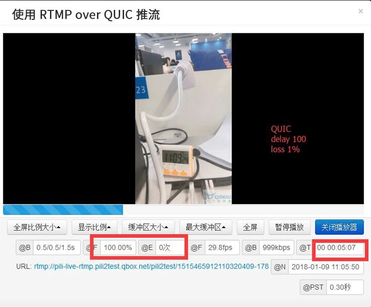

## 内容目录

\1. 直播痛点-卡顿

\2. QUIC 是什么？为什么可以减少卡顿？

\3. 实测在弱网环境下 QUIC 推流效果

\4. 如何接入七牛云 QUIC 解决方案？

## 直播痛点-卡顿

卡顿是最影响直播体验的因素之一，也是最难解决的问题之一。在流媒体的传输链路中，任何一个环节丢包都可能导致用户观看卡顿。

其中，主播端的推流卡顿最影响观看体验，会直接影响到所有观看直播的最终用户。主播推流卡顿在部分场景会特别显著，比如户外直播就非常考验在网络状况复杂的情况下推流的稳定性。

减少卡顿一直是开发者重大的技术挑战，七牛云作为互联网直播行业的先驱又有什么样的对策呢？

Google 从 2014 年推出 QUIC 协议后一直在音视频产品上实践该协议。现在，经过一年多的探索和实践，七牛云直播云产品已经拥抱 QUIC，最新推出的直播 QUIC 推流方案可以大幅度的降低直播的卡顿问题，可以在各种复杂网络环境下给客户提供优秀的直播体验。

## QUIC 是什么，为什么可以降低卡顿？

既然 QUIC 可以解决如此重要的直播体验问题，那么我们先从整体了解一下 QUIC 协议。

\1. QUIC 的定义是什么

\2. QUIC 在分层网络中所处的位置

\3. QUIC 在传输上为什么有优势

**1. QUIC 协议的定义**

QUIC 全称 Quick UDP Internet Connection, 是谷歌公司制定的一种基于 UDP 协议的低时延互联网传输协议。

我们知道，TCP/IP 协议族是互联网的基础。其中传输层协议只有两种： TCP 和 UDP 协议。与 TCP 协议相比，UDP 更为轻量，但是错误校验也要少得多。由于 UDP 是不可靠协议，不保证按序送达，所以其可靠性比不上 TCP 协议。

QUIC 传输层基于 UDP 协议但却是一种可靠的传输协议，因为它将很多可靠性的验证策略从系统层转移到应用层来做，这样可以使用更适合现代流媒体传输的拥塞控制策略。

**2. QUIC 在网络传输中所处的位置**

从图上可以看出，QUIC 传输层用 UDP 协议替代了 TCP。

**3. QUIC 在传输上为什么有优势**

从上面所有对 QUIC 的定义上来看，很明显 QUIC 的对比对象是 TCP。所以下面所有的优势的枚举都是基于 QUIC 和 TCP 的比较。

3.1 更出色的拥塞控制

虽然例如 HTTP/2 或者 SPDY 协议现在都支持将页面的多个数据通过一个数据链接进行传输，该特性也确实能够加快数据的传输速度。但是由于 TCP 协议在处理包时是有严格顺序的，所以还是会遇到队首阻塞的问题。

比如发生如下图所示场景下的问题时，当其中一个数据没有发送成功，TCP 连接需要等待这个包完成重传之后才能继续进行。因此，即使逻辑上一个 TCP 连接上并行的在进行多路数据传输，其他毫无关联的数据也会因此阻塞。

- (Source: QUIC: next generation multiplexed transport over UDP)

QUIC 协议直接通过传输层使用 UDP 协议就可以避免该问题的发送。由于 UDP 协议没有严格的顺序要求，当一个数据包遇到问题需要重传时只会影响该数据包对应的资源，其他独立的资源不会受到影响而阻塞传输。

3.2 QUIC 更加灵活

TCP 协议栈通常由操作系统层面来实现，例如如 Linux、Windows、iOS、Android 操作系统。因此如果要修改 TCP 协议需要从操作系统层面去做很多事情，这是一项复杂的工程。相对来说 UDP 协议在操作系统层面实现更为简单，QUIC 基于 UDP 在应用层做了很多网络拥塞控制层面的优化，帮助用户减少复杂网络下的卡顿率，提高流畅度，这是 TCP 无法做到的。

**4. 小结**

从以上所有的介绍中可以看出，如果我们需要使用 QUIC 改善直播体验，就是用它来代替直播中 TCP 协议所扮演的角色。大家都清楚目前直播所使用的协议都基本是 RTMP 协议,而 RTMP 协议的传输层是基于 TCP 协议。所以七牛的 QUIC 推流方案就是把 RTMP 当中的传输层协议换成 QUIC，从而达到推流卡顿率下降的效果。

## QUIC 的使用效果

上面说了那么多基于 QUIC 做媒体传输的理论优势，那么有没有实际的实验测试作为理论的支撑呢？下面一起来看看七牛云 QA 团队给出的测试数据吧。

测试的参数配置：

测试方式：

使用 ATC 模拟的弱网环境下，用 srs 播放器播放 5 mins，记录流畅度和卡顿次数。

\1. 弱网配置一

ATC配置：delay 100ms loss 1%

结果分别如图所示：

\2. 弱网配置二

ATC配置：delay 200ms loss 10%

而在 TCP 这种网络配置下，推不起来，或者推一会就会断开。

## 如何接入七牛云 QUIC 解决方案

我们相信很多客户已经发现 QUIC 推流这项技术对于自己产品的意义，它可以有效减少主播由于网络问题带来的烦恼。 客户只需要换上七牛最新版本的推流 SDK ，打开客户端上的 QUIC 推流开关，配合七牛云专为直播产品打造的实时流网络，即可让你的产品体验更加流畅。