# RTP协议

RTP（Real-time Transport Protocol）是由IETF开发的实时传输协议，可以在面向连接或无连接的下层协议上工作，通常和UDP协议一起使用。RTP的工作机理与RSVP不同，主要实现一种端到端的多媒体流同步控制机制，既不需要事先建立连接，也不需要中间节点的参与，为其保留资源。在网络带宽充足的情况下，RTP具有一定的带宽调控能力，保证端到端的多媒体流同步。在网络带宽不足时，RTP的带宽调控能力将受到一定的限制。ITU(国际电信联合会)的视频会议标准 H.323采用了RTP协议。

  RTP定义了两种报文：RTP报文和RTCP报文，RTP报文用于传送媒体数据（如音频和视频），它由 RTP报头和数据两部分组成，RTP数据部分称为有效载荷(payload)；RTCP报文用于传送控制信息，以实现协议控制功能。RTP报文和RTCP 报文将作为下层协议的数据单元进行传输。如果使用UDP，则RTP报文和RTCP报文分别使用两个相邻的UDP端口，RTP报文使用低端口，RTCP报文使用高端口。如果使用其它的下层协议，RTP报文和RTCP报文可以合并，放在一个数据单元中一起传送，控制信息在前，媒体数据在后。通常，RTP是由应用程序实现的。

------

### 1 RTP报文格式

  RTP报文由两部分组成：报头和有效载荷。RTP报头格式如下图所示，其中：

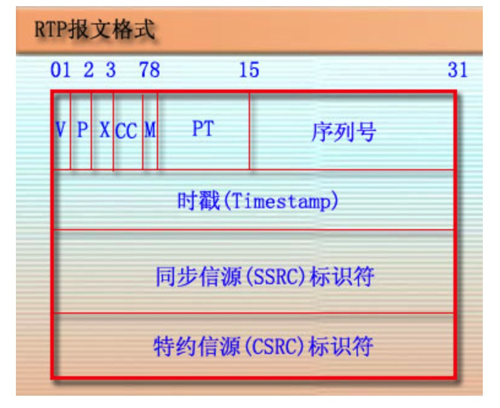

  ·V：RTP协议的版本号，占2位，当前协议版本号为2。

  ·P：填充标志，占1位，如果P=1，则在该报文的尾部将填充一个或多个额外的八位组，它们不是有效载荷的一部分。

  ·X：扩展标志，占1位，如果X=1，则在RTP报头后跟有一个扩展报头。

  ·CC：CSRC计数器，占 4位，指示CSRC 标识符的个数。

  ·M: 标记，占1位，不同的有效载荷有不同的含义，对于视频，标记一帧的结束；对于音频，标记会话的开始。

  ·PT: 有效载荷类型，占7位，用于说明RTP报文中有效载荷的类型，如GSM音频、JPEM图像等。

  ·序列号：占16位，用于标识发送者所发送的RTP报文的序列号，每发送一个报文，序列号增1。接收者通过序列号来检测报文丢失情况，重新排序报文，恢复数据。

  ·时戳 (Timestamp)：占32位，时戳反映了该RTP报文的第一个八位组的采样时刻。接收者使用时戳来计算延迟和延迟抖动，并进行同步控制。

  ·同步信源(SSRC)标识符：占32位，用于标识同步信源。该标识符是随机选择的，参加同一视频会议的两个同步信源不能有相同的SSRC。

  ·特约信源(CSRC)标识符：每个CSRC标识符占32位，可以有0～15个。每个CSRC标识了包含在该RTP报文有效载荷中的所有特约信源。

  这里的同步信源是指产生媒体流的信源，它通过RTP报头中的一个32位数字SSRC标识符来标识，而不依赖于网络地址，接收者将根据SSRC标识符来区分不同的信源，进行RTP报文的分组。特约信源是指当混合器接收到一个或多个同步信源的RTP报文后，经过混合处理产生一个新的组合RTP报文，并把混合器作为组合RTP报文的 SSRC，而将原来所有的SSRC都作为CSRC传送给接收者，使接收者知道组成组合报文的各个SSRC。

  在发送端，上层应用程序以分组形式将编码后的媒体数据传给RTP通信模块，作为RTP报文的有效载荷，RTP通信模块将根据上层应用提供的参数在有效载荷前添加RTP报头，形成 RTP报文，通过Socket接口选择UDP协议发送出去。

  在接收端，RTP通信模块通过Socket接口接收到RTP报文后，将RTP报头分离出来作相应处理，再将RTP报文的有效载荷作为数据分组传递给上层应用。

  考虑到在Internet这种复杂的环境中举行视频会议，RTP定义了两种中间系统：混合器(Mixer)和转换器(Translator)。

  在Internet上举行视频会议时，可能有少数参加者通过低速链路与使用高速网络的多数参加者相连接。为了不强制所有会议参加者都使用低带宽和低质量的数据编码，RTP允许在低带宽区域附近使用混合器作为RTP级中继器。混合器从一个或多个信源接收RTP 报文，对到达的数据报文进行重新同步和重新组合，这些重组的数据流被混合成一个数据流，将数据编码转化为在低带宽上可用的类型，并通过低速链路向低带宽区域转发。为了对多个输入信源进行统一的同步，混合器在多个媒体流之间进行定时调整，产生它自己的定时同步，因此所有从混合器输出的报文都把混合器作为同步信源。为了保证接收者能够正确识别混合器处理前的原始报文发送者，混合器在RTP报头中设置了CSRC标识符队列，以标识那些产生混和报文的原始同步信源。

  在Internet环境中，一些会议的参加者可能被隔离在应用级防火墙的外面，这些参加者被禁止直接使用 IP组播地址进行访问，虽然他们可能是通过高速链路连接的。在这些情况下，RTP允许使用转换器作为RTP级中继器。在防火墙两端分别安装一个转换器，防火墙之外的转换器过滤所有接收到的组播报文，并通过一条安全的连接传送给防火墙之内的转换器，内部转换器将这些组播报文再转发送给内部网络中的组播组成员。

### 2 基于RTP的带宽控制方法

  为了实时传输数据，RTP利用了简单而快捷的UDP协议实现网络传输。由于UDP协议是一种无连接传输协议，不保证报文传输的正确性和有序性，也不提供流量控制功能。另一方面，在多媒体通信中，由于多媒体数据的特殊性，不宜采用通常的重传纠错法来提供正确性，而是采用控制传送带宽方式来减少报文丢失，以满足多媒体应用所需的QoS。

  在RTP协议中，通过 RTCP报文提供了基于无连接传输协议的端到端控制机制，这是一种基于接收者反馈的网络传输QoS监测机制，在RTCP的接收报告中包含了当前网络传输 QoS有关信息，如报文丢失率、报文丢失累计、接收到的最高序列号、平均延迟抖动以及用于计算发布接收报告往返所需时间的时间标签等。发送者可通过这些信息监测和评价网络传输QoS状况，并可采取适当的策略实施同步控制。 

  RTP协议规定，每个RTP 系统必须实现RTCP的控制功能，由内部功能模块定期自动执行。RTCP报文是轻载信息，其信息量与最低的数据通信量相平衡，它所产生的通信量只是数据通信量的5%左右。

  要实施端到端的强制同步控制，其前提条件是发送端要能够获取网络失调状态信息。一种可行的同步控制策略是：各个接收端将一种轻载的网络失调状态信息（如 QoS参数状态）反馈给发送端，发送端据此进行强制性同步控制，以满足接收端演示质量的要求。 

  基于RTP的带宽控制算法正是利用这种控制策略来实施强制性同步控制的，其基本思想是在RTP协议机制支持下，发送端通过接收端周期反馈的接收报告来评价当前网络传输的QoS，并以此对数据发送速率进行适当调整。端点之间利用RTP报文和RTCP报文来实现带宽控制：

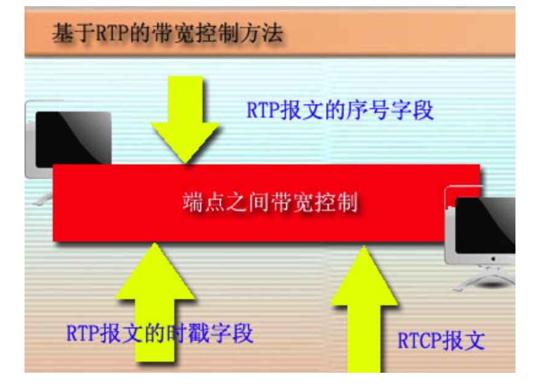

  (1) RTP报文的序号字段可用于排序RTP报文分组，以消除重复分组，保持视频或音频流内同步和连续地播放。

  (2)RTP报文的时戳字段可作为流间同步标识，以保持视频和音频流间同步和连续地播放。 

  (3) 发送者可利用接收者反馈的RTCP报文来制实施端到端的强制性同步控制，以改善当前网络传输的QoS。

------

#### 2.1.接收端的控制策略

  接收端通过RTP协议实施如下的控制策略：

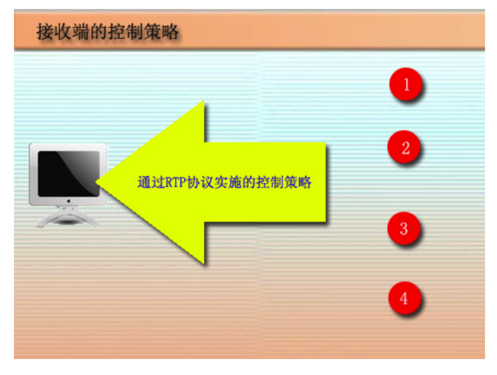

  ①SSRC字段用于标识不同的信源，以支持多对一或多对多的多媒体通信。

  ②时戳字段作为流间同步标识，用于媒体流间的流间控制，以保持视频和音频流间同步和连续地播放，并作为时间量用于计算报文分组的传输延时、延时抖动以及数据更新周期等，滤除严重延时的RTP报文分组。 

  ③序号字段作为流内同步标识，用于排序RTP报文分组，消除重复报文分组，保持视频或音频流内同步和连续地播放。

  ④将接收端检测到的当前网络 QoS状况通过RTCP的接收报告周期地反馈给发送端。 

------

#### 2.2.发送端的控制策略

  发送端将采用如下的控制算法来调整传送带宽。

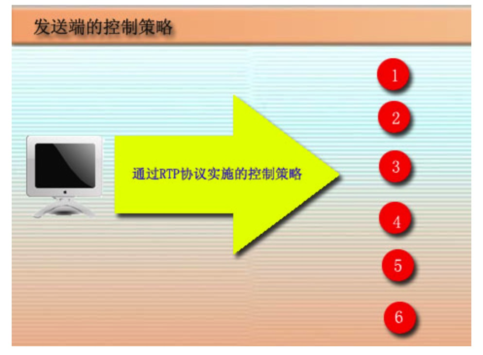

  ①设bs为发送端当前的带宽，bmin和bmax分别为应用所设置的最小带宽和最大带宽，且bs?[bmin，bmax]。

  ②在每个发送带宽级上保持一个时间片，超时后将根据网络QoS状况提高或降低一个带宽级，以避免带宽频繁波动。这里使用报文丢失率作为QoS指示器，并设置一个阈值。如果QoS指示器超阈，说明网络发生阻塞，通过改变发送速率来调整传送带宽，疏导网络交通。 

  ③初始时按最大带宽发送报文分组，即bs?bmax，以提高网络通道的利用率。

  ④如果在规定的时间片内 QoS指示器超阈，说明网络发生阻塞，则在超时后需要降低一个带宽级，即bs? max { bs-μ, bmin }，其中μ为比例因子。

  ⑤如果在规定的时间片内 QoS指示器未超阈，说明网络交通状况良好，则在超时后应当提高一个带宽级，即bs? min { bs+μ, bmax }。 

  ⑥在点到多点通信场合中，发送者将面对多个不同网段上的接收者，而每个网段的交通状况又不尽相同。因此，在改变带宽时可采用多数表决法，即当报文丢失率超阈的接收者超过一定比例时再改变带宽。

  这种方法的特点是：利用 RTP协议机制来传送网络状态信息，不需要另外构造网络检测机构，易于实现；RTCP报文是一种轻载报文，占用较少的通信带宽。

------

[RTP与RTCP协议介绍](http://www.360doc.com/content/20/1130/09/false)

 

**1****．流媒体( Streaming Media)

**1.1流媒体概念**

**   流媒体技术是网络技术和多媒体技术发展到一定阶段的产物。术语流媒体既可以指在网上传输连续时基媒体的流式技术,也可以指使用流式技术的连续时基媒体本身。在网上传输音频、视频等多媒体信息目前主要有两种方式:下载和流式传输。采用下载方式,用户需要先下载整个媒体文件,然后才能进行播放。由于网络带宽的限制,下载常常要花很长时间,所以这种处理方式延迟很大。而流媒体实现的关键技术是流式传输。传输之前首先对多媒体进行预处理(降低质量和高效压缩) ,然后使用缓存系统来保证数据连续正确地进行传输。使用流式传输方式,用户不必像采用下载方式那样要等到整个文件全部下载完毕,而是只需经过几秒到几十秒的启动延时即可在客户端进行播放和观看。此时媒体文件的剩余部分将在后台继续下载。与单纯的下载方式相比,这种对多媒体文件边下载边播放的流式传输方式不仅使启动延时大幅度地缩短,而且对系统缓存容量的需求也大大降低。使用流式传输的另一个好处是使传输那些事先不知道或无法知道大小的媒体数据(如网上直播、视频会议等) 成为可能。

到目前为止,Internet 上使用较多的流式视频格式主要有以下三种:RealNetworks 公司的RealMedia ,Apple 公司的QuickTime 以及Microsoft 公司的Advanced Streaming Format (ASF) 。 

1.2支持流媒体的协议

   多媒体应用的一个显著特点是数据量大,并且许多应用对实时性要求比较高。传统的TCP 协议是一个面向连接的协议,它的重传机制和拥塞控制机制都是不适用于实时多媒体传输的。RTP 是一个应用型的传输层协议,它并不提供任何传输可靠性的保证和流量的拥塞控制机制。RTP 位于UDP(User Datagram Protocol) 之上。UDP 虽然没有TCP 那么可靠,并且无法保证实时业务的服务质量,需要RTCP 实时监控数据传输和服务质量。但是,由于UDP 的传输时延低于TCP ,能与音频和视频很好地配合。因此,在实际应用中,RTP/ RTCP/ UDP 用于音频/ 视频媒体,而TCP 用于数据和控制信令的传输。目前,支持流媒体传输的协议主要有实时传输协议RTP( Real-Time Transport Protocol) 、实时传输控制协议RTCP(Real-Time Transport Control Protocol) 和实时流协议RTSP(Real-Time Streaming Protocol) 等。下面分别对这三种协议作简要介绍。流媒体协议栈如图1 所示。

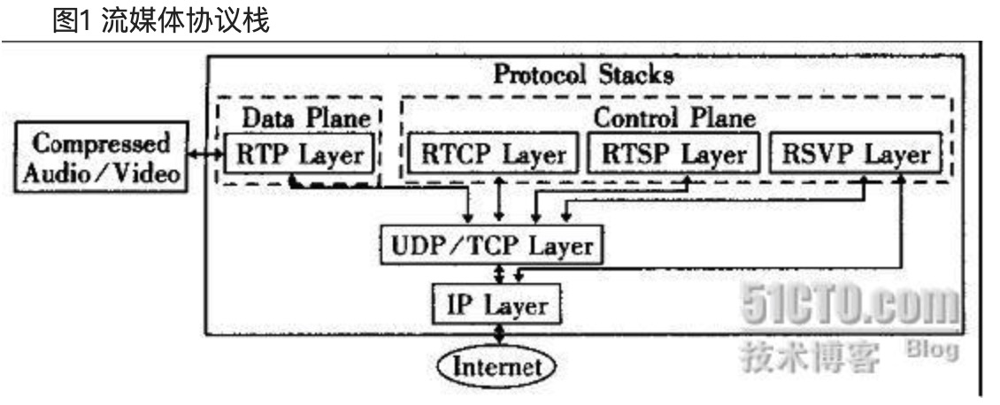

** **2．实时传输协议RTP（Real-Time Transport Protocol）：**

   RTP是针对Internet上多媒体数据流的一个传输协议, 由IETF(Internet工程任务组)作为RFC1889发布。RTP被定义为在一对一或一对多的传输情况下工作，其目的是提供时间信息和实现流同步。RTP的典型应用建立在UDP上，但也可以在TCP或ATM等其他协议之上工作。RTP本身只保证实时数据的传输，并不能为按顺序传送数据包提供可靠的传送机制，也不提供流量控制或拥塞控制，它依靠RTCP提供这些服务。 

2.1 RTP工作机制

威胁多媒体数据传输的一个尖锐的问题就是不可预料数据到达时间。但是流媒体的传输是需要数据的适时的到达用以播放和回放。rtp协议就是提供了时间标签,序列号以及其它的结构用于控制适时数据的流放。在流的概念中”时间标签”是最重要的信息。发送端依照即时的采样在数据包里隐蔽的设置了时间标签。在接受端收到数据包后,就依照时间标签按照正确的速率恢复成原始的适时的数据。不同的媒体格式调时属性是不一样的。但是rtp本身并不负责同步，rtp只是传输层协议，为了简化运输层处理，提高该层的效率。将部分运输层协议功能（比如流量控制）上移到应用层完成。同步就是属于应用层协议完成的。它没有运输层协议的完整功能，不提供任何机制来保证实时地传输数据，不支持资源预留，也不保证服务质量。rtp报文甚至不包括长度和报文边界的描述。同时rtp协议的数据报文和控制报文的使用相邻的不同端口，这样大大提高了协议的灵活性和处理的简单性。rtp协议和udp二者共同完成运输层协议功能。udp协议只是传输数据包，不管数据包传输的时间顺序。 rtp的协议数据单元是用udp分组来承载的。在承载rtp数据包的时候，有时候一帧数据被分割成几个包具有相同的时间标签，则可以知道时间标签并不是必须的。而udp的多路复用让rtp协议利用支持显式的多点投递，可以满足多媒体会话的需求。rtp协议虽然是传输层协议但是它没有作为osi体系结构中单独的一层来实现。rtp协议通常根据一个具体的应用来提供服务，rtp只提供协议框架，开发者可以根据应用的具体要求对协议进行充分的扩展。 **

**2.2 RTP协议的报文结构

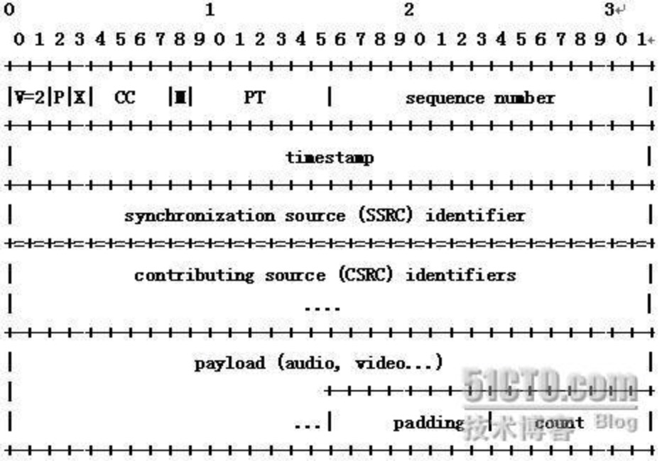

**开始12个八进制出现在每个RTP包中，而CSRC标识列表仅出现在混合器插入时。各段含义如下：**

* ①版本（V）2位，标识RTP版本。**  
* ** ②填充标识（P）1位，如设置填充位，在包尾将包含附加填充字，它不属于有效载荷。填充的最后一个八进制包含应该忽略的八进制计数。某些加密算法需要固定大小的填充字，或为在底层协议数据单元中携带几个RTP包。
*  ③扩展（X）1位，如设置扩展位，固定头后跟一个头扩展。
*  ④CSRC计数（CC）4位，CSRC计数包括紧接在固定头后CSRC标识符个数。
*  ⑤标记（M）1位，标记解释由设置定义，目的在于允许重要事件在包流中标记出来。设置可定义其他标示位，或通过改变位数量来指定没有标记位。
*  ⑥载荷类型（PT）7位，记录后面资料使用哪种 Codec ， receiver 端找出相应的 decoder 解碼出來。 常用 types：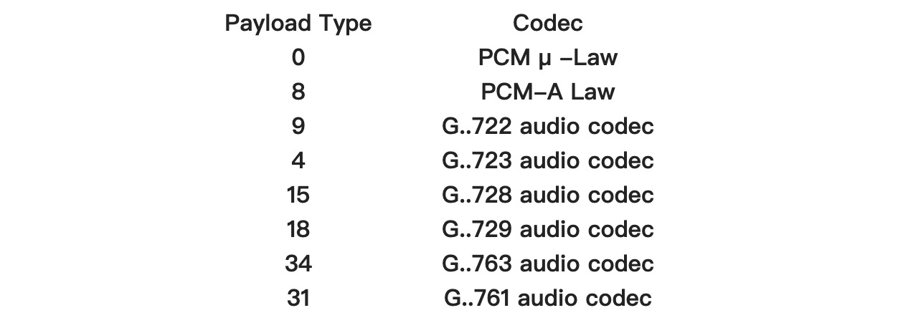
*  ⑦系列号16位，系列号随每个RTP数据包而增加1，由接收者用来探测包损失。系列号初值是随机的，使对加密的文本攻击更加困难。
*  ⑧时标32位，时标反映RTP数据包中第一个八进制数的采样时刻，采样时刻必须从单调、线性增加的时钟导出，以允许同步与抖动计算。时标可以让receiver端知道在正确的时间将资料播放出来。

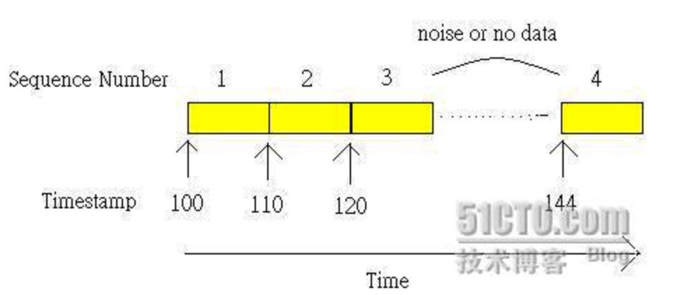

由上图可知，如果只有系列号，并不能完整按照顺序的将data播放出来，因为如果data中间有一段是没有资料的，只有系列号的话会造成错误，需搭配上让它知道在哪个时间将data正确播放出来，如此我们才能播放出正确无误的信息。

 ⑨SSRC32位，SSRC段标识同步源。此标识不是随机选择的，目的在于使同一RTP包连接中没有两个同步源有相同的SSRC标识。尽管多个源选择同一个标识的概率很低，所有RTP实现都必须探测并解决冲突。如源改变源传输地址，也必须选择一个新SSRC标识以避免插入成环行源。

 ⑩CSRC列表0到15项，每项32位。CSRC列表表示包内的对载荷起作用的源。标识数量由CC段给出。如超出15个作用源，也仅标识15个。CSRC标识由混合器插入，采用作用源的SSRC标识。 

**3****．实时传输控制协议RTCP(Real-Time Transport Control Protocol)

**RTCP负责管理传输质量在当前应用进程之间交换控制信息。在RTP会话期间，各参与者周期性地传送RTCP包，包中含有已发送的数据包的数量、丢失的数据包的数量等统计资料。因此，服务器可以利用这些信息动态地改变传输速率，甚至改变有效载荷类型。RTP和RTCP配合使用，能以有效的反馈和最小的开销使传输效率最佳化，故特别适合传送网上的实时数据。**

** 3.1 RTCP工作机制

当应用程序开始一个rtp会话时将使用两个端口：一个给rtp，一个给rtcp。rtp本身并不能为按顺序传送数据包提供可靠的传送机制，也不提供流量控制或拥塞控制，它依靠rtcp提供这些服务。在rtp的会话之间周期的发放一些rtcp包以用来传监听服务质量和交换会话用户信息等功能。rtcp包中含有已发送的数据包的数量、丢失的数据包的数量等统计资料。因此，服务器可以利用这些信息动态地改变传输速率，甚至改变有效载荷类型。rtp和rtcp配合使用，它们能以有效的反馈和最小的开销使传输效率最佳化，因而特别适合传送网上的实时数据。根据用户间的数据传输反馈信息，可以制定流量控制的策略，而会话用户信息的交互，可以制定会话控制的策略。 

3.2 RTCP数据报

在RTCP通信控制中，RTCP协议的功能是通过不同的RTCP数据报来实现的，主要有如下几种类型：
①SR:发送端报告，所谓发送端是指发出RTP数据报的应用程序或者终端，发送端同时也可以是接收端。
②RR:接收端报告，所谓接收端是指仅接收但不发送RTP数据报的应用程序或者终端。③SDES:源描述，主要功能是作为会话成员有关标识信息的载体，如用户名、邮件地址、电话号码等，此外还具有向会话成员传达会话控制信息的功能。
④BYE:通知离开，主要功能是指示某一个或者几个源不再有效，即通知会话中的其他成员自己将退出会话。
⑤APP:由应用程序自己定义，解决了RTCP的扩展性问题，并且为协议的实现者提供了很大的灵活性。

 **4．资源预订协议RSVP (Resorce Reservation Protocol)**

由于音频和视频数据流比传统数据对网络的延时更敏感，要在网络中传输高质量的音频、视频信息，除带宽要求之外，还需其他更多的条件。RSVP是Internet上的资源预订协议，使用RSVP预留部分网络资源(即带宽)，能在一定程度上为流媒体的传输提供QoS。

------

[**RTP协议分析**](http://www.360doc.com/content/20/1130/09/false)

# 第1章.   RTP概述

## 1.1. RTP是什么

RTP全名是Real-time Transport Protocol（实时传输协议）。它是IETF提出的一个标准，对应的RFC文档为RFC3550（RFC1889为其过期版本）。RFC3550不仅定义了RTP，而且定义了配套的相关协议RTCP（Real-time Transport Control Protocol，即实时传输控制协议）。RTP用来为IP网上的语音、图像、传真等多种需要实时传输的多媒体数据提供端到端的实时传输服务。RTP为Internet上端到端的实时传输提供时间信息和流同步，但并不保证服务质量，服务质量由RTCP来提供。

## 1.2. RTP的应用环境

RTP用于在单播或多播网络中传送实时数据。它们典型的应用场合有如下几个。

简单的多播音频会议。语音通信通过一个多播地址和一对端口来实现。一个用于音频数据（RTP），另一个用于控制包（RTCP）。

音频和视频会议。如果在一次会议中同时使用了音频和视频会议，这两种媒体将分别在不同的RTP会话中传送，每一个会话使用不同的传输地址（IP地址＋端口）。如果一个用户同时使用了两个会话，则每个会话对应的RTCP包都使用规范化名字CNAME（Canonical Name）。与会者可以根据RTCP包中的CNAME来获取相关联的音频和视频，然后根据RTCP包中的计时信息(Network time protocol)来实现音频和视频的同步。

翻译器和混合器。翻译器和混合器都是RTP级的中继系统。翻译器用在通过IP多 播不能直接到达的用户区，例如发送者和接收者之间存在防火墙。当与会者能接收的音频编码格式不一样，比如有一个与会者通过一条低速链路接入到高速会议，这 时就要使用混合器。在进入音频数据格式需要变化的网络前，混合器将来自一个源或多个源的音频包进行重构，并把重构后的多个音频合并，采用另一种音频编码进 行编码后，再转发这个新的RTP包。从一个混合器出来的所有数据包要用混合器作为它们的同步源（SSRC，见RTP的封装）来识别，可以通过贡献源列表（CSRC表，见RTP的封装）可以确认谈话者。

## 1.3. 相关概念

### 1.3.1. 流媒体

流媒体是指Internet上使用流式传输技术的连续时基媒体。当前在Internet上传输音频和视频等信息主要有两种方式：下载和流式传输两种方式。

下载情况下，用户需要先下载整个媒体文件到本地，然后才能播放媒体文件。在视频直播等应用场合，由于生成整个媒体文件要等直播结束，也就是用户至少要在直播结束后才能看到直播节目，所以用下载方式不能实现直播。

流式传输是实现流媒体的关键技术。使用流式传输可以边下载边观看流媒体节目。由于Internet是基于分组传输的，所以接收端收到的数据包往往有延迟和乱序（流式传输构建在UDP上）。要实现流式传输，就是要从降低延迟和恢复数据包时序入手。在发送端，为降低延迟，往往对传输数据进行预处理（降低质量和高效压缩）。在接收端为了恢复时序，采用了接收缓冲；而为了实现媒体的流畅播放，则采用了播放缓冲。

使用接收缓冲，可以将接收到的数据包缓存起来，然后根据数据包的封装信息（如包序号和时戳等），将乱序的包重新排序，最后将重新排序了的数据包放入播放缓冲播放。

为什么需要播放缓冲呢？容易想到，由于网络不可能很理想，并且对数据包排序需要处理时耗，我们得到排序好的数据包的时间间隔是不等的。如果不用播放缓冲，那么播放节目会很卡，这叫时延抖动。相反，使用播放缓冲，在开始播放时，花费几十秒钟先将播放缓冲填满（例如PPLIVE），可以有效地消除时延抖动，从而在不太损失实时性的前提下实现流媒体的顺畅播放。

到目前为止,Internet 上使用较多的流式视频格式主要有以下三种:RealNetworks 公司的RealMedia ,Apple 公司的QuickTime 以及Microsoft 公司的Advanced Streaming Format (ASF) 。

上面在谈接收缓冲时，说到了流媒体数据包的封装信息（包序号和时戳等），这在后面的RTP封装中会有体现。另外，RealMedia这些流式媒体格式只是编解码有不同，但对于RTP来说，它们都是待封装传输的流媒体数据而没有什么不同。

# 第2章.   RTP详解

## 2.1. RTP的协议层次

### 2.1.1. 传输层的子层

RTP（实时传输协议），顾名思义它是用来提供实时传输的，因而可以看成是传输层的一个子层。图 1给出了流媒体应用中的一个典型的协议体系结构。

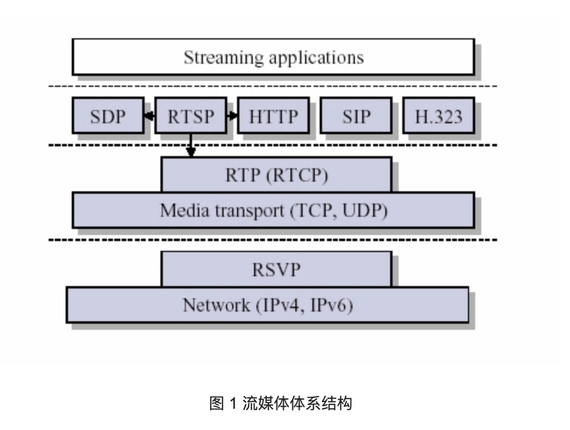

从图中可以看出，RTP被划分在传输层，它建立在UDP上。同UDP协议一样，为了实现其实时传输功能，RTP也有固定的封装形式。RTP用来为端到端的实时传输提供时间信息和流同步，但并不保证服务质量。服务质量由RTCP来提供。这些特点，在第4章可以看到。

### 2.1.2. 应用层的一部分

不少人也把RTP归为应用层的一部分，这是从应用开发者的角度来说的。操作系统中的TCP/IP等协议栈所提供的是我们最常用的服务，而RTP的实现还是要靠开发者自己。因此从开发的角度来说，RTP的实现和应用层协议的实现没不同，所以可将RTP看成应用层协议。

RTP实现者在发送RTP数据时，需先将数据封装成RTP包，而在接收到RTP数据包，需要将数据从RTP包中提取出来。

## 2.2. RTP的封装

一个协议的封装是为了满足协议的功能需求的。从前面提出的功能需求，可以推测出RTP封装中应该有同步源和时戳等字段，但更为完整的封装是什么样子呢？请看图2。

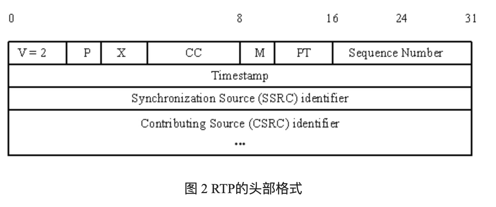

版本号（V）：2比特，用来标志使用的RTP版本。

填充位（P）：1比特，如果该位置位，则该RTP包的尾部就包含附加的填充字节。

扩展位（X）：1比特，如果该位置位的话，RTP固定头部后面就跟有一个扩展头部。

CSRC计数器（CC）：4比特，含有固定头部后面跟着的CSRC的数目。

标记位（M）：1比特,该位的解释由配置文档（Profile）来承担.

载荷类型（PT）：7比特，标识了RTP载荷的类型。

序列号（SN）：16比特，发送方在每发送完一个RTP包后就将该域的值增加1，接收方可以由该域检测包的丢失及恢复包序列。序列号的初始值是随机的。

时间戳：32比特，记录了该包中数据的第一个字节的采样时刻。在一次会话开始时，时间戳初始化成一个初始值。即使在没有信号发送时，时间戳的数值也要随时间而不断地增加（时间在流逝嘛）。时间戳是去除抖动和实现同步不可缺少的。

同步源标识符(SSRC)：32比特，同步源就是指RTP包流的来源。在同一个RTP会话中不能有两个相同的SSRC值。该标识符是随机选取的 RFC1889推荐了MD5随机算法。

贡献源列表（CSRC List）：0～15项，每项32比特，用来标志对一个RTP混合器产生的新包有贡献的所有RTP包的源。由混合器将这些有贡献的SSRC标识符插入表中。SSRC标识符都被列出来，以便接收端能正确指出交谈双方的身份。

## 2.3. RTCP的封装

RTP需要RTCP为其服务质量提供保证，因此下面介绍一下RTCP的相关知识。

RTCP的主要功能是：服务质量的监视与反馈、媒体间的同步，以及多播组中成员的标识。在RTP会话期 间，各参与者周期性地传送RTCP包。RTCP包中含有已发送的数据包的数量、丢失的数据包的数量等统计资料，因此，各参与者可以利用这些信息动态地改变传输速率，甚至改变有效载荷类型。RTP和RTCP配合使用，它们能以有效的反馈和最小的开销使传输效率最佳化，因而特别适合传送网上的实时数据。

从图 1可以看到，RTCP也是用UDP来传送的，但RTCP封装的仅仅是一些控制信息，因而分组很短，所以可以将多个RTCP分组封装在一个UDP包中。RTCP有如下五种分组类型。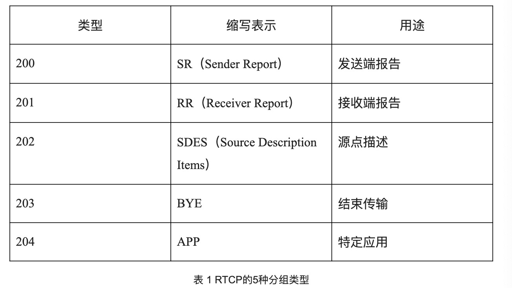上述五种分组的封装大同小异，下面只讲述SR类型，而其它类型请参考RFC3550。

发送端报告分组SR（Sender Report）用来使发送端以多播方式向所有接收端报告发送情况。SR分组的主要内容有：相应的RTP流的SSRC，RTP流中最新产生的RTP分组的时间戳和NTP，RTP流包含的分组数，RTP流包含的字节数。SR包的封装如图3所示。

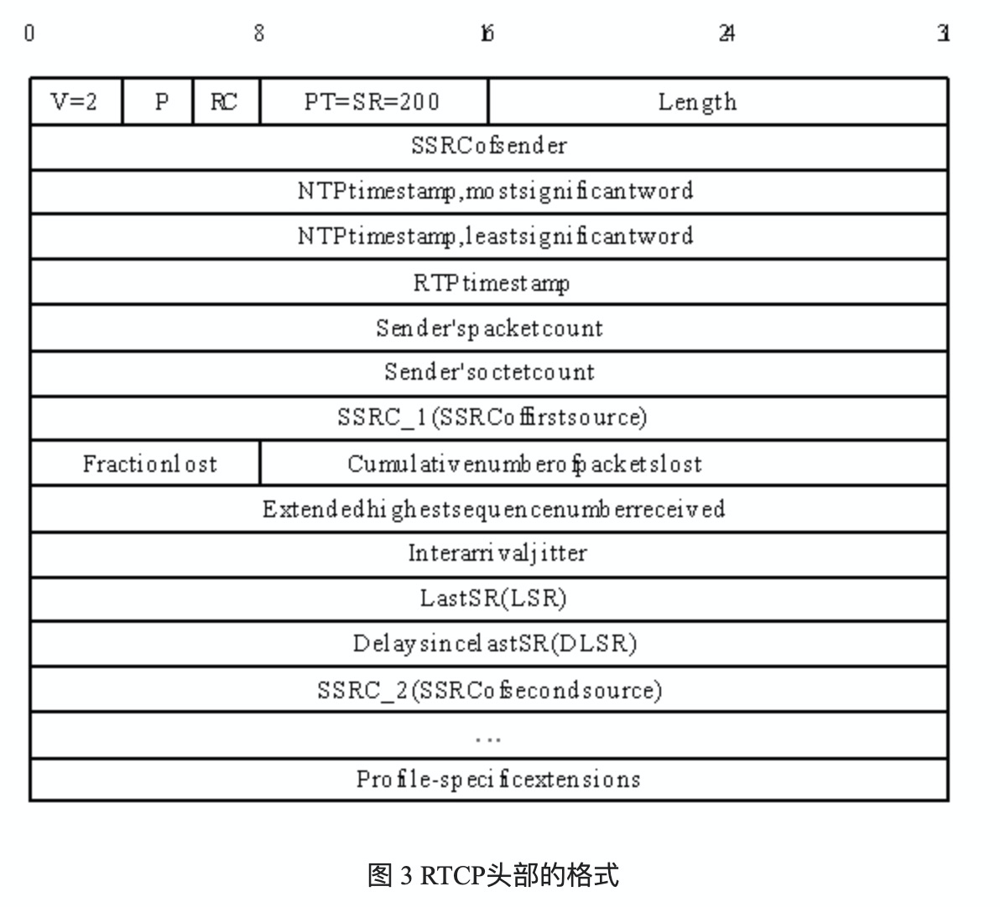

版本（V）：同RTP包头域。

填充（P）：同RTP包头域。

接收报告计数器（RC）：5比特，该SR包中的接收报告块的数目，可以为零。

包类型（PT）：8比特，SR包是200。

长度域（Length）：16比特，其中存放的是该SR包以32比特为单位的总长度减一。

同步源（SSRC）：SR包发送者的同步源标识符。与对应RTP包中的SSRC一样。

NTP Timestamp（Network time protocol）SR包发送时的绝对时间值。NTP的作用是同步不同的RTP媒体流。

RTP Timestamp：与NTP时间戳对应，与RTP数据包中的RTP时间戳具有相同的单位和随机初始值。

Sender’s packet count：从开始发送包到产生这个SR包这段时间里，发送者发送的RTP数据包的总数. SSRC改变时，这个域清零。

Sender`s octet count：从开始发送包到产生这个SR包这段时间里，发送者发送的净荷数据的总字节数（不包括头部和填充）。发送者改变其SSRC时，这个域要清零。

同步源n的SSRC标识符：该报告块中包含的是从该源接收到的包的统计信息。

丢失率（Fraction Lost）：表明从上一个SR或RR包发出以来从同步源n(SSRC_n)来的RTP数据包的丢失率。

累计的包丢失数目：从开始接收到SSRC_n的包到发送SR,从SSRC_n传过来的RTP数据包的丢失总数。

收到的扩展最大序列号：从SSRC_n收到的RTP数据包中最大的序列号，

接收抖动（Interarrival jitter）：RTP数据包接受时间的统计方差估计

上次SR时间戳（Last SR,LSR）：取最近从SSRC_n收到的SR包中的NTP时间戳的中间32比特。如果目前还没收到SR包，则该域清零。

上次SR以来的延时（Delay since last SR,DLSR）：上次从SSRC_n收到SR包到发送本报告的延时。

## 2.4. RTP的会话过程

当应用程序建立一个RTP会话时，应用程序将确定一对目的传输地址。目的传输地址由一个网络地址和一对端口组成，有两个端口：一个给RTP包，一个给RTCP包，使得RTP/RTCP数据能够正确发送。RTP数据发向偶数的UDP端口，而对应的控制信号RTCP数据发向相邻的奇数UDP端口（偶数的UDP端口＋1），这样就构成一个UDP端口对。 RTP的发送过程如下，接收过程则相反。

**1)**    RTP协议从上层接收流媒体信息码流（如H.263），封装成RTP数据包；RTCP从上层接收控制信息，封装成RTCP控制包。

**2)**    RTP将RTP 数据包发往UDP端口对中偶数端口；RTCP将RTCP控制包发往UDP端口对中的接收端口。

# 第3章.   相关的协议

## 3.1. 实时流协议RTSP

实时流协议RTSP（Real-Time Streaming Protocol）是IETF提出的协议，对应的RFC文档为RFC2362。

从图 1可以看出，RTSP是一个应用层协议（TCP/IP网络体系中）。它以C/S模式工作，它是一个多媒体播放控制协议，主要用来使用户在播放流媒体时可以像操作本地的影碟机一样进行控制，即可以对流媒体进行暂停/继续、后退和前进等控制。

## 3.2. 资源预定协议RSVP

资源预定协议RSVP(Resource Reservation Protocol)是IETF提出的协议，对应的RFC文档为RFC2208。

从图 1可以看出，RSVP工作在IP层之上传输层之下，是一个网络控制协议。RSVP通过在路由器上预留一定的带宽，能在一定程度上为流媒体的传输提供服务质量。在某些试验性的系统如网络视频会议工具vic中就集成了RSVP。

# 第4章.   常见的疑问

## 4.1. 怎样重组乱序的数据包

可以根据RTP包的序列号来排序。

## 4.2. 怎样获得数据包的时序

可以根据RTP包的时间戳来获得数据包的时序。

## 4.3. 声音和图像怎么同步

根据声音流和图像流的相对时间（即RTP包的时间戳），以及它们的绝对时间（即对应的RTCP包中的RTCP），可以实现声音和图像的同步。

## 4.4. 接收缓冲和播放缓冲的作用

如1.3.1所述，接收缓冲用来排序乱序了的数据包；播放缓冲用来消除播放的抖动，实现等时播放。

# 第5章.   实现方案

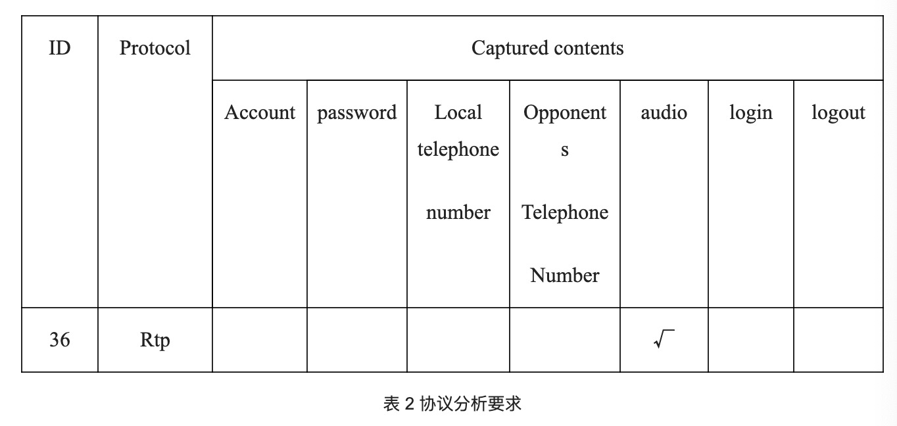

表 2给出了协议分析要求。容易看出要获取RTP音频包中的音频信息很容易，直接将RTP包的包头去掉即可。当然，要成功地播放解码获取到的音频流，需要知道其编码，这可从RTP包包头的有效载荷类型字段（PT）获得。

# 第6章.   参考资料

[1]   RFC文档：RFC3550对应RTP/RTCP，RFC2362对应RTSP，RFC2208对应RSVP

[2]   http://www.faqs.org/rfcs/，上面有全面的英文RFC文档

[3]   http://www.cnpaf.net/，有不少协议分析文档，也有中文RFC文档，但质量不是特别高。

------

[RTP传输中的时间戳](http://www.360doc.com/content/20/1130/09/false)

  首先，了解几个基本概念：

  时间戳单位：时间戳计算的单位不是秒之类的单位，而是由采样频率所代替的单位，这样做的目的就是为了是时间戳单位更为精准。比如说一个音频的采样频率为8000Hz，那么我们可以把时间戳单位设为1 / 8000。
  时间戳增量：相邻两个RTP包之间的时间差（以时间戳单位为基准）。
  采样频率： 每秒钟抽取样本的次数，例如音频的采样率一般为8000Hz
  帧率：   每秒传输或者显示帧数，例如25f/s

  再看看RTP时间戳课本中的定义：

  RTP包头的第2个32Bit即为RTP包的时间戳，Time Stamp ，占32位。
  时间戳反映了RTP分组中的数据的第一个字节的采样时刻。在一次会话开始时的时间戳初值也是随机选择的。即使是没有信号发送时，时间戳的数值也要随时间不 断的增加。接收端使用时间戳可准确知道应当在什么时间还原哪一个数据块，从而消除传输中的抖动。时间戳还可用来使视频应用中声音和图像同步。
  在RTP协议中并没有规定时间戳的粒度，这取决于有效载荷的类型。因此RTP的时间戳又称为媒体时间戳，以强调这种时间戳的粒度取决于信号的类型。例如， 对于8kHz采样的话音信号，若每隔20ms构成一个数据块，则一个数据块中包含有160个样本（0.02×8000=160）。因此每发送一个RTP分 组，其时间戳的值就增加160。

  官方的解释看懂没？没看懂？没关系，我刚开始也没看懂，那就听我的解释吧。

  首先，时间戳就是一个值，用来反映某个数据块的产生（采集）时间点的，后采集的数据块的时间戳肯定是大于先采集的数据块的。有了这样一个时间戳，就可以标记数据块的先后顺序。
  第二，在实时流传输中，数据采集后立刻传递到RTP模块进行发送，那么，其实，数据块的采集时间戳就直接作为RTP包的时间戳。
  第三，如果用RTP来传输固定的文件，则这个时间戳就是读文件的时间点，依次递增。这个不再我们当前的讨论范围内，暂时不考虑。
  第四，时间戳的单位采用的是采样频率的倒数，例如采样频率为8000Hz时，时间戳的单位为1 / 8000 ，在Jrtplib库中，有设置时间戳单位的函数接口，而ORTP库中根据负载类型直接给定了时间戳的单位（音频负载1/8000，视频负载1/90000）
  第五，时间戳增量是指两个RTP包之间的时间间隔，详细点说，就是发送第二个RTP包相距发送第一个RTP包时的时间间隔（单位是时间戳单位）。
  如果采样频率为90000Hz，则由上面讨论可知，时间戳单位为1/90000，我们就假设1s钟被划分了90000个时间块，那么，如果每秒发送25 帧，那么，每一个帧的发送占多少个时间块呢？当然是 90000/25 = 3600。因此，我们根据定义“时间戳增量是发送第二个RTP包相距发送第一个RTP包时的时间间隔”，故时间戳增量应该为3600。
  在 Jrtplib中好像不需要自己管理时间戳的递增，由库内部管理。但在ORTP中每次数据的发送都需要自己传入时间戳的值，即自己需要每次发完一个RTP 包后，累加时间戳增量，不是很方便，这就需要自己对RTP的时间戳有比较深刻地理解，我刚开始就是因为没搞清楚，随时设置时间戳增量导致传输一直有问题， 困扰我好久。

------

[为什么要使用RTP](http://www.360doc.com/content/20/1130/09/false)

一提到流媒体传输、一谈到什么视频监控、视频会议、语音电话（VOIP），都离不开RTP协议的应用，但当大家都根据经验或者别人的应用而选择RTP协议的时候，你可曾想过，为什么我们要使用RTP来进行流媒体的传输呢？为什么我们一定要用RTP？难道TCP、UDP或者其他的网络协议不能达到我们的要求么？

本文就是根据我在RTP协议的学习和应用过程中整理出来的思考，希望对大家有所启发，同时，也欢迎大家留言探讨，提出自己的想法和思考。

***1.\***   ***维基百科的相关解释\***

Reliable protocols, such as the Transmission Control Protocol (TCP), guarantee correct delivery of each bit in the media stream. However, they accomplish this with a system of timeouts and retries, which makes them more complex to implement. It also means that when there is data loss on the network, the media stream stalls while the protocol handlers detect the loss and retransmit the missing data. Clients can minimize this effect by buffering data for display. While delay due to buffering is acceptable in video on demand scenarios, users of interactive applications such as video conferencing will experience a loss of fidelity if the delay that buffering contributes to exceeds 200 ms.

像TCP这样的可靠传输协议，通过超时和重传机制来保证传输数据流中的每一个bit的正确性，但这样会使得无论从协议的实现还是传输的过程都变得非常的复杂。而且，当传输过程中有数据丢失的时候，由于对数据丢失的检测（超时检测）和重传，会数据流的传输被迫暂停和延时。

或许你会说，我们可以利用客户端构造一个足够大的缓冲区来保证显示的正常，这种方法对于从网络播放音视频来说是可以接受的，但是对于一些需要实时交互的场合（如视频聊天、视频会议等），如果这种缓冲超过了200ms，将会产生难以接受的实时性体验。

***2.\*** ***为什么RTP\******可以解决上述时延问题\***

RTP协议是一种基于UDP的传输协议，RTP本身并不能为按顺序传送数据包提供可靠的传送机制，也不提供流量控制或拥塞控制，它依靠RTCP提供这些服务。这样，对于那些丢失的数据包，不存在由于超时检测而带来的延时，同时，对于那些丢弃的包，也可以由上层根据其重要性来选择性的重传。比如，对于I帧、P帧、B帧数据，由于其重要性依次降低，故在网络状况不好的情况下，可以考虑在B帧丢失甚至P帧丢失的情况下不进行重传，这样，在客户端方面，虽然可能会有短暂的不清晰画面，但却保证了实时性的体验和要求。

***3.\*** ***多播功能\***

多播在网络视频会议方面有着很广泛的应用，它主要应用于这样一种环境，即：

[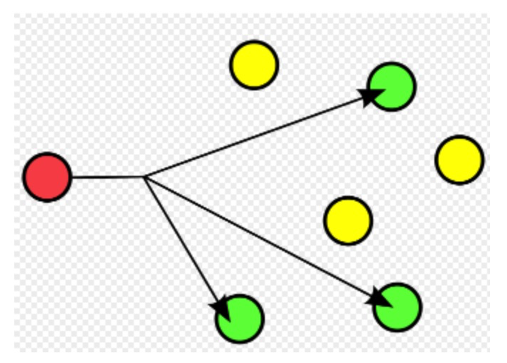](http://image39.360doc.com/DownloadImg/2011/10/0915/18429705_7.png)

假 设红色的圆为存放有视频数据的流媒体服务器，其他的圆为连接到该服务器的各个客户端，当所有的绿色的客户端要求同时观看红色服务器上的某一个视频时，如果 服务器为每一路客户端单独建立连接进行数据的传输，这样明显不太合理浪费带宽，因此，多播技术可以很好地解决这种问题，即同一份数据，由服务器发送到公共 的多播地址，各个客户端均监听同一个多播地址来获取数据，这样，既节省了带宽，同时也保证了各个客户端所观看的视频的同步。

这样的多播应用TCP协议是不支持的，而RTP协议在最初就是为了实现类似的视频会议的应用而诞生的，对其有非常好的支持。

***4.\*** ***RTP\******包头中的流媒体特性\***

首先，我们看看RTP的包头。

[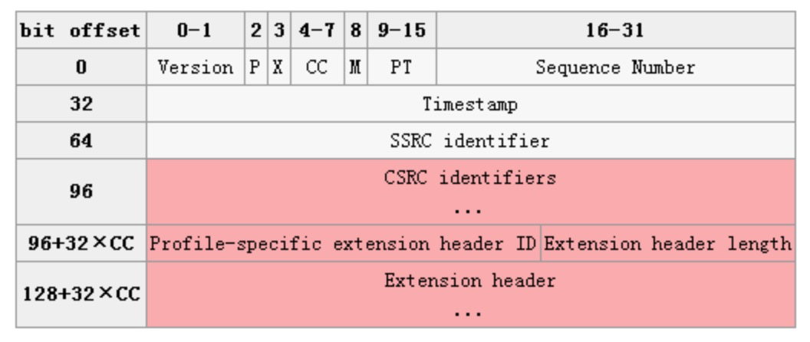](http://image39.360doc.com/DownloadImg/2011/10/0915/18429705_8.png)

V ― 版本。识别 RTP 版本。

P ― 填充。设置1时，数据包包含一个或多个附加填充比特，填充比特不属于有效载荷。
   X ― 扩展位。设置1时，在固定头后面，跟随一个头扩展。
   CSRC Count ― 包含 CSRC 标识符（在固定头后）的数目。
   M ― 标志。标志由描述文件（profile）文件定义。允许在比特流中标记重要的事件，如帧边界。

Payload Type ― 负载类型。由具体的应用决定其解释。某些profile 文件规定了从 Payload 编码到 Payload 格式的缺省静态映射。另外的 Payload Type 编码也可以通过非 RTP 方法实现动态定义。

Sequence Number ― 序列号。每发送一个 RTP 数据包，序列号增加1。接收端可以据此检测丢包和重建包序列。

Timestamp ―时间戳。反映了RTP 数据包中第一个字节的采样时间。时钟频率依赖于负载数据格式，并在描述文件（profile）中进行描述。

SSRC ― 同步源。该标识符随机生成，旨在确保在同一个 RTP 会话中不存在两个同步源具有相同的 SSRC 标识符。

CSRC ― 贡献源标识符。识别该数据包中的有效载荷的贡献源。

从RTP包头的规定中，我们可以非常清晰地看出，在RTP协议中，添加了非常多专为流媒体传输所使用的特性，更加有助于应用于流媒体的传输。

比如用于帧边界标记的M标志位，方便接收端快速定位帧边界；比如负载类型字段，用来告诉接收端（或者播放器）传输的是哪种类型的媒体（例如G.729，H.264，MPEG-4等），这样接收端（或者播放器）就知道数据流是什么格式，然后使用对应的解码器去解码或者播放；比如时间戳字段，标识了数据流的时间戳，接收端可以利用这个时间戳来去除由网络引起的信息包的抖动，并且在接收端为播放提供同步功能，等等。

因此，相比于直接使用TCP或者UDP来进行流媒体传输，这样一个专门为传输音视频而诞生的网络协议更加合适。

***5. RTP\******的profile\******机制\***

RTP为具体的应用提供了非常大的灵活性，它将传输协议与具体的应用环境、具体的控制策略分开，传输协议本身只提供完成实时传输的机制，开发者可以根据不同的应用环境，自主选择合适的配置环境、以及合适的控制策略。

这里所说的控制策略指的是你可以根据自己特定的应用需求，来实现特定的一些RTCP控制算法，比如前面提到的丢包的检测算法、丢包的重传策略、一些视频会议应用中的控制方案等等（这些策略我可能将在后续的文章中进行描述）。

对于上面说的合适的配置环境，主要是指RTP的相关配置和负载格式的定义。RTP协议为了广泛地支持各种多媒体格式（如 H.264, MPEG-4, MJPEG, MPEG），没有在协议中体现出具体的应用配置，而是通过profile配置文件以及负载类型格式说明文件的形式来提供。对于任何一种特定的应用，RTP定义了一个profile文件以及相关的负载格式说明，相关的文件如下所示：

《RTP Profile for Audio and Video Conferences with Minimal Control》（RFC3551）

《RTP Payload Format for H.264 Video》（RFC3984）

《RTP Payload Format for MPEG-4 Audio/Visual Streams》（RFC3016）

等等，想了解更多可以点击这里：http://en.wikipedia.org/wiki/RTP_audio_video_profile

说明，如果应用程序不使用专有的方案来提供有效载荷类型(payload type)、顺序号或者时间戳，而是使用标准的RTP协议，应用程序就更容易与其他的网络应用程序配合运行，这是大家都希望的事情。例如，如果有两个不同的公司都在开发因特网电话软件，他们都把RTP合并到他们的产品中，这样就有希望：使用不同公司电话软件的用户之间能够进行通信。

***6. RTP\******其他的一些良好特性\***

（1）RTP协议在设计上考虑到安全功能，支持加密数据和身份验证功能。

（2）有较少的首部开销

   TCP和XTP相对RTP来说具有过多的首部开销(TCP和XTP3.6是40字节，XTP4.0是32字节，而RTP只有12字节)

（3）……（等待补充）

***7.\*** ***相关资源列表\***

这里有些相关的RTP资源，希望对大家有所帮助。

（1）维基百科对RTP的介绍：

  http://en.wikipedia.org/wiki/Real-time_Transport_Protocol

（2）维基百科对流媒体的介绍：

  http://en.wikipedia.org/wiki/Streaming_media

（3）stackoverflows论坛关于RTP vs TCP的讨论

  http://stackoverflow.com/questions/361943/why-does-rtp-use-udp-instead-of-tcp

（4）关于RTP的负载类型和时间戳的讲解

  http://ticktick.blog.51cto.com/823160/350142

 （5） RTP FAQ

  [Some Frequently Asked Questions about RTP](http://www.cs.columbia.edu/~hgs/rtp/faq.html)

------

[IP/TCP/UDP/RTP/RTCP包结构图](http://www.360doc.com/content/20/1130/09/false)

IP 包头结构:

[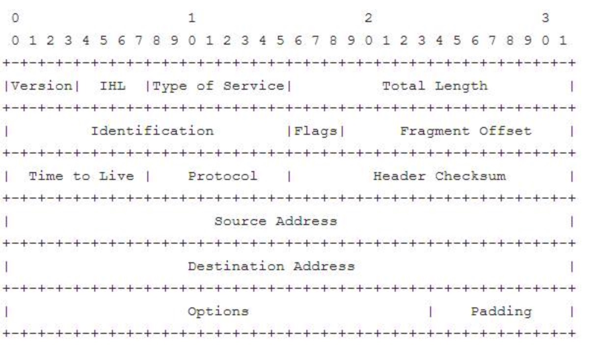](http://image39.360doc.com/DownloadImg/2011/10/0915/18429705_9.jpg)

TCP 包头结构:

[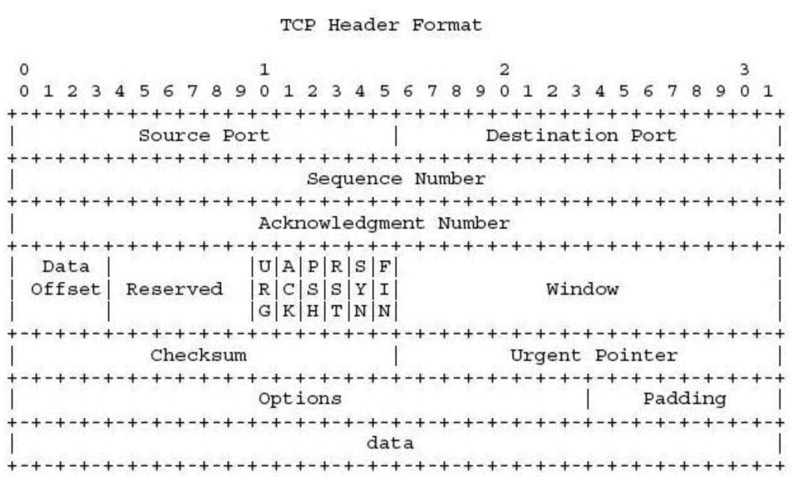](http://image39.360doc.com/DownloadImg/2011/10/0915/18429705_10.jpg)

UDP 包头结构: 

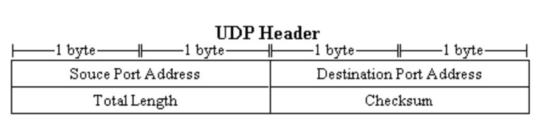

RTP 包头结构:

[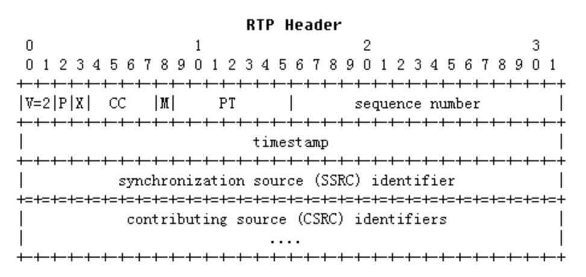](http://image39.360doc.com/DownloadImg/2011/10/0915/18429705_12.gif)

RTCP 包头结构:

 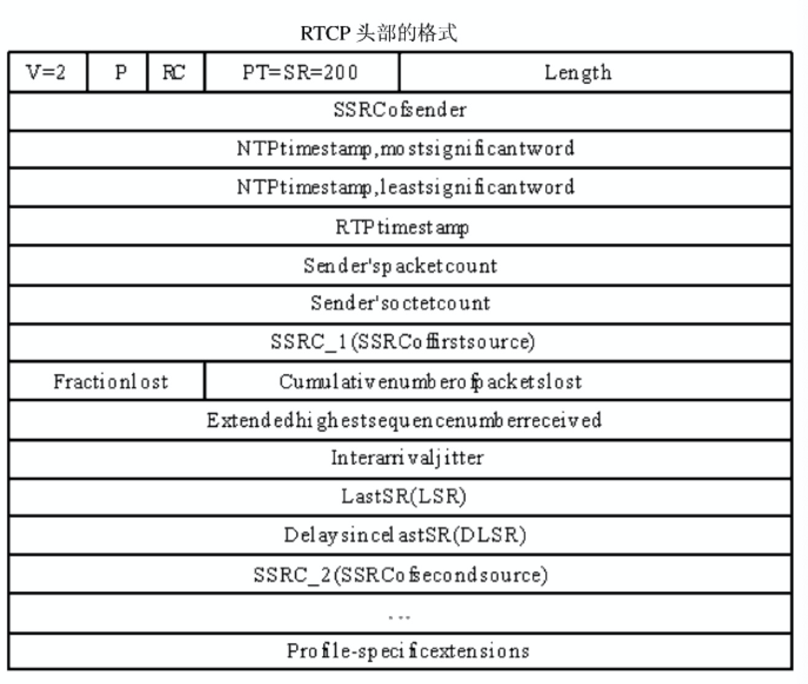