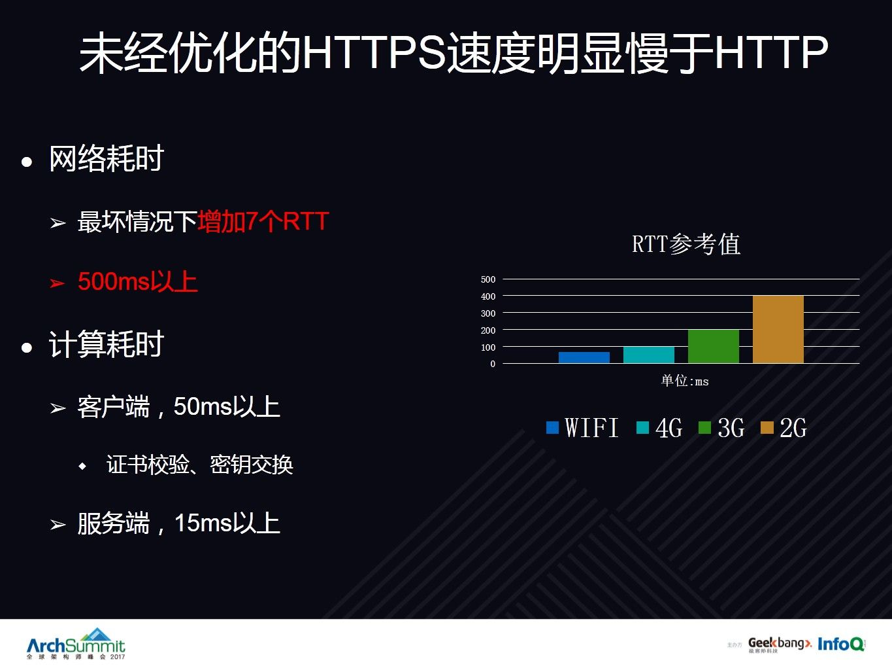

大家在平时使用Web应用的时候，一定遇到了非常多的访问问题，比如“无法接入网络”，比如“网页一直在加载”，又比如“视频卡顿”。那导致这些问题的背后原因有哪一些呢？

这里我简单罗列了一下，主要有如下几类：

其中页面大小主要是指页面的体积，页面的元素主要是指页面元素类型以及数量，通常来讲，一个页面体积越大，页面元素越多，动态交互的元素越多，那这个页面的性能相应就会低一点。页面相关的性能问题也是我们广大前端同学（FE）优化的主战场。

端配置是指用户终端的硬件或者软件配置，网络环境是指用户所处环境的网络状况，包括RTT，带宽，丢包率等。这两个因素主要是由用户以及运营商决定的，WEB开发者很难施加影响。

今天想给大家重点介绍的就是网络协议，这是一个非常重要非常关键但又经常被大家忽视的因素。

那WEB请求主要会涉及到哪些网络协议呢？以现在逐渐流行的互联网下一代协议HTTP2为例，详细介绍一下一条HTTP2请求需要经过的协议栈。

上图左边是客户端，右边是数据中心，也就是服务端。

客户端首先需要经过HTTP1.1协议，为什么会是HTTP1.1协议呢？标题明明是HTTP2请求啊？这是因为HTTP2虽然是一个全新的协议，但是它沿用的大部分语义还是HTTP1.1。比如常用的Get 请求，Post请求，都是沿用的HTTP1.1的语义。对于js或者页面来讲，和HTTP1.1没有变化。

HTTP1.1再接着就到了HTTP2协议，HTTP1.1的语义需要经过HTTP2 frame的封装，比如Get请求会经过HEADERs frame封装，Post请求的body需要经过HTTP2 data frame的封装。

再接着就来到TLS协议，传输加密层，这里为什么会有加密呢？事实上HTTP2 RFC7540规定，HTTP2有两种实现，一种是H2，需要强制加密；还有一种H2C，这里的C是指clear，就是明文，不需要加密的意思。虽然协议规定有两种实现，但是现在所有的主流实现，包括所有的客户端，chrome,firefox,ie,safari和所有的操作系统，都是强制使用的TLS加密。

加密层再往下就来到了大家用得很多的TCP层。

TCP再往下就到了IP网络层，以及以太网链路层再经过运营商网络物理层等等到达服务端，然后经过相同的协议栈进行处理，就不多做介绍了。

那这么多协议，我们需要关注哪些呢？图中白色虚线往上的部分就是我们需要关注的部分，因为这部分才是客户端能够控制，能够施加影响的协议。至于网络层及链路层等更低层的协议，客户端是很难或者无法控制的。明确了我们需要关注的协议，那这些协议分别存在哪些问题呢?

还是从历史最悠久使用最广泛的HTTP1.1协议说起。

HTTP1.1协议最大的性能问题就是“单链接串行”。即在一个TCP链接上如果有多个请求，请求和请求之间必须按照次序串行发送。如图中右边所示。CSS和JS及JPG请求需要依次发送。

“单链接串行”相信大家也都比较清楚了，这里再看下头部未压缩，会导致两个问题：

1， 数据冗余，重复传输，浪费带宽。每次请求的Host，Cookie，UA等字段都是一模一样的，没啥意义。

2， 影响访问速度。特别是由于我们运营商网络上下行带宽严重不对称，上行带宽往往是下行带宽的10分之1甚至不到，比如通常说带宽1M或者10M，上行带宽往往只有100K甚至几十K，我们统计的头部平均大小是1500个字节，有时候头部变大就很可能在带宽层面影响访问性能。

HTTP1.1的问题其实大家都很清楚，也做了很多优化，那我们先来看一下HTTP1.1的优化策略。

概括来讲，HTTP1.1的优化方向主要是两点：

1， 增加并发连接数量。不管是单域名多TCP连接，还是域名分片，本质上都是希望通过建立多个并发连接，来提升并发请求效率。其实HTTP1.1尝试过在单链接上并发请求来提升性能，比如pipelining，但由于存在队头阻塞，最后还是以失败告终。

2， 减少请求数量。不管是CSS雪碧图，还是data uri，图片内联等，都是希望将多个响应包装到一个响应里返回。缓存也是希望在本地就能获取到内容，不需要发出请求。

HTTP1.1的这些优化手段在HTTP1.1时代其实也取得了比较好的效果，也是被实践证明的行之有效的方案，是在性能方面有很大的提升。

但是，随着HTTPS以及HTTP2的快速普及，HTTP1.1的优化手段有很多已经失效了。

首先看一下背景，全站HTTPS趋势是越来越明显，不管是国内的BAT还是国外的FLAG，都已经支持了全站HTTPS。

HTTP2呢，2015年5月正式发布，目前也有13.7%的网站支持了HTTP2.

HTTPS性能上一个很大的特点或者说缺点就是连接成本高，而HTTP1.1的一个优化方向就是增加并发连接数量，如果单个连接成本变高了，并发连接的成本相应也会提高，所以还是依靠增加并发连接，反而在性能方面会起到副作用。

HTTP2最强大的特性就是支持多路复用，能够将多个请求在一个链接上同时发送，实现并发请求。这样HTTP1.1另外一个优化方向，减少请求数量，也就没有太大意义了，因为减少请求数量，特别是内联，可能会有降低缓存命中率，而且也会增加服务端的开发和维护成本。

所以从这个层面讲，HTTP1.1的优化策略逐渐失效了。

那刚才提到高连接成本，HTTPS为什么会有这么高的连接成本呢？

左边是一次HTTP1.1的请求过程，非常简单，只需要通过三次握手建立TCP连接，然后就可以在这个TCP连接上发送HTTP1.1数据了。总共只需要2个RTT就能完成一次交互。

右边是HTTPS的一次请求过程，非常复杂。简单说一下过程。

1， 首先同样需要建立TCP连接。

2， 然后开始发送HTTP1.1数据，这里为什么会是HTTP1.1的数据呢？因为如果是用户主动输入URL的情况下，绝大部分用户不会主动输入HTTPS，比如他访问腾讯网，他可能会输入[http://qq.com](https://link.zhihu.com/?target=http%3A//qq.com)或者[www.qq.com](https://link.zhihu.com/?target=http%3A//www.qq.com/)或者[http://www.qq.com](https://link.zhihu.com/?target=http%3A//www.qq.com/)，但是他很少会输入[https://www.qq.com](https://link.zhihu.com/?target=https%3A//www.qq.com)，这样我们就只能通过返回302强制用户使用HTTPS。

3， HTTPS使用的是443端口，HTTP使用的是80端口，不同的端口必须要建立不同的TCP连接。这样又需要三次握手来建立TLS的TCP连接。

4， 然后就可以在这个TCP连接上进行TLS握手了，首先完全握手阶段一，主要是协商协议版本，密码套件，返回证书。

5， 客户端在获取到证书后，校验完证书的签名和时间都没有问题后，还是有可能要检查这个证书的状态，因为我们有可能主动撤销了这个证书，也有可能是CA本身数据库出了安全问题。所以又需要解析这个CA OCSP站点的域名。

6， 然后向这个CA站点的IP发起三次握手建立TCP连接。

7， 建立好TCP连接后，开始请求OCSP的内容，也是通过HTTP协议完成的。

8， OCSP校验通过后，开始进行TLS完全握手阶段二，这个阶段主要是完成非对称密钥交换计算协商出对称密钥。

9， 至此，TLS握手完全结束，开始进行HTTP应用层的加密内容传输。

由此可见，一次HTTPS的请求有可能需要9个RTT，相比HTTP1.1多出了7个RTT。

7个RTT是什么概念呢？最好的WIFI环境下，我们统计的平均RTT是70ms，7个RTT就是490ms，4G是100ms，3G是200ms。这还仅仅是一次请求的耗时，我们一个页面往往有数十个请求，请求和请求之间还有可能依赖，有可能阻塞，这样下来，一个HTTPS页面增加几秒钟也是非常正常的现象。

如上描述的还只是HTTPS的的网络耗时，也就是协议的规定所必须要进行的网络交互。还有一部分耗时是计算耗时，比如客户端需要校验证书，计算密钥，服务端也需要非对称密钥计算出对称密钥，还需要对内容进行对称加解密。特别是移动端的CPU相对要弱，所以计算层面的耗时多出几百毫秒也是比较正常的。

从上述原理分析，未经优化的HTTPS的速度要明显慢于HTTP。

那HTTPS就等于HTTP+SLOW吗？如果是，那除了上述网络协议的原理分析，还存在其他的性能瓶颈吗？

接下去我们分别从线下测试及线下业务数据的角度来进一步分析。

线下模拟测试主要是关注移动端。移动端手机有两个问题：

1， 手机屏幕比较小，不方便页面性能分析和数据的查看。

2， 不方便执行我们自动控制脚本和数据分析脚本。

于是我们使用USB数据线将手机和PC连接起来，再通过chrome remote debug协议来控制手机不断的重复地访问我们所构造的不同的测试页面。

所以一定要使用自动化的脚本去访问，这样才会非常方便地生产大量数据，包括各种应用场景。见过很多同事，拿着自己人工生成的几十条数据就误认为是结论，这样的数据几乎是没有意义的。

另外就是要考虑消除误差，一定要注意数据的周期性的同比，环比，数据量一般超过10000条才有一定的可信度。还有一个很大的误差是WIFI网络非常不稳定，即使在我们办公室里面，比如腾讯大厦或者朗科大厦，WIFI也很容易丢包，延时抖动等。为了减少WIFI的影响，我们同样的是使用USB线将手机和电脑连接，使得手机直接通过有线网络去请求页面，因为有线网络相对要稳定很多，能很大程度地减少WIFI的影响。

还有一个工具就是traffic control，因为我们真实的用户网络环境是千差万别的，有2G，3G，4G，WIFI，有不同的RTT，不同的带宽，不同的丢包率。在办公室是无法获取这么多真实的网络条件的，只能通过模拟，那 linux traffic control就能很好的模拟这些场景。

上述主要是介绍了一下我们线下模拟测试的经验。但是线下测试的数据毕竟不能代表线上真实用户的体验，所以我们还需要对线上真实业务进行数据监控和分析。

线上速度监控的方案其实有非常多，我相信只要关注过速度或者前端性能的朋友都有一些比较成熟的做法，我就不多做介绍了。这里我想重点分享的是我们基于服务端进行数据采集的方案。为什么要基于服务端采集数据呢？主要是有两大优势 ：

1， 服务端能采集到客户端采集不到的数据。比如业务处理的整体时间，又比如跟协议相关的信息，包括是否TCP连接复用，TCP的RTT，是否TLS Session复用，TLS协议版本，密码套件，TLS非对称密钥交换计算的时间，握手时间，HTTP2的头部压缩比等。

2， 开发成本低。因为有一些数据客户端如果有网络读写能力，也能获取到一些底层信息，但是客户端的操作系统种类多，有iOS，android，windows等，不同的系统，不同的版本，开发方案肯定是不同的。但是服务端一次开发就可以适配所有客户端，因为服务端将统计的数据，放到cookie里返回给了客户端，客户端只需要通过JS就能获取到cookie里的信息，然后JS又将自己采集到的和页面相关信息汇聚，最后统一上报到报表分析平台。

那采集了这么多协议相关的信息，拿到了这么多数据，我们该如何分析呢？

上表只是截取了我们很少的几个维度，其中第一列是我们的统计维度，比如tcp_reuse表示TCP连接复用，TLSv1.2表示TLS协议版本是1.2，ecdhe_rsa_aes128_gcm_sha256表示密码套件等。

第一行中的其他数据表示我们的监控指标，比如start_load表示开始加载的时间，active表示页面可以活动的时间，req_time表示业务处理的时间等。

上述这些单一维度又可以进行多维度的整合，比如这行黄色的文字所示“腾讯X5内核浏览器在4G网络下使用HTTP2并且是TLS1.2协议并且使用ECDHE并且没有复用tls session的首屏时间是多少？”

然后我们又清晰地看到它使用TLS1.1,1.0,以及其他密码套件的一些性能数据，为什么快，为什么慢，通过这样的多维度对比，一目了然。

也就是说我们收集了这么多的数据，并不是用来好看的，也不是仅仅用来做报表的，最终是为了找到其中的性能瓶颈，从而为我们的速度优化寻找方向。

那我们主要有哪些方向呢？

这里主要从非前端的角度讲述一下我们的优化方向，主要是这三大块：

1， 协议。

2， 资源。

3， 用户行为。

首先我们来看一下协议，这次我们从最底层的TCP协议说起。

TCP协议在性能方面最显而易见的问题就是它需要三次握手才能建立一个连接，才能发送数据，浪费了一个RTT。

那TCP fast open的思路就是在SYN包发出的同时将应用层数据一起发出来，减少三次握手对延时的影响。

TFO的大概流程是这样的，首先也需要三次握手才能建立连接，所不同的是，服务端返回syn+ack的时候还会返回一个cookie。这样在下一次建立连接时，客户端就会发出syn包的同时，将cookie 和应用层数据一起发出来，减少了这个RTT的浪费。

TFO的优化效果其实也很明显，我们统计80分位的数据提升了100毫秒。它的缺点也比较明显，就是需要客户端的操作系统支持，比如iOS9+以及linux kervel3.7+才支持TFO，windows都还不支持。

TCP另外一个优化就是增加初始拥塞窗口，由3个增加到10个。这个其实也是Google很早就提出的一个方案，也被标准内核采纳了，所以我就不多做介绍了。包括Google最近提出的BBR算法，对于长肥管道也有一定的效果。

总得来说，在TCP层面进行优化的空间不大，成本很高。因为它需要操作系统，需要内核的支持。如果仅仅是服务端开发倒还好，关键是需要用户，甚至需要广大的网络中间设备的系统和协议栈支持，这样就会导致部署阻力非常大。

接下去我们看一下TLS协议的优化。

TLS协议最大的性能问题也是它的握手。所以优化的目标也非常明确，就是减少完全握手，提升简化握手的比例。

协议层面提供了两种机制，session id和session ticket，我相信接触过的同学都非常清楚，网上的资料也非常多，关于原理和过程我就不多做介绍了。

这里我主要是分享两点：

1， 通过提升简化握手比例，iOS Qzone的SSL握手时间提升了50%，从200ms节省到了100ms。

2， 虽然session ticket是一种更加优秀的机制，因为它不需要服务端做缓存，但是iOS目前还不支持session ticket，要想实现简化握手，必须要支持session id，并且最好是实现分布式session cache来提升简化握手比例。

然后我们再来看一下完全握手，因为有很多场景下必须要进行完全握手，比如用户第一次打开浏览器或者App，用户关闭tab页面再打开，用户手机或者系统重启等，都需要进行完全握手，因为前面提到的sesison ticket还是session id都是基于内存的，客户端重启之后再发起握手默认就无法携带上这些信息，必须进行完全握手。

那针对完全握手该如何优化呢？

优化思路类似TFO，即在完全握手的第二个阶段，即密钥交换阶段，提前发送应用层数据，节省这一个RTT对性能的影响。

上图左边是普通握手，可以看出必须要进行四次握手，两个RTT之后才能发送绿色的HTTP加密数据。

上图右边就是false start，抢跑的意思。在第二阶段，clientKeyExchange消息发出的时候，将HTTP GET的应用层数据加密发出来了。相当于节省了一个RTT。

那如何支持false start呢？很简单。因为现在最新的客户端都已经支持了这个特性，所以对于服务端来廛，我们只需要将支持PFS（完美前向密码）算法的密码套件配置在前面就行了，比如ECDHE，DHE算法配置在最前面。协商好密码套件后，客户端就能提前发送数据，实现false start。

False start对完全握手的优化效果也很明显，大概提升了30%。

接下来我们再看一下OCSP的问题。OCSP是在线证书状态检查协议，这个检查和证书本身的签名校验不是一回事。

因为有一些情况，单纯检验签名是发现不了的。比如我们申请了一张有效期一年的证书，但不幸的是，申请下来的第一个月，私钥被内部人员泄露了，或者CA本身的数据库被黑客攻击了，我们需要主动撤销这张证书的信任关系。那就只能主动告诉CA这张证书不安全，然后客户端自己再去CA那边查询一下。因为这个时候证书本身的签名是没有问题的，如果不去额外查一下，在证书本身过期之前，永远也发现不了证书被撤销的事实。

OCSP的过程发生在客户端接收到server hello和certificate消息后，这个时候它会根据证书里的OCSP域名，发起OCSP请求，如上图左边所示。

OCSP stapling的意思，简单来说就是服务端代理CA实现的OCSP内容的签发。服务端会提前向ＣＡ站点请求好ＯＣＳＰ内容，并保存在本地，在握手的时候，将ＯＣＳＰ内容和证书一起发送给客户端，这样客户端就不需要自己主动去请求ＣＡ查询ＯＣＳＰ内容了。

这样看来OCSP Stapling至少节省了三个RTT，效果应该非常不错。但事实上，OCSP Stapling的效果并不会特别突出，因为客户端有缓存。一般来讲会有7天，也就是说客户端7天中才会查询一次OCSP。对于一个用户经常访问的页面来讲，这个概率可能只有千分之一甚至万分之一。所以对用户的访问体验来讲，提升的效果也比较有限。

然后我们再看一下dynamic record size。为什么需要做这个动态调整呢？是因为TLS协议本身的HOL（队头阻塞）。

Record是TLS协议处理的最小单位，最大不能超过16K，一些服务器比如Nginx默认的大小就是16K。由于一个record必须经过数据一致性校验才能进行加解密，所以一个16K的record，就算丢了一个字节，也会导致已经接收到的15.99K数据无法处理，因为它不完整。

比如上图右边所示，假设一个record需要6个TCP segment传输完成，如果最后一个segment丢了，那么上层应用程序必须HANG在那里等，无法继续处理。

上述就是TLS协议层面的队头阻塞，那如何解决呢？也有两个方案：

1， Nginx高版本支持一个配置指令ssl_buffer_size，可以将它设置成4K，这样就算有HOL，影响的也只是4K数据，而不是之前的16K。

2， 更好的一个方案是动态调整大小，思路类似tcp 的slow start。在TLS连接刚刚建立的时候，由于不知道网络速率，可以将record设置得小一点，比如1K，当发送速度逐渐提上来之后，再将这个record size设置成16K。这个方案也已经有开源的patch，是cloud flare提供的，大家有兴趣可以关注一下。

刚才提到的一些TLS优化特性都是针对TLS1.2及其之前的协议版本。接下去我们看一下TLS1.3协议。这是一个具有革命性的创造性的极具里程碑意义的TLS协议。

它现在迟迟没有发布的一个讨论焦点就是它到底该叫TLS1.3还是TLS2.0。在性能方面最大的提升就是能够实现1RTT的完全握手，能够实现0RTT的简化握手。

上图左边就是1RTT的完全握手，右边就是0RTT的简化握手，也就是说应用层数据可以握手消息一起发出来，而且都是经过加密的。

关于TLS1.3协议的原理和0RTT的详细过程我就不做详细描述了，因为还没有正式发布，那这里为什么又给大家介绍呢？因为如果大家想尝鲜的话，现在就可以体验了。

Openssl1.1.1以及Nginx 1.13.0目前已经支持TLS1.3的最新草稿draft20。也有一些客户端支持了TLS1.3，比如firefox。大家如果有自己的客户端，现在就可以参考这些实现进行集成。

刚才我们介绍的是TLS协议，接下去我们再往上看，HTTP协议。

之前提到过需要302跳转强制用户使用HTTPS。那能不能减少这个跳转呢？HSTS就是这个作用。这是一个HTTP的Header，客户端接收到这个头部后，就会在接下去指定的时间内，默认只发起HTTPS请求。不管用户输入qq.com, [www.qq.com](https://link.zhihu.com/?target=http%3A//www.qq.com/)还[http://www.qq.com](https://link.zhihu.com/?target=http%3A//www.qq.com/)，浏览器都会在本地进行跳转，直接发起HTTPS请求。

就算返回的HTML里包含有HTTP资源，浏览器也会将它们全部替换成HTTPS资源。

不过HSTS还是有一个安全风险，因为通常来讲它都是通过HTTP1.1协议返回的，所以很容易被中间者劫持，直接被干掉，这样客户端就可能永远也接收不到HSTS的头部，也就不会发起HTTPS请求了。

为了解决这个问题，chrome提供了一个preload list的机制，大家可以给上图所示的网站申请，将自己的网站域名加入到preload list里，这样不需要返回HSTS，chrome也会默认使用HTTPS来访问你的网站。

然后我们再来看一下SPDY和HTTP2，这里为什么要提一下SPDY呢，主要是两个原因：

1， HTTP2的大部分特性，除了HPACK头部压缩算法，都是沿用自SPDY，可以说SPDY是HTTP2的鼻祖。现在越来越多的人只知道HTTP2，不知道SPDY，我这里介绍一下主要是为了向它致敬。

2， 现在还有很多的客户端只支持SPDY，比如Android4.4.4以前，以及iOS现在都支持SPDY，为了兼容一些老的客户端，提升它们的性能，我们腾讯云的服务端也是同时支持SPDY和HTTP2。

上图列的几个HTTP2特性是大家都比较清楚的特性，其中多路复用是HTTP2最强大的特性，它能将多个请求在一个连接上并发地发出来，同时请求和请求之间在协议层面可以没 任何依赖，当然也可以有依赖。也就是说谁先处理完成谁就可以先返回，不会影响其他请求的处理。

HTTP1.1的pipelining就不行，比如上图右边，如果在同一个连接上发起四个请求，那四个响应必须按照顺序返回，其中一个处理慢了或者丢失了，都会导致四个请求全都无法处理，也就是http1.1 pipelining的队头阻塞。

前面几个HTTP2特性大家比较清楚，这里我再重点介绍一下两个大家可能不太清楚的特性，一个是头部压缩，从字面很好理解，就是压缩了头部大小，提升了传输效率。但压缩比真的如官方页面宣传的有90%吗？

我们通过实验发现，在一个连接上发起第一次请求时，压缩只有30%，发起第二次请求时，压缩比能达到60%，一直到第三次请求以及之后的请求时，压缩比才能达到将近90%。为什么会这样呢？因为SPDY头部压缩是基于zlib的，HTTP2是基于Hpack的压缩算法，它们都是利用状态空间的重复信息进行压缩，也就是说信息越冗余越重复，压缩比才会越高。

这带给我们的启发就是，在用户发起真正的请求前，我们利用JS提前发送两个空请求，积累重复的头部数据，当用户发起真正的请求时，已经是这个连接上的第三个请求了，这样用户请求的头部压缩比一下就能达到90%，有利于提升用户访问速度。

然后再来看一下server push。由于Nginx不支持server push，这个功能目前在国内用得还比较少，但确实很有用。

比如客户端请求一个html，正常来讲它需要解析完DOM后再请求css和png，这里至少会有2个RTT。但是如果支持server push，我们在服务端配置一个link头部，这样服务器在接收到html请求后就知道将另外两个资源css和png 一起返回给客户端，不需要客户端发起额外的请求。

这就是server push未发先至的作用，和inlining有点类似，但是相比inlining有两个好处：

1， 有利于缓存。因为inlining在html里，不仅增加了html的体积，而且html一般来讲是不会缓存的。

2， 减少开发成本，css 雪碧图也好还是图片内联，服务端都有一定的开发成本，有些开发甚至是反模式的，需要精确地位置调整和屏幕适配。

再分享一下HTTP2的实践建议。

1， 使用一个连接，或者使用尽量少的连接。为什么呢？有三个好处：

a) 连接少意味着更少的连接建立成本，之前也提到了，HTTPS的连接成本很高。

b) 能够实现更高的压缩比，因为数据都在一个连接上，提供的冗余信息更丰富，有利于压缩。

c) 能够更好地利用TCP的特性。因为TCP的很多特性，包括滑动窗口，拥塞控制都是基于一个连接的，如果连接数量多，特别是网络拥塞的时候，很容易放大拥塞系数，加剧拥塞。

2， 使用更少的域名。一方面能够减少域名解析的时间，另外一方面也能建立更少的连接，作用和第一点类似。

3， 如果一定要使用多个域名，那么尽量保证多个域名解析到相同IP，并且使用了相同的证书。这样也能方便浏览器复用相同的连接，比如chrome就会作这样的智能判断。

4， 灵活运用server push,代替inlining。

5， HTTP2只支持TLS1.2及之后的版本（TLS1.3）。而且只有TLS1.2的部分cipher suite才能使用HTTP2。所以如果大家想使用HTTP2，一定要注意配置好TLS1.2协议，参考RFC7540的规范，配置好密码套件。

6， HTTP2不是万能的，如果你的页面很简单，比如只有几个元素，如果还是有性能问题，那也不能寄希望于HTTP2。HTTP2最强大的特性是多路复用，还是适合于解决多元素多请求的场景。

最后我们再来看一下预建连接。所谓的预建连接就是在用户发起正直的请求前将连接提前建立好。这样当用户发起请求时，由连接建立所导致的开销成本，用户都是感觉不到的。

所以预建连接可以说是一种最简单，最有效的方案。因为之前提到的一系列方案，就算是0RTT握手，也会有一些数据校验和计算的工作。预建连接的效果也非常明显，对性能的提升至少是400ms以上。

那如何预建连接呢？主要有两个方法：

1， 通过link标签和头部告诉浏览器提前建立另外一个资源的连接。不过还有很多浏览器或者一些历史版本不支持这个特性。

2， 通过页面的JS给另外一个资源发送请求，提前建立连接。

预建连接也可以根据具体的用户场景和用户行为来建立。比如：

1， 首页提前预建子页面的连接。当用户打开百度首页的时候，它通常会发起搜索，那我们可以提前给搜索结果页面建立连接。

2， 根据用户行为预测。比如用户进入ＱＱ空间首页时，我们可以根据用户的浏览习惯，他是经常访问QQ相册，还是经常访问ＱＱ商城来预建不同的连接。

预建好的连接也有可能会超时断开，比如ＨＴＴＰＳ的超时时间是１分钟，ＨＴＴＰ２有可能是３分钟，那过了几分钟后连接就断开了，用户再次发起请求时又需要建立新连接，如何避免这种情况呢？

可以使用长连接保持。即我们使用JS周期性比如每分钟发起一次长连接保持的请求，stgw就提供一个空页面，JS访问这个页面我们返回1个字节，作用就是为了维持住这个连接，不让它中断。

总的来说，HTTPS的访问速度是可以超越HTTP1.1的，这里面最核心的一点是，HTTPS可以使用HTTP2，可以多路复用，而HTTP1.1不行。

上图的数据是两年前我们H5 QQ空间优化的效果，数据虽然有点老，不过思路和优化方法是一致的，没有过时。

前面提到了很多HTTP2的特性，性能也很强大，那HTTP2是未来吗？或者更准确地说， HTTP2是下一个十年，最有性能优势，最具有统治力的WEB协议吗？

可以说是。因为它的许多特性，包括多路复用，头部压缩，server push，优先级等，设计得十分先进，性能也十分优良，解决了许多WEB性能问题。

也可以说不是，为什么？因为当前的HTTP2协议是构建在TCP和TLS之上的，由此导致了一系列问题：

1， TCP连接耗时。比如需要TCP三次握手才能建立连接，就算是有了TFO，也需要操作系统才能支持，有许多系统目前也不支持TFO。而且TFO本身，在第一次获取Cookie时，也需要一次额外的RTT才能实现接下去的快速握手。

2， TLS连接耗时，当前的TLS1.2至少需要1个RTT才能建立TLS连接。

3， TLS安全问题，TLS目前并没有针对TCP头部进行一致性校验，从而存在TCP头部被篡改的风险，比如修改滑动窗口数，修改TCP序列号等。

4， 加剧TCP队头阻塞。TCP为了实现可靠性和数据的有序性，发生segment丢包后需要重传，就算丢包序列号之后的包提前到达了，也需要等待丢失的包重传才能通知应用层来读取数据。这就是TCP的队头阻塞问题，而HTTP2的多路复用，加剧了TCP的队头阻塞，因为一条连接上同时发送的数据变多了。队头阻塞的影响也就更严重了。

5， 重传的模糊性问题。由于TCP重传segment的序列号和原始segment的序列号相同。在判断该segment及后续segment是否需要重传的时候，很容易迷糊。

6， 拥塞控制，需要操作系统的支持，升级成本高。

以上种种，影响了HTTP2的性能，所以从这个角度来看，也可以说HTTP2并不是未来最有性能优势的协议，那什么才是呢？我觉得最有竞争力的一个协议就是QUIC。

让我们拥抱QUIC。那什么是QUIC协议呢？简单来说就是使用UDP实现的HTTP2.它具体以下特性：

1， 继承了HTTP2的大部分特性，包括多路复用，头部压缩，server push，优先级等。

2， 当前支持0RTT握手，等TLS1.3发布后，也会使用TLS1.3的0RTT握手协议。

3， 使用UDP传输，没有TCP连接建立的耗时。

4， 针对IP Packet进行加密，减少了队头阻塞的程度。

5， 针对UDP头部进行一致性校验，就算是修改了UDP头部也能及时发现。

由于时间关系，关于QUIC的原理和详细功能我就不再做介绍了。感兴趣的同学可以关注我们后续的报道，如果有机会，下一次架构师峰会，也可以专门给大家重点分享。