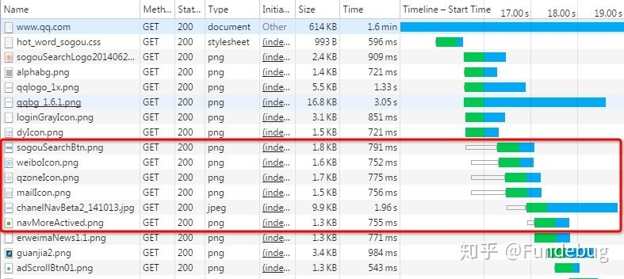
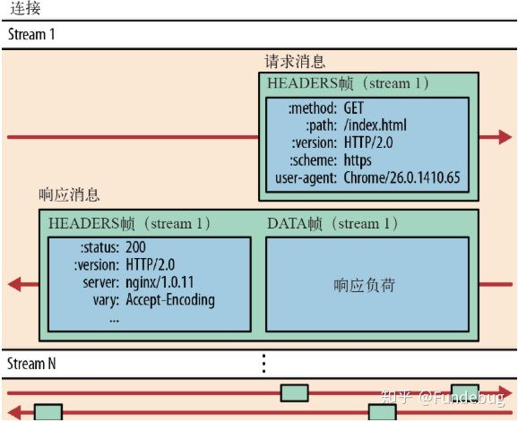
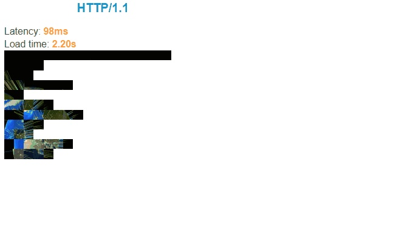
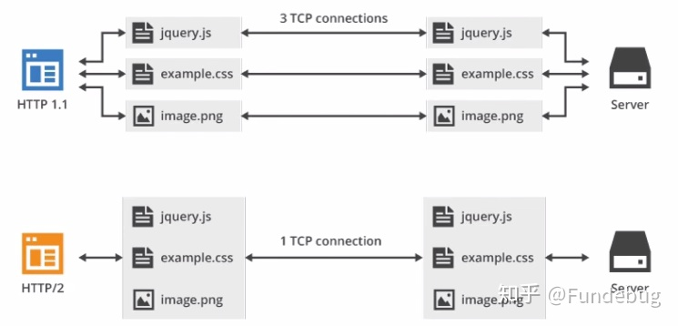
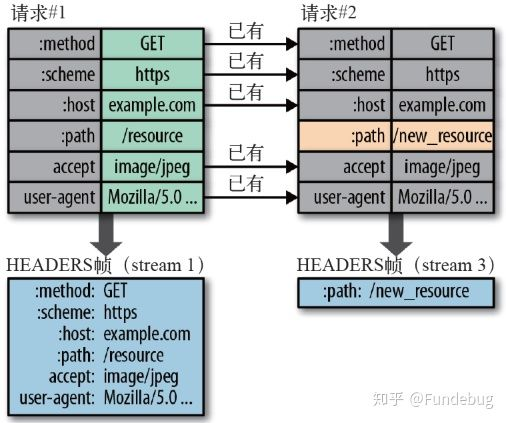
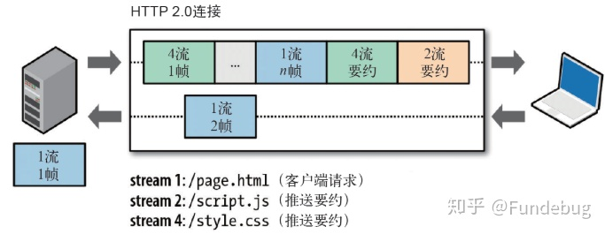
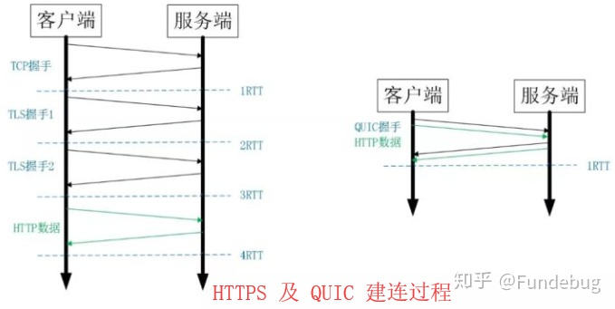
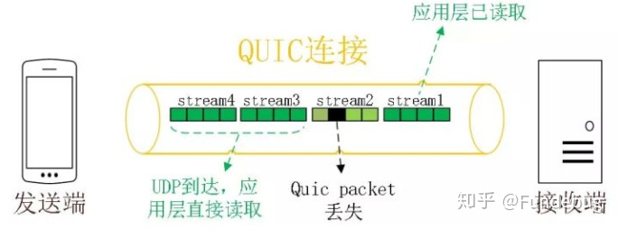
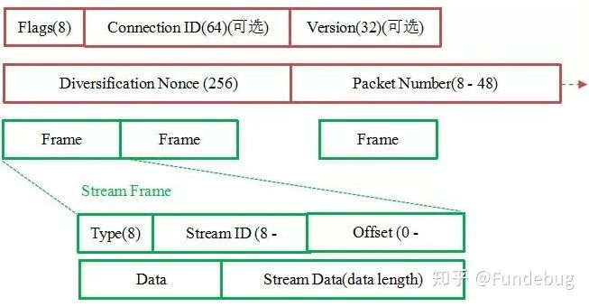

## **前言**

HTTP/2 相比于 HTTP/1，可以说是大幅度提高了网页的性能，只需要升级到该协议就可以减少很多之前需要做的性能优化工作，当然兼容问题以及如何优雅降级应该是国内还不普遍使用的原因之一。

虽然 HTTP/2 提高了网页的性能，但是并不代表它已经是完美的了，HTTP/3 就是为了解决 HTTP/2 所存在的一些问题而被推出来的。

## **一、HTTP协议**

HTTP协议是HyperText Transfer Protocol（超文本传输协议）的缩写，它是互联网上应用最为广泛的一种网络协议。所有的WWW文件都必须遵守这个标准。伴随着计算机网络和浏览器的诞生，HTTP1.0也随之而来，处于计算机网络中的应用层，HTTP是建立在TCP协议之上，所以**HTTP协议的瓶颈及其优化技巧都是基于TCP协议本身的特性**，例如tcp建立连接的3次握手和断开连接的4次挥手以及每次建立连接带来的RTT延迟时间。

## **二、HTTP/1.x的缺陷**

- **连接无法复用**：连接无法复用会导致每次请求都经历三次握手和慢启动。三次握手在高延迟的场景下影响较明显，慢启动则对大量小文件请求影响较大（没有达到最大窗口请求就被终止）。

- - HTTP/1.0传输数据时，每次都需要重新建立连接，增加延迟。
  - HTTP/1.1虽然加入keep-alive可以复用一部分连接，但域名分片等情况下仍然需要建立多个connection，耗费资源，给服务器带来性能压力。

- **Head-Of-Line Blocking（HOLB）**：导致带宽无法被充分利用，以及后续健康请求被阻塞。[HOLB](https://link.zhihu.com/?target=http%3A//stackoverflow.com/questions/25221954/spdy-head-of-line-blocking)是指一系列包（package）因为第一个包被阻塞；当页面中需要请求很多资源的时候，HOLB（队头阻塞）会导致在达到最大请求数量时，剩余的资源需要等待其他资源请求完成后才能发起请求。

- - HTTP 1.0：下个请求必须在前一个请求返回后才能发出，`request-response`对按序发生。显然，如果某个请求长时间没有返回，那么接下来的请求就全部阻塞了。
  - HTTP 1.1：尝试使用 pipeling 来解决，即浏览器可以一次性发出多个请求（同个域名，同一条 TCP 链接）。但 pipeling 要求返回是按序的，那么前一个请求如果很耗时（比如处理大图片），那么后面的请求即使服务器已经处理完，仍会等待前面的请求处理完才开始按序返回。所以，pipeling 只部分解决了 HOLB。

如上图所示，红色圈出来的请求就因域名链接数已超过限制，而被挂起等待了一段时间。

- **协议开销大**： HTTP1.x在使用时，header里携带的内容过大，在一定程度上增加了传输的成本，并且每次请求header基本不怎么变化，尤其在移动端增加用户流量。
- **安全因素**：HTTP1.x在传输数据时，所有传输的内容都是明文，客户端和服务器端都无法验证对方的身份，这在一定程度上无法保证数据的安全性

## **三、SPDY 协议**

因为HTTP/1.x的问题，我们会引入雪碧图、将小图内联、使用多个域名等等的方式来提高性能。不过这些优化都绕开了协议，直到2009年，谷歌公开了自行研发的 SPDY 协议，主要解决HTTP/1.1效率不高的问题。谷歌推出SPDY，才算是正式改造HTTP协议本身。降低延迟，压缩header等等，SPDY的实践证明了这些优化的效果，也最终带来HTTP/2的诞生。

SPDY 协议在Chrome浏览器上证明可行以后，就被当作 HTTP/2 的基础，主要特性都在 HTTP/2 之中得到继承。

## **四、HTTP/2 简介**

2015年，HTTP/2 发布。HTTP/2是现行HTTP协议（HTTP/1.x）的替代，但它不是重写，HTTP方法/状态码/语义都与HTTP/1.x一样。HTTP/2基于SPDY3，专注于**性能**，最大的一个目标是在用户和网站间只用一个连接（connection）。

HTTP/2由两个规范（Specification）组成：

1. Hypertext Transfer Protocol version 2 - RFC7540
2. HPACK - Header Compression for HTTP/2 - RFC7541

## **五、HTTP/2 新特性**

## **1. 二进制传输**

HTTP/2 采用二进制格式传输数据，而非 HTTP 1.x 的文本格式，二进制协议解析起来更高效。 HTTP / 1 的请求和响应报文，都是由起始行，首部和实体正文（可选）组成，各部分之间以文本换行符分隔。**HTTP/2 将请求和响应数据分割为更小的帧，并且它们采用二进制编码**。

接下来我们介绍几个重要的概念：

- 流：流是连接中的一个虚拟信道，可以承载双向的消息；每个流都有一个唯一的整数标识符（1、2…N）；
- 消息：是指逻辑上的 HTTP 消息，比如请求、响应等，由一或多个帧组成。
- 帧：HTTP 2.0 通信的最小单位，每个帧包含帧首部，至少也会标识出当前帧所属的流，承载着特定类型的数据，如 HTTP 首部、负荷，等等

HTTP/2 中，同域名下所有通信都在单个连接上完成，该连接可以承载任意数量的双向数据流。每个数据流都以消息的形式发送，而消息又由一个或多个帧组成。多个帧之间可以乱序发送，根据帧首部的流标识可以重新组装。

## **2. 多路复用**

在 HTTP/2 中引入了多路复用的技术。多路复用很好的解决了浏览器限制同一个域名下的请求数量的问题，同时也接更容易实现全速传输，毕竟新开一个 TCP 连接都需要慢慢提升传输速度。

大家可以通过 [该链接](https://link.zhihu.com/?target=https%3A//http2.akamai.com/demo) 直观感受下 HTTP/2 比 HTTP/1 到底快了多少。

在 HTTP/2 中，有了二进制分帧之后，HTTP /2 不再依赖 TCP 链接去实现多流并行了，在 HTTP/2中：

- 同域名下所有通信都在单个连接上完成。
- 单个连接可以承载任意数量的双向数据流。
- 数据流以消息的形式发送，而消息又由一个或多个帧组成，多个帧之间可以乱序发送，因为根据帧首部的流标识可以重新组装。

这一特性，使性能有了极大提升：

- 同个域名只需要占用一个 TCP 连接，使用一个连接并行发送多个请求和响应,消除了因多个 TCP 连接而带来的延时和内存消耗。
- 并行交错地发送多个请求，请求之间互不影响。
- 并行交错地发送多个响应，响应之间互不干扰。
- 在HTTP/2中，每个请求都可以带一个31bit的优先值，0表示最高优先级， 数值越大优先级越低。有了这个优先值，客户端和服务器就可以在处理不同的流时采取不同的策略，以最优的方式发送流、消息和帧。

如上图所示，多路复用的技术可以只通过一个 TCP 连接就可以传输所有的请求数据。

## **3. Header 压缩**

在 HTTP/1 中，我们使用文本的形式传输 header，在 header 携带 cookie 的情况下，可能每次都需要重复传输几百到几千的字节。

为了减少这块的资源消耗并提升性能， HTTP/2对这些首部采取了压缩策略：

- HTTP/2在客户端和服务器端使用“首部表”来跟踪和存储之前发送的键－值对，对于相同的数据，不再通过每次请求和响应发送；
- 首部表在HTTP/2的连接存续期内始终存在，由客户端和服务器共同渐进地更新;
- 每个新的首部键－值对要么被追加到当前表的末尾，要么替换表中之前的值

例如下图中的两个请求， 请求一发送了所有的头部字段，第二个请求则只需要发送差异数据，这样可以减少冗余数据，降低开销

## **4. Server Push**

Server Push即服务端能通过push的方式将客户端需要的内容预先推送过去，也叫“cache push”。

可以想象以下情况，某些资源客户端是一定会请求的，这时就可以采取服务端 push 的技术，提前给客户端推送必要的资源，这样就可以相对减少一点延迟时间。当然在浏览器兼容的情况下你也可以使用 prefetch。 例如服务端可以主动把JS和CSS文件推送给客户端，而不需要客户端解析HTML时再发送这些请求。

服务端可以主动推送，客户端也有权利选择是否接收。如果服务端推送的资源已经被浏览器缓存过，浏览器可以通过发送RST_STREAM帧来拒收。主动推送也遵守同源策略，换句话说，服务器不能随便将第三方资源推送给客户端，而必须是经过双方确认才行。

## **六、HTTP/3 新特性**

## **1. HTTP/3简介**

虽然 HTTP/2 解决了很多之前旧版本的问题，但是它还是存在一个巨大的问题，主要是底层支撑的 TCP 协议造成的。

上文提到 HTTP/2 使用了多路复用，一般来说同一域名下只需要使用一个 TCP 连接。但当这个连接中出现了丢包的情况，那就会导致 HTTP/2 的表现情况反倒不如 HTTP/1 了。

因为在出现丢包的情况下，整个 TCP 都要开始等待重传，也就导致了后面的所有数据都被阻塞了。但是对于 HTTP/1.1 来说，可以开启多个 TCP 连接，出现这种情况反到只会影响其中一个连接，剩余的 TCP 连接还可以正常传输数据。

那么可能就会有人考虑到去修改 TCP 协议，其实这已经是一件不可能完成的任务了。因为 TCP 存在的时间实在太长，已经充斥在各种设备中，并且这个协议是由操作系统实现的，更新起来不大现实。

基于这个原因，**Google 就更起炉灶搞了一个基于 UDP 协议的 QUIC 协议，并且使用在了 HTTP/3 上**，HTTP/3 之前名为 HTTP-over-QUIC，从这个名字中我们也可以发现，HTTP/3 最大的改造就是使用了 QUIC。

QUIC 虽然基于 UDP，但是在原本的基础上新增了很多功能，接下来我们重点介绍几个QUIC新功能。

## **2. QUIC新功能**

- 0-RTT

通过使用类似 TCP 快速打开的技术，缓存当前会话的上下文，在下次恢复会话的时候，只需要将之前的缓存传递给服务端验证通过就可以进行传输了。**0RTT 建连可以说是 QUIC 相比 HTTP2 最大的性能优势**。那什么是 0RTT 建连呢？

这里面有两层含义:

- 传输层 0RTT 就能建立连接。
- 加密层 0RTT 就能建立加密连接。

上图左边是 HTTPS 的一次完全握手的建连过程，需要 3 个 RTT。就算是会话复用也需要至少 2 个 RTT。

而 QUIC 呢？由于建立在 UDP 的基础上，同时又实现了 0RTT 的安全握手，所以在大部分情况下，只需要 0 个 RTT 就能实现数据发送，在实现前向加密的基础上，并且 0RTT 的成功率相比 TLS 的会话记录单要高很多。

- 多路复用

虽然 HTTP/2 支持了多路复用，但是 TCP 协议终究是没有这个功能的。QUIC 原生就实现了这个功能，并且传输的单个数据流可以保证有序交付且不会影响其他的数据流，这样的技术就解决了之前 TCP 存在的问题。

同HTTP2.0一样，同一条 QUIC连接上可以创建多个stream，来发送多个HTTP请求，但是，QUIC是基于UDP的，一个连接上的多个stream之间没有依赖。比如下图中stream2丢了一个UDP包，不会影响后面跟着 Stream3 和 Stream4，不存在 TCP 队头阻塞。虽然stream2的那个包需要重新传，但是stream3、stream4的包无需等待，就可以发给用户。

另外QUIC 在移动端的表现也会比 TCP 好。因为 TCP 是基于 IP 和端口去识别连接的，这种方式在多变的移动端网络环境下是很脆弱的。但是 QUIC 是通过 ID 的方式去识别一个连接，不管你网络环境如何变化，只要 ID 不变，就能迅速重连上。

- 加密认证的报文

TCP 协议头部没有经过任何加密和认证，所以在传输过程中很容易被中间网络设备篡改，注入和窃听。比如修改序列号、滑动窗口。这些行为有可能是出于性能优化，也有可能是主动攻击。

但是 QUIC 的 packet 可以说是武装到了牙齿。除了个别报文比如 PUBLIC_RESET 和 CHLO，所有报文头部都是经过认证的，报文 Body 都是经过加密的。

这样只要对 QUIC 报文任何修改，接收端都能够及时发现，有效地降低了安全风险。

如上图所示，红色部分是 Stream Frame 的报文头部，有认证。绿色部分是报文内容，全部经过加密。

- 向前纠错机制

QUIC协议有一个非常独特的特性，称为向前纠错 (Forward Error Correction，FEC)，每个数据包除了它本身的内容之外，还包括了部分其他数据包的数据，因此少量的丢包可以通过其他包的冗余数据直接组装而无需重传。向前纠错牺牲了每个数据包可以发送数据的上限，但是减少了因为丢包导致的数据重传，因为数据重传将会消耗更多的时间(包括确认数据包丢失、请求重传、等待新数据包等步骤的时间消耗)

假如说这次我要发送三个包，那么协议会算出这三个包的异或值并单独发出一个校验包，也就是总共发出了四个包。当出现其中的非校验包丢包的情况时，可以通过另外三个包计算出丢失的数据包的内容。**当然这种技术只能使用在丢失一个包的情况下，如果出现丢失多个包就不能使用纠错机制了，只能使用重传的方式了**。

## **七、总结**

- HTTP/1.x 有连接无法复用、队头阻塞、协议开销大和安全因素等多个缺陷
- HTTP/2 通过多路复用、二进制流、Header 压缩等等技术，极大地提高了性能，但是还是存在着问题的
- QUIC 基于 UDP 实现，是 HTTP/3 中的底层支撑协议，该协议基于 UDP，又取了 TCP 中的精华，实现了即快又可靠的协议

## **参考文章**

- [HTTP2讲解](https://link.zhihu.com/?target=https%3A//ye11ow.gitbooks.io/http2-explained/content/part2.html)
- [HTTP 2.0 协议详解](https://link.zhihu.com/?target=https%3A//github.com/zqjflash/http2-protocol)
- [前端面试之道](https://link.zhihu.com/?target=https%3A//juejin.im/book/5bdc715fe51d454e755f75ef/section/5bdc72b151882516f039fce3)
- [一文读懂 HTTP/2 特性](https://zhuanlan.zhihu.com/p/26559480)
- [科普：QUIC协议原理分析](https://zhuanlan.zhihu.com/p/32553477)
- [HTTP2简介和基于HTTP2的Web优化](https://link.zhihu.com/?target=https%3A//github.com/creeperyang/blog/issues/23)
- [HTTPHTTP2.0，SPDYHTTPS你应该知道的一些事](https://link.zhihu.com/?target=http%3A//www.alloyteam.com/2016/07/httphttp2-0spdyhttps-reading-this-is-enough/)

## **关于Fundebug**

[Fundebug](https://link.zhihu.com/?target=https%3A//www.fundebug.com/)专注于JavaScript、微信小程序、微信小游戏、支付宝小程序、React Native、Node.js和Java线上应用实时BUG监控。 自从2016年双十一正式上线，Fundebug累计处理了10亿+错误事件，付费客户有Google、360、金山软件、百姓网等众多品牌企业。欢迎大家[免费试用](https://link.zhihu.com/?target=https%3A//www.fundebug.com/team/create)！