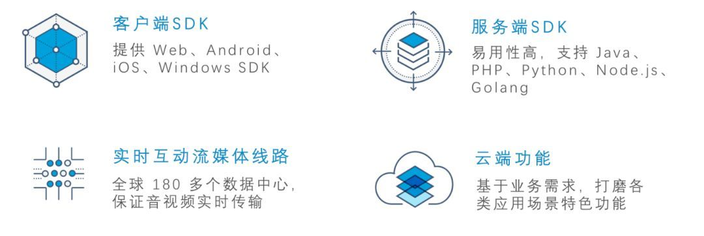
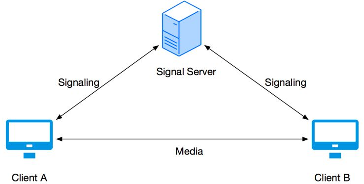
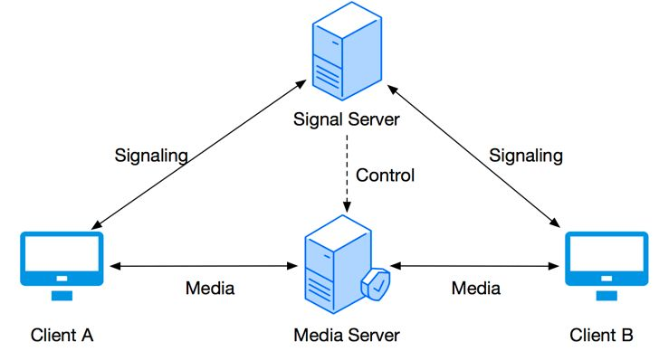
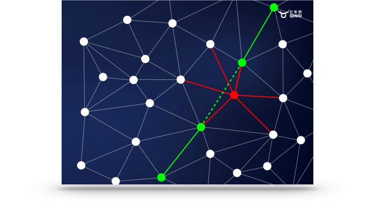
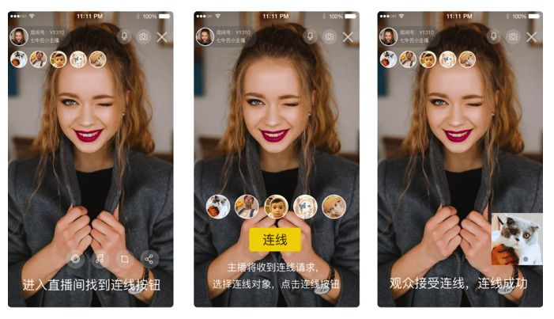
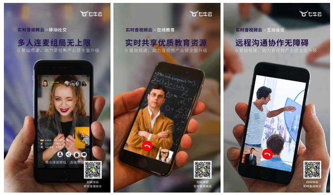
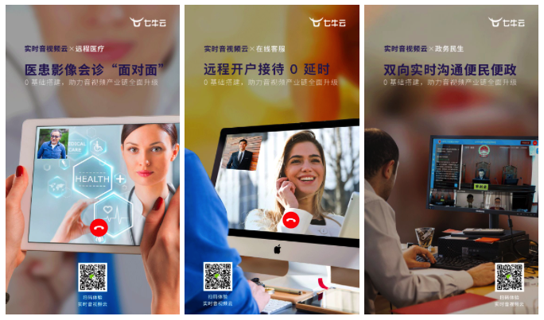

近年来，在线教育、狼人杀、在线抓娃娃、线上 KTV 等多人视频互动模式不断涌现，实时音视频通信风头正劲，实时音视频技术 WebRTC 也因此受到了广泛关注。相关数据显示，2017-2021 年期间，全球网络实时通信（WebRTC）市场将以 34.37％ 的年均复合增长率增长。（数据来源： Technavio 《全球网络实时通讯（WebRTC）市场，2017-2021》报告）

**实时互动新时代：进击的 WebRTC**

2017 年 11 月，WebRTC 1.0 标准草案出炉后，越来越多厂商开始对它进行广泛支持。WebRTC 官方数据显示，WebRTC 已经有超过 1300 个公司和项目使用，80% 以上的浏览器支持 ，WebRTC 被应用在各种我们熟知的应用上：WhatsApp、Facebook Manager、[http://appear.in](https://link.zhihu.com/?target=http%3A//appear.in) 和 TokBox 等。

WebRTC 全名为 Web Real Time Communication（网页即时通信)，是 Google 推进的开源项目，最初目标是为浏览器实现无插件的实时音视频通话。基于 WebRTC 搭建平台实现连麦互动，可大大降低音视频通信的接入门槛和开发成本：

1

**80% 的浏览器支持 WebRTC**

Google 将 WebRTC 开源之前，实现浏览器之间的实时通信是一个很困难的任务。现在，开发者无需关注音视频引擎实现细节，使用简单的 HTML 标签和 JavaScript API 就能够实现 Web 端的音视频通信功能。目前，Chrome、Safari、Firefox、Opera 等主流浏览器已经全部支持 WebRTC，作为 H5 的标准之一，未来必将有更多浏览器支持。

2

**可实现全平台互联互通**

想象这样一个场景：当你在手机上分享一个 web 链接给朋友，一定期望对方打开浏览器即可和你实时对话，因此，实现跨平台的互联互通是一个很重要的体验。Google 开放了底层端 C++ 接口，基于该接口，开发者可以开发 iOS、Android、Mac、Windows 等各平台应用，实现全平台应用互联互通。

3

**WebRTC 具有强大的打洞能力**

WebRTC 技术包含了使用 STUN、ICE、TURN、RTP-over-TCP 的关键 NAT 和防火墙穿透技术，并支持代理，保证 P2P 客户端可以通过直接通信实现文件信息、处理器运算能力、存储空间等资源的共享。

4

**安全可靠，质量稳定**

WebRTC 提供可靠的视频音频数据加密功能，保证音视频数据在公网上的传输安全，无需担心被信息窃取。对于数据敏感的企业，只要配合私有化存储，即可实现数据的安全传输和存储。同时，Google 的强大技术背书和支持，可以保证技术的快速更新迭代，例如声音降噪、音量增益、回声消除，可以极大的优化用户体验，保证稳定的质量。

**WebRTC 与产业级应用之间的距离**

这样看来，基于 WebRTC 实现实时音视频通话似乎并不难，然而实际上，从 WebRTC 到一个产业级应用，还有相当长的距离：

**1、全平台支持开发量较大**：WebRTC 只提供了 Web 端的接入能力，对 Android、iOS、Windows 等客户端没有提供简单易用的 SDK。对于开发者的能力和经验有很大的挑战，而对于缺少音视频技术积累的公司来说，这无疑会增大开发成本、延长上线时间。

**2、P2P 连接方式的天然弊病**：P2P 的连接方式最大的问题在于连通成功率不高，Google 给出的国外官方数据是 86%。在多人互动的场景下，P2P 的模型更加无力。多人互动时需要把自己的流同时发布给多人，这对上行带宽的要求很高，当前的网络环境很难支持多人会话场景。

**3、场景支持单一**：P2P 使用的是端到端之间直连，没有服务端，因此支持的场景仅限于 1 对 1 的简单通信，没有办法在服务端对音视频流做处理服务，比如：合流、旁路直播、水印、转码等。

因此，对于音视频技术能力储备较少的公司，选择一家靠谱的一站式解决方案供应商可以极大降低开发成本、缩短产品上线时间。

**七牛实时音视频云**是一套基于标准 WebRTC 的实时音视频解决方案，同时对 WebRTC 的上述问题作出了优化。 七牛实时音视频云**提供全平台的实时音视频 SDK**，通过自研 RTC 加速网络及强大云端能力支撑，为客户**提供跨平台、高品质、可定制化的一站式解决方案**。

**七牛基于 WebRTC 提供产业级解决方案**

**1**

**P2S 连接模型，实现 1 对多互动**

七牛 RTN 的连接模型叫 P2S（Peer to Sever），采用 SFU 拓扑方案，即转发模型方案。我们在 Client A 和 Client B 之间增加了服务器，Signal Sever 做端与端的信令传输，Media Sever 负责建立数据通道，基于 Media Sever 我们就可以完成转发量。相比于 WebRTC 的 P2P 模型，P2S 不仅能规避上行带宽较小的问题，还能实现多人实时音视频互动。

P2P 模型 P2S 模型

**2**

**RTC 加速网络，高可靠低延迟**

七牛 RTC 自研加速网络作为一个实时传输网络，相比于一般加速网络而言，拥有全球节点和多类供应商线路支持，采用全自研边缘加速方案，全面支持信令和数据传输的加速，智能分配流媒体服务器和加速线路，从而保证了全网的高连通性和低延时。

RTC 加速网络

3

**旁路直播云端存储，支持点播回放**

「旁路直播」和「点播回放」是实时互动的常见衍生场景。例如，几个人在线上实时开会，同时有成千上万的人也想观看会议直播，这就需要在服务端将流转推直播，即「旁路直播」，旁路直播能以较低成本实现互动信息的最大化传播：

如在金融、政务、客服等应用场景中，互动内容还需要落存储进行备案备查，可以在七牛云端实时切片和落存储；针对教育、秀场互动等场景，后期可以将落存储的音视频内容再通过 CDN 进行二次传播。

4

**支持服务端合流，应对各类终端机型**

从分发成本、存储成本的角度上考虑，在进行旁路直播、云端落存储之前，通常需要将互动的多个画面合并为一个画面，这个过程即「合流」。合流可以在客户端或服务端完成，客户端合流虽然是一种比较简单的合流方式，但是存在手机发烫、合流不稳定等问题；相比于客户端合流，服务端合流对终端要求更低，合流画面更流畅，画质更清晰，极大降低手机发热和卡顿。**七牛采用在服务端的 GPU 合流方案，可以极大的改善合流的效率、稳定性和画面质量**。

**七牛 RTN 正式上线**

**支持各种场景无缝接入**

七牛云实时音视频云（RTN）目前已正式上线，在社交、教育、医疗、金融、会议、政务民生表现出了强大的可用性，能应对各类场景的需求。

**· 社交领域**：支持主播之间互相连麦或主播观众连麦，提供美颜、滤镜、大眼、瘦脸等功能，满足趣味性互动。

**· 教育领域**：灵活支持一对一教育、互动小班、万人大班，全平台互通，支持屏幕共享，满足多场景下的教育需求。

**· 互动会议**：支持小团队线上交流和大型在线会议，可以轻松做出一款类似 WebEx 的应用。

**· 医疗领域**：支持远程多方视频会诊，突破医疗资源的地域限制和系统平台限制，提高医患时间地域灵活性，降低诊断成本。

**· 金融领域**：支持向技术支持人员发起视频通话请求，技术支持人员通过视频指导用户操作，快速定位、解决问题，提升服务品质和产品美誉度。

**· 政务民生**：支持在线庭审、远程报警、远程应急指挥等政务音视频通话需求，方便市政人员通过多终端浏览器和市民进行双向音视频通话。

在以上场景中，七牛 RTN 提供的一站式解决方案，能够保存视频，符合需要留痕的合规需求；能够对音视频进行二次加工，在对外传播效率方面有着极大的提升。

如今，互联网的快速发展，WebRTC 技术日趋成熟，实时音视频通信将会有更多的应用场景以及更大的发展空间。七牛 RTN 将继续在实时音视频领域深耕，直击实时音视频开发痛点，为音视频产业客户提供更有借鉴意义的创新技术和优质解决方案。