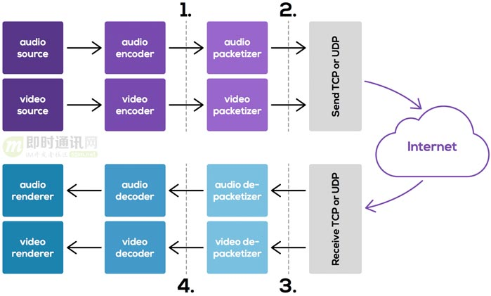
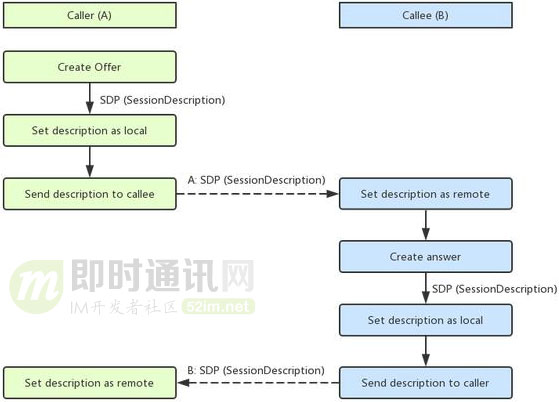

# 基于WebRTC的实时音视频首帧显示时间优化实践

## **1、引言**

在一个典型的IM应用里，使用实时音视频聊天功能时，视频首帧的显示，是一项很重要的用户体验指标。

本文主要通过对WebRTC接收端的音视频处理过程分析，来了解和优化视频首帧的显示时间，并进行了总结和分享。

（本文同步发布于：[http://www.52im.net/thread-3169-1-1.html](https://link.zhihu.com/?target=http%3A//www.52im.net/thread-3169-1-1.html)）

## **2、什么是WebRTC？**

对于没接触过实时音视频技术的人来说，总是看到别人在提WebRTC，那WebRTC是什么？我们有必要简单介绍一下。

说到 WebRTC，我们不得不提到 Gobal IP Solutions，简称 GIPS。这是一家 1990 年成立于瑞典斯德哥尔摩的 VoIP 软件开发商，提供了可以说是世界上最好的语音引擎。相关介绍详见《[访谈WebRTC标准之父：WebRTC的过去、现在和未来](https://link.zhihu.com/?target=http%3A//www.52im.net/thread-227-1-1.html)》。

Skype、腾讯 QQ、WebEx、Vidyo 等都使用了它的音频处理引擎，包含了受专利保护的回声消除算法，适应网络抖动和丢包的低延迟算法，以及先进的音频编解码器。

Google 在 Gtalk 中也使用了 GIPS 的授权。Google 在 2011 年以6820万美元收购了 GIPS，并将其源代码开源，加上在 2010 年收购的 On2 获取到的 VPx 系列视频编解码器（详见《[即时通讯音视频开发（十七）：视频编码H.264、VP8的前世今生](https://link.zhihu.com/?target=http%3A//www.52im.net/thread-274-1-1.html)》），WebRTC 开源项目应运而生，即 GIPS 音视频引擎 + 替换掉 H.264 的 VPx 视频编解码器。

在此之后，Google 又将在 Gtalk 中用于 P2P 打洞的开源项目 libjingle 融合进了 WebRTC。目前 WebRTC 提供了包括 Web、iOS、Android、Mac、Windows、Linux 在内的所有平台支持。

（以上介绍，引用自《[了不起的WebRTC：生态日趋完善，或将实时音视频技术白菜化](https://link.zhihu.com/?target=http%3A//www.52im.net/thread-1631-1-1.html)》）

虽然WebRTC的目标是实现跨平台的Web端实时音视频通讯，但因为核心层代码的Native、高品质和内聚性，开发者很容易进行除Web平台外的移殖和应用。目前为止，WebRTC几乎是是业界能免费得到的唯一高品质实时音视频通讯技术。

## **3、流程介绍**

**一个典型的实时音视频处理流程大概是这样：**

- 1）发送端采集音视频数据，通过编码器生成帧数据；
- 2）这数据被打包成 RTP 包，通过 ICE 通道发送到接收端；
- 3）接收端接收 RTP 包，取出 RTP payload，完成组帧的操作；
- 4）之后音视频解码器解码帧数据，生成视频图像或音频 PCM 数据。

**如下图所示：**

本文所涉及的参数调整，谈论的部分位于上图中的第 4 步。

因为是接收端，所以会收到对方的 Offer 请求。先设置 SetRemoteDescription 再 SetLocalDescription。

**如下图蓝色部分：**

## **4、参数调整**

### **4.1 视频参数调整**

当收到 Signal 线程 SetRemoteDescription 后，会在 Worker 线程中创建 VideoReceiveStream 对象。具体流程为 SetRemoteDescription -> VideoChannel::SetRemoteContent_w 创建 WebRtcVideoReceiveStream。

WebRtcVideoReceiveStream 包含了一个 VideoReceiveStream 类型 stream_ 对象， 通过 webrtc::VideoReceiveStream* Call::CreateVideoReceiveStream 创建。

创建后立即启动 VideoReceiveStream 工作，即调用 Start() 方法。

此时 VideoReceiveStream 包含一个 RtpVideoStreamReceiver 对象准备开始处理 video RTP 包。

接收方创建 createAnswer 后通过 setLocalDescription 设置 local descritpion。

对应会在 Worker 线程中 setLocalContent_w 方法中根据 SDP 设置 channel 的接收参数，最终会调用到 WebRtcVideoReceiveStream::SetRecvParameters。

**WebRtcVideoReceiveStream::SetRecvParameters 实现如下：**

> void WebRtcVideoChannel::WebRtcVideoReceiveStream::SetRecvParameters(
> const ChangedRecvParameters& params) {
> bool video_needs_recreation = false;
> bool flexfec_needs_recreation = false;
> if(params.codec_settings) {
> ConfigureCodecs(*params.codec_settings);
> video_needs_recreation = true;
> }
> if(params.rtp_header_extensions) {
> config_.rtp.extensions = *params.rtp_header_extensions;
> flexfec_config_.rtp_header_extensions = *params.rtp_header_extensions;
> video_needs_recreation = true;
> flexfec_needs_recreation = true;
> }
> if(params.flexfec_payload_type) {
> ConfigureFlexfecCodec(*params.flexfec_payload_type);
> flexfec_needs_recreation = true;
> }
> if(flexfec_needs_recreation) {
> RTC_LOG(LS_INFO) << "MaybeRecreateWebRtcFlexfecStream (recv) because of "
> "SetRecvParameters";
> MaybeRecreateWebRtcFlexfecStream();
> }
> if(video_needs_recreation) {
> RTC_LOG(LS_INFO)
> << "RecreateWebRtcVideoStream (recv) because of SetRecvParameters";
> RecreateWebRtcVideoStream();
> }
> }

根据上面 SetRecvParameters 代码，如果 codec_settings 不为空、rtp_header_extensions 不为空、flexfec_payload_type 不为空都会重启 VideoReceiveStream。

video_needs_recreation 表示是否要重启 VideoReceiveStream。

**重启过程为：**把先前创建的释放掉，然后重建新的 VideoReceiveStream。

以 codec_settings 为例：初始 video codec 支持 H264 和 VP8。若对端只支持 H264，协商后的 codec 仅支持 H264。SetRecvParameters 中的 codec_settings 为 H264 不空。其实前后 VideoReceiveStream 的都有 H264 codec，没有必要重建 VideoReceiveStream。可以通过配置本地支持的 video codec 初始列表和 rtp extensions，从而生成的 local SDP 和 remote SDP 中影响接收参数部分调整一致，并且判断 codec_settings 是否相等。 如果不相等再 video_needs_recreation 为 true。

这样设置就会使 SetRecvParameters 避免触发重启 VideoReceiveStream 逻辑。

在 debug 模式下，修改后，验证没有 “RecreateWebRtcVideoStream (recv) because of SetRecvParameters” 的打印, 即可证明没有 VideoReceiveStream 重启。

### **4.2 音频参数调整**

和上面的视频调整类似，音频也会有因为 rtp extensions 不一致导致重新创建 AudioReceiveStream，也是释放先前的 AudioReceiveStream，再重新创建 AudioReceiveStream。

**参考代码:**

> bool WebRtcVoiceMediaChannel::SetRecvParameters(
> const AudioRecvParameters& params) {
> TRACE_EVENT0("webrtc", "WebRtcVoiceMediaChannel::SetRecvParameters");
> RTC_DCHECK(worker_thread_checker_.CalledOnValidThread());
> RTC_LOG(LS_INFO) << "WebRtcVoiceMediaChannel::SetRecvParameters: "
> << params.ToString();
> // TODO(pthatcher): Refactor this to be more clean now that we have
> // all the information at once.
>
> if(!SetRecvCodecs(params.codecs)) {
> return false;
> }
>
> if(!ValidateRtpExtensions(params.extensions)) {
> return false;
> }
> std::vector<webrtc::RtpExtension> filtered_extensions = FilterRtpExtensions(
> params.extensions, webrtc::RtpExtension::IsSupportedForAudio, false);
> if(recv_rtp_extensions_ != filtered_extensions) {
> recv_rtp_extensions_.swap(filtered_extensions);
> for(auto& it : recv_streams_) {
> it.second->SetRtpExtensionsAndRecreateStream(recv_rtp_extensions_);
> }
> }
> return true;
> }

AudioReceiveStream 的构造方法会启动音频设备，即调用 AudioDeviceModule 的 StartPlayout。

AudioReceiveStream 的析构方法会停止音频设备，即调用 AudioDeviceModule 的 StopPlayout。

因此重启 AudioReceiveStream 会触发多次 StartPlayout/StopPlayout。

经测试，这些不必要的操作会导致进入视频会议的房间时，播放的音频有一小段间断的情况。

**解决方法：**同样是通过配置本地支持的 audio codec 初始列表和 rtp extensions，从而生成的 local SDP 和 remote SDP 中影响接收参数部分调整一致，避免 AudioReceiveStream 重启逻辑。

另外 audio codec 多为 WebRTC 内部实现，去掉一些不用的 Audio Codec，可以减小 WebRTC 对应的库文件。

### **4.3 音视频相互影响**

**WebRTC 内部有三个非常重要的线程：**

- 1）woker 线程；
- 2）signal 线程；
- 3）network 线程。

调用 PeerConnection 的 API 的调用会由 signal 线程进入到 worker 线程。

worker 线程内完成媒体数据的处理，network 线程处理网络相关的事务，channel.h 文件中有说明，以 _w 结尾的方法为 worker 线程的方法，signal 线程的到 worker 线程的调用是同步操作。

如下面代码中的 InvokerOnWorker 是同步操作，setLocalContent_w 和 setRemoteContent_w 是 worker 线程中的方法。

> bool BaseChannel::SetLocalContent(const MediaContentDescription* content,
> SdpType type,
> std::string* error_desc) {
> TRACE_EVENT0("webrtc", "BaseChannel::SetLocalContent");
> returnI nvokeOnWorker<bool>(
> RTC_FROM_HERE,
> Bind(&BaseChannel::SetLocalContent_w, this, content, type, error_desc));
> }
>
> bool BaseChannel::SetRemoteContent(const MediaContentDescription* content,
> SdpType type,
> std::string* error_desc) {
> TRACE_EVENT0("webrtc", "BaseChannel::SetRemoteContent");
> return InvokeOnWorker<bool>(
> RTC_FROM_HERE,
> Bind(&BaseChannel::SetRemoteContent_w, this, content, type, error_desc));
> }

setLocalDescription 和 setRemoteDescription 中的 SDP 信息都会通过 PeerConnection 的 PushdownMediaDescription 方法依次下发给 audio/video RtpTransceiver 设置 SDP 信息。

**举例：**执行 audio 的 SetRemoteContent_w 执行很长（比如音频 AudioDeviceModule 的 InitPlayout 执行耗时）, 会影响后面的 video SetRemoteContent_w 的设置时间。

**PushdownMediaDescription 代码：**

> RTCError PeerConnection::PushdownMediaDescription(
> SdpType type,
> cricket::ContentSource source) {
> const SessionDescriptionInterface* sdesc =
> (source == cricket::CS_LOCAL ? local_description()
> : remote_description());
> RTC_DCHECK(sdesc);
>
> // Push down the new SDP media section for each audio/video transceiver.
> for(const auto& transceiver : transceivers_) {
> const ContentInfo* content_info =
> FindMediaSectionForTransceiver(transceiver, sdesc);
> cricket::ChannelInterface* channel = transceiver->internal()->channel();
> if(!channel || !content_info || content_info->rejected) {
> continue;
> }
> const MediaContentDescription* content_desc =
> content_info->media_description();
> if(!content_desc) {
> continue;
> }
> std::string error;
> bool success = (source == cricket::CS_LOCAL)
> ? channel->SetLocalContent(content_desc, type, &error)
> : channel->SetRemoteContent(content_desc, type, &error);
> if(!success) {
> LOG_AND_RETURN_ERROR(RTCErrorType::INVALID_PARAMETER, error);
> }
> }
> ...
> }

## **5、其他影响首帧显示的问题**

### **5.1 Android图像宽高16字节对齐**

AndroidVideoDecoder 是 WebRTC Android 平台上的视频硬解类。AndroidVideoDecoder 利用 [MediaCodec](https://link.zhihu.com/?target=http%3A//docs.52im.net/extend/docs/api/android-50/reference/android/media/MediaCodec.html) API 完成对硬件解码器的调用。

**[MediaCodec](https://link.zhihu.com/?target=http%3A//docs.52im.net/extend/docs/api/android-50/reference/android/media/MediaCodec.html) 有已下解码相关的 API：**

- 1）dequeueInputBuffer：若大于 0，则是返回填充编码数据的缓冲区的索引，该操作为同步操作；
- 2）getInputBuffer：填充编码数据的 ByteBuffer 数组，结合 dequeueInputBuffer 返回值，可获取一个可填充编码数据的 ByteBuffer；
- 3）queueInputBuffer：应用将编码数据拷贝到 ByteBuffer 后，通过该方法告知 MediaCodec 已经填写的编码数据的缓冲区索引；
- 4）dequeueOutputBuffer：若大于 0，则是返回填充解码数据的缓冲区的索引，该操作为同步操作；
- 5）getOutputBuffer：填充解码数据的 ByteBuffer 数组，结合 dequeueOutputBuffer 返回值，可获取一个可填充解码数据的 ByteBuffer；
- 6）releaseOutputBuffer：告诉编码器数据处理完成，释放 ByteBuffer 数据。

在实践当中发现，发送端发送的视频宽高需要 16 字节对齐，因为在某些 Android 手机上解码器需要 16 字节对齐。

**大致的原理就是：**Android 上视频解码先是把待解码的数据通过 queueInputBuffer 给到 MediaCodec。然后通过 dequeueOutputBuffer 反复查看是否有解完的视频帧。若非 16 字节对齐，dequeueOutputBuffer 会有一次MediaCodec.INFO_OUTPUT_BUFFERS_CHANGED。而不是一上来就能成功解码一帧。

**经测试发现：**帧宽高非 16 字节对齐会比 16 字节对齐的慢 100 ms 左右。

### **5.2 服务器需转发关键帧请求**

iOS 移动设备上，WebRTC App应用进入后台后，视频解码由 VTDecompressionSessionDecodeFrame 返回 kVTInvalidSessionErr，表示解码session 无效。从而会触发观看端的关键帧请求给服务器。

这里要求服务器必须转发接收端发来的关键帧请求给发送端。若服务器没有转发关键帧给发送端，接收端就会长时间没有可以渲染的图像，从而出现黑屏问题。

这种情况下只能等待发送端自己生成关键帧，发送个接收端，从而使黑屏的接收端恢复正常。

### **5.3 WebRTC内部的一些丢弃数据逻辑举例**

Webrtc从接受报数据到、给到解码器之间的过程中也会有很多验证数据的正确性。

***举例1：\***

PacketBuffer 中记录着当前缓存的最小的序号 first_seq_num_（这个值也是会被更新的）。 当 PacketBuffer 中 InsertPacket 时候，如果即将要插入的 packet 的序号 seq_num 小于 first_seq_num，这个 packet 会被丢弃掉。如果因此持续丢弃 packet，就会有视频不显示或卡顿的情况。

***举例2：\***

正常情况下 FrameBuffer 中帧的 picture id，时间戳都是一直正增长的。

**如果 FrameBuffer 收到 picture_id 比最后解码帧的 picture id 小时，分两种情况：**

- 1）时间戳比最后解码帧的时间戳大，且是关键帧，就会保存下来。
- 2）除情况 1 之外的帧都会丢弃掉。

**代码如下:**

> auto last_decoded_frame = decoded_frames_history_.GetLastDecodedFrameId();
> auto last_decoded_frame_timestamp =
> decoded_frames_history_.GetLastDecodedFrameTimestamp();
> if(last_decoded_frame && id <= *last_decoded_frame) {
> if(AheadOf(frame->Timestamp(), *last_decoded_frame_timestamp) &&
> frame->is_keyframe()) {
> // If this frame has a newer timestamp but an earlier picture id then we
> // assume there has been a jump in the picture id due to some encoder
> // reconfiguration or some other reason. Even though this is not according
> // to spec we can still continue to decode from this frame if it is a
> // keyframe.
> RTC_LOG(LS_WARNING)
> << "A jump in picture id was detected, clearing buffer.";
> ClearFramesAndHistory();
> last_continuous_picture_id = -1;
> } else{
> RTC_LOG(LS_WARNING) << "Frame with (picture_id:spatial_id) ("
> << id.picture_id << ":"
> << static_cast<int>(id.spatial_layer)
> << ") inserted after frame ("
> << last_decoded_frame->picture_id << ":"
> << static_cast<int>(last_decoded_frame->spatial_layer)
> << ") was handed off for decoding, dropping frame.";
> return last_continuous_picture_id;
> }
> }

因此为了能让收到了流顺利播放，发送端和中转的服务端需要确保视频帧的 picture_id, 时间戳正确性。

WebRTC 还有其他很多丢帧逻辑，若网络正常且有持续有接收数据，但是视频卡顿或黑屏无显示，多为流本身的问题。

## **6、本文小结**

本文通过分析 WebRTC 音视频接收端的处理逻辑，列举了一些可以优化首帧显示的点，比如通过调整 local SDP 和 remote SDP 中与影响接收端处理的相关部分，从而避免 Audio/Video ReceiveStream 的重启。

另外列举了 Android 解码器对视频宽高的要求、服务端对关键帧请求处理、以及 WebRTC 代码内部的一些丢帧逻辑等多个方面对视频显示的影响。 这些点都提高了融云 SDK 视频首帧的显示时间，改善了用户体验。