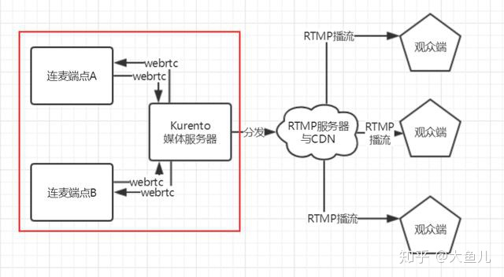

# 架构设计：基于Webrtc、Kurento的一种低延迟架构实现

## 前言

在音视频领域，低延迟交互一直是一个非常重要的需求。
而直播大多基于RTMP协议，其存在1到3秒左右的延迟，基本无法胜任低延迟交互的需求；另外在游戏领域、语音聊天、教育领域，低延迟也是一个非常重要的议题。
下面以直播的连麦架构的设计来简单介绍下整个架构设计的演进流程。

## 最朴素的连麦架构（基于RTMP）

**架构设计**

基于RTMP的连麦设计.png

**架构解析**

1. 连麦端A/B存在多平台特性，例如Android、iOS、PC(Web)等，其利用RTMP协议将音视频推送到RTMP服务器。
2. 连麦端A在推送RTMP的同时，拉取连麦端B的RTMP流数据用于播放。
3. RTMP服务端通过CDN海量分发，将两路音视频数据推送到观众端。

**存在问题**：
由于RTMP天然存在延迟的特性，业界统计大概在1~3秒之间。
如果我们以一个连麦端点在推流和播流之间的延迟以一个 delay_time （延迟时间）来表示。
也就是说A端看到B端的音视频流是一个 delay_time 之前的数据，如果A端做出回应，那么B端在整个回应需要浪费两个 delay_time 时间（A到B的延迟+B回应A的延迟）。

回应延迟示例.png

理论上延迟需要控制在500毫秒以内才能保证流畅的交流，上述设计明显是不可接受的，自然架构需要升级。

## 引入实时通信的开源框架Webrtc

**什么是webrtc**

WebRTC 全称 Web Real-Time Communication。 包含了媒体、加密、传输层等在内的多个协议，极大的降低了音视频实时通信技术的门槛。

- Andorid/iOS端音视频数据采集。
- 灵活的信令控制设计。
- 回音消除模块、加密模块。
- 低延迟的音视频流传输协议

webrtc的官网地址：[https://webrtc.org](https://link.zhihu.com/?target=https%3A//webrtc.org)
webrtc编译可以参考：Webrtc 研究： Android编译

**架构设计**

引入webrtc的连麦设计.png

**架构解析**
关注红框部分，这里将连麦端A/B的交互由RTMP改为webrtc实现，由于webrtc是一个低延迟的框架，保证了双端交互的实时性。

**存在问题**
这个框架其实还有一个问题，就是虽然连麦双端利用webrtc进行交流，但是其分发到CDN的流数据都是独立发送的，也就是没有一个同步机制可以控制多路流的时基一致性。
通俗点讲，假设一个问问题的场景，并且此时候A端到观众端有3秒延迟，B端到观众端有1秒延迟，那么会出现这么奇怪的场景：B端先回答了问题，然后A端由于延迟才提问问题。

独立推流同步控制.png

## 引入本地多路流同步机制

**解决思路**
如果在RTMP独立推流的情况，一旦出现网络抖动；容易出现各个直播流到观众端的延迟不可控，而出现了答非所问的尴尬场景。

**架构设计**

本地合流设计.png

**架构解析**
连麦端点A通过提取webrtc的实时音视频流数据，与本地采集到的音视频流数据进行混流；并且将混流完毕后所得的流数据通过RTMP推送到CDN。以此代替两端独立推流的设计，并且可以在A端（混流端）可以进行同步控制。

**存在问题**

- 多点连麦存在webrtc流网络复杂的问题。

由于webrtc是点对点通信，并不支持广播，所以一旦终端节点增多，其实时交互网络复杂度将会迅速提升。
简单列举下：
2个端点需要建立2条webrtc通道。
3个端点需要建立6条webrtc通道。
n个端点需要建立n*(n-1)条webrtc通道。

组网示意图.png

- 混流端机器性能要求高、压力比较大。

这个设计将混流推流压力集中在其中一个端点，例如3连麦端点组网的话，混流端点需要实现如下工作：
1.发送2路webrtc流
2.接收2路webrtc流
3.采集1路音视频流
4.解码2路webrtc流
5.合并3路音视频
6.编码1路rtmp流
7.发送1路rtmp流

一般来说，移动设备的性能并不能完全hold住这些io、计算密集型的任务，所以随着连麦节点的增加，混流端点的压力也会加倍增长。

- 连麦端到端音视频流数据不可控。

由于webrtc的基于p2p的特性，一旦通过服务端完成信令交互后。服务端在后续的音视频数据传输并不需要也不能进行监控处理，也就是说对于一些视频备份、关键帧鉴别等功能是无法实现的。

## 媒体服务器Kurento的使用

**简单说下kurento**
Kurento 是一个 WebRTC 流媒体服务器以及一些客户端API，有了它，开发WWW及智能手机平台的高级视频应用就变得更加容易。

- 群组通信（group communications）。
- 媒体流的转码、录制、广播、路由。
- 高级媒体处理特性，包括：机器视觉、视频索引、增强现实、语音分析。

官网地址：[http://www.kurento.org](https://link.zhihu.com/?target=http%3A//www.kurento.org)

**架构设计**

媒体服务器设计.png

**架构解析**
引入了Kurento这个媒体服务器来替换上面的混流端点。

- 由于媒体服务器也是一个webrtc端点，其完美支持与终端的实时音视频流通信；
- 同时Kurento还支持对音视频进行预处理，例如图像增强、转发RTP、本地缓存等功能；
- 而且建立在服务器资源上的视频数据处理也能更好的解决多端点连麦带来的性能瓶颈。

最后通过Kurento媒体服务器将处理完毕数据转发到RTMP服务器，并通过CDN分发推送到海量观众端。

## Kurento的进一步设计

当然Kurento仅仅只是一个媒体服务器，我们同时也需要一个跟媒体服务器核心打交道的业务模块，其实Kurento已经把我们把生态建立好了。

有以下几个开源库提供我们二次开发：

- 信令服务器与web客户端 kurento-room
- Android客户端开源库
- iOS客户端开源库

**信令服务架构设计**

信令服务器.png

**架构解析**
连麦终端（Android/iOS/Web）在Kurento-room创建房间以及用户等角色，并且根据特定业务需求，聊天服务器充当连麦终端与媒体服务器的交流媒介，并通过业务需求触发媒体服务器构建业务管道（例如创建转发管道、视频帧预处理管道等），等信令交互完毕后，连麦终端直接与媒体服务器建立webrtc数据传输通道。

## Kurento的缺陷

由于Kurento并没有提供RTMP的转发模块，所以除非实现自定义Kurento模块，否则无法实现媒体服务器直接推送RTMP流数据，但是Kurento已经提供了RTP的转发模块，所以我们可以借助RTP转发模块间接实现RTMP的转发推流。

**Kurento转发端点设计**

转发实现.png

笔者发现以下两种转发的实现方案：

**gstreamer转发模块**
笔者实现的一个转发管道，主要流程是：
RTP解包 —— 音视频转换 —— FLV封包 —— RTMP推流
具体组件如下：

Gstreamer管道设计.png

**ffmpeg转发模块**
实现方案比较简单，就是利用ffmpeg可执行文件将本地RTP流封装转发成RTMP推送出去，具体可以参考这个开源工程：
kurento-rtmp

## 结语

这篇文章简单介绍了基于Webrtc和Kurento为基础实现的低延迟架构的设计，由于立足于架构介绍，所以没有对单独各个点深入讲解，后续会针对各个部分讲解实现细节。

**另外还有一些关于c++ Linux后台服务器开发的一些知识点分享：Linux，Nginx，MySQL，Redis，P2P，K8S，Docker，TCP/IP，协程，DPDK，webrtc，音视频等等视频。**

喜欢的朋友可以加1470646927获取学习视频

