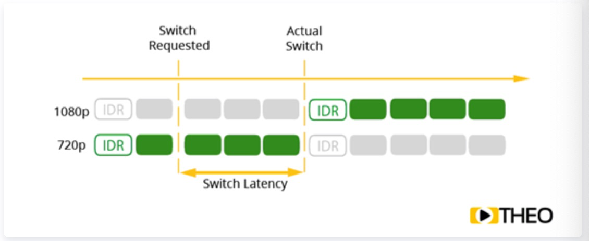
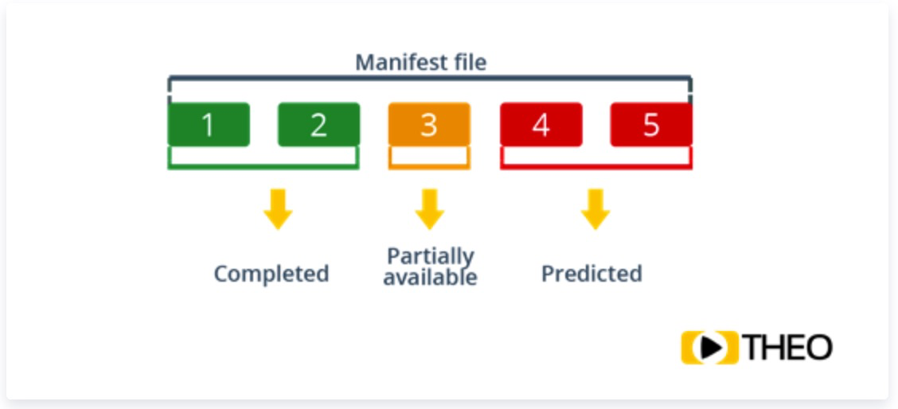

# 视频传输延迟分析及解决方案：CMAF、LHLS

使用在线流媒体平台做直播时，实时体验至关重要：看世界杯时，您还边正在聚精会神地盯着C罗的金刚腿等着罚球，隔壁老王就传出进球欢呼声，您肯定无比郁闷。视频播放领域的新锐——THEOplayer，不久前写了三个不错的系列文章，详细分析了造成视频传输延迟的原因，介绍了两个缩小延迟的解决方案：CMAF和LHLS，为提升直播观看体验提供了思路。话不多说，各位热爱媒体技术的小伙伴们，Let’s Go~

**什么是延迟**

延迟可以定义为“某些物理变化的原因和结果之间的时间”。在生活中，人们最容易能够经历到的传输延迟，是通过测量现实生活中记录某些内容以及在屏幕上看到这些内容的时间差来感受到的，例如在相机前面挥动手，而将会在屏幕上过某一时间段后可看到。

传输高延迟，尤其在交互式实时体验中，会严重影响用户体验。假如有一个具有约20秒延迟的直播流，观众可以随时提问：这意味着主演视频的人在T0时刻表演某些动作，此图像将在20秒后出现在观众的屏幕上，在此期间，broadcaster将继续传输演员正在做的事情。但是，如果用户询问有关T0时刻的问题，并在broadcaster的屏幕上显示，而broadcaster这时可能已经做了一些完全不同的事情，只能根据当前的情景回答观众问题，而且观众得到这个错误的回复又要等20s。

图1. 什么是延迟

**什么造成了延迟**

端到端媒体传输系统可以看作一个传输管道，这个管道由一系列组件组成，每个组件都会造成一定延迟。根据不同组件特性优化配置这些组件，可以有效减小延迟。音视频内容通过组件时容易形成累积延迟：

- 编码和封装：引入延迟和参数配置、质量要求密切相关。某些流媒体协议可能会引入额外的延迟，因为它们只有在完全接收到后才输出一大块（chunk）媒体内容。
- 第一英里上传（first mile upload）：将打包内容上传到[CDN](https://cloud.tencent.com/product/cdn?from=10680)通常会受到商业条款的限制。例如，与来自新闻工作室的租用线路设置相比，如果通过无线连接完成上传将会产生更大的延迟。
- CDN传播：为了大规模传送内容，大多数媒体管道都利用内容传送网络(content delivery network)。因此，内容需要在不同缓存之间传播，从而引入额外延迟。
- 最后一英里交付(last mile delivery)：用户网络连接可能会对延迟产生重大影响。用户可以在家庭网络连接到wifi热点，或者使用移动连接来访问网络内容。此外，由于可能会选取不同远近的CDN端点，用户地理位置也会造成额外延迟。
- 播放器缓冲区：视频播放器必须缓冲媒体以确保流畅播放。缓冲区大小通常在媒体规范中定义，但具有一定灵活性。播放缓冲是延迟的主要因素，优化缓冲区配置是常态。

图2. 什么造成了延迟

**延迟vs可扩展性vs质量**

媒体管道中不同组件的配置对延迟影响很大。通常不能随意更改配置，必须根据业务要求仔细考虑。在决定配置时，还有许多其他因素在起作用，如可扩展性（scale）和质量（quality）。

- 可扩展性（scale）：RTMP等协议扩展性差，系统随着负载的增加有崩溃风险。基于HTTP的流媒体协议使用普遍，这些协议（例如HTTP实时流传输（HLS），Microsoft Smooth Streaming，Adobe HTTP动态流传输（HDS）和后来的MPEG-DASH）使用HTTP框架，因此可以使用标准HTTP缓存和CDN进行扩展。然而，这些协议的缺点是以牺牲延迟为代价来获得可扩展性，延迟时间普遍长达一分钟。
- 质量（quality）：在观察视频质量和视频延迟两个维度时，我们可以看到类似的矛盾。为用户实现更高质量通常会导致更高带宽要求，这是因为需要更高分辨率和帧率，在编码器端需要更多缓存时间(比如Look ahead等技术)来获得高压缩比特流。此外，减少播放器缓冲区可以减少延迟，但往往会显著影响用户体验，因为空缓冲区将导致播放停顿，特别当目标缓冲区设置较小时发生的概率较高。

图3. 延迟（latency）vs可扩展性（scalability）vs质量（quality）

一些新的压缩算法可以实现更低延迟，但仍需<延迟-扩展性-质量>三者之间找到适当的平衡点。例如，云编码有效提高扩展性，而新的媒体编解码技术，如VP9，HEVC和AV1，可以显著降低带宽（或提升质量）。具体要根据特定应用场景做出平衡：当延迟至关重要的时，例如视频会议或视频安全监控，可以牺牲扩展性或质量；另一方面，在线性广播中大规模传送高质量媒体内容时，延迟通常会略微增加。因此，平衡三角形的理想位置取决于具体场景。在大多数情况下，可以通过配置媒体管道中的不同组件参数来移动三角形的平衡位置。

**接入延迟、切换延迟、端到端延迟**

前面提到通过挥动手并记录时间来测量相机和屏幕之间的延迟。“glass-to-glass latency”这个名称，指的是显示器屏幕和相机镜片之间的延迟，也可以叫做“端到端延迟”，意思是开始（ 捕获）并结束（显示）之间整个传输管道上的延迟。但是，还有许多其他因素通常会影响延迟：接入延迟或起播延迟（join latency）和切换延迟（switch latency）。

虽然接入延迟和切换延迟通常不算在端到端延迟中，但它们确实会影响用户体验，在某些配置中实际上是整个端到端延迟的一部分。

- 接入延迟与第一帧的播放时间密切相关，即开始播放新流所需等待的时间。这种延迟通常是网络延迟造成的，例如所需网络请求数量较大。此外，高级媒体播放器允许您配置是否应该在有第一个数据后立即开始播放，或者它们是否应该等到服务器传输新块后再开始播放，这会导致更高的接入延迟，但可能实际的端到端延迟并不高。

图4. 加入延迟vs端到端延迟

- 另一方面，切换延迟是在不同流之间切换所需的时间，例如自适应比特率信道。这是停止接受旧流而显示新流时图像之间的切换时间。该等待时间主要与流式传输协议的内部结构和正在使用的图像组（GOP）格式有关。只有在新的GOP开始传输时，才在关键帧处开始播放。然而，很多配置中GOP较大、关键帧数量较少，因为这种配置会节省码率（或提升质量）。

图5. 什么是切换延迟

**使用不同优化方法的效果**

虽然优化延迟很重要，但经常会遇到的问题是“你的延迟应该有多低？”。答案取决于具体应用情形。一般而言，建议客户进行一些更改，以减少已经在18-30秒范围内的延迟，这可以用最少的努力和成本来实现。对于延迟至关重要的情况，可以调查最新的协议进展，例如供应商正在实施的Chunked CMAF标准的较新低延迟CMAF协议。如果该情况需要超低延迟或实时延迟，则在增加可扩展性和提高质量时，需要以高成本使用诸如RTMP或WebRTC的解决方案。

- 典型延迟（typical latency）：如下图所示，在这个区域，我们看到一般都是HLS和MPEG-DASH设置，这两种适用于非时间敏感的线性广播，并且不会与广播公司或社交媒体上的其他观众进行任何交互。
- 较少延迟（reduced latency）：通过调整HLS和MPEG-DASH流来减少延迟，减少了segment大小并增加了infrastructure的大小。该方法通常用于直播新闻和体育赛事。
- 低延迟（low latency）：低延迟通常被视为每个发布者的目标，因为它允许更多交互式用例。
- 超低延迟（ultra low latency）：可以实现更好的交互性，感觉接近实时。虽然不适合语音通信或会议，但这种延迟通常对于常见用例而言足够低。
- 实时通信（real time communication）：实时通信对于双向会议和通信等用例至关重要。

图6 不同协议的延迟

**对改进延迟的进一步展望**

对于替换现有的基于HLS和MPEG-DASH的媒体管道以及旨在减少延迟的方法和协议，仍存在广泛的争议。有许多不同类型的解决方案在起作用，一些解决方案试图关注第一英里协议，也有解决方案更多地关注最后一英里协议。对于这些协议，关键焦点是：

- 编码器和播放器之间的视频传输快速而有效。
- 提高扩展性从而增加受众是有收益的。
- 该方法适用于整个设备，无需额外要求。

业内现有四种主要方法：

1. 回到RTMP：RTMP可扩展性不好，使得这种方法可能看起来很奇怪，但云基础设施的技术进步以及CDN中的RTMP支持已经大幅减少了扩展旧协议的代价。但随着RTMP支持的减少、Flash的消亡和浏览器停止对其支持，这种方法未来预期不佳。如果越来越多的CDN停止RTMP支持，会导致继续使用RTMP的成本大幅增加。
2. 基于WebRTC：WebRTC专注于实时数据传输，并为会议工具等案例提供选项。对该解决方案的权衡取决于质量方面，其中速度被认为优先于其他任何方面。此外，大多数CDN尚未提供对WebRTC的支持，该协议需要复杂的服务器设置才能进行部署。
3. 利用WebSockets和HTTP / 2.0：WebSockets提供了一种快速在Web上传输数据的方法。这种方法的缺点是缺乏标准化支持。然而，一些公司已经实现了基于该协议的逐帧传输。此解决方案的另一个问题出现在可扩展性上，扩展WebSockets的成本可能会大幅增加。
4. 基于MPEG-DASH / HLS：考虑到标准，MPEG-DASH或HLS的使用和优化感觉是一个不错的选择。通过简单地减小segment的大小，将延迟降低到5-12s范围，已经可以显著减少延迟。进一步构建这一想法的是低延迟CMAF（也称为Chunked CMAF）规范，该规范将更小的可播放块中的各个段分开。随着这些块使用HTTP / 1.1分块逐步传输，延迟可进一步减少，当前的实现显示能够将延迟降低至3-7秒，而提供稳定播放。当新协议（如HTTP / 2.0或QUIC，将网络从TCP带到UDP）的功能添加到组合中时，这种方法将是一个有价值的替代方案，并且可能在市场中获得青睐。

此类别中另一个值得研究的选择是由Twitter开发的“低延迟HLS”也称为LHLS。在此解决方案中，使用分块传输来传送视频块，类似于MPEG-DASH的低延迟CMAF解决方案。 但是，这种方法不是使用CMAF，而是倾向于使用传输流（TS）段。该方法与许多其他控制整个管道的方案一起使用，非常适合那些需要高度灵活性和控制力的用户。

下面深入探讨低延迟CMAF和Chunked CMAF。

在前面已经讨论了延迟：它是什么以及它为何重要，对当前的行业方法进行了概述。由于媒体公司正在寻求将延迟降低到仅几秒（甚至更低），我们特别关注那些目前正在大规模推广的协议。第一个讨论的是低延迟CMAF也叫Chunked CMAF。

什么是CMAF

2016年，Apple公司宣布他们将开始在HLS中支持CMAF（通用媒体应用格式Common Media Application Format）。 就像这种格式的名字一样，目标是将HLS和MPEG-DASH格式结合在一起，以简化在线视频传输。与普遍看法相反，CMAF本身不会减少延迟，而是提供了一种低延迟模式，可以将媒体段划分为更小的块。

CMAF利用的是ISOBMFF，fMP4容器（ISO / IEC 14496-12：201）。然而，在过去，HLS利用的是TS（transport streams）容器，它已经为广播和有线电视行业很好地提供了连续的数据流，但分段媒体传输不是其优势之一，产生的开销比率在5％到15％之间，远远高于fMP4。最重要的是，fMP4格式易于扩展，并且已经在DASH，Smooth和HDS实现中经常使用。

除了将段（segment）加入通用格式之外，CMAF还与通用加密（CENC-ISO / IEC 23001-7：2016）标准相关联，该标准通过加密和DRM系统简化内容保护。这些标准目前在融合到一个共同的系统。

CMAF要求段（segment）以关键帧开始，关键帧必须精确对齐比特率。这可以使得播放更加迅速，因为播放可以从单个段开始并且独立于流中的任何其他段。对齐关键帧的第二个优点是：它简化了比特率切换。当播放器收到关键帧时，它知道它可以安全地切换到不同的比特率，因为在那里也可以使用开始解码的关键帧。

HTTP自适应传输和分块传输编码

 CMAF具有低延迟模式。这种低延迟模式允许将单个segment拆分为较小的chunks。有人可能会问：为什么我需要分割一个segment，而不仅仅是缩小segment？CMAF在每个segment的开头都需要一个关键帧; chunk的情况并非如此。关键帧往往比非关键帧大得多。当同时提供相同的质量内容时，segment大小的减少将导致关键帧增加进而使得带宽增加。

图7. 在不同的编码时间之后流式传输CMAF块

segment通常具有2到6秒的持续时间。大多数流协议已经确定了大约三个段的缓冲区，并且通常第四个segment也正在缓冲，这有助于避免播放停顿。这里的原因是需要在manifest中列出segment，编码，下载并作为整体添加到缓冲区，而这一系列操作通常会导致10-30s的延迟。

图8. 3个segment的延迟会造成23秒的延迟

通过将segment拆分成chunks，流式传输服务器可以在整个chunk尚未获取完成就使得segment内的chunk可用。因为用户可以提前下载单个chunk，不用下载完整的segment，并且可以更快地填充缓冲区，所以这样会显著减少端到端延迟。

图9. CMAF chunks计划

仅仅分成chunk不足以减少延迟。虽然生成chunk而不是segment允许打包器更快地生成chunk（并且在第一个chunk准备就绪后已经在manifest中列出了一个segment），但媒体传输管道的以下组件也应该准备就绪。在实际中，这意味着源应该使用HTTP / 1.1分块传输编码（或者替代协议上的类似技术）来发现chunk。类似地，允许扩展到更多受众的CDN应该模仿这种行为，并以相同的方式将chunk暴露给播放器。

图10. chunks传输流程

在播放器方面，还应该提供对分块传输编码的支持，同时提供内部媒体管道，允许将chunks媒体添加到缓冲区并播放。播放器还应该能够识别可用的chunk，并可智能修改其缓冲区并优化以减少延迟。如果传输流的管道中的任何一个环节未被修改成上面的要求的版本，则分割segment将没有任何好处。

 Chunked CMAF是一种非常有前途的技术，并且已经标准化和部署实施。然而，也有一些同样值得研究的协议，比如低延迟HLS或LHLS。

什么是LHLS

正如其名称所描述的，LHLS是Apple公司的HTTP直播流（HLS）协议的改编版，该协议通常在业内使用。从历史上看，HLS解决的是RTMP等协议中面临的可扩展性问题。相应的HLS的延迟会较高，通常会有数十秒，甚至达到一分钟。

研究人员已经在很长一段时间内进行了改进并且正在提出策略以减少这种延迟，Twitter的Periscope首先实施了许多改进并将它们应用在LHLS中。对于Periscope平台，其专注于提供直播体验，观众可以通过评论和发送礼物等与主播进行互动，延迟对于改善用户体验至关重要，高延迟会显著影响交互能力。例如，broadcaster发送一条流，内容是如何制作鸟舍。当观众提出问题时，问题在他解释某事后30秒才到达broadcaster，此时前面的内容已经过去了，观众问的问题和现在的情景不一致。

图11. 延迟示例：问的问题在30秒后已和当前的情景无关

LHLS为了解决这些问题，旨在提供2到5秒范围内的低延迟，同时仍保留HLS的一些优势，例如其可扩展性。此外，该协议与HLS兼容，使得不同平台上的默认播放器可以仍旧使用标准HLS协议。

HLS是如何工作的（简述）

先看一下HLS是如何工作的以及它的延迟来自何处。HLS的基础非常简单：视频流被分成小的媒体段（segment），这意味着不是发送连续文件，而是制作成具有一定长度的小文件。HLS中这种segment的最大长度称为目标持续时间（target duration），然后播放器端需要一个接一个地下载这些片段，并且只需在播放列表中按顺序播放它们即可。

segment通常具有2到6秒的持续时间。大多数流协议已经确定了大约三个段的缓冲区，并且通常第四个segment也正在缓冲，这有助于避免播放停顿。这里的原因是需要在manifest中列出segment，编码，下载并作为整体添加到缓冲区，这通常会导致10-30s的延迟。

图12. 向播放器传输segment

为了使用户能够识别应下载哪个segment，HLS使用manifest文件。这种文件按顺序列出了segment。对于实时流，将在manifest文件的末尾添加新segment。当用户更新manifest文件时（协议规定每个目标持续时间后要重新加载），播放器将看到列出的新segment并可以下载和播放它们。为了允许自适应比特率切换，HLS的manifest被分组在主播放列表中，该主播放列表可以链接到不同的流，允许播放器选择具有最适合其网络和设备的比特率和分辨率的流。

图13. 基于网络和设备HLS的ABR切换

造成HLS延迟的原因

HLS引入的延迟与目标持续时间有关。 为了使流服务器在manifest中列出新segment，必须首先创建该segment的chunk。 因此，服务器需要在发布之前缓冲一段“目标持续时间”的长度。最糟糕的情况是，播放器可以下载的第一帧已经是“目标持续时间“这么长时间了。

图14. 生成segment与目标持续时间（Target Duration）

HLS规范还规定播放器应保持较大的缓冲区，并从最后一个manifest的末尾开始播放三个目标持续时间的长度，这能过够使得在网络或服务器有问题的情况下具有鲁棒性。结果是就会导致三个目标持续时间的延迟，使总数达到四个目标持续时间。一般情况下，Apple仍建议使用6秒的目标持续时间（此时间在2016年中期为10秒），仅流媒体协议引入的延迟时间约为24秒。这当然还忽略了任何编码，第一英里（first mile），分发和网络延迟。

图15. 根据HLS规范需要缓存的segment

LHLS如何工作

现在已经了解HLS的基础知识和延迟的原因，让我们来看看LHLS如何工作以及它如何解决这些问题。有两种重要方法可用于减少HLS中的延迟：

1. 利用HTTP / 1.1分块传输进行分段。
2. 提前告知播放器可用的segments。

前面提到的方法是减小segment大小，但这具有严重的局限性，在最佳情况下，每个segmeng以帧内帧（IDR帧）开始，该帧允许播放器立即开始播放segment，而无需等待并下载较早的segment。由于I帧明显大于预测帧（P帧），因此减小segment大小（以及添加更多I帧）将增加所使用的总带宽。

通过利用分块传输中可用的功能，可以在创建segment时下载segment。在通常情况下，视频帧被缓冲并且形成GOP，直到达到多秒视频可用的情况下才能播放，而分块传输允许服务器在编码器传送这些帧时就使得这些帧可用。因此，播放器可以（假设它知道在哪里找到segment）在生成segment时开始加载segment，这消除了源于segment创建的延迟。播放器已经可以请求不存在或不完整的segment，并在新数据可用时立即将其传输出去。 这实际上与分块的CMAF方法高度相似。 然而，这里的不同之处在于HLS传统上使用MPEG传输流（ts格式），这是一种以188字节块为单位的流格式。

图16. 在LHLS播放列表中的segment缓冲

第二种方法旨在减少缓冲区偏移引入的延迟。这种偏移存在的原因之一是因为播放器需要加载manifest文件，同时要在填充满缓冲区之前加载实际的segment。因此，播放器应该尽快知道下一个segment的位置。通过预测segment的创建，并且已经列出了未来segment的位置，播放器可以预测需要加载哪些文件。当播放器获得使用分块传输的前一个segment时，它可以知道下一个segment何时可用，即在完全下载完成前一个segment之后。通过提前告知segment，不支持LHLS的播放器仍然可以播放流，就像它是正常的HLS流一样，并且可以改善延迟。

图17. 根据manifest文件缓冲segments

这两种方法简单有效，消除了通过分割视频流引入的延迟，以及manifest引入的延迟。此外，该方法可以在标准CDN上进行扩展，因为它们支持HTTP / 1.1分块传输。

LHLS的演变

LHLS协议现在还不是标准定义的规范协议。虽然这给商业供应商带来了一些问题，但它为进一步的优化实验提供了可能。例子之一是早期LHLS版本在自适应比特率切换方面的限制。由于客户端将生成媒体内容的速率接收媒体信息，带宽估计将变得很困难。但播放器需要这些信息来判断是否应该尝试加载更高（或更低）的带宽。通过利用先进的算法，仍然可以对理想带宽进行合理估计，进而使LHLS重新具有自适应能力。

另一个优化实验是利用HTTP 2功能。对于每个segment，播放器仍然需要在新的socket上打开新连接，这意味着CDN可能会因多个激活的socket而过载。然而，HTTP2将多个请求复用到单个socket中。因此，客户端和服务器可以保持socket打开，无需连续设置新的socket。

自从Twitter上的团队宣布他们在2017年中期通过LHLS取得的成果以来，业内多方都试图复现出结果。虽然似乎没有人试图将该方法标准化，但LHLS的实现已经越来越多地出现。例如，Streamline项目提供了一个支持LHLS的开源服务器，并描述了如何设置端到端管道配置（https://github.com/colleenkhenry/streamline）。想构建自己LHLS媒体传输管道的童鞋们不妨看看。

参考文献

1.https://www.theoplayer.com/blog/the-importance-of-low-latency-in-video-streaming

2.https://www.theoplayer.com/blog/low-latency-chunked-cmaf

3.https://www.theoplayer.com/blog/low-latency-hls-lhls