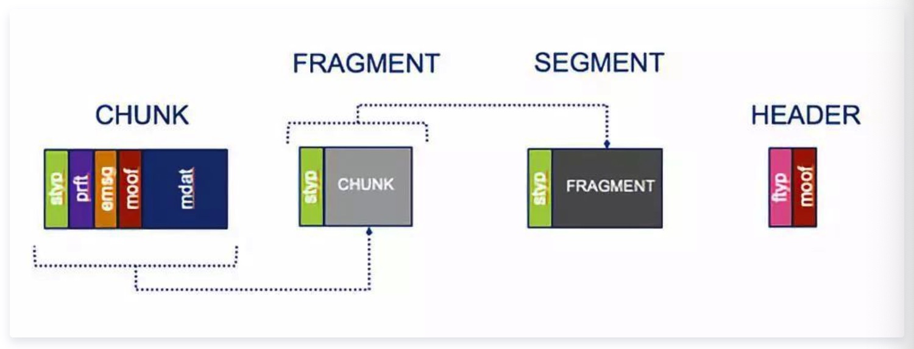
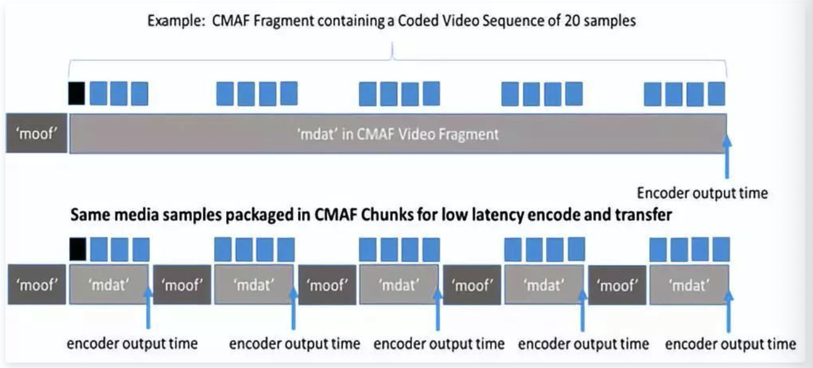
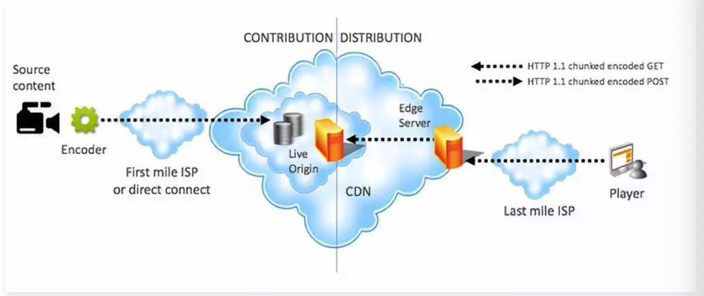
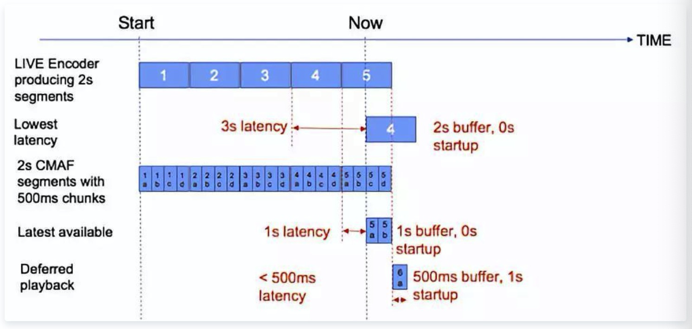

# 超低延迟CMAF流媒体方案解析

**摘要：**

​    在过去的15年中，直播行业得到了巨大的发展。最初的流媒体传输模仿了广播传输的工作流程，使用自定义服务器通过专有协议提供流服务。在HTTP自适应流媒体（HTTP Adaptive Streaming，HAS）发展的推动下，直播行业的发展使观众对OTT质量和延迟有了更高的需求。传统观点认为，HAS传送的内容具有端到端延迟，该延迟是切片(segment)时间的几倍，并且这种延迟比广播中的延迟更久。有一种HAS解决方案能够实现低于一个segment时间的端到端延迟，它甚至使得整个延迟与segment的持续时间无关，即超低延迟CMAF（ULL-CMAF）。

**分块编码**

实现低延迟的第一个必需行为是分块编码（chunked encoding）。根据MPEG CMAF标准，CMAF中各个对象的命名如图1所示。chunk是最小的可引用单元，至少包含moof和mdat这两部分。一个或多个chunk以形成fragment，一个或多个fragment形成一个segment。标准CMAF的media segment使用单个moof和mdat编码，如图2所示，mdat包含单个IDR（Instantaneous Decoder Refresh，瞬时解码器刷新）帧，这是每个segment开始传输所必需的。

图1. CMAF中各个对象的命名

图2. 一个CMAF segment中的块编码

一般来说，segment将保持一系列chunk，即多个moof / mdat元组的序列，如图2所示。只有第一个元组保持IDR帧。将segment分成这些较短片段的优点是编码器可以在编码后立即输出每个chunk以便传输，这样就会导致整体延迟直接减少相同的量。每个块中包含多少帧没有固定的规定，目前的编码器范围为1至15帧。

CMAF中没有“发明”分块编码，自2003年AVC首次标准化以来，这种编码方式就已经上市。由DASH Industry Forum为ATSC3开发的基于MPEG DASH ISO的广播协议在CMAF采用之前就对其进行了标准化。十多年来，在学术界和工业界已经使用了分块编码。不同的是，现在业界已经采取协调一致的努力来使用这种方法降低延迟。

**分块传输编码**

第二个降低延迟的步骤就是分块传输编码。

图3. HAS媒体内容分发系统

编码器将使用HTTP 1.1分块传输编码将编码的CMAF块推送到origin处以进行重新分发。例如，一个产生4s 30fps的segment的编码器将每4秒发一个HTTP POST（每个segment一个），然后在接下来的4s内，构成该切片的每个33ms长的120个chunk将被发送到开放连接的云网络。请注意，编码器不会为每个chunk进行POST。

剩余chunk的传输是基于媒体播放器驱动的pull行为，媒体播放器读取描述媒体内容的manifest或playlist，计算它希望开始播放的live edge（稍后将详细说明），然后开始请求segment，manifest必须表明segment数据的早期可用性。在MPEG DASH中，这是通过MPD @ availabilityTimeOffset参数完成的。在HLS中，引用该segment的播放列表应该在segment的第一个chunk被释放后发布，而不是在该segment的最后一个chunk后发布。

图4. 有关直播流的播放器延迟

为了说明整体延迟对播放器起始播放算法的敏感性，图4显示了一个生成2s的segment的实时编码器。我们在segment＃5的产生中间观察系统。非分块解决方案可以通过从最后一个完全可用的切片（＃4）开始来最小化延迟，从而导致3s的总延迟。如果媒体内容是用500ms块编码的chunk（为了说明，因为实际上块比500ms短得多），那么播放器可以从持有IDR的最新块开始（＃5a），这将延迟减少到1s。

现在有两种方法可以进一步降低延迟。第一种方法是，播放器将下载块5a和5b，然后在开始播放之前通过5a到5b向前解码，从而将其延迟降低到小于500ms。第二种方法是，播放器可以将播放延迟1秒，然后在产生chunk之后立即对块6a进行适时的请求，从而也将延迟减少到小于500ms。

请注意，播放器请求segment而不是chunk，因为chunk不是可寻址单元（除了ATSC3之外，但本文不考虑这种情况）。重要的是，[CDN](https://cloud.tencent.com/product/cdn?from=10680)边缘还缓存流过它的chunk，以构建完整的segment缓存。这种能力使：

1. CDN能够缓存完整的segment
2. 对于大多数未针对低延迟进行优化的客户端，为ULL-CMAF提供了强大的优势。

这种链式chunk传输的一个副作用是，segment的交付时间一致，与客户端和边缘服务器之间的吞吐量无关。标准HAS吞吐量估计算法swill将会得到连接完全等于编码比特率的答案，这将导致播放器不会切换码率。针对该问题存在各种变通方法，包括在chunk发生传输错误时测量连通性，然后应用保守平均值；以及机器学习方法，可以在给定chunk突发错误的模式下推断连通性，如果要成功播放多比特率ULL-CMAF段，播放器需要添加这种机器学习的模式。

再次强调一下，只有满足以下所有条件，才能稳定实现ULL-CMAF的减少延迟功能：

1. CMAF段中的内容是块编码的。
2. 编码器调整其DASH manifest/ HLS playlist以适应分块编码的使用和数据的早期可用性。
3. 编码器使用HTTP 1.1块编码传输将内容推送到origin处。
4. CDN在分发链的每个步骤使用HTTP块编码传输。
5. 客户端：
   1. 准确地对segment的请求进行计时，并在live edge的一个segment持续时间内请求该切片;
   2. 在接收到比特流时对其进行解码，并且不用等到segment传输结束。在浏览器中运行的HTML5播放器必须使用Fetch而不是XHR API，因为Fetch允许在数据仍在下载时读取响应主体;
   3. 有一个估计吞吐量的方案，因为标准的segment定时技术将会失效;
   4. 具有缓冲和自适应逻辑以应对非常低的缓冲;
   5. 由于吞吐量波动，如果它落后于直播流，要具有赶上直播流的功能。

在实验中可以使用ULL-CMAF在600ms范围内实现glass-to-glass延迟。但随着规模扩大和地理分散，这个延迟会越来越不稳定（编码器，origin处，边缘服务器和客户端之间的往返时间更长）。如果通过开放的互联网进行分发（特别是在最近一英里的移动网络中，快速的吞吐量波动是常态），当前情况下在3s内的glass-to-glass延迟是有一定的体验质量（QoE）的，其中1.5s-2s位于播放器缓冲区中。

分块编码的块传输CMAF(chunked-encoded chunk-transferred CMAF)的一些优点是：

1. 传统播放器支持-不支持ULL-CMAF的播放器仍将播放流，尽管延迟时间较长。 
2. 将延迟与segment的持续时间分离-与分块编码和块传送的CMAF相比，6s的segment与1s的segment能够达到相同的延迟
3. CDN可缓存性-这意味着对于给定的实时ULL-CMAF流，播放器可以选择将自己定位在延迟/稳健性曲线上的不同点。
4. CMAF支持通用加密（CENC）-为了最大限度地减少延迟，播放器应该在加入流之前请求密钥，因为密钥检索可能是一个缓慢的同步过程。
5. 保留UHD功能-例如4K，HDR和高帧率，但需要注意的是使用这些功能可能会增加编码时间。
6. 编解码器多样性-可以使用任何可以呈现CMAF媒体配置文件的编解码器来提供ULL-CMAF，例如AVC，HEVC和AV1。
7. 获利-由于ULL-CMAF不会更改自适应流媒体的manifest/playlist结构，因此它保留了对现有服务器端广告插入（SSAI）网络的遵从性。
8. 基于标准-CMAF由IETF RFC 7230的MPEG和HTTP 1.1定义，因此它不依赖于自定义协议或编码器和播放器的专有系统，因为这可能导致昂贵的架构和供应商锁定。此外，ATSC3和DVB正在标准化这种方法。
9. CDN可扩展性-由于ULL-CMAF利用了21年前的HTTP技术，它在现代CDN的HAS基础架构中得到广泛支持，并且可以利用其现有的缓存层次结构来实现扩展。如果需要在低延迟流上支持数百万的受众，ULL-CMAF是一个很好的技术选择。

**接下来？**

ULL-CMAF系统的所有组件都有较大的改进。基于标准的低延迟方法的优势在于，许多公司的资源可以结合起来以实现互利。编码器在编码分块内容方面变得越来越成熟并，并且正在进行研究以建立块大小/健壮性/质量曲线，还在研究诸如QUIC的UDP协议以用于最后一英里传送。随着标准化和商业模式的推进，OTT将继续挑战广播规范的质量和延迟，并且差距越来越小。

参考资料

[1] https://blogs.akamai.com/2018/10/best-practices-for-ultra-low-latency-streaming-using-chunked-encoded-and-chunk-transferred-cmaf.html#