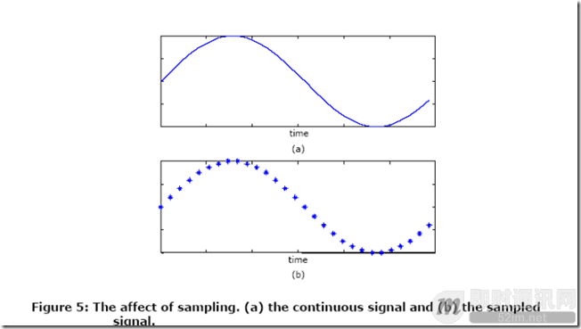

**即时通讯音视频开发（七）：音频基础及编码原理入门**

## 基础概念

**比特率：**
表示经过编码（压缩）后的音频数据每秒钟需要用多少个比特来表示，单位常为kbps。

**响度和强度：**
声音的主观属性响度表示的是一个声音听来有多响的程度。响度主要随声音的强度而变化，但也受频率的影响。总的说，中频纯音听来比低频和高频纯音响一些。

**采样和采样率：**
采样是把连续的时间信号，变成离散的数字信号。采样率是指每秒钟采集多少个样本。

Nyquist采样定律：采样率大于或等于连续信号最高频率分量的2倍时，采样信号可以用来完美重构原始连续信号。

## 常见音频格式

\1. WAV格式，是微软公司开发的一种声音文件格式，也叫波形声音文件，是最早的数字音频格式，被Windows平台及其应用程序广泛支持，压缩率低。

\2. MIDI是Musical Instrument Digital Interface的缩写，又称作乐器数字接口，是数字音乐/电子合成乐器的统一国际标准。它定义了计算机音乐程序、数字合成器及其它电子设备交换音乐信号的方式，规定了不同厂家的电子乐器与计算机连接的电缆和硬件及设备间数据传输的协议，可以模拟多种乐器的声音。MIDI文件就是MIDI格式的文件，在MIDI文件中存储的是一些指令。把这些指令发送给声卡，由声卡按照指令将声音合成出来。

\3. MP3全称是MPEG-1 Audio Layer 3，它在1992年合并至MPEG规范中。MP3能够以高音质、低采样率对数字音频文件进行压缩。应用最普遍。

\4. MP3Pro是由瑞典Coding科技公司开发的，其中包含了两大技术：一是来自于Coding科技公司所特有的解码技术，二是由MP3的专利持有者法国汤姆森多媒体公司和德国Fraunhofer集成电路协会共同研究的一项译码技术。MP3Pro可以在基本不改变文件大小的情况下改善原先的MP3音乐音质。它能够在用较低的比特率压缩音频文件的情况下，最大程度地保持压缩前的音质。

\5. WMA (Windows Media Audio)是微软在互联网音频、视频领域的力作。WMA格式是以减少数据流量但保持音质的方法来达到更高的压缩率目的，其压缩率一般可以达到1:18。此外，WMA还可以通过DRM（Digital Rights Management）保护版权。

\6. RealAudio是由Real Networks公司推出的一种文件格式，最大的特点就是可以实时传输音频信息，尤其是在网速较慢的情况下，仍然可以较为流畅地传送数据，因此RealAudio主要适用于网络上的在线播放。现在的RealAudio文件格式主要有RA(RealAudio)、RM（RealMedia，RealAudio G2）、RMX(RealAudio Secured)等三种，这些文件的共同性在于随着网络带宽的不同而改变声音的质量，在保证大多数人听到流畅声音的前提下，令带宽较宽敞的听众获得较好的音质。

\7. Audible拥有四种不同的格式：Audible1、2、3、4。Audible.com网站主要是在互联网上贩卖有声书籍，并对它们所销售商品、文件通过四种Audible.com 专用音频格式中的一种提供保护。每一种格式主要考虑音频源以及所使用的收听的设备。格式1、2和 3采用不同级别的语音压缩，而格式4采用更低的采样率和MP3相同的解码方式，所得到语音吐辞更清楚，而且可以更有效地从网上进行下载。Audible 所采用的是他们自己的桌面播放工具，这就是Audible Manager，使用这种播放器就可以播放存放在PC或者是传输到便携式播放器上的Audible格式文件。

\8. AAC实际上是高级音频编码的缩写。AAC是由Fraunhofer IIS-A、杜比和AT&T共同开发的一种音频格式，它是MPEG-2规范的一部分。AAC所采用的运算法则与MP3的运算法则有所不同，AAC通过结合其他的功能 来提高编码效率。AAC的音频算法在压缩能力上远远超过了以前的一些压缩算法（比如MP3等）。它还同时支持多达48个音轨、15个低频音轨、更多种采样率和比特率、多种语言的兼容能力、更高的解码效率。总之，AAC可以在比MP3文件缩小30%的前提下提供更好的音质。

\9. Ogg Vorbis 是一种新的音频压缩格式，类似于MP3等现有的音乐格式。但有一点不同 的是，它是完全免费 、开放和没有专利限制的。Vorbis 是这种音频压缩机制的名字，而Ogg则是一个计划的名字，该计划 意图设计 一个完全开放性的多媒体系统。VORBIS也是有损压缩，但通过使用更加先进的声学模型去减少损失，因此，同样位速率(Bit Rate)编码的OGG与MP3相比听起来更好一些。

\10. APE是一种无损压缩音频格式,在音质不降低的前提下，大小压缩到传统无损格式 WAV 文件的一半。

\11. FLAC即是Free Lossless Audio Codec的缩写，是一套著名的自由音频无损压缩编码，其特点是无损压缩。

（与以上用于存储和回放非实时压缩协议的标准不同，常见的实时音频通讯的编码标准具体请见：《[即时通讯音视频开发（八）：常见的实时音频通讯编码标准](http://www.52im.net/thread-243-1-1.html)》）

## 音频编码的基本原理讲解

### 1概述

语音编码致力于：降低传输所需要的信道带宽，同时保持输入语音的高质量。
语音编码的目标在于：设计低复杂度的编码器以尽可能低的比特率实现高品质数据传输。

### 2静音阈值曲线

指在安静环境下，人耳在各个频率能听到声音的阈值。

### 3临界频带

由于人耳对不同频率的解析度不同，MPEG1/Audio将22khz内可感知的频率范围，依不同编码层，不同取样频率，划分成23~26个临界频带。下图列出理想临界频带的中心频率与频宽。图中可看到，人耳对低频的解析度较好。

### 4频域上的掩蔽效应

幅值较大的信号会掩蔽频率相近的幅值较小的信号，如下图：

### 5时域上的遮蔽效应

在一个很短的时间内，若出现了2个声音，SPL（sound pressure level）较大的声音会掩蔽SPL较小的声音。时域掩蔽效应分前向掩蔽（pre-masking）和后向掩蔽(post-masking),其中post-masking的时间会比较长，约是pre-masking的10倍。

时域遮蔽效应有助于消除前回音。

## 编码基本手段(1)：量化和量化器

**基本概念：**

- **量化和量化器：**量化是把离散时间上的连续信号，转化成离散时间上的离散信号。
- **常见的量化器有：**均匀量化器，对数量化器，非均匀量化器。
- **量化过程追求的目标是：**最小化量化误差，并尽量减低量化器的复杂度（这2者本身就是一个矛盾）。

**常见的量化器的优缺点：**

- （a）均匀量化器：最简单，性能最差，仅适应于电话语音。
- （b）对数量化器：比均匀量化器复杂，也容易实现，性能比均匀量化器好。
- （c）非均匀(Non-uniform)量化器：根据信号的分布情况，来设计量化器。信号密集的地方进行细致的量化，稀疏的地方进行粗略量化。

## 编码基本手段(2)：语音编码器

### 1基本概念

语音编码器分为三种类形：（a）波形编器 、（b）声码器 、（c）混合编码器 。

波形编码器以构造出背景噪单在内的模拟波形为目标。作用于所有输入信号，因此会产生高质量的样值并且耗费较高的比特率。 而声码器 （vocoder）不会再生原始波形。这组编码器 会提取一组参数 ，这组参数被送到接收端，用来导出语音产生模形。声码器语音质量不够好。混合编码器，它融入了波形编码器和声器的长处。

### 2波形编码器

波形编码器的设计常独立于信号。所以适应于各种信号的编码而不限于语音。

**时域编码：**

- a）PCM：pulse code modulation,是最简单的编码方式。仅仅是对信号的离散和量化，常采用对数量化。
- b）DPCM：differential pulse code modulation，差分脉冲编码，只对样本之间的差异进行编码。前一个或多个样本用来预测当前样本值。用来做预测的样本越多，预测值越精确。真实值和预测值之间的差值叫残差，是编码的对象。
  
- c）ADPCM：adaptive differential pulse code modulation，自适应差分脉冲编码。即在DPCM的基础上，根据信号的变化，适当调整量化器和预测器，使预测值更接近真实信号，残差更小，压缩效率更高。

**频域编码：**
      频域编码是把信号分解成一系列不同频率的元素，并进行独立编码。

- a）sub-band coding：子带编码是最简单的频域编码技术。是将原始信号由时间域转变为频率域，然后将其分割为若干个子频带，并对其分别进行数字编码的技术。它是利用带通滤波器(BPF)组把原始信号分割为若干(例如m个)子频带(简称子带)。将各子带通过等效于单边带调幅的调制特性，将各子带搬移到零频率附近，分别经过BPF(共m个)之后，再以规定的速率(奈奎斯特速率)对各子带输出信号进行取样，并对取样数值进行通常的数字编码，其设置m路数字编码器。将各路数字编码信号送到多路复用器，最后输出子带编码数据流。对不同的子带可以根据人耳感知模型，采用不同量化方式以及对子带分配不同的比特数。
- b）transform coding：DCT编码。

### 3声码器

channel vocoder: 利用人耳对相位的不敏感。
homomorphic vocoder：能有效地处理合成信号。
formant vocoder: 以用语音信号的绝大部分信息都位于共振峰的位置与带宽上。
linear predictive vocoder：最常用的声码器。

### 4混合编码器

波形编码器试图保留被编码信号的波形，能以中等比特率（32kbps）提供高品质语音，但无法应用在低比特率场合。声码器试图产生在听觉上与被编码信号相似的信号，能以低比特率提供可以理解的语音，但是所形成的语音听起来不自然。

**混合编码器结合了2者的优点：**

- RELP: 在线性预测的基础上，对残差进行编码。机制为：只传输小部分残差，在接受端重构全部残差（把基带的残差进行拷贝）。
- MPC: multi-pulse coding,对残差去除相关性，用于弥补声码器将声音简单分为voiced和unvoiced，而没有中间状态的缺陷。
- CELP: codebook excited linear prediction，用声道预测其和基音预测器的级联，更好逼近原始信号。
- MBE: multiband excitation，多带激励，目的是避免CELP的大量运算，获得比声码器更高的质量。

