**即时通讯音视频开发（二）：视频编解码之数字视频介绍**

## 1. 什么是图像？什么是视频？

**图像：**
是人对视觉感知的物质再现。三维自然场景的对象包括：深度，纹理和亮度信息。二维图像：纹理和亮度信息。

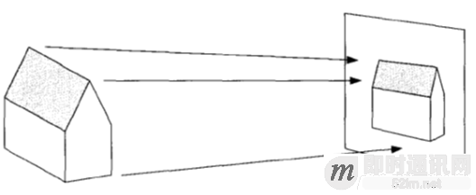

**视频：**
连续的图像。视频由多幅图像构成，包含对象的运动信息，又称为运动图像。

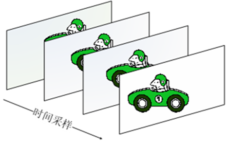

## 2. 何为数字视频？

数字视频可以理解为自然场景空间和时间的数字采样表示。

**空间采样的主要技术指标为：**解析度（Resolution）

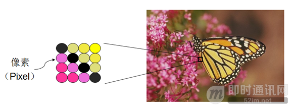

**时间采样的主要技术指标为：**帧率（帧/秒）

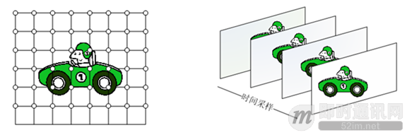

## 3. 数字视频系统的构成和运行原理

- 采集：照相机，摄像机。
- 处理：编解码器，传输设备
- 显示：显示器。

## 5. 人类视觉系统HVS

**HVS的构成：**

- 眼睛
- 神经
- 大脑

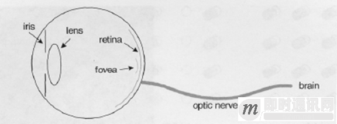

**HVS特点：**

- 对高频信息不敏感
- 对高对比度更敏感
- 对亮度信息比色度信息更敏感
- 对运动的信息更敏感

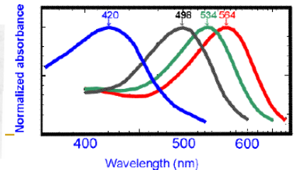

## 6. 针对HVS的特点，数字视频系统的设计应该考虑哪些因素？

- 丢弃高频信息，只编码低频信息
- 提高边缘信息的主观质量
- 降低色度的解析度
- 对感兴趣区域（Region of Interesting，ROI）进行特殊处理

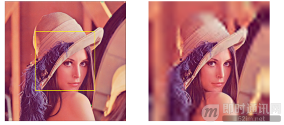

## 7. 什么是RGB色彩空间？

三原色分别是红（R），绿（G），蓝（B）。任何颜色都可以通过按一定比例混合三原色产生。

**RGB色度空间：**

- 由RGB三原色组成
- 广泛用于BMP，TIFF，PPM等
- 每个色度成分通常用8bit表示[0,255]

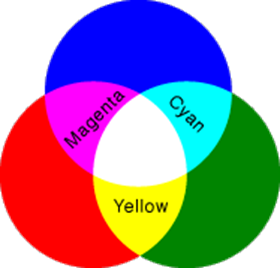

## 8. 什么是YUV色彩空间？

YUV色彩空间是指，Y：亮度分量，UV：两个色度分量。YUV能更好的反映HVS特点。

## 9. RGB如何转化到YUV空间？

**亮度分量Y与三原色有如下关系：**

**经过大量实验后ITU-R给出了：**

 

 

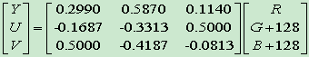

主流的编解码标准的压缩对象都是YUV图像。

## 10. 何为YUV图像分量采样？

YUV图像可以根据HVS的特点，对色度进行分量采样，可以降低视频数据量。

**根据亮度和色度分量的采样比率，YUV图像通常有以下几种分量方式：**

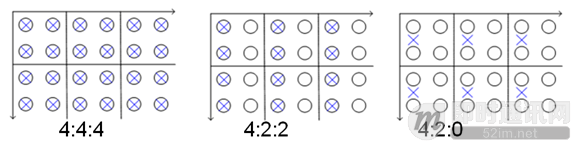

## 11. 通用的YUV图像格式有哪些？

**根据YUV图像的亮度、分辨率定义了如下图像格式：**

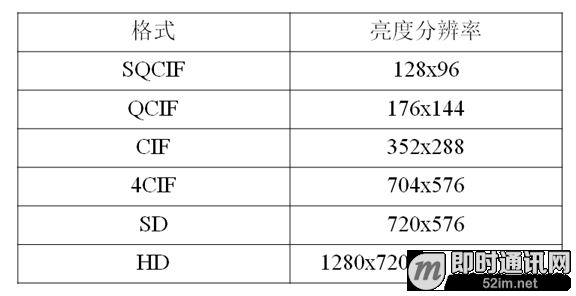

## 12. 如何理解帧和场图像？

**一帧图像包括两场——顶场，底场：**

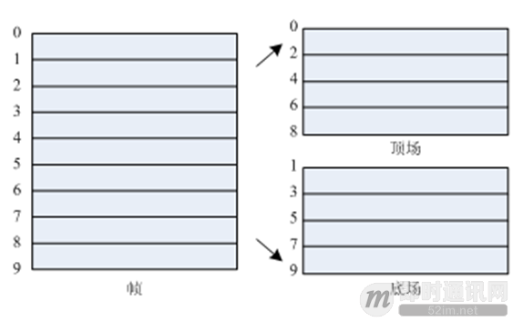

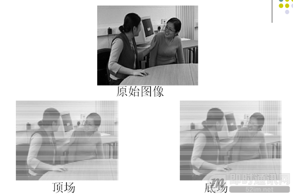

## 13. 逐行与隔行图像

**逐行图像是指：**一帧图像的两场在同一时间得到，ttop=tbot。
**隔行图像是指：**一帧图像的两场在不同时间得到， ttop≠tbot。

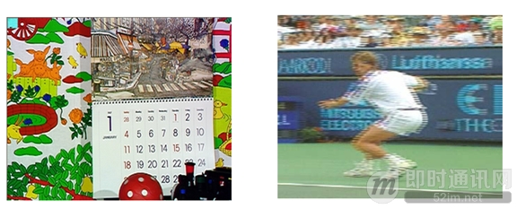