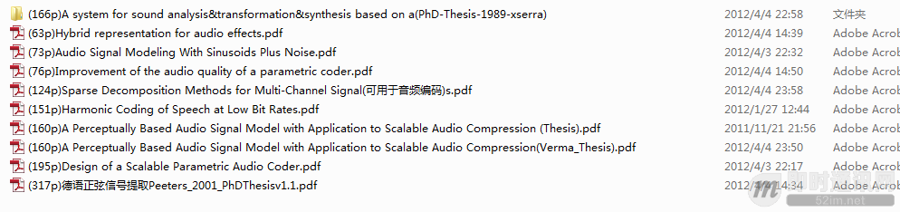

**即时通讯音视频开发（六）：如何开始音频编解码技术的学习**

## 说说音频编解码技术学习方法

**总是有人问我研究音频编解码要看什么书，其实这是一个很难回答的问题，原因有很多：**

- 做工程首先一个问题就是和课本学习不同，不是看书能解决的。
- 音频编解码技术在国内研究的人很少，包括总体的音频技术国外也研究不多。（从中国的潜艇噪声技术一直解决不好就能看出一二）。
- 音频编解码技术是一种应用，而一般的书籍都是讲理论基础。

只看理论书籍会和应用脱离太多，没有实践会忘记。我当初看书也是从工程入手，就是在实际工作中和个人兴趣中看了大量的标准，然后对不懂的地方找论文，再找书籍补知识，这是典型的逆向学习。通常研究生是“课本->看论文->做工程”这样一个学习方法和流程。

## 我们可以按照什么样的思路去找书籍或论文呢？

音频编解码技术是一种比较复杂的应用，而普通的书籍是一种理论书籍，尤其是在中国。音频编解码技术和一般的音频技术不同，比如AEC，HRTF，后者分别是语音和音频的应用技术，应该说是一种具体的应用技术，相对来说查资料还是容易有的放矢。

具体来说，其实音频编解码技术也是一种具体的应用技术，但是可能系统相对复杂，目的相对基础。它是信源编解码技术的一个分支，目的就是压缩数据。

那么音频编解码技术包括哪些方面呢？既然他是一种信源编解码器技术（Source Coding Technology）那么信源编解码技术的书籍都可以看，当做是理论基础学习。

另外其实我把音频编解码技术分为5大技术，简称为：EQTPM。E-熵编码、Q-量化编码、T-变换编码、P-预测编码、M-音频建模（感知建模，BCC建模，正弦建模等）。相对的，学习时我们可以按照这些技术进行相关书籍的查阅和学习。

## 具体的书籍可以分成以下4类

### 1语音编解码书籍

因为国内讲宽带音频编解码的书籍很少，所以可以看些语音编解码的书籍，里面也有讲EQTP技术。例如：《语音处理技术》，《语音编码》，《低码率音频编码》，《数字语音编码原理》，《变速率语音编码》《低速率语音编码》《数字语音编码》《数据压缩》。

《JPEG2000 图像压缩基础》：我认为这本书讲的还是不错的,翻译的也不错，很多基本原理讲的比较透彻。

### 2理论基础书籍

《信息论与编码》，《信号与系统》，高数这类我就不但列出来了，但是也要常番。

### 3国外的宽音频编码书籍

例如我认为很经典的ANDREAS SPANIAS的《Audio Signal Processing and Coding 》。以及他的63页的论文，《Perceptual Coding of Digital Audio》。

**其他可看的书籍包括：**

- MP3之父——K. Brandenburg的：
  《Applications of Digital Signal Processing to Audio and Acoustics》
  《A Digital Signal Processing Primer, with Applications to Digital Audio and Computer Music》
  《Auditory Perception and the MPEG Audio Standard》
  《Foundation and Evolution of Standardized Coders (Wiley,2003)(ISBN 0471373125)(578s)》
- 汉堡联邦国防军大学Udo Zolzer教授的：
  《Digital Audio Signal Processing》
  《High-Fidelity Multichannel Audio Coding》
  《Speech Coding Algorithms》

我强烈推荐把SPANIAS的书读一下。至少把SPANIAS的那个论文仔细看一下。这样会对你理解音频编码有很大的帮助。但是里面会将很多关于耳朵的生理词语，要拿着字典慢慢翻。这个论文我是烦烂了的，使我受益匪浅。

后面的书籍我还没有系统看过，但都有PDF版本，我也是偶尔翻一下。因为这些经典书籍你不花大时间理解，会造成假象是乍看起来都讲得类似，但实际理解起来发现是对不同细节的阐述。

### 4其他类书籍

**专项技术书籍：**

- 如《自适应信号处理》，因为音频编码也好其他音频技术也好，自适应技术是经常使用的。
  例如：无损编码的Wavpack，MPEG4 ALS，都使用了自适应技术。
- 滤波器设计的相关书籍。
- 《多抽样率数字信号处理理论及其应用》：讲解Transform技术。
- HE-AAC和ATRAC3，使用的QMF，
- MP3 使用的PQF
- AAC，MP3使用的MDCT
- AC3使用的TDAC（MDCT）
- WMA和G722.1的(MLT)

都是为什么，选择这些变换工具。有什么区别。如果你能看看Vaidyananthan PP的书，会更有帮助。

## 一些开创性的研究论文也可以读一读

除了这些书籍，建议大家多看看论文，很多国外的大学都有专门的论文和PPT教学。

### 1会议论文

有的讲的很有点概况，有的有些对原理公式还是讲的比较清楚，还有一些强调系统性和介绍的。例如：伦敦学院的《A Survey of Packet Loss Recovery Techniques for Streaming Audio》 对PLC技术做了系统归纳L Daudet的《A review on techniques for the extraction of transients in musical signals》对瞬态信号提取技术做了归纳。

### 2毕业论文

这里我举2个例子，文章太多我就截屏解释吧。

### 3经典PPT

很多大学和机构开放课程会有一些经典PPT。例如：德国Fraunhofer的主页就有很多奖MPEG系列音频编码技术的PPT。非常好，非常推荐。

## 结语

当然除了书籍、论文以外，我们还可以看一些常用的网址，我就给一个好了，超经典的斯坦福大学 Julius Orion Smith III 教授的主页：https://ccrma.stanford.edu/~jos/，见下图哦。

不说了，自己看吧，引用里面的介绍–(1GB of on-line publications, sound examples, and software )。总之，馒头要一口一口吃，耐心些，开始吧！