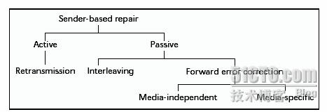
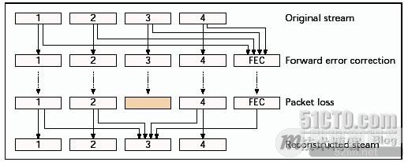
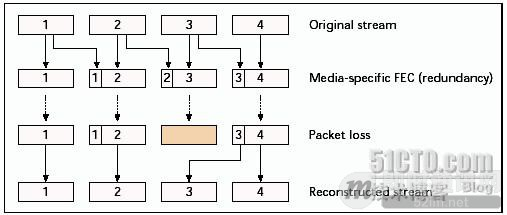
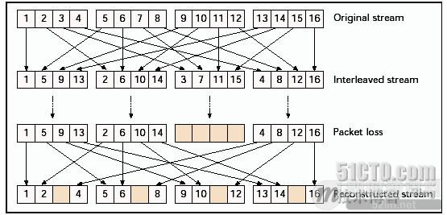
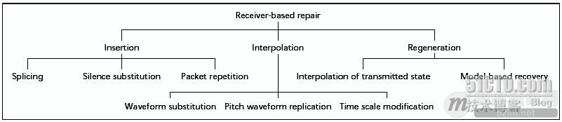
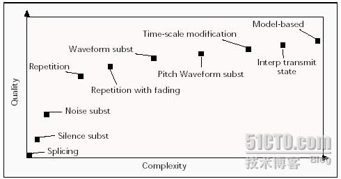

**即时通讯音视频开发（十一）：实时语音通讯丢包补偿技术详解**

## 内容概述

现如今，随着移动互联网越来越普及，实时语音通讯应用越来越流行，但因网络状况及相关因素的影响，实时语音通讯的丢包问题在所难免，与视频不同，语音丢包处理不佳，会让通话双方体验非常糟糕。好在已经有越来越成熟的丢包补偿技术。

丢包补偿技术可以分为两类：基于发送端补偿和基于接受端补偿。基于发送端补偿包括前向差错纠正、交织和重传技术；基于接受端补偿包括了多种错误隐蔽算法。

## 基于发送端的丢包补偿技术原理

### 1简述

基于发送端补偿可以分为两类：主动重传（本文不讨论）和被动通道编码。被动通道编码包含传统的前向差错纠正技术（FEC）和基于交织的技术。按照和媒体内容的关系，前向差错纠正包括与媒体无关的方法和利用音频属性的媒体相关方法。这些总结如图1所示。

为了便于讨论，我们把一个语音包区分为多个单元。

### 2与媒体无关前向差错纠正

这种方式中每n个媒体数据包附带k个校验包。校验包的每个比特都是由相关的数据包的同位置比特产生的。图2是每4个媒体数据包附带1个校验包的情况。

优点：该方式补偿与具体的媒体内容无关，计算量小，易于实施。
缺点：不能立即解码，引入延时，带宽增加。

### 3媒体相关前向差错纠正

一种简单的抗丢包方式是，采用多个包传送同样的音频单元。一旦丢了一个，信息可以从另外一个包含该单元的恢复出来。图3表示了媒体相关前向差错纠正的原理。

第一个传输的复本称为主要编码，第二个传输的复本称为次要编码。次要编码可以是和第一个相同，但是大部分采用较低码率和较低音质的编码技术。编码器的选择取决于带宽需求和计算复杂度需求。

**次要编码采用以下方法：**

- 短时能量和过零率测量；
- 低比特分析合成编码，比如LPC(2.4-5.6kb/s)；
- 全速率GSM编码(13.2kb/s)。

如果主要编码器能做到高音质和低码率，那么次要编码器可以采用和主要编码器一样的方法。比如，ITU G.723.1可以采用这种方式，因其音质好，码率5.3/6.3kb/s，但计算量大。

媒体相关前向差错纠正引起了包大小的额外开销。比如，8kHz PCM U律的主要编码器占用64kb/s带宽，全速率GSM编码的次要编码器占用13.2kb/s带宽，这样就增加了20%的带宽开销。但是，额外的带宽开销并不是固定而是可变的。分析表明，利用语音的特性，并不需要在每个语音包附加媒体相关前向差错纠正，加上这些策略，可以节省30%的带宽。

媒体相关前向差错纠正的一个好处就是不会引入大的延时，最多也就是一个包的延时。这适合实时交互的应用。

### 4交织

当我们考虑比语音包还小的语音单元并且可以承受较大的延时，交织是一种很有用的抗丢包技术。语音单元在传输之前重新排序，这样在传输流中原来领近的语音单元变成有规律间隔的单元，接收端再按原来的顺序排列回来。图4显示20ms包分为5ms单元的例子。可以看到传输的一个丢包变成了分散的多包中的单元丢失。

**交织带来两个好处：**

- 长时间的丢包给听觉带来不舒适和难以理解，但是短时间的单元丢失是更易被听觉接受的，也容易理解；
- 错误隐藏比较容易处理短时间的单元丢失，因为时间短语音的变化小。

交织的不足就是也会引入延时，只适合非交互式的应用。交织的另外一大好处就是不会引起带宽需求的增加。

## 基于接收端的丢包补偿技术原理

### 1简述

当发送端不能做到较好的丢包补偿或发送端不能参与丢包补偿时，需要在接受端进行丢包补偿。错误隐蔽算法就是接受端的丢包补偿技术，它产生一个与丢失的语音包相似的替代语音。这种技术的可能性是基于语音的短时语音相似性，它可以处理较小的丢包率（<15%）和较小的语音包（4-40ms）。当丢包的长度达到音素的长度（5-100ms），该技术就不适应了，因为整个音素都会丢失。

**基于接收端的差错隐藏技术可以分为三类：**

### 2基于插入的方法

插入一个填充包来修复丢包，填充包一般都很简单，比如静音包、噪声包或重复前面的包。虽然容易实现。但这种方法的效果是很差的。该方式的缺点就是没有利用语音的信息来重新产生信号。

拼接法（Splicing）：直接把丢包两端的语音拼接起来，这种最简单的方法不但打乱了语音的时钟顺序，而且只适合很小的丢包间隔（4-16ms）和极低的丢包率，丢包率大于3%就不能忍受了。

静音置换法（Silence substitution）：该方法在丢包处加入静音，这样保持了语音的时钟顺序。它只有在很小的包大小（<4ms）和很低的丢包率（<2%）是有效的。随着包大小的增加，他的性能明显下降，到40ms的包大小就完全不能接受了。

噪声置换法（Noise substitution）：该方法在丢包处加入背景噪声或舒服噪声。它比静音置换法好处是提高了语音的可理解性，效果较好。

重复法（Repetition）：利用接受到的最近包来重复代替丢失的包，具有低计算量和适度的音质。较长的后续丢失包可以衰减重复的包来产生。比如GSM中，丢包前20ms采用重复，后续320ms的通过衰减重复包到零。

### 3基于插值的方法

该方式通过某种形式的模式匹配和插值技术以期望得到与原来丢包相似的代替包。该方式比插入方法实现难度要大但效果好些。该方式相对插入法的好点就是考虑到了语音的变化信息来产生信号。

波形置换法（Waveform substitution）：该方式使用丢包前（可选后）的语音来找到合适的信号代替丢包。它通过单端或双端模式来确认合适的基音周期。单端模式时，基因周期重复跨越丢包区域，双端模式时需要对两边的周期进行插值。

基音波形复制法（Pitch waveform replication）：这是一种带有基音周期检测算法的改进型波形置换法。它利用丢包双端的信息，在无声状态时可以重复前面的包，有声状态时重复基音波形。其效果比波形置换法要好。

时间尺度修正法（Time scale modification）：该方法允许语音从丢包两端按基音周期伸展来跨越丢包区域，在两者交叠的地方进行平均。该方法计算量较大，但是效果比前面两个好些。

### 4基于重构的方法

该方式通过丢包前后的解码信息来重构产生一个补偿包。该方式音质最好但是实现难度也是最大的。重构修复技术使用语音压缩算法的知识来获得编码参数，这样丢失的包就可以合成。该方法依赖于编码算法，但是由于有大量信息可用，效果较好，计算量也大。

传输状态插值法（Interpolation of transmitted state）：对变换域编码和线性预测编码而言，解码器可以在传输状态之间进行插值。比如 ITU G.723.1对丢包两端的线性预测系数进行插值，使用原先帧的周期激励。这种方法的计算量和解码是一样的，不会增加。

基于模型的恢复法（Model-based recovery）：该方法把丢包前后的语音嵌入到一个语音模型中用来产生丢失的包。有研究者采用过去的样本对语音进行自回归分析建模。这种方法的适应性是因为，第一，间隔的语音帧如果足够小（8-10ms）就有很强的相关性；第二，大部分的低比特率编码技术就是采用的自回归分析和激励信号的模型。

**错误隐藏技术的复杂度和质量关系：**

要获得好的丢包补偿效果就必须采用复杂的算法。上图显示了各种错误隐蔽算法的复杂度和质量对应关系，可以根据需要采用。比如带有衰减的包重复法是一种折衷方案。

## 应用建议

### 1非交互式应用

对于非交互式的语音应用，比如多点广播，对延时的要求没有音质高。交织是强烈推荐的丢包补偿技术，对于交织后的语音，还要采用合适的错误隐蔽算法。与媒体无关的前向误差纠正技术也适合这种应用。

### 2交互式应用

交互式的应用比如IP电话、即时通讯应用中的实时语音聊天等，对延时很敏感，因此，交织和与媒体无关的前向误差纠正技术都不适合这种应用。媒体相关的前向误差纠正技术只引入很小的延时和较小的带宽增加，是较好的选择，可以利用低比特率的次要编码器获得丢包补偿效果。另外，还可以采用带有衰减的包重复法等效果较好计算简单的错误隐蔽算法进一步提高音质。