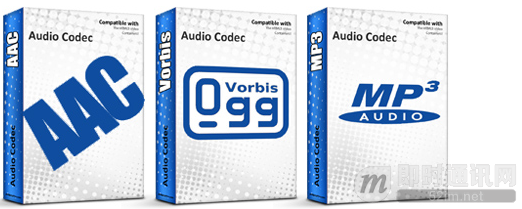
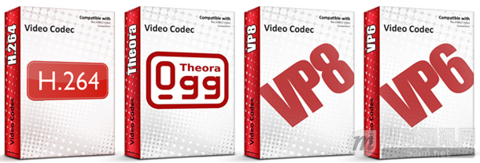

**即时通讯音视频开发（十七）：视频编码H.264、VP8的前世今生**

## 基本知识

首先需要理清一些基本概念。我们平常笼统说的「视频格式」其实包含三个部分：视频编码、音频编码、容器格式。其中「编码」这个概念其实又包含两个方面：编码和解码。

「视频编码」作为动词指的是将动态的图像信息转化为二进制数据的过程；其逆过程称为「视频解码」。「视频编码」作为名词则通常指的是某种特定的编码方式。同样的概念也适用于「音频编码」，只不过它转化的是声音信息。

大多数「视频文件」都同时包含视频和音频，因此编码后至少都有两组二进制数据，并且两组数据必须按照特定的方式同步起来，否则我们看到的画面和听到的声音将不吻合。为了解决编码后多组不同类型的的数据的存储、传输问题，需要将他们按照一定的规律组织起来，这种组织方式即是「容器格式」。

我们常见的视频文件扩展名包括 .avi, .rmvb, .mp4, .mkv 等。其实扩展名都是指的某种容器格式。这些容器里面存放的数据可能采用了多种不同的编码方式。例如，常见的 avi 文件里面存放的通常是 xvid 或 divx 编码的视频和 mp3 编码的音频。rmvb 文件里面存放的通常是 RV40 编码的视频和 cook 编码的音频。mp4 文件里面通常存放的是 H.264 编码的视频和 AAC 编码的音频。mkv 文件里面存放的则可能包含前面各种。

## 认识H.264和VP8编码

常见的视频格式有很多，限于文章内容定义，这次主要讨论H.264（下一代是H.265）和VP8（下一代是VP9）两种：

- 采用 H.264 视频编码和 AAC 音频编码的 MP4 文件（H.264/AAC/MP4 组合）
- 采用 VP8 视频编码和 Vorbis 音频编码的 WebM 文件（VP8/Vorbis/WebM 组合）

H.264 是目前公认的效率最高的的视频编码。它是由国际电信联盟通电信标准部 (ITU-T) 和国际标准化组织/国际电工委员会动态图像专家组 (ISO/IEC MPEG) 共同开发的一种视频压缩技术。它的另外一个名称是 MPEG-4 AVC。目前 H.264 被广泛的运用在蓝光电影、数字电视、卫星电视、网络媒体等领域。可以说 H.264 是目前被运用得最为广泛的视频编码。

AAC 是 ISO/IEC 标准化的音频编码。它是比 MP3 更先进的音频压缩技术，目的在于取代陈旧的 MP3。AAC 音频编码被广泛的运用在数字广播、数字电视等领域。目前网上最大的音乐零售商苹果的 iTunes 音乐商店的所有数字音乐也全部采用的 AAC 音频编码。

MP4 则是 ISO/IEC 制定的容器格式标准，用以封装编码后的视频和音频数据。MP4 支持多种方式编码后的数据，但最常见的是 H.264 编码的视频和 AAC 编码的音频。

VP8 是类似于 H.264 的另一种视频编码，由 On2 公司开发。后来 Google 收购了 On2，因此 VP8 现在归 Google 所有。据称为了避开 H.264 的专利问题，VP8 没有采用一些特别的算法，使得其压缩效率效率略低于 H.264。

Vorbis 是类似 AAC 的另一种免费、开源的音频编码，由非盈利组织 Xiph 开发。业界的普遍共识是 Vorbis 是和 AAC 一样优秀、用以替代 MP3 的下一代音频压缩技术。由于 Vorbis 是免费、开源的，并且没有 AAC 的专利问题，许多游戏厂商采用 Vorbis 编码游戏中的音频资料，例如著名的 Halo，Guitar Hero 等。最近流行的在线音乐网站 Spotify 也是使用的 Vorbis 音频编码。

WebM 是 Google 基于开源容器格式 Matroska（.mkv 很多朋友应该不陌生）而专门开发的一种新型容器格式。其目的是用来封装 VP8 编码的视频和 Vorbis 编码的音频数据以供网络媒体使用。

在涉及 HTML5 视频格式的讨论中，通常「H.264」指代 H.264/AAC/MP4 这个组合，而「WebM」指代 VP8/Vorbis/WebM 这个组合。为了符合习惯、避免重复，我们也将采用同样的简称，即 H.264 = H.264/AAC/MP4，WebM = VP8/Vorbis/WebM。

## HTML5 的视频标准

HTML5 标准制定时曾经考虑过指定一种视频格式（包括视频编码、音频编码、容器格式）作为标准的一部分，所有浏览器厂商都必须实现。

**理想的视频格式应该具有如下特性：**

- 高压缩率，且画质尚佳；
- 解码容易，且要有硬件解码器以供处理能力不足的便携设备使用；
- 免费，且没有潜在的专利纠纷。

当时考虑过的两个组合是 Theora 视频编码、Vorbis 音频编码、Ogg 容器格式，或者 H.264/AAC/MP4（此时 Google 尚未收购 On2）。

Theora/Vorbis/Ogg 组合的三种技术都是由非营利组织 Xiph 开发并可以免费使用。其中 Theora 视频编码是基于 On2 的 VP3 视频编码发展起来的。但 Theora 在技术上落后于 H.264：为达到同样的画质H.264 所需的文件尺寸比 Theora 更小。考虑到 HTML5 视频主要通过网络传输，在保留同等的画质下文件尺寸要尽可能轻巧以节省网络流量开支。参与 HTML5 标准制定的 Google 对此忧心忡忡：按照他们的估算，如果 YouTube 完全采用 Theora 且保持同样的画质的话，那么 YouTube 产生的网络流量将消耗掉整个互联网的带宽资源。因此虽然 Google 宣称将在其浏览器中同时支持 Theora 和 H.264，但 YouTube 的默认视频编码将使用 H.264。

除了技术相对落后外，Theora 最终没有被采纳的另外一个重要原因则是尚不明朗的专利问题。苹果认为虽然 Theora 可以免费使用，且没有侵犯已知的专利，但这并不保证 Theora 采用的某些技术没有侵犯到所谓的「潜艇专利」。所谓「潜艇专利」是指专利申请人故意推迟专利权的取得、公开，等到有大企业使用的技术侵犯到专利时再突然出现，对侵权企业进行诉讼索赔的做法。该做法类似于平时将潜艇藏起来，等到关键时刻出现发起攻击，因此得名「潜艇专利」。这些尚未明确的潜在专利问题可能会在将来 Theora 流行起来后给采用 Theora 的大公司带来不必要的专利诉讼。另外，很多人尝试改进 Theora 以提高其编码效率，但业内的共识是改进 Theora 的尝试几乎不可避免的会侵犯到某些专利。

参与 HTML5 标准制定的各大厂商未能在是否 H.264 上达成一致。虽然 H.264 具有高压缩比、高画质、解码容易、有成熟的硬件解码器、专利问题相对明朗等优势，但各方争论的焦点主要在于 H.264 不是免费的。免费浏览器厂商如 Mozilla 和 Opera 强烈反对将 H.264 列为 HTML5 视频标准。因为这意味着 Mozilla 和 Opera 如果要支持 HTML5 标准，那么他们必须支付相关的授权费。且不说这做法和其信条相去甚远，Mozilla 没有从其开发的浏览器上获得直接收入，反而需要付出相应成本才能自由分发其浏览器产品；Opera 则抱怨说 H.264 的授权费太贵。因此两者都认为不可接受。

由于各方争执不下，最后在 2007 年底的时候 HTML5 标准放弃了制定统一的视频格式的努力，将选择的自由留给了浏览器厂商。后来的结果是，Mozilla Firefox 和 Opera 只支持 Theora；苹果全线产品（包括 Safari 浏览器和所有 iOS 设备）只支持 H.264；微软承诺在 IE9 中原生支持 H.264；Google Chrome 同时支持 Theora 和 H.264。

## WebM vs H.264

2010年初 Google 收购了 On2 及其旗下的全部视频压缩技术。当时业界的普遍猜测是 Google 会不会将 On2 旗下最先进的 VP8 视频编码开放。果然，2010 年中的时候 Google 宣布将 VP8 永久免费。Google 又基于开源容器格式 Matroska 开发了 WebM 容器格式，用以封装 VP8 编码的视频和 Vorbis 编码的音频。随后 Google 连同 Mozilla 和 Opera，准备将 VP8/Vorbis/WebM （统称为 WebM）推广为网络视频的通用格式。Google Chrome 浏览器在 WebM 发布后迅速更新为同时支持 Theora、H.264、WebM 三种格式。Mozilla 和 Opera 也宣布将在其浏览器的后续版本（主要是 Firefox 4）中原生支持 WebM。

VP8 是一种远好于 Theora 的视频编码。至于 VP8 和 H.264 比较起来效果怎样，情况稍微有点复杂。VP8 不是一个标准。目前只有一个由 On2 开发的参照实现（reference implementation）。这个含糊不清的参照实现公开后遭到很多开发者的诟病。主要问题在于对于很多技术细节，On2 只有几段代码而没有任何相关解释。这给理解、改进 VP8 带来了极大的困难。另一方面，虽然 Google 将 VP8 开源，但 VP8 整个设计过程是由 On2 秘密进行的，并且在 VP8 公开后不久，所有相关的数据规范随即被冻结，随之一起被冻结的还有这个参照实现的各种缺陷。因此严格上说 On2 并不是一个开放标准，所有的技术细节都掌握在 Google 手上。

本文在此之前多次提到 H.264 都将其简单描述成一种特定的视频编码格式。其实 H.264 只是一个工业标准，由众多业内企业和专家共同开发制定，不受单一厂商控制。H.264 有多种不同的等级（profile），每个等级对应了不同的复杂程度以适应不同的需求。多个等级的存在使得 H.264 具有非常灵活的适应性：小到 iPod Nano，大到高清蓝光播放器，都可以根据不同的计算能力和画质要求选择相应的等级。一般认为，VP8 和 H.264 的基础等级（Baseline Profile）相当（H.264 有很多为高清视频准备的等级）。

H.264 这个工业标准又有很多不同厂商开发的编码器、解码器实现（implementation）。即便遵循同一标准，不同的编码器、解码器产生的图像质量又有略微的区别，这使得直接比较 VP8 和 H.264 变得相对困难。目前针对 VP8 和 H.264 效果的测试，一般都是采用 Google 的 VP8 参照编码器实现和优秀的开源的 H.264 编码器 x264 压缩的视频图像进行对比。以现在的情况看，同等码率下 VP8 的效果仍然略输于 H.264。

然而和 Theora 一样 VP8 由于尚未经过市场检验，也存在潜在的专利问题。x264 的主要开发者之一曾对 VP8 的参照实现的源代码进行过仔细分析，得出的结论是 VP8 和 H.264 过于相似，很难相信没有任何专利侵权之处。Google 虽然宣布将 VP8 开源且永久免费，并且 Google 做过大量调查认为 VP8 应该不存在专利问题，但由于美国的专利制度的漏洞，谁也不能保证以后不会出现「潜艇专利」造成诉讼纠纷。一旦发生类似情况， Google 的 WebM 授权协议并不保护使用 WebM 的企业和个人。

另外，由于 WebM 刚刚出现，尚不存在现成的 VP8 硬件解码器，在处理能力弱小的便携设备上无法使用。WebM 发布后多家硬件厂商如 AMD、ARM、Broadcom 均宣布支持该格式，但并没有实际产品面世。另外的硬件厂商如 Intel、NVIDIA 则表示如果 WebM 广泛流行起来他们会提供相应的硬件产品，尚持观望态度。

目前争论 WebM 和 H.264 孰优孰劣的重点在于 WebM 虽然免费，但可能有潜在的专利问题，且由于没有硬件解码器无法在便携设备上使用；H.264 专利问题明朗，技术相对先进，有硬件解码器，且很多便携设备已经在广泛使用了，但需要付费。

H.264 涉及到很多专利技术，这些专利又由不同的组织和个人分别持有。如果有厂商要使用 H.264，显然他不可能一个一个去和这些专利持有人谈判。为了方便 H.264 的推广，持有 H.264 相关专利的组织和个人将其专利授权给一个名为 MPEG LA 的组织，然后由该组织统一收取 H.264 相关专利的授权费。

MPEG LA 将 H.264 专利许可分为两种：H.264 编码器和解码器（不论软硬件）厂商需要购买一种 H.264 的专利许可协议，H.264 编码的视频的分发商（如电视台等）需要购买另外一种 H.264 的专利许可协议。也就是说所有生产支持录制 H.264 视频的摄像设备、手机等的厂商都要向 MPEG LA 支付专利使用费。这个费用相对低廉：少于 10 万个设备免费；10 万个以上最多每个解码器 20 美分，且支付上限为每年 650 万美元。另外，MPEG LA 有规定，虽然每五年专利授权期过后它可以根据市场状况调整授权费用，但每次涨价不会超过 10%。因此厂商使用 H.264 制造编码器、解码器在成本上是有可靠保证的。所有支持 H.264 视频播放的硬件、软件厂商也要向 MPEG LA 支付专利费。大部分企业如苹果、微软、索尼等都购买了相应的 H.264 专利许可协议，因此最终用户在使用 H.264 技术制作和播放视频的时候不用担心费用问题。

问题出在 MPEG LA 对网络视频（如 YouTube）的规定上。YouTube 这样的站点属于视频的分发商。MPEG LA 对像电视台这样的传统视频分发商有完整的基于订阅用户数量的授权费用体系。但 MPEG LA 尚未对网络视频分发商收取专利费用。MPEG LA 每隔五年会更新其专利授权的相关规定。目前 MPEG LA 承诺在 2015 年底之前不会对分发 H.264 编码的网络视频收取专利费用。2015 年后是否收取费用则尚不明确。许多人认为 MPEG LA 的这个并不明确的态度会成为未来网络视频的隐患，而使用开源、免费的 WebM 则没有这个问题（注意这是假设 WebM 没有潜在专利问题）。另外一种观点则认为即便 WebM 没有大规模流行，它的存在可以迫使 MPEG LA 继续对分发 H.264 网络视频免费。【更新：评论中 cjsas 提到 MPEG LA 已经承诺永久免费了。我后来核对过确有此事。MPEG LA 于 2010 年 8 月宣布对通过互联网免费分发给最终用户的网络视频永久免费。收费的在线视频业务如 iTunes 电影租赁、Netflix、Hulu+ 等还是要收费。】

## 现状

Google 旗下和 H.264 有关的产品最重要的当然是 YouTube。作为互联网上最大的视频站点（虽然对国内用户来说这已经没什么意义了），YouTube 是否将继续支持 H.264 至关重要。目前 YouTube 的所有视频都采用 H.264 编码。用户上传的视频即便已经是 H.264 编码的了，也通常需要在 YouTube 的服务器上重新编码以统一分辨率、码率等。YouTube 正在逐步将全部视频采用 WebM 重新编码。YouTube 的 HTML5 测试版的部分视频用的 WebM、部分用的 H.264。

在 Google 从 Chrome 中移除原生 H.264 支持之前，Chrome 被认为是播放网络视频的最佳浏览器，因为它同时原生支持 Theora、H.264、WebM（当然还有并不可爱的 Flash 插件）。Chrome 浏览器中使用到的 H.264 解码器需要支付专利费。基于 Android 系统的便携设备上目前采用的是 H.264 硬件解码器。等 WebM 硬件解码器成熟后，Android 系统应该会加入 WebM 的硬件支持。

Google 需要为其使用 H.264 的产品支付专利授权费。但这些费用对 Google 来说不过是九牛一毛。Google 认为免费、开源的视频编码对互联网的长远发展是有益处的。很多人也持同样的观点。我们姑且称这一群人为 Google 派，典型代表的除了 Google 本身，还有 Mozilla 和 Opera 等。

与Google 形成鲜明对比的是苹果。苹果一直是 H.264 的坚定支持者。目前苹果全线产品都对 H.264 有硬件支持。由于 CPU 处理能力不足，同时需要考虑节能，所有 iOS 设备都配备有专为移动设备开发的低功耗硬件解码芯片。运行 OS X 的笔记本和台式机则是通过 NVIDIA 和 ATI 的显卡提供硬件解码支持。OS X Snow Leopard 自带的 QuickTime X 播放器播放 H.264/MP4 格式视频时默认采用显卡硬件加速，因此在播放期间 CPU 占用相当低。相比用 CPU 软件解码，硬件解码的效率更高、功耗更低，在播放高码率高清视频时特别明显。个人经验是播放高清电影时，有硬件加速的情况下笔记本散热风扇基本不转，软件解码就转个不停。

在对 HTML5 视频的支持上，苹果自家的 Safari 浏览器是将视频解码部分交由 iOS 或者 OS X 处理的。在 iOS 和 OS X 已经为 H.264 支付过专利费的情况下，Safari 不用为使用 H.264 的支付额外成本。另外值得一提的是 ISO 标准的 MP4 容器格式是基于苹果 QuicTime 容器格式开发的。苹果也是 H.264 专利授权组织 MPEG LA 的成员之一，其花费在 H.264 授权费的支出和收入可以部分抵消。而且苹果使用 H.264 的设备出货量惊人，它为此支付的单位成本也是最低的。

苹果一贯认为用户体验更加重要。从 iPhone 首次面试到现在的几年中，H.264 是可供移动设备高效节能的播放高质量视频的唯一选择。在桌面系统上，H.264 又能在 CPU 处理能力有限的情况下支持大分辨率高清视频。可以说 H.264 是目前用户体验最好的视频技术。苹果乐意为使用这一技术付费。很多人（如铁杆苹果粉 John Gruber、Macro Arment 等人）也持同样观点。他们认为 H.264 是目前最先进的视频技术，并且现在大规模流行已经成为事实标准（de facto standard）。工业界花费了好多年时间好不容易达到今天这样统一标准的局面，此时多出来任何新的格式只会添乱。我们姑且称这一群人为苹果派。

HTML5 尚未普及。在桌面系统上，目前最主流的支持 H.264 视频播放的方式仍然是使用 Adobe 的 Flash 插件。Flash 插件在除 Windows 外的所有系统上性能都非常糟糕，而 Adobe 在过去的几年中对此毫无办法（据说是因为 Flash 代码实在太乱，积重难返），以至于乔布斯下决心要在苹果平台上干掉它。彻底不支持 Flash 的 iOS 设备广泛流行和乔布斯的坚决态度让 Adobe 感到了一定压力。另一方面，Google 为了和苹果竞争，不惜以用户体验为代价，在其 Android 系统上支持 Flash。Google 又在 Chrome 浏览器中绑定了 Flash 插件作为其推进网页应用的支撑技术之一。也许是作为回报，Adobe 承诺将在下一个版本的 Flash 插件中加入 WebM 支持。

部分苹果派阴谋论者认为 Google 让 Flash 苟延残喘并努力推广 WebM 取代 H.264 的另外一个重要原因是可以借此打压苹果，因为在 iOS 平台上苹果不支持 Flash，也很难相信作为 H.264 的坚定支持者苹果会支持质量更差的 WebM。而 Google 在 Chrome 中移除 H.264 支持的最大赢家就是 Adobe。大部分视频站点的内容都是 H.264 编码的，Google 此举这几乎确保了 Flash 在未来几年中不可替代的地位。

## 未来

网络视频站若完全转向使用 WebM 可以节省一笔专利费用。然而「完全转用 WebM」 并不现实：有数量庞大的设备（特别是移动设备）只支持H.264，因此在相当长一段时间内至少需要同时支持 H.264 和WebM。但这意味着视频站的存储成本顿时要翻一番。视频站点所使用的内容分发网络（Content Distribution Network,CDN）也由于需要同时缓存两种格式的视频而导致成本翻番。对于同样一段原始视频，需要编码成 H.264 和 WebM两种格式，导致转码处理成本也要翻番。此外还要将现有的视频资源全部重新编码成为 WebM。为使用 H.264技术而支付的专利费和这些翻番的成本比起来简直是小巫见大巫。Google 财大气粗能负担这个成本，其他的视频站点就难说了。

即便忽略视频站的成本问题，在客户端上 WebM 和 H.264 能和平共处么？在桌面系统上，Chrome 和 Firefox 都可以通过Flash 插件播放 H.264，和原生支持 WebM 冲突不大。然而移动设备需要硬件解码芯片支持。受至于成本和空间限制，很难想象理性的移动设备厂商会同时包含两块解码芯片以支持 WebM 和H.264。另外一种可能是将来出现一种硬件解码芯片能同时处理 WebM 和 H.264，不过目前还没有任何这方面的消息。

更加现实的可能是，即便 Chrome、Firefox、Opera 等不原生支持 H.264，大多数视频站只需维持现状：即对于桌面系统通过Flash 插件播放 H.264 视频，而对不支持 Flash 的移动设备则通过 HTML5 视频标签播放 H.264 视频。WebM最终沦为 Theora 一样的下场。普通用户也不会觉察到任何区别。基于这个判断，不少苹果派因而指责 Google 的做法只会推迟 HTML5 视频标签的普及，让大家继续在 Flash 这棵树上吊死。

然而 WebM 就一无是处了吗？当然不是。如果 VP8 最终被证明没有专利问题，那 WebM 也许能够成为 HTML5 标准的一部分。虽然现在 VP8 不是效率最高、画质最好的，但它很多时候也能满足要求。新一代的互联网创业者们在需要付费的 H.264和完全免费的 WebM 之间就有了选择的余地。而正是众多开源、免费技术的存在造就了互联网繁荣的今天。只是，专利问题始终是 WebM 头上挥之不去的疑云。

