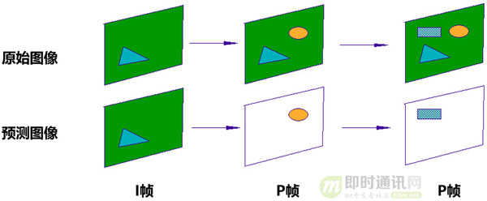
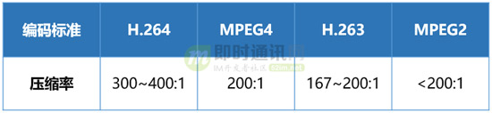

**即时通讯音视频开发（十九）：零基础，史上最通俗视频编码技术入门**

## 1、引言

如今我们所处的时代，是移动互联网时代，也可以说是视频时代。从快播到抖音，从“三生三世”到“延禧攻略”，我们的生活，被越来越多的视频元素所影响。

而这一切，离不开视频拍摄技术的不断升级，还有视频制作产业的日益强大。

此外，也离不开通信技术的飞速进步。试想一下，如果还是当年的56K Modem拨号，或者是2G手机，你还能享受到现在动辄1080P甚至4K的视频体验吗？

除了视频拍摄工具和网络通信技术升级之外，我们能享受到视频带来的便利和乐趣，还有一个重要因素，就是视频编码技术的突飞猛进。

视频编码技术涉及的内容太过专业和庞杂，市面上的书籍或博客多数都只是枯燥的技术概念罗列，对于新手来说读完依旧蒙逼是常态，本文将借此机会，专门给大家做一个关于视频编码的零基础科普。

**▼ 本文涉及概念较多，为了方便阅读，本文的内容目录对应如下：**
**************************************************************************************************

- **1、引言**
- **2、系列文章**
- 3、图像基础知识 
  - 3.1）什么是像素？
  - 3.2）什么是PPI？
  - 3.3）颜色在计算机里是如何表示的？
- 4、视频编码基础知识
  - 4.1）视频和图像和关系
  - 4.2）未经编码的视频数据量会有多大？
  - 4.3）什么是编码？
- 5、视频编码的实现原理  
  - 5.1）视频编码技术的基本原理
  - 5.2）视频编码技术的实现方法
- 6、视频编码的国际标准
  - 6.1）视频编码格式的标准化
  - 6.2）视频数据的封装

**************************************************************************************************

## 2、系列文章

**本文是系列文章中的第19篇，本系列文章的大纲如下：**

- 《[即时通讯音视频开发（一）：视频编解码之理论概述](http://www.52im.net/thread-228-1-1.html)》
- 《[即时通讯音视频开发（二）：视频编解码之数字视频介绍](http://www.52im.net/thread-229-1-1.html)》
- 《[即时通讯音视频开发（三）：视频编解码之编码基础](http://www.52im.net/thread-232-1-1.html)》
- 《[即时通讯音视频开发（四）：视频编解码之预测技术介绍](http://www.52im.net/thread-235-1-1.html)》
- 《[即时通讯音视频开发（五）：认识主流视频编码技术H.264](http://www.52im.net/thread-237-1-1.html)》
- 《[即时通讯音视频开发（六）：如何开始音频编解码技术的学习](http://www.52im.net/thread-241-1-1.html)》
- 《[即时通讯音视频开发（七）：音频基础及编码原理入门](http://www.52im.net/thread-242-1-1.html)》
- 《[即时通讯音视频开发（八）：常见的实时语音通讯编码标准](http://www.52im.net/thread-243-1-1.html)》
- 《[即时通讯音视频开发（九）：实时语音通讯的回音及回音消除概述](http://www.52im.net/thread-247-1-1.html)》
- 《[即时通讯音视频开发（十）：实时语音通讯的回音消除技术详解](http://www.52im.net/thread-250-1-1.html)》
- 《[即时通讯音视频开发（十一）：实时语音通讯丢包补偿技术详解](http://www.52im.net/thread-251-1-1.html)》
- 《[即时通讯音视频开发（十二）：多人实时音视频聊天架构探讨](http://www.52im.net/thread-253-1-1.html)》
- 《[即时通讯音视频开发（十三）：实时视频编码H.264的特点与优势](http://www.52im.net/thread-266-1-1.html)》
- 《[即时通讯音视频开发（十四）：实时音视频数据传输协议介绍](http://www.52im.net/thread-267-1-1.html)》
- 《[即时通讯音视频开发（十五）：聊聊P2P与实时音视频的应用情况](http://www.52im.net/thread-269-1-1.html)》
- 《[即时通讯音视频开发（十六）：移动端实时音视频开发的几个建议](http://www.52im.net/thread-270-1-1.html)》
- 《[即时通讯音视频开发（十七）：视频编码H.264、V8的前世今生](http://www.52im.net/thread-274-1-1.html)》
- 《[即时通讯音视频开发（十八）：详解音频编解码的原理、演进和应用选型](http://www.52im.net/thread-2230-1-1.html)》
- 《[即时通讯音视频开发（十九）：零基础，史上最通俗视频编码技术入门](http://www.52im.net/thread-2840-1-1.html)》（本文）

## 3、图像基础知识 

 

### 3.1什么是像素？

说视频之前，先要说说图像。图像，大家都知道，是由很多“带有颜色的点”组成的。这个点，就是“**像素点**”。

像素点的英文叫Pixel（缩写为PX）。这个单词是由 Picture(图像) 和 Element（元素）这两个单词的字母所组成的。

▲ 电影《像素大战（Pixels）》，2015年

像素是图像显示的基本单位。我们通常说一幅图片的大小，例如是1920×1080，就是长度为1920个像素点，宽度为1080个像素点。乘积是2,073,600，也就是说，这个图片是两百万像素的。

1920×1080，这个也被称为这幅图片的分辨率。

▲ 分辨率也是显示器的重要指标

### 3.2什么是PPI？

那么，我们经常所说的PPI又是什么东西呢？

PPI，就是“Pixels Per Inch”，每英寸像素数。也就是，手机（或显示器）屏幕上每英寸面积，到底能放下多少个“像素点”。这个值当然是越高越好啦！PPI越高，图像就越清晰细腻。

以前的功能机，例如诺基亚，屏幕PPI都很低，有很强烈的颗粒感。

后来，苹果开创了史无前例的“视网膜”（Retina）屏幕，PPI值高达326（每英寸屏幕有326像素），画质清晰，再也没有了颗粒感。

### 3.3颜色在计算机里是如何表示的？

像素点必须要有颜色，才能组成缤纷绚丽的图片。那么，这个颜色，又该如何表示呢？

大家都知道，我们生活中的颜色，可以拥有无数种类别。

▲ 光是妹纸们的口红色号，就足以让我们这些屌丝瞠目结舌。。。

在计算机系统里，我们不可能用文字来表述颜色。不然，就算我们不疯，计算机也会疯掉的。在数字时代，当然是用数字来表述颜色。这就牵出了“彩色分量数字化”的概念。

以前我们美术课学过，任何颜色，都可以通过红色（Red）、绿色（Green）、蓝色（Blue）按照一定比例调制出来。这三种颜色，被称为“三原色”。

在计算机里，R、G、B也被称为“基色分量”。它们的取值，分别从0到255，一共256个等级（256是2的8次方）。所以，任何颜色，都可以用R、G、B三个值的组合表示。

▲ RGB=(183,67,21)

通过这种方式，一共能表达多少种颜色呢？256×256×256=16,777,216种，因此也简称为**1600万色**。RGB三色，每色有8bit，这种方式表达出来的颜色，也被称为**24位色**（占用24bit）。这个颜色范围已经超过了人眼可见的全部色彩，所以又叫**真彩色**。再高的话，对于我们人眼来说，已经没有意义了，完全识别不出来。

## 4、视频编码基础知识

### 4.1视频和图像和关系

好了，刚才说了图像，现在，我们开始说视频。所谓视频，大家从小就看动画，都知道视频是怎么来的吧？没错，大量的图片连续起来，就是视频。

衡量视频，又是用的什么指标参数呢？最主要的一个，就是帧率（Frame Rate）。在视频中，一个帧（Frame）就是指一幅静止的画面。帧率，就是指视频每秒钟包括的画面数量（FPS，Frame per second）。 

帧率越高，视频就越逼真、越流畅。

### 4.2未经编码的视频数据量会有多大？

**有了视频之后，就涉及到两个问题：**

- 一个是存储；
- 二个是传输。

而之所以会有视频编码，关键就在于此：一个视频，如果未经编码，它的体积是非常庞大的。

**以一个分辨率1920×1280，帧率30的视频为例：**

共：1920×1280=2,073,600（Pixels 像素），每个像素点是24bit（前面算过的哦）；
也就是：每幅图片2073600×24=49766400 bit，8 bit（位）=1 byte（字节）；
所以：49766400bit=6220800byte≈6.22MB。

这是一幅1920×1280图片的原始大小，再乘以帧率30。

**也就是说：**每秒视频的大小是186.6MB，每分钟大约是11GB，一部90分钟的电影，约是1000GB。。。

吓尿了吧？就算你现在电脑硬盘是4TB的（实际也就3600GB），也放不下几部大姐姐啊！不仅要存储，还要传输，不然视频从哪来呢？如果按照100M的网速（12.5MB/s），下刚才那部电影，需要22个小时。。。再次崩溃。。。

正因为如此，屌丝工程师们就提出了，必须对视频进行编码。

### 4.3什么是编码？

**编码：**就是按指定的方法，将信息从一种形式（格式），转换成另一种形式（格式）。**视频编码：**就是将一种视频格式，转换成另一种视频格式。

编码的终极目的，说白了，就是为了压缩。各种五花八门的视频编码方式，都是为了让视频变得体积更小，有利于存储和传输。

**我们先来看看，视频从录制到播放的整个过程，如下：**

首先是视频采集。通常我们会使用摄像机、摄像头进行视频采集。限于篇幅，我就不打算和大家解释CCD成像原理了。

采集了视频数据之后，就要进行模数转换，将模拟信号变成数字信号。其实现在很多都是摄像机（摄像头）直接输出数字信号。信号输出之后，还要进行预处理，将RGB信号变成YUV信号。

***前面我们介绍了RGB信号，那什么是\**YUV信号\**呢？\***

简单来说，YUV就是另外一种颜色数字化表示方式。视频通信系统之所以要采用YUV，而不是RGB，主要是因为**RGB信号不利于压缩**。在YUV这种方式里面，加入了亮度这一概念。在最近十年中，视频工程师发现，眼睛对于亮和暗的分辨要比对颜色的分辨更精细一些，也就是说，人眼对色度的敏感程度要低于对亮度的敏感程度。

所以，工程师认为，在我们的视频存储中，没有必要存储全部颜色信号。我们可以把更多带宽留给黑—白信号（被称作“亮度”），将稍少的带宽留给彩色信号（被称作“色度”）。于是，就有了YUV。

YUV里面的“Y”，就是亮度（Luma），“U”和“V”则是色度（Chroma）。

大家偶尔会见到的Y'CbCr，也称为YUV，是YUV的压缩版本，不同之处在于Y'CbCr用于数字图像领域，YUV用于模拟信号领域，MPEG、DVD、摄像机中常说的YUV其实就是Y'CbCr。

▲ YUV（Y'CbCr）是如何形成图像的

YUV码流的存储格式其实与其采样的方式密切相关。（采样，就是捕捉数据）

**主流的采样方式有三种：**

- 1）YUV4:4:4；
- 2）YUV4:2:2；
- 3）YUV4:2:0。

具体解释起来有点繁琐，大家只需记住，通常用的是YUV4:2:0的采样方式，能获得1/2的压缩率。

这些预处理做完之后，就是正式的编码了。

**有关视频编码的更多专业知识，可以详细阅读以下文章：**

- 《[即时通讯音视频开发（一）：视频编解码之理论概述](http://www.52im.net/thread-228-1-1.html)》
- 《[即时通讯音视频开发（二）：视频编解码之数字视频介绍](http://www.52im.net/thread-229-1-1.html)》
- 《[即时通讯音视频开发（三）：视频编解码之编码基础](http://www.52im.net/thread-232-1-1.html)》
- 《[即时通讯音视频开发（四）：视频编解码之预测技术介绍](http://www.52im.net/thread-235-1-1.html)》
- 《[即时通讯音视频开发（五）：认识主流视频编码技术H.264](http://www.52im.net/thread-237-1-1.html)》

## 5、视频编码的实现原理

### 5.1视频编码技术的基本原理

前面我们说了，编码就是为了压缩。要实现压缩，就要设计各种算法，将视频数据中的冗余信息去除。当你面对一张图片，或者一段视频的时候，你想一想，如果是你，你会如何进行压缩呢？

▲ 对于新垣女神，我一bit也不舍得压缩…

我觉得，首先你想到的，应该是找规律。是的，寻找像素之间的相关性，还有不同时间的图像帧之间，它们的相关性。

**举个例子：**如果一幅图（1920×1080分辨率），全是红色的，我有没有必要说2073600次[255,0,0]？我只要说一次[255,0,0]，然后再说2073599次“同上”。

如果一段1分钟的视频，有十几秒画面是不动的，或者，有80%的图像面积，整个过程都是不变（不动）的。那么，是不是这块存储开销，就可以节约掉了？

▲ 以上图为例，只有部分元素在动，大部分是不动的

是的，所谓编码算法，就是寻找规律，构建模型。谁能找到更精准的规律，建立更高效的模型，谁就是厉害的算法。

**通常来说，视频里面的冗余信息包括：**

视频编码技术优先消除的目标，就是空间冗余和时间冗余。

接下来，就和大家介绍一下，究竟是采用什么样的办法，才能干掉它们。以下内容稍微有点高能，不过我相信大家耐心一些还是可以看懂的。

### 5.2视频编码技术的实现方法

视频是由不同的帧画面连续播放形成的。

**这些帧，主要分为三类，分别是：**

- 1）I帧；
- 2）B帧；
- 3）P帧。

**I帧：**是自带全部信息的独立帧，是最完整的画面（占用的空间最大），无需参考其它图像便可独立进行解码。视频序列中的第一个帧，始终都是I帧。

**P帧：**“帧间预测编码帧”，需要参考前面的I帧和/或P帧的不同部分，才能进行编码。P帧对前面的P和I参考帧有依赖性。但是，P帧压缩率比较高，占用的空间较小。

▲ P帧

**B帧：**“双向预测编码帧”，以前帧后帧作为参考帧。不仅参考前面，还参考后面的帧，所以，它的压缩率最高，可以达到200:1。不过，因为依赖后面的帧，所以不适合实时传输（例如视频会议）。

▲ B帧

通过对帧的分类处理，可以大幅压缩视频的大小。毕竟，要处理的对象，大幅减少了（从整个图像，变成图像中的一个区域）。

**如果从视频码流中抓一个包，也可以看到I帧的信息，如下：**

我们来通过一个例子看一下。

**这有两个帧：**

好像是一样的？

**不对，我做个GIF动图，就能看出来，是不一样的：**

人在动，背景是没有在动的。

**第一帧是I帧，第二帧是P帧。两个帧之间的差值，就是如下：**

**也就是说，图中的部分像素，进行了移动。移动轨迹如下：**

这个，就是运动估计和补偿。

当然了，如果总是按照像素来算，数据量会比较大，所以，一般都是把图像切割为不同的“块（Block）”或“宏块（MacroBlock）”，对它们进行计算。一个宏块一般为16像素×16像素。

▲ 将图片切割为宏块

好了，我来梳理一下。

对I帧的处理，是采用帧内编码方式，只利用本帧图像内的空间相关性。对P帧的处理，采用帧间编码（前向运动估计），同时利用空间和时间上的相关性。简单来说，采用运动补偿(motion compensation)算法来去掉冗余信息。

需要特别注意，I帧（帧内编码），虽然只有空间相关性，但整个编码过程也不简单。

如上图所示，整个帧内编码，还要经过DCT（离散余弦变换）、量化、编码等多个过程。限于篇幅，加之较为复杂，今天就放弃解释了。

那么，视频经过编码解码之后，如何衡量和评价编解码的效果呢？

一般来说，分为客观评价和主观评价。客观评价，就是拿数字来说话。例如计算“信噪比/峰值信噪比”。

信噪比的计算，我就不介绍了，丢个公式，有空可以自己慢慢研究...

除了客观评价，就是主观评价了。主观评价，就是用人的主观感知直接测量，额，说人话就是——“好不好看我说了算”。

## 6、视频编码的国际标准

### 6.1视频编码格式的标准化

接下来，我们再说说标准（Standard）。任何技术，都有标准。自从有视频编码以来，就诞生过很多的视频编码标准。

提到视频编码标准，先介绍几个制定标准的组织。

首先，就是大名鼎鼎的ITU（国际电信联盟）。

ITU是联合国下属的一个专门机构，其总部在瑞士的日内瓦。

**ITU下属有三个部门：**

- 1）分别是ITU-R（前身是国际无线电咨询委员会CCIR）；
- 2）ITU-T（前身是国际电报电话咨询委员会CCITT）；
- 3）ITU-D。

除了ITU之外，另外两个和视频编码关系密切的组织，是ISO/IEC。

ISO大家都知道，就是推出ISO9001质量认证的那个“国际标准化组织”。IEC，是“国际电工委员会”。1988年，ISO和IEC联合成立了一个专家组，负责开发电视图像数据和声音数据的编码、解码和它们的同步等标准。这个专家组，就是大名鼎鼎的MPEG，Moving Picture Expert Group（动态图像专家组）。

**三十多年以来，世界上主流的视频编码标准，基本上都是它们提出来的：**

- 1）ITU提出了H.261、H.262、H.263、H.263+、H.263++，这些统称为H.26X系列，主要应用于实时视频通信领域，如会议电视、可视电话等；
- 2）ISO/IEC提出了MPEG1、MPEG2、MPEG4、MPEG7、MPEG21，统称为MPEG系列。

ITU和ISO/IEC一开始是各自捣鼓，后来，两边成立了一个联合小组，名叫JVT（Joint Video Team，视频联合工作组）。

JVT致力于新一代视频编码标准的制定，后来推出了包括H.264在内的一系列标准。

▲ 压缩率对比

▲ 视频编码标准的发展关系

大家特别注意一下上图里面的HEVC，也就是现在风头正盛的H.265。

作为一种新编码标准，相比H.264有极大的性能提升，目前已经成为最新视频编码系统的标配。

最后，我再说说**封装**。

### 6.2视频数据的封装

对于任何一部视频来说，只有图像，没有声音，肯定是不行的。所以，视频编码后，加上音频编码，要一起进行封装。

**封装：**就是封装格式，简单来说，就是将已经编码压缩好的视频轨和音频轨按照一定的格式放到一个文件中。再通俗点，视频轨相当于饭，而音频轨相当于菜，封装格式就是一个饭盒，用来盛放饭菜的容器。

**目前主要的视频容器有如下：**MPG、VOB、MP4、3GP、ASF、RMVB、WMV、MOV、Divx、MKV、FLV、TS/PS等。

封装之后的视频，就可以传输了，你也可以通过视频播放器进行解码观看。