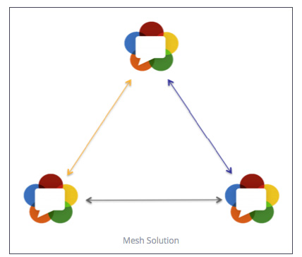
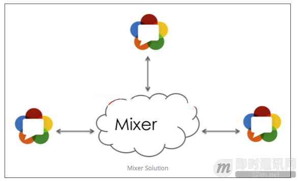
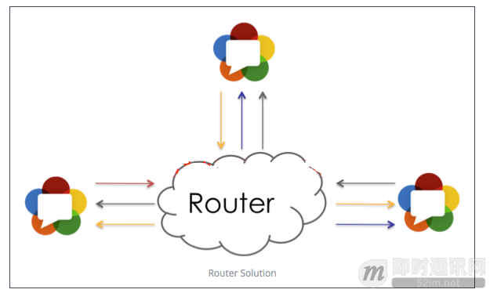

**即时通讯音视频开发（十二）：多人实时音视频聊天架构探讨**

## 多人实时音视频架构1：Mesh结构

这是最简单的多人视频通话架构模式，所有媒体流都不需要经过服务端，客户端直接P2P，可通过webrtc建立多个PeerConnection，结构图如下:

**该方案优点:**
服务端压力最小，大多数情况下不需要用到流媒体服务。

**该方案缺点:**
客户端负载太大，不事宜扩展，特别是移动端，编解码压力会非常大。

## 多人实时音视频架构2：Mixer结构

视频会议基本上就是种结构，他的最大特点就是服务端做了很多事情，包括转码，混音，合屏，所以服务端负载非常大，结构图如下:

**该方案优点:**

- 客户端负载最小，与一对一负载一样，所以理论上可以支持很多人同时视频。
- 因为服务端有做编解码，所以可与现有产品无缝集成。
- 可以最大程度利用硬件能力，如硬件MCU，芯片。

**该方案缺点:**

- 服务端负载很大，建设成本很高。
- 延迟问题，因为服务端做了很多动作(解码，合屏，混音，编码)，所以会带来延迟。

## 多人实时音视频架构3：Router结构

该方案最大特点就是服务端只负责包转发，不负责转码，yy流媒体服务基本上就是这个功能，结构图如下：

**该方案优点:**

- 与Mixer相比服务端压力比较小，而且容易扩展。
- 低延迟，特别是与SVC结合能大大提升客户端体验度(貌似h265和vp9才开始集成svc)。

**该方案缺点:**
考虑到不同客户端需要不同的接收能力，所以真正实现下来服务端的架构也并不简单。

## 结语

因为各种模式都有自己的优缺点，所以实际应用中您应该根据自己的具体业务选择适合的架构模式。现在有很多开源框架和PAAS可以做上面这些事情，但是实际应用中都存在这样的问题，并不成熟。

本文主要通过介绍Mesh、Mixer和Router这三个结构的优缺点来介绍Android WebRTC 音视频开发之多人视频服务端架构模式架构模式。想要学习更多关于WebRTC音视频开发的知识，可以自行查找相关的资料来学习。

