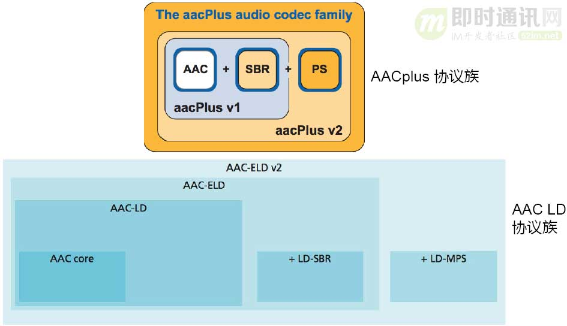
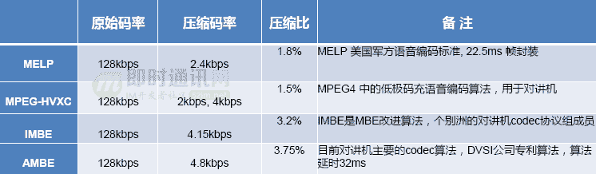

**即时通讯音视频开发（十八）：详解音频编解码的原理、演进和应用选型**

## 1、引言

大家好，我是刘华平，从毕业到现在我一直在从事音视频领域相关工作，也有一些自己的创业项目，曾为早期Google Android SDK多媒体架构的构建作出贡献。

就音频而言，无论是算法多样性，Codec种类还是音频编解码复杂程度都远远比视频要高。视频的Codec目前还主要是以宏块为处理单元，预测加变换的混合编码框架，例如H.264和H.265都是在这一框架下。而音频则相当复杂，且不同的场景必须要选择不同的音频编解码器。以下就是本次为大家分享的主要内容，希望通过此次分享可以使大家对音频编解码有一个整体的认识，并在实际应用中有参考的依据。

**本次分享的内容提纲：**

- 1）语音／音频编码总表；
- 2）数字语音基本要素；
- 3）为什么要压缩；
- 4）编码器考虑的因素；
- 5）语音经典编码模型；
- 6）ISO；
- 7）编码模型；
- 8）USAC；
- 9）编码；
- 10）使用选型考虑的因素。

*** 本次演讲PPT文稿，请从文末附件下载！**

## 2、分享者

**刘华平：**

- \- 现为网易云音乐音视频实验室负责人，上海大学通信学院在职博士；
- \- 曾任掌门集团（WIFI万能钥匙）音视频技术研发总监，资深研究员；
- \- 行者悟空声学技术有限公司首席技术官(联合创始人)；
- \- 阿里巴巴前高级技术专家(P8)， 阿里音乐音视频部门总监；
- \- Visualon音频部门经理、盛大创新院研究员、Freescale 上海研发中心多媒体部门；
- \- 早期 Google Android SDK多媒体架构的贡献者，开源 AMR_WB 编码器工程开发者。

刘华平拥有5项技术发明专利、二十余篇专业论文和多项软件著作权，参与过浙江省杭州重大专项项目，浙江省金华科委项目，上海市科委项目(球谐域全景音频关键技术研究)。

## 3、系列文章

**本文是系列文章中的第18篇，本系列文章的大纲如下：**

- 《[即时通讯音视频开发（一）：视频编解码之理论概述](http://www.52im.net/thread-228-1-1.html)》
- 《[即时通讯音视频开发（二）：视频编解码之数字视频介绍](http://www.52im.net/thread-229-1-1.html)》
- 《[即时通讯音视频开发（三）：视频编解码之编码基础](http://www.52im.net/thread-232-1-1.html)》
- 《[即时通讯音视频开发（四）：视频编解码之预测技术介绍](http://www.52im.net/thread-235-1-1.html)》
- 《[即时通讯音视频开发（五）：认识主流视频编码技术H.264](http://www.52im.net/thread-237-1-1.html)》
- 《[即时通讯音视频开发（六）：如何开始音频编解码技术的学习](http://www.52im.net/thread-241-1-1.html)》
- 《[即时通讯音视频开发（七）：音频基础及编码原理入门](http://www.52im.net/thread-242-1-1.html)》
- 《[即时通讯音视频开发（八）：常见的实时语音通讯编码标准](http://www.52im.net/thread-243-1-1.html)》
- 《[即时通讯音视频开发（九）：实时语音通讯的回音及回音消除概述](http://www.52im.net/thread-247-1-1.html)》
- 《[即时通讯音视频开发（十）：实时语音通讯的回音消除技术详解](http://www.52im.net/thread-250-1-1.html)》
- 《[即时通讯音视频开发（十一）：实时语音通讯丢包补偿技术详解](http://www.52im.net/thread-251-1-1.html)》
- 《[即时通讯音视频开发（十二）：多人实时音视频聊天架构探讨](http://www.52im.net/thread-253-1-1.html)》
- 《[即时通讯音视频开发（十三）：实时视频编码H.264的特点与优势](http://www.52im.net/thread-266-1-1.html)》
- 《[即时通讯音视频开发（十四）：实时音视频数据传输协议介绍](http://www.52im.net/thread-267-1-1.html)》
- 《[即时通讯音视频开发（十五）：聊聊P2P与实时音视频的应用情况](http://www.52im.net/thread-269-1-1.html)》
- 《[即时通讯音视频开发（十六）：移动端实时音视频开发的几个建议](http://www.52im.net/thread-270-1-1.html)》
- 《[即时通讯音视频开发（十七）：视频编码H.264、V8的前世今生](http://www.52im.net/thread-274-1-1.html)》
- 《[即时通讯音视频开发（十八）：详解音频编解码的原理、演进和应用选型](http://www.52im.net/thread-2230-1-1.html)》（本文）
- 《[即时通讯音视频开发（十九）：零基础，史上最通俗视频编码技术入门](http://www.52im.net/thread-2840-1-1.html)》

## 4、语言/音频编码总表

▲ 语言/音频编码总表

上图展示的是语言/音频编码总表，可以看到其比视频编码要复杂得多，单纯的算法也远远比视频要更加复杂。

## 5、数字语言基本要素

**数字声音具有三个要素：**

- 1）采样率；
- 2）通道数；
- 3）量化位数。

▲ 声音数字化的过程

**如上图所示，声音数字化的过程为：**

- 1）采样：在时间轴上对信号数字化；
- 2）量化：在幅度轴上对信号数字化；
- 3）编码：按一定格式记录采样和量化后的数字数据。

## 6、为什么要压缩

压缩音频，主要是为了在降低带宽负担的同时为视频腾出更多带宽空间。存储和带宽二大因素决定了语音压缩的必要性。

我们看看下面的例子。

**长度为4分钟，采样频率为44100Hz,采样深度为16bits,双声音Wav文件大小：**

44100Hz*16bits*4minutes*2=(44100/1second)*16bits*(4minutes*(60seconds/1minutes)*2=705600bits/second*240seconds=169344000bits=169344000/(8bits/1byte)*2=42336000bytes=42336000/(1048576/1M)bytes=40.37MB

**MP3，128kbps压缩后文件大小：**

128kbps*4minutes=(128kbits/1second)*(4minutes*(60seconds/1minutes))=(128kbits/1second)*240seconds=30720kbits=30720kbits/(8bits/1byte)=3840kbytes=3840k/(1024k/1M)bytes=3.75Mbytes=3.75MB

正如上面的例子，声音压缩后，存储大小为原大小的十分之一，压缩率十分可观！

## 7、编码器考虑因素

### 7.1基本概念

**编码器考虑的因素：**

- 1）最佳压缩比；
- 2）算法的复杂度；
- 3）算法延时；
- 4）针对特殊场景下的特定设计；
- 5）兼容性。

通过一些特定的压缩算法，可以压缩音频文件至原来的1/10，同时人耳也无法分辨压缩前后的声音质量差异，需要满足多种条件才能实现这种效果；而对于编码器，无论是设计阶段还是使用阶段，我们都需要考虑最佳压缩效果、算法的复杂度与算法的延时，结合特殊场景进行特定的设计；而兼容性也是我们不能不考虑的重点。

### 7.2语音经典编码模型：发音模型

▲ 发音模型（[原图点击查看](http://mirlab.org/jang/books/audioSignalProcessing/humanVoiceProduction.asp)）

我们的很多编解码器都是基于综合人的发音模型与一些和听觉相关的理论支持研究提出的特定编解码算法。初期我们通过研究人的发音原理来设计音频编解码的算法，包括端到端的滤波或轻浊音等，只有充分理解人的发声原理我们才能在编解码端做出有价值的优化。

***【7.2.1】语音编码模型——LPC：\***

▲ 经典语音编码模型：LPC（[原图点击查看](https://www2.spsc.tugraz.at/add_material/courses/scl/vocoder/tech.html)）

▲ LPC 数学表达

LPC作为经典语音编码模式，其本质是一个线性预测的过程。早期的G.7系列编码模型便是通过此模型对整个语音进行编码，上图展示的过程可与之前的人发声过程进行匹配，每个环节都有一个相应的模块用来支撑人发声的过程。其中使用了AR数学模型进行线性预测，此算法也是现在很多语音编码的重要组成模块。

***【7.2.2】语音编码模型——G.729：\***

▲经典语音编码模型: G.729(CELP)

G.729同样是经典的语音编码模型之一，也是我们学习语音编码的一个入门级Codec。G.729的文档十分完善，包括每个模块的源代码在内都可直接下载。G.729可以说是在早期发声模型基础上的改进，需要关注的性能指标是帧长与算法上的延时，包括语音质量的MOS分。G.729也有很多变种，由于语音需要考虑系统兼容性，不同的系统指定携带的Codec也不同，音频编码的复杂程度要远高于视频编码。

G.729 建议了共轭结构的算术码本激励线性预测(CS-ACELP)编码方案。G.729算法的帧长为10ms, 编码器含5ms 前瞻，算法时延15ms，语音质量MOS分可达4.0。

### 7.3语音经典编码模型——听觉模型

▲ ISO编码模型：心理声学模型

除了研究人发声的原理，我们还需要研究人听声的原理，从而更好实现声音的收集与处理。一个声音信号是否能被人耳听见主要取决于声音信号的频率、强度与其他音的干扰。心理声学模型便是用来找出音频信号中存在的冗余信息从而实现在压缩声音信号的同时不影响听觉的目的。心理声学理论的成熟为感知编码系统奠定了理论基础，这里的感知编码主要是ISO编码模型，主要覆盖的声学原理有临界频带、绝对听觉阈值、频域掩蔽、时域掩蔽等。

▲ 听觉模型

无论是MP3还是AAC以至于到后面的杜比音效都是基于听觉模型进行的探索与创新。

***【7.3.1】临界频带：\***

由于声音频率与掩蔽曲线不是线性关系，为从感知上来统一度量声音频率，引入了“临界频带”的概念。通常认为，在20Hz到16kHz范围内有24个监界频带。临界频带的单位叫Bark(巴克)。

▲ 临界频带

临界频带主要用于心理声学模型。由于声音频率与掩蔽曲线并非线性关系，为从感知上来统一度量声音频率，我们引入了“临界频带”的概念。人耳对每段的某个频率的灵敏度不同，二者关系是非线性的。通常我们会将人可以听到的整个频率也就是从20Hz到16KHz分为24个频带，可在其中进行时域或频域类的掩蔽，将一些冗余信息从编码中去除从而有效提升压缩率。

***【7.3.2】绝对听觉阈值：\***

▲ 绝对听觉阈值

绝对听觉阈值也可有效提升压缩率，基于心理声学模型，可去除编码中的冗余部分。

### 7.4经典音频编码：ISO

▲ 经典音频编码：ISO

我们可将最早的MP3 Layer1理解为第一代的ISO感知编码，随后的一些纯量化内容更多的是在压缩上进行改进而核心一直未改变。从MP3 Layer1到Layer2与Layer3，主要的改变是心理声学模型的迭代。

▲ MPEG1 LayerI Codec

▲ MPEG1 LayerIII Codec

上图展示的是Encode与Decode的回路。输入的PCM首先会经过多子带分析与频域中的心理声学模型冗余处理，而后进行量化编码；Layer III中的是我们现在常说的MP3的Codec：Encode与Decode之间的整体回路，相比于Layer1多了几个处理环节以及霍夫曼编码。

### 7.5AAC协议族

▲ AAC家族

AAC与G.719一样包括很多系列，但AAC的巧妙之处在于向下兼容的特性。开始时我们就强调，所有Codec在设计时都需要考虑兼容性，瑞典的Coding Technology公司曾提出在兼容性上特别优化的方案。AAC Plus V1包括AAC与SBR，AAC Plus V2包括AAC+SBR+PS，现在常见的很多音乐类或直播音频编码都是基于AAC Plus协议族进行的。

德国的霍朗浦学院曾在AAC低延时协议扩展方面做出一些探索并得到了AAC LD协议族，其原理仍基于传统的AAC模块，但在后端会对处理长度进行调整，例如之前是以1024bit为一个处理单位，那改进后则以960bit为一个处理单位。除此之外AAC LD加入了LD-SBR与LD-MPS等，从而形成一个规模较大的AAC-ELD V2模块，可以说是十分巧妙。

***\*【7.5.1】AACPlus核心模块——SBR（Spectral Band Replication）：\****

▲ SBR(Spectral Band Replication)

我们可以看到，AAC可以说充分利用了频域扩展，用很小的代价实现诸多功能优化。AAC的核心之一是SBR，这是一种使用极少位数就可描述高频部分并在解码时进行特殊优化从而实现频域扩展的模块。上图展示的是不同压缩率模块所覆盖的频率取值范围，而使用AAC时需要注意一个被称为“甜点码率”的指标。无论是采样率还是码率都是变化的，在应用时选择何种码率十分关键。例如直播时采用64Kbps即可在覆盖整个频段的同时保持良好音质。

***【7.5.2】AACPlus核心模块——PS（Parametric Stereo）：***

▲ ：PS(Parametric Stereo)
PS 描述参数：IID(Inter-channel Intensity Difference),，ICC(Inter-channel Cross-Correlation)，IPD(Inter-channel Phase Difference)。

▲ AACPlus v2编码框图

▲ AACPlus v2解码框图

PS模块也是AAC的核心模块之一，主要用于分析左右声道属性并使用非常少的位数表示左右声道相关性，而后在解码端将左右声道分离。这里比较巧妙的是PS的向下兼容特性，整体数据打包是分开进行的。如果获取到AAC、SBR、PS三者的基本数据包后，在解码阶段我们就只需AAC—LC。上图展示的就是AAC的解码框架，如果大家读过3GPP的代码就可发现其每一个模块都相当清楚。我们可根据文档读取代码并对应到每一个环节。

***【7.5.3】甜点码率：\***

▲ AAC 甜点码率

甜点码率是一项很关键的指标。例如在手机直播应用场景中，一般的视频分辨率为640×360，音频码率大约在800K左右。如果音频码率过大则会直接影响视频质量，因而我们需要控制音频码率在一个较为合适的范围内从而实现最佳的音画效果。在很多应用场景中可能需要系统根据不同的网络环境下载不同音质的文件，例如在2G环境中下载较小的文件，这样做主要是为了节省带宽并提高音频文件的播放流畅程度。

### 7.6AAC-ELD家族

**AAC-ELD家族产生背景：**aacplus v2 已经在压缩和音质方面做到了近似于极致，但由于算法实现上的长达100ms左右的延时极大的阻碍aacplus v2在实时通讯领域的应用。Fraunhofer IIS 为了解决这个问题，对AAC进行相关改进，形成了AAC-ELD协议族。

▲ AAC-ELD家族

AAC-ELD家族带来的主要改进是低延迟。如果Codec的延迟太长便无法在一些特定场景中被使用。例如早期AAC Plus V2的整体延迟可达100ms，如此高的延迟肯定无法被应用于语音通话等对实时性要求极高的应用场景。霍朗普学院推出的AAC-ELD可在保持音质的前提下将延迟降低至15ms，相对于MP3最高长达200ms的延迟而言提升巨大。

### 7.7应用中端到端的延迟

▲ 端到端的延时

编解码过程也存在延时问题，这也是我们选择编解码器时需要考虑的最主要因素之一，编解码的延时主要由处理延时与算法延时组成，例如G.729的算法延时为15ms，而AAC-LC可达到一百毫秒以上。另外，播放端或采集端的长帧数量太多，播放时缓存太多等也会直接影响延时，我们在选择编解码器时需要考虑延时带来的影响。

**编解码器已经历了两个发展方向：**

- 1）一个是以G.7（G.729）为例，根据发声模型设计的一套主要集中于语音方面的编解码算法；
- 2）另一个是以ISO的MP3和AAC为例，根据心理声学模型设计的一套感知编码。

**最近的趋势是编码的统一：**原来在语音场景下我们使用8K或16K进行采样，音乐场景下则需使用覆盖到全频带的44.1K进行采样，每个Codec都有一个频域覆盖的范围。在之前的开发中，如果应用场景仅针对压缩语音那么需要选择语音编码方案，如果应用场景针对压缩音乐则需要选择音乐编码方案，而现在的发展方向是通过一套编码从容应对语音与音乐两个应用场景，这就是接下来将要被提到的USAC。

**这里介绍两个比较典型的Codec：**

- 1）一个是Opus，通过其中集成的模块可实现根据传入音频文件的采样率等属性自动选择语音编码或音乐编码；
- 2）另一个是EVS这也是霍朗普等组织推行的方案，已经尝试用于4G或5G之中。

**EVS (Enhanced Voice Services)：**主要是VoiceAge, Dolby, Fraunhofer, 华为联合开发的USAC编码器，低速率音乐编码质量很好。

▲ USAC

由框图我们可以了解到USAC向下兼容的特性。

**编解码器可总结为经历了三个时代：**

- 1）发声模型；
- 2）听觉感知；
- 3）融合方案。

接下来我将展示目前所有的Codec情况并整理为表格以方便大家检索查阅。

## 8、解码器（Codec）总结

### 8.1IETF系列

IETF作为标准协议联盟组织之一推出了以上Codec：Opus包括采样率为8kHz、甜点码率为11kbps的窄带单声语音（SILK），采样率为16kHz、甜点码率为20kbps的宽带单声语音与采样率为48kHz、甜点码率为32kbps的全带单声语音（CELT），采用甜点码率意味着将压缩率和音质保持在一个良好的平衡状态。在一些窄带单声语音应用场景例如常见的微信语音聊天，其压缩率可达到原来的8.5%。Opus没有技术专利和源代码的门槛，使得其受到现在很多流媒体厂商的欢迎，Opus支持更广的码率范围，具备丰富采样率选择，可实现极低延迟与可变帧大小，也具备以往一些Codec的许多特性如CBR、VBR、动态调整等，支持的通道数量也更多。除此之外，Opus同样具备许多从SILK移植而来的特性或功能。如在VUIB传输上集成了扛丢包模式等。

iLBC早在SILK未出现时就被提出同样具备抗丢包。的特性，高达15.2kbps的甜点码率与4.14的Mos使其音质较为良好，超过G.729的相关指标；GSM就是最早手机网络仍停留在2G时代时流行的编码形式，主要用于蜂窝电话的编码任务。

### 8.2AMR系列

AMR早在3G时期就被广泛应用，AMR-NB是最流行的语音编码器，具有压缩效果好，支持多种码率形式的特点；与此同时，这也是GSM与3G时期Android平台最早支持的窄带语音编码方案。AMR-WB作为AMR-NB向宽带的扩展版，主要用于3G和4G通话标准协议中，其甜点码率为12.65kbps。在实践中我们将码率参数调整为此值即可实现压缩率与质量的平衡。AMR-WB+则是上述两者的融合，三者共同构成AMR系列。

### 8.3ITU-T G系列

ITU-T G系列包括最早的波形编码G711到现在大家熟悉的G.729这里我想强调的是G722.1 Siren7、G722.1c Siren14与G719 Siren22，例如G.719可覆盖整个前频带且支持立体声。即使都属于老协议，但由于其优秀的兼容性，不应被我们忽略。

将Opus与其他一些Codec进行对比我们可以看到，无论是质量还是延时控制，Opus的优势十分明显；加之Opus作为开源的免费方案，不存在专利限制，受到业界追捧也不足为奇。

### 8.4ISO系列

ISO里我想强调的是MP3与AAC，二者同样支持很多码率。MP3的甜点码率为128kbps，MP3 Pro的码率可达到MP3的一半；AAC支持8～96khz的采样率，AAC-LC的甜点码率为96kbps，HE-AAC的甜点码率为32kbps，AAC-LD与ELD做到了AAC的低延时，实现了延时与压缩比的最佳平衡。

### 8.53GPP系列：EVRC

EVRC 是CDMA 中使用的语音编解码器，由高通公司1995年提出目标是取代QCELP。

高通公司主推的3GPP是CDMA中使用的语音编解码器，在未来选择编解码器类型时我们需要特别考虑延时与帧长。由于语音编码种类很多，帧长也是复杂多变的，其背后的算法复杂程度，RAM、ROM占用等都是在实践当中需要着重考虑的。

### 8.6极低码率

极低码率主要的应用场景是对讲机、卫星通讯、军工等。

上图图表中的MELP最早由美国军方开发，现在绝大多数的对讲机都基于此模型进行扩展开发，压缩后的码率可达到2.4kbps而目前最极端的极低码率可实现300bps，相当于压缩为原数据的0.2%，此时的音频文件仅能被用于传达语音内容而丢失了很多声色。

### 8.7全频带

全频带中的组合也是多种多样。

## 9、编解码使用注意

### 9.1License

▲ 开源项目常用的Lisence

国内大部分企业在开发时容易忽视包括专利安全性在内的与License相关的内容。如果企业计划得比较长远，需要长期使用某项技术或企业规模不断扩大时则不能不考虑专利问题。专利费用包括Open Source与算法专利，二者完全独立互不干涉，如果我们从某家专利公司购买了AAC的专利算法，并不能获得此AAC专利的源代码，仅能获得与此技术相关的专利使用授权。专利公司会给予需要下载的文件列表，通过这种方式实现技术的授权使用。

▲ 一张图看懂Lisence（来自：[阮一峰的博客](http://www.ruanyifeng.com/blog/2011/05/how_to_choose_free_software_licenses.html)）

上面的二叉树图比较清晰地展示了代码授权的具体流程，随着企业的规模化发展日趋成熟，企业应当规范自身的技术使用行为，尽可能避免专利纠纷带来的不利影响。

### 9.2专利

▲ 2个著名的多媒体技术专利池

**主流语音编解码技术拥有两个专利池：**

- 1）MPEG-LA；
- 2）Via Licensing。

很多非常复杂的Codec涉及高达上千个专利，与之相关的企业或组织多达几十个，为专利授权而与每一个企业或组织进行洽谈显然是不现实的，因而专利池的出现使得技术授权更加规范清晰，方便企业统一处理技术授权问题。

### 9.3常见Codec Patent License

希望大家在使用技术的同时尊重知识产权，助力技术创新可持续发展。