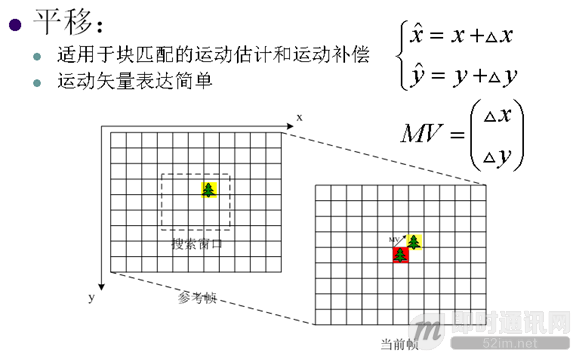

**即时通讯音视频开发（四）：视频编解码之预测技术介绍**

## 1. 预测技术的作用

目的是去除空间冗余和时间冗余。因为视频存在大量的空间冗余和时间冗余，包括空间冗余、时间冗余，预测后得到去除大部分空间或时间冗余的残差。

## 2. 空间冗余

图像空间相邻像素具有很强的相关性，帧内预测技术去除空间冗余。

## 3. 亮度预测模式

## 4. 色度预测模式

## 5. 时间冗余

视频图像在时间上有较强的相关性，即存在时间冗余。去除时间冗余的编码技术有：运动估计（Motion Estimation，ME）、运动补偿（Motion Compensation，MC）。

## 6. 运动模型

## 7. 匹配准则

## 8. 运动估计

目的是去除视频图像的时间冗余。运动估计在搜索范围内为当前块寻找匹配最好的预测块，全搜索方式的运动估计计算复杂度高。

## 9. 快速运动估计算法种类

**在保持预测精度的同时减少运动估计的搜索次数，典型算法有：**

- 三步搜索（Three Step Search，TSS）
- 二维Log搜索（2D Logarithmic Search，2DLOG）
- 正交搜索（Orthogonal Search Algorithm，OSA）
- 十字搜索（Cross Search Algorithm，CSA）
- 新三步搜索（New Three Step Search，NTSS）
- 四步搜索（Four Step Search，FSS）
- 共轭方向搜索（Conjugate Direction Search，CDS）
- 梯度下降搜索（Gradient Descent Search，GDS）
- 层次块搜索（Hierarchical Block Matching Algorithm，HBMA）

## 10. 搜索算法复杂度比较

## 11. 分像素运动估计与运动补偿

时域运动位置更可能在整象素之间，即分像素上。利用相邻的整象素可以估计出分象素的值：常用线性或双线性插值得到分象素的值。分象素运动估计有更高的预测精度，但复杂度也更高：1/2分象素运动估计，图像存储空间增加4倍，运动矢量需要放大2倍，1/4分象素运动估计，图像存储空间增加16倍，运动矢量需要放大4倍，计算复杂度也成倍增加。

## 12. 分像素插值

## 13. 多参考帧预测

有更多的候选图像，搜索更精确的预测块。

## 14. 图像分块编码

视频内容的运动非常复杂，图像分块编码可以更好的提高运动预测精度，提高压缩效率。要在编码块大小和附信息（MV，Mode）编码比特数之间权衡，小的编码块大小会有更好的预测但有更多的附信息比特数。

## 15. 双向预测编码

## 16. B帧有更好的编码效率

新出现的对象参考将来的帧有更好的预测效果，前后两个预测的平均值可以减少预测方差。

## 17. 全局运动估计

基于全局仿射运动模型。预测精度不如基于块的运动估计。MV数目少，适合简单运动场景的运动估计。

