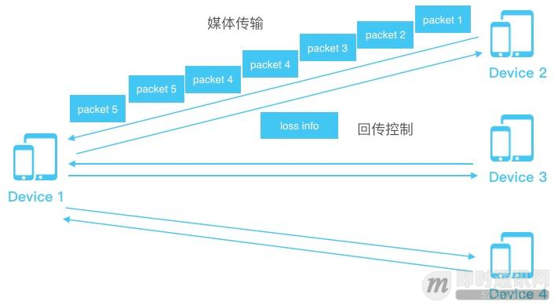
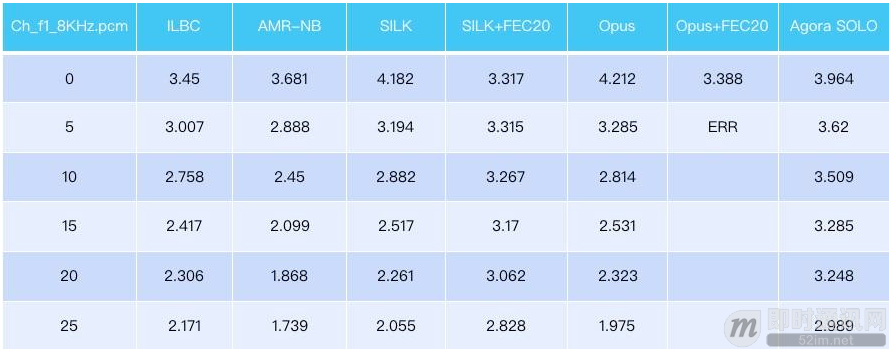

**实时音视频聊天技术分享：面向不可靠网络的抗丢包编解码器**

## 1、前言

无论对于音频编码还是视频编码而言，对于编解码来说，都有不同的应用场景。

**比较大的应用场景有两个范围：**

- 第一种：面向文件直播的编解码器；
- 第二种：面向网络通信的编解码器。

在不同的应用场景下面，编解码器的选择完全不一样。举个例子，面向直播的时候，延时比较长、丢一些包、网络带宽跳动等，是不需要考虑。可以在离线的时候，充分的利用CPU的能力去编，可以固定I帧的间隔、固定I帧的大小，甚至多个B帧都可以。码率也可以是固定的，这对于录文件和录视频没有问题。

但是如果面向实时网络通信这样恐怕不太好，因为网络是瞬变，而且网络状态一般来说都是会伴随着丢包这样的状态，这个时候就不适合使用，比如说使用固定的I帧间隔，如果I帧丢了就要使用I帧重传。还有就是也不能使用固定的码率，因为码率也是瞬变的。

所以在面向于网络通信的编解码器中，编解码器选择和直播的编解码器的选择差别比较大。比如有人提出在网络通信中硬件压缩是否可以，其实由于不同的厂商对硬件压缩的支持是不一样的，硬件压缩的迭代不一样，编码支持也不太一样。有的硬件版本也不能产生可变I帧大小，或者码率是固定的，如果码率不固定就会自动重启硬件的编解码器。我说的都是一些个例，并不代表所有编解码器都是这样。

我想强调的是，编解码器面向直播和网络通信是不一样的，我今天想说的是面向不可靠传输网络的抗丢包编解码器。

## 2、抗丢包的重要性

首先我们来思考一下抗丢包的重要性。

在2017年，有几类应用是比较火的。第一类在大学校园最火的游戏应该是王者荣耀和狼人杀，王者荣耀10人组队实时厮杀、还有语音，狼人杀提供实时视频。第二类就是互动直播，主播端把通信直播流发到观众端，同时也可以把观众端拉上麦，实现主播和观众的互动。

我记得沪江的技术负责人吴海滨曾经提出，“在当前互动网络教育中最难解决的问题还是实时性，就是老师跟学生怎么能够更好的互动”。互动直播，在当前网络下给技术提了更高的要求，要求能够在低延时下提供高质量的通信品质。包交换的网络中，要想实现低延时和提高包质量，如果承载信息的包没有按时到达，接收质量不会好。

## 3、移动网络时代的丢包现状

既然丢包是低延时和高质量的一个拦路虎，我们来看一下当前的网络状态是不是有那么多丢包。

**我们提到丢包的时候首先要想到一点，丢包的定义是什么？**
其实对于通信来说丢包并不意味着真正的包丢了，我个人理解“只要包没有按时到达都叫丢包”。比如第一个包没有来，第二个包已经到了，此时第二个包发出去了，那么第一个包再来对我没有任何的帮助，实时通信不可能重来。

对于通信系统而言，下图是一个基本的通信系统，一个APP通过4G和WIFI，再通过公有云实现通信。大家可能会讲了，已经4G、5G，是不是带宽足够大，不需要考虑丢包的问题了呢？

不完全是那样。举个例子，我们看一下上图这个包的到达通路，手机和Pad通信，假如说Pad通过4G到达公有云，再通过WIFI发回给手机端。在这个通路中有三段网络，也就是有三段可能会产生丢包的地方。第一段是公有云之间，因为公有云之间也会有很多路由的转换。第二是4G或者WIFI到APP端，第三段就是，还有就是APP，device本身。

先来讲第一段，在公有云上我们都会建一些服务器。即使是在同一个运营商下，早上八点、中午12点到晚上8点，网络状况都不一样，通常来说晚上8点网络高峰期，这个时候网络传输非常上不稳定，在服务器和服务器之间经常容易产生丢包。第二是不同的运营商之间，比如电信和联通之间，当联通向电信传输数据时，由于两个运营商出口带宽结算问题，不在高峰期都可能不太稳定。还有一个问题就是，小运营商，比如教育网，机房的状态不是一直稳定的，可能会产生丢包。

第二段是4G或WIFI到终端，这一块也并不是非常可靠。如果两台设备连着是不同的基站互相通信，基站之间可能产生一个转化和丢包的问题。虽然连接了骨干网，但是由于骨干网不同的运营商差异，会产生丢包。在同一个运营商之间，不同的地区，网络状态也是不一样的。举个例子，在今天的会场，虽然我觉得这附近4G是蛮不错的，但是在2000人大型的会场都在使用联通4G的时候，实际上共享网络的状态是比较差的。这就是所谓的共享网络带来的问题。

当我们在不同的国家连接网络的时候，比如印度、美国，不同的国家网络状态也不同，所以我们在做网络策略的时候实际上都不能一概而论。

除此之外还有WIFI。如果大家做过实时通信的话，都会有一个感觉，有些时候4G比WIFI更稳定。因为WIFI实际上是非常不稳定的系统，如果大家在公司连WIFI的话，公司可能会存在数十台路由器，路由器之间有频率干扰。另外，即时是上千块钱的路由器，可支持连接人数最多也就是三四十人。超过这个限制，即使是连上了也会主动丢包。所以，并不是4G和WIFI带宽足够高就没有丢包的问题。

再提出一个非常现实的现状，运营商都在推行VoLTE，还有一个新词叫VoWiFi。这是数字电话在产生的一个变革，把电路交换过渡到分组交换，在分组交换下所有的通信都是通过包来传递，而不是固定的链路。之前的通话，我一旦拨通这个电话，链路就保持下来，不管有没有用、用多少，链路都是存在，所以效果都比较好。但是在分组交换网络下，数据都是以包的形式传递，不说话的时候不发包，或者发包比较少，码率也会比较低。但是运营商提出VoLTE和VoWiFi已经很久了，实际上我们只有少量情况会使用VoLTE，当网络不好时，都会回落到电路交换进行通话。运营商自己的4G网络质量就不好，更不用说我们在上面做端到端视频的通信。

## 4、丢包问题这么常见，我们有哪些办法？

既然丢包问题这么常见，我们有哪些办法？

**通常有这四种方案：**FEC、PLC、ARC、ARQ，还有一个是编码器。

ARC和ARQ分别是自动码率控制和自动请求重传，都是针对网络状态进行调整的策略，但是它们俩应用的场景不一样。对于音频来说，无论是语音还是音乐，码率通常需求比较低，尤其是语音，此时ARC的应用场景并不是特别大。比如，要传一个16kbps的语音，在当今的网络状态下问题不大。要传一个128kbps的音乐就稍微有一点问题。要传一个400-800kbps的视频问题就会比较多了。所以ARC是一种针对当前网络状态进行估计，并且回传回来主动进行码率调整的策略。

ARQ——自动请求重传，当网络延时比较低的时候，我们可以通过重传的方法来实现抗丢包。这种方案有两种策略：第一种，发出一个包，只要在规定的时间没有响应，就再发一个包；第二种，发出一个包会等它的请求，如果它的请求到了就给它一个重传包。但是这种技术的使用前提是端到端的网络延时比较短，如果延时比较长，比如延时200-400毫秒，用重传请求的方法，网络传输的延时会更长。

PLC是一个完全后端的抗丢包方法，有最简单的插值法、过采样法、还有WebRTC比较流行的拉伸和缩短法。WebRTC的这种方法效果不是很好，因为拉长或缩短会改变声音的频率，会产生奇怪的声音，或者改变语速。插值法采用的策略是，第一个包到了，第二个包丢了，第三个包到了，可以通过差值来实现。一般的PLC，可以对抗5%的丢包，再高了就效果不好。

我想重点讲的是FEC，这是一个很大的话题。FEC可以分为两大类：基于信源和基于信道。信源FEC是，包可以多发几遍，对于音频来说一秒可以发50个包，信源FEC就发两倍100个包，同样大小多发一遍，来实现抗丢包。基于信道的抗丢包是，比如当前的丢包率25%，我们可以加50%的抗丢包。那么原始有4个包，经过处理生成6个包，这6个包到达任意的4个包，都可以实现准确解码。

信源FEC中，如果采用多发包的方式，会产生新的问题，比如要传输的是16kpbs的语音，丢包时，是发32kpbs的语音，两个16kpbs的都发过去。还是把它拆成两个8kpbs再发？各有优劣。如果使用两个8kpbs，下降了音质来换取抗丢包性。如果选择32kpbs，保持音质，之前16kpbs下网络丢包假如是10%，带宽变成32kpbs后，丢包情况也会不同。

所以，Opus和Silk的编码器提出一种新方法，采用了下降码率的做法，类似于两个8kbps。在16kbps的音频流中，有4kbps的小包来对前一帧补偿。一旦大的包丢了，就使用小包来进行恢复，但是带来的问题是音频质量下降了。FEC是一种很好的抗丢包方法，但是它的问题是有可能会浪费带宽。使用FEC之后，确实能提高包的到达率，能在有限的延时下把通信的质量提高。

如上图所示，我们来看一下FEC的流程。先发出了三个包，从device1发了3个包到device2，packet2丢了，那么此时的丢包率是33%。device2会发一个lossinfo给device1，告诉它丢包率是33%。然后，device1接着发新的包，此时会发双倍，两个packet4，两个packet5。packet4发生丢包，就会被另一个packet4补偿回来了。

**这是典型的FEC的流程，但有几个问题：**

- loss info本身也可能会丢丢失；
- loss info没丢失，但从device 2 到device 1会有延时；
- 丢包估计可能不准。丢包率33%，如果扩大窗口可能是25%；
- 虽然是33%的抗丢包，发冗余包时只能多发一倍，没有办法准确的发33%；
- 只丢了packet4，但packet5也发了两遍，这浪费了带宽，没有意义的。

如果是多方通信， device2丢包率33%，但是device3和device4不丢包怎么办？如果所有device都多发了一倍的包，而且码率不上升，确实device2的抗丢包性好了，但是牺牲了device3和device4的质量。如果把码率扩大一倍，所有device的质量都好了，但是浪费了一倍的带宽。

## 5、声网的解决方法分享

基于上一节提到的这种现状和当前的很多学术研究，我们提出了一种新的思路：结合信源和信道编码的特点，利用充分包交换网络的特性，基于此，研发出了声网新的编解码器——Agora SOLO™。从通信原理来说，信源编码是尽可能去追求高压缩比，去冗余。而信道编码是追求强纠错，靠加冗余来实现纠错。Agora SOLO™就是把加冗余和减冗余结合起来，不重要的地方减冗余，重要的地方加冗余。

我们以上图为例，来看一下Agora SOLO™的抗丢包特点。对所有的接收端，我们默认都发了这些包。但是，我们会把包分成两块，一个是packet 1，一个是packet 1’。如果只收到其中一个包，那么就实现一个有限失真的恢复，质量相对稍差。如果packet 2和packet 2’都收到了，那么就两个包合起来，实现一个高质量的解码。也就是说，Agora SOLO™默认就不需要等待对当前网络丢包状态的统计，只需要直接把抗丢包做到编解码内部。

**这样做的好处是：**

- 首先实现了更低的延时，因为它不需要估计信道的状态，直接把包发出去就好；
- 第二是更高质量，收到一个包时质量达到的普通编解码器水平，收到两个包达到高质量编解码水平；
- 第三，这是面向多人环境的。不同人下行网络不一样，丢包不一样；
- 第四，策略更简化，使用Agora SOLO™几乎可以不需要再做策略调整。

上图我用ITU NTT的中文测试序列跑的测试结果。我稍微介绍一下，ITU的NTT是标准的编解码器测试序列，里面有26国语言，我这里面只拿出了中文部分。除了荷兰语和俄罗斯语以外，中文是比较难编。因为中文除了一般语言外还有四声。看图第一列，是只收到8kbps的packet1， PESQ的平均分是3.52分。如果只收到packet2，它分数是3.51分。如果packet1和packet2都收到，16kbps时，分数是3.95分。以上是窄带的分数。宽带下的分数，是3.58分，满分是4.5分。这个测试结果可以清晰的看到，只收到1个包时是有限失真的。当两个包都收到时，质量会明显提升。

接下来，我们来与其它编码器进行比较。上图一个中文的女声序列在不同的编解码器的比较。第一列是不同的丢包率，后面各列是不同编解码器在不同丢包率下的分数。可以看到在丢包率25%时，Agora SOLO™整整比其它编解码器高出1分。

**最后，再来回顾一下Agora SOLO™抗丢包的特点：**

- 我们可以不再关心网络丢包状态，默认发两个包；
- 如果只收到一个就是有限失真，收到两个就是高质量的恢复。

## 6、本文小结

本文分享了实时音视频聊天在不可靠网络下面临的诸多数据传输层挑战，并给出了一些参考解决方法，重点分享了声网的解决思路，仅供参考。