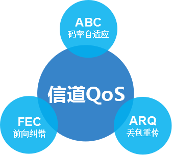
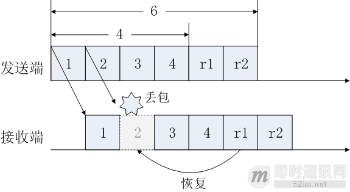
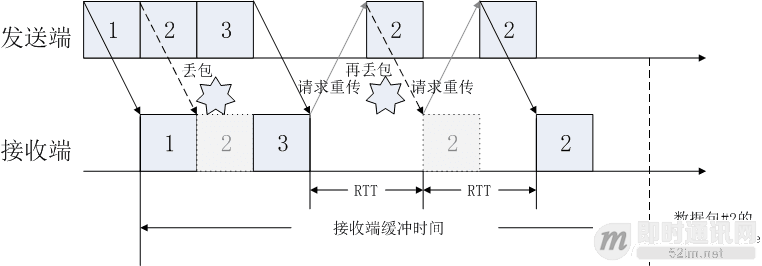
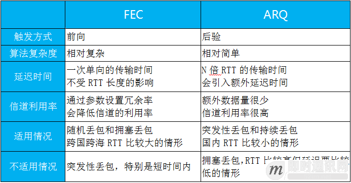
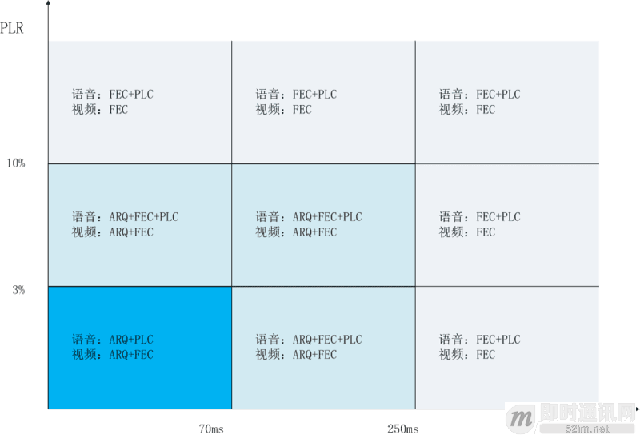

**如何优化传输机制来实现实时音视频的超低延迟？**

## 1、前言

要在语音视频 SDK 中实现超低延迟，实时的语音视频传输机制是必不可少的，而 FEC 和 ARQ 的智能结合是实时语音视频传输机制的基石。

在语音社交、视频社交、游戏语音和互动直播等领域，关于在语音视频实时传输中实现低延迟这个议题，已经有不少的文章提出各种方案。绝大部分方案的思路都是“优化”，比如说，优化编码、推流、传输和播放等各个环节。

愚以为，要在实时语音视频传输中获得超低延迟，是不能单靠挖空心思去“优化”的，而是要依靠实时的传输机制。就像高铁和火车有着本质的区别一样，火车不管如何优化，也只是跑得更快的火车，永远达不到高铁的速度。没有一套实时的传输机制，再怎么在各个环节“优化”，也无法获得真正超低的延迟。

要实现超低延迟，信道 QoS 十分关键。首先要选择合适的网络传输协议，采用基于 UDP 的私有协议还是标准 RTMP 协议？然后根据网络环境采用合适的 QoS 技术，采用 FEC，ARQ，还是双管齐下? 如果采用 FEC 和 ARQ 双管齐下，那么一套智能的 QoS 策略就必不可少。没有任何一种 QoS 技术能解决所有问题，实时语音视频传输机制必须是多种 QoS 技术的有机结合。

## 2、传输层协议的选择

如果是视频直播 SDK，一般会选择 RTMP 协议，因为要能够普遍兼容 CDN 分发网络，从而向围观的广大用户进行直播。如果是音频社交 SDK、视频社交 SDK 或者游戏语音 SDK，一般会选择 RTP/RTCP 协议（或者类 RTP 的私有协议），因为不需要通过 CDN 网络向围观用户广播媒体流。是否要考虑兼容 CDN 网络，是语音视频通话 SDK 和视频直播 SDK 的重大区别。

RTMP 协议是基于 TCP 协议的，RTP 协议或者私有协议是基于 UDP 协议的，因此 RTMP 协议和 RTP 协议之争，本质就是 TCP 协议和 UDP 协议之争。

**TCP 协议的特点：**

- 1) 是通用的 IP 网络协议，不是为实时媒体传输而设计的，在弱网网络环境下延迟会增大；
- 2) 有内嵌的 ARQ，但没有 FEC，不允许开发者对 ARQ 策略进行控制，不能实现 FEC；
- 3) 不是从实时语音视频的角度进行设计的，更多考虑网络传输的公平性，内嵌的传输控制策略比较温和。

**UDP 协议的特点：**

- 1) 适合实时语音视频通讯，允许端到端全链条进行信道策略控制，在弱网环境下可控性更强；
- 2) 延迟时间的大小取决于丢包时候的 ARQ 和 FEC 策略，允许开发者深度控制 ARQ 和 FEC 策略；
- 3) 适合设计实时语音视频的通讯机制，根据网络状况自适应地选取 ARQ 和 FEC 策略，以及调整传输码率和报文的数量。

在网络环境好的情况下，只要语音视频编解码器相同，RTMP 协议和基于 UDP 的私有协议的传输效率是相当的，都可以实现低延迟、不卡顿和高品质的实时通讯效果。

在网络环境较差的情况下，特别是在跨网甚至跨国的情况下，基于 UDP 的私有协议对端到端全链条可控，包括流控码控、ARQ、FEC 和抖动缓冲等，对抗恶劣网络环境会更有保障。

## 3、信道保护

IP 网络是“尽力而为”地提供数据传输服务的，尽最大的可能性来发送报文，但对时延、可靠性等性能概不负责效果，传输的数据出错是避免不了的，因此对信道进行保护是必须的。

信道 QoS 技术主要包括前向纠错 FEC，丢包重传 ARQ 和混合型 ARQ。这几种算法都是成熟的技术，在最基础的算法上又衍生出多个变种，而且在实现的过程中也可以进行定制化。

在 FEC 和 ARQ 的基础上，为了更好地适应弱网环境，需要让码率自动适应网络环境的波动，这样能够更好地保障实时语音视频通话的可用性和流畅性。

▲ 信道 QoS 的三大措施

### 1前向纠错 FEC

FEC 全称是 Forward Error Correction，中文翻译为前向纠错，是一种通过增加冗余数据对丢失的数据包进行恢复的信道编码算法。具体地说，由发送端对原始数据进行 FEC 编码，生成冗余奇偶校验数据包，原始数据和冗余数据包合并称作 FEC 数据块，原始数据包和冗余数据包的数量比例是固定的。发送端发送 FEC 数据块。接收端接收到 FEC 数据块后，通过冗余数据包和原始数据包来恢复出丢失或者出错的数据包。

FEC 编解码算法推荐使用比较成熟的 RS(Reeds-Solomon) 算法、Raptor 算法和 Tornado 算法。使用 FEC 编码算法的时候要根据丢包率（PLR, Packet Lost Rate）来设置冗余度。

下面使用 RS 的一个例子来说明 FEC 编解码算法的使用方法。

因为在一个 FEC 数据块中，原始数据包的个数和冗余数据包的个数的比例是固定的，所以很容易根据丢包的个数和冗余包的个数来判断是否能够全部恢复丢失的数据包。RS (n, k) 表示通过 RS 算法把 k 个原始数据包进行编码，生成（n-k）个冗余数据包，总共是一个包含有 n 个数据包的 FEC 数据块。假设丢失了 m 个数据包，如果 m<=(n-k)，那么 RS 算法可以完全恢复丢失的数据包；如果 m>(n-k)，那么 RS 算法就无法恢复丢失的数据包，这时候就要进行发送请求要求重传丢失的数据包。

下图展示了通过 RS(6，4) 进行丢包恢复的过程。发送端有 4 个原始数据包，通过 RS 算法编码生成 2 个冗余包，形成了一个拥有 6 个数据包的 FEC 数据块。RS 算法最多能够恢复 2 个丢失的数据包。发送端把 FEC 数据块发出去，在传输过程中第 2 号原始数据包丢失了。接收端接收到 FEC 数据块以后，通过 r1 冗余包把已经丢失的第 2 号原始数据包恢复出来。

▲ RS(6，4) 算法恢复出丢失的数据包

使用前向纠错 FEC 算法，优点是数据包只需要传输一次，传输延迟不会受到 RTT(Round Trip Time) 的影响，不会增加额外的延迟时间；缺点是需要增加冗余数据包，降低了传输信道的利用率。总的来说是一种“空间换时间”的策略。

下文将会综合对 FEC 和 ARQ 的特点进行全面对比。

### 2丢包重传 ARQ

ARQ 全称 Automatic Repeat reQuest，中文意译为丢包重传，是一种通过重传关键数据包来纠错的信道保护算法。

具体地来说，发送端给每一个数据包都植入顺序号码和时间戳，顺序号码代表被发送数据包的顺序，允许接收端可以通过监测顺序号码来发现丢包事件；时间戳代表语音视频数据包解码的时间点。发送端发送数据包后，如果接收端没有收到，接收端将会通过 RTCP/TCP 信道发送一个重传请求。发送端维护一个缓冲队列，当收到重传请求的时候将会重传数据包。接收端也会维护一个缓冲队列，等待尚未收到的数据包以及对已经收到的数据包进行排序。在解码的 deadline 到来之前，接收端把缓冲区的数据包交给解码器进行解码。在解码 deadline 的时间点，接收端要么已经收齐了预期的数据包，要么已经决定放弃继续等待。

**传统的丢包重传 ARQ 包括以下三种：**

- 1）Stop-and-wait ARQ，也就是停止等待的 ARQ，发送端发送数据包后就停止并等待接收端的确认消息，在收到确认消息之前，信道处于空闲状态；
- 2）Go-Back-N ARQ, 也就是退回 N 步的 ARQ，发送端不需等待接收端的确认，不停地发送数据包，直到收到接收端的重传请求。发送端除了重传被要求重传的数据包以外，还会把该数据包时间戳后面已经被接收端成功接收到的一批数据包全部重传一遍；
- 3）Selective Repeat ARQ，也就是选择性重传的 ARQ，发送端不需等待接收端的确认，不停地发送数据包；接收端只会有选择性地对关键的数据包要求重传，而发送端只重传被要求重传的数据包。

第一种和第二种 ARQ 效率比较低下，第三种 ARQ 相对来说效率比较高。目前主流的丢包重传算法大部分是第三种 ARQ 的变种或者定制化版本。

选择性重传 ARQ 的优越性在于它能确定哪些关键的数据包需要重传，从而大大地提高重传的效率，降低造成重传风暴的风险。比如说，在出现花屏的时候，请求发送端立即编码视频关键帧发送过来，避免长时间花屏无法刷新的现象。选择要重传的数据包的算法十分关键，这里必须要有比较谨慎的策略，不能任何丢失的数据包都要求重传，那样就相当于又走了 TCP 协议内嵌 ARQ 模块的老路，必然引入不可控的延时。

选择性重传的 ARQ 要考虑实时性，要估算计划要重传数据包到达的时间（以 RTT 的倍数来估算），如果数据包预期的到达时间在解码的 deadline 之前，就要求重传，如果在 deadline 之后，就放弃重传。下面通过一个例子来说明选择性重传的 ARQ 这个实时策略。

**下图展示了选择性重传的 ARQ 的实时策略：**

- 1）发送端发送 #1、#2 和 #3 三个数据包，数据包 #2 丢失了；
- 2）N 倍 RTT<数据包 #2 解码 deadline, N=2，判断可以接受重传 2 次；
- 3）接收端通过 RTCP/TCP 信道请求重传；
- 4）发送端重传，数据包 #2 再次丢失；
- 5）接收端通过 RTCP/TCP 信道请求重传；
- 6）发送端重传，数据包 #2 成功到达；
- 7）接收端把 #1、#2 和 #3 三个数据包排序，交给解码器解码。

▲ 选择性重传 ARQ 考虑 RTT 和编码 deadline 等实时因素

如果在 2 次以内能重传成功，那么就可以缩短接收端的缓冲时间，在解码 deadline 之前把数据包排序并交给解码器解码。如果在 2 次内不能重传成功，那么就放弃继续重传。因此，接收端总能维持解码的时间 t<= 解码 deadline，维持了传输的实时性。

使用选择性重传的 ARQ 算法，优点是只需要有选择性地传输关键的数据包，不会明显增加额外的带宽，带宽利用率十分高；缺点是需要请求和重传，增加了传输延迟时间。总的来说是一种“时间换空间”的策略。

下表对 FEC 和 ARQ 的特点进行综合对比。

▲ FEC 和 ARQ 的特点对比

### 3码率自适应 ABC

ABC 全称 Adaptive Bit-rate Control，中文意译为码率自适应，是服务端和推流端协作控制码率来自动适应网络环境变化的技术。码率自适应的目的是为了对抗弱网环境。在网络好的情况下，适当提高码率，提高语音视频的质量和降低延迟；在网络差的情况下，适当降低码率，保障语音视频通话的可用性和流畅性，适当牺牲音画质量。

**码率自适应包含了带宽估算和码率控制：**

- 1）带宽估算，服务端和推流端协作完成，推流端把网络环境统计信息上报给服务端，服务端通过带宽估算算法估计出当前带宽；
- 2）推流端按照估算出来的带宽进行推流，如果网络情况良好（没有检测到网络拥塞）则持续的地提高码率，试探网络带宽的上限，直到出现网络拥塞为止；
- 3）当网络拥塞出现的时候，推流端降低码率来保障可用性和流畅性，直到网络拥塞缓解为止；
- 4）当网络拥塞缓解的时候，转到 #2。

整个过程可以类比成驾驶汽车过程中控制方向盘的方法，偏左了就往右边调整一点，偏右了就往左边调整一点，来来回回的微调让驾驶处于安全和顺畅的状态。码率自适应也是一样的道理。

### 4错误隐藏 PLC

PLC 全称 Packet Lost Concealment, 意译为错误隐藏，应用于实时语音通话的场景。语音数据包的丢失会造成语音的歪曲。为了减少语音数据包丢失造成对语音通话质量的伤害，错误隐藏 PLC 算法通过前一个语音数据包和后一个语音数据包的相关性来“推测出”当前丢失的语音数据包，从而“隐藏”了信道传输所造成的错误。错误隐藏 PLC 算法在接收端进行，不需要发送端参与。

## 4、智能 QoS

上面介绍了信道保护的各种 QoS 算法。没有哪一种算法能够解决所有问题，也不是把所有算法一起混着用就能实现通讯机制。如何综合使用这些算法对信道进行保护从而达到实时的效果？这里需要一套智能的 QoS 策略，既要能对抗网络损伤，又要能保持媒体数据传输的实时性。

### 1混合 FEC&ARQ

FEC 和 ARQ 各有各的优点和缺点。FEC 虽然不会增加额外的延迟，但是会增加额外的带宽成本。ARQ 虽然算法相对简单而且几乎不增加带宽成本，但是会增加额外的延迟。因此，一般的做法是把 FEC 和 ARQ 混着通过智能的策略来使用，也就是混合型 HARQ(Hybrid ARQ)。

混合型 HARQ 的智能策略要充分考虑网络情况，也就是要根据 RTT 和 PLR 的数值来智能地决定使用 FEC 还是 ARQ，还是两者一起使用，哪个用多一点哪个用少一点？

下图是笔者和团队在工作经验中总结，仅供参考。

▲ 即构的智能 HARQ 策略

**上图中有三块区域，代表两个极端情形和一个中间情形：**

- 1）较弱网络的极端情形：在 RTT>250ms 或者 PLR>10%， 网络延迟特别大或者丢包率特别高的情况下（蓝白色区域），不使用 ARQ 而使用 FEC，因为在延迟大或者丢包多的弱网情况下，ARQ 可能会进一步加大延迟；
- 2）较好网络的极端情形：在 RTT<70ms 或者 PLR<3%，网络延迟很小并且丢包率比较低的情况下（深蓝色区域），适合使用 ARQ，如果对成本不敏感，可以适当使用 FEC；
- 3）中间的情形：在 (RTT<=250ms 而且 PLR<=10%) 的前提下，RTT>=70ms 或者 PLR>=3% 的情况，可以根据成本和体验的考虑，智能地选择使用 FEC 和 ARQ 的权重。

语音数据可以适当地通过 PLC 来恢复，可以减低延迟时间和带宽成本。另外，由于语音数据比起视频数据小好多，与其通过 FEC 和 ARQ 复杂的算法处理，还不如在适当的网络情况下，在一定的时间间隔内发送两次同样的语音数据包，从而达到用冗余数据纠错的效果。

### 2带宽估算

无论是码率自适应、FEC 还是 ARQ，都要依赖带宽估算算法来工作。码率自适应根据带宽估算的结果来自动调节码率；FEC 和 ARQ 根据带宽估算的结果来分配冗余数据所占的带宽。

发送端和服务端协同对网络带宽进行检测和估算，发送端把网络带宽的统计信息上报给服务端，服务端把网络带宽的估算结果反馈给发送端。当然，也可以完全在推送端进行带宽估算。

除了带宽估算以外，网络拥塞探测对码率自适应也十分关键。比较传统的网络拥塞探测算法是根据网络丢包率来探测网络拥塞的。然而，当发生较大规模丢包的时候才提示网络拥塞，网络拥塞已经发生了，这时候才来调整码率已经太晚了。

拿地震预报举例子。如果等到发现桌子电灯摇晃的时候才“预报”说有地震，“预报”的时机太晚了。如果发现老鼠或者飞禽逃走等异常情况，或者探测到地震波，就真正做到预报地震。

现代的网络拥塞算法也是力求做到预报拥塞的效果。一般的做法是，发送端发送一些探测数据包，接收端监控数据包的延迟时间和缓冲队列长度。当探测数据包经过网络拥塞节点的时候，延迟时间会变长而且不稳定。如果发现探测数据包的延迟时间变大或者出现异常波动，或者缓冲队列变长了，那么网络拥塞很可能将要出现，相应地可以降低码率来适应网络情况的变化。另外，也有通过滤波器来进行网络拥塞预测，当滤波器的某些特征超过一定的阈值，就预示网络拥塞将要发生。

### 3带宽分配

码率自适应 ABC 模块估算出带宽以后，发送端把带宽分配给原始数据包、FEC 校验包和 ARQ 重传包，这里需要一个智能的带宽分配策略。带宽分配策略是根据网络情况，包括 RTT 和 PLR 等因素，来给原始数据包和冗余数据包分配带宽。冗余数据包的带宽分配得越多，QoS 信道保护算法的纠错能力就越强，然而原始数据包就相应分配得越少，语音视频的质量也就相对降低。相对而言，冗余数据包的带宽分配得越少，QoS 信道保护算法的纠错能力就越弱，然而原始数据包的带宽分配越多，语音视频的质量也就相对得到保障。因此，智能的带宽分配策略是要在语音视频的质量和 QoS 信道保护算法的纠错能力之间寻找平衡点。

**一般来说，带宽分配的策略可以按照下面的方法进行：**

- 1）总共的带宽由码率自适应 ABC 模块估算得出；
- 2）丢包重传 ARQ 的重传数据包所占带宽根据 RTT 和 PLR 估算得出；
- 3）前向纠错 FEC 的校验数据包所占带宽根据 RTT，ARQ 恢复后的 PLR，和总共的带宽估算得出；
- 4）原始数据包所占的带宽根据 ARQ、FEC 和总共的带宽计算得出。

下面是一个例子，展示随着 RTT 和 PLR 的增加，如何在原始数据包、ARQ 和 FEC 之间分配带宽。

▲ 智能的带宽分配策略示例

上图中左边的坐标系中，纵坐标是带宽，横坐标是 RTT。在 RTT 比较小的网络情况下，ARQ 分配的带宽比较多，不采用 FEC；在 RTT 比较大的情况下，FEC 分配的带宽比较多，不采用 ARQ。不管使用 ARQ 还是 FEC 冗余数据包进行信道保护，原始语音视频数据所占的带宽都要适当牺牲。

上图中右边的坐标系中，纵坐标是带宽，横坐标是 PLR。在 PLR 比较小的网络情况下，ARQ 和 FEC 冗余包分配的带宽都比较小，甚至没有；在 PLR 比较大的网络情况下，逐渐给 ARQ 和 FEC 增加带宽来增强数据纠错能力，原始语音视频数据所占的带宽也相应降低。

## 5、本文小结

实时语音视频通话要获得超低延迟，不能仅仅依靠在各个环节不断地优化，而是要通过 FEC、ARQ 和码率自适应构建实时通讯机制。在这个基础上，还要充分考虑网络情况、实时要求和成本因素，以及需要大量经验数据的支撑（比如说，PLR 和 RTT 的关键阈值等）。要比较妥善的做到上面的要求，对语音视频技术团队绝对是一个严峻的考验。