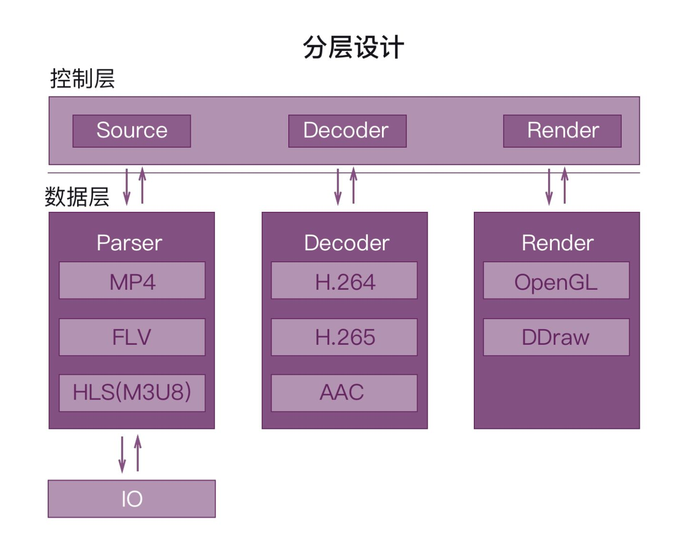
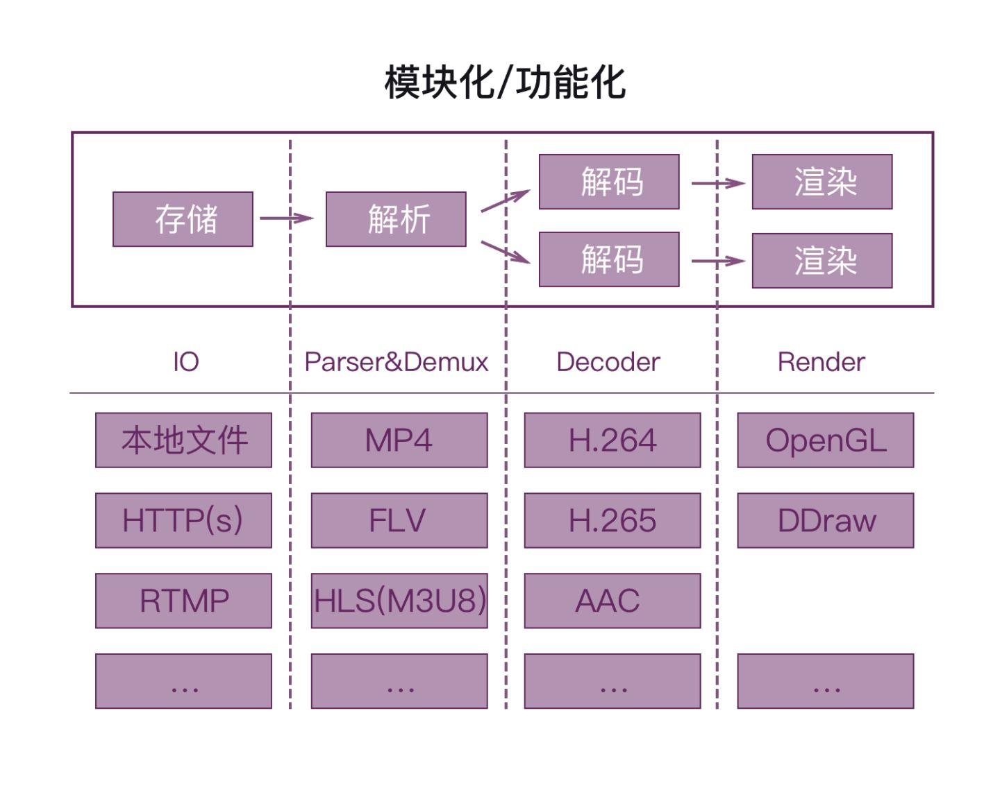
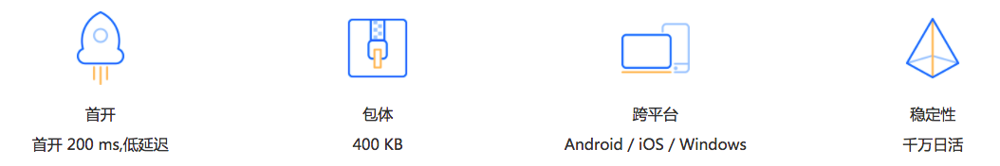
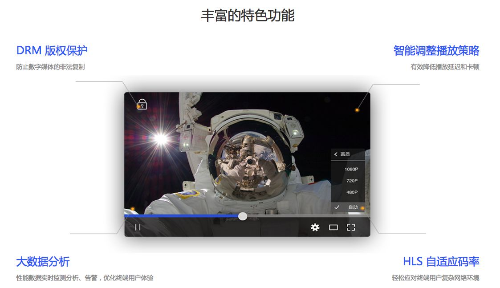
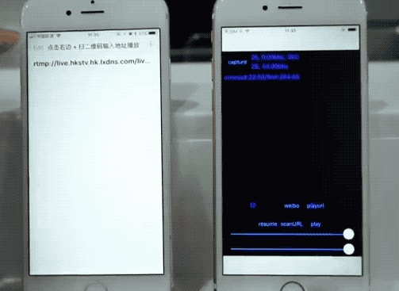
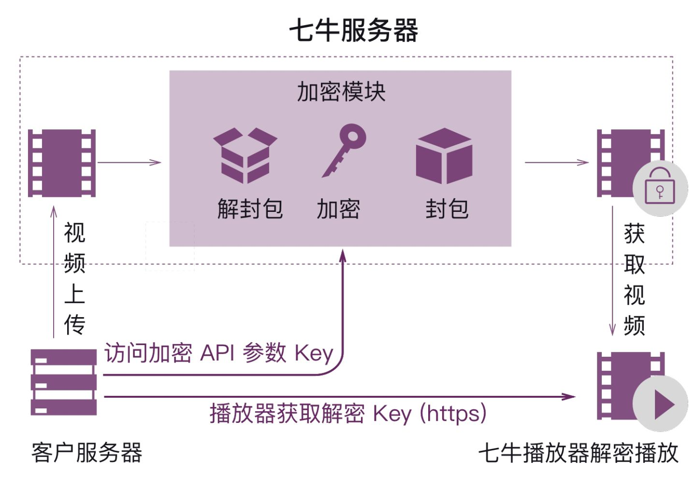
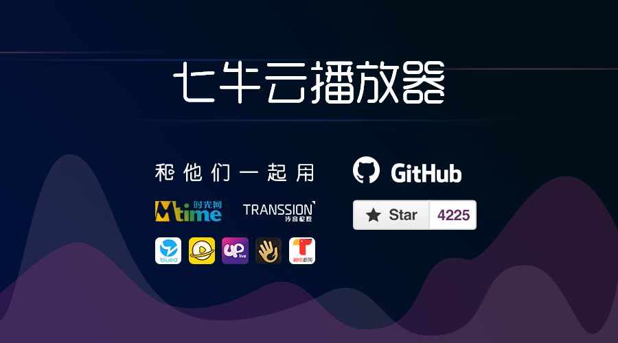

017 年，马克·扎克伯格接受 CNBC 采访时说：「视频是大趋势，未来我们会在视频尤其是短视频上投更多资源。往后五年你会发现，在互联网大家最乐于传播的一定是短视频。」

## 10 秒时代

现在，似乎没人会怀疑这个论点了。Vidyard 最新发布的视频报告更印证了他的论点——短视频更能吸引观众的注意。时长 90 秒以下的视频播放完成率最高（53%），而 30 分钟以上的长视频的完成率只有 10%。

对内容制造者来说残酷的现实是：大部分观众在看视频时只看了前 10 秒。

当观众只有 10 秒钟决定要不要继续看这个视频，播放体验显得尤其重要。如果你的视频首开慢、卡顿，观众还有什么耐心看下去？

## 影响播放体验的核心因素

影响用户播放体验的核心因素有两个方面，第一个方面是：网络传输的质量，第二个方面是：播放器的质量。

网络传输的质量主要影响要素是 CDN 和 本地网络。网络质量问题固然重要，但这主要是云服务商和运营商的优化内容。

播放器是离用户最近的一端，但是在播放器上的技术创新往往最容易被开发者忽略。对有视频播放的产品来说，一个优秀的播放器 SDK 对提升播放体验来说事半功倍。

播放器的质量主要体现在两方面：

1.对媒体文件的解析和渲染的质量和效率

2.功能是否丰富，是否能满足各种应用场景下的需求

一个好的播放器不但要能应对复杂的网络环境，多样的编码算法和封包格式，更需要满足客户不同场景下的业务需求，高效高质量播放视频文件。

## 在播放器上优化用户体验

**优秀播放器的标准**

从最终观众的角度来看，一款优秀播放器应该做到：首开快、不卡顿、功能丰富。

从开发者的角度开看，一款优秀播放器应该做到：跨平台播放器，包体小，更强的兼容性，更丰富的功能、方便二次开发。

**七牛云播放器架构设计思路**

好的架构设计可以让产品的工程更加灵活、可维护、易读。这些特点最终会体现在产品的稳定性、灵活性、易用性上。下面我们来说说七牛现有播放器内核的整体架构。

从上图可以清晰地看到，播放器流程中有诸多功能。这些功能是单独的组件，他们可以像拼装玩具一样，根据业务需要灵活地参与到整个播放过程当中。

如果播放器领域有新技术演进或者新功能需求，可以通过替换上面这些功能模块灵活组合。比如，H.265 编解码技术就可以加入到 Decoder 模块中。七牛云播放器内核架构如下图所示。

换一个角度看同样的过程，我们会发现七牛播放器做了分层设计。所谓分层设计就是控制层和数据层解耦。数据层就像工厂的加工模组，控制层就像总控的流水线。播放器播放过程其实就是一个把数据在不同地方变成另外一种格式的数据，并加以控制的过程。所以我们可以通过数据来驱动各种模块，反过来获得自己需要的格式数据。

## 七牛云播放器特色功能详解

七牛完全自主研发新版跨平台多媒体播放器，可以灵活根据目前市场新兴使用场景做针对性优化。

**毫秒级首开**

我们进行了主流机型在多种环境下的直播流首开测试。测试结果，首开速度控制在 200ms 左右。除了播放器直播流首开速度快以外，在播放点播视频的首开上也做了深度的优化。

**特色功能**

**1.HLS 自适应码率切换播放，轻松应对终端用户复杂网络环境**

单码率视频无法应对客户端网络带宽环境的变化，七牛云播放器支持 HLS 协议，让客户在不同的网络带宽环境下，播放不同码率、分辨率的视频，获得最佳的观看体验。

实现原理：

HLS 的实现原理是把整个多媒体文件切成一个个小的基于 HTTP 的资源(Transport Stream 格式的文件)，生成一个包含元数据的扩展 M3U (M3U8) Playlist 文件，每次只下载列表中的一些资源，客户端根据带宽环境可以选择不同的的资源。M3U8 是一种播放多媒体列表的文件格式，可以指定一个或多个多媒体资源的位置，并且 M3U8 Playlist 中可以包含多个子 M3U8 文件。

**2.独家自研动态追帧播放策略，有效降低播放延时和卡顿**

复杂的网络抖动是直播最大的挑战之一，如果采用常规的丢帧或者追帧策略，用户就会感觉到声调的异样。七牛推出的无感知动态追帧策略可以在有效快速追帧的同时，不改变音频听感，遇到网络状况较差的情况还可以通过调节策略降低卡顿率。

**3.DRM 版权保护，防止数字媒体的非法复制**

Digital Rights Management，DRM 数字版权保护，可以通过一定的安全算法/协议对视频进行加密保护，使得视频在未经授权的条件下即使被非法复制和分发后，也无法正常播放，从而有效地保护了视频资源，阻止了盗版行为。 七牛云 DRM 架构如下图所示。

**4.支持 H.265 播放**

H.265 支持是未来音视频领域的一大趋势，可以帮助客户节省将近 40% 的 CDN 带宽，这些节省的带宽费用全都是企业的利润点。但是 H.265 的解码算法要远远比 H.264 复杂，因此播放器解码 H.265 会有更大的功耗，也对播放器的解码性能提出了更高的要求。目前七牛播放器已经支持 H.265 软解。

**5.支持软硬解自动切换**

所谓软解就是用 CPU 对视频文件进行解码，而硬解是用 GPU 对视频文件进行解码。软解的好处是比较通用，而硬解的好处就是效率比较高。所以如果要优化播放效率的同时还要兼顾兼容性，就要做到以下两点：

1.首先能用 GPU 解码的就尽量用 GPU 去解码，这样就优先做到了高效率;

2.当有些机型的 GPU 不支持对解码视频文件时，又可以自动切回软解，这样也解决了硬解不支持的情况下的兼容问题。

目前七牛的播放器同时具备高效和兼容的特点。

**6、支持本地缓存、边下边播**

我们知道网络传输是有一定抖动的，所以播放在线视频时，播放器一般采取这样的策略：在网好的时候，多下载一点放到播放的一个队列里面暂时存着，网差的时候就可以播放暂存的视频。这样整体在线视频的播放体验就会比较流畅。这个暂时放视频内容的地方就是播放器缓存。

边下边播其实就是：一边下载视频到缓存队列里面，一边直接播放出来。那么本地缓存功能就多了一个步骤，将缓存里面已经播放过的视频存储到本地的一个 storage 里面。

## 总结

2016 年到 2017 年，直播和短视频产品分别崛起，七牛也提供了完善的直播和短视频解决方案。同时七牛的播放器产品推出以来一直非常受市场的欢迎，我们在 Github 上收获了数千 star，运行在诸多知名的应用内。

七牛新版本播放器在原有基础上进行了深度优化，完全自研了播放器的内核。与目前市面上大多数的播放器相比起来，包体更小、首开更快、功能更加丰富、性能也更加出色，并且提供了极其丰富