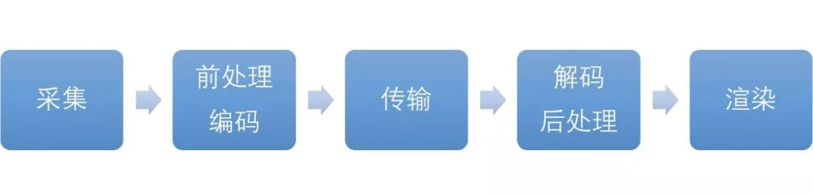
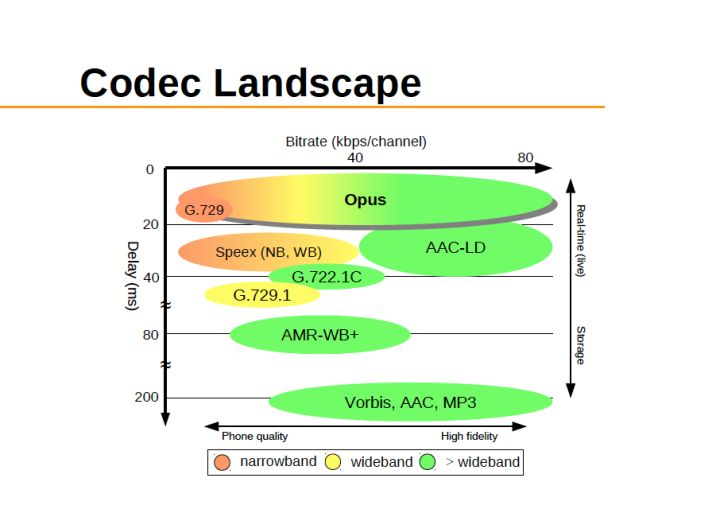
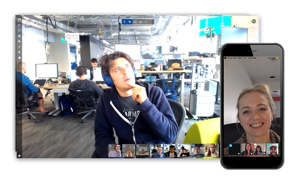

实时音视频的开发学习有很多可以参考的开源项目。一个实时音视频应用共包括几个环节：采集、编码、前后处理、传输、解码、缓冲、渲染等很多环节。每一个细分环节，还有更细分的技术模块。比如，前后处理环节有美颜、滤镜、回声消除、噪声抑制等，采集有麦克风阵列等，编解码有VP8、VP9、H.264、H.265等。

我们今天汇总了一些能帮助到正在学习或进行音视频开发的实时音视频开发者们的开源项目与几个也在为开源社区贡献力量的商业服务。这些项目分为几类：音视频编解码类、视频前后处理、服务端类等。

## **音视频编解码类开源项目**

视频编解码的作用，就是在设备的摄像头采集画面和前处理后，将图像进行压缩，进行数字编码，用于传输。编解码器的优劣基本在于：压缩效率的高低，速度和功耗。

目前，主流的视频编码器分为3个系列：VPx（VP8，VP9），H.26x（H.264，H.265），AVS（AVS1.0，AVS2.0）。VPx系列是由Google开源的视频编解码标准。在保证相同质量情况下，VP9相比VP8码率减少约50%。H.26x系列在硬件支持上比较广泛，H.265的编码效率能比上一代提高了30-50%，但是复杂度和功耗会比上一代大很多，所以纯软件编码实现的话有一定瓶颈，现有的技术下，还是需要依靠硬件编解码为主。AVS是我国具备自主知识产权的第二代信源编码标准，目前已经发展到第二代。

**WebRTC**

首先会用到的肯定是WebRTC，是一个支持网页浏览器进行实时语音对话或视频对话的开源项目。它提供了包括音视频的采集、编解码、网络传输、显示等功能。如果你想基于WebRTC开发实时音视频应用，需要注意，由于WebRTC缺少服务端设计和部署方案，你还需要将WebRTC与Janus等服务端类开源项目结合即可。

官网地址：[WebRTC Home | WebRTC](https://link.zhihu.com/?target=https%3A//webrtc.org/)

**x264**

H.264是目前应用最广的码流标准。x264则是能够产生符合H.264标准的码流的编码器，它可以将视频流编码为H.264、MPEG-4 AVC格式。它提供了命令行接口与API，前者被用于一些图形用户接口例如Straxrip、MeGUI，后者则被FFmpeg、Handbrake等调用。当然，既然有x264，就有对应HEVC/H.265的x265。

官网地址：[x264, the best H.264/AVC encoder](https://link.zhihu.com/?target=https%3A//www.videolan.org/developers/x264.html)

**FFmpeg**

FFmpeg大家应该不陌生，提供了编码、解码、转换、封装等功能，以及剪裁、缩放、色域等后期处理，支持几乎目前所有音视频编码标准（由于格式众多，我们就不一一列列举了，可以在Wikipedia中找到）。

同时，FFmpeg还衍生出了libav项目，从中诞生了视频解码器LAV，许多播放软件都可调用LAV进行解码，并且LAV本身也支持利用显卡进行视频硬解。很多主流视频播放器中都以FFmpeg作为内核播放器。不仅仅是视频播放器，就连Chrome这类可以播放网页视频的浏览器也受益于FFmpeg。很多开发者也基于FFmpeg做过很多开发并开源出来，比如大神雷霄骅（代码可见他的sourceforge）。

官网地址：[FFmpeg](https://link.zhihu.com/?target=http%3A//ffmpeg.org/)

**ijkplayer**

在介绍ijkplayer之前，要先提到ffplay。ffplay是一个使用了FFmpeg和sdl库的可移植的媒体播放器。ijkplay是Bilibili开源的基于ffplay.c实现的轻量级iOS/Android视频播放器，API易于集成，且编译配置可裁剪，利于控制安装包大小。

在编解码方面，ijkplayer支持视频软解和硬解，可以在播放前配置，但在播放过程中则不能切换。iOS和Android上视频硬解可分别使用大家熟悉的VideoToolbox和MediaCodec。但ijkplayer对音频仅支持软解。

Github地址：[https://github.com/Bilibili/ijkplayer](https://link.zhihu.com/?target=https%3A//github.com/Bilibili/ijkplayer)

**JSMpeg**

JSMpeg是一个基于JavaScript的MPEG1视频的解码器。如果要做H5端的视频直播，可以考虑使用JSMpeg在移动端进行解码。在H5端做音视频直播，可以使用JSMpeg进行视频解码，这也是最近比较火的H5抓娃娃的主流策略。

Github地址：[https://github.com/phoboslab/jsmpeg](https://link.zhihu.com/?target=https%3A//github.com/phoboslab/jsmpeg)

**Opus音频编码器**

Opus是用C语言开发的一个高灵活度的音频编码器，针对ARM、x86有特殊优化，fix-point实现。Opus在各方面都有着明显优势。它同时支持语音与音乐的编码，比特率为6k-510k。它融合了SILK编码方法和CELT编码方法。SILK原本被用于Skype中，基于语音信号的线性预测分析（LPC），对音乐支持并不好。而CELT尽管适用于全带宽音频，但对低比特率语音的编码效率不高，所以两者在Opus中形成了互补。

图片源自Wikipedia

Opus是“取代”了Speex。但是Speex中有的功能，Opus却没有，比如回声消除。这个功能已经从编码器中独立出来。所以如果想实现好的回声消除，可以配合WebRTC的AEC和AECM模块做二次开发。

官网地址：[Opus Codec](https://link.zhihu.com/?target=https%3A//opus-codec.org/)

**live555**

live555是一个C++流媒体开源项目，其中不仅包括了传输协议（SIP、RTP）、音视频编码器（H.264、MPEG4）等，还包括流媒体服务器的例子，是流媒体项目的首选，里面的传输模块是非常值得视频会议开发作为参考的。

官网地址：[http://www.live555.com/](https://link.zhihu.com/?target=http%3A//www.live555.com/)

## **音视频前后处理开源项目**

前后处理包含很多细分技术，应用正确的话，对视频质量或多或少都有提升。不过每增加一个处理环节，必然会增加运算量与延时，所以如何取舍，还要大家各自斟酌。

**Seetaface**

Seetaface是由中科院山世光老师开源的一套完整的人脸检测，人脸对齐和人脸验证方案。代码基于C++实现，开源协议为BSD-2，可供学术界和工业界免费使用。且不依赖于任何第三方的库函数，在使用对齐好的LFW图片上，检测对齐全部使用该开源软件的情况下可达到97.1%。

Github地址：[seetaface/SeetaFaceEngine](https://link.zhihu.com/?target=https%3A//github.com/seetaface/SeetaFaceEngine)

**GPUImage**

现在在iOS端做美颜效果、加水印，基本都会采用GPUImage，它内置了125种渲染效果, 还支持脚本自定义。该项目实现了图片滤镜、摄像头实时滤镜。它优势在于处理效果是基于GPU实现，相对于CPU处理性能更高。

Github地址：[https://github.com/BradLarson/GPUImage](https://link.zhihu.com/?target=https%3A//github.com/BradLarson/GPUImage)

**Open nsfw model**

Open nsfw model是雅虎开源项目，全名是Open Not suitable for work model，专门鉴别不适合工作时间浏览的图片（言而言之就是小黄图）。它是基于Caffe框架训练的模型，用于音视频后处理。不过，它还不能鉴别恐怖、血腥图片。

Github地址：[https://github.com/yahoo/open_nsfw](https://link.zhihu.com/?target=https%3A//github.com/yahoo/open_nsfw)

**Soundtouch**

Soundtouch是一个开源的音频处理框架，主要功能对音频变速、变调，实现变声的效果。同时，它也能对媒体流实时处理。采用32位浮点或者16位定点，支持单声道或者双声道，采样率范围为8k - 48k。

官网地址：[SoundTouch Sound Processing Library](https://link.zhihu.com/?target=http%3A//www.surina.net/soundtouch/)

## **服务端类开源项目**

正如开始时我们所说，WebRTC缺少服务端的设计与部署，利用MCU、SFU实现多人聊天，提高传输质量，都需要开发者自己动手。而下面这些开源项目能够帮到你。

**Jitsi**

Jitsi是开源的视频会议系统，可以实现在线视频会议，文档共享和即时消息的分享。它支持网络视频会议，使用SFU模式实现视频路由器功能。开发语言是Java。它支持SIP帐号注册电话呼叫。不仅支持单机本地安装方式，还支持云平台安装。

官网地址：[https://jitsi.org/](https://link.zhihu.com/?target=https%3A//jitsi.org/)[Jitsi |jitsi.org](https://link.zhihu.com/?target=https%3A//jitsi.org/)官网地址：[https://jitsi.org/](https://link.zhihu.com/?target=https%3A//jitsi.org/)

**JsSIP**

JsSIP是基于WebRTC的JavaScript SIP协议实现的库，可以在浏览器和Node.js中运行。它可以与 OverSIP、Kamailio、Asterisk、OfficeSIP等SIP Server一起运行。

Github地址：[https://github.com/versatica/JsSIP](https://link.zhihu.com/?target=https%3A//github.com/versatica/JsSIP)

**SRS**

SRS是一个采用MIT协议授权的国产的简单的RTMP/HLS 直播服务器。最新版还支持FLV模式，同时具备了RTMP的实时性，以及HLS中属于HTTP协议对各种网络环境高度适应性，并且支持更多播放器。它的功能与nginx-rtmp-module类似, 可以实现RTMP/HLS的分发。

Github地址：[https://github.com/ossrs/srs](https://link.zhihu.com/?target=https%3A//github.com/ossrs/srs)

**JRTPLIB**

JRTPLIB 是一个开源的 RTP协议实现库，支持Windows和unix平台。它支持多线程，处理性能较好。它还支持RFC3550、UDP IPV6，支持自定义扩展传输协议。但它不支持TCP传输，这需要开发者自己来实现。同时，它也不支持音视频的分包，代码要你自己来实现。

Github地址：[https://github.com/j0r1/JRTPLIB](https://link.zhihu.com/?target=https%3A//github.com/j0r1/JRTPLIB)

**OPAL**

OPAL是OpenH323的下一个版本，继承了Openh323协议，其新包含了SIP协议栈，是实现SIP协议的首选，缺点是参考例子较少。

代码地址：[http://sourceforge.net/projects/opalvoip/files/](https://link.zhihu.com/?target=http%3A//sourceforge.net/projects/opalvoip/files/)

**Kurento**

Kurento是一个基于WebRTC的媒体服务端，并包含了一系列API，可以简化web与移动端实时视频应用的开发。

Github地址：[https://github.com/Kurento](https://link.zhihu.com/?target=https%3A//github.com/Kurento)

**Janus**

Janus是一个WebRTC媒体网关。不论是做流媒体、视频会议、录制、网关，都可以基于Janus来实现。

Github地址：[https://github.com/Kurento](https://link.zhihu.com/?target=https%3A//github.com/Kurento)

## **其它服务**

**[http://Callstats.io](https://link.zhihu.com/?target=http%3A//Callstats.io)**

实时通信过程中的，延时、丢包、接通率、掉线率等质量问题，都影响用户体验。商用项目尤其需要关注。Callstats是一家通过对WebRTC呼叫进行专业监测，来帮助用户搜集通讯数据，提升通话质量的服务商。

Callstats也通过Github开放很多案例，可供使用Jitsi-videobridge,、turn-server、JsSIP的开发者参考。

Github地址：[https://github.com/callstats-io](https://link.zhihu.com/?target=https%3A//github.com/callstats-io)

**Meetecho**

Meetecho是著名的开源WebRTC网关项目Janus的开发者。他们还提供基于Janus开发的技术咨询与部署服务、建立视频会议直播与录制服务等。

Github地址：[https://github.com/carlhuda/janus](https://link.zhihu.com/?target=https%3A//github.com/carlhuda/janus)

**声网Agora**

声网提供了从编解码到端到端传输的全套服务，开发者可以接入上文所述的音视频前后处理的开源项目，配合使用声网SDK可以建立高质量的实时音视频应用。四行代码，30分钟即可让完成集成。在Web端，Agora Web SDK可以帮助WebRTC开发者解决服务端传输中会遇到的卡顿、延时、回声、多人视频不稳定等问题。

同时，声网在Github上也有70多个可供开发者参考、实践的demo，覆盖了从网页端、iOS到Android平台，以及音视频直播、游戏连麦、企业会议、AR、直播答题、小程序等多种实时互动应用场景。

官网地址：[https://Agora.io](https://link.zhihu.com/?target=https%3A//Agora.io)

Github地址：[https://github.com/AgoraIO](https://link.zhihu.com/?target=https%3A//github.com/AgoraIO)

我们在这里列出了18个开源项目，以及3个能有效保证实时音视频传输质量的服务。不过篇幅有限，还有很多开源项目我们没有详细列出，比如在音视频方面，[http://Xiph.org](https://link.zhihu.com/?target=http%3A//Xiph.org)的Speex、FLAC，还有Xvid、libvpx、Lagarith、Daala、Thor等。欢迎大家补充。