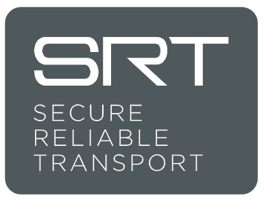
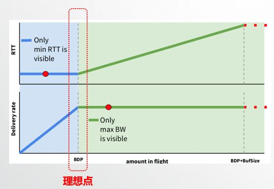
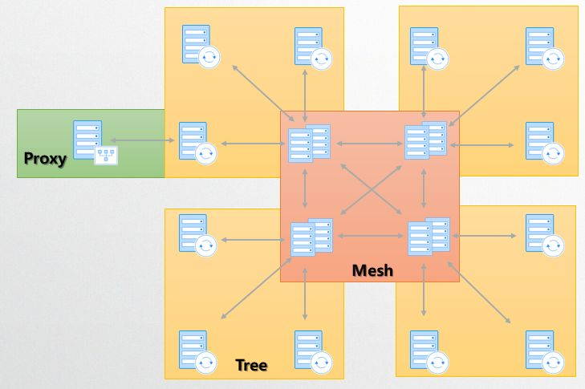

> 本文整理自网易云信多媒体资深技术架构师吴桐在 QCon 全球软件开发大会上海站的演讲内容《超高清4K视频低延时直播与RTC融合架构设计》，为该系列的第二篇文章。
> 回顾该系列第一篇文章[《超高清4K视频低延时直播与RTC融合架构设计①：5G与未来的网络格局》](https://zhuanlan.zhihu.com/p/87952462)。
> 本篇文章中，吴桐从传输协议、拥塞控制算法的选择说起，分享了网易云信对于BBR算法在低延时直播与RTC场景下的优化实践，以及网易云信低延时拓扑的设计方案。

关注“网易云信”公众号，回复“知乎”，获取2019技术干货合集>>>

[免费试用](https://link.zhihu.com/?target=https%3A//yunxin.163.com/netcall/%3Ffrom%3Dzhihu%26utm_source%3Dzhihu%26utm_medium%3Darticle%26utm_content%3D191121)网易云信音视频产品>>>>

直播火了，这是近几年大家最直观的感受。从2015年开始，各个平台风起云涌、百家齐放，到2016、2017年，大家开始寻求互动连麦直播的差异化体验。如今，直播已经进入下半场，低延时直播成为了新的突破口。

相信很多人都看过《疯狂动物城》，闪电虽然非常可爱，但是谁都不希望直播里的女主播，反应像他这么慢吧。

那么低延时由哪些因素决定呢?

（1）传输维度

- 传输协议
- 拥塞控制算法
- 服务器分发网络
- 第1公里：分配与选路

（2）其它维度

- 发送端采集、编码、前处理延时
- 接收端Jitterbuffer处理延时
- 接收端解码、后处理、渲染与播放延时

今天由于时间关系，我们主要来探讨一下传输维度的决定因素。

## **传输协议的选择**

首先我们来看看传输协议的选择。

**1. RTMP协议**

RTMP协议是当前应用最广泛的直播推拉流协议，标准的RTMP协议传输层使用的是TCP，所以它的缺陷也是显而易见的：

（1）抗丢包能力差，丢包时发送窗口直接退避导致发送速率很慢；

（2）整体延时不可控，主要依赖于接收端的ACK的可靠传输；

（3）拥塞控制优化成本高，TCP算法拥塞控制策略是在操作系统内核层实现的，想要优化的成本很高，一般只有在服务端做内核层面TCP拥塞控制的相关优化，而客户端只能依赖各平台的操作系统自己做的拥塞控制优化。

综上，标准的RTMP不适用于低延时场景。

**2. QUIC协议**

想必大家对QUIC（Quick UDP Internet Connection）也不陌生，这两年随着大家对Google QUIC协议研究的深入，不少友商和项目开始用RTMP over QUIC替代传统的RTMP over TCP。

QUIC是一个非常优秀的协议，现在它已经成为HTTP3的标准协议。它的优势大家应该也都有所了解：

（1）0 RTT连接。QUIC底层使用了UDP，所以它可以非常灵活的重新设计一些协议特性，包括可以在首次以1RTT握手建连后，后续握手重连只需0RTT；

（2）支持HTTP2一样的多路复用，同时由于使用UDP协议，所以也解决了队头阻塞问题；

（3）支持FEC，所以相比于TCP抗丢包能力也有所提升；

（4）因为是应用层协议，它可以很灵活的改进拥塞控制，各类拥塞控制算法都可以以可插拔的模式在QUIC中使用。

综上，QUIC很优秀，但是我认为，QUIC作为低延时直播协议也有几点缺陷：

（1）本质上是一个可靠协议，我们没办法方便的主动控制协议延时；

（2）作为一种通用协议，对音视频媒体不友好，没办法理解音视频媒体数据的具体含义，它以一视同仁的角度来对待这些媒体数据。

**3. SRT协议**

这两年还有一个传输协议进入大家视野，那就是SRT（Secure Reliable Transport）。它由Haivision 和 Wowza共同创建，并于2017开源。它具备以下特点：

- 安全方面：SRT支持AES加密，保障端到端的视频传输安全;
- 可靠性方面：SRT通过前向纠正技术(FEC)保证传输的稳定性;
- 低延迟方面：SRT底层使用UDT协议，UDT协议是一个老牌的基于UDP的可靠传输协议，当然原生的UDT传输延迟是比较高的，SRT在此基础上做了不少的拥塞控制策略的相关优化以降低传输延时。

SRT协议当前还相对小众，我们没有选择它作为我们的传输协议主要原因有两个：

（1）协议复杂度较高；

（2）丢包场景下速度退避较大。

**4. 自研低延时传输协议**

其实无论是QUIC还是SRT，他们的设计有很多共性：

（1）他们都采用了基于UDP的底层传输协议，我认为这是一个非常正确的方向；

（2）他们都采用了FEC来提高抗丢包能力；

（3）他们都重新设计了拥塞算法来实现更准确的带宽估计、拥塞判断以降低传输延时。

因此我们的选择是：基于UDP协议，自研低延时传输协议，同时应用在低延时直播和RTC场景。

在这里和大家分享我们设计这个协议的主要特征：

（1）协议中支持描述每个包对可靠性以及优先级的不同要求，这样我们在传输的全链路上就可以区分不同可靠性和优先级的数据包做差异化处理；

（2）协议完全面向音视频媒体，可以方便描述各类音视频媒体类型，无论是H.264、H.265、VP8、VP9或者是AV1、VVC都可以直接在协议中描述；

（3）协议支持描述视频分片信息、视频时域分层信息及多流信息，这些信息用于服务器做相关分段QoS策略，以及在接收端更方便的完成视频组包；

（4）支持传输层全局统一序，简化feedback的处理，同时对丢包计算，抖动计算都非常有意义；

（5）支持FEC，特别在高RTT的场景下（如：跨国传输），FEC的合理使用对于抗击随机丢包的意义十分巨大；

（6）协议包在应用层小于MTU切片，这对于对抗丢包以及中间路由非常有意义；

（7）支持扩展丰富的媒体信息，无论是时间戳，视频旋转角度，音频音量等等，这些信息我们部分参考了RTP的设计，当然也简化了RTP的设计；

（8）协议支持携带应用层路由信息，这个对于实现方便的服务器级联以及边缘加速很有意义。

其实RTP已经是一个非常优秀的媒体传输协议了，我们设计协议的目的是在云信的场景及服务器架构下可以更方便地使用，如果大家没有特殊的需求，可以直接使用RTP协议，使用RTP Extension来实现其它相对复杂功能。

在谈好了协议后，我们进入下一步，就是如何选择一个拥塞控制算法。

## **拥塞控制算法选择**

拥塞控制算法在音视频领域一直都是一个热门话题，而且也是业界一直在不停探索的一个方向。

**1. TCP拥塞控制算法**

TCP协议里，从最早的Reno、BIO到现在广泛使用的Cubic算法，都有非常巧妙的算法和数学原理，由于他们是基于丢包的，所以此类拥塞控制算法对于丢包过于敏感，同时延时不可控，因此无法用于低延时传输。

**2. GCC**

GCC算法是大家普遍使用的一个RTC里的拥塞控制算法，它也是开源WebRTC当前默认使用的，算法是主要基于时延+丢包，核心模块有三个：

（1）到达时间滤波器；

（2）过载检查器；

（3）速率控制器。

GCC算法这几年也在不断的更新迭代，早期带宽在接收端估计，发送端在媒体包头上需要携带abs-sendtime，接收端采用的是卡尔曼滤波器，估算出带宽后用REMB协议带回发送端；后来带宽估计在发送端来做，发送端在媒体包头上需要携带统一序transport-sequence-number，然后接收端将收包信息，主要包括收包时间等使用transportCC报文带回发送端，在发送端采用线性滤波器进行相关带宽估计。

因为GCC算法在业界比较成熟，这里我就不多做介绍，简单分享一下我们在实践的过程中发现的几个问题：

（1）带宽估计不够准确，特别是低带宽时会过降；

（2）与TCP竞争会过度退避；

（3）在时延抖动场景，带宽波动大。

当然这些问题，随着GCC的持续优化有些会逐渐被优化，但是有些问题却是在GCC框架下无法解决的。后来，我们关注到了BBR。

**3. BBR**

BBR（Bottleneck Bandwidth and Round-trip propagation time）是2016年由谷歌提出并推广的，BBR算法是基于带宽和延迟反馈的算法。BBR算法有很多优点，我认为其中最核心的三点是：

（1）算法思想是尽量不排队，保持低延迟；

（2）带宽估计准确；

（3）在多数场景下与传统TCP基于丢包的拥塞控制算法竞争，不吃亏。

网易云信从2018年开始，在项目中使用BBR，并进行了BBR在低延时领域的相关优化，今天想和大家简单谈谈BBR算法在低延时直播与RTC领域的一些使用心得。

## **BBR在低延时直播与RTC场景下的应用**

BBR算法的核心就是找到当前链路的最大带宽和最小延时。最大带宽和最小延时的乘积就是BDP， BDP就是网络链路中可以存放数据的最大容量。知道了BDP就可以解决应该发送多少数据的问题，而网络最大带宽可以解决用多大速度发送的问题。因此BBR也就是解决了该不该发，以及发多快这两件事。

我们来看一张很经典的图，图片来自BBR作者的分享内容，图中横轴是网络链路中的数据量，纵轴分别是RTT和带宽。可以发现在RTT不变的时候，带宽一直在上升，因为这个时候网络没有拥塞，而带宽停止上涨的时候RTT持续变大，一直到发生丢包。因为这个时候，网络开始拥塞，报文累积在路由器的buffer中，这样RTT持续变大，而带宽不会变大。

图中红色虚线框所标识的就是理想情况下最大带宽和最小延时。很明显，要找到BDP, 很难在同一时刻找到最小的RTT和最大带宽。这样最小RTT和最大带宽必须分别探测。

探测最大带宽的方法就是不断增加发送的数据量，把网络中的buffer占满，直到带宽在一段时间内不会增加，这样可以得到此时的最大带宽。

探测最小RTT的方法就是尽量把buffer排空，让数据传输延时尽量低。

BBR的状态机分为4个阶段，Startup，Drain，ProbeBW， ProbeRTT。

- **Startup**

Startup类似于普通拥塞控制里的慢启动，增益系数是 2/ln2 = 2.88，每一个来回都以这个系数增大发包速率，估测到带宽满了就进入 Drain状态，连续三个来回，测得的最大带宽没有比上一轮增大25%以上，进入Drain状态机。

- **Drain**

进入 Drain状态，增益系数ln2/2小于 0.3，也就降速了。一个包来回，把 Startup状态中超发的数据排空，怎样才算队列排空了？发出去还没有 ACK 的数据包量即为 inflight，inflight < BDP 说明排空了，如果 inflght > BDP 说明还不能到下一个状态，继续保持 Drain状态。

- **ProbeBW**

ProbeBW是稳定状态，这时已经测出来一个最大瓶颈带宽，而且尽量不会产生排队。之后的每个来回，在 ProbeBW状态循环（除非要进入下面提到的 ProbeRTT状态），轮询下面这些增益系数，[1.25, 0.75, 1, 1, 1, 1, 1, 1]，如此，最大瓶颈带宽就会在其停止增长的地方上下徘徊。98%的时间都应该处于 ProbeBW状态。

- **ProbeRTT**

前面三种状态，都可能进入 ProbeRTT状态。超过十秒没有估测到更小的 RTT 值，这时进入 ProbeRTT状态，把发包量降低，空出道路来比较准确得测一个 RTT 值，至少 200ms 或一个包的来回之后退出这个状态。检查带宽是否是满的，进入不同的状态：如果不满，进入 Startup状态，如果满，进入 ProbeBW状态。

**BBR有很多优点，但是在低延时直播与RTC场景下应用，的确也存在问题：**

（1）收敛速度慢；

（2）抗丢包能力不足，原版算法超过20%丢包，带宽断崖式下降；

（3）ProbeRTT只发4个包，不适合低延时流媒体应用。

**如何解决这些问题？**

（1）收敛速度慢

- 方法一：BBR V2提出在ProbeBw的0.75x周期一次排空到位；
- 方法二：随机化6个1x平稳发送周期，缩短排空需要的时间。

（2）抗丢包能力不足：把非拥塞丢包率补偿到ProbeBw的各个周期内，可以有效提升抗丢包能力。

（3）ProbeRTT只发4个包：BBR V2 把probe rtt缩短到2.5s一次，另外使用0.5xBDP发送。

通过上面的优化，我们看一下**BBR与GCC的效果对比：**

第一个场景是带宽限制300K，一段时间后取消限制，可以发现：

（1）BBR比GCC的带宽估计更加准确（GCC：250K, BBR：300K）；

（2）带宽限制取消后，GCC需要20s以上回复到最大带宽，BBR仅需要2s恢复带最大带宽。

第二个场景是带宽限制2.5Mbps，200ms Delay，200ms Jitter，可以发现GCC带宽探测只有300K，BBR带宽维持在2.5M附近波动。

## **服务器分发网络**

我们接下来聊聊低延时直播的服务器分发网络。

传统CDN的分发网络一般是一个树型结构或者是树型结构的变体，这个结构扩展性很强，可以方便的接纳海量用户。但是这个结构在低延时或者RTC的场景也存在缺陷：

（1）在上行数据的用户越来越多后，顶层节点容易成为系统的瓶颈和单点；

（2）树的深度越大，媒体数据的端到端延迟就会越大，所以基于传统CDN的直播延迟至少在3~4秒以上。

接下来看看**网易云信是怎么设计低延时拓扑方案的？**

从整体上来看，我们采用的是一个混合架构，也就是Mesh网状拓扑+树型拓扑+代理加速的融合架构。

整个拓扑的中心是一个网状两两互联的核心路由转发网络，采用这种拓扑设计中心可以保证中心稳定和高可用，降低中心节点间数据路由的复杂度，同时保证中心数据传输的低时延。

而在中心网状拓扑的外侧，我们采用一个2层的树，来保证边缘的扩展性，同时保证用户的最近接入。这个2层的树根不是固定的，如果当前叶子节点的树根发生宕机了，它们可以自动接到其它网状拓扑的节点下，来保证高可用。

而代理节点的存在则是为解决某些特殊场景，比如某些叶子节点没有小运营商的接入能力的时候，就可以使用这个代理加速节点接入，代理加速节点与叶子节点最大的差异是，对于机器资源的需求不同。代理节点是一个无状态对业务不可见的纯加速节点，是完全根据我们的传输协议定制的一个高性能服务器。

我们一般会选择BGP机房作为Mesh节点，而选择单线机房作为树型的叶子节点。因为单线机房的费用往往数倍便宜于BGP机房。所以在选择用户接入的节点时，以及选择用哪些机器构成整个网络拓扑时，我们既要考虑用户到节点的接入效果，节点间的网络情况，也要关注费用，需要做好效果和费用的平衡，产品才能持久。通过这样一种架构设计，我们既保证了框架的水平扩展，也控制了延时，同时让拓扑中的机器没有单点问题。

## **第1公里：分配与选路**

所谓的第1公里，就是我们的调度中心如何为客户端分配接入节点。

首先会采用就近原则、运营商匹配原则和负载均衡原则，为用户选出理论最佳的多个节点；其中就近原则和运营商匹配原则的规则，会定期由真实客户端上报的连接情况数据（丢包、时延和卡顿数据）触发做出优先级调整。

用户拿到分配列表后，在客户端本地会开始对各节点做一个快速的测速，选择出本次的最佳节点，去接入。其它节点会作为Failover时快速接入的选择。

采用这种策略，我们做到了理论分配、大数据分析与实际测速相结合，并保证了服务器不可用时的，用户快速连接恢复。

以上是关于直播与RTC低延时方案的分享内容，敬请期待该系列第三篇文章《超高清4K视频低延时直播与RTC融合架构设计③：直播与RTC融合架构设计》。欢迎留言评论，与吴桐老师一对一交流。

关注“网易云信”公众号，回复“知乎”，获取2019技术干货合集>>>

[免费试用](https://link.zhihu.com/?target=https%3A//yunxin.163.com/netcall/%3Ffrom%3Dzhihu%26utm_source%3Dzhihu%26utm_medium%3Darticle%26utm_content%3D191121)网易云信音视频产品>>>>

邀请好友使用网易云信，好友下单成功即可获得1000元网易考拉/严选无门槛现金券，[点击立即推荐](https://link.zhihu.com/?target=https%3A//hubble.netease.com/sl/aaacQz)>>

了解[网易云信](https://link.zhihu.com/?target=https%3A//yunxin.163.com/%3Ffrom%3Dzhihu%26utm_source%3Dzhihu%26utm_medium%3Darticle%26utm_content%3D191121)，来自网易核心架构的通信与视频云服务>>

------

网易云信（NeteaseYunXin）是集网易19年IM以及音视频技术打造的PaaS服务产品，来自网易核心技术架构的通信与视频云服务，稳定易用且功能全面，致力于提供全球领先的技术能力和场景化解决方案。开发者通过集成客户端SDK和云端OPEN API，即可快速实现包含IM、音视频通话、直播、点播、互动白板、短信等功能。

编辑于 04-02