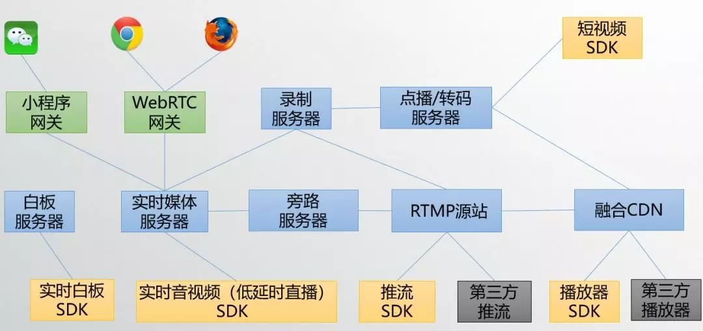
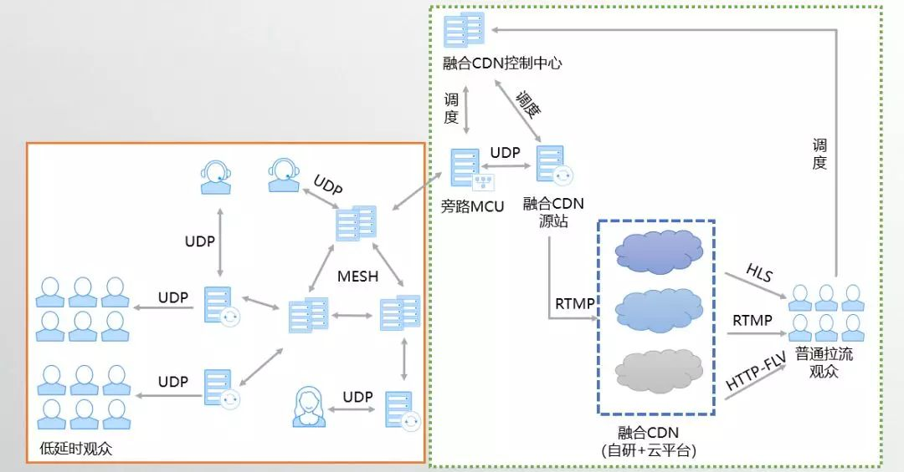
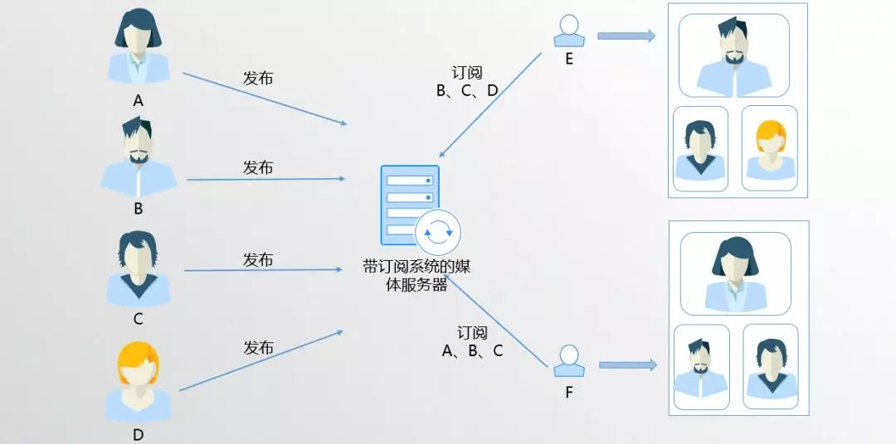
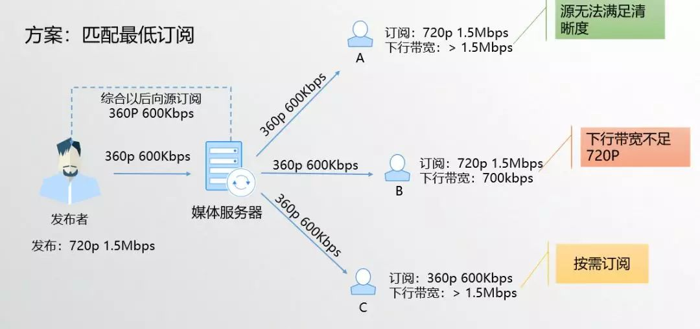
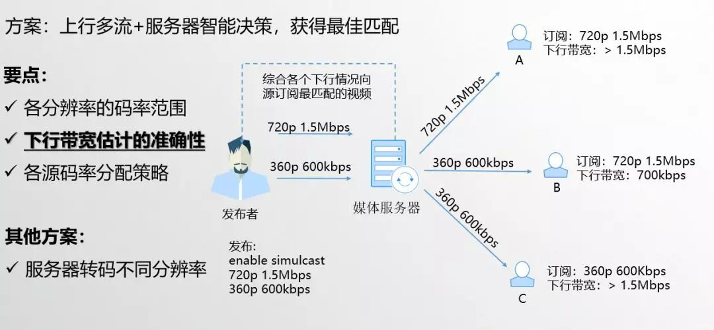

## **网易云信NRTC融合架构**

NRTC是NetEase Real-Time Communication的简写，是网易云信自主设计研发的全功能工业级音视频技术框架，它可提供以下功能：

（1）NRTC提供实时音视频与低延时直播功能，这一方案是基于UDP的，低时延流畅，这一能力可以用于音视频交友、在线教学、多人视频会议等多种场景；

（2）NRTC同时也提供传统直播功能，这一方案是基于TCP的，可以提供高品质的直播能力，这一能力可以用于秀场直播、游戏直播、大班教学等场景；

（3）NRTC也可以将（1）和（2）的能力结合，提供旁路直播功能，通过上麦下麦控制用户在连麦和观众模式间切换；

（4）NRTC提供点播与转码功能，通过融合CDN实现海量分发；

（5）NRTC提供短视频功能，提供了短视频SDK；

（6）NRTC同时使用小程序网关和WebRTC网关来接入微信小程序音视频和WebRTC。

综上，NRTC能够提供的能力是非常全的，相关的功能也非常成熟稳定，NRTC支撑了网易内外部各个客户的海量应用，譬如网易云音乐、网易新闻、有道、云课堂等等。

那么我们是如何将低延时与CDN分发网络结合的？

低延时部分无论是否有上行数据，都采用UDP协议接入我们上面提到的低延时网络中，由低延时分发网络来保证所有参与方的低延时体验，如果需要和CDN分发网络融合，会由其中的一个Mesh节点，将所有上行数据发送给旁路MCU服务器，旁路MCU服务器会向融合CDN控制中心请求调度融合CDN源站节点，旁路MCU服务器做音频与视频的混合后，转发给我们的融合CDN源站，由融合CDN源站根据融合CDN的配置情况向一个或者多个CDN推流。

用户可以根据自己的需求以及对费用情况，选择定制是否要旁路到CDN，选择融合CDN情况。

## **RTC视频会议场景优化**

在融合架构的最后，我想和大家就RTC视频会议场景做一些交流。

RTC视频会议场景的需求和复杂度比单向直播要大的多，视频会议中各个终端的观看需求不同、网络情况也各不相同。因此为了做好视频会议，我们需要有一个完善的发布订阅系统，同时配合好服务端的智能选择，这依赖于服务器上的一套智能码率分配以及码流选择算法；另一个核心功能是要实现服务器的分段QoS，所谓分段QoS就是在服务器上需要分别针对用户到服务器的上行链路和服务器到用户的下行链路做好QoS保障，当然对于服务器来说核心是要做好下行的带宽估计、拥塞控制和丢包对抗。

一套发布订阅系统的基础功能，其实很好理解。

有A、B、C、D、E、F，每个人都可以发布自己的视频，这些发布消息会在媒体服务器上做汇总，然后分发给每一个与会者。如图E选择订阅B/C/D，那么媒体服务器就会根据E的订阅请求将B/C/D的媒体包转发给E，同理F可以做出不同订阅，他订阅A/B/C，那媒体服务器就只会将A/B/C三个用户的媒体包转发给F。

这就是订阅系统的基础功能，满足不同用户的不同需求。有了订阅系统，我们就可以继续来看看一些进阶用户需求。

我们知道每个参会用户对于不同人的清晰度需求是不同的，同时每个用户的网络的下行带宽是不同的。举个例子，发布者发布了最大能力是720p 1.5Mbps，用户A下行带宽大于1.5Mbps，他在界面上需要看发布者的大画面，所以他订阅720p 1.5Mbps；用户B的下行带宽只有700Kbps，他在界面上也需要看发布者的大画面，所以他也订阅的是720p 1.5Mbps；用户C的下行带宽 大于 1.5Mbps，但是他由于界面上只需要发布者的一个小画面，因此他只需要订阅发布者的360p 600Kbps。

此时A/B/C的订阅请求到达服务器后，服务器综合：发布、订阅以及下行带宽估计三个因素，发现无法得到最优分配以满足和匹配所有人需求，有一种可行做法是匹配最低订阅，这样所有人都看到的是360p 600Kbps的视频。这时候对A来说，他看到发布者的画面就会不清晰，但是他的下行带宽其实足够的。为了解决这个问题，当前的方案已经无法满足了，需要引入新的能力。

为了解决这个问题，我们提出多流的方案，也就是让发布者发送多条流给服务器，关于多流业界有一个专有名词叫simulcast。发布者开启多流能力，服务器通过智能决策，可以获得最佳匹配。

这个方案的要点是，服务器需要有各个分辨率的码率范围，同时下行带宽需要估计准确，在服务器上根据各个下行的带宽和用户的具体订阅需求进行分配。同时服务器需要兼容上行网络变差时，发布者将多流切为单流的情况，此时在传输协议设计时需要考虑如何可以方便服务器做出正常的选路，这也是我们前面谈到的传输协议需要可以描述多流能力的原因。

那是否还有其它方案呢？当然有。

我们还可以保持发布者一路流上行，如果发布者上行是高分辨率，只需要按照下行用户的需求，转码出所需的分辨率即可；而如果发布者上行的是低分辨率，对于订阅他高分辨率的下行用户，可以采用“超分”方案（下文有简要介绍）。但是无论是转码还是超分，对服务器的性能负载要求都不小，因此需要谨慎选择，毕竟所有方案都要考虑性价比。

## **进阶与展望**

- **窄带高清与超分**

所谓窄带高清，其实就是传输低带宽，观看高清视觉。

不让马儿吃草，还让马儿跑，你们觉得有这么便宜的事吗？还真有，所以说科学技术才是第一生产力。

由深度学习发展，人工神经网络可以做到将低分辨率超分为高分辨率。我们在工程中采用ESPCN网络做的超分Demo在旗舰机型上已经可以实现540p->1080p的超分。不过由于低分辨率的意义不大，而高分辨率对性能要求实在是很高，所以我们暂时没有将这个功能做上线。

我认为当前超分技术还是更适合用于点播场景，而实时或者低延时场景还不适用，当然随着机器性能和算法性能提高，未来还是可期的。

- **基于机器学习的拥塞控制-PCC**

这个演讲中，我们谈了很多拥塞控制（回顾[《低延时直播与RTC融合架构设计②：](https://link.zhihu.com/?target=http%3A//mp.weixin.qq.com/s%3F__biz%3DMzI0MjEwNTUyOA%3D%3D%26mid%3D2650033241%26idx%3D1%26sn%3De9290d7a344aca0ed4f513288500ca85%26chksm%3Df101818ec67608982d5f1c401a91d33eea35881b78cb219d7511dbb2609107e24653d3047773%26scene%3D21%23wechat_redirect)[直播与RTC低延时方案》](https://link.zhihu.com/?target=http%3A//mp.weixin.qq.com/s%3F__biz%3DMzI0MjEwNTUyOA%3D%3D%26mid%3D2650033241%26idx%3D1%26sn%3De9290d7a344aca0ed4f513288500ca85%26chksm%3Df101818ec67608982d5f1c401a91d33eea35881b78cb219d7511dbb2609107e24653d3047773%26scene%3D21%23wechat_redirect)），无论是GCC和BBR都是一种依赖一种Hardwired Mapping 来控制发送速率的，其实本质上都是对网络的一种假设。现在有论文提出一种基于机器学习思路的拥塞控制算法，其中PCC是其中的佼佼者。

PCC类似于机器学习，设置一个目标函数，然后不断地尝试各种发送速率，最终使得目标函数达到最优，逼近最优解，不过最困难的也是如何设计这个这个目标函数了。PCC现在已经有了第二版本 Vivace在算法和设计上做了进一步的优化，我认为这是一个非常有意思的方向，建议大家保持关注。

- **展 望**

AI人工智能、机器学习和深度学习就不用说了，在未来肯定会在各个领域发光发亮。VR也是可以大大改变和变革用户体验的一个手段，随着5G和芯片性能提高，我相信未来VR眼镜会变得像手机一样被广泛使用。伴随着5G和IPv6的普及，万物互联IoT，你可以和所有设备进行音视频沟通，想想就有些期待。

最后，我觉得最快落地的就是5G边缘计算，正如我在[《低延时直播与RTC融合架构设计①：](https://link.zhihu.com/?target=http%3A//mp.weixin.qq.com/s%3F__biz%3DMzI0MjEwNTUyOA%3D%3D%26mid%3D2650033175%26idx%3D1%26sn%3D0d4bcb74a5780ed66efe56f65ae30a18%26chksm%3Df10181c0c67608d625bfab263848468631c44483c3700d314fde36e91e17f0d52d1f77a67b4d%26scene%3D21%23wechat_redirect)[5G与未来的网络格局》](https://link.zhihu.com/?target=http%3A//mp.weixin.qq.com/s%3F__biz%3DMzI0MjEwNTUyOA%3D%3D%26mid%3D2650033175%26idx%3D1%26sn%3D0d4bcb74a5780ed66efe56f65ae30a18%26chksm%3Df10181c0c67608d625bfab263848468631c44483c3700d314fde36e91e17f0d52d1f77a67b4d%26scene%3D21%23wechat_redirect)举的例子，5G边缘计算将改变IDC、CDN乃至云产商的现有格局。

以上是网易云信多媒体资深技术架构师吴桐在 QCon 全球软件开发大会上海站的演讲实录《超高清4K视频低延时直播与RTC融合架构设计》系列第三篇，也是最后一篇。